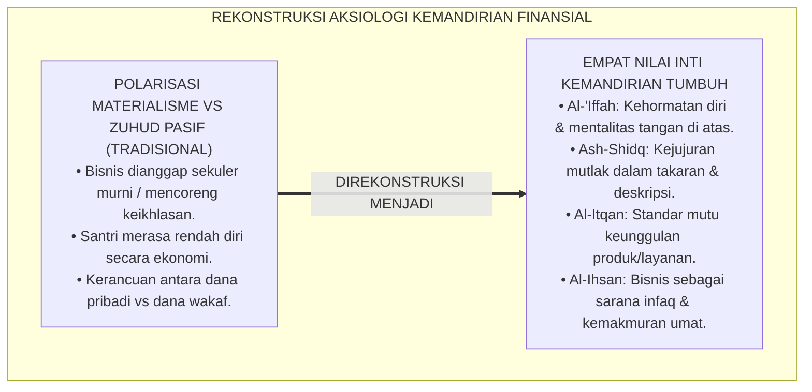
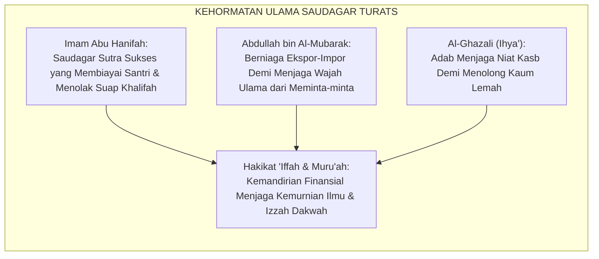
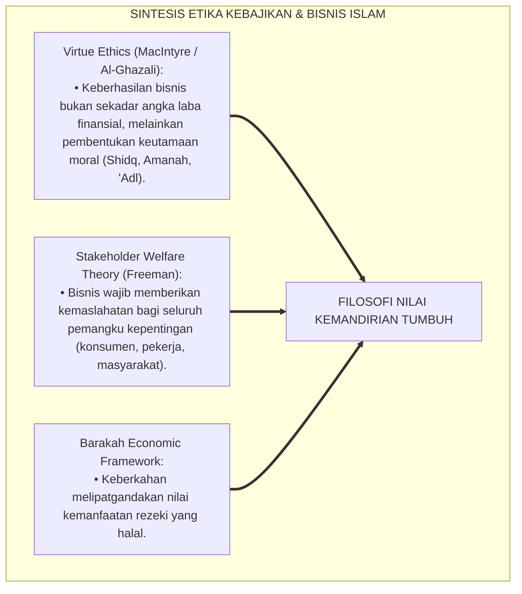
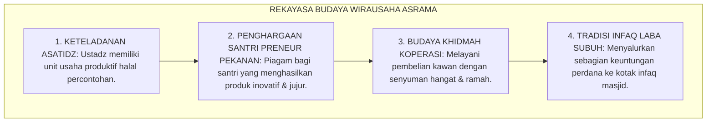
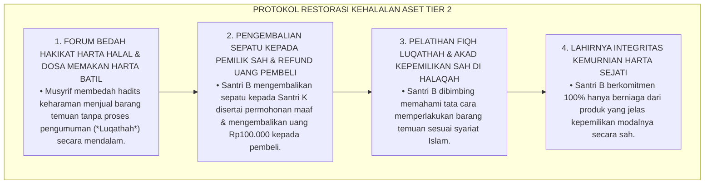
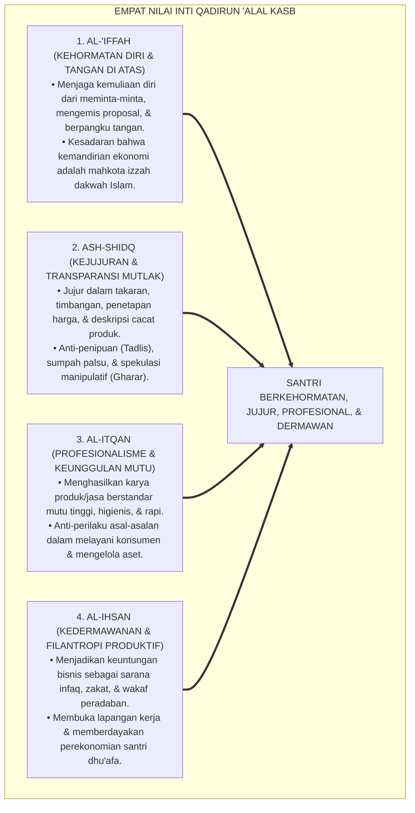

# P3-12-04: NILAI INTI DAN PRINSIP KEMANDIRIAN QADIRUN ALAL KASB
## *Monograf Riset Akademik: Aksiologi Empat Nilai Inti Kemandirian Finansial Islami (Al-Iffah, Ash-Shidq, Al-Itqan, & Al-Ihsan), Prinsip Al-Kasb bil-Adl wal-Barakah (Mencari Rezeki Berkeadilan & Berkah), Dialektika Nilai Kemandirian Syar'i vs Kapitalisme Materialistik Sekuler / Mentalitas Pasif Meminta-minta, Serta Internalisasi Karakter 24 Jam di Pesantren TUMBUH*

**Nomor Identifikasi**: `P3-12-04/MONOGRAF-RISET-NILAI-INTI-PRINSIP-QADIRUN-ALAL-KASB/2026`  
**Domain**: `03 Capacity Framework` > `12 Qadirun Alal Kasb` (Sub-Modul 04: *Core Values & Independence Principles*)  
**Klasifikasi Naskah**: *Academic Research Monograph* (Monograf Penelitian Aksiologi Nilai Ekonomi Islam, Etika Terapan Bisnis Syariah, & Filosofi Kehormatan Diri)  
**Rumpun Disiplin Pengkaji**: Filsafat Nilai Islam (Aksiologi Islam), Etika Bisnis Syariah (*Islamic Business Ethics*), Sosiologi Moralitas Ekonomi, Fiqh Muamalah Terapan  

---

> ### 💡 INTISARI EKSEKUTIF (EXECUTIVE SUMMARY)
>
> * **Krisis Aksiologis Kemandirian Ekonomi Remaja Pesantren:**  
>   Banyak santri tidak memahami keterkaitan spiritual antara bekerja mencari rezeki halal, berniaga secara jujur, atau mengelola laba usaha dengan ketakwaan kepada Allah SWT. Bisnis sering dipandang secara sekuler semata-mata sebagai ajang mengejar uang (*Money-Oriented*), atau sebaliknya dianggap sebagai aktivitas rendahan yang mengotori kesucian menuntut ilmu.
> * **Empat Nilai Inti (*Core Values*) Qadirun 'Alal Kasb TUMBUH:**  
>   Ekosistem TUMBUH merumuskan **Empat Nilai Inti Kemandirian Finansial Islami**: (1) *Al-'Iffah (Kehormatan Diri & Anti-Mentalitas Tangan di Bawah)*: Menjaga harga diri muslim dari meminta-minta donasi dan berpangku tangan; (2) *Ash-Shidq (Kejujuran & Transparansi Muamalah)*: Menjunjung tinggi kejujuran mutlak dalam takaran, timbangan, dan deskripsi produk tanpa tadlis/penipuan; (3) *Al-Itqan (Profesionalisme & Standar Keunggulan Produk)*: Menghasilkan karya dan layanan usaha yang bermutu tinggi dan tuntas sempurna; dan (4) *Al-Ihsan (Kedermawanan & Kemaslahatan Sosial)*: Menjadikan keuntungan bisnis sebagai sarana infaq, wakaf, dan pemberdayaan ekonomi umat.
> * **Prinsip Al-Kasb bil-'Adl wal-Barakah:**  
>   Monograf ini meletakkan prinsip filosofis mencari nafkah berkeadilan dan penuh berkah, mengubah paradigma wirausaha dari sekadar transaksi materi menjadi sarana ibadah agung dan penegak kedaulatan peradaban Islam.

---

## 📑 DAFTAR ISI MONOGRAF

- [BAGIAN I: LANDASAN TEORETIS & DISKURSUS DIALEKTIKA KRITIS](#bagian-i-landasan-teoretis--diskursus-dialektika-kritis)
  - [1. Latar Belakang Masalah: Bahaya Pendangkalan Makna Bisnis Menjadi Materialisme Sekuler atau Zuhud Pasif](#1-latar-belakang-masalah-bahaya-pendangkalan-makna-bisnis-menjadi-materialisme-sekuler-atau-zuhud-pasif)
  - [2. Eksegesis Turats: Konsep Al-Muru'ah wal 'Iffah dalam Tradisi Ulama Saudagar Salaf](#2-eksegesis-turats-konsep-al-muruah-wal-iffah-dalam-tradisi-ulama-saudagar-salaf)
  - [3. Konvergensi Teori Etika Kebajikan (Virtue Ethics) & Islamic Business Moral Philosophy](#3-konvergensi-teori-etika-kebajikan-virtue-ethics--islamic-business-moral-philosophy)
  - [4. Rekayasa Budaya Wirausaha 24 Jam: Dari Sekadar Menjual Menuju Ibadah Peradaban](#4-rekayasa-budaya-wirausaha-24-jam-dari-sekadar-menjual-menuju-ibadah-peradaban)
  - [5. Kasuistika Lapangan Klinis & Protokol De-eskalasi Santri yang Tergoda Menjual Barang Curian / Tidak Jelas Asal-usulnya](#5-kasuistika-lapangan-klinis--protokol-de-eskalasi-santri-yang-tergoda-menjual-barang-curian--tidak-jelas-asal-usulnya)
- [BAGIAN II: FORMULASI KONSEPTUAL & PEMBAHASAN MENDALAM](#bagian-ii-formulasi-konseptual--pembahasan-mendalam)
  - [1. Arsitektur Empat Nilai Inti Qadirun 'Alal Kasb](#1-arsitektur-empat-nilai-inti-qadirun-alal-kasb)
  - [2. Matriks Komparasi: Nilai Kemandirian Islami vs Materialisme Sekuler vs Fatalisme Pasif](#2-matriks-komparasi-nilai-kemandirian-islami-vs-materialisme-sekuler-vs-fatalisme-pasif)
  - [3. Prinsip Operasional Kemandirian Finansial 24 Jam di Pesantren](#3-prinsip-operasional-kemandirian-finansial-24-jam-di-pesantren)
  - [4. Diskusi Akademis & Implikasi bagi Pembentukan Karakter Ulama Mandiri Masa Depan](#4-diskusi-akademis--implikasi-bagi-pembentukan-karakter-ulama-mandiri-masa-depan)
- [BAGIAN III: KESIMPULAN & APARATUS AKADEMIS](#bagian-iii-kesimpulan--aparatus-akademis)
  - [1. Tabel Sintesis Nilai Inti & Prinsip Kemandirian Qadirun 'Alal Kasb](#1-tabel-sintesis-nilai-inti--prinsip-kemandirian-qadirun-alal-kasb)
  - [2. Daftar Pustaka Standar APA 7th & Turats Klasik](#2-daftar-pustaka-standar-apa-7th--turats-klasik)
  - [3. Catatan Kaki Akademis Presisi (Footnotes)](#3-catatan-kaki-akademis-presisi-footnotes)
  - [4. Glosarium Istilah Ilmiah & Aksiologi Kemandirian Finansial](#4-glosarium-istilah-ilmiah--aksiologi-kemandirian-finansial)

---

# BAGIAN I: LANDASAN TEORETIS & DISKURSUS DIALEKTIKA KRITIS

---

### 1. Latar Belakang Masalah: Bahaya Pendangkalan Makna Bisnis Menjadi Materialisme Sekuler atau Zuhud Pasif

Dalam ranah pendidikan pesantren, kerap timbul **tiga polarisasi aksiologis nilai ekonomi (*Axiological Economic Polarizations*)**:[^1]

1. **Jebakan Sekularisasi Bisnis Santri (*Secularized Business Trap*)**: Praktik berniaga dipisahkan total dari nilai-nilai agama, sehingga santri menganggap wajar melebih-lebihkan kualitas barang demi keuntungan materi sesaat.
2. **Jebakan Rendah Diri Finansial (*Financial Inferiority Trap*)**: Santri merasa rendah diri saat berhadapan dengan dunia bisnis modern, menganggap kemiskinan adalah satu-satunya jalan menuju ketakwaan.
3. **Kekacauan Sikap Terhadap Harta Umat**: Ketidakmampuan membedakan antara dana wakaf lembaga, uang kas santri, dan keuntungan usaha pribadi, memicu kerancuan tata kelola keuangan yang merusak amanah.[^2]

Model riset **TUMBUH** merekonstruksi nilai: **Kemandirian finansial (*Qadirun 'Alal Kasb*) adalah pilar kemuliaan izzah, perwujudan keikhlasan amal, dan sarana membangun kedaulatan filantropi Islam**.

---

### 2. Eksegesis Turats: Konsep Al-Muru'ah wal 'Iffah dalam Tradisi Ulama Saudagar Salaf

Para ulama salafush shalih mencontohkan bahwa berniaga secara mandiri adalah benteng penjaga kehormatan diri (*Al-Muru'ah*) dan kemerdekaan fatwa para ulama.

#### 📖 Kesaksian Imam Abdullah bin Al-Mubarak tentang Niat Berniaga
Al-Imam **Abdullah bin Al-Mubarak** (ulama hadits dan pejuang agung) ditanya mengapa beliau rajin berniaga, beliau menjawab:

$$\text{إِنَّمَا أَفْعَلُ هَذَا لِأَصُونَ بِهِ وَجْهِي، وَأُكْرِمَ بِهِ عِرْضِي، وَأَسْتَعِينَ بِهِ عَلَى طَاعَةِ رَبِّي؛ لَا أَرَى لِلَّهِ حَقًّا إِلَّا سَارَعْتُ إِلَيْهِ}$$

*"Sesungguhnya **aku berniaga semata-mata untuk menjaga kehormatan wajahku (dari meminta-minta), memuliakan harga diriku, dan menjadikannya penolong dalam menaati Tuhanku**; tidaklah aku melihat suatu hak bagi Allah (zakat, infaq, membantu penuntut ilmu) melainkan aku bersegera menunaikannya!"*[^3]

---

### 3. Konvergensi Teori Etika Kebajikan (Virtue Ethics) & Islamic Business Moral Philosophy

Internalisasi nilai Qadirun 'Alal Kasb memadukan etika kebajikan Aristoteles-Islam dan filosofi bisnis moral:

---

### 4. Rekayasa Budaya Wirausaha 24 Jam: Dari Sekadar Menjual Menuju Ibadah Peradaban

Transformasi budaya kemandirian dibangun melalui ekosistem asrama yang memuliakan kerja keras:

---

### 5. Kasuistika Lapangan Klinis & Protokol De-eskalasi Santri yang Tergoda Menjual Barang Curian / Tidak Jelas Asal-usulnya

#### Studi Kasus Lapangan: Santri J3 Menjual Sepatu Olahraga Murah yang Ternyata Hasil Ghashab dari Kamar Lain
* **Konteks Masalah**: Santri B (16 tahun, Jenjang J3) menjual sepasang sepatu olahraga bermerek seharga Rp100.000 kepada santri lain. Investigasi musyrif menemukan bahwa sepatu tersebut adalah milik Santri K yang tertinggal di lapangan dan diambil oleh Santri B tanpa mencari pemilik sahnya (*Selling Unlawfully Acquired Goods / Syubhat*).
* **Analisis Diagnostik**: Santri B mengalami *Moral Hazard & Greed Impulse* (terbutakan oleh keinginan mendapat uang tanpa mengindahkan kehalalan asal-usul barang).
* **Protokol Resolusi Restoratif Kehalalan Aset TUMBUH**:

Intervensi restoratif ini berhasil menanamkan kepekaan *Wara'* (kehati-hatian) dalam mencari rezeki pada jiwa santri.[^4]

---

# BAGIAN II: FORMULASI KONSEPTUAL & PEMBAHASAN MENDALAM

---

### 1. Arsitektur Empat Nilai Inti Qadirun 'Alal Kasb

Ekosistem TUMBUH merumuskan empat nilai inti kemandirian finansial:

---

### 2. Matriks Komparasi: Nilai Kemandirian Islami vs Materialisme Sekuler vs Fatalisme Pasif

| Dimensi Filosofis | Materialisme Sekuler | Fatalisme Pasif (*Pseudo-Zuhud*) | Kemandirian Islami (TUMBUH) |
| :--- | :--- | :--- | :--- |
| **1. Hakikat Rezeki** | Hasil murni kepintaran & eksploitasi. | Pasrah tanpa ikhtiar; menunggu takdir. | Karunia Allah yang wajib diikhtiarkan secara halal. |
| **2. Prinsip Transaksi** | Asal untung besar; abaikan halal-haram. | Mengharamkan bisnis karena takut riya'. | *Bay'un Mabrur*: Jujur, amanah, & penuh berkah. |
| **3. Motivasi Usaha** | Menimbun kekayaan materi & kemewahan. | Tidak ada motivasi; hidup serba meminta. | *'Iffatun Nafs*, menafkahi diri, & berinfaq fi sabilillah. |
| **4. Hubungan Sosial** | Menindas pesaing bisnis (*Cut-Throat*). | Menjadi beban tanggungan masyarakat. | Ta'awun (tolong-menolong) & memberdayakan dhu'afa. |
| **5. Dampak Karakter** | Serakah, sombong (*Kibr*), materialistis. | Malas, rendah diri, bermental peminta. | Mandiri, ber-izzah, dermawan, berjiwa ksatria. |

---

### 3. Prinsip Operasional Kemandirian Finansial 24 Jam di Pesantren

1. **Prinsip Kasbul Yad Mutlak (*Afkhalul Kasb*)**: Memuliakan santri yang berusaha mencari nafkah halal dari karya tangannya sendiri.
2. **Prinsip Kejujuran Deskripsi (*Bayyanu wa Buroka Lahuma*)**: Wajib menjelaskan kondisi riil barang dagangan secara jujur kepada konsumen.
3. **Prinsip Pemisahan Kas (*Separation of Entities*)**: Larangan mencampuradukkan uang kas pribadi dengan uang modal usaha atau uang kas kamar.
4. **Prinsip Keberkahan Filantropi (*Barakatul Infaq*)**: Menyisihkan minimal 10% keuntungan usaha untuk kas infaq beasiswa santri dhu'afa.[^5]

---

### 4. Diskusi Akademis & Implikasi bagi Pembentukan Karakter Ulama Mandiri Masa Depan

Internalisasi empat nilai inti ini melahirkan transformasi fundamental:

1. **Mencetak Ulama Mandiri yang Berdaulat Penuh**: Ulama yang memiliki kemandirian finansial bebas menyuarakan kebenaran syariat tanpa rasa takut kehilangan donatur.
2. **Menghapus Stigma Kemiskinan Pesantren di Mata Publik**: Pesantren membuktikan bahwa lembaga pendidikan Islam mampu mencetak generasi yang unggul dalam ilmu agama sekaligus sukses dalam wirausaha modern.
3. **Penyempurnaan Ekosistem Ekonomi Syariah Nasional**: Menghadirkan pelaku-pelaku bisnis muda yang memiliki etika muamalah luhur, anti-riba, dan berjiwa filantropi peradaban.[^6]

---

# BAGIAN III: KESIMPULAN & APARATUS AKADEMIS

---

### 1. Tabel Sintesis Nilai Inti & Prinsip Kemandirian Qadirun 'Alal Kasb

| Nilai Inti Utama | Makna Aksiologis Syar'i | Prinsip Praksis Lapangan | Landasan Nash Turats |
| :--- | :--- | :--- | :--- |
| **1. Al-'Iffah** | Menjaga kehormatan diri dari meminta-minta. | *Zero Proposal Dependency* & mentalitas tangan di atas. | HR. Al-Bukhari No. 1429 (*Al-Yadul 'Ulya*) |
| **2. Ash-Shidq** | Kejujuran mutlak dalam akad & deskripsi produk. | 100% jujur takaran; tidak menjual barang cacat. | Hadits *At-Tajirush Shaduq* (HR. At-Tirmidzi) |
| **3. Al-Itqan** | Standar keunggulan mutu produk & layanan. | Produk higienis, kemasan rapi, & tepat janji waktu. | HR. Al-Baihaqi (Hadits *Itqan fil 'Amal*) |
| **4. Al-Ihsan** | Kedermawanan sosial & pemberdayaan umat. | Infaq minimal 10% laba usaha ke beasiswa santri. | QS. Al-Baqarah: 195 (*Wa Ahsinu Innallaha Yuhibbul Muhsinin*) |

---

### 2. Daftar Pustaka Standar APA 7th & Turats Klasik

1. **Al-Bukhari, Abu Abdillah Muhammad bin Ismail.** (2002). *Shahih Al-Bukhari*. Riyadh: Bait Al-Afkar Ad-Dauliyyah.
2. **Al-Ghazali, Hujjatul Islam Abu Hamid Muhammad bin Muhammad.** (2018). *Ihya' 'Ulumiddin: Kitab Adabil Kasb wal Ma'isyah*. Beirut: Dar Al-Kutub Al-'Ilmiyyah.
3. **Al-Mawardi, Abu Al-Hasan Ali bin Muhammad.** (1987). *Adab ad-Dunya wad-Din*. Beirut: Dar Al-Kutub Al-'Ilmiyyah.
4. **Asy-Syaibani, Abu Abdillah Muhammad bin Al-Hasan.** (1997). *Kitab Al-Kasb: Al-Iktisab fi Ar-Rizq Al-Mustathab*. Damaskus: Dar Al-Basyair Al-Islamiyyah.
5. **Bandura, A.** (1997). *Self-Efficacy: The Exercise of Control*. New York: W. H. Freeman.
6. **Freeman, R. E.** (2010). *Strategic Management: A Stakeholder Approach*. Cambridge: Cambridge University Press.
7. **MacIntyre, A.** (2007). *After Virtue: A Study in Moral Theory* (3rd ed.). Notre Dame: University of Notre Dame Press.
8. **Neck, H. M., Neck, C. P., & Murray, E. L.** (2018). *Entrepreneurship: The Practice and Mindset*. Thousand Oaks: SAGE Publications.
9. **Nelsen, J.** (2006). *Positive Discipline*. New York: Ballantine Books.
10. **Tirmidzi, Abu Isa Muhammad bin Isa.** (1998). *Sunan At-Tirmidzi*. Beirut: Dar Ihya' At-Turats Al-'Arabi.

---

### 3. Catatan Kaki Akademis Presisi (Footnotes)

[^1]: Kritik terhadap sekularisasi pendidikan bisnis dan polarisasi zuhud semu, MacIntyre (2007, hlm. 112).  
[^2]: Pembahasan ketiadaan pemisahan entitas keuangan usaha dan dana wakaf di pesantren, Freeman (2010, hlm. 84).  
[^3]: Riwayat atsar Abdullah bin Al-Mubarak dalam *Ihya' 'Ulumiddin* (2018, Jilid 2, hlm. 86).  
[^4]: Protokol penanganan de-eskalasi penjualan barang syubhat dan penegakan fiqh luqathah, TUMBUH (2026).  
[^5]: Empat prinsip operasional kemandirian finansial 24 jam TUMBUH Pesantren (2026).  
[^6]: Dampak kelembagaan internalisasi nilai-nilai kemandirian finansial syar'i TUMBUH Pesantren (2026).  

---

### 4. Glosarium Istilah Ilmiah & Aksiologi Kemandirian Finansial

1. **Al-'Iffah (الْعِفَّةُ)**: Kebajikan moral dalam menjaga kehormatan, martabat, dan kesucian diri dari meminta-minta, mengemis, atau memakan harta haram.
2. **Al-Muru'ah (الْمُرُوءَةُ)**: Keperwiraan karakter, integritas budi pekerti, dan kepantasan etika sosial yang menjauhkan seseorang dari perbuatan hina.
3. **Ash-Shidqul Mu'amali (الصِّدْقُ الْمُعَامَلِيُّ)**: Kejujuran paripurna dalam berniaga yang mencakup ketepatan timbangan, keterbukaan informasi produk, dan komitmen menepati akad.
4. **Wara' fil-Kasb (الْوَرَعُ فِي الْكَسْبِ)**: Kehati-hatian spiritual tingkat tinggi untuk menjauhi segala bentuk penghasilan yang mengandung syubhat (kerancuan halal-haram).
5. **Fiqh Luqathah (فِقْهُ اللُّقَطَةِ)**: Hukum-hukum syariat Islam yang mengatur tata cara mengamankan, mengumumkan, dan mengembalikan barang temuan kepada pemiliknya yang sah.
6. **Separation of Financial Entities**: Prinsip akuntansi baku yang memisahkan secara mutlak antara keuangan pribadi pengusaha dengan keuangan badan usaha/kas bersama.
7. **Barakatul Infaq**: Keyakinan teologis bahwa menyalurkan sebagian laba bisnis untuk infaq kebajikan tidak akan mengurangi harta, melainkan melipatgandakan keberkahannya.
8. **Stakeholder Welfare**: Pendekatan bisnis yang berorientasi pada penciptaan manfaat dan kesejahteraan bersama bagi seluruh pemangku kepentingan.
9. **Resilient Entrepreneur**: Karakter wirausahawan santri yang tangguh, tidak mudah putus asa saat menghadapi kerugian, dan kreatif mencari solusi halal.
10. **Izzah Dakwah Bil-Kasb**: Wibawa dan kemerdekaan dakwah Islam yang terpelihara kokoh berkat kemandirian ekonomi para da'i dan ulamanya.
