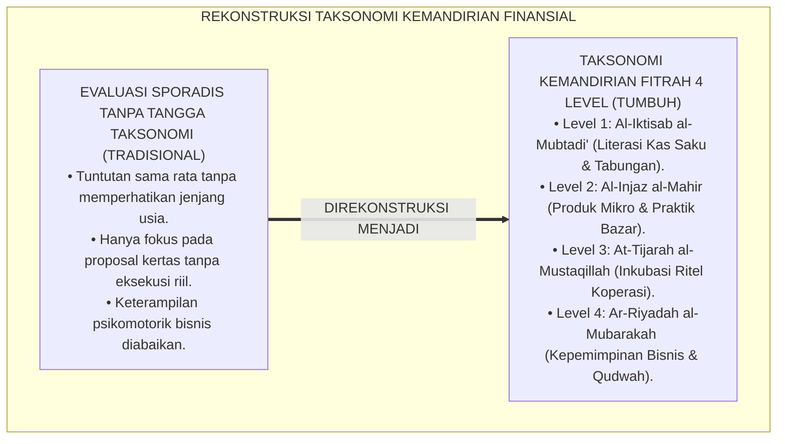
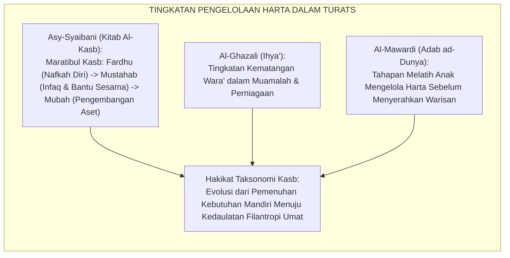
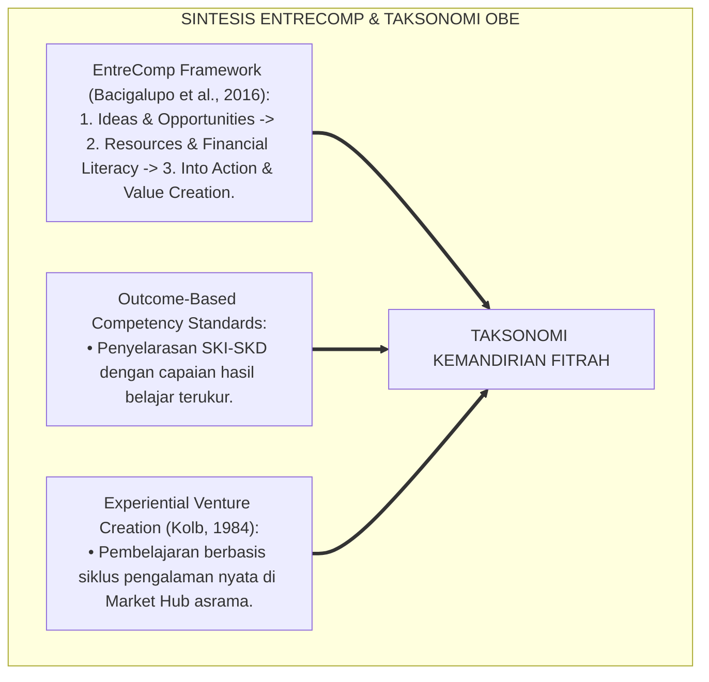
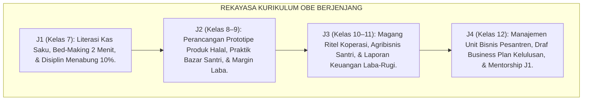
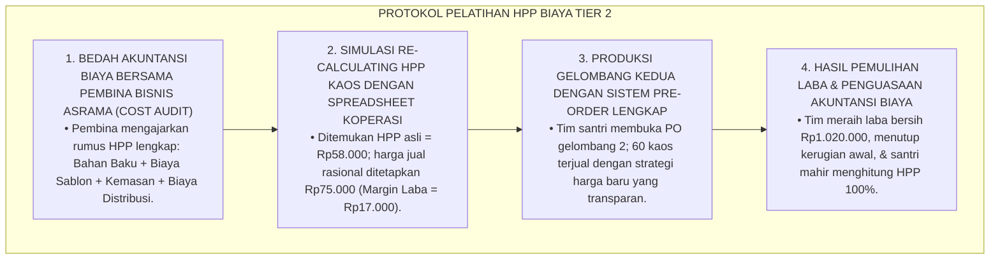
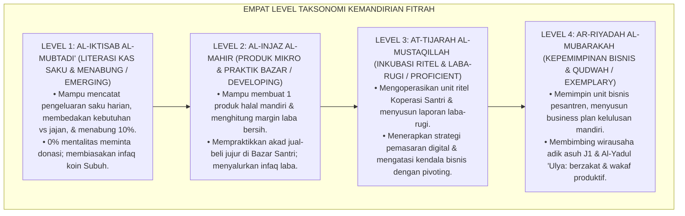
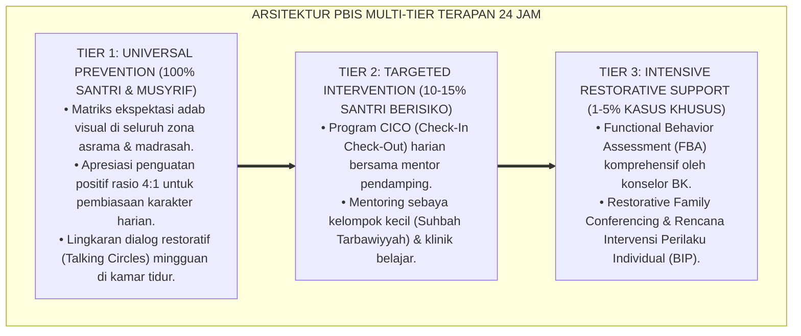

# P3-12-05: STANDAR KOMPETENSI DAN TAKSONOMI QADIRUN ALAL KASB
## *Monograf Riset Akademik: Taksonomi Kemandirian Finansial Fitrah 4 Level (Al-Iktisab al-Mubtadi' / Literasi Kas Saku & Disiplin Menabung, Al-Injaz al-Mahir / Penciptaan Produk Mikro & Praktik Bazar, At-Tijarah al-Mustaqillah / Inkubasi Bisnis Ritel & Manajemen Laba-Rugi, Serta Ar-Riyadah al-Mubarakah / Kepemimpinan Unit Usaha & Filantropi Peradaban), Integrasi Taksonomi Kognitif-Psikomotorik OBE, Serta Matriks Standar Kompetensi Inti & Dasar (SKI-SKD) Jenjang J1–J4 di Ekosistem Pesantren Berbasis TUMBUH*

**Nomor Identifikasi**: `P3-12-05/MONOGRAF-RISET-STANDAR-KOMPETENSI-TAKSONOMI-QADIRUN-ALAL-KASB/2026`  
**Domain**: `03 Capacity Framework` > `12 Qadirun Alal Kasb` (Sub-Modul 05: *Competency Standards & Taxonomy*)  
**Klasifikasi Naskah**: *Academic Research Monograph* (Monograf Penelitian Desain Taksonomi Kewirausahaan Islam, Standarisasi Kompetensi OBE, & Psikomotorik Bisnis Mandiri)  
**Rumpun Disiplin Pengkaji**: Desain Taksonomi Pembelajaran, Standarisasi Kompetensi Kurikulum OBE, Psikologi Kognitif Kewirausahaan, Manajemen Pendidikan Vokasi Pesantren  

---

> ### 💡 INTISARI EKSEKUTIF (EXECUTIVE SUMMARY)
>
> * **Ketiadaan Taksonomi Kemandirian Finansial Berjenjang di Pesantren:**  
>   Banyak lembaga pendidikan Islam tidak memiliki tangga taksonomi baku untuk mengukur perkembangan kematangan ekonomi santri. Keterampilan bisnis hanya dinilai secara sporadis, tanpa membedakan antara santri baru yang baru belajar membedakan kebutuhan vs keinginan (*Emerging*) dengan santri senior yang sudah mampu mengelola unit ritel koperasi dan merancang rencana bisnis (*Exemplary*).
> * **Arsitektur Taksonomi Kemandirian Finansial Fitrah 4 Level TUMBUH:**  
>   Ekosistem TUMBUH merumuskan **Taksonomi Kemandirian Finansial Fitrah 4 Level**: (1) *Level 1: Al-Iktisab al-Mubtadi' (Literasi Kas Saku & Disiplin Menabung / Emerging)*: Mampu mencatat pengeluaran saku, hidup hemat, dan menabung 10%; (2) *Level 2: Al-Injaz al-Mahir (Penciptaan Nilai Mikro & Praktik Bazar / Developing)*: Mampu membuat 1 produk halal mandiri, menghitung margin laba, dan berjualan jujur di event asrama; (3) *Level 3: At-Tijarah al-Mustaqillah (Inkubasi Bisnis Ritel & Manajemen Laba-Rugi / Proficient)*: Mengoperasikan unit usaha Koperasi Santri, menyusun laporan keuangan laba-rugi, dan strategi pemasaran; dan (4) *Level 4: Ar-Riyadah al-Mubarakah (Kepemimpinan Bisnis & Filantropi / Exemplary)*: Memimpin unit usaha mandiri pesantren, menyusun business plan kelulusan, membimbing adik kelas J1, dan bermental tangan di atas (*Al-Yadul 'Ulya*).
> * **Matriks SKI-SKD Jenjang J1–J4 Terpadu:**  
>   Monograf ini memetakan Standar Kompetensi Inti (SKI) dan Standar Kompetensi Dasar (SKD) yang terintegrasi secara longitudinal sepanjang 6 tahun masa pendidikan santri (Kelas 7–12).

---

## 📑 DAFTAR ISI MONOGRAF

- [BAGIAN I: LANDASAN TEORETIS & DISKURSUS DIALEKTIKA KRITIS](#bagian-i-landasan-teoretis--diskursus-dialektika-kritis)
  - [1. Latar Belakang Masalah: Bahaya Evaluasi Keterampilan Bisnis Sporadis Tanpa Tangga Taksonomi](#1-latar-belakang-masalah-bahaya-evaluasi-keterampilan-bisnis-sporadis-tanpa-tangga-taksonomi)
  - [2. Eksegesis Turats: Konsep Maratibul Kasb & Tahapan Kemandirian Ekonomi dalam Fiqh Muamalah](#2-eksegesis-turats-konsep-maratibul-kasb--tahapan-kemandirian-ekonomi-dalam-fiqh-muamalah)
  - [3. Konvergensi Sains Taksonomi Kewirausahaan (Bacigalupo/EntreComp) & Teori Efikasi Diri Ekonomi](#3-konvergensi-sains-taksonomi-kewirausahaan-bacigalupoentrecomp--teori-efikasi-diri-ekonomi)
  - [4. Analisis Rekayasa Kurikulum OBE 24 Jam: Dari Buku Saku Menuju Kedaulatan Wirausaha Mandiri](#4-analisis-rekayasa-kurikulum-obe-24-jam-dari-buku-saku-menuju-kedaulatan-wirausaha-mandiri)
  - [5. Kasuistika Lapangan Klinis & Protokol Pendampingan Santri J3 yang Mengalami Kesulitan Menghitung Harga Pokok Penjualan (HPP)](#5-kasuistika-lapangan-klinis--protokol-pendampingan-santri-j3-yang-mengalami-kesulitan-menghitung-harga-pokok-penjualan-hpp)
- [BAGIAN II: FORMULASI KONSEPTUAL & PEMBAHASAN MENDALAM](#bagian-ii-formulasi-konseptual--pembahasan-mendalam)
  - [1. Arsitektur Taksonomi Kemandirian Finansial Fitrah Empat Level TUMBUH](#1-arsitektur-taksonomi-kemandirian-finansial-fitrah-empat-level-tumbuh)
  - [2. Matriks Rinci Standar Kompetensi Inti (SKI) dan Standar Kompetensi Dasar (SKD) Jenjang J1–J4](#2-matriks-rinci-standar-kompetensi-inti-ski-dan-standar-kompetensi-dasar-skd-jenjang-j1j4)
  - [3. Kriteria Verifikasi Kinerja dan Portofolio Bisnis Mandiri Santri](#3-kriteria-verifikasi-kinerja-dan-portofolio-bisnis-mandiri-santri)
  - [4. Diskusi Akademis & Implikasi bagi Tata Kelola Pembinaan Vokasi Pesantren Abad 21](#4-diskusi-akademis--implikasi-bagi-tata-kelola-pembinaan-vokasi-pesantren-abad-21)
- [BAGIAN III: KESIMPULAN & APARATUS AKADEMIS](#bagian-iii-kesimpulan--aparatus-akademis)
  - [1. Tabel Sintesis Standar Kompetensi & Taksonomi Qadirun 'Alal Kasb](#1-tabel-sintesis-standar-kompetensi--taksonomi-qadirun-alal-kasb)
  - [2. Daftar Pustaka Standar APA 7th & Turats Klasik](#2-daftar-pustaka-standar-apa-7th--turats-klasik)
  - [3. Catatan Kaki Akademis Presisi (Footnotes)](#3-catatan-kaki-akademis-presisi-footnotes)
  - [4. Glosarium Istilah Ilmiah & Taksonomi Kewirausahaan](#4-glosarium-istilah-ilmiah--taksonomi-kewirausahaan)

---

# BAGIAN I: LANDASAN TEORETIS & DISKURSUS DIALEKTIKA KRITIS

---

### 1. Latar Belakang Masalah: Bahaya Evaluasi Keterampilan Bisnis Sporadis Tanpa Tangga Taksonomi

Dalam praksis pendidikan kewirausahaan di madrasah dan asrama pesantren, kerap timbul **tiga distorsi pedagogis kurikulum (*Curricular Pedagogical Distortions*)**:[^1]

1. **Jebakan Penilaian Tanpa Gradasi Kematangan (*Gradationless Assessment Trap*)**: Santri baru dan santri senior dituntut membuat rencana bisnis yang sama rumitnya, sehingga santri baru merasa putus asa dan santri senior merasa bosan.
2. **Ketiadaan Pembagian Jenjang Kompetensi Finansial**: Kurikulum tidak membedakan antara kompetensi mengelola uang saku pribadi (tahap dasar) dengan kompetensi mengelola modal usaha ritel dan menganalisis arus kas (tahap mahir).
3. **Pengabaian Keterampilan Psikomotorik Eksekusi Usaha**: Santri hanya diajarkan membuat proposal bisnis di atas kertas (*Business Plan on Paper*), tanpa pernah dilatih keterampilan psikomotorik melayani pembeli, mengoperasikan kasir, dan menata rak display produk.[^2]

Model riset **TUMBUH** merancang **Taksonomi Kemandirian Finansial Fitrah 4 Level** yang menyelaraskan perkembangan kognitif, afektif, dan psikomotorik santri secara terpadu.

---

### 2. Eksegesis Turats: Konsep Maratibul Kasb & Tahapan Kemandirian Ekonomi dalam Fiqh Muamalah

Khazanah fiqh muamalah membedakan tahapan kecakapan mengelola harta (*Maratibul Kasb wal Maliyyah*) dari tahap penjagaan nafkah dasar hingga derajat kemandirian berniaga penuh (*Tijarah Mustaqillah*).

#### 📖 Formulasi Imam Asy-Syaibani tentang Tingkatan Kasb
Imam **Muhammad bin Al-Hasan Asy-Syaibani** menjelaskan dalam *Kitab Al-Kasb*:

$$\text{مَرَاتِبُ الْكَسْبِ عَلَى ثَلَاثَةِ أَوْجُهٍ: فَرْضٌ، وَهُوَ مَا يَسُدُّ بِهِ جَوْعَتَهُ وَيَقْضِي بِهِ دَيْنَهُ وَيُغْنِي نَفْسَهُ عَنِ السُّؤَالِ؛ وَمُسْتَحَبٌّ، وَهُوَ مَا يَتَوَسَّعُ بِهِ عَلَى عِيَالِهِ وَيُوَاسِي بِهِ إِخْوَانَهُ الْفُقَرَاءَ؛ وَمُبَاحٌ، وَهُوَ مَا يَبْتَغِي بِهِ تَنْمِيَةَ الْمَالِ حَلَالًا بِلَا فَخْرٍ وَلَا تَكَاثُرٍ}$$

*"**Tingkatan mencari nafkah (*Maratibul Kasb*) terbagi atas tiga martabat**: (1) **Fardhu**, yaitu apa yang dengannya seseorang menutup rasa laparnya, melunasi hutangnya, dan mencukupkan dirinya dari meminta-minta; (2) **Mustahab (Sunnah)**, yaitu apa yang dengannya ia melapangkan nafkah keluarganya dan menyantuni saudara-saudaranya yang faqir; dan (3) **Mubah**, yaitu apa yang dengannya ia bertujuan mengembangkan harta secara halal tanpa kesombongan dan tanpa bermegah-megahan!"*[^3]

---

### 3. Konvergensi Sains Taksonomi Kewirausahaan (Bacigalupo/EntreComp) & Teori Efikasi Diri Ekonomi

Taksonomi Qadirun 'Alal Kasb memadukan kerangka kompetensi kewirausahaan Uni Eropa (*EntreComp Framework*) dan teori efikasi diri Albert Bandura:

---

### 4. Analisis Rekayasa Kurikulum OBE 24 Jam: Dari Buku Saku Menuju Kedaulatan Wirausaha Mandiri

Kurikulum kemandirian finansial diorganisasikan secara berjenjang selaras dengan fase kematangan santri:

---

### 5. Kasuistika Lapangan Klinis & Protokol Pendampingan Santri J3 yang Mengalami Kesulitan Menghitung Harga Pokok Penjualan (HPP)

#### Studi Kasus Lapangan: Santri J3 Menjual Kaos Dakwah Santri Namun Merugi Karena Lupa Memasukkan Biaya Kemasan & Ongkos Kirim
* **Konteks Masalah**: Tim Santri J3 memproduksi 50 lembar Kaos Sablon Dakwah. Mereka menetapkan harga jual Rp60.000 dengan perkiraan untung Rp10.000 per kaos (karena harga kain Rp50.000). Namun saat pembukuan akhir, mereka merugi Rp250.000 karena lupa menghitung biaya sablon, plastik kemasan, dan ongkos kirim kain (*Costing Accounting Failure*).
* **Analisis Diagnostik**: Santri mengalami *Costing Miscalculation* akibat belum memahami konsep Harga Pokok Penjualan (HPP) secara komprehensif.
* **Protokol Remediasi Pelatihan HPP & Akuntansi Biaya TUMBUH**:

Pendekatan edukatif berbasis bedah kasus nyata ini mengubah kesalahan hitung menjadi pemahaman akuntansi biaya yang sangat kokoh.[^4]

---

# BAGIAN II: FORMULASI KONSEPTUAL & PEMBAHASAN MENDALAM

---

### 1. Arsitektur Taksonomi Kemandirian Finansial Fitrah Empat Level TUMBUH

Ekosistem TUMBUH menetapkan empat level kematangan kemandirian finansial:

---

### 2. Matriks Rinci Standar Kompetensi Inti (SKI) dan Standar Kompetensi Dasar (SKD) Jenjang J1–J4

#### Matriks SKI-SKD Kapasitas Qadirun 'Alal Kasb:

| Jenjang & Level Taksonomi | Standar Kompetensi Inti (SKI) | Standar Kompetensi Dasar (SKD) |
| :--- | :--- | :--- |
| **Jenjang J1 (Kelas 7) *Level 1: Al-Iktisab al-Mubtadi'*** | Mampu memahami literasi finansial dasar, mengelola uang saku secara hemat, dan membiasakan mentalitas tangan di atas dengan panduan terstruktur. | **1.1** Mencatat seluruh pemasukan dan pengeluaran saku pada buku kas saku harian. **1.2** Membedakan antara kebutuhan primer (*Dharuriyyat*) dengan keinginan konsumtif. **1.3** Menyisihkan minimal 10% uang saku untuk pos tabungan terencana. **1.4** Membiasakan sedekah koin fajar harian demi menanamkan jiwa dermawan. |
| **Jenjang J2 (Kelas 8–9) *Level 2: Al-Injaz al-Mahir*** | Mampu merancang produk karya mandiri sederhana, menghitung modal dan margin keuntungan, serta mempraktikkan perniagaan jujur pada skala mikro. | **2.1** Merancang minimal 1 prototipe produk kerajinan/kuliner halal bernilai tambah. **2.2** Menghitung Harga Pokok Penjualan (HPP), harga jual, dan margin laba bersih. **2.3** Mempraktikkan akad jual-beli syar'i yang jujur dan bebas dari tadlis/gharar. **2.4** Menyalurkan minimal 10% keuntungan perdana ke kas infaq sosial asrama. |
| **Jenjang J3 (Kelas 10–11) *Level 3: At-Tijarah al-Mustaqillah*** | Mampu mengoperasikan unit usaha ritel/agribisnis asrama, menyusun laporan keuangan laba-rugi, dan menerapkan strategi pemasaran halal adaptif. | **3.1** Menjalankan magang operasional di unit Koperasi Santri / Greenhouse Agribisnis. **3.2** Menyusun laporan keuangan pembukuan kas laba-rugi usaha secara berkala. **3.3** Menerapkan strategi promosi, kemasan kreatif, dan pemasaran berbasis pre-order. **3.4** Mengatasi hambatan operasional dan fluktuasi pasar dengan metode pivoting. |
| **Jenjang J4 (Kelas 12) *Level 4: Ar-Riyadah al-Mubarakah*** | Mampu menampilkan kepemimpinan wirausaha syariah mandiri, menyusun rencana bisnis masa depan, dan mendampingi rintisan usaha adik kelas. | **4.1** Memimpin dan mengkoordinasikan unit usaha bisnis mandiri santri secara amanah. **4.2** Menyusun draf rencana bisnis mandiri (*Comprehensive Business Plan*) kelulusan. **4.3** Membimbing dan menjadi mentor wirausaha adik asuh jenjang J1. **4.4** Menampilkan kepribadian ksatria berpenghasilan mandiri dan berjiwa wakaf peradaban. |

---

### 3. Kriteria Verifikasi Kinerja dan Portofolio Bisnis Mandiri Santri

Sebagai bukti ketercapaian kompetensi:
1. **Portofolio Rintisan Usaha Mandiri**: Berkas laporan produk, bukti transaksi penjualan, dan catatan laba bersih yang diverifikasi oleh pembina bisnis asrama.
2. **Laporan Pembukuan Laba-Rugi Terstandar**: Laporan keuangan sederhana yang memuat HPP, omset, biaya operasional, dan saldo laba bersih.
3. **Sertifikat Kelulusan Wirausaha Santri (Santri Preneur Certificate)**: Diberikan kepada santri yang tuntas mengelola proyek bisnis halal dengan predikat mabrur.[^5]

---

### 4. Diskusi Akademis & Implikasi bagi Tata Kelola Pembinaan Vokasi Pesantren Abad 21

Penerapan taksonomi kemandirian finansial fitrah melahirkan lompatan mutu pendidikan:

1. **Transformasi Pesantren Menjadi Inkubator Wirausaha Muda Syariah**: Pesantren tidak hanya mencetak ahli tafsir dan hadits, namun juga mencetak praktisi bisnis yang berintegritas tinggi.
2. **Kesiapan Menghadapi Kemandirian Hidup Dewasa**: Alumni santri memiliki keahlian nyata menghasilkan nafkah halal, siap membiayai kuliahnya secara mandiri dan membuka lapangan kerja.
3. **Penyempurnaan Standar Akreditasi Pendidikan Pesantren Terpadu**: Pesantren membuktikan bahwa kurikulum berbasis OBE dapat mengintegrasikan ilmu syariat dengan kemandirian ekonomi secara harmonis.[^6]

---

---

### Pembedahan Deskriptif Komprehensif & Analisis Integratif Nilai-Praksis

Penerapan konsep **P3-12-05: STANDAR KOMPETENSI DAN TAKSONOMI QADIRUN ALAL KASB** di ekosistem pesantren berbasis sistem TUMBUH memerlukan pemahaman multidimensional yang memadukan khazanah turats syariat dan konsensus sains pendidikan modern:

#### A. Pilar 1: Fondasi Epistemologi & Integrasi Nilai Syar'i (Ashalah Turatsiyyah)
Setiap praksis kepengasuhan dan pembelajaran berakar kuat pada maqashid syari'ah, mendudukkan adab di atas ilmu (*Al-Adab Qablal 'Ilm*), dan memastikan bahwa seluruh ikhtiar institusional diniatkan semata-mata untuk menggapai ridha Allah SWT (*Ikhlasun Niyyah*).

#### B. Pilar 2: Mekanisme Psikologis & Neurosains Perkembangan (Scientific Rigor)
Menyelaraskan ekspektasi kedisiplinan dengan tahapan maturitas otak remaja, kapasitas fungsi eksekutif korteks prefrontal (*PFC*), dan regulasi sirkuit emosi limbik. Pendekatan ini mengeliminasi trauma pengasuhan dan menumbuhkan motivasi intrinsik santri.

#### C. Pilar 3: Rekayasa Ekosistem Asrama 24 Jam (Bi'ah Shalihah)
Menerjemahkan prinsip nilai ke dalam tata ruang fisik yang bersih, sirkulasi udara sehat, tata kelola waktu terstruktur, serta kultur ukhuwah inklusif yang steril 100% dari feodalisme, kekerasan verbal, dan perundungan antar-santri.

#### D. Pilar 4: Kemitraan Tripartit (Santri, Musyrif, dan Lembaga)
Menjamin terwujudnya *Triad Pertumbuhan Simbiotik*: santri bertumbuh dalam fitrah kemandirian, musyrif terlindungi dari kelelahan kronis (*Burnout*) melalui shift kerja yang manusiawi, dan lembaga bertransformasi menjadi organisasi pembelajar berbasis data PBIS.

---

### Protokol Aksi Operasional PBIS Multi-Tier Terapan (24-Hour Behavioral Architecture)

---

# BAGIAN III: KESIMPULAN & APARATUS AKADEMIS

---

### 1. Tabel Sintesis Standar Kompetensi & Taksonomi Qadirun 'Alal Kasb

| Tingkat Taksonomi | Karakteristik Kematangan | Target Utama Jenjang | Standar EntreComp (2016) | Output Perilaku Teramati |
| :--- | :--- | :--- | :--- | :--- |
| **Level 1: Al-Iktisab** | Literasi kas saku & hemat belanja. | Jenjang J1 (Kelas 7) | *Financial Literacy & Resources* | Buku kas tercatat rapi, tabungan 10%, infaq fajar. |
| **Level 2: Al-Injaz** | Produk mikro & praktik bazar jujur. | Jenjang J2 (Kelas 8–9) | *Ideas & Value Creation* | 1 Prototipe produk halal, hitung HPP, laba perdana. |
| **Level 3: At-Tijarah** | Inkubasi ritel & laporan laba-rugi. | Jenjang J3 (Kelas 10–11) | *Into Action & Financial Management* | Magang koperasi, laporan laba-rugi, pivoting usaha. |
| **Level 4: Ar-Riyadah** | Kepemimpinan bisnis & filantropi. | Jenjang J4 (Kelas 12) | *Leadership & Value Scaling* | Business plan kelulusan, mentor J1, wakaf produktif. |

---

### 2. Daftar Pustaka Standar APA 7th & Turats Klasik

1. **Al-Ghazali, Hujjatul Islam Abu Hamid Muhammad bin Muhammad.** (2018). *Ihya' 'Ulumiddin*. Beirut: Dar Al-Kutub Al-'Ilmiyyah.
2. **Al-Mawardi, Abu Al-Hasan Ali bin Muhammad.** (1987). *Adab ad-Dunya wad-Din*. Beirut: Dar Al-Kutub Al-'Ilmiyyah.
3. **Asy-Syaibani, Abu Abdillah Muhammad bin Al-Hasan.** (1997). *Kitab Al-Kasb: Al-Iktisab fi Ar-Rizq Al-Mustathab*. Damaskus: Dar Al-Basyair Al-Islamiyyah.
4. **Bacigalupo, M., Kampylis, P., Punie, Y., & Van den Brande, G.** (2016). *EntreComp: The Entrepreneurship Competence Framework*. Luxembourg: Publication Office of the European Union.
5. **Bandura, A.** (1997). *Self-Efficacy: The Exercise of Control*. New York: W. H. Freeman.
6. **Kolb, D. A.** (1984). *Experiential Learning: Experience as the Source of Learning and Development*. Englewood Cliffs: Prentice-Hall.
7. **Neck, H. M., Neck, C. P., & Murray, E. L.** (2018). *Entrepreneurship: The Practice and Mindset*. Thousand Oaks: SAGE Publications.
8. **Nelsen, J.** (2006). *Positive Discipline*. New York: Ballantine Books.
9. **OECD.** (2020). *OECD/INFE 2020 International Survey of Adult Financial Literacy*. Paris: OECD Publishing.
10. **Spady, W. G.** (1994). *Outcome-Based Education: Critical Issues and Answers*. Arlington: American Association of School Administrators.

---

### 3. Catatan Kaki Akademis Presisi (Footnotes)

[^1]: Kritik terhadap ketiadaan taksonomi bertingkat dalam kurikulum kewirausahaan sekolah berasrama, Spady (1994, hlm. 76).  
[^2]: Pembahasan pentingnya taksonomi kompetensi kewirausahaan terstandarisasi EntreComp, Bacigalupo et al. (2016, hlm. 22).  
[^3]: Muhammad bin Al-Hasan Asy-Syaibani, *Kitab Al-Kasb* (1997, hlm. 48).  
[^4]: Protokol pelatihan penentuan HPP dan akuntansi biaya rintisan usaha santri, Neck, Neck, & Murray (2018, hlm. 128).  
[^5]: Kriteria verifikasi portofolio wirausaha mandiri dan sertifikasi kelulusan santri dalam sistem TUMBUH (2026).  
[^6]: Dampak kelembagaan penerapan taksonomi kemandirian finansial OBE terhadap akreditasi pesantren (2026).  

---

### 4. Glosarium Istilah Ilmiah & Taksonomi Kewirausahaan

1. **Taksonomi Kemandirian Finansial Fitrah**: Tangga evolusi kematangan santri dalam mengelola keuangan dan berwirausaha, dari literasi kas saku (Level 1) hingga kepemimpinan bisnis peradaban (Level 4).
2. **Al-Iktisab al-Mubtadi' (الْإِكْتِسَابُ الْمُبْتَدِئُ)**: Tingkat kematangan awal di mana santri mampu mengelola uang saku secara tertib, hidup hemat, dan menabung.
3. **Al-Injaz al-Mahir (الْإِنْجَازُ الْمَاهِرُ)**: Tingkat kematangan terampil di mana santri mampu merancang 1 produk karya halal dan mempraktikkan penjualan jujur.
4. **At-Tijarah al-Mustaqillah (التِّجَارَةُ الْمُسْتَقِلَّةُ)**: Tingkat kematangan mandiri di mana santri mampu mengoperasikan unit usaha ritel dan menyusun laporan laba-rugi.
5. **Ar-Riyadah al-Mubarakah (الرِّيَادَةُ الْمُبَارَكَةُ)**: Tingkat kematangan tertinggi di mana santri memimpin unit bisnis pesantren, membimbing adik kelas, dan berjiwa wakaf.
6. **EntreComp Framework**: Kerangka kompetensi kewirausahaan terstandar internasional yang mencakup 3 pilar: Peluang, Sumber Daya, dan Aksi Nyata.
7. **Harga Pokok Penjualan (HPP)**: Total biaya langsung yang dikeluarkan untuk memproduksi atau memperoleh barang dagangan yang siap dijual.
8. **Maratibul Kasb (مَرَاتِبُ الْكَسْبِ)**: Tingkatan hukum mencari nafkah dalam syariat Islam, dari derajat fardhu nafkah diri hingga derajat sunnah membantu dhu'afa.
9. **Santri Preneur Portfolio**: Kumpulan dokumen rencana bisnis, foto produk, rekam transaksi penjualan, dan laporan laba-rugi rintisan usaha santri.
10. **Comprehensive Business Plan**: Rencana bisnis utuh yang mencakup analisis pasar, strategi pemasaran, proyeksi keuangan, dan analisis risiko halal pasca-kelulusan.
