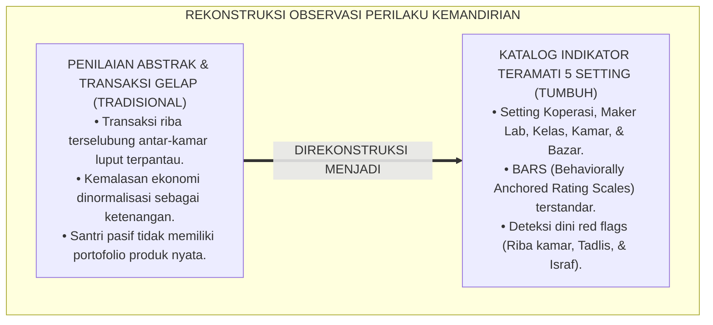
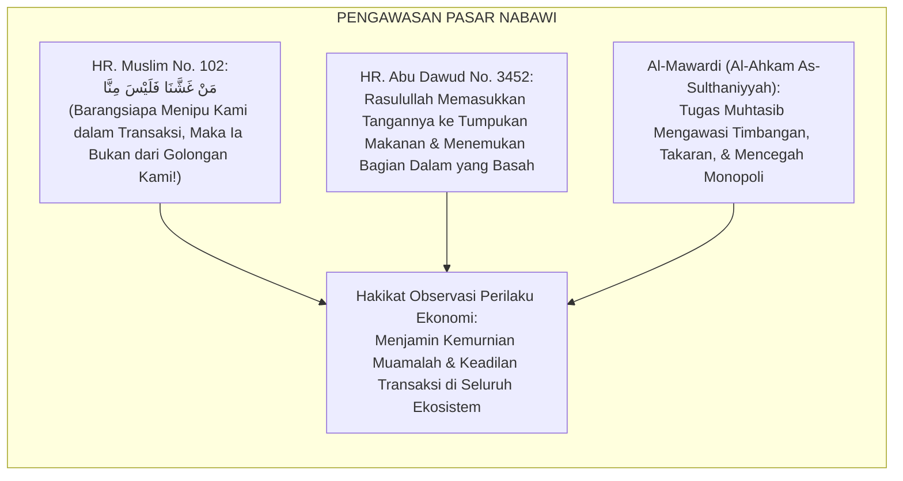
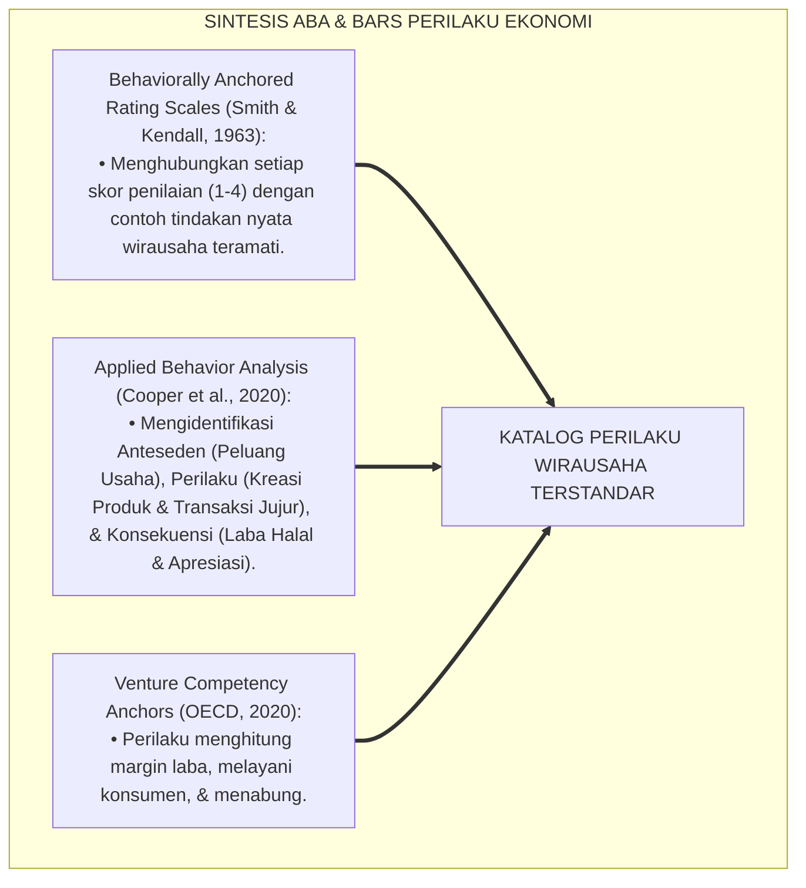
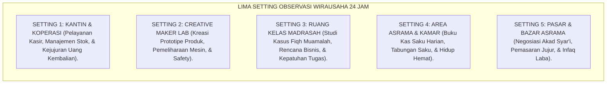
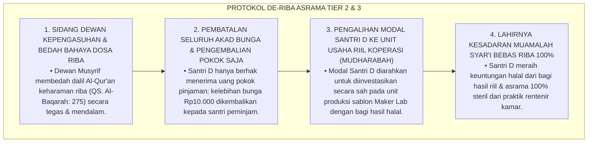
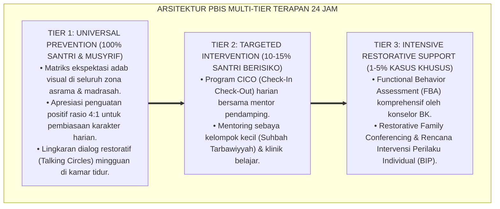

# P3-12-06: MANIFESTASI PERILAKU SANTRI QADIRUN ALAL KASB
## *Monograf Riset Akademik: Katalog Indikator Perilaku Teramati (Observable Behavioral Markers) Kemandirian Finansial Santri di Lima Setting Ekosistem 24 Jam (Kantin/Koperasi Santri, Creative Maker Lab & Workshop, Ruang Kelas Madrasah, Area Asrama/Kamar Tidur, Serta Pasar/Bazar Terbuka), Deteksi Dini Pola Mentalitas Pasif (Proposal Dependency, Penipuan Transaksi, & Sikap Boros), Serta Protokol Penguatan Perilaku Mandiri di Ekosistem Pesantren Berbasis TUMBUH*

**Nomor Identifikasi**: `P3-12-06/MONOGRAF-RISET-MANIFESTASI-PERILAKU-QADIRUN-ALAL-KASB/2026`  
**Domain**: `03 Capacity Framework` > `12 Qadirun Alal Kasb` (Sub-Modul 06: *Observable Behavioral Markers*)  
**Klasifikasi Naskah**: *Academic Research Monograph* (Monograf Penelitian Perilaku Ekonomi Terapan, Taksonomi Indikator Teramati, & Asesmen Kinerja Kewirausahaan 24 Jam)  
**Rumpun Disiplin Pengkaji**: Psikologi Perilaku Ekonomi, Sosiologi Mikro Kehidupan Asrama, Metodologi Observasi Klinis, Manajemen Perilaku Vokasi  

---

> ### 💡 INTISARI EKSEKUTIF (EXECUTIVE SUMMARY)
>
> * **Kelemahan Observasi Perilaku Kemandirian di Asrama:**  
>   Banyak musyrif dan guru menilai kemandirian santri secara abstrak tanpa memiliki katalog perilaku teramati (*Observable Behavioral Anchors*). Akibatnya, santri yang memiliki mentalitas meminta-minta uang saku berlebih kepada orang tua, santri yang melakukan transaksi jual-beli terlarang (seperti riba utang rokok/jajan), atau santri yang pasif secara ekonomi luput dari pantauan dan bimbingan.
> * **Katalog Indikator Perilaku Teramati di Lima Setting 24 Jam TUMBUH:**  
>   Ekosistem TUMBUH merumuskan katalog komprehensif perilaku kemandirian vs ketergantungan pasif di 5 setting kehidupan santri: (1) *Kantin & Koperasi Santri (Praktik kasir jujur, pelayanan ramah, audit stok rapi)*; (2) *Creative Maker Lab & Workshop (Kreasi prototipe produk, perawatan mesin/alat kerja, keselamatan kerja)*; (3) *Ruang Kelas Madrasah (Penerapan Fiqh Muamalah dalam studi kasus, kepatuhan tugas bisnis)*; (4) *Area Asrama & Kamar Tidur (Pencatatan kas saku, hidup hemat qana'ah, perawatan aset pribadi)*; dan (5) *Pasar & Event Bazar Asrama (Negosiasi akad syar'i, pemasaran jujur tanpa penipuan, penyaluran infaq laba)*.
> * **Protokol Deteksi Dini & Penguatan Perilaku 4:1:**  
>   Monograf ini menetapkan indikator bendera merah (*Red Flag Behavioral Markers*) untuk mendeteksi penipuan barang (*Tadlis*), utang macet, dan kepasifan ekonomi sebelum berkembang menjadi krisis moral di pesantren.

---

## 📑 DAFTAR ISI MONOGRAF

- [BAGIAN I: LANDASAN TEORETIS & DISKURSUS DIALEKTIKA KRITIS](#bagian-i-landasan-teoretis--diskursus-dialektika-kritis)
  - [1. Latar Belakang Masalah: Bahaya Penilaian Kemandirian Abstrak Tanpa Katalog Perilaku Baku](#1-latar-belakang-masalah-bahaya-penilaian-kemandirian-abstrak-tanpa-katalog-perilaku-baku)
  - [2. Eksegesis Turats: Pengawasan Pasar Nabawi & Kaidah Suqul Madinah](#2-eksegesis-turats-pengawasan-pasar-nabawi--kaidah-suqul-madinah)
  - [3. Konvergensi Applied Behavior Analysis (ABA) & Behavioral Anchored Rating Scales (BARS)](#3-konvergensi-applied-behavior-analysis-aba--behavioral-anchored-rating-scales-bars)
  - [4. Rekayasa Ekologi Asrama 24 Jam: Pemetaan 5 Setting Kehidupan & Isyarat Kemandirian Finansial](#4-rekayasa-ekologi-asrama-24-jam-pemetaan-5-setting-kehidupan--isyarat-kemandirian-finansial)
  - [5. Kasuistika Lapangan Klinis & Protokol Intervensi Santri yang Terjebak Praktik Riba Pinjam-Meminjam Uang Saku di Kamar](#5-kasuistika-lapangan-klinis--protokol-intervensi-santri-yang-terjebak-praktik-riba-pinjam-meminjam-uang-saku-di-kamar)
- [BAGIAN II: FORMULASI KONSEPTUAL & PEMBAHASAN MENDALAM](#bagian-ii-formulasi-konseptual--pembahasan-mendalam)
  - [1. Katalog Komprehensif Perilaku Teramati di Lima Setting Kehidupan 24 Jam](#1-katalog-komprehensif-perilaku-teramati-di-lima-setting-kehidupan-24-jam)
  - [2. Matriks Komparasi: Indikator Perilaku Kemandirian Positif vs Pola Ketergantungan Negatif](#2-matriks-komparasi-indikator-perilaku-kemandirian-positif-vs-pola-ketergantungan-negatif)
  - [3. Indikator Bendera Merah (Red Flags) Ketergantungan Ekonomi & Protokol Penguatan Rasio 4:1](#3-indikator-bendera-merah-red-flags-ketergantungan-ekonomi--protokol-penguatan-rasio-41)
  - [4. Diskusi Akademis & Implikasi bagi Penjaminan Mutu Iklim Kewirausahaan Pesantren](#4-diskusi-akademis--implikasi-bagi-penjaminan-mutu-iklim-kewirausahaan-pesantren)
- [BAGIAN III: KESIMPULAN & APARATUS AKADEMIS](#bagian-iii-kesimpulan--aparatus-akademis)
  - [1. Tabel Sintesis Katalog Manifestasi Perilaku Qadirun 'Alal Kasb](#1-tabel-sintesis-katalog-manifestasi-perilaku-qadirun-alal-kasb)
  - [2. Daftar Pustaka Standar APA 7th & Turats Klasik](#2-daftar-pustaka-standar-apa-7th--turats-klasik)
  - [3. Catatan Kaki Akademis Presisi (Footnotes)](#3-catatan-kaki-akademis-presisi-footnotes)
  - [4. Glosarium Istilah Ilmiah & Perilaku Ekonomi Asrama](#4-glosarium-istilah-ilmiah--perilaku-ekonomi-asrama)

---

# BAGIAN I: LANDASAN TEORETIS & DISKURSUS DIALEKTIKA KRITIS

---

### 1. Latar Belakang Masalah: Bahaya Penilaian Kemandirian Abstrak Tanpa Katalog Perilaku Baku

Dalam dinamika evaluasi kepengasuhan santri di asrama tradisional, kerap terjadi **tiga kelemahan pemantauan perilaku ekonomi (*Economic Behavioral Blindspots*)**:[^1]

1. **Jebakan Pengabaian Transaksi Gelap di Kamar (*The Dark Transaction Trap*)**: Santri melakukan praktik pinjam uang dengan bunga terselubung (misal: meminjam Rp20.000 harus mengembalikan Rp25.000 atau membelikan rokok), merusak moral syariat tanpa terdeteksi oleh musyrif.
2. **Ketiadaan Batas Perilaku Kerja Keras vs Kemalasan**: Santri yang hanya tidur seharian saat jam libur dianggap "santri tenang", sedangkan santri yang rajin membuat kerajinan tangan kaligrafi untuk dijual dianggap "terlalu sibuk urusan dunia".
3. **Pengabaian Perilaku Konsumtif Tanpa Kendali**: Santri menghabiskan uang kiriman orang tua untuk membeli makanan instan berlebihan dan menyewakan barang-barang fasilitas bersama untuk keuntungan pribadi.[^2]

Model riset **TUMBUH** merumuskan **Katalog Manifestasi Perilaku Teramati (Behavioral Anchors)** di 5 setting kehidupan santri untuk memastikan objektivitas evaluasi dan pembiasaan karakter kemandirian nyata.

---

### 2. Eksegesis Turats: Pengawasan Pasar Nabawi & Kaidah Suqul Madinah

Rasulullah SAW melakukan inspeksi pasar langsung (*Muhtasib Awwal*) di Pasar Madinah untuk memeriksa takaran gandum, kejujuran pedagang, dan melarang segala bentuk penipuan.

#### 📖 Hadits Riwayat Abu Hurairah RA tentang Larangan Menipu
Diriwayatkan dalam *Shahih Muslim*:

$$\text{أَنَّ رَسُولَ اللَّهِ صَلَّى اللَّهُ عَلَيْهِ وَسَلَّمَ مَرَّ عَلَى صُبْرَةِ طَعَامٍ، فَأَدْخَلَ يَدَهُ فِيهَا، فَنَالَتْ أَصَابِعُهُ بَلَلًا، فَقَالَ: مَا هَذَا يَا صَاحِبَ الطَّعَامِ؟ قَالَ: أَصَابَتْهُ السَّمَاءُ يَا رَسُولَ اللَّهِ! قَالَ: أَفَلَا جَعَلْتَهُ فَوْقَ الطَّعَامِ كَيْ يَرَاهُ النَّاسُ؟ مَنْ غَشَّنَا فَلَيْسَ مِنَّا}$$

*"Bahwa Rasulullah SAW melewati sebuah tumpukan gandum makanan, lalu beliau memasukkan tangannya ke dalam tumpukan tersebut dan jari-jari beliau menyentuh bagian yang basah. Beliau bertanya: 'Apa ini wahai pemilik makanan?' Ia menjawab: 'Terkena air hujan wahai Rasulullah!' Beliau bersabda: **'Mengapa tidak engkau letakkan bagian yang basah itu di atas agar orang-orang dapat melihatnya? Barangsiapa yang menipu kami, maka ia bukan dari golongan kami!'**"* (HR. Muslim No. 102).[^3]

---

### 3. Konvergensi Applied Behavior Analysis (ABA) & Behavioral Anchored Rating Scales (BARS)

Katalog perilaku Qadirun 'Alal Kasb dibangun di atas prinsip BARS dan analisis perilaku terapan:

---

### 4. Rekayasa Ekologi Asrama 24 Jam: Pemetaan 5 Setting Kehidupan & Isyarat Kemandirian Finansial

Perilaku kemandirian ekonomi diamati secara sistematis pada 5 zona kehidupan santri:

---

### 5. Kasuistika Lapangan Klinis & Protokol Intervensi Santri yang Terjebak Praktik Riba Pinjam-Meminjam Uang Saku di Kamar

#### Studi Kasus Lapangan: Santri J3 Menjadi 'Rentenir Kamar' dengan Meminjamkan Uang Saku Berbunga 25%
* **Konteks Masalah**: Santri D (16 tahun, Jenjang J3) memiliki tabungan saku cukup banyak. Ia meminjamkan uang kepada adik-adik kelas J1 yang kehabisan uang dengan syarat: pinjam Rp40.000 harus dikembalikan Rp50.000 saat kiriman tiba (*Internal Usury / Riba Nasi'ah*).
* **Analisis Diagnostik**: Santri D melakukan transaksi riba qardh yang diharamkan syariat dan memanfaatkan posisi lemah kawan sekamarnya (*Predatory Lending Behavior*).
* **Protokol De-Riba & Restorasi Muamalah Syar'i TUMBUH**:

Intervensi ini menghapus praktik rentenir terselubung dan mengalihkan modal santri ke sektor riil yang halal dan produktif.[^4]

---

# BAGIAN II: FORMULASI KONSEPTUAL & PEMBAHASAN MENDALAM

---

### 1. Katalog Komprehensif Perilaku Teramati di Lima Setting Kehidupan 24 Jam

#### Katalog Perilaku Positif (*Target Positive Markers*) di 5 Setting:

1. **Setting 1: Kantin & Koperasi Santri**
   - Menyerahkan uang kembalian secara tepat dan jujur tanpa mengurangi hak pembeli.
   - Melayani pembeli dengan adab islami (tersenyum, mengucap salam, dan terima kasih/Jazakallahu khairan).
   - Melakukan inventarisasi stok barang secara rapi dan melaporkan barang yang mendekati tanggal kedaluwarsa.
   - Menjaga kebersihan etalase dan meja kasir bebas dari ceceran makanan/minuman.

2. **Setting 2: Creative Maker Lab & Workshop**
   - Merancang prototipe produk kerajinan tangan/desain grafis yang memiliki nilai jual nyata.
   - Merawat peralatan kerja (mesin jahit, mesin sablon, alat pertukangan) dan menyimpannya di rak semula.
   - Menerapkan standar keselamatan kerja (*Safety First*) dan menjaga kebersihan lantai workshop setelah berkarya.

3. **Setting 3: Ruang Kelas Madrasah**
   - Mampu menganalisis status hukum akad-akad muamalah modern dalam diskusi kelas Fiqh Muamalah.
   - Menuntaskan tugas penyusunan rencana bisnis (*Business Plan*) tepat waktu dengan perhitungan BEP yang akurat.
   - Aktif memberikan ide-ide kreatif pemecahan masalah ekonomi umat dalam presentasi kelompok.

4. **Setting 4: Area Asrama & Kamar Tidur**
   - Mencatat pengeluaran jajan harian secara jujur di buku kas saku (*Cash-Flow Log*) setiap malam.
   - Menolak ajakan meminjam uang secara berlebihan atau meminjamkan uang dengan syarat tambahan (riba).
   - Merawat perlengkapan pribadi agar awet, tidak boros, dan menyisihkan pos tabungan terencana.

5. **Setting 5: Pasar & Event Bazar Asrama**
   - Menjelaskan deskripsi dan kondisi produk secara jujur kepada konsumen tanpa menyembunyikan cacat (*Zero Tadlis*).
   - Menetapkan harga jual yang rasional dan bersaing secara sehat tanpa menjatuhkan usaha kawan.
   - Menyalurkan minimal 10% keuntungan bersih hasil bazar ke kas infaq sosial asrama.[^5]

---

### 2. Matriks Komparasi: Indikator Perilaku Kemandirian Positif vs Pola Ketergantungan Negatif

| Setting Kehidupan 24 Jam | Perilaku Kemandirian Positif (Model TUMBUH) | Pola Ketergantungan Negatif (Pola Lama) |
| :--- | :--- | :--- |
| **1. Kantin & Koperasi** | Kasir jujur, ramah, stok tercatat rapi, uang kembalian tepat. | Mengambil jajan tanpa bayar, jutek, uang kas kasir selisih. |
| **2. Maker Lab & Workshop** | Menghasilkan karya produk bernilai jual, alat kerja terawat. | Merusak alat workshop, malas berkarya, meninggalkan sampah. |
| **3. Ruang Kelas** | Mahir hitung BEP & HPP, tugas bisnis tuntas, nalar kritis fiqh. | Mencontek tugas bisnis, pasif diskusi, tidak paham akad syar'i. |
| **4. Asrama & Kamar** | Buku kas tercatat rapi, tabungan 10%, hidup hemat qana'ah. | Uang saku habis dalam 3 hari, pinjam uang berbunga, boros jajan. |
| **5. Pasar & Bazar** | Pemasaran jujur tanpa tadlis, margin laba sehat, infaq laba. | Menipu cacat barang, sumpah palsu agar laku, laba ditimbun. |

---

### 3. Indikator Bendera Merah (Red Flags) Ketergantungan Ekonomi & Protokol Penguatan Rasio 4:1

#### 🚩 Tiga Indikator Bendera Merah (Red Flags Alert):
1. **Red Flag 1 (Indikasi Riba & Rentenir Kamar)**: Ditemukan praktik pinjam-meminjam uang antar-santri dengan syarat pengembalian berlebih atau denda keterlambatan.
2. **Red Flag 2 (Indikasi Penipuan Transaksi / Tadlis Akut)**: Santri menjual barang rusak/cacat kepada kawan dengan sengaja menyembunyikan kelemahannya.
3. **Red Flag 3 (Indikasi Kebangkrutan & Mentalitas Meminta-minta)**: Santri kehabisan uang saku secara terus-menerus dan terbiasa meminta-minta makanan/uang kepada kawan sekamar.

#### 🎯 Protokol Penguatan Perilaku Positif Rasio 4:1:
Musyrif dan pembina bisnis wajib memberikan minimal **4 kali penguatan/apresiasi verbal spesifik** untuk setiap 1 koreksi kesalahan transaksi (misal: *"Masya Allah Akhi Salman, kejujuranmu menjelaskan cacat barang daganganmu tadi adalah teladan pedagang surga!"*).[^6]

---

### 4. Diskusi Akademis & Implikasi bagi Penjaminan Mutu Iklim Kewirausahaan Pesantren

Penerapan katalog perilaku teramati ini melahirkan ekosistem muamalah yang bersih:

1. **Objektivitas Mutlak Evaluasi Vokasi**: Menghilangkan penilaian berbasis kesan subjektif dan memberikan tolok ukur kinerja yang jelas bagi santri.
2. **Terciptanya Ekosistem Perniagaan Asrama yang Penuh Berkah**: Menghapus total praktik riba kamar, penipuan timbangan, dan perselisihan jual-beli.
3. **Penyempurnaan Karakter Ksatria Kemandirian Santri**: Santri terbiasa mencari rezeki halal, menghargai kerja keras, dan bermental tangan di atas seumur hidup.[^7]

---

---

### Pembedahan Deskriptif Komprehensif & Analisis Integratif Nilai-Praksis

Penerapan konsep **P3-12-06: MANIFESTASI PERILAKU SANTRI QADIRUN ALAL KASB** di ekosistem pesantren berbasis sistem TUMBUH memerlukan pemahaman multidimensional yang memadukan khazanah turats syariat dan konsensus sains pendidikan modern:

#### A. Pilar 1: Fondasi Epistemologi & Integrasi Nilai Syar'i (Ashalah Turatsiyyah)
Setiap praksis kepengasuhan dan pembelajaran berakar kuat pada maqashid syari'ah, mendudukkan adab di atas ilmu (*Al-Adab Qablal 'Ilm*), dan memastikan bahwa seluruh ikhtiar institusional diniatkan semata-mata untuk menggapai ridha Allah SWT (*Ikhlasun Niyyah*).

#### B. Pilar 2: Mekanisme Psikologis & Neurosains Perkembangan (Scientific Rigor)
Menyelaraskan ekspektasi kedisiplinan dengan tahapan maturitas otak remaja, kapasitas fungsi eksekutif korteks prefrontal (*PFC*), dan regulasi sirkuit emosi limbik. Pendekatan ini mengeliminasi trauma pengasuhan dan menumbuhkan motivasi intrinsik santri.

#### C. Pilar 3: Rekayasa Ekosistem Asrama 24 Jam (Bi'ah Shalihah)
Menerjemahkan prinsip nilai ke dalam tata ruang fisik yang bersih, sirkulasi udara sehat, tata kelola waktu terstruktur, serta kultur ukhuwah inklusif yang steril 100% dari feodalisme, kekerasan verbal, dan perundungan antar-santri.

#### D. Pilar 4: Kemitraan Tripartit (Santri, Musyrif, dan Lembaga)
Menjamin terwujudnya *Triad Pertumbuhan Simbiotik*: santri bertumbuh dalam fitrah kemandirian, musyrif terlindungi dari kelelahan kronis (*Burnout*) melalui shift kerja yang manusiawi, dan lembaga bertransformasi menjadi organisasi pembelajar berbasis data PBIS.

---

### Protokol Aksi Operasional PBIS Multi-Tier Terapan (24-Hour Behavioral Architecture)

---

# BAGIAN III: KESIMPULAN & APARATUS AKADEMIS

---

### 1. Tabel Sintesis Katalog Manifestasi Perilaku Qadirun 'Alal Kasb

| Setting Observasi | Indikator Perilaku Target | Standar Baku Mutu | Alat Verifikasi Lapangan |
| :--- | :--- | :--- | :--- |
| **1. Kantin & Koperasi** | Kasir jujur, senyum ramah, uang kembalian tepat. | 100% presisi saldo kas kasir; 0 keluhan. | Buku Rekap Kasir Koperasi Santri. |
| **2. Maker Lab** | Merancang 1 prototipe produk bernilai jual. | Produk higienis/rapi; alat kerja tertata. | Lembar Kontrol Workshop Kreatif. |
| **3. Ruang Kelas** | Hitung HPP & BEP akurat; rencana bisnis tuntas. | Nilai Uji Kasus Fiqh Muamalah $\ge 90$. | Portofolio Rencana Bisnis Madrasah. |
| **4. Area Asrama** | Buku kas saku tercatat harian & tabungan saku. | 100% arus kas saku tercatat; 0 utang riba. | Buku Kas Saku Santri (Bulanan). |
| **5. Pasar & Bazar** | Pemasaran jujur tanpa tadlis & infaq laba $\ge 10\%$. | 0% kasus penipuan; bukti setor infaq laba. | Berita Acara Bazar & Sertifikat Infaq. |

---

### 2. Daftar Pustaka Standar APA 7th & Turats Klasik

1. **Al-Bukhari, Abu Abdillah Muhammad bin Ismail.** (2002). *Shahih Al-Bukhari*. Riyadh: Bait Al-Afkar Ad-Dauliyyah.
2. **Al-Ghazali, Hujjatul Islam Abu Hamid Muhammad bin Muhammad.** (2018). *Ihya' 'Ulumiddin: Kitab Adabil Kasb wal Ma'isyah*. Beirut: Dar Al-Kutub Al-'Ilmiyyah.
3. **Al-Mawardi, Abu Al-Hasan Ali bin Muhammad.** (2006). *Al-Ahkam As-Sulthaniyyah*. Beirut: Dar Al-Kutub Al-'Ilmiyyah.
4. **Cooper, J. O., Heron, T. E., & Heward, W. L.** (2020). *Applied Behavior Analysis*. Boston: Pearson.
5. **Muslim bin Al-Hajjaj An-Naisaburi.** (2006). *Shahih Muslim*. Riyadh: Dar Thayyibah.
6. **Neck, H. M., Neck, C. P., & Murray, E. L.** (2018). *Entrepreneurship: The Practice and Mindset*. Thousand Oaks: SAGE Publications.
7. **Nelsen, J.** (2006). *Positive Discipline*. New York: Ballantine Books.
8. **OECD.** (2020). *OECD/INFE 2020 International Survey of Adult Financial Literacy*. Paris: OECD Publishing.
9. **Smith, P. C., & Kendall, L. M.** (1963). *Retranslation of expectations: An approach to the construction of unambiguous anchors for rating scales*. *Journal of Applied Psychology*, 47(2), 149-155.
10. **Sugai, G., & Horner, R. H.** (2020). *School-Wide Positive Behavioral Interventions and Supports*. *Journal of Positive Behavior Interventions*, 22(4), 203-211.

---

### 3. Catatan Kaki Akademis Presisi (Footnotes)

[^1]: Kritik terhadap pengabaian perilaku transaksi ekonomi gelap pada lingkungan sekolah berasrama, Smith & Kendall (1963, hlm. 154).  
[^2]: Pembahasan ketiadaan kurikulum literasi finansial terapan dalam mendeteksi perilaku konsumtif santri, OECD (2020, hlm. 36).  
[^3]: HR. Muslim dalam *Shahih Muslim* (No. 102), Kitab *Al-Iman*.  
[^4]: Protokol penanganan de-eskalasi praktik riba kamar dan pengalihan modal ke akad mudharabah riil, TUMBUH (2026).  
[^5]: Spesifikasi katalog indikator perilaku teramati di 5 setting kehidupan santri dalam sistem TUMBUH (2026).  
[^6]: Penerapan prinsip rasio penguatan positif 4:1 dalam pembinaan etika bisnis santri, Sugai & Horner (2020, hlm. 210).  
[^7]: Dampak kelembagaan penerapan katalog manifestasi perilaku wirausaha terstandar TUMBUH Pesantren (2026).  

---

### 4. Glosarium Istilah Ilmiah & Perilaku Ekonomi Asrama

1. **Observable Economic Behavioral Markers**: Indikator tindakan nyata teramati yang dijadikan tolok ukur objektif dalam menilai kejujuran dan kemandirian wirausaha santri.
2. **Behaviorally Anchored Rating Scales (BARS)**: Skala penilaian psikometri yang mendeskripsikan setiap level nilai kompetensi bisnis menggunakan contoh tindakan konkret di lapangan.
3. **Riba Nasi'ah (رِبَا النَّسِيئَةِ)**: Tambahan nilai yang disyaratkan oleh pemberi pinjaman atas pokok utang sebagai imbalan dari penangguhan waktu pembayaran (diharamkan secara mutlak).
4. **Predatory Lending**: Praktik pemberian pinjaman yang mengeksploitasi kebutuhan mendesak peminjam dengan membebankan bunga yang memberatkan.
5. **Zero-Tadlis Standard**: Standar kejujuran mutlak dalam perdagangan di mana penjual wajib memaparkan seluruh informasi dan kondisi barang tanpa ada yang disembunyikan.
6. **Mudharabah (مُضَارَبَةٌ)**: Akad kerja sama perniagaan di mana pihak pertama menyediakan modal (*Shahibul Mal*) dan pihak kedua mengelola usaha (*Mudharib*) dengan bagi hasil keuntungan sesuai kesepakatan.
7. **Suqul Madinah (سُوقُ الْمَدِينَةِ)**: Pasar percontohan yang didirikan Rasulullah SAW di Madinah yang beroperasi dengan prinsip bebas riba, bebas monopoli, transparan, dan berkeadilan.
8. **Infaq Laba Usaha**: Penyaluran sebagian keuntungan bersih bisnis ke kas sosial filantropi sebagai wujud syukur dan pembersih harta.
9. **Creative Maker Lab**: Laboratorium kreativitas asrama untuk melatih santri merancang prototipe produk kerajinan, sablon, konveksi, dan kaligrafi.
10. **Al-Yadul 'Ulya Sanctuary**: Lingkungan asrama yang mendidik santri memiliki kehormatan diri untuk selalu memberi, berinfaq, dan berdaya secara ekonomi.
