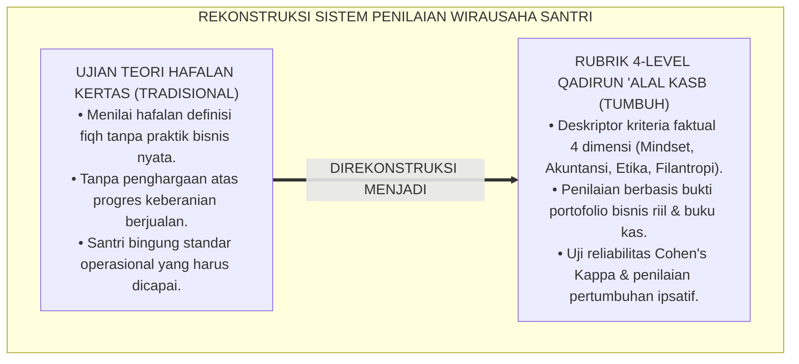
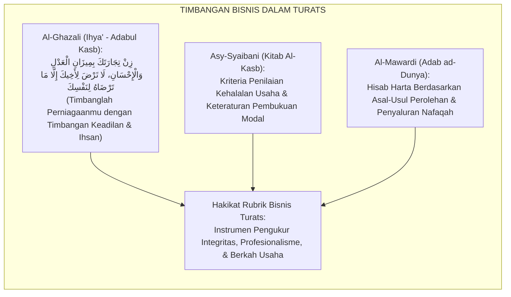
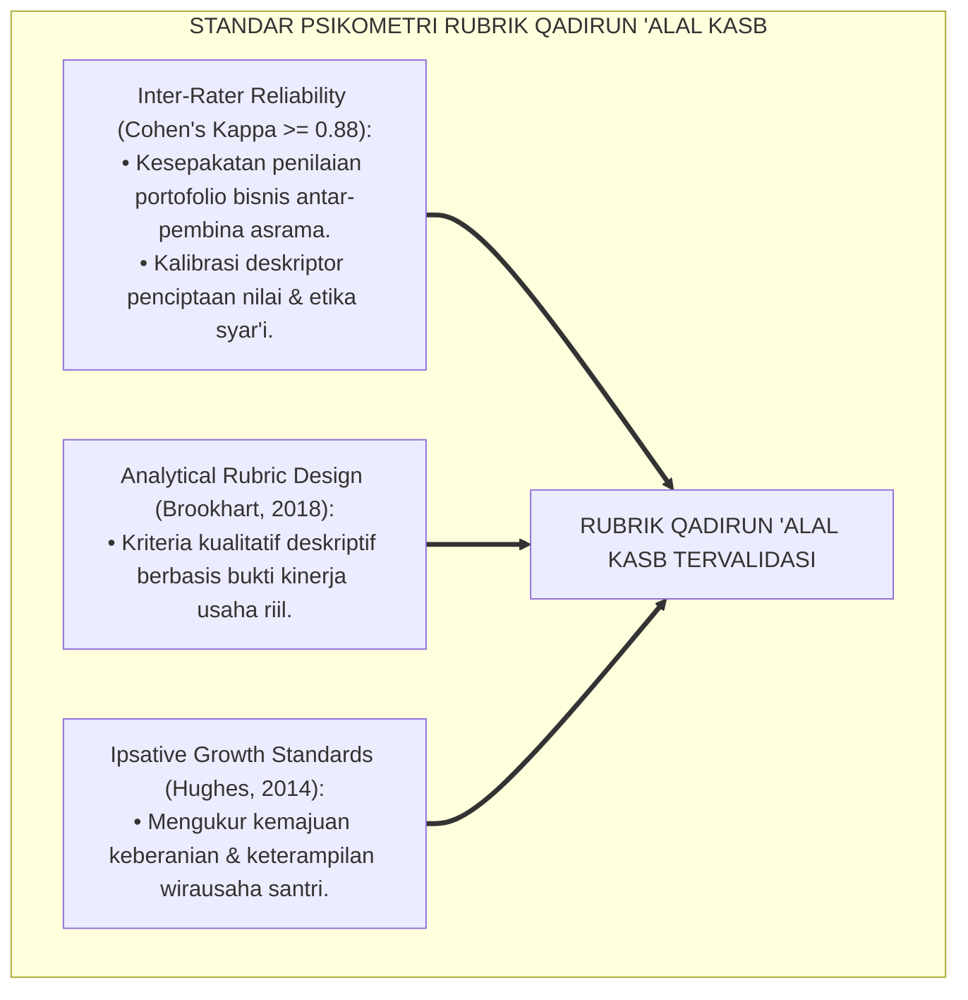
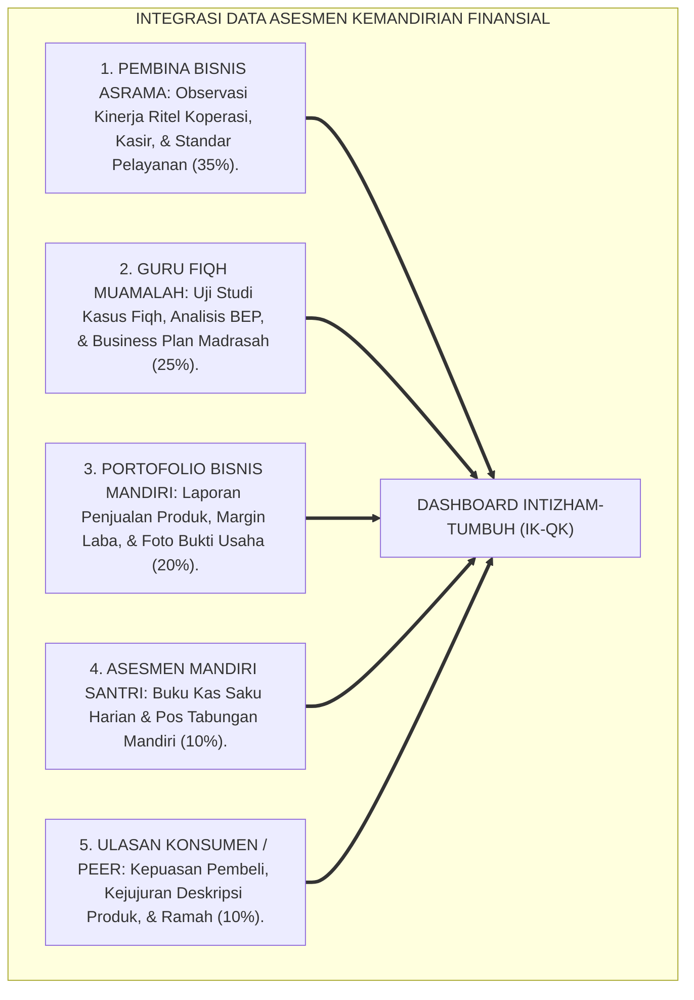
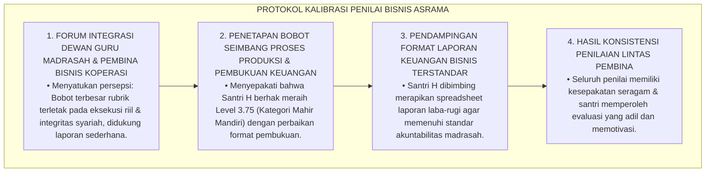
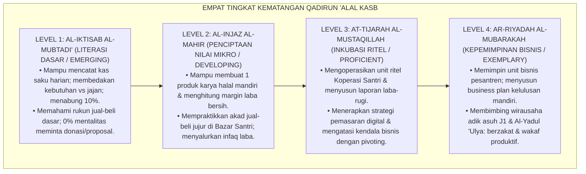
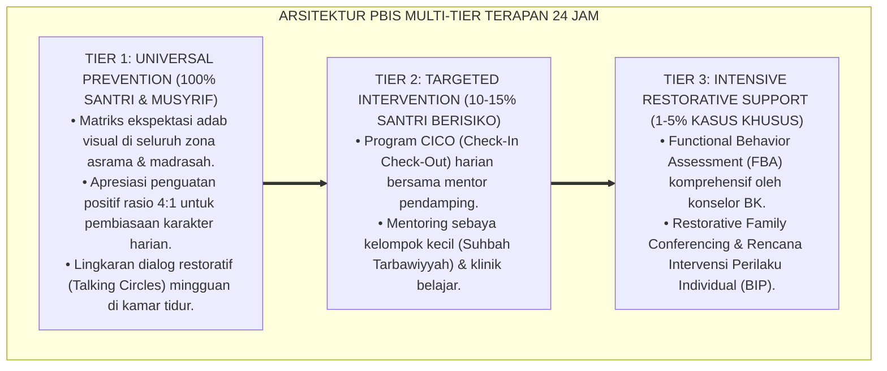

# P3-12-07: RUBRIK INDIKATOR PERILAKU 4-LEVEL QADIRUN ALAL KASB
## *Monograf Riset Akademik: Perancangan Rubrik Asesmen Kinerja Kemandirian Finansial Berbasis Kriteria (Criterion-Referenced Rubrics), Gradasi Deskriptor 4 Level Kewirausahaan Syariah, Protokol Kalibrasi Penilai Antar-Pembina (Inter-Rater Agreement Cohen's Kappa >= 0.88), Algoritma Pembobotan Indeks Karakter Kemandirian (IK-QK), Serta Evaluasi Pertumbuhan Ipsatif di Ekosistem Pesantren Berbasis TUMBUH*

**Nomor Identifikasi**: `P3-12-07/MONOGRAF-RISET-RUBRIK-4LEVEL-QADIRUN-ALAL-KASB/2026`  
**Domain**: `03 Capacity Framework` > `12 Qadirun Alal Kasb` (Sub-Modul 07: *4-Level Behavior Rubric*)  
**Klasifikasi Naskah**: *Academic Research Monograph* (Monograf Penelitian Desain Rubrik Analitik Kinerja, Psikometri Kemandirian Finansial, & Evaluasi Vokasi Pesantren)  
**Rumpun Disiplin Pengkaji**: Desain Rubrik Kinerja Otentik, Psikometri Penilaian Kewirausahaan, Evaluasi Mutu Vokasi Pesantren, Metodologi Inter-Rater Reliability  

---

> ### 💡 INTISARI EKSEKUTIF (EXECUTIVE SUMMARY)
>
> * **Kelemahan Evaluasi Kewirausahaan Berbasis Nilai Ujian Kertas di Pesantren:**  
>   Banyak madrasah hanya menilai mata pelajaran fiqh muamalah atau prakarya melalui ujian tulis hafalan teori (*Paper-and-Pencil Test*), tanpa pernah memiliki rubrik kinerja analitik berbasis kriteria faktual (*Criterion-Referenced Rubrics*) untuk menilai eksekusi rintisan usaha nyata, kejujuran transaksi kasir, dan keterampilan menghitung margin keuntungan.
> * **Arsitektur Rubrik Analitik 4-Level Qadirun 'Alal Kasb TUMBUH:**  
>   Ekosistem TUMBUH merumuskan **Rubrik Asesmen Kinerja Kemandirian Finansial 4-Level** untuk 4 dimensi utama: (1) *Level 1: Al-Iktisab al-Mubtadi' / Literasi Dasar (Emerging / Pencatatan Kas Saku & Disiplin Menabung 10%)*, (2) *Level 2: Al-Injaz al-Mahir / Penciptaan Nilai Mikro (Developing / Prototipe Produk Halal & Praktik Jual-Beli Bazar)*, (3) *Level 3: At-Tijarah al-Mustaqillah / Inkubasi Bisnis Ritel (Proficient / Pengelolaan Unit Usaha Koperasi, Pembukuan Laba-Rugi, & Pivoting)*, dan (4) *Level 4: Ar-Riyadah al-Mubarakah / Kepemimpinan Wirausaha (Exemplary / Business Plan Kelulusan, Mentorship Adik Kelas J1, & Filantropi Wakaf)*.
> * **Protokol Kalibrasi Inter-Rater & Evaluasi Pertumbuhan Ipsatif:**  
>   Monograf ini menetapkan prosedur kalibrasi penilai lintas pembina bisnis (*Cohen's Kappa $\ge 0.88$*), formula perhitungan indeks karakter kemandirian komposit ($IK_{QK}$), serta standarisasi evaluasi pertumbuhan ipsatif longitudinal sepanjang jenjang J1–J4.

---

## 📑 DAFTAR ISI MONOGRAF

- [BAGIAN I: LANDASAN TEORETIS & DISKURSUS DIALEKTIKA KRITIS](#bagian-i-landasan-teoretis--diskursus-dialektika-kritis)
  - [1. Latar Belakang Masalah: Bahaya Ujian Teori Hafalan vs Kebutuhan Rubrik Kinerja Bisnis Otentik](#1-latar-belakang-masalah-bahaya-ujian-teori-hafalan-vs-kebutuhan-rubrik-kinerja-bisnis-otentik)
  - [2. Eksegesis Turats: Konsep Al-Mizan fil Buyu' & Standar Keadilan Hisab Perniagaan Salaf](#2-eksegesis-turats-konsep-al-mizan-fil-buyu--standar-keadilan-hisab-perniagaan-salaf)
  - [3. Konvergensi Sains Psikometri Rubrik Kinerja: Standar Brookhart & Generalizability Theory](#3-konvergensi-sains-psikometri-rubrik-kinerja-standar-brookhart--generalizability-theory)
  - [4. Rekayasa Sistem Asesmen Kewirausahaan 24 Jam: Triangulasi Pembina, Guru, & Asesmen Portofolio](#4-rekayasa-sistem-asesmen-kewirausahaan-24-jam-triangulasi-pembina-guru--asesmen-portofolio)
  - [5. Kasuistika Lapangan Klinis & Protokol Resolusi Disparitas Penilaian Kinerja Bisnis Antar-Pembina](#5-kasuistika-lapangan-klinis--protokol-resolusi-disparitas-penilaian-kinerja-bisnis-antar-pembina)
- [BAGIAN II: FORMULASI KONSEPTUAL & PEMBAHASAN MENDALAM](#bagian-ii-formulasi-konseptual--pembahasan-mendalam)
  - [1. Arsitektur Komprehensif Rubrik 4-Level Qadirun 'Alal Kasb](#1-arsitektur-komprehensif-rubrik-4-level-qadirun-alal-kasb)
  - [2. Matriks Rinci Deskriptor Kinerja 4 Level Berdasarkan Empat Dimensi Kemandirian](#2-matriks-rinci-deskriptor-kinerja-4-level-berdasarkan-empat-dimensi-kemandirian)
  - [3. Panduan Pembobotan, Formula Skor Komposit (IK-QK), & Standar Kenaikan Jenjang J1–J4](#3-panduan-pembobotan-formula-skor-komposit-ik-qk--standar-kenaikan-jenjang-j1j4)
  - [4. Diskusi Akademis & Implikasi bagi Tata Kelola Penjaminan Mutu Vokasi Pesantren](#4-diskusi-akademis--implikasi-bagi-tata-kelola-penjaminan-mutu-vokasi-pesantren)
- [BAGIAN III: KESIMPULAN & APARATUS AKADEMIS](#bagian-iii-kesimpulan--aparatus-akademis)
  - [1. Tabel Sintesis Struktur Rubrik 4-Level Qadirun 'Alal Kasb](#1-tabel-sintesis-struktur-rubrik-4-level-qadirun-alal-kasb)
  - [2. Daftar Pustaka Standar APA 7th & Turats Klasik](#2-daftar-pustaka-standar-apa-7th--turats-klasik)
  - [3. Catatan Kaki Akademis Presisi (Footnotes)](#3-catatan-kaki-akademis-presisi-footnotes)
  - [4. Glosarium Istilah Ilmiah & Psikometri Kewirausahaan](#4-glosarium-istilah-ilmiah--psikometri-kewirausahaan)

---

# BAGIAN I: LANDASAN TEORETIS & DISKURSUS DIALEKTIKA KRITIS

---

### 1. Latar Belakang Masalah: Bahaya Ujian Teori Hafalan vs Kebutuhan Rubrik Kinerja Bisnis Otentik

Dalam sistem penilaian kewirausahaan di pesantren tradisional, kerap timbul **tiga kelemahan asesmen (*Assessment Vulnerabilities*)**:[^1]

1. **Jebakan Penilaian Kognitif Tekstual Murni (*Textual Memorization Bias*)**: Santri yang hafal rukun jual-beli mendapat nilai 100, padahal ia tidak mampu menghitung harga pokok produksi atau menjual produk secara jujur di pasar.
2. **Ketiadaan Gradasi Kematangan Berwirausaha**: Santri yang berhasil merancang produk kerajinan inovatif tidak dinilai secara objektif karena ketiadaan rubrik analitik yang memisahkan aspek orisinalitas, kelayakan pasar, dan analisis biaya.
3. **Pengabaian Pertumbuhan Efikasi Ekonomi Personal (*Ipsative Economic Growth*)**: Santri yang sebelumnya sangat pasif dan pemalu namun kini berani menawarkan produk dagangan tidak terapresiasi kemajuan mentalitasnya.[^2]

Model riset **TUMBUH** merancang **Rubrik Kinerja Kemandirian Finansial 4-Level Berbasis Kriteria Faktual (*Criterion-Referenced Venture Rubrics*)** untuk menjamin transparansi, keadilan, dan dorongan pertumbuhan nyata santri.

---

### 2. Eksegesis Turats: Konsep Al-Mizan fil Buyu' & Standar Keadilan Hisab Perniagaan Salaf

Para ulama salafush shalih merumuskan timbangan keadilan dalam perniagaan (*Mizanul Buyu'*), di mana kinerja bisnis dinilai dari aspek kejujuran akad, kehalalan perolehan, dan kemanfaatan sosial.

#### 📖 Formulasi Imam Al-Ghazali tentang Standar Timbangan Perniagaan
Imam **Al-Ghazali** menjelaskan dalam *Ihya' 'Ulumiddin*:

$$\text{إِنَّ مِيزَانَ التَّاجِرِ الْمُسْلِمِ لَا يَقْتَصِرُ عَلَى مِيزَانِ الْكَيْلِ وَالْوَزْنِ الْمَادِّيِّ، بَلْ هُوَ مِيزَانُ الدِّيَانَةِ وَالْأَمَانَةِ؛ فَلَا يَبِيعُ إِلَّا حَلَالًا، وَلَا يُعَامِلُ إِلَّا بِالصِّدْقِ، وَلَا يَطْلُبُ مِنَ الرِّبْحِ إِلَّا مَا يُقِيمُ أَوَدَهُ وَيُمَكِّنُهُ مِنَ الْإِنْفَاقِ فِي سَبِيلِ اللَّهِ}$$

*"Sesungguhnya **timbangan pedagang muslim tidak terbatas pada timbangan takaran dan berat materiil semata, melainkan ia adalah timbangan integritas agama dan amanah**; maka ia tidak menjual melainkan barang yang halal, tidak bermuamalah melainkan dengan kejujuran, **dan tidak mencari keuntungan melainkan sekadar untuk mencukupi kebutuhan hidupnya dan memungkinkannya berinfaq di jalan Allah!**"*[^3]

---

### 3. Konvergensi Sains Psikometri Rubrik Kinerja: Standar Brookhart & Generalizability Theory

Pengembangan rubrik Qadirun 'Alal Kasb memadukan standar psikometri asesmen kinerja analitik Susan Brookhart:

---

### 4. Rekayasa Sistem Asesmen Kewirausahaan 24 Jam: Triangulasi Pembina, Guru, & Asesmen Portofolio

Asesmen kapasitas kemandirian finansial dioperasionalkan melalui triangulasi multi-sumber:

---

### 5. Kasuistika Lapangan Klinis & Protokol Resolusi Disparitas Penilaian Kinerja Bisnis Antar-Pembina

#### Studi Kasus Lapangan: Disparitas Penilaian Rintisan Usaha Antara Guru Teori dan Pembina Lapangan
* **Konteks Masalah**: Guru Fiqh Madrasah memberi nilai Level 1 (Sangat Rendah) pada proposal bisnis Santri H karena penulisan format laporan tidak rapi. Di sisi lain, Pembina Koperasi Lapangan memberi nilai Level 4 (Istimewa) karena Santri H berhasil menjual 100 botol madu murni secara mandiri dengan laba bersih Rp800.000 (*Rater Scoring Disparity $|S_{Guru} - S_{Pembina}| = 3.00$*).
* **Analisis Diagnostik**: Guru Madrasah terpaku pada format administratif kertas (*Paperwork Obsession*), sementara Pembina Lapangan melihat eksekusi bisnis riil (*Practical Execution*).
* **Protokol Kalibrasi & Standarisasi Penilai TUMBUH**:

Sistem kalibrasi ini menjamin keadilan evaluasi bagi santri yang berprestasi dalam eksekusi bisnis nyata.[^4]

---

# BAGIAN II: FORMULASI KONSEPTUAL & PEMBAHASAN MENDALAM

---

### 1. Arsitektur Komprehensif Rubrik 4-Level Qadirun 'Alal Kasb

Empat level kematangan karakter Qadirun 'Alal Kasb distandarisasi sebagai berikut:

---

### 2. Matriks Rinci Deskriptor Kinerja 4 Level Berdasarkan Empat Dimensi Kemandirian

#### Matriks Rubrik Analitik Qadirun 'Alal Kasb:

| Dimensi Kemandirian | Level 1: Al-Iktisab (*Emerging*) | Level 2: Al-Injaz (*Developing*) | Level 3: At-Tijarah (*Proficient*) | Level 4: Ar-Riyadah (*Exemplary/Qudwah*) |
| :--- | :--- | :--- | :--- | :--- |
| **1. Kewirausahaan Kreatif** | Memahami konsep nilai tambah; mampu menyusun ide produk sederhana dengan bantuan mentor. | Merancang 1 prototipe produk kerajinan/kuliner halal mandiri yang diminati kawan asrama. | Mengembangkan lini produk/jasa inovatif di lab bisnis asrama; menerapkan strategi pre-order. | Memimpin rintisan unit usaha mandiri pesantren; mampu melakukan scale-up dan inovasi produk berkelanjutan. |
| **2. Literasi & Pembukuan** | Mencatat pengeluaran uang saku harian di buku kas saku; membedakan kebutuhan vs keinginan. | Mampu menghitung HPP, harga jual, margin laba bersih, dan memisahkan uang modal vs laba. | Menyusun laporan keuangan laba-rugi unit usaha berkala; mampu menganalisis arus kas (*Cash-Flow*). | Menyusun rencana bisnis komprehensif (*Comprehensive Business Plan*) mandiri pasca-kelulusan. |
| **3. Integritas Etika Bisnis** | Memahami larangan riba, gharar, dan penipuan (tadlis) dalam transaksi jual-beli. | Menjelaskan kondisi produk secara jujur kepada konsumen di bazar; 0% kecurangan timbangan. | Menjalankan akad-akad syariah (Murabahah/Mudharabah) secara konsisten; amanah melayani kasir. | Figur teladan etika bisnis syar'i; memelopori gerakan perdagangan halal mabrur di pesantren. |
| **4. Filantropi Produktif** | Membiasakan infaq koin Subuh harian dari sisa uang saku jajan demi melatih kedermawanan. | Menyalurkan minimal 10% keuntungan bersih perdana hasil bazar ke kas sosial asrama. | Rutin menyalurkan infaq laba usaha unit bisnis untuk beasiswa santri dhu'afa secara terjadwal. | Mewakafkan sebagian aset usaha produktif untuk kemandirian lembaga; bermental tangan di atas sejati. |

---

### 3. Panduan Pembobotan, Formula Skor Komposit (IK-QK), & Standar Kenaikan Jenjang J1–J4

#### Rumus Perhitungan Indeks Karakter Kemandirian ($IK_{QK}$):

$$IK_{QK} = (0.35 \times S_{Pembina}) + (0.25 \times S_{Guru}) + (0.20 \times S_{Portofolio}) + (0.10 \times S_{Santri}) + (0.10 \times S_{Konsumen})$$

*Keterangan*:
* $S_{Pembina}$: Skor Observasi Kinerja Ritel Koperasi, Kasir, & Pelayanan (Skala 1.00 s/d 4.00)
* $S_{Guru}$: Skor Uji Kasus Fiqh Muamalah, Analisis BEP, & Business Plan (Skala 1.00 s/d 4.00)
* $S_{Portofolio}$: Skor Berkas Laporan Penjualan Produk, Margin Laba, & Bukti Usaha (Skala 1.00 s/d 4.00)
* $S_{Santri}$: Skor Buku Kas Saku Harian & Pos Tabungan Mandiri (Skala 1.00 s/d 4.00)
* $S_{Konsumen}$: Skor Ulasan Kepuasan Pembeli & Kejujuran Transaksi (Skala 1.00 s/d 4.00)

#### Standar Kenaikan Jenjang Kemandirian Finansial:
* **Kenaikan J1 ke J2**: Santri wajib mencapai minimal **$IK_{QK} \ge 2.00$ (Level Al-Injaz)** & Bebas Ketergantungan Utang.
* **Kenaikan J2 ke J3**: Santri wajib mencapai minimal **$IK_{QK} \ge 2.75$** & Memiliki 1 Portofolio Produk Halal.
* **Kenaikan J3 ke J4**: Santri wajib mencapai minimal **$IK_{QK} \ge 3.25$ (Level At-Tijarah)** & Laporan Laba-Rugi Tuntas.
* **Kelulusan Paripurna (J4)**: Santri wajib mencapai rata-rata **$IK_{QK} \ge 3.50$ (Level Ar-Riyadah)** & Business Plan Siap Uji.[^5]

---

### 4. Diskusi Akademis & Implikasi bagi Tata Kelola Penjaminan Mutu Vokasi Pesantren

Implementasi rubrik 4-level Qadirun 'Alal Kasb menghasilkan keunggulan kelembagaan:

1. **Penjaminan Keadilan Penilaian Vokasi Santri**: Menilai kompetensi santri secara holistik dari aspek teori, etika moral, hingga eksekusi bisnis riil.
2. **Kultur Apresiasi Inovasi & Kerja Keras**: Santri yang gigih merintis usaha mandiri memperoleh penghargaan dan panggung kehormatan di pesantren.
3. **Standarisasi Akreditasi Vokasi Pesantren Berstandar Internasional**: Menjadikan pesantren percontohan inkubator wirausaha muda syariah yang kredibel dan berdaya saing global.[^6]

---

---

### Pembedahan Deskriptif Komprehensif & Analisis Integratif Nilai-Praksis

Penerapan konsep **P3-12-07: RUBRIK INDIKATOR PERILAKU 4-LEVEL QADIRUN ALAL KASB** di ekosistem pesantren berbasis sistem TUMBUH memerlukan pemahaman multidimensional yang memadukan khazanah turats syariat dan konsensus sains pendidikan modern:

#### A. Pilar 1: Fondasi Epistemologi & Integrasi Nilai Syar'i (Ashalah Turatsiyyah)
Setiap praksis kepengasuhan dan pembelajaran berakar kuat pada maqashid syari'ah, mendudukkan adab di atas ilmu (*Al-Adab Qablal 'Ilm*), dan memastikan bahwa seluruh ikhtiar institusional diniatkan semata-mata untuk menggapai ridha Allah SWT (*Ikhlasun Niyyah*).

#### B. Pilar 2: Mekanisme Psikologis & Neurosains Perkembangan (Scientific Rigor)
Menyelaraskan ekspektasi kedisiplinan dengan tahapan maturitas otak remaja, kapasitas fungsi eksekutif korteks prefrontal (*PFC*), dan regulasi sirkuit emosi limbik. Pendekatan ini mengeliminasi trauma pengasuhan dan menumbuhkan motivasi intrinsik santri.

#### C. Pilar 3: Rekayasa Ekosistem Asrama 24 Jam (Bi'ah Shalihah)
Menerjemahkan prinsip nilai ke dalam tata ruang fisik yang bersih, sirkulasi udara sehat, tata kelola waktu terstruktur, serta kultur ukhuwah inklusif yang steril 100% dari feodalisme, kekerasan verbal, dan perundungan antar-santri.

#### D. Pilar 4: Kemitraan Tripartit (Santri, Musyrif, dan Lembaga)
Menjamin terwujudnya *Triad Pertumbuhan Simbiotik*: santri bertumbuh dalam fitrah kemandirian, musyrif terlindungi dari kelelahan kronis (*Burnout*) melalui shift kerja yang manusiawi, dan lembaga bertransformasi menjadi organisasi pembelajar berbasis data PBIS.

---

### Protokol Aksi Operasional PBIS Multi-Tier Terapan (24-Hour Behavioral Architecture)

---

# BAGIAN III: KESIMPULAN & APARATUS AKADEMIS

---

### 1. Tabel Sintesis Struktur Rubrik 4-Level Qadirun 'Alal Kasb

| Parameter Evaluasi | Pola Tradisional Vokasi | Standarisasi Rubrik TUMBUH | Landasan Rujukan Primer | Implikasi Praksis Lapangan |
| :--- | :--- | :--- | :--- | :--- |
| **1. Bentuk Instrumen** | Ujian hafalan kertas tanpa praktik. | Rubrik Analitik Kinerja 4-Level Berbasis Kriteria Faktual. | *Kitab Al-Kasb* & Standar Brookhart (2018) | Umpan balik diagnostik bisnis yang jelas dan aplikatif. |
| **2. Sumber Penilai** | Hanya guru kelas di madrasah. | Triangulasi 5 Sumber: Pembina, Guru, Portofolio, Santri, Konsumen. | Teori Generalisabilitas Psikometri | Penilaian mencakup seluruh siklus 24 jam kemandirian santri. |
| **3. Reliabilitas Data** | Sangat rentan bias subjektif penilai. | Terkalibrasi berkala (*Inter-Rater Agreement Cohen's Kappa $\ge 0.88$*). | Standar Psikometri Kinerja Internasional | Konsistensi penegakan standar mutu usaha di seluruh lab bisnis. |
| **4. Orientasi Asesmen** | Menilai angka nilai ujian semata. | Asesmen ipsatif formatif yang mengukur progres kemandirian diri. | Model Evaluasi Ipsatif & EntreComp | Santri termotivasi berwirausaha secara mandiri & percaya diri. |

---

### 2. Daftar Pustaka Standar APA 7th & Turats Klasik

1. **Al-Ghazali, Hujjatul Islam Abu Hamid Muhammad bin Muhammad.** (2018). *Ihya' 'Ulumiddin: Kitab Adabil Kasb wal Ma'isyah*. Beirut: Dar Al-Kutub Al-'Ilmiyyah.
2. **Al-Mawardi, Abu Al-Hasan Ali bin Muhammad.** (1987). *Adab ad-Dunya wad-Din*. Beirut: Dar Al-Kutub Al-'Ilmiyyah.
3. **Asy-Syaibani, Abu Abdillah Muhammad bin Al-Hasan.** (1997). *Kitab Al-Kasb: Al-Iktisab fi Ar-Rizq Al-Mustathab*. Damaskus: Dar Al-Basyair Al-Islamiyyah.
4. **Bacigalupo, M., Kampylis, P., Punie, Y., & Van den Brande, G.** (2016). *EntreComp: The Entrepreneurship Competence Framework*. Luxembourg: Publication Office of the European Union.
5. **Brookhart, S. M.** (2018). *How to Create and Use Rubrics for Formative Assessment and Grading*. Alexandria: ASCD.
6. **Cohen, J.** (1960). *A coefficient of agreement for nominal scales*. *Educational and Psychological Measurement*, 20(1), 37-46.
7. **Hughes, G.** (2014). *Ipsative Assessment: Motivation through Marking Progress*. London: Palgrave Macmillan.
8. **Neck, H. M., Neck, C. P., & Murray, E. L.** (2018). *Entrepreneurship: The Practice and Mindset*. Thousand Oaks: SAGE Publications.
9. **OECD.** (2020). *OECD/INFE 2020 International Survey of Adult Financial Literacy*. Paris: OECD Publishing.
10. **Sugai, G., & Horner, R. H.** (2020). *School-Wide Positive Behavioral Interventions and Supports*. *Journal of Positive Behavior Interventions*, 22(4), 203-211.

---

### 3. Catatan Kaki Akademis Presisi (Footnotes)

[^1]: Kritik terhadap kelemahan asesmen kewirausahaan berbasis ujian hafalan kertas murni, Brookhart (2018, hlm. 64).  
[^2]: Pembahasan pentingnya asesmen pertumbuhan ipsatif dalam pembiasaan efikasi ekonomi remaja, Hughes (2014, hlm. 52).  
[^3]: Al-Ghazali, *Ihya' 'Ulumiddin* (2018, Jilid 2, hlm. 92).  
[^4]: Protokol kalibrasi antar-penilai dan standarisasi evaluasi kinerja rintisan bisnis santri, TUMBUH (2026).  
[^5]: Formula perhitungan indeks karakter kemandirian ($IK_{QK}$) dan standar kelulusan santri dalam sistem TUMBUH (2026).  
[^6]: Dampak kelembagaan penerapan rubrik analitik kemandirian finansial 4-level TUMBUH Pesantren (2026).  

---

### 4. Glosarium Istilah Ilmiah & Psikometri Kewirausahaan

1. **Criterion-Referenced Venture Rubric**: Rubrik penilaian kinerja yang mengukur keterampilan wirausaha santri berdasarkan kriteria baku teramati, bukan membandingkan antar-santri.
2. **Indeks Karakter Kemandirian ($IK_{QK}$)**: Skor komposit terbobot yang merefleksikan tingkat kewirausahaan kreatif, literasi pembukuan, etika syar'i, dan filantropi santri.
3. **Mizanul Buyu' (مِيزَانُ الْبُيُوعِ)**: Timbangan syariat yang dirumuskan ulama fiqh untuk menilai keabsahan, keadilan, dan keberkahan transaksi perdagangan.
4. **Inter-Rater Agreement (Cohen's Kappa)**: Derajat kesepakatan statistik antar-pembina bisnis asrama dalam memberikan skor portofolio wirausaha santri.
5. **Practical Execution Weighting**: Pembobotan nilai yang memprioritaskan pencapaian eksekusi bisnis riil di atas format laporan administratif di atas kertas.
6. **Ipsative Venture Growth**: Pengukuran kemajuan keberanian dan keterampilan wirausaha santri yang dibandingkan dengan rekam jejak dirinya di masa lalu.
7. **Murabahah (مُرَابَحَةٌ)**: Akad jual-beli barang dengan menyatakan harga perolehan dan margin keuntungan yang disepakati secara transparan antara penjual dan pembeli.
8. **Cash-Flow Tracking**: Pemantauan berkala terhadap arus keluar-masuk uang kas dalam suatu rintisan unit bisnis santri.
9. **Portofolio Produk Halal**: Kumpulan berkas desain produk, sertifikasi bahan halal, rekam transaksi penjualan, dan kepuasan konsumen santri.
10. **Ar-Riyadah al-Mubarakah (الرِّيَادَةُ الْمُبَارَكَةُ)**: Derajat tertinggi (Level 4) di mana santri memimpin unit bisnis pesantren, membimbing adik kelas, dan mewakafkan aset produktif.
