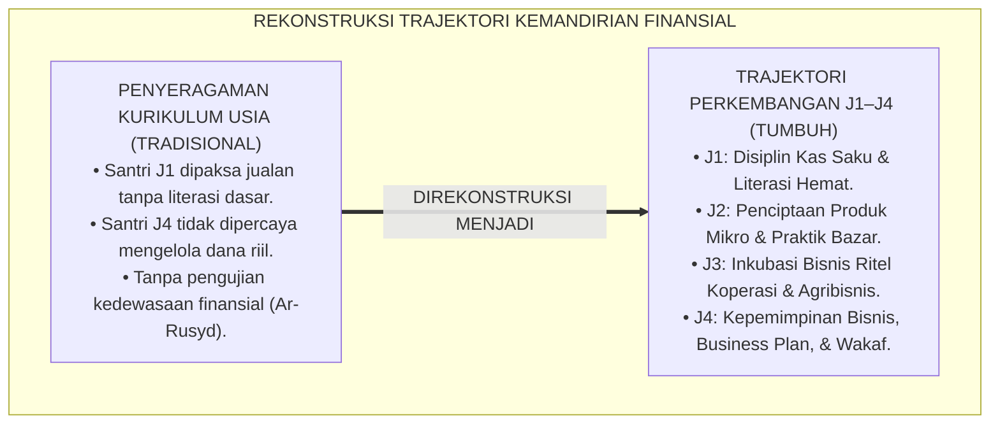
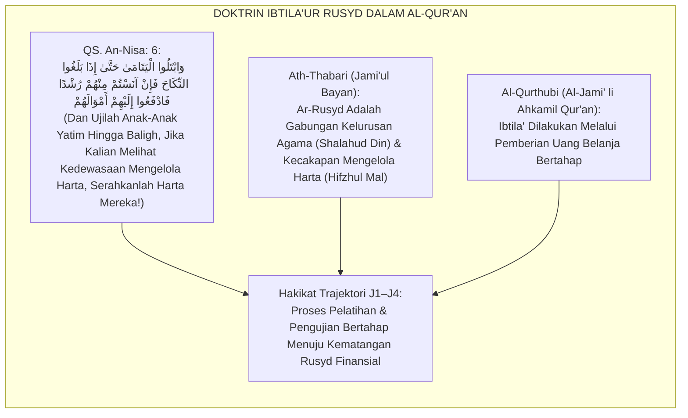
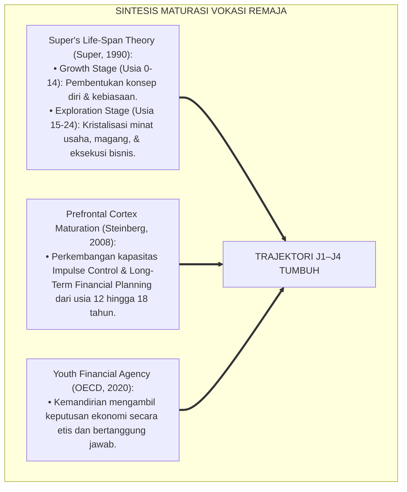
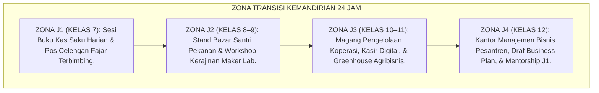
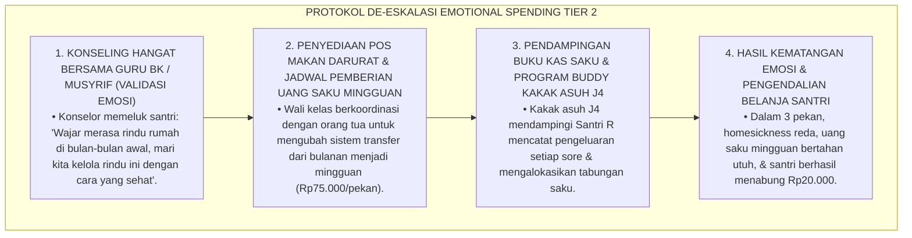
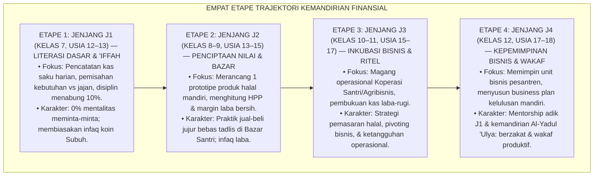
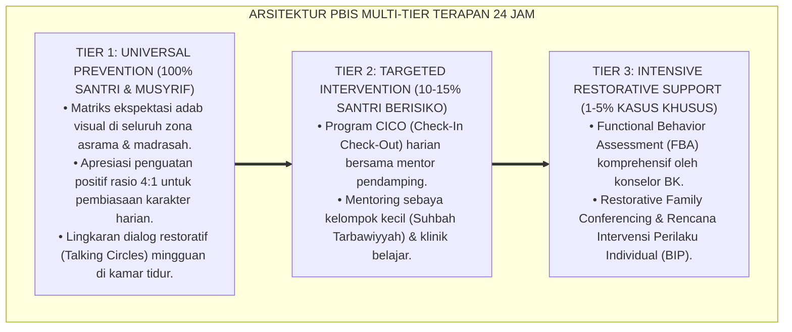

# P3-12-08: TAHAPAN PERKEMBANGAN JENJANG J1–J4 QADIRUN ALAL KASB
## *Monograf Riset Akademik: Trajektori Perkembangan Kematangan Finansial & Jiwa Kewirausahaan Usia 12–18 Tahun, Integrasi Fiqh Ar-Rusyd (Kedewasaan Mengelola Harta & Uji Kelayakan Bisnis QS. An-Nisa: 6) dengan Teori Perkembangan Identitas Vokasi & Kognisi Pengambilan Keputusan Ekonomi Remaja, Serta Desain Protokol Transisi Kenaikan Jenjang (Venture Readiness Check) di Ekosistem Pesantren Berbasis TUMBUH*

**Nomor Identifikasi**: `P3-12-08/MONOGRAF-RISET-TAHAPAN-PERKEMBANGAN-J1-J4-QADIRUN-ALAL-KASB/2026`  
**Domain**: `03 Capacity Framework` > `12 Qadirun Alal Kasb` (Sub-Modul 08: *Developmental Trajectory J1–J4*)  
**Klasifikasi Naskah**: *Academic Research Monograph* (Monograf Penelitian Psikologi Perkembangan Vokasi, Fiqh Rusyd Transisi Usia, & Trajektori Kemandirian Santri)  
**Rumpun Disiplin Pengkaji**: Psikologi Perkembangan Remaja (*Adolescent Economic Development*), Fiqh Rusyd & Hifzhul Mal, Teori Perkembangan Vokasi (Super's Life-Span Theory), Manajemen Transisi Pendidikan  

---

> ### 💡 INTISARI EKSEKUTIF (EXECUTIVE SUMMARY)
>
> * **Kelesuan Penahapan Pendidikan Kemandirian Finansial di Pesantren:**  
>   Banyak kurikulum kewirausahaan pesantren memperlakukan seluruh usia santri secara seragam. Santri usia 12 tahun (baru lulus SD) langsung dituntut memikirkan laba bisnis yang rumit, atau sebaliknya santri usia 18 tahun (menjelang lulus aliyah) masih diperlakukan seperti anak kecil yang tidak diberi wewenang mengelola uang dan modal usaha sendiri.
> * **Integrasi Fiqh Ar-Rusyd & Teori Perkembangan Identitas Vokasi:**  
>   Ekosistem TUMBUH menyelaraskan doktrin Al-Qur'an mengenai pengujian kedewasaan mengelola harta (*Ibtila'ur Rusyd* dalam QS. An-Nisa: 6) dengan teori perkembangan identitas vokasi Donald Super dan perkembangan korteks prefrontal remaja. Kemandirian finansial berkembang secara bertahap dari pemenuhan kebutuhan pribadi (*Personal Budgeting*) menuju penciptaan usaha mandiri (*Venture Creation*) dan kepemimpinan bisnis peradaban (*Civilizational Entrepreneurship*).
> * **Empat Etape Trajektori Kemandirian Jenjang J1–J4 & Venture Readiness Check:**  
>   Monograf ini merumuskan 4 fase perkembangan terstruktur: (1) *Jenjang J1 (Kelas 7, Usia 12–13): Etape Disiplin Kas Saku & 'Iffah Dasar*, (2) *Jenjang J2 (Kelas 8–9, Usia 13–15): Etape Penciptaan Produk Mikro & Eksplorasi Pasar*, (3) *Jenjang J3 (Kelas 10–11, Usia 15–17): Etape Inkubasi Bisnis Ritel & Manajemen Laba-Rugi*, dan (4) *Jenjang J4 (Kelas 12, Usia 17–18): Etape Kepemimpinan Bisnis, Business Plan Mandiri, & Wakaf Produktif*.

---

## 📑 DAFTAR ISI MONOGRAF

- [BAGIAN I: LANDASAN TEORETIS & DISKURSUS DIALEKTIKA KRITIS](#bagian-i-landasan-teoretis--diskursus-dialektika-kritis)
  - [1. Latar Belakang Masalah: Bahaya Penyeragaman Kurikulum Bisnis Tanpa Memperhatikan Maturasi Kognitif Remaja](#1-latar-belakang-masalah-bahaya-penyeragaman-kurikulum-bisnis-tanpa-memperhatikan-maturasi-kognitif-remaja)
  - [2. Eksegesis Turats: Konsep Ibtila'ur Rusyd dalam Tafsir QS. An-Nisa: 6 & Syarah Fiqh Salaf](#2-eksegesis-turats-konsep-ibtilaur-rusyd-dalam-tafsir-qs-an-nisa-6--syarah-fiqh-salaf)
  - [3. Konvergensi Sains Perkembangan Remaja: Super's Vocational Stages & Kognisi Pengambilan Keputusan Finansial](#3-konvergensi-sains-perkembangan-remaja-supers-vocational-stages--kognisi-pengambilan-keputusan-finansial)
  - [4. Rekayasa Zona Transisi 24 Jam: Ekosistem Penempaan Kemandirian Sesuai Usia Santri](#4-rekayasa-zona-transisi-24-jam-ekosistem-penempaan-kemandirian-sesuai-usia-santri)
  - [5. Kasuistika Lapangan Klinis & Protokol Pendampingan Santri J1 Mengalami Homesickness yang Menguras Uang Saku untuk Jajan Penghibur Diri (Emotional Spending)](#5-kasuistika-lapangan-klinis--protokol-pendampingan-santri-j1-mengalami-homesickness-yang-menguras-uang-saku-untuk-jajan-penghibur-diri-emotional-spending)
- [BAGIAN II: FORMULASI KONSEPTUAL & PEMBAHASAN MENDALAM](#bagian-ii-formulasi-konseptual--pembahasan-mendalam)
  - [1. Peta Jalan Empat Etape Perkembangan Kemandirian Finansial Jenjang J1–J4](#1-peta-jalan-empat-etape-perkembangan-kemandirian-finansial-jenjang-j1j4)
  - [2. Matriks Rinci Capaian Perkembangan, Tugas Vokasi, & Indikator Kematangan per Jenjang](#2-matriks-rinci-capaian-perkembangan-tugas-vokasi--indikator-kematangan-per-jenjang)
  - [3. Protokol Asesmen Transisi Kenaikan Jenjang (Venture Readiness Check / VRC)](#3-protokol-asesmen-transisi-kenaikan-jenjang-venture-readiness-check--vrc)
  - [4. Diskusi Akademis & Implikasi bagi Tata Kelola Pembinaan Kemandirian Santri Pesantren](#4-diskusi-akademis--implikasi-bagi-tata-kelola-pembinaan-kemandirian-santri-pesantren)
- [BAGIAN III: KESIMPULAN & APARATUS AKADEMIS](#bagian-iii-kesimpulan--aparatus-akademis)
  - [1. Tabel Sintesis Tahapan Perkembangan Kemandirian Finansial J1–J4](#1-tabel-sintesis-tahapan-perkembangan-kemandirian-finansial-j1j4)
  - [2. Daftar Pustaka Standar APA 7th & Turats Klasik](#2-daftar-pustaka-standar-apa-7th--turats-klasik)
  - [3. Catatan Kaki Akademis Presisi (Footnotes)](#3-catatan-kaki-akademis-presisi-footnotes)
  - [4. Glosarium Istilah Ilmiah & Perkembangan Vokasi Remaja](#4-glosarium-istilah-ilmiah--perkembangan-vokasi-remaja)

---

# BAGIAN I: LANDASAN TEORETIS & DISKURSUS DIALEKTIKA KRITIS

---

### 1. Latar Belakang Masalah: Bahaya Penyeragaman Kurikulum Bisnis Tanpa Memperhatikan Maturasi Kognitif Remaja

Dalam praksis pembinaan kemandirian di pesantren konvensional, kerap terjadi **tiga distorsi penahapan usia (*Developmental Staging Distortions*)**:[^1]

1. **Jebakan Pemaksaan Bisnis Terlalu Dini pada Santri Baru (*Premature Commercialization*)**: Santri kelas 7 (J1) yang baru beradaptasi dengan lingkungan asrama dipaksa memikirkan target penjualan barang, memicu stres adaptasi dan mengganggu fokus hafalan Al-Qur'an.
2. **Jebakan Pengebirian Kemandirian Santri Remaja Akhir (*Late Adolescent Infantilization*)**: Santri kelas 12 (J4) yang sebenarnya sudah matang secara biologis dan kognitif tetap tidak diberi kepercayaan mengelola anggaran kas atau unit usaha asrama secara mandiri.
3. **Ketiadaan Evaluasi Kelayakan Transisi Rusyd Finansial**: Kenaikan kelas hanya didasarkan pada nilai ujian madrasah tanpa pernah menguji apakah santri sudah mampu mengelola keuangannya secara bertanggung jawab (*Ar-Rusyd al-Mali*).[^2]

Model riset **TUMBUH** merumuskan **Trajektori Perkembangan Jenjang J1–J4** yang menyelaraskan tahapan maturasi otak remaja dengan pentahapan fiqh kemandirian ekonomi Islam.

---

### 2. Eksegesis Turats: Konsep Ibtila'ur Rusyd dalam Tafsir QS. An-Nisa: 6 & Syarah Fiqh Salaf

Al-Qur'anul Karim secara eksplisit memerintahkan para pendidik untuk menguji kecakapan mengelola harta (*Ibtila'ur Rusyd*) pada anak-anak yatim/santri sebelum menyerahkan wewenang pengelolaan harta secara mandiri.

#### 📖 Firman Allah SWT tentang Uji Kedewasaan Finansial
Allah SWT berfirman:

$$\text{وَابْتَلُوا الْيَتَامَىٰ حَتَّىٰ إِذَا بَلَغُوا النِّكَاحَ فَإِنْ آنَسْتُمْ مِنْهُمْ رُشْدًا فَادْفَعُوا إِلَيْهِمْ أَمْوَالَهُمْ ۖ وَلَا تَأْكُلُوهَا إِسْرَافًا وَبِدَارًا أَنْ يَكْبَرُوا}$$

*"Dan **ujilah anak-anak yatim itu (dalam kecakapan mengelola harta) sampai mereka cukup umur untuk menikah**; kemudian jika menurut pendapatmu **mereka telah cerdas dan pandai memelihara harta (*Ānastum Minhum Rusydan*)**, maka serahkanlah kepada mereka harta-hartanya; dan janganlah kamu memakannya melebihi batas kepatutan dan tergesa-gesa sebelum mereka dewasa!"* (QS. An-Nisa: 6).[^3]

---

### 3. Konvergensi Sains Perkembangan Remaja: Super's Vocational Stages & Kognisi Pengambilan Keputusan Finansial

Trajektori kemandirian santri memadukan teori rentang hidup vokasi Donald Super dan maturasi fungsi eksekutif korteks prefrontal:

---

### 4. Rekayasa Zona Transisi 24 Jam: Ekosistem Penempaan Kemandirian Sesuai Usia Santri

Lingkungan asrama diorganisasikan mendukung tangga perkembangan kemandirian ekonomi:

---

### 5. Kasuistika Lapangan Klinis & Protokol Pendampingan Santri J1 Mengalami Homesickness yang Menguras Uang Saku untuk Jajan Penghibur Diri (Emotional Spending)

#### Studi Kasus Lapangan: Santri J1 Menghabiskan Uang Saku 1 Bulan Hanya dalam Waktu 4 Hari Karena Stres Rindu Rumah
* **Konteks Masalah**: Santri R (12 tahun, Jenjang J1) mengalami *Acute Homesickness*. Untuk menghibur rasa sedihnya, ia membeli camilan manis, minuman soda, dan mainan di kantin hingga uang saku Rp400.000 habis dalam 4 hari (*Emotional Spending & Depleted Allowance*). Santri R menangis kelaparan di pekan kedua.
* **Analisis Diagnostik**: Santri R menggunakan perilaku belanja konsumtif sebagai mekanisme pelarian emosional (*Maladaptive Coping Mechanism*).
* **Protokol De-eskalasi & Edukasi Finansial Terpadu TUMBUH**:

Intervensi suportif ini menyelesaikan akar masalah emosional santri tanpa hukuman dan melatih regulasi belanja secara bertahap.[^4]

---

# BAGIAN II: FORMULASI KONSEPTUAL & PEMBAHASAN MENDALAM

---

### 1. Peta Jalan Empat Etape Perkembangan Kemandirian Finansial Jenjang J1–J4

Ekosistem TUMBUH menetapkan empat etape perkembangan kemandirian ekonomi:

---

### 2. Matriks Rinci Capaian Perkembangan, Tugas Vokasi, & Indikator Kematangan per Jenjang

| Jenjang & Usia | Karakteristik Kognitif-Afektif | Tugas Vokasi Utama Santri | Indikator Kematangan Terverifikasi |
| :--- | :--- | :--- | :--- |
| **Jenjang J1 (Kelas 7) Usia 12–13 Tahun** | Masa transisi emosi; rentan *impulsive spending*; membutuhkan panduan anggaran konkret. | Mengisi logbook kas saku harian; menabung saku; sedekah fajar rutin. | 100% catatan kas saku seimbang; 0 kasus utang santri; tabungan $\ge 10\%$. |
| **Jenjang J2 (Kelas 8–9) Usia 13–15 Tahun** | Mulai memahami konsep nilai tambah (*Value Creation*); tertarik bereksperimen bisnis mikro. | Merancang 1 produk kerajinan/kuliner halal; berjualan di Bazar Santri. | Menghasilkan produk nyata; hitung HPP tepat; infaq laba $\ge 10\%$. |
| **Jenjang J3 (Kelas 10–11) Usia 15–17 Tahun** | Pemikiran abstrak matang; mampu analisis risiko dan manajemen pembukuan laba-rugi. | Magang di Koperasi/Agribisnis Santri; menyusun laporan keuangan usaha. | Nilai magang koperasi $\ge 85$; laporan laba-rugi tuntas; pivoting sukses. |
| **Jenjang J4 (Kelas 12) Usia 17–18 Tahun** | Identitas vokasi mengkristal (*Vocational Identity*); siap memimpin dan mandiri penuh. | Memimpin unit bisnis; menyusun Comprehensive Business Plan kelulusan. | Draf Business Plan tuntas diuji; membimbing adik J1; berjiwa wakaf. |

---

### 3. Protokol Asesmen Transisi Kenaikan Jenjang (Venture Readiness Check / VRC)

Sebelum naik ke jenjang berikutnya, setiap santri wajib menempuh asesmen kelayakan kemandirian (*Venture Readiness Check / VRC*):

1. **VRC-1 (Transisi J1 ke J2)**: Pemeriksaan buku kas saku 1 tahun, saldo tabungan terencana, dan bebas dari utang pinjaman kamar.
2. **VRC-2 (Transisi J2 ke J3)**: Ujian portofolio produk karya halal, nota transaksi penjualan bazar, dan pemahaman rukun akad jual-beli.
3. **VRC-3 (Transisi J3 ke J4)**: Ujian laporan keuangan laba-rugi unit usaha magang, sertifikasi kasir koperasi, dan kemampuan analisis BEP.
4. **VRC-Final (Kelulusan J4)**: Sidang terbuka draf rencana bisnis mandiri (*Business Plan Defense*) di hadapan dewan penguji dan praktisi bisnis syariah.[^5]

---

### 4. Diskusi Akademis & Implikasi bagi Tata Kelola Pembinaan Kemandirian Santri Pesantren

Penerapan trajektori perkembangan jenjang J1–J4 menghadirkan lompatan kematangan lulusan:

1. **Penahapan Kurikulum yang Manusiawi & Terukur**: Menghindarkan santri dari beban kognitif berlebihan di usia dini dan menstimulasi kepemimpinan nyata di usia akhir.
2. **Terbentuknya Generasi Muslim yang Berdaulat Finansial (*Financially Independent Generation*)**: Menghapus kecemasan pengangguran alumni santri dan membekali mereka dengan keterampilan menghasilkan nafkah halal.
3. **Penguatan Ekosistem Kemakmuran Pesantren Berkelanjutan**: Pesantren memiliki kader-kader muda yang siap mengelola dan membesarkan aset-aset wakaf produktif lembaga.[^6]

---

---

### Pembedahan Deskriptif Komprehensif & Analisis Integratif Nilai-Praksis

Penerapan konsep **P3-12-08: TAHAPAN PERKEMBANGAN JENJANG J1–J4 QADIRUN ALAL KASB** di ekosistem pesantren berbasis sistem TUMBUH memerlukan pemahaman multidimensional yang memadukan khazanah turats syariat dan konsensus sains pendidikan modern:

#### A. Pilar 1: Fondasi Epistemologi & Integrasi Nilai Syar'i (Ashalah Turatsiyyah)
Setiap praksis kepengasuhan dan pembelajaran berakar kuat pada maqashid syari'ah, mendudukkan adab di atas ilmu (*Al-Adab Qablal 'Ilm*), dan memastikan bahwa seluruh ikhtiar institusional diniatkan semata-mata untuk menggapai ridha Allah SWT (*Ikhlasun Niyyah*).

#### B. Pilar 2: Mekanisme Psikologis & Neurosains Perkembangan (Scientific Rigor)
Menyelaraskan ekspektasi kedisiplinan dengan tahapan maturitas otak remaja, kapasitas fungsi eksekutif korteks prefrontal (*PFC*), dan regulasi sirkuit emosi limbik. Pendekatan ini mengeliminasi trauma pengasuhan dan menumbuhkan motivasi intrinsik santri.

#### C. Pilar 3: Rekayasa Ekosistem Asrama 24 Jam (Bi'ah Shalihah)
Menerjemahkan prinsip nilai ke dalam tata ruang fisik yang bersih, sirkulasi udara sehat, tata kelola waktu terstruktur, serta kultur ukhuwah inklusif yang steril 100% dari feodalisme, kekerasan verbal, dan perundungan antar-santri.

#### D. Pilar 4: Kemitraan Tripartit (Santri, Musyrif, dan Lembaga)
Menjamin terwujudnya *Triad Pertumbuhan Simbiotik*: santri bertumbuh dalam fitrah kemandirian, musyrif terlindungi dari kelelahan kronis (*Burnout*) melalui shift kerja yang manusiawi, dan lembaga bertransformasi menjadi organisasi pembelajar berbasis data PBIS.

---

### Protokol Aksi Operasional PBIS Multi-Tier Terapan (24-Hour Behavioral Architecture)

---

# BAGIAN III: KESIMPULAN & APARATUS AKADEMIS

---

### 1. Tabel Sintesis Tahapan Perkembangan Kemandirian Finansial J1–J4

| Jenjang Pendidikan | Fase Perkembangan Super (1990) | Target Kemandirian Finansial | Tolok Ukur Keberhasilan (VRC) | Landasan Turats |
| :--- | :--- | :--- | :--- | :--- |
| **Jenjang J1 (Kelas 7)** | *Growth Stage (Habit Formation)* | Literasi kas saku, hidup hemat, tabungan 10%. | Buku kas saku seimbang & bebas utang. | *Kitab Al-Kasb* (Asy-Syaibani) |
| **Jenjang J2 (Kelas 8–9)** | *Exploration (Micro-Venture)* | Prototipe produk halal & praktik bazar jujur. | 1 Portofolio produk halal & hitung HPP. | *Adabul Kasb* (Al-Ghazali) |
| **Jenjang J3 (Kelas 10–11)** | *Exploration (Venture Incubation)* | Magang ritel koperasi & laporan laba-rugi. | Laporan laba-rugi unit usaha & pivoting. | *Adab ad-Dunya* (Al-Mawardi) |
| **Jenjang J4 (Kelas 12)** | *Crystallization (Leadership)* | Memimpin unit bisnis & Business Plan kelulusan. | Business Plan teruji & mentor adik J1. | *Ibtila'ur Rusyd* (QS. An-Nisa: 6) |

---

### 2. Daftar Pustaka Standar APA 7th & Turats Klasik

1. **Al-Ghazali, Hujjatul Islam Abu Hamid Muhammad bin Muhammad.** (2018). *Ihya' 'Ulumiddin: Kitab Adabil Kasb wal Ma'isyah*. Beirut: Dar Al-Kutub Al-'Ilmiyyah.
2. **Al-Mawardi, Abu Al-Hasan Ali bin Muhammad.** (1987). *Adab ad-Dunya wad-Din*. Beirut: Dar Al-Kutub Al-'Ilmiyyah.
3. **Al-Qurthubi, Abu Abdillah Muhammad bin Ahmad.** (2006). *Al-Jami' li Ahkamil Qur'an*. Beirut: Mu'assasat Ar-Risalah.
4. **Asy-Syaibani, Abu Abdillah Muhammad bin Al-Hasan.** (1997). *Kitab Al-Kasb: Al-Iktisab fi Ar-Rizq Al-Mustathab*. Damaskus: Dar Al-Basyair Al-Islamiyyah.
5. **Ath-Thabari, Abu Ja'far Muhammad bin Jarir.** (2001). *Jami'ul Bayan 'an Ta'wili Ayil Qur'an*. Kairo: Dar Hijr.
6. **Neck, H. M., Neck, C. P., & Murray, E. L.** (2018). *Entrepreneurship: The Practice and Mindset*. Thousand Oaks: SAGE Publications.
7. **OECD.** (2020). *OECD/INFE 2020 International Survey of Adult Financial Literacy*. Paris: OECD Publishing.
8. **Steinberg, L.** (2008). *A social neuroscience perspective on adolescent risk-taking*. *Developmental Review*, 28(1), 78-106.
9. **Sugai, G., & Horner, R. H.** (2020). *School-Wide Positive Behavioral Interventions and Supports*. *Journal of Positive Behavior Interventions*, 22(4), 203-211.
10. **Super, D. E.** (1990). *A life-span, life-space approach to career development*. In D. Brown & L. Brooks (Eds.), *Career Choice and Development* (pp. 197-261). San Francisco: Jossey-Bass.

---

### 3. Catatan Kaki Akademis Presisi (Footnotes)

[^1]: Kritik terhadap kegagalan penahapan kurikulum vokasi berbasis perkembangan kognitif remaja, Super (1990, hlm. 214).  
[^2]: Pembahasan maturasi fungsi kontrol impuls dan pengambilan keputusan finansial remaja, Steinberg (2008, hlm. 88).  
[^3]: QS. An-Nisa: 6, Al-Qur'anul Karim.  
[^4]: Protokol intervensi penanganan emotional spending pada santri baru jenjang J1, TUMBUH (2026).  
[^5]: Spesifikasi empat etape asesmen transisi kelayakan wirausaha (Venture Readiness Check) TUMBUH (2026).  
[^6]: Dampak kelembagaan penerapan trajektori perkembangan kemandirian finansial J1–J4 TUMBUH Pesantren (2026).  

---

### 4. Glosarium Istilah Ilmiah & Perkembangan Vokasi Remaja

1. **Ar-Rusyd al-Mali (الرُّشْدُ الْمَالِيُّ)**: Kematangan akal budi dan keterampilan praktis seorang muslim dalam memelihara, mengembangkan, dan membelanjakan harta secara tepat dan halal.
2. **Ibtila'ur Rusyd (ابْتِلَاءُ الرُّشْدِ)**: Perintah syariat dalam QS. An-Nisa: 6 untuk menguji kecakapan mengelola harta pada anak sebelum diberikan wewenang kepemilikan penuh.
3. **Venture Readiness Check (VRC)**: Asesmen komprehensif berbasis bukti kinerja untuk menentukan kelayakan santri naik ke jenjang kemandirian bisnis berikutnya.
4. **Emotional Spending**: Kebiasaan membelanjakan uang secara impulsif untuk membeli makanan atau barang sebagai pelarian dari stres, kesedihan, atau homesickness.
5. **Super's Vocational Stages**: Teori perkembangan rentang hidup yang membagi evolusi karier seseorang dari fase pertumbuhan (*Growth*) hingga kristalisasi (*Crystallization*).
6. **Vocational Identity**: Kristalisasi pemahaman diri seseorang mengenai minat, bakat, nilai-nilai moral, dan keahlian kerja yang ingin ditekuninya di masa depan.
7. **Business Plan Defense**: Sidang pengujian rencana bisnis kelulusan santri di hadapan dewan penguji madrasah dan praktisi pengusaha muslim.
8. **Micro-Venture Prototyping**: Proses merancang dan membuat contoh awal produk halal berbiaya rendah untuk diuji kelayakan pasarnya pada skala asrama.
9. **Impulse Control Maturation**: Perkembangan kematangan biologis otak yang memungkinkan remaja menahan diri dari godaan membelanjakan uang secara boros.
10. **Civilizational Entrepreneurship**: Derajat tertinggi kewirausahaan santri yang berorientasi pada pembangunan kedaulatan ekonomi dan kemakmuran peradaban umat.
