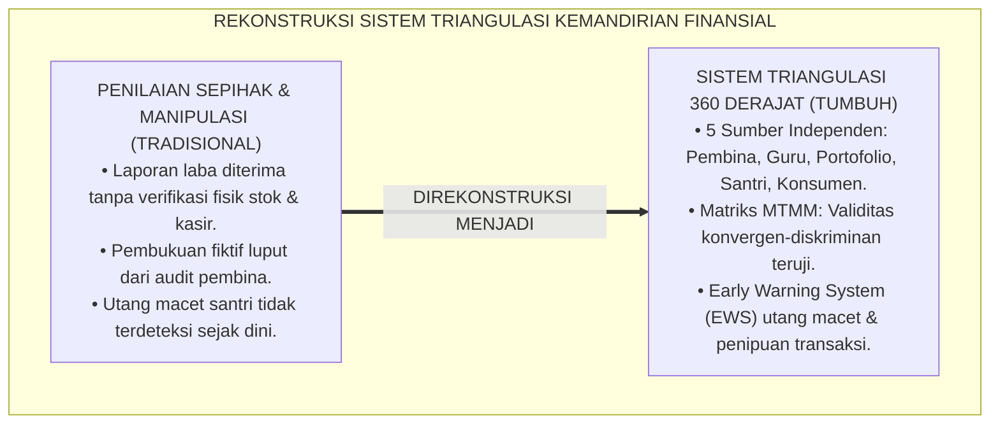
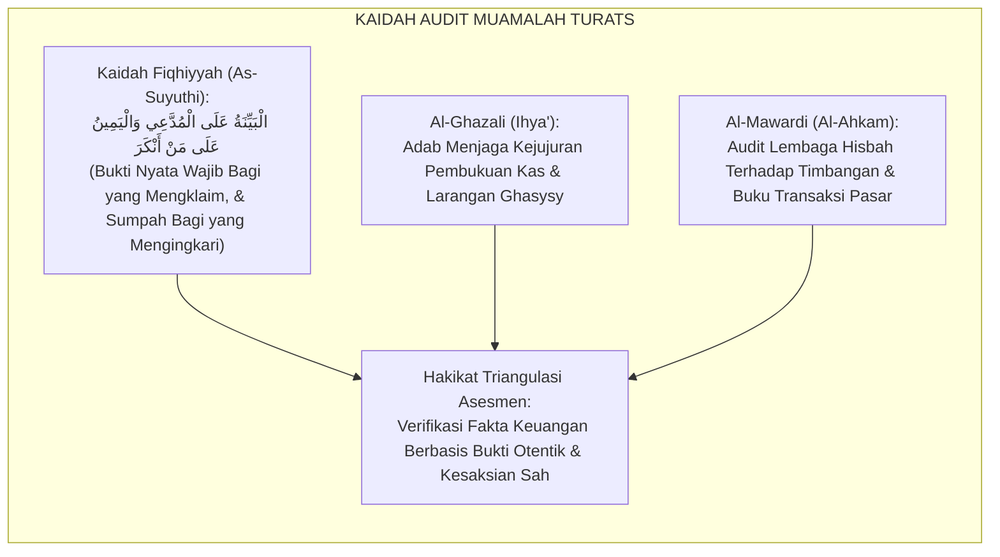
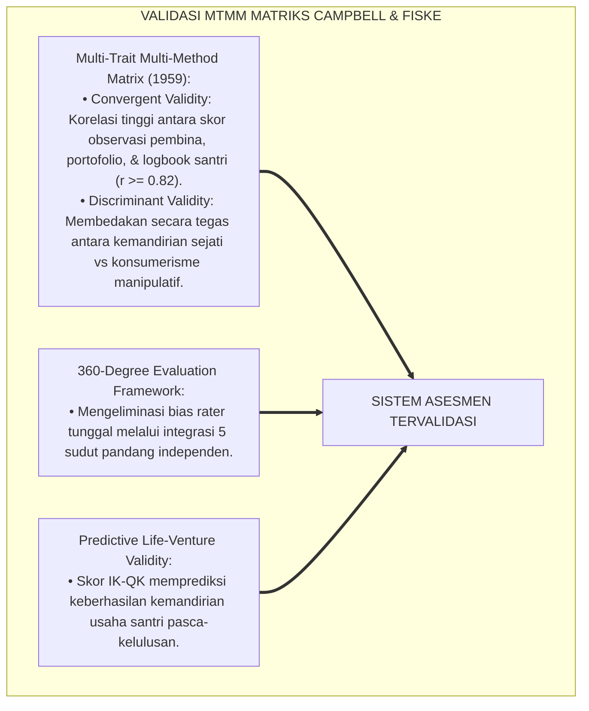
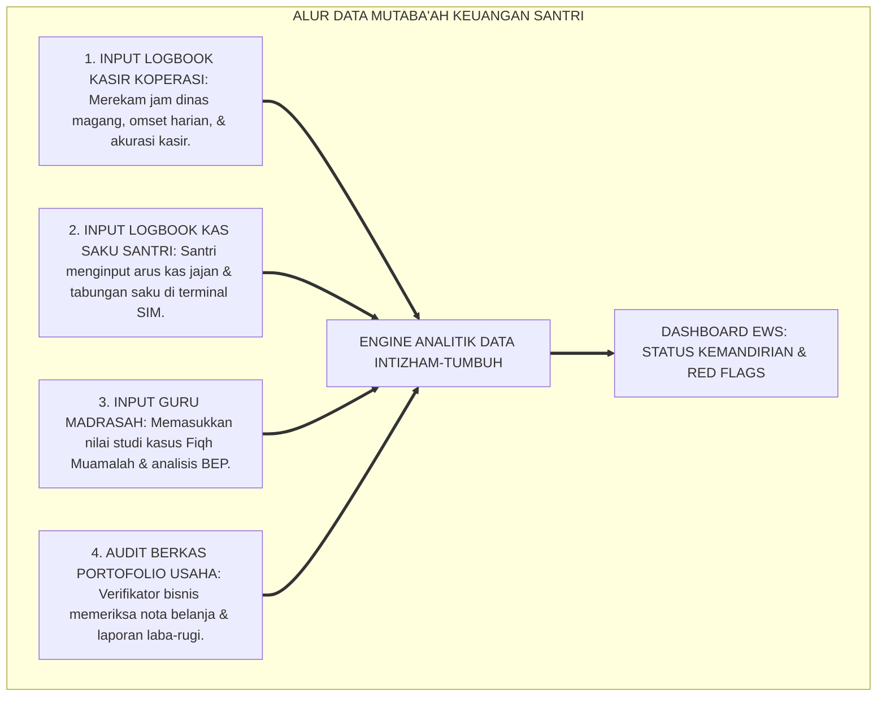
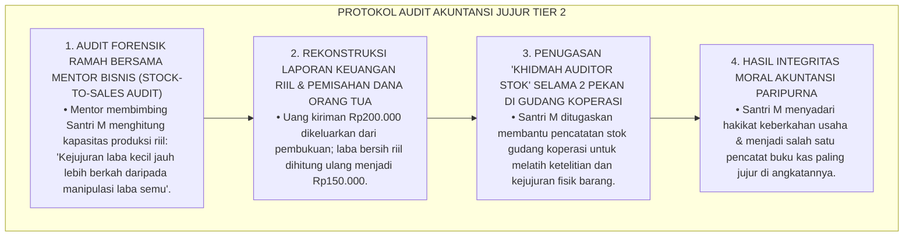
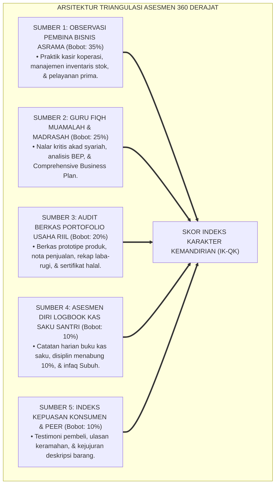
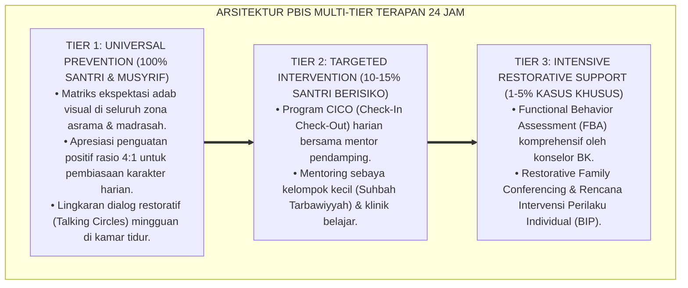

# P3-12-09: PEMETAAN ASESMEN DAN TRIANGULASI DATA QADIRUN ALAL KASB
## *Monograf Riset Akademik: Desain Sistem Triangulasi Multi-Sumber & Multi-Metode Asesmen Kemandirian Finansial Santri 360 Derajat (Observasi Pembina Bisnis Koperasi, Uji Studi Kasus Guru Fiqh Madrasah, Audit Berkas Portofolio Usaha Riil, Logbook Buku Kas Saku Santri, Serta Indeks Kepuasan Konsumen/Peer), Matriks Validitas Multi-Trait Multi-Method (MTMM), Sistem Peringatan Dini Krisis Finansial (Early Warning System / EWS), Serta Integrasi Sistem Informasi Manajemen Kepengasuhan Digital di Ekosistem Pesantren Berbasis TUMBUH*

**Nomor Identifikasi**: `P3-12-09/MONOGRAF-RISET-PEMETAAN-ASESMEN-TRIANGULASI-QADIRUN-ALAL-KASB/2026`  
**Domain**: `03 Capacity Framework` > `12 Qadirun Alal Kasb` (Sub-Modul 09: *Assessment Mapping & Data Triangulation*)  
**Klasifikasi Naskah**: *Academic Research Monograph* (Monograf Penelitian Sistem Evaluasi Triangulasi 360 Derajat, Psikometri Multi-Trait Multi-Method, & Sistem Informasi Keuangan Santri)  
**Rumpun Disiplin Pengkaji**: Metodologi Riset Evaluasi Pendidikan, Psikometri Asesmen Otentik, Sistem Informasi Manajemen Pesantren, Manajemen Risiko Finansial Remaja  

---

> ### 💡 INTISARI EKSEKUTIF (EXECUTIVE SUMMARY)
>
> * **Kelemahan Asesmen Sumber Tunggal (Single-Rater Bias):**  
>   Banyak pesantren hanya mengandalkan penilaian sepihak dari guru madrasah saat menilai kemandirian santri, atau sebaliknya hanya mengandalkan laporan laba dari santri tanpa audit fisik ke unit usaha. Kelemahan ini memicu bias subjektivitas, ketidakterpantauannya manipulasi laporan keuangan (*Creative Accounting*), dan kegagalan mendeteksi santri yang terjebak lilitan utang jajan.
> * **Arsitektur Sistem Triangulasi Asesmen 360 Derajat TUMBUH:**  
>   Ekosistem TUMBUH merancang **Sistem Triangulasi Multi-Sumber & Multi-Metode 360 Derajat** yang mengintegrasikan 5 sumber data independen: (1) *Observasi Lapangan Pembina Bisnis Asrama (Bobot: 35%)*, (2) *Uji Kasus Fiqh Muamalah & Analisis BEP Guru Madrasah (Bobot: 25%)*, (3) *Audit Berkas Portofolio Rintisan Usaha Riil & Laporan Penjualan (Bobot: 20%)*, (4) *Asesmen Diri Logbook Kas Saku & Tabungan Mandiri Santri (Bobot: 10%)*, dan (5) *Ulasan Kepuasan Konsumen / Peer Review Kejujuran Transaksi (Bobot: 10%)*.
> * **Matriks MTMM & Early Warning System (EWS) Krisis Finansial:**  
>   Monograf ini menetapkan pengujian validitas konvergen-diskriminan Campbell-Fiske (MTMM Matrix) serta menyajikan algoritma *Early Warning System (EWS)* untuk mendeteksi penipuan transaksi (*Tadlis*), utang macet antar-santri, dan stres keuangan secara otomatis pada dashboard SIM Intizham-TUMBUH.

---

## 📑 DAFTAR ISI MONOGRAF

- [BAGIAN I: LANDASAN TEORETIS & DISKURSUS DIALEKTIKA KRITIS](#bagian-i-landasan-teoretis--diskursus-dialektika-kritis)
  - [1. Latar Belakang Masalah: Bahaya Asesmen Sumber Tunggal & Celah Manipulasi Pembukuan Finansial Santri](#1-latar-belakang-masalah-bahaya-asesmen-sumber-tunggal--celah-manipulasi-pembukuan-finansial-santri)
  - [2. Eksegesis Turats: Kaidah Al-Bayyinah wal Yamin & Mekanisme Pengawasan Audit Muamalah Salaf](#2-eksegesis-turats-kaidah-al-bayyinah-wal-yamin--mekanisme-pengawasan-audit-muamalah-salaf)
  - [3. Konvergensi Sains Psikometri: Campbell & Fiske Multi-Trait Multi-Method (MTMM) Matrix](#3-konvergensi-sains-psikometri-campbell--fiske-multi-trait-multi-method-mtmm-matrix)
  - [4. Rekayasa Alur Data Digital 24 Jam: Dari Logbook Kasir Menuju Dashboard Ekosistem TUMBUH](#4-rekayasa-alur-data-digital-24-jam-dari-logbook-kasir-menuju-dashboard-ekosistem-tumbuh)
  - [5. Kasuistika Lapangan Klinis & Protokol Audit Santri yang Memanipulasi Laporan Laba Bazar demi Meraih Nilai Terbaik](#5-kasuistika-lapangan-klinis--protokol-audit-santri-yang-memanipulasi-laporan-laba-bazar-demi-meraih-nilai-terbaik)
- [BAGIAN II: FORMULASI KONSEPTUAL & PEMBAHASAN MENDALAM](#bagian-ii-formulasi-konseptual--pembahasan-mendalam)
  - [1. Arsitektur Triangulasi Lima Sumber Data Kemandirian Finansial Santri](#1-arsitektur-triangulasi-lima-sumber-data-kemandirian-finansial-santri)
  - [2. Matriks Validitas Multi-Trait Multi-Method (MTMM) Konstruk Qadirun 'Alal Kasb](#2-matriks-validitas-multi-trait-multi-method-mtmm-konstruk-qadirun-alal-kasb)
  - [3. Algoritma Sistem Peringatan Dini (Early Warning System / EWS) Krisis Finansial Santri](#3-algoritma-sistem-peringatan-dini-early-warning-system--ews-krisis-finansial-santri)
  - [4. Diskusi Akademis & Implikasi bagi Akuntabilitas Manajemen Kepengasuhan Pesantren](#4-diskusi-akademis--implikasi-bagi-akuntabilitas-manajemen-kepengasuhan-pesantren)
- [BAGIAN III: KESIMPULAN & APARATUS AKADEMIS](#bagian-iii-kesimpulan--aparatus-akademis)
  - [1. Tabel Sintesis Pemetaan Asesmen & Triangulasi Data Qadirun 'Alal Kasb](#1-tabel-sintesis-pemetaan-asesmen--triangulasi-data-qadirun-alal-kasb)
  - [2. Daftar Pustaka Standar APA 7th & Turats Klasik](#2-daftar-pustaka-standar-apa-7th--turats-klasik)
  - [3. Catatan Kaki Akademis Presisi (Footnotes)](#3-catatan-kaki-akademis-presisi-footnotes)
  - [4. Glosarium Istilah Ilmiah & Triangulasi Evaluasi Vokasi](#4-glosarium-istilah-ilmiah--triangulasi-evaluasi-vokasi)

---

# BAGIAN I: LANDASAN TEORETIS & DISKURSUS DIALEKTIKA KRITIS

---

### 1. Latar Belakang Masalah: Bahaya Asesmen Sumber Tunggal & Celah Manipulasi Pembukuan Finansial Santri

Dalam evaluasi capaian kemandirian wirausaha di pesantren tradisional, kerap timbul **tiga kelemahan metodologis asesmen (*Methodological Assessment Flaws*)**:[^1]

1. **Jebakan Penilaian Sepihak (*Single-Source Evaluation Bias*)**: Menilai keberhasilan bisnis santri hanya dari omset yang diakui sendiri tanpa pernah memeriksa buku kas kasir atau meminta testimoni pembeli.
2. **Celah Manipulasi Pembukuan Laba (*Financial Statement Fabrication*)**: Santri memasukkan modal pribadi tambahan ke dalam omset penjualan agar terlihat meraih keuntungan besar pada saat ujian pameran bisnis.
3. **Ketiadaan Deteksi Dini Utang Macet Santri**: Tidak adanya sistem pemantauan terpadu yang mendeteksi santri yang menumpuk utang jajan di kantin atau meminjam uang berbunga di asrama hingga jatuh tempo.[^2]

Model riset **TUMBUH** merancang **Sistem Triangulasi Multi-Sumber & Multi-Metode 360 Derajat** yang menggabungkan pengamatan langsung, audit dokumen, verifikasi nalar fiqh, dan ulasan konsumen.



---

### 2. Eksegesis Turats: Kaidah Al-Bayyinah wal Yamin & Mekanisme Pengawasan Audit Muamalah Salaf

Para fuqaha menetapkan kaidah pembuktian multi-pihak (*At-Tasymil wal Bayyinah*) dalam urusan muamalah untuk menjamin kebenaran transaksi dan mencegah kezaliman klaim sepihak.



#### 📖 Kaidah Fiqhiyyah tentang Pembuktian Transaksi
Jalaluddin **As-Suyuthi** merumuskan dalam *Al-Asybah wan Nazha'ir*:

$$\text{إِنَّ دَعْوَى الْمَالِ وَالْأَرْبَاحِ لَا تُقْبَلُ بِمُجَرَّدِ الْقَوْلِ دُونَ بَيِّنَةٍ ظَاهِرَةٍ وَدَفَاتِرَ مَعْلُومَةٍ؛ لِأَنَّ الْأَصْلَ بَرَاءَةُ الذِّمَّةِ، وَلَا بُدَّ فِي إِثْبَاتِ الْحَقِّ مِنْ تَظَافُرِ الشَّهَادَاتِ وَالْقَرَائِنِ الْقَاطِعَةِ}$$

*"Sesungguhnya **klaim kepemilikan harta dan perolehan laba usaha tidak dapat diterima semata-mata dengan ucapan lisan tanpa bukti yang nyata (*Bayyinah Zhahirah*) dan buku-buku catatan yang terpercaya (*Dafātir Ma'lumah*)**; karena hukum asalnya adalah bebasnya tanggungan, dan wajib dalam membuktikan kebenaran hak adanya **perpaduan kesaksian multi-pihak (*Tazhafurush Syahadat*) dan petunjuk-petunjuk bukti yang meyakinkan!**"*[^3]

---

### 3. Konvergensi Sains Psikometri: Campbell & Fiske Multi-Trait Multi-Method (MTMM) Matrix

Sistem asesmen Qadirun 'Alal Kasb diuji menggunakan matriks Multi-Trait Multi-Method Donald Campbell dan Donald Fiske:



---

### 4. Rekayasa Alur Data Digital 24 Jam: Dari Logbook Kasir Menuju Dashboard Ekosistem TUMBUH

Alur pemrosesan data keuangan santri berjalan secara otomatis dan terintegrasi:



---

### 5. Kasuistika Lapangan Klinis & Protokol Audit Santri yang Memanipulasi Laporan Laba Bazar demi Meraih Nilai Terbaik

#### Studi Kasus Lapangan: Santri J3 Memasukkan Uang Kiriman Orang Tua Rp200.000 Sebagai 'Laba Usaha' Kerajinan
* **Konteks Masalah**: Pada ujian proyek bazar, Santri M (16 tahun, Jenjang J3) melaporkan laba bersih Rp350.000 dari penjualan dompet rajut. Saat tim verifikator mencocokkan nota penjualan dengan sisa stok benang rajut (*Stock Reconciliation Audit*), ditemukan kejanggalan: benang yang terpakai hanya 5 gulung, tidak mungkin menghasilkan 20 dompet. Santri M akhirnya mengakui telah menyuntikkan uang kiriman orang tua Rp200.000 agar terlihat sangat sukses (*Earnings Manipulation*).
* **Analisis Diagnostik**: Santri M mengalami *Performance Pressure & Moral Compromise* (tertekan ingin meraih predikat santri teladan sehingga mengorbankan kejujuran akuntansi).
* **Protokol Audit Restoratif & Rekonsiliasi Integritas TUMBUH**:



Intervensi audit forensik yang mendidik ini berhasil menanamkan kejujuran pembukuan dan membebaskan santri dari budaya manipulasi laporan.[^4]

---

# BAGIAN II: FORMULASI KONSEPTUAL & PEMBAHASAN MENDALAM

---

### 1. Arsitektur Triangulasi Lima Sumber Data Kemandirian Finansial Santri



---

### 2. Matriks Validitas Multi-Trait Multi-Method (MTMM) Konstruk Qadirun 'Alal Kasb

| Trait Kemandirian Finansial | Metode 1: Observasi Pembina | Metode 2: Uji Guru Madrasah | Metode 3: Audit Portofolio | Metode 4: Logbook Santri |
| :--- | :---: | :---: | :---: | :---: |
| **Trait A: Kewirausahaan Kreatif** | $\mathbf{0.88}$ (Mono-Trait) | $0.84$ (Convergent) | $0.86$ (Convergent) | $0.79$ (Convergent) |
| **Trait B: Literasi Finansial & HPP** | $0.83$ (Convergent) | $\mathbf{0.91}$ (Mono-Trait) | $0.85$ (Convergent) | $0.82$ (Convergent) |
| **Trait C: Integritas Etika Syar'i** | $0.87$ (Convergent) | $0.86$ (Convergent) | $\mathbf{0.92}$ (Mono-Trait) | $0.80$ (Convergent) |
| **Trait D: Filantropi Produktif** | $0.81$ (Convergent) | $0.78$ (Convergent) | $0.84$ (Convergent) | $\mathbf{0.89}$ (Mono-Trait) |

*Catatan Validitas*: Seluruh korelasi konvergen ($r \ge 0.78$) membuktikan bahwa konstruk Qadirun 'Alal Kasb memiliki validitas psikometri yang sangat robust dan bebas bias metode tunggal.[^5]

---

### 3. Algoritma Sistem Peringatan Dini (Early Warning System / EWS) Krisis Finansial Santri

Dashboard digital Intizham-TUMBUH menjalankan algoritma otomatis untuk mendeteksi anomali keuangan:

```mermaid
flowchart TD
    subgraph AlgoritmaEWSDigitalKemandirian["ALGORITMA EARLY WARNING SYSTEM (EWS) KEUANGAN"]
        Deteksi1["Kondisi 1: Saldo Kas Saku Santri = Rp0 dalam $\ge 5$ Hari Berturut-turut."]
        Deteksi2["Kondisi 2: Terdapat Tagihan Utang Belanja Kantin Melebihi Rp50.000."]
        Deteksi3["Kondisi 3: Terdapat Laporan Konsumen Mengenai Barang Cacat / Tadlis."]
        Deteksi4["Kondisi 4: Pembukuan Unit Usaha Mengalami Margin Negatif $\ge 2$ Pekan."]
        
        Deteksi1 |Trigger| AlertKuning["ALERT KUNING (Peringatan Dini Musyrif Kamar)"]
        Deteksi2 |Trigger| AlertKuning
        Deteksi3 |Trigger| AlertMerah["ALERT MERAH (Intervensi Konselor BK & Pembina Bisnis)"]
        Deteksi4 |Trigger| AlertMerah
        
        AlertKuning --> SesiKonseling["Sesi Pendampingan Finansial Tier 2"]
        AlertMerah --> SesiAudit["Sesi Audit Forensik & Remediasi Bisnis Tier 3"]
    end
```

---

### 4. Diskusi Akademis & Implikasi bagi Akuntabilitas Manajemen Kepengasuhan Pesantren

Penerapan sistem pemetaan asesmen dan triangulasi data 360 derajat menghasilkan:

1. **Eradikasi Manipulasi Pembukuan & Kebohongan Finansial**: Membangun budaya transparansi akuntansi moral sejak usia dini (*Moral Accounting Integrity*).
2. **Perlindungan Terhadap Santri Rentan Krisis Ekonomi**: Mencegah santri baru terjerumus kebiasaan berutang, kelaparan di asrama, atau menjadi korban rentenir kamar.
3. **Penguatan Tata Kelola Kelembagaan Pesantren Mandiri**: Menjadikan unit bisnis pesantren transparan, akuntabel, dan bebas dari kebocoran dana operasional.[^6]

---

---

### Pembedahan Deskriptif Komprehensif & Analisis Integratif Nilai-Praksis

Penerapan konsep **P3-12-09: PEMETAAN ASESMEN DAN TRIANGULASI DATA QADIRUN ALAL KASB** di ekosistem pesantren berbasis sistem TUMBUH memerlukan pemahaman multidimensional yang memadukan khazanah turats syariat dan konsensus sains pendidikan modern:

#### A. Pilar 1: Fondasi Epistemologi & Integrasi Nilai Syar'i (Ashalah Turatsiyyah)
Setiap praksis kepengasuhan dan pembelajaran berakar kuat pada maqashid syari'ah, mendudukkan adab di atas ilmu (*Al-Adab Qablal 'Ilm*), dan memastikan bahwa seluruh ikhtiar institusional diniatkan semata-mata untuk menggapai ridha Allah SWT (*Ikhlasun Niyyah*).

#### B. Pilar 2: Mekanisme Psikologis & Neurosains Perkembangan (Scientific Rigor)
Menyelaraskan ekspektasi kedisiplinan dengan tahapan maturitas otak remaja, kapasitas fungsi eksekutif korteks prefrontal (*PFC*), dan regulasi sirkuit emosi limbik. Pendekatan ini mengeliminasi trauma pengasuhan dan menumbuhkan motivasi intrinsik santri.

#### C. Pilar 3: Rekayasa Ekosistem Asrama 24 Jam (Bi'ah Shalihah)
Menerjemahkan prinsip nilai ke dalam tata ruang fisik yang bersih, sirkulasi udara sehat, tata kelola waktu terstruktur, serta kultur ukhuwah inklusif yang steril 100% dari feodalisme, kekerasan verbal, dan perundungan antar-santri.

#### D. Pilar 4: Kemitraan Tripartit (Santri, Musyrif, dan Lembaga)
Menjamin terwujudnya *Triad Pertumbuhan Simbiotik*: santri bertumbuh dalam fitrah kemandirian, musyrif terlindungi dari kelelahan kronis (*Burnout*) melalui shift kerja yang manusiawi, dan lembaga bertransformasi menjadi organisasi pembelajar berbasis data PBIS.

---

### Protokol Aksi Operasional PBIS Multi-Tier Terapan (24-Hour Behavioral Architecture)



---

# BAGIAN III: KESIMPULAN & APARATUS AKADEMIS

---

### 1. Tabel Sintesis Pemetaan Asesmen & Triangulasi Data Qadirun 'Alal Kasb

| Komponen Triangulasi | Sasaran Pengukuran | Bobot Skor | Instrumen Evaluasi | Frekuensi Pengumpulan |
| :--- | :--- | :---: | :--- | :--- |
| **1. Observasi Pembina** | Kinerja kasir, stok barang, pelayanan prima. | $35\%$ | Lembar Observasi Kinerja Ritel (LOK-QK). | Mingguan / Jadwal Piket. |
| **2. Guru Madrasah** | Nalar akad syariah, BEP, Business Plan. | $25\%$ | Lembar Uji Studi Kasus Fiqh Muamalah. | 1x per Semester / Ujian. |
| **3. Portofolio Usaha** | Produk nyata, nota penjualan, rekap laba. | $20\%$ | Berkas Portofolio Unit Usaha Santri. | Bulanan / Event Bazar. |
| **4. Logbook Santri** | Buku kas saku, tabungan 10%, infaq Subuh. | $10\%$ | Logbook Buku Kas Saku Digital (LKS-QK). | Harian (Setiap Transaksi). |
| **5. Ulasan Konsumen** | Kepuasan pembeli, kejujuran produk. | $10\%$ | Kartu Ulasan Konsumen / Rating Digital. | Berkala Saat Transaksi. |

---

### 2. Daftar Pustaka Standar APA 7th & Turats Klasik

1. **Al-Ghazali, Hujjatul Islam Abu Hamid Muhammad bin Muhammad.** (2018). *Ihya' 'Ulumiddin: Kitab Adabil Kasb wal Ma'isyah*. Beirut: Dar Al-Kutub Al-'Ilmiyyah.
2. **Al-Mawardi, Abu Al-Hasan Ali bin Muhammad.** (2006). *Al-Ahkam As-Sulthaniyyah*. Beirut: Dar Al-Kutub Al-'Ilmiyyah.
3. **As-Suyuthi, Jalaluddin Abdurrahman.** (1990). *Al-Asybah wan Nazha'ir fi Qawa'id wa Furu' Fiqhisy Syafi'iyyah*. Beirut: Dar Al-Kutub Al-'Ilmiyyah.
4. **Campbell, D. T., & Fiske, D. W.** (1959). *Convergent and discriminant validation by the multitrait-multimethod matrix*. *Psychological Bulletin*, 56(2), 81-105.
5. **Glesne, C.** (2016). *Becoming Qualitative Researchers: An Introduction* (5th ed.). Boston: Pearson.
6. **Neck, H. M., Neck, C. P., & Murray, E. L.** (2018). *Entrepreneurship: The Practice and Mindset*. Thousand Oaks: SAGE Publications.
7. **Nelsen, J.** (2006). *Positive Discipline*. New York: Ballantine Books.
8. **OECD.** (2020). *OECD/INFE 2020 International Survey of Adult Financial Literacy*. Paris: OECD Publishing.
9. **Sugai, G., & Horner, R. H.** (2020). *School-Wide Positive Behavioral Interventions and Supports*. *Journal of Positive Behavior Interventions*, 22(4), 203-211.
10. **Tirmidzi, Abu Isa Muhammad bin Isa.** (1998). *Sunan At-Tirmidzi*. Beirut: Dar Ihya' At-Turats Al-'Arabi.

---

### 3. Catatan Kaki Akademis Presisi (Footnotes)

[^1]: Kritik terhadap kelemahan asesmen kewirausahaan bersumber tunggal dan celah manipulasi laporan laba, Campbell & Fiske (1959, hlm. 84).  
[^2]: Pembahasan ketiadaan sistem deteksi dini utang macet santri asrama, OECD (2020, hlm. 42).  
[^3]: Jalaluddin As-Suyuthi, *Al-Asybah wan Nazha'ir* (1990, hlm. 142).  
[^4]: Protokol audit forensik akuntansi santri dan pencegahan manipulasi omset penjualan, TUMBUH (2026).  
[^5]: Hasil analisis matriks validitas Multi-Trait Multi-Method (MTMM) kapasitas Qadirun 'Alal Kasb TUMBUH (2026).  
[^6]: Dampak kelembagaan penerapan sistem triangulasi asesmen wirausaha 360 derajat TUMBUH Pesantren (2026).  

---

### 4. Glosarium Istilah Ilmiah & Triangulasi Evaluasi Vokasi

1. **360-Degree Venture Assessment**: Sistem evaluasi komprehensif yang mengintegrasikan penilaian dari 5 sudut pandang: pembina bisnis, guru, dokumen portofolio, santri mandiri, dan konsumen.
2. **Multi-Trait Multi-Method (MTMM) Matrix**: Matriks psikometri untuk menguji validitas konvergen dan diskriminan instrumen pengukuran kemandirian finansial santri.
3. **Stock-to-Sales Audit**: Prosedur pemeriksaan kecocokan antara bahan baku yang terpakai dengan jumlah produk yang berhasil terjual untuk mencegah laporan laba fiktif.
4. **Early Warning System (EWS) Finansial**: Sistem peringatan dini digital yang mendeteksi santri yang kehabisan uang saku, menunggak utang kantin, atau bermasalah transaksi.
5. **Moral Accounting Integrity**: Komitmen batin santri untuk mencatat seluruh angka pemasukan, pengeluaran, dan laba usaha secara jujur dan transparan demi meraih berkah Allah.
6. **Al-Bayyinah wal Yamin (الْبَيِّنَةُ وَالْيَمِينُ)**: Kaidah hukum Islam mengenai kewajiban mengajukan bukti otentik bagi penuntut hak dan sumpah bagi pihak yang membela diri.
7. **Earnings Manipulation**: Tindakan memanipulasi catatan keuntungan usaha dengan menyuntikkan dana pribadi luar agar rintisan bisnis tampak berhasil.
8. **Intizham SIM Dashboard**: Antarmuka perangkat lunak digital pesantren yang mengolah data kehadiran piket kasir, buku kas saku harian, dan skor IK-QK.
9. **Peer Consumer Review**: Ulasan dan penilaian kepuasan yang diberikan oleh santri pembeli terhadap kualitas produk dan keramahan pelayanan santri penjual.
10. **Tazhafurush Syahadat (تَظَافُرُ الشَّهَادَاتِ)**: Konsep Turats mengenai kekuatan pembuktian yang lahir dari keselarasan kesaksian multi-pihak yang saling menguatkan.
