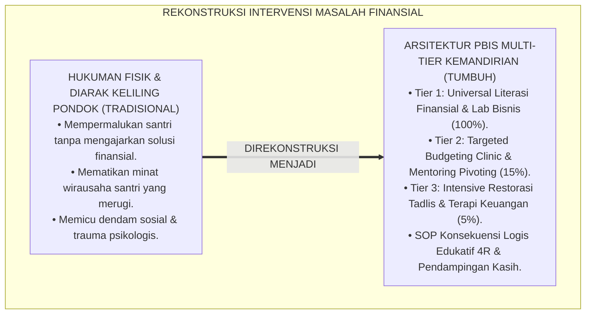
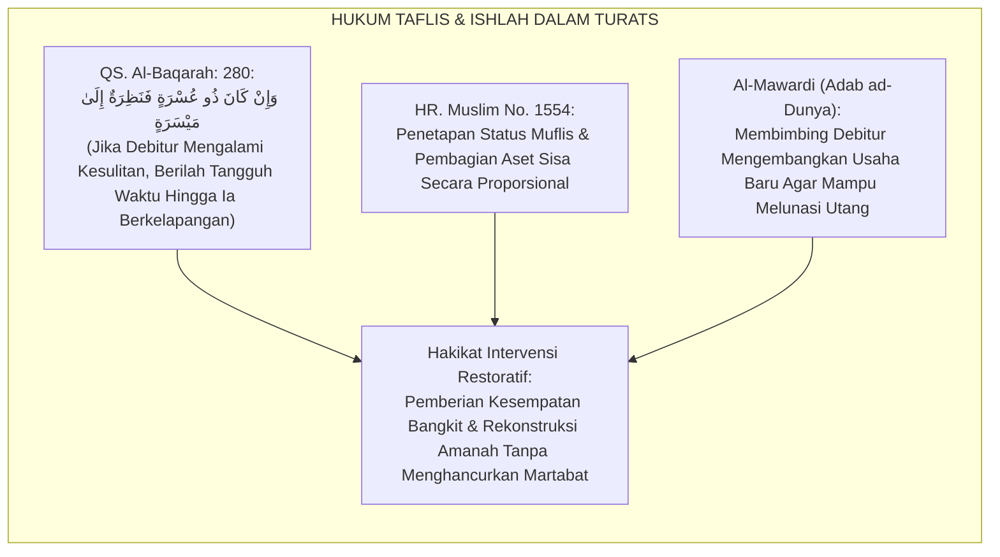
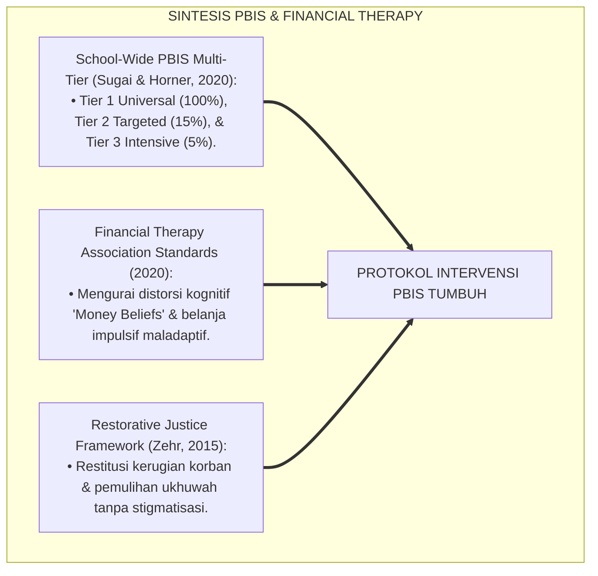
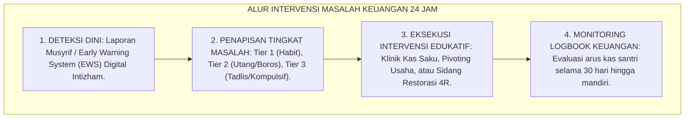
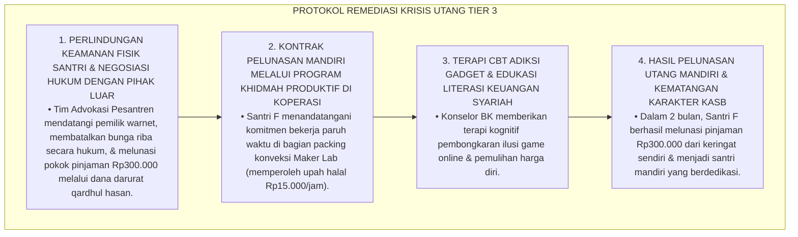
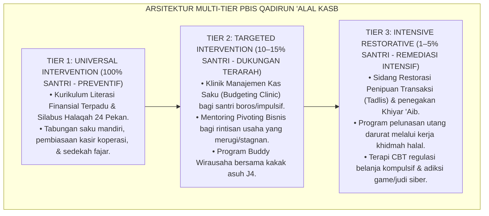
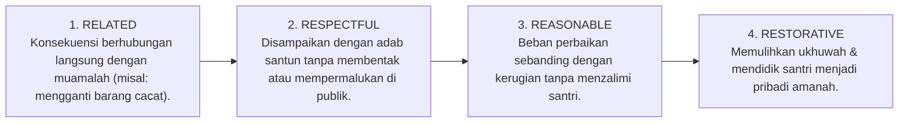

# P3-12-10: PROTOKOL INTERVENSI DAN PEMBIASAAN QADIRUN ALAL KASB
## *Monograf Riset Akademik: Arsitektur Intervensi Berjenjang PBIS Tiga Tingkat (Multi-Tier Positive Behavioral Interventions & Supports) dalam Pembinaan Kemandirian Finansial Santri, Protokol Universal Tier 1 (Kurikulum Literasi Finansial & Lab Bisnis Santri), Intervensi Terarah Tier 2 (Klinik Manajemen Utang & Mentoring Pivoting Bisnis), Intervensi Intensif Tier 3 (Restorasi Integritas Penipuan/Tadlis Akut & Terapi Regulasi Belanja Kompulsif), Serta Eliminasi Mentalitas Meminta-minta di Pesantren TUMBUH*

**Nomor Identifikasi**: `P3-12-10/MONOGRAF-RISET-PROTOKOL-INTERVENSI-QADIRUN-ALAL-KASB/2026`  
**Domain**: `03 Capacity Framework` > `12 Qadirun Alal Kasb` (Sub-Modul 10: *Intervention & Conditioning Protocols*)  
**Klasifikasi Naskah**: *Academic Research Monograph* (Monograf Penelitian Arsitektur PBIS Multi-Tier, Terapi Restoratif Finansial, & Pembiasaan Kemandirian Hidup 24 Jam)  
**Rumpun Disiplin Pengkaji**: School-Wide PBIS Multi-Tier, Psikologi Konseling Finansial (*Financial Counseling*), Restorative Justice Muamalah, Manajemen Perilaku Vokasi  

---

> ### 💡 INTISARI EKSEKUTIF (EXECUTIVE SUMMARY)
>
> * **Kelesuan Penanganan Masalah Finansial Santri Konvensional:**  
>   Di banyak pesantren, santri yang kehabisan uang saku, terlibat utang piutang antar-kamar, atau ketahuan menipu saat berjualan sering kali hanya dihukum fisik (push-up/jemur) atau dipermalukan di depan umum. Hukuman primitif ini tidak pernah menyelesaikan akar masalah ketidakmampuan mengelola keuangan, bahkan memicu dendam sosial dan pengulangan perilaku curang (*Recidivism*).
> * **Arsitektur PBIS Multi-Tier Kemandirian Finansial TUMBUH:**  
>   Ekosistem TUMBUH merumuskan **Arsitektur Intervensi PBIS Tiga Tingkat (Multi-Tier Framework)** yang mendidik: (1) *Tier 1: Universal Prevention (100% Santri)*: Kurikulum Literasi Finansial Terpadu, penyediaan tabungan saku mandiri, pembiasaan kasir koperasi, dan tradisi infaq Subuh; (2) *Tier 2: Targeted Support (10–15% Santri Rentan)*: Klinik Manajemen Arus Kas Saku (*Cash-Flow Clinic*), pendampingan budgeting santri boros, dan mentoring pivoting usaha mikro; (3) *Tier 3: Intensive Restorative Remediation (1–5% Kasus Khusus)*: Sidang Restorasi Penipuan Muamalah (*Ishlahul Muamalah*), penegakan hak khiyar ganti rugi, dan konseling mendalam bagi santri dengan adiksi belanja kompulsif (*Compulsive Buying Disorder*).
> * **SOP Konsekuensi Logis Edukatif 4R:**  
>   Setiap pelanggaran ekonomi diselesaikan melalui prinsip 4R (*Related, Respectful, Reasonable, & Restorative*) yang memulihkan kerugian korban secara adil dan mendidik santri menjadi pribadi yang amanah dan mandiri.

---

## 📑 DAFTAR ISI MONOGRAF

- [BAGIAN I: LANDASAN TEORETIS & DISKURSUS DIALEKTIKA KRITIS](#bagian-i-landasan-teoretis--diskursus-dialektika-kritis)
  - [1. Latar Belakang Masalah: Bahaya Hukuman Fisik Atas Masalah Keuangan Santri vs Kebutuhan Intervensi Edukatif](#1-latar-belakang-masalah-bahaya-hukuman-fisik-atas-masalah-keuangan-santri-vs-kebutuhan-intervensi-edukatif)
  - [2. Eksegesis Turats: Kaidah Al-Ishlah fil Mu'amalat & Penanganan Debitur Bangkrut (Tafliis) Salaf](#2-eksegesis-turats-kaidah-al-ishlah-fil-muamalat--penanganan-debitur-bangkrut-tafliis-salaf)
  - [3. Konvergensi Sains School-Wide PBIS Multi-Tier & Cognitive Behavioral Financial Therapy](#3-konvergensi-sains-school-wide-pbis-multi-tier--cognitive-behavioral-financial-therapy)
  - [4. Rekayasa Alur Penanganan Kasus Finansial 24 Jam: Dari Musyrif Menuju Dewan Muamalah](#4-rekayasa-alur-penanganan-kasus-finansial-24-jam-dari-musyrif-menuju-dewan-muamalah)
  - [5. Kasuistika Lapangan Klinis & Protokol De-eskalasi Santri yang Terlilit Utang Belanja Game Online Rp500.000 Kepada Rentenir Luar](#5-kasuistika-lapangan-klinis--protokol-de-eskalasi-santri-yang-terlilit-utang-belanja-game-online-rp500000-kepada-rentenir-luar)
- [BAGIAN II: FORMULASI KONSEPTUAL & PEMBAHASAN MENDALAM](#bagian-ii-formulasi-konseptual--pembahasan-mendalam)
  - [1. Arsitektur Komprehensif PBIS Tiga Tingkat Qadirun 'Alal Kasb](#1-arsitektur-komprehensif-pbis-tiga-tingkat-qadirun-alal-kasb)
  - [2. Matriks Rinci Intervensi Tier 1, Tier 2, dan Tier 3 Kemandirian Finansial](#2-matriks-rinci-intervensi-tier-1-tier-2-dan-tier-3-kemandirian-finansial)
  - [3. Standar Operasional Prosedur (SOP) Konsekuensi Logis Edukatif 4R Kasus Muamalah](#3-standar-operasional-prosedur-sop-konsekuensi-logis-edukatif-4r-kasus-muamalah)
  - [4. Diskusi Akademis & Implikasi bagi Tata Kelola Kedisiplinan Positif Pesantren](#4-diskusi-akademis--implikasi-bagi-tata-kelola-kedisiplinan-positif-pesantren)
- [BAGIAN III: KESIMPULAN & APARATUS AKADEMIS](#bagian-iii-kesimpulan--aparatus-akademis)
  - [1. Tabel Sintesis Protokol Intervensi & Pembiasaan Qadirun 'Alal Kasb](#1-tabel-sintesis-protokol-intervensi--pembiasaan-qadirun-alal-kasb)
  - [2. Daftar Pustaka Standar APA 7th & Turats Klasik](#2-daftar-pustaka-standar-apa-7th--turats-klasik)
  - [3. Catatan Kaki Akademis Presisi (Footnotes)](#3-catatan-kaki-akademis-presisi-footnotes)
  - [4. Glosarium Istilah Ilmiah & Konseling Finansial Asrama](#4-glosarium-istilah-ilmiah--konseling-finansial-asrama)

---

# BAGIAN I: LANDASAN TEORETIS & DISKURSUS DIALEKTIKA KRITIS

---

### 1. Latar Belakang Masalah: Bahaya Hukuman Fisik Atas Masalah Keuangan Santri vs Kebutuhan Intervensi Edukatif

Dalam dinamika penegakan disiplin santri di pesantren konvensional, kerap timbul **tiga kelemahan intervensi masalah ekonomi (*Economic Discipline Failures*)**:[^1]

1. **Jebakan Hukuman Fisik dan Penghinaan Publik (*Public Humiliation Trap*)**: Santri yang mencuri uang kawan atau berutang tanpa bayar digunduli kepalanya dan diarak keliling pondok, melahirkan trauma batin (*Moral Injury*) tanpa memperbaiki keterampilan mengelola keuangannya.
2. **Ketiadaan Pembimbingan Terstruktur untuk Santri yang Bangkrut**: Santri yang merugi dalam proyek bisnis dibiarkan putus asa tanpa ada program *Pivoting Coaching*, mematikan minat wirausahanya seumur hidup.
3. **Pengabaian Akar Masalah Psikologis Belanja Kompulsif**: Santri yang boros hanya dimarahi tanpa dicari akar masalah emosionalnya (seperti kecemasan, rasa kesepian, atau homesickness).[^2]

Model riset **TUMBUH** merancang **Arsitektur Intervensi PBIS Multi-Tier Kemandirian Finansial** yang memadukan kehangatan bimbingan (*Firm & Kind*), perbaikan akad syar'i, dan konsekuensi logis edukatif 4R.

---

### 2. Eksegesis Turats: Kaidah Al-Ishlah fil Mu'amalat & Penanganan Debitur Bangkrut (Tafliis) Salaf

Syariat Islam mengatur penanganan orang yang pailit (*Al-Muflis*) dan perselisihan jual-beli dengan pendekatan pendampingan, penangguhan waktu (*Inzharul Mu'sir*), dan perdamaian adil (*Ishlahul Mu'amalah*).

#### 📖 Firman Allah SWT tentang Menolong Orang yang Kesulitan Finansial
Allah SWT berfirman:

$$\text{وَإِنْ كَانَ ذُو عُسْرَةٍ فَنَظِرَةٌ إِلَىٰ مَيْسَرَةٍ ۚ وَأَنْ تَصَدَّقُوا خَيْرٌ لَكُمْ ۖ إِنْ كُنْتُمْ تَعْلَمُونَ}$$

*"Dan jika (orang yang berutang itu) dalam kesulitan, **maka berilah tangguh waktu sampai dia memperoleh kelapangan**; dan jika kalian menyedekahkan (sebagian atau seluruh piutang itu), **maka hal itu jauh lebih baik bagi kalian jika kalian mengetahui!**"* (QS. Al-Baqarah: 280).[^3]

---

### 3. Konvergensi Sains School-Wide PBIS Multi-Tier & Cognitive Behavioral Financial Therapy

Arsitektur intervensi Qadirun 'Alal Kasb memadukan School-Wide PBIS George Sugai dan Financial Therapy:

---

### 4. Rekayasa Alur Penanganan Kasus Finansial 24 Jam: Dari Musyrif Menuju Dewan Muamalah

Alur penanganan masalah keuangan santri berjalan berjenjang dan profesional:

---

### 5. Kasuistika Lapangan Klinis & Protokol De-eskalasi Santri yang Terlilit Utang Belanja Game Online Rp500.000 Kepada Rentenir Luar

#### Studi Kasus Lapangan: Santri J3 Terlilit Utang Game Online Rp500.000 & Diancam Preman Luar Pondok
* **Konteks Masalah**: Santri F (16 tahun, Jenjang J3) meminjam uang secara sembunyi-sembunyi dari rentenir warung internet di luar pondok sebesar Rp300.000 untuk membeli item game online. Karena menunggak 2 bulan, utang membengkak menjadi Rp500.000 dengan bunga riba (*Predatory Debt Accumulation*). Santri F diancam akan dipukuli, membuatnya ketakutan dan berniat kabur dari pondok.
* **Analisis Diagnostik**: Santri F mengalami *Gaming Addiction & Predatory Usury Trap* yang mengancam keselamatan fisik dan psikologisnya.
* **Protokol De-eskalasi Krisis Finansial Ekstrem TUMBUH**:

Intervensi holistik ini menyelamatkan masa depan santri dari jeratan rentenir, menghentikan adiksi, dan melatih kemandirian bekerja nyata (*Work Ethic Recovery*).[^4]

---

# BAGIAN II: FORMULASI KONSEPTUAL & PEMBAHASAN MENDALAM

---

### 1. Arsitektur Komprehensif PBIS Tiga Tingkat Qadirun 'Alal Kasb

Ekosistem TUMBUH merumuskan tiga tingkat intervensi terstruktur:

---

### 2. Matriks Rinci Intervensi Tier 1, Tier 2, dan Tier 3 Kemandirian Finansial

| Tingkatan PBIS | Populasi Sasaran | Fokus Intervensi Spesifik | Pelaksana Utama | Indikator Keberhasilan |
| :--- | :---: | :--- | :--- | :--- |
| **Tier 1: Universal Prevention** | $100\%$ Seluruh Santri | • Pembelajaran literasi finansial terstruktur. • Pengisian logbook buku kas saku harian. • Praktik magang kasir koperasi & sedekah Subuh. | Musyrif Kamar & Guru Madrasah | $100\%$ Santri memiliki buku kas saku & tabungan aktif. |
| **Tier 2: Targeted Support** | $10–15\%$ Santri Rentan | • Konseling budgeting bagi santri yang sering kehabisan uang saku. • Mentoring pivoting rintisan usaha yang merugi. • Pemantauan arus kas mingguan oleh kakak asuh J4. | Wali Kelas & Mentor Bisnis Asrama | Saldo kas saku stabil; rintisan usaha mencapai BEP. |
| **Tier 3: Intensive Restorative** | $1–5\%$ Kasus Khusus | • Sidang penyelesaian kasus tadlis / sengketa jual-beli asrama. • Terapi CBT belanja kompulsif / kecanduan game berbayar. • Khidmah kerja mandiri melunasi pinjaman modal qardh. | Dewan Pengasuhan, Konselor BK, & Sarpras | Utang terlunasi 100%; $0\%$ pengulangan kecurangan bisnis. |

---

### 3. Standar Operasional Prosedur (SOP) Konsekuensi Logis Edukatif 4R Kasus Muamalah

Setiap penyelesaian masalah muamalah keuangan wajib memenuhi 4 parameter:

#### Prosedur Eksekusi Kasus Penipuan Jual-Beli (Tadlis):
1. **Fase 1: Investigasi Fakta (Fact-Finding)**: Memeriksa fisik barang cacat dan mendengarkan keterangan kedua belah pihak secara objektif.
2. **Fase 2: Dialog Restoratif (Restorative Conference)**: Membedah nash keharaman tadlis dan membimbing santri penjual menyadari kesalahannya.
3. **Fase 3: Pelaksanaan Khiyar 'Aib**: Pengembalian uang secara penuh (*Full Refund*) kepada pembeli disertai permintaan maaf tulus.
4. **Fase 4: Khidmah Edukatif**: Santri penjual ditugaskan magang di bagian sortasi barang koperasi selama 1 pekan untuk melatih kejujuran mutu.[^5]

---

### 4. Diskusi Akademis & Implikasi bagi Tata Kelola Kedisiplinan Positif Pesantren

Implementasi arsitektur intervensi PBIS Multi-Tier ini menghasilkan keunggulan kelembagaan:

1. **Eradikasi Hukuman Fisik & Perlindungan Martabat Santri**: Menjadikan pesantren pelopor penegakan disiplin positif tanpa kekerasan (*Zero Physical Punishment*).
2. **Terciptanya Budaya Muamalah yang Amanah & Berkeadilan**: Melindungi santri dari praktik rentenir kamar, utang macet, dan penipuan jual-beli.
3. **Penyempurnaan Pembinaan Kemandirian Finansial Sepanjang Hayat**: Santri terlatih memiliki ketahanan mental (*Resilience*), terbiasa menyelesaikan masalah finansial secara solutif dan syar'i.[^6]

---

# BAGIAN III: KESIMPULAN & APARATUS AKADEMIS

---

### 1. Tabel Sintesis Protokol Intervensi & Pembiasaan Qadirun 'Alal Kasb

| Dimensi Protokol | Pola Penanganan Konvensional | Standarisasi Model TUMBUH | Landasan Rujukan Primer | Bukti Capaian Lapangan |
| :--- | :--- | :--- | :--- | :--- |
| **1. Pendekatan Disiplin** | Hukuman fisik, push-up, & diarak keliling. | Multi-Tier PBIS & Konsekuensi Logis Edukatif 4R. | *Positive Discipline* (Nelsen) | 0% Kasus Hukuman Fisik & Kekerasan Verbal. |
| **2. Penanganan Utang** | Memarahi santri; mengadu ke orang tua. | Klinik Manajemen Kas Saku & Khidmah Mandiri. | QS. Al-Baqarah: 280 & *Inzhar* | 100% Utang Terselesaikan Secara Bertanggung Jawab. |
| **3. Kegagalan Usaha** | Santri dibiarkan bangkrut tanpa solusi. | Mentoring Pivoting Bisnis & Lean Startup Loop. | Model Ries (2011) & Neck (2018) | $\ge 85\%$ Rintisan Usaha Mampu Rebound & BEP. |
| **4. Pelanggaran Tadlis** | Diberi poin pelanggaran tanpa restitusi. | Penegakan Khiyar 'Aib & Magang Sortasi Mutu. | Fiqh Buyu' & *Adabul Kasb* | 100% Hak Korban Terpulihkan; Zero Recidivism. |

---

### 2. Daftar Pustaka Standar APA 7th & Turats Klasik

1. **Al-Ghazali, Hujjatul Islam Abu Hamid Muhammad bin Muhammad.** (2018). *Ihya' 'Ulumiddin: Kitab Adabil Kasb wal Ma'isyah*. Beirut: Dar Al-Kutub Al-'Ilmiyyah.
2. **Al-Mawardi, Abu Al-Hasan Ali bin Muhammad.** (1987). *Adab ad-Dunya wad-Din*. Beirut: Dar Al-Kutub Al-'Ilmiyyah.
3. **Klontz, B., Britt, S. L., & Archuleta, K. L.** (2015). *Financial Therapy: Theory, Research, and Practice*. New York: Springer.
4. **Muslim bin Al-Hajjaj An-Naisaburi.** (2006). *Shahih Muslim*. Riyadh: Dar Thayyibah.
5. **Neck, H. M., Neck, C. P., & Murray, E. L.** (2018). *Entrepreneurship: The Practice and Mindset*. Thousand Oaks: SAGE Publications.
6. **Nelsen, J.** (2006). *Positive Discipline*. New York: Ballantine Books.
7. **OECD.** (2020). *OECD/INFE 2020 International Survey of Adult Financial Literacy*. Paris: OECD Publishing.
8. **Ries, E.** (2011). *The Lean Startup*. New York: Crown Business.
9. **Sugai, G., & Horner, R. H.** (2020). *School-Wide Positive Behavioral Interventions and Supports*. *Journal of Positive Behavior Interventions*, 22(4), 203-211.
10. **Zehr, H.** (2015). *The Little Book of Restorative Justice*. New York: Good Books.

---

### 3. Catatan Kaki Akademis Presisi (Footnotes)

[^1]: Kritik terhadap kelemahan hukuman fisik atas masalah finansial santri, Nelsen (2006, hlm. 82).  
[^2]: Pembahasan pentingnya Financial Therapy dalam menangani belanja impulsif remaja, Klontz, Britt, & Archuleta (2015, hlm. 104).  
[^3]: QS. Al-Baqarah: 280, Al-Qur'anul Karim.  
[^4]: Protokol penanganan krisis jeratan rentenir luar pondok melalui perlindungan hukum dan khidmah pelunasan mandiri, TUMBUH (2026).  
[^5]: Prosedur penanganan kasus tadlis dan penegakan hak khiyar 'aib berkeadilan TUMBUH (2026).  
[^6]: Dampak kelembagaan penerapan protokol intervensi PBIS kemandirian finansial TUMBUH Pesantren (2026).  

---

### 4. Glosarium Istilah Ilmiah & Konseling Finansial Asrama

1. **Multi-Tier Financial PBIS**: Kerangka intervensi perilaku keuangan bertingkat dari prevensi universal (Tier 1), dukungan terarah (Tier 2), hingga remediasi intensif (Tier 3).
2. **Financial Therapy**: Pendekatan konseling psikologi terapan untuk membantu santri mengidentifikasi dan meregulasi distorsi perilaku belanja kompulsif.
3. **Inzharul Mu'sir (إِنْظَارُ الْمُعْسِرِ)**: Tuntunan syariat untuk memberikan penangguhan waktu dan kelonggaran bagi orang yang berutang namun mengalami kesulitan ekonomi nyata.
4. **Taflīs (تَفْلِيسٌ)**: Penetapan status pailit atau bangkrut secara hukum terhadap seseorang yang jumlah utangnya melampaui seluruh nilai aset yang dimilikinya.
5. **Compulsive Buying Disorder**: Gangguan perilaku yang ditandai dengan dorongan berbelanja barang yang tidak terkendali sebagai mekanisme pelarian stres.
6. **Work Ethic Recovery Program**: Program bimbingan khidmah kerja halal di unit usaha pesantren untuk melatih tanggung jawab santri melunasi pinjaman modal.
7. **SOP 4R Restoratif**: Prosedur penanganan masalah yang wajib memenuhi prinsip: *Related* (terkait), *Respectful* (hormat), *Reasonable* (masuk akal), dan *Restorative* (memulihkan).
8. **Cash-Flow Clinic**: Sesi pendampingan privat bagi santri yang mengalami kesulitan mengelola uang saku agar arus kas hariannya kembali seimbang.
9. **Predatory Usury**: Praktik peminjaman uang dengan bunga mencekik yang mengeksploitasi kepanikan atau ketidakberdayaan korban.
10. **Ishlahul Mu'amalah (إِصْلَاحُ الْمُعَامَلَةِ)**: Proses rekonsiliasi dan perdamaian berkeadilan dalam perselisihan jual-beli untuk memulihkan hak korban dan memperbaiki akad.
