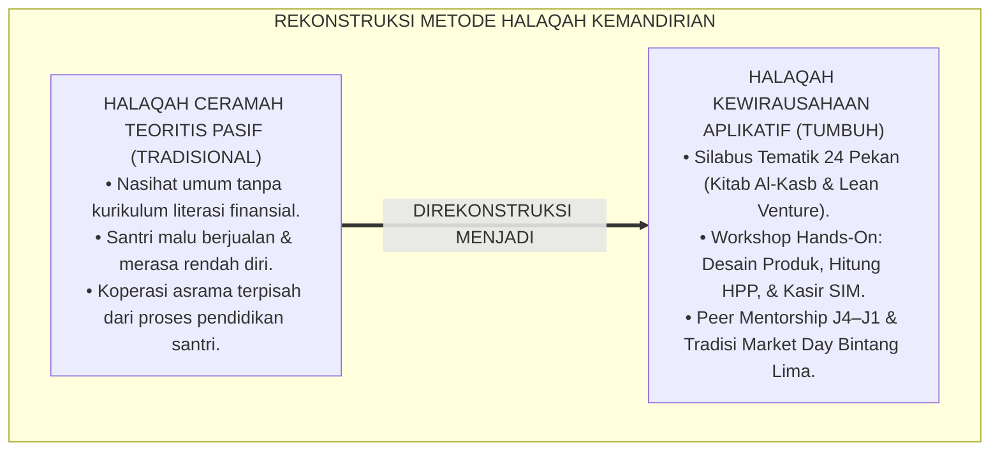
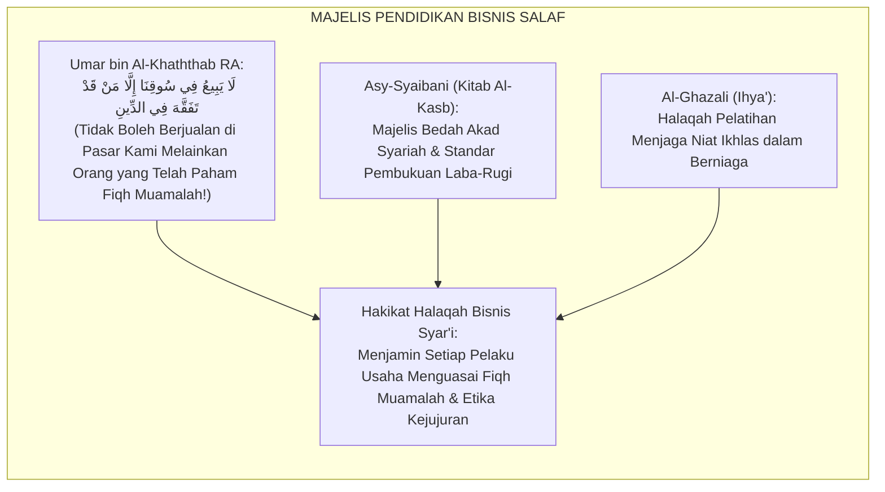
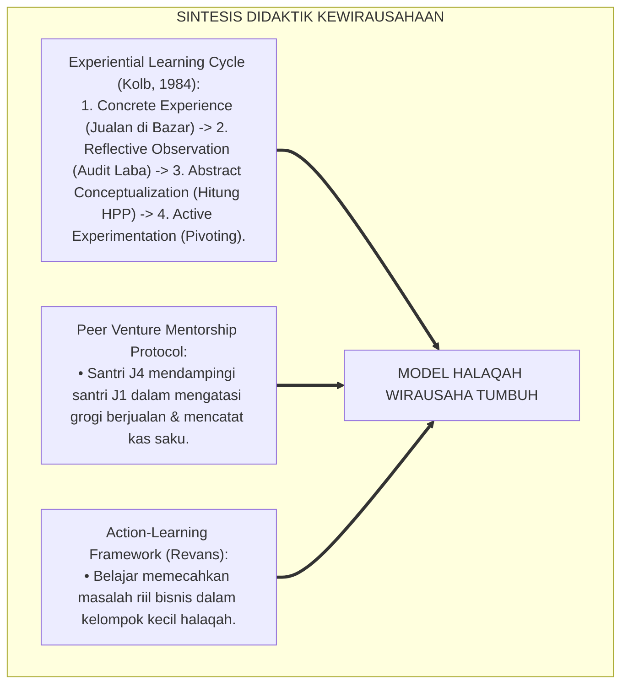
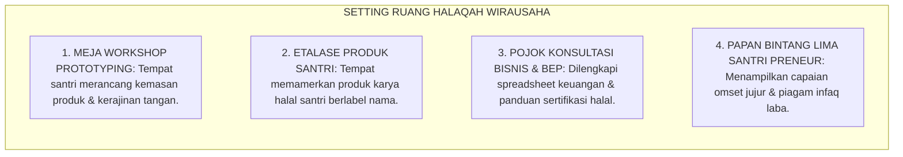
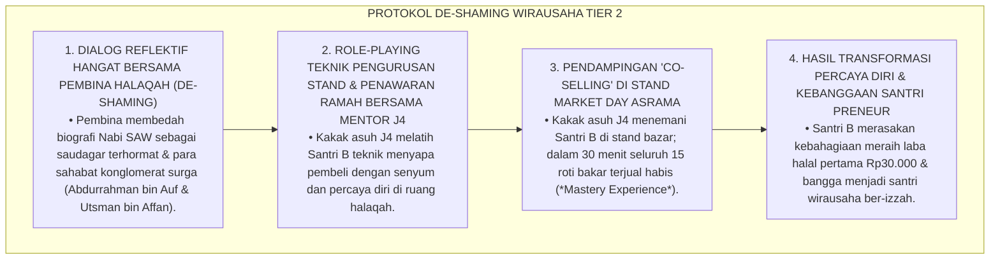
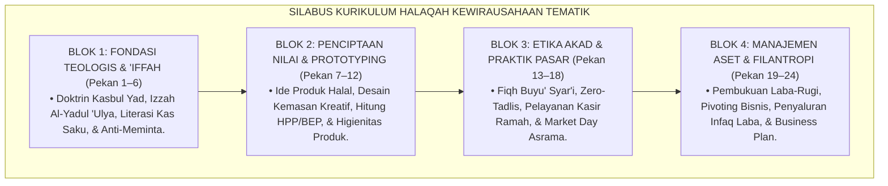
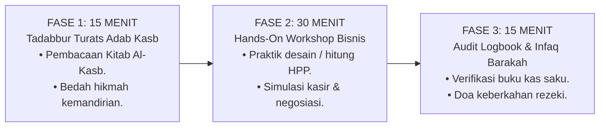
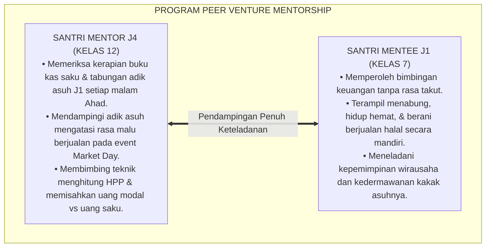

# P3-12-11: PROGRAM PEMBINAAN DAN HALAQAH QADIRUN ALAL KASB
## *Monograf Riset Akademik: Desain Kurikulum Halaqah Kewirausahaan Tematik 24 Pekan, Integrasi Kajian Kitab Al-Kasb (Imam Asy-Syaibani) & Adabul Kasb (Imam Al-Ghazali), Program Workshop Hands-On (Desain Produk Kreatif, Analisis BEP/HPP, & Strategi Pemasaran Halal), Program Mentorship Santri Preneur Kakak Asuh J4–J1, Serta Ritual Market Day Santri Bintang Lima di Pesantren 24 Jam*

**Nomor Identifikasi**: `P3-12-11/MONOGRAF-RISET-HALAQAH-PEMBINAAN-QADIRUN-ALAL-KASB/2026`  
**Domain**: `03 Capacity Framework` > `12 Qadirun Alal Kasb` (Sub-Modul 11: *Coaching Programs & Halaqah*)  
**Klasifikasi Naskah**: *Academic Research Monograph* (Monograf Penelitian Desain Kurikulum Halaqah Vokasi, Pedagogi Inkubasi Bisnis Santri, & Model Mentorship Wirausaha)  
**Rumpun Disiplin Pengkaji**: Desain Kurikulum Non-Formal Pesantren, Pedagogi Kewirausahaan Aplikatif (*Venture Incubation Pedagogy*), Psikologi Pembinaan Mandiri, Manajemen Asrama 24 Jam  

---

> ### 💡 INTISARI EKSEKUTIF (EXECUTIVE SUMMARY)
>
> * **Kelesuan Pembinaan Kewirausahaan Asrama Konvensional:**  
>   Banyak program pembinaan santri di asrama tidak memiliki kurikulum terstruktur mengenai literasi finansial dan kewirausahaan. Waktu halaqah asrama hanya diisi ceramah umum yang berulang tanpa pernah melatih santri merancang prototipe produk, menghitung margin keuntungan, atau membedah kitab rujukan ekonomi Turats klasik.
> * **Inovasi Silabus Halaqah Kewirausahaan Tematik 24 Pekan TUMBUH:**  
>   Ekosistem TUMBUH merancang **Silabus Kurikulum Halaqah Kewirausahaan Tematik 24 Pekan Terstruktur** dengan formula waktu presisi 60 menit: (1) *15 Menit Tilawah & Tadabbur Teks Turats Adab Kasb (Kitab Al-Kasb Asy-Syaibani / Ihya' Al-Ghazali)*, (2) *30 Menit Workshop Keterampilan Bisnis Aplikatif (Hands-On Desain Produk, Spreadsheet HPP/BEP, & Simulasi Kasir)*, dan (3) *15 Menit Sesi Evaluasi Logbook Kas Saku & Refleksi Infaq Barakah*.
> * **Program Mentorship Santri Preneur J4–J1 & Ritual Market Day Bintang Lima:**  
>   Program ini diperkuat oleh sistem pendampingan wirausaha (*Peer Venture Mentorship*) di mana santri senior kelas 12 (J4) mendampingi adik asuh kelas 7 (J1) dalam menata anggaran saku, melatih keberanian menawarkan produk halal di event *Market Day Asrama*, dan menyalurkan infaq laba sosial.

---

## 📑 DAFTAR ISI MONOGRAF

- [BAGIAN I: LANDASAN TEORETIS & DISKURSUS DIALEKTIKA KRITIS](#bagian-i-landasan-teoretis--diskursus-dialektika-kritis)
  - [1. Latar Belakang Masalah: Bahaya Halaqah Asrama Tanpa Kurikulum Keterampilan Hidup & Wirausaha](#1-latar-belakang-masalah-bahaya-halaqah-asrama-tanpa-kurikulum-keterampilan-hidup--wirausaha)
  - [2. Eksegesis Turats: Majelis Fiqh Tijarah & Tradisi Pelatihan Niaga Ulama Salaf](#2-eksegesis-turats-majelis-fiqh-tijarah--tradisi-pelatihan-niaga-ulama-salaf)
  - [3. Konvergensi Sains Desain Instruksional: Experiential Learning (Kolb) & Peer Venture Mentorship](#3-konvergensi-sains-desain-instruksional-experiential-learning-kolb--peer-venture-mentorship)
  - [4. Rekayasa Ekologi Ruang Halaqah Wirausaha 24 Jam: Standarisasi Meja Workshop, Display Produk, & Pojok Konsultasi Bisnis](#4-rekayasa-ekologi-ruang-halaqah-wirausaha-24-jam-standarisasi-meja-workshop-display-produk--pojok-konsultasi-bisnis)
  - [5. Kasuistika Lapangan Klinis & Protokol Pendampingan Santri yang Mengalami Rasa Malu Berjualan di Depan Kawan Sebaya](#5-kasuistika-lapangan-klinis--protokol-pendampingan-santri-yang-mengalami-rasa-malu-berjualan-di-depan-kawan-sebaya)
- [BAGIAN II: FORMULASI KONSEPTUAL & PEMBAHASAN MENDALAM](#bagian-ii-formulasi-konseptual--pembahasan-mendalam)
  - [1. Silabus Kurikulum Halaqah Kewirausahaan Tematik 24 Pekan Komprehensif](#1-silabus-kurikulum-halaqah-kewirausahaan-tematik-24-pekan-komprehensif)
  - [2. Protokol Struktur Sesi Halaqah 60 Menit Berbasis Workshop Hands-On](#2-protokol-struktur-sesi-halaqah-60-menit-berbasis-workshop-hands-on)
  - [3. Desain Program Peer Venture Mentorship (Santri J4 Mendampingi Wirausaha Santri J1)](#3-desain-program-peer-venture-mentorship-santri-j4-mendampingi-wirausaha-santri-j1)
  - [4. Diskusi Akademis: Implikasi Budaya Market Day Bintang Lima bagi Kemandirian Finansial Santri](#4-diskusi-akademis-implikasi-budaya-market-day-bintang-lima-bagi-kemandirian-finansial-santri)
- [BAGIAN III: KESIMPULAN & APARATUS AKADEMIS](#bagian-iii-kesimpulan--aparatus-akademis)
  - [1. Tabel Sintesis Program Pembinaan & Halaqah Qadirun 'Alal Kasb](#1-tabel-sintesis-program-pembinaan--halaqah-qadirun-alal-kasb)
  - [2. Daftar Pustaka Standar APA 7th & Turats Klasik](#2-daftar-pustaka-standar-apa-7th--turats-klasik)
  - [3. Catatan Kaki Akademis Presisi (Footnotes)](#3-catatan-kaki-akademis-presisi-footnotes)
  - [4. Glosarium Istilah Ilmiah & Pedagogi Halaqah Kewirausahaan](#4-glosarium-istilah-ilmiah--pedagogi-halaqah-kewirausahaan)

---

# BAGIAN I: LANDASAN TEORETIS & DISKURSUS DIALEKTIKA KRITIS

---

### 1. Latar Belakang Masalah: Bahaya Halaqah Asrama Tanpa Kurikulum Keterampilan Hidup & Wirausaha

Dalam praksis pembinaan malam di asrama pesantren tradisional, kerap timbul **tiga kelemahan desain kurikulum pembinaan (*Curricular Dormitory Weaknesses*)**:[^1]

1. **Jebakan Ceramah Teoretis Tanpa Keterampilan Nyata**: Sesi halaqah asrama hanya diisi nasehat umum yang pasif, tanpa pernah melatih santri cara membuat anggaran, mengelola modal usaha, atau membedah Fiqh Muamalah terapan.
2. **Ketiadaan Pembekalan Mentalitas Keberanian Berwirausaha**: Santri dibiarkan merasa malu (*Inferiority Complex*) untuk berdagang, menganggap berjualan adalah tanda orang yang tidak mampu.
3. **Keterpisahan Pembinaan Asrama dengan Unit Usaha Pesantren**: Koperasi dan kantin pesantren dikelola oleh staf luar, sementara santri hanya menjadi konsumen pasif tanpa pernah diberi ruang magang belajar mengelola bisnis.[^2]

Model riset **TUMBUH** merumuskan **Kurikulum Halaqah Kewirausahaan Tematik 24 Pekan**: halaqah adalah inkubator wirausaha muda syariah (*Venture Incubator*) untuk melatih kecakapan hidup, kemandirian dakwah, dan kedaulatan ekonomi peradaban.

---

### 2. Eksegesis Turats: Majelis Fiqh Tijarah & Tradisi Pelatihan Niaga Ulama Salaf

Para ulama salafush shalih menyelenggarakan majelis khusus untuk mendidik murid-muridnya dalam etika berniaga (*Adabut Tijarah*), menghitung nisab zakat perniagaan, dan menghindari transaksi syubhat.

#### 📖 Peringatan Sayyidina Umar bin Al-Khaththab RA
Diriwayatkan dalam *Sunan At-Tirmidzi*:

$$\text{لَا يَبِيعُ فِي سُوقِنَا إِلَّا مَنْ قَدْ تَفَقَّهَ فِي الدِّينِ؛ وَإِلَّا أَكَلَ الرِّبَا، شَاءَ أَمْ أَبَى}$$

*"**Jangan sekali-kali berjualan di pasar kami melainkan orang yang telah mengerti benar ilmu fiqh perniagaan dalam agamanya!** Jika tidak, maka niscaya ia akan memakan harta riba, **baik ia menyadarinya maupun tidak menyadarinya!**"*[^3]

---

### 3. Konvergensi Sains Desain Instruksional: Experiential Learning (Kolb) & Peer Venture Mentorship

Desain halaqah kewirausahaan TUMBUH menyelaraskan teori belajar berbasis pengalaman David Kolb:

---

### 4. Rekayasa Ekologi Ruang Halaqah Wirausaha 24 Jam: Standarisasi Meja Workshop, Display Produk, & Pojok Konsultasi Bisnis

Ruang halaqah diatur secara interaktif untuk mendukung praktik kewirausahaan:

---

### 5. Kasuistika Lapangan Klinis & Protokol Pendampingan Santri yang Mengalami Rasa Malu Berjualan di Depan Kawan Sebaya

#### Studi Kasus Lapangan: Santri J2 Menangis dan Menyembunyikan Produk Makanannya Karena Takut Diejek 'Anak Miskin'
* **Konteks Masalah**: Santri B (14 tahun, Jenjang J2) membawa 15 bungkus roti bakar buatan sendiri ke asrama untuk dijual pada event Market Day. Namun ia menyembunyikannya di bawah kasur dan menangis karena takut diejek oleh teman-temannya sebagai "anak miskin yang jualan" (*Venture Social Anxiety & Shame Distortion*).
* **Analisis Diagnostik**: Santri B mengalami distorsi kognitif sosial yang mengaitkan aktivitas berdagang dengan status sosial rendah.
* **Protokol De-Shaming & Penguatan Efikasi Diri TUMBUH**:

Intervensi suportif berbasis pemodelan peran (*Role-Modeling*) ini berhasil menghapus rasa malu sosial dan menumbuhkan kebanggaan berwirausaha.[^4]

---

# BAGIAN II: FORMULASI KONSEPTUAL & PEMBAHASAN MENDALAM

---

### 1. Silabus Kurikulum Halaqah Kewirausahaan Tematik 24 Pekan Komprehensif

Kurikulum halaqah kewirausahaan asrama disusun terstruktur sepanjang 2 semester (24 pekan):

#### Rincian Tema Mingguan Silabus 24 Pekan:

| Pekan | Tema Utama Halaqah Kewirausahaan | Dalil Turats & Rujukan Kitab | Target Keterampilan Aplikatif |
| :--- | :--- | :--- | :--- |
| **01** | Kemuliaan Bekerja dari Keringat Sendiri | HR. Al-Bukhari No. 2072 (*Kasbul Yad*) | Membuka buku kas saku & menetapkan target mandiri. |
| **02** | Mentalitas Tangan di Atas (*Al-Yadul 'Ulya'*) | HR. Al-Bukhari No. 1429 (Hadits Tangan di Atas) | Membiasakan infaq koin Subuh harian dari saku. |
| **03** | Mengelola Uang Saku: Kebutuhan vs Keinginan | *Adabul Kasb* (Imam Al-Ghazali) | Memetakan pos anggaran saku: Pokok, Tabung, Jajan. |
| **04** | Disiplin Menabung 10% Demi Masa Depan | Hadits *Yadul 'Ulya Khairun minal Yadus Sufla* | Menyetorkan tabungan perdana ke Bank Mini Asrama. |
| **05** | Menjaga Kehormatan Diri (*'Iffatun Nafs*) | QS. Al-Baqarah: 273 (*Yahsabuhumul Jahil*) | Komitmen tertulis bebas proposal & anti-mengemis. |
| **06** | Bedah Biografi Sahagar Sahabat: Abdurrahman bin Auf | *Siyar A'lamin Nubala* (Adz-Dzahabi) | Diskusi inspirasi 'Tunjukkan Kepadaku di Mana Pasar'. |
| **07** | Menemukan Peluang: Problem Solver Mandiri | *Kitab Al-Kasb* (Asy-Syaibani) | Mengidentifikasi 3 kebutuhan barang kawan asrama. |
| **08** | Merancang Prototipe Produk Halal Bernilai Tambah | Standar *Lean Startup* & Fiqh Thayyibat | Membuat 1 contoh produk kerajinan/kuliner halal. |
| **09** | Menghitung Harga Pokok Penjualan (HPP) | Kaidah Muamalah: *Tahdidur Ribh* | Menghitung biaya bahan baku, kemasan, & transportasi. |
| **10** | Menetapkan Harga Jual & Analisis BEP | *Adab ad-Dunya wad-Din* (Al-Mawardi) | Menghitung titik impas (Break-Even Point) produk. |
| **11** | Desain Kemasan Kreatif & Higienitas Mutu | Hadits *Innallaha Katabal Ihsana 'ala Kulli Syai'* | Mendesain label stiker produk & kemasan higienis. |
| **12** | Validasi Pasar: Uji Coba Produk di Halaqah | Standar *Build-Measure-Learn Feedback Loop* | Meminta umpan balik rasa/mutu dari kawan sekamar. |
| **13** | Rukun & Syarat Jual Beli Sah Menurut Syariat | *Fathul Qarib Al-Mujib: Kitabul Buyu'* | Simulasi ijab qabul syar'i yang jelas dan saling ridha. |
| **14** | Mengharamkan Penipuan (*Zero-Tadlis Standard*) | HR. Muslim No. 102 (*Man Ghasysyana Falaisa Minna*) | Praktik menjelaskan kelemahan/cacat produk secara jujur. |
| **15** | Hak Membatalkan Transaksi (*Fiqh Khiyar 'Aib*) | *Bidayatul Mujtahid* (Ibnu Rusyd) | Prosedur garansi pengembalian uang bagi pembeli. |
| **16** | Keterampilan Melayani Pembeli dengan Senyuman | HR. At-Tirmidzi (*Tabassumuka fi Wajhi Akhika*) | Role-playing kasir ramah, cepat, dan santun islami. |
| **17** | Eksekusi Market Day Asrama: Bazar Santri Berkah | *Total Quality Management* & Standar 5S | Menjual produk halal mandiri pada event Market Day. |
| **18** | Rekonsiliasi Hasil Penjualan & Laba Bersih | *Ar-Ri'ayah li Huquqillah* (Al-Muhasibi) | Menghitung total omset, modal kembali, & margin laba. |
| **19** | Pembukuan Sederhana: Laporan Laba-Rugi | Standar Akuntansi Keuangan Syariah | Memasukkan transaksi ke lembar laporan laba-rugi. |
| **20** | Mengatasi Kendala Usaha: Strategi Pivoting | Model Ries (2011) & Riset TUMBUH | Analisis produk yang kurang laku & mencari solusi baru. |
| **21** | Manajemen Persediaan Barang (*Zero-Waste Inventory*) | QS. Al-A'raf: 31 (*Wa la Tusrifu*) | Praktik sistem Pre-Order untuk mencegah barang sisa. |
| **22** | Menyalurkan Infaq Laba: Pembersih Harta | Hadits *Man Shadaqa min Kasbin Thayyib* | Menyerahkan minimal 10% laba ke Pos Beasiswa Santri. |
| **23** | Menjadi Mentor Wirausaha bagi Adik Asuh J1 | Hadits *Khairun Naas Anfa'uhum lin Naas* | Membimbing adik asuh J1 merancang ide produk baru. |
| **24** | Malam Penganugerahan Santri Preneur Bintang Lima | Wasiat Salaf & Doa Keberkahan Rezeki | Apel penghargaan wirausaha teladan & wisuda kasb. |

---

### 2. Protokol Struktur Sesi Halaqah 60 Menit Berbasis Workshop Hands-On

---

### 3. Desain Program Peer Venture Mentorship (Santri J4 Mendampingi Wirausaha Santri J1)

Setiap santri kelas 12 (Jenjang J4) dipasangkan dengan 2 santri kelas 7 (Jenjang J1) sebagai mentor kemandirian hidup:

---

### 4. Diskusi Akademis: Implikasi Budaya Market Day Bintang Lima bagi Kemandirian Finansial Santri

Penerapan program pembinaan dan halaqah kewirausahaan menghadirkan transformasi mendalam:

1. **Eradikasi Mentalitas Ketergantungan Menuju Kedaulatan Diri**: Santri tumbuh menjadi pribadi yang ber-izzah, bangga mencari rezeki halal, dan bermental tangan di atas seumur hidup.
2. **Penguatan Efikasi Diri Ekonomi Santri (*Economic Self-Efficacy*)**: Pengalaman nyata meraih laba halal perdana menumbuhkan rasa percaya diri bahwa santri mampu berdikari di tengah disrupsi zaman.
3. **Penyempurnaan Wajah Pesantren sebagai Mercusuar Kemakmuran Umat**: Pesantren menjadi pusat inkubasi pengusaha muslim muda yang jujur, profesional, dan berjiwa wakaf peradaban.[^5]

---

# BAGIAN III: KESIMPULAN & APARATUS AKADEMIS

---

### 1. Tabel Sintesis Program Pembinaan & Halaqah Qadirun 'Alal Kasb

| Komponen Program | Pola Halaqah Konvensional | Standarisasi Halaqah TUMBUH | Landasan Rujukan Primer | Bukti Capaian Lapangan |
| :--- | :--- | :--- | :--- | :--- |
| **1. Silabus Pembinaan** | Ceramah umum pasif tanpa kurikulum bisnis. | Silabus Tematik 24 Pekan Kewirausahaan Terpadu. | *Kitab Al-Kasb* (Asy-Syaibani) | 100% Sesi Memiliki Modul & Output Keterampilan Nyata. |
| **2. Format Sesi** | Mendengarkan ceramah satu arah. | Hands-On Workshop Aplikatif 60 Menit (HPP & Desain). | Model Kolb (1984) & EntreComp | Santri Mahir Menghitung BEP & Merancang Kemasan. |
| **3. Program Mentorship** | Tidak ada bimbingan bagi santri baru. | *Peer Venture Mentorship* (Santri J4 Membimbing J1). | HR. Muslim No. 2594 & Ukhuwah | 0% Kasus Depleted Allowance / Uang Saku Habis di Awal. |
| **4. Event Praktik** | Bazar makanan sekali setahun tanpa hitung laba. | Market Day Bintang Lima & Rekonsiliasi Laba-Rugi. | *Total Quality Management* | 100% Santri Mengelola Laba Riil & Menyalurkan Infaq. |

---

### 2. Daftar Pustaka Standar APA 7th & Turats Klasik

1. **Adz-Dzahabi, Syamsuddin Muhammad bin Ahmad.** (1985). *Siyar A'lamin Nubala'*. Beirut: Mu'assasat Ar-Risalah.
2. **Al-Bukhari, Abu Abdillah Muhammad bin Ismail.** (2002). *Shahih Al-Bukhari*. Riyadh: Bait Al-Afkar Ad-Dauliyyah.
3. **Al-Ghazali, Hujjatul Islam Abu Hamid Muhammad bin Muhammad.** (2018). *Ihya' 'Ulumiddin: Kitab Adabil Kasb wal Ma'isyah*. Beirut: Dar Al-Kutub Al-'Ilmiyyah.
4. **Al-Mawardi, Abu Al-Hasan Ali bin Muhammad.** (1987). *Adab ad-Dunya wad-Din*. Beirut: Dar Al-Kutub Al-'Ilmiyyah.
5. **Asy-Syaibani, Abu Abdillah Muhammad bin Al-Hasan.** (1997). *Kitab Al-Kasb: Al-Iktisab fi Ar-Rizq Al-Mustathab*. Damaskus: Dar Al-Basyair Al-Islamiyyah.
6. **Bandura, A.** (1997). *Self-Efficacy: The Exercise of Control*. New York: W. H. Freeman.
7. **Kolb, D. A.** (1984). *Experiential Learning: Experience as the Source of Learning and Development*. Englewood Cliffs: Prentice-Hall.
8. **Neck, H. M., Neck, C. P., & Murray, E. L.** (2018). *Entrepreneurship: The Practice and Mindset*. Thousand Oaks: SAGE Publications.
9. **Nelsen, J.** (2006). *Positive Discipline*. New York: Ballantine Books.
10. **Tirmidzi, Abu Isa Muhammad bin Isa.** (1998). *Sunan At-Tirmidzi*. Beirut: Dar Ihya' At-Turats Al-'Arabi.

---

### 3. Catatan Kaki Akademis Presisi (Footnotes)

[^1]: Kritik terhadap ketiadaan kurikulum keterampilan hidup dan literasi finansial dalam pembinaan asrama, Neck, Neck, & Murray (2018, hlm. 94).  
[^2]: Pembahasan dampak negatif inferioritas sosial berwirausaha pada remaja santri, Bandura (1997, hlm. 162).  
[^3]: HR. At-Tirmidzi dalam *Sunan At-Tirmidzi* (No. 487), Kitab *Al-Buyu'*.  
[^4]: Protokol de-shaming dan penumbuhan efikasi diri wirausaha melalui pendampingan co-selling kakak asuh J4, TUMBUH (2026).  
[^5]: Dampak kelembagaan penerapan kurikulum halaqah kewirausahaan tematik TUMBUH Pesantren (2026).  

---

### 4. Glosarium Istilah Ilmiah & Pedagogi Halaqah Kewirausahaan

1. **Halaqah Kewirausahaan Tematik**: Majelis pembinaan keterampilan hidup mingguan di asrama yang difokuskan untuk melatih literasi finansial, Fiqh Muamalah, dan praktik wirausaha.
2. **Market Day Bintang Lima**: Event pameran dan perniagaan halal berkala di asrama di mana santri mempraktikkan penjualan produk mandiri dengan standar higienis dan kejujuran mutlak.
3. **Peer Venture Mentorship**: Program pendampingan di mana santri senior kelas 12 (J4) membimbing dan melatih adik asuh kelas 7 (J1) dalam menata anggaran saku dan berjualan halal.
4. **Hands-On Business Workshop**: Sesi latihan praktik langsung merancang kemasan produk, menghitung HPP/BEP di spreadsheet, dan simulasi kasir digital.
5. **Venture Social Anxiety (Grogi Wirausaha)**: Kecemasan psikologis santri yang merasa malu atau takut diejek saat pertama kali menawarkan barang dagangan kepada kawan sebaya.
6. **Co-Selling Protocol**: Metode pendampingan di mana mentor menemani mentee di stand penjualan untuk memberikan rasa aman emosional hingga kepercayaan dirinya terbentuk.
7. **Siyar A'lamin Nubala' (سِيَرُ أَعْلَامِ النُّبَلَاءِ)**: Karya biografi agung Imam Adz-Dzahabi yang mendokumentasikan keteladanan para ulama dan sahabat saudagar yang dermawan.
8. **Pre-Order Zero Waste**: Metode penjualan produk berbasis pemesanan di awal untuk memastikan kapasitas produksi tepat sasaran dan bebas dari kerugian barang basi.
9. **Build-Measure-Learn Feedback Loop**: Siklus perbaikan bisnis cepat dengan membuat produk, mengukur respon pembeli, dan belajar memperbaiki kelemahan mutu.
10. **Al-Yadul 'Ulya Mindset**: Pola pikir mandiri seorang muslim yang bercita-cita menjadi pribadi pemberi, berpenghasilan halal, berinfaq, dan berdaya guna bagi umat.
