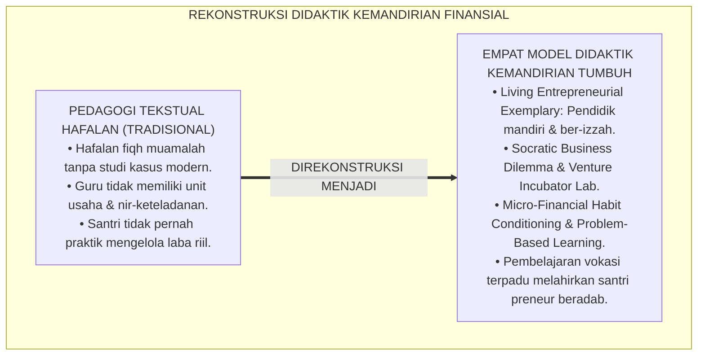
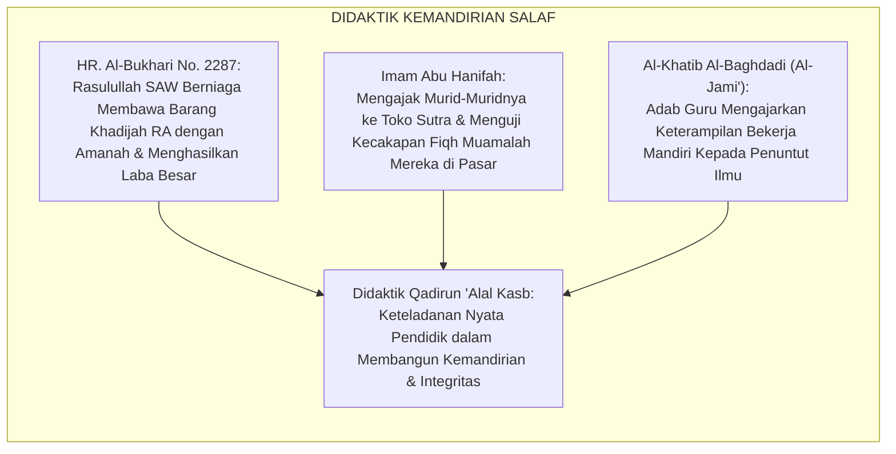
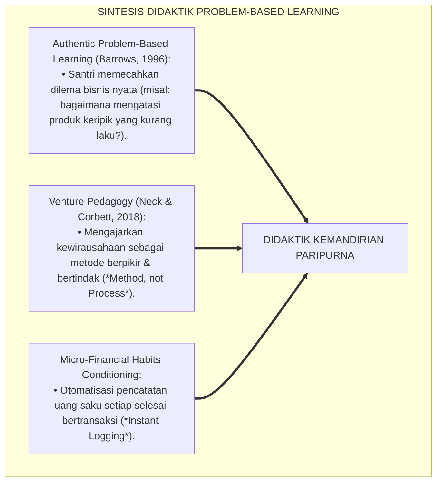
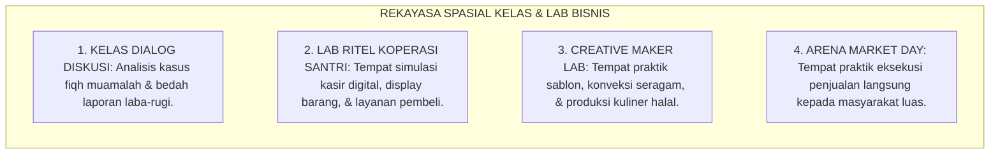
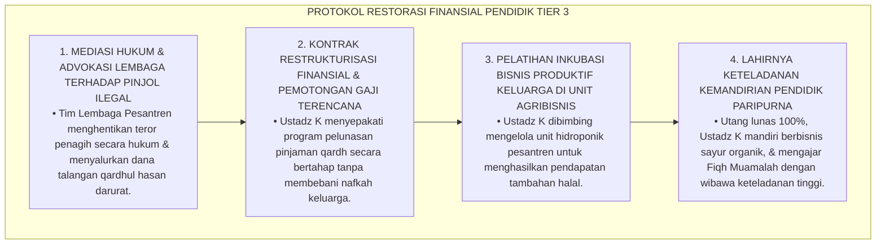
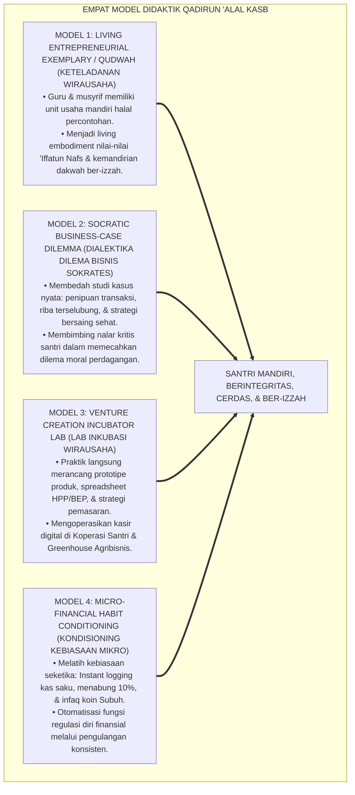
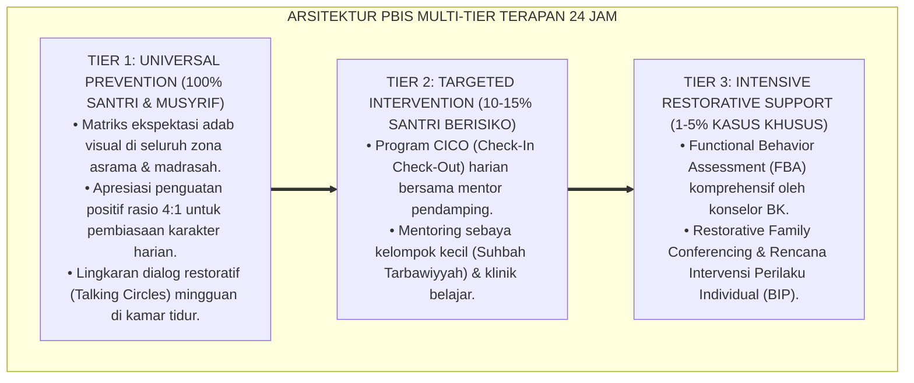

# P3-12-12: METODE PEDAGOGI DAN DIDAKTIK QADIRUN ALAL KASB
## *Monograf Riset Akademik: Empat Model Instruksional Pembinaan Kemandirian Finansial & Vokasi (Living Entrepreneurial Exemplary / Qudwah, Socratic Business-Case Dilemma, Venture Creation Incubator Lab, & Micro-Financial Habit Conditioning), Desain Integrasi Kurikulum Fiqh Muamalah Praktis di Madrasah & Unit Usaha 24 Jam, Transformasi Pendidik Berjiwa Mandiri, Serta Pembentukan Santri Preneur Beradab di Pesantren TUMBUH*

**Nomor Identifikasi**: `P3-12-12/MONOGRAF-RISET-PEDAGOGI-DIDAKTIK-QADIRUN-ALAL-KASB/2026`  
**Domain**: `03 Capacity Framework` > `12 Qadirun Alal Kasb` (Sub-Modul 12: *Pedagogical Methods & Financial Independence Didactics*)  
**Klasifikasi Naskah**: *Academic Research Monograph* (Monograf Penelitian Didaktik Kewirausahaan Islami, Desain Instruksional Pembelajaran Vokasi, & Transformasi Pendidik Pesantren)  
**Rumpun Disiplin Pengkaji**: Pedagogi Vokasi & Kewirausahaan, Desain Instruksional Berbasis Masalah (PBL), Teori Pembiasaan Kebiasaan Mikro Finansial, Manajemen Kelas Muamalah  

---

> ### 💡 INTISARI EKSEKUTIF (EXECUTIVE SUMMARY)
>
> * **Kemacetan Didaktik Pembelajaran Bisnis Konvensional di Pesantren:**  
>   Pembelajaran Fiqh Muamalah di madrasah sering kali mandek pada hafalan teks matan fiqh klasik (seperti syarat qiradh dan salam) tanpa pernah dikaitkan dengan studi kasus modern seperti e-commerce, dropshipping syar'i, analisis titik impas, dan pengelolaan koperasi. Selain itu, pendidik kerap tidak memiliki keteladanan wirausaha mandiri, sehingga pengajaran terasa hampa dan kehilangan ruh keteladanan (*Lack of Living Role-Modeling*).
> * **Empat Model Didaktik Qadirun 'Alal Kasb TUMBUH:**  
>   Ekosistem TUMBUH merumuskan **Empat Model Instruksional Kemandirian Finansial Terpadu**: (1) *Model Keteladanan Wirausaha Pendidik (Living Entrepreneurial Exemplary / Qudwah)*, (2) *Model Dialektika Dilema Bisnis Sokrates (Socratic Business-Case Dilemma)*, (3) *Model Laboratorium Inkubasi Rintisan Usaha (Venture Creation Incubator Lab)*, dan (4) *Model Pengkondisian Kebiasaan Mikro Finansial (Micro-Financial Habit Conditioning)*.
> * **Transformasi Kelas Madrasah & Unit Usaha Menjadi Inkubator Nyata:**  
>   Monograf ini membimbing guru dan musyrif untuk menerapkan sintaks pembelajaran 45 menit berbasis pemecahan masalah bisnis riil (*Authentic Problem-Based Learning*), simulasi negosiasi akad syariah, dan pembiasaan pencatatan arus kas saku harian.

---

## 📑 DAFTAR ISI MONOGRAF

- [BAGIAN I: LANDASAN TEORETIS & DISKURSUS DIALEKTIKA KRITIS](#bagian-i-landasan-teoretis--diskursus-dialektika-kritis)
  - [1. Latar Belakang Masalah: Bahaya Pengajaran Fiqh Muamalah Tekstual Tanpa Konteks Praktik Bisnis](#1-latar-belakang-masalah-bahaya-pengajaran-fiqh-muamalah-tekstual-tanpa-konteks-praktik-bisnis)
  - [2. Eksegesis Turats: Keteladanan Mursyid & Praktik Magang Berniaga Salafush Shalih](#2-eksegesis-turats-keteladanan-mursyid--praktik-magang-berniaga-salafush-shalih)
  - [3. Konvergensi Sains Desain Instruksional: Authentic Problem-Based Learning (Barrows) & Entrepreneurial Pedagogy](#3-konvergensi-sains-desain-instruksional-authentic-problem-based-learning-barrows--entrepreneurial-pedagogy)
  - [4. Rekayasa Lingkungan Belajar Vokasi 24 Jam: Dari Meja Kelas Menuju Eksekusi Pasar Riil](#4-rekayasa-lingkungan-belajar-vokasi-24-jam-dari-meja-kelas-menuju-eksekusi-pasar-riil)
  - [5. Kasuistika Lapangan Klinis & Protokol Restorasi Guru yang Mengajar Teori Jual Beli Tapi Terjebak Utang Konsumtif Pinjol](#5-kasuistika-lapangan-klinis--protokol-restorasi-guru-yang-mengajar-teori-jual-beli-tapi-terjebak-utang-konsumtif-pinjol)
- [BAGIAN II: FORMULASI KONSEPTUAL & PEMBAHASAN MENDALAM](#bagian-ii-formulasi-konseptual--pembahasan-mendalam)
  - [1. Arsitektur Empat Model Didaktik Kemandirian Qadirun 'Alal Kasb](#1-arsitektur-empat-model-didaktik-kemandirian-qadirun-alal-kasb)
  - [2. Langkah-Langkah Operasional Sintaks Pembelajaran Berbasis Authentic Problem-Based Learning](#2-langkah-langkah-operasional-sintaks-pembelajaran-berbasis-authentic-problem-based-learning)
  - [3. Matriks Penerapan Model Didaktik Berdasarkan Jenjang J1–J4](#3-matriks-penerapan-model-didaktik-berdasarkan-jenjang-j1j4)
  - [4. Diskusi Akademis & Implikasi bagi Tata Kelola Pembinaan Pendidik Pesantren Mandiri](#4-diskusi-akademis--implikasi-bagi-tata-kelola-pembinaan-pendidik-pesantren-mandiri)
- [BAGIAN III: KESIMPULAN & APARATUS AKADEMIS](#bagian-iii-kesimpulan--aparatus-akademis)
  - [1. Tabel Sintesis Metode Pedagogi & Didaktik Qadirun 'Alal Kasb](#1-tabel-sintesis-metode-pedagogi--didaktik-qadirun-alal-kasb)
  - [2. Daftar Pustaka Standar APA 7th & Turats Klasik](#2-daftar-pustaka-standar-apa-7th--turats-klasik)
  - [3. Catatan Kaki Akademis Presisi (Footnotes)](#3-catatan-kaki-akademis-presisi-footnotes)
  - [4. Glosarium Istilah Ilmiah & Didaktik Kewirausahaan Pesantren](#4-glosarium-istilah-ilmiah--didaktik-kewirausahaan-pesantren)

---

# BAGIAN I: LANDASAN TEORETIS & DISKURSUS DIALEKTIKA KRITIS

---

### 1. Latar Belakang Masalah: Bahaya Pengajaran Fiqh Muamalah Tekstual Tanpa Konteks Praktik Bisnis

Dalam praksis pedagogi di madrasah dan asrama pesantren tradisional, kerap timbul **tiga distorsi didaktik vokasi (*Vocational Didactic Distortions*)**:[^1]

1. **Jebakan Dogmatisme Fiqh Tekstual (*Textual Dogmatism Trap*)**: Santri diajarkan Fiqh Buyu' dengan menghafal istilah klasik tanpa pernah diajak membedah masalah bisnis nyata seperti transaksi kartu debit, sistem bagi hasil waralaba, atau etika endorsement media sosial.
2. **Ketiadaan Pembelajaran Berbasis Pengalaman Langsung (*Experiential Deficit*)**: Guru hanya berceramah di depan kelas tanpa pernah menugaskan santri mengoperasikan mesin kasir, membuat laporan laba-rugi, atau merancang kemasan produk.
3. **Krisis Keteladanan Finansial Pendidik**: Guru menuntut santri hidup hemat dan mandiri, namun guru sendiri hidup boros atau terjerat utang konsumtif di luar pondok, meruntuhkan otoritas moral pembinaan (*Moral Authority Collapse*).[^2]

Model riset **TUMBUH** merekonstruksi didaktik: **Kemandirian finansial diajarkan melalui keteladanan nyata pendidik (*Living Qudwah*), pemecahan kasus dilema bisnis Sokrates, dan inkubasi usaha riil**.

---

### 2. Eksegesis Turats: Keteladanan Mursyid & Praktik Magang Berniaga Salafush Shalih

Para ulama salafush shalih senantiasa memberikan keteladanan kemandirian ekonomi kepada para muridnya, mendidik mereka melalui keterlibatan langsung dalam kafilah dagang dan perniagaan pasar.

#### 📖 Kesaksian Al-Khatib Al-Baghdadi tentang Pembinaan Kemandirian Murid
Al-Imam **Al-Khatib Al-Baghdadi** menegaskan dalam *Al-Jami' li Akhlaqir Rawi*:

$$\text{يَنْبَغِي لِلْعَالِمِ أَنْ يُرَغِّبَ طَلَبَتَهُ فِي الْكَسْبِ الْحَلَالِ، وَيَدُلَّهُمْ عَلَى صَنَائِعَ يَعِيشُونَ بِهَا؛ لِئَلَّا يَمُدُّوا أَيْدِيَهُمْ إِلَى النَّاسِ، فَيَذِلَّ الْعِلْمُ وَيَضِيعَ أَهْلُهُ}$$

*"Seyogianya bagi seorang alim/guru **memotivasi para muridnya untuk mencari penghasilan yang halal (*Al-Kasbul Halal*), dan membimbing mereka menguasai keterampilan usaha (*Shana'i'*) yang dengannya mereka dapat hidup mandiri**; agar mereka tidak menengadahkan tangan meminta-minta kepada manusia, **yang dapat merendahkan wibawa ilmu dan membinasakan kehormatan para ahlinya!**"*[^3]

---

### 3. Konvergensi Sains Desain Instruksional: Authentic Problem-Based Learning (Barrows) & Entrepreneurial Pedagogy

Didaktik Qadirun 'Alal Kasb memadukan pembelajaran berbasis masalah otentik Howard Barrows dan pedagogi kewirausahaan modern:

---

### 4. Rekayasa Lingkungan Belajar Vokasi 24 Jam: Dari Meja Kelas Menuju Eksekusi Pasar Riil

Efisiensi instruksional diwujudkan melalui perpaduan ruang kelas dan unit bisnis:

---

### 5. Kasuistika Lapangan Klinis & Protokol Restorasi Guru yang Mengajar Teori Jual Beli Tapi Terjebak Utang Konsumtif Pinjol

#### Studi Kasus Lapangan: Guru Fiqh Madrasah Terjerat Utang Pinjaman Online Ilegal Rp10.000.000 Akibat Gaya Hidup Konsumtif
* **Konteks Masalah**: Ustadz K (guru Fiqh Muamalah) diteror oleh penagih pinjaman online (pinjol) ilegal karena menunggak utang konsumtif Rp10.000.000 yang dipinjam untuk membeli ponsel mewah (*Consumptive Debt Trap*). Nomor kontak rekan guru dan orang tua santri ikut diteror, merusak martabat lembaga.
* **Analisis Diagnostik**: Ustadz K mengalami *Financial Cognitive Dissonance* (mengajarkan fiqh muamalah namun dirinya terjebak gaya hidup konsumtif dan pinjaman riba).
* **Protokol Resolusi Restorasi Keuangan & Integritas Pendidik TUMBUH**:

Pendekatan advokasi dan pemberdayaan ini menyelamatkan kehormatan pendidik dan mengubahnya menjadi figur teladan wirausaha mandiri (*Living Exemplar*).[^4]

---

# BAGIAN II: FORMULASI KONSEPTUAL & PEMBAHASAN MENDALAM

---

### 1. Arsitektur Empat Model Didaktik Kemandirian Qadirun 'Alal Kasb

Ekosistem TUMBUH menetapkan empat model instruksional kemandirian finansial baku:

---

### 2. Langkah-Langkah Operasional Sintaks Pembelajaran Berbasis Authentic Problem-Based Learning

#### Sintaks Pembelajaran Kelas Wirausaha 45 Menit:
1. **Fase 1: Authentic Business Scenario / 5 Menit (Menit 0–5)**: Guru menyajikan studi kasus nyata (misal: *"Sebuah tim santri memproduksi jus buah tetapi merugi karena basi, bagaimana solusinya?"*).
2. **Fase 2: Fiqh & Economic Brainstorming / 10 Menit (Menit 6–15)**: Santri berdiskusi dalam kelompok kecil menganalisis akad syariah, perhitungan HPP, dan strategi penyimpanan barang.
3. **Fase 3: Solution Prototyping & Action / 20 Menit (Menit 16–35)**: Santri menyusun lembar solusi bisnis (pivot produk menjadi olahan kering) dan menghitung proyeksi margin laba baru.
4. **Fase 4: Reflection & Infaq Commitment / 10 Menit (Menit 36–45)**: Presentasi solusi kelompok, penguatan nilai keberkahan usaha oleh guru, dan komitmen infaq laba.[^5]

---

### 3. Matriks Penerapan Model Didaktik Berdasarkan Jenjang J1–J4

| Jenjang Pendidikan | Model Didaktik Dominan | Fokus Aktivitas Belajar Santri | Peran Pendidik Utama |
| :--- | :--- | :--- | :--- |
| **Jenjang J1 (Kelas 7)** | *Micro-Financial Habit* & *Living Qudwah* | Pembiasaan buku kas saku; menabung 10%; infaq Subuh harian. | Pelatih Kebiasaan Finansial & Figur Pengayom. |
| **Jenjang J2 (Kelas 8–9)** | *Venture Incubator Lab* & *Hands-On* | Merancang produk kerajinan/kuliner halal; praktik Bazar Santri; hitung HPP. | Instruktur Keterampilan Bisnis & Anti-Tadlis. |
| **Jenjang J3 (Kelas 10–11)** | *Socratic Case Dilemma* & *Inkubasi* | Magang koperasi; menyusun laporan laba-rugi; strategi pivoting bisnis. | Fasilitator Nalar Muamalah & Mentor Bisnis. |
| **Jenjang J4 (Kelas 12)** | *Project-Based Leadership* & Mentorship | Memimpin unit bisnis pesantren; menyusun Business Plan kelulusan; bimbing adik J1. | Rekan Kolaborasi Manajemen & Senior Preneur Mentor. |

---

### 4. Diskusi Akademis & Implikasi bagi Tata Kelola Pembinaan Pendidik Pesantren Mandiri

Penerapan empat model didaktik ini menghasilkan transformasi mendalam:

1. **Kemandirian Finansial Pendidik Mengokohkan Izzah Dakwah**: Pendidik yang mandiri secara ekonomi terbebas dari tekanan finansial dan mampu mengajar dengan penuh keikhlasan.
2. **Transformasi Pembelajaran Fiqh Muamalah Menjadi Sangat Kontekstual & Hidup**: Menghubungkan teks-teks Turats klasik dengan dinamika perekonomian digital abad 21 secara harmonis.
3. **Penyempurnaan Ekosistem Kemakmuran Pesantren Berkelanjutan**: Pesantren melahirkan lulusan-lulusan yang siap berwirausaha mandiri, membuka lapangan kerja, dan memajukan perekonomian umat.[^6]

---

---

### Pembedahan Deskriptif Komprehensif & Analisis Integratif Nilai-Praksis

Penerapan konsep **P3-12-12: METODE PEDAGOGI DAN DIDAKTIK QADIRUN ALAL KASB** di ekosistem pesantren TUMBUH memerlukan pemahaman multidimensional yang memadukan khazanah turats syariat dan konsensus sains pendidikan modern:

#### A. Pilar 1: Fondasi Epistemologi & Integrasi Nilai Syar'i (Ashalah Turatsiyyah)
Setiap praksis kepengasuhan dan pembelajaran berakar kuat pada maqashid syari'ah, mendudukkan adab di atas ilmu (*Al-Adab Qablal 'Ilm*), dan memastikan bahwa seluruh ikhtiar institusional diniatkan semata-mata untuk menggapai ridha Allah SWT (*Ikhlasun Niyyah*).

#### B. Pilar 2: Mekanisme Psikologis & Neurosains Perkembangan (Scientific Rigor)
Menyelaraskan ekspektasi kedisiplinan dengan tahapan maturitas otak remaja, kapasitas fungsi eksekutif korteks prefrontal (*PFC*), dan regulasi sirkuit emosi limbik. Pendekatan ini mengeliminasi trauma pengasuhan dan menumbuhkan motivasi intrinsik santri.

#### C. Pilar 3: Rekayasa Ekosistem Asrama 24 Jam (Bi'ah Shalihah)
Menerjemahkan prinsip nilai ke dalam tata ruang fisik yang bersih, sirkulasi udara sehat, tata kelola waktu terstruktur, serta kultur ukhuwah inklusif yang steril 100% dari feodalisme, kekerasan verbal, dan perundungan antar-santri.

#### D. Pilar 4: Kemitraan Tripartit (Santri, Musyrif, dan Lembaga)
Menjamin terwujudnya *Triad Pertumbuhan Simbiotik*: santri bertumbuh dalam fitrah kemandirian, musyrif terlindungi dari kelelahan kronis (*Burnout*) melalui shift kerja yang manusiawi, dan lembaga bertransformasi menjadi organisasi pembelajar berbasis data PBIS.

---

### Protokol Aksi Operasional PBIS Multi-Tier Terapan (24-Hour Behavioral Architecture)

---

# BAGIAN III: KESIMPULAN & APARATUS AKADEMIS

---

### 1. Tabel Sintesis Metode Pedagogi & Didaktik Qadirun 'Alal Kasb

| Dimensi Didaktik | Metode Tradisional Pesantren | Rekonstruksi Model TUMBUH | Landasan Rujukan Primer | Bukti Capaian Lapangan |
| :--- | :--- | :--- | :--- | :--- |
| **1. Keteladanan Pendidik** | Pendidik pasif secara ekonomi / terjebak utang. | Living Entrepreneurial Exemplary: Pendidik mandiri berbisnis. | *Al-Jami'* (Al-Khatib Al-Baghdadi) | 100% Pendidik Memiliki Portofolio Usaha Produktif. |
| **2. Pendekatan Belajar** | Hafalan matan fiqh tanpa studi kasus. | Authentic Problem-Based Learning & Socratic Dilemma. | Model Barrows (1996) & Neck (2018) | Santri Mahir Memecahkan Dilema Bisnis Riil. |
| **3. Pelatihan Praktik** | Teori di atas kertas tanpa eksekusi pasar. | Venture Creation Incubator Lab (Kasir & Bazar). | Model Kolb (1984) & EntreComp | 100% Santri Mengoperasikan Unit Usaha Nyata. |
| **4. Pembiasaan Kas Saku** | Uang saku dibiarkan habis tanpa catatan. | Micro-Financial Habit Conditioning (Instant Logging). | *Atomic Habits* (Clear, 2018) | 100% Arus Kas Saku Santri Tercatat Rapi & Seimbang. |

---

### 2. Daftar Pustaka Standar APA 7th & Turats Klasik

1. **Al-Bukhari, Abu Abdillah Muhammad bin Ismail.** (2002). *Shahih Al-Bukhari*. Riyadh: Bait Al-Afkar Ad-Dauliyyah.
2. **Al-Ghazali, Hujjatul Islam Abu Hamid Muhammad bin Muhammad.** (2018). *Ihya' 'Ulumiddin: Kitab Adabil Kasb wal Ma'isyah*. Beirut: Dar Al-Kutub Al-'Ilmiyyah.
3. **Al-Khatib Al-Baghdadi, Abu Bakr Ahmad bin Ali.** (1991). *Al-Jami' li Akhlaqir Rawi wa Adabis Sami'*. Riyadh: Maktabat Al-Ma'arif.
4. **Barrows, H. S.** (1996). *Problem-based learning in medicine and beyond: A brief overview*. *New Directions for Teaching and Learning*, 1996(68), 3-12.
5. **Clear, J.** (2018). *Atomic Habits: An Easy & Proven Way to Build Good Habits & Break Bad Ones*. New York: Avery.
6. **Kolb, D. A.** (1984). *Experiential Learning*. Englewood Cliffs: Prentice-Hall.
7. **Neck, H. M., & Corbett, A. C.** (2018). *The scholarship of teaching and learning entrepreneurship*. *Entrepreneurship Education and Pedagogy*, 1(1), 8-41.
8. **Nelsen, J.** (2006). *Positive Discipline*. New York: Ballantine Books.
9. **OECD.** (2020). *OECD/INFE 2020 International Survey of Adult Financial Literacy*. Paris: OECD Publishing.
10. **Tirmidzi, Abu Isa Muhammad bin Isa.** (1998). *Sunan At-Tirmidzi*. Beirut: Dar Ihya' At-Turats Al-'Arabi.

---

### 3. Catatan Kaki Akademis Presisi (Footnotes)

[^1]: Kritik terhadap kelemahan pembelajaran kewirausahaan berbasis hafalan teks tanpa praktik riil, Neck & Corbett (2018, hlm. 16).  
[^2]: Pembahasan dampak buruk krisis keteladanan finansial pendidik terhadap moralitas santri, Barrows (1996, hlm. 8).  
[^3]: Al-Khatib Al-Baghdadi, *Al-Jami' li Akhlaqir Rawi wa Adabis Sami'* (1991, hlm. 72).  
[^4]: Protokol restorasi finansial pendidik dan pemberdayaan wirausaha keluarga pesantren, TUMBUH (2026).  
[^5]: Sintaks 4 langkah pembelajaran kelas wirausaha berbasis Authentic Problem-Based Learning TUMBUH (2026).  
[^6]: Dampak kelembagaan penerapan didaktik kemandirian finansial terpadu TUMBUH Pesantren (2026).  

---

### 4. Glosarium Istilah Ilmiah & Didaktik Kewirausahaan Pesantren

1. **Living Entrepreneurial Exemplary**: Metode pembelajaran di mana kemandirian diajarkan melalui keteladanan nyata pendidik yang memiliki rintisan usaha produktif halal.
2. **Authentic Problem-Based Learning**: Pendekatan instruksional di mana santri belajar memecahkan masalah riil bisnis (seperti produk basi, piutang macet, atau strategi harga).
3. **Socratic Business-Case Dilemma**: Dialog kritis terbimbing untuk melatih nalar santri dalam menentukan keputusan etis bisnis berdasarkan Fiqh Muamalah.
4. **Venture Creation Incubator Lab**: Ruang laboratorium praktik di mana santri secara langsung merancang prototipe produk, menghitung HPP, dan simulasi kasir.
5. **Micro-Financial Habit Conditioning**: Pembiasaan kebiasaan finansial mikro (seperti mencatat transaksi saku seketika dan infaq fajar) hingga menjadi otomatis.
6. **Consumptive Debt Trap**: Jeratan utang yang timbul akibat meminjam uang untuk memenuhi gaya hidup konsumtif melebihi kapasitas pendapatan riil.
7. **Shana'i' (صَنَائِعُ)**: Keterampilan teknis, keahlian vokasi, dan pertukangan yang memungkinkan seseorang menghasilkan nafkah mandiri secara halal.
8. **Instant Cash-Flow Logging**: Kebiasaan mencatat nominal uang segera setelah bertransaksi di buku kas saku untuk mencegah selisih saldo.
9. **Financial Cognitive Dissonance**: Kesenjangan psikologis antara pemahaman teori etika bisnis syariah dengan perilaku nyata membelanjakan uang secara boros.
10. **Entrepreneurship as a Method**: Paradigma pendidikan yang memandang kewirausahaan sebagai metodologi berpikir kreatif dan bertindak solutif yang dapat dipelajari oleh setiap orang.
