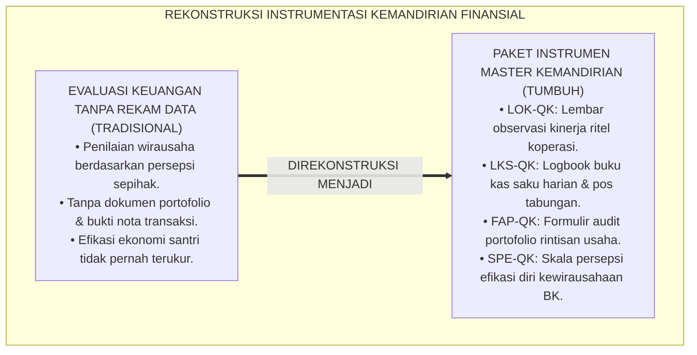
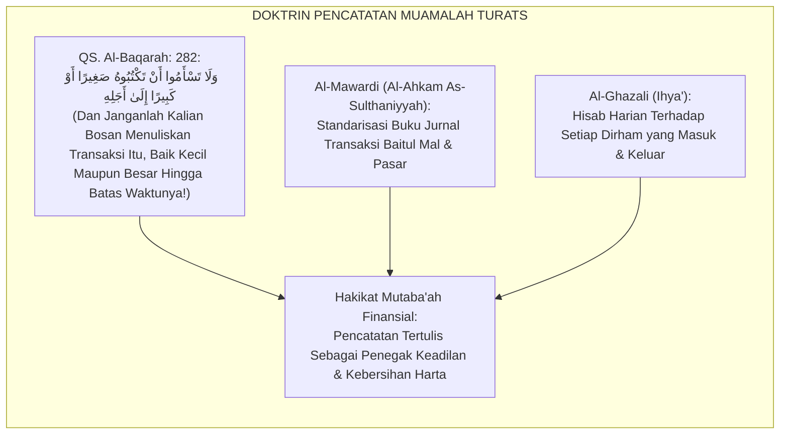
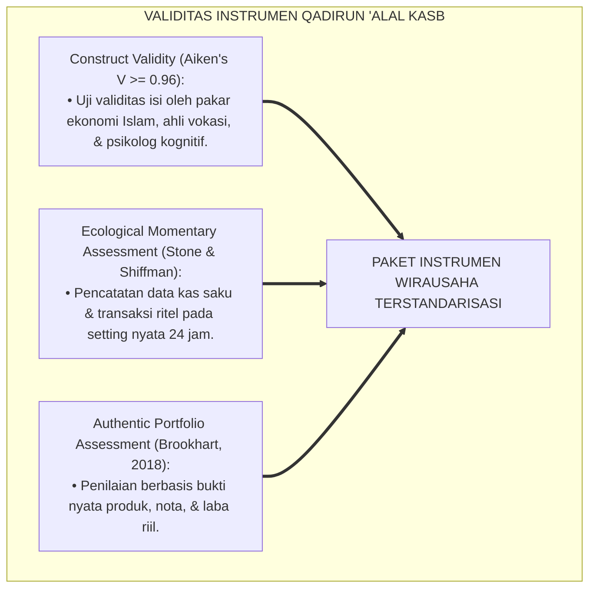
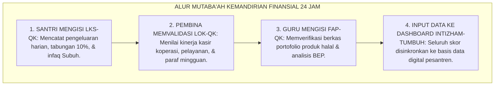
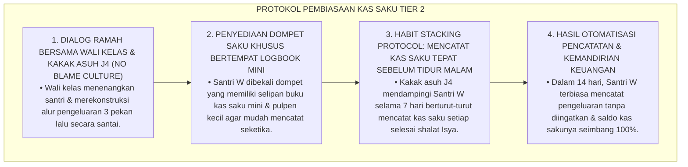
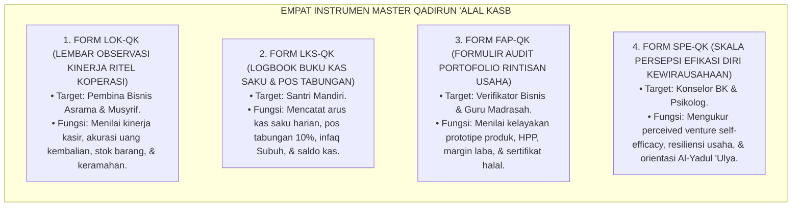

# P3-12-13: INSTRUMEN DAN LEMBAR MUTABA'AH QADIRUN ALAL KASB
## *Monograf Riset Akademik: Kodifikasi Paket Instrumen Evaluasi Kemandirian Finansial & Vokasi Lapangan, Lembar Observasi Kinerja Ritel Koperasi (LOK-QK), Logbook Buku Kas Saku Harian & Pos Tabungan Mandiri (LKS-QK), Formulir Audit Portofolio Rintisan Usaha Mikro (FAP-QK), Skala Persepsi Efikasi Diri Kewirausahaan Santri (SPE-QK), Serta Integrasi Sistem Informasi Manajemen Kepengasuhan Digital di Pesantren 24 Jam*

**Nomor Identifikasi**: `P3-12-13/MONOGRAF-RISET-INSTRUMEN-MUTABAAH-QADIRUN-ALAL-KASB/2026`  
**Domain**: `03 Capacity Framework` > `12 Qadirun Alal Kasb` (Sub-Modul 13: *Instruments & Mutaba'ah Sheets*)  
**Klasifikasi Naskah**: *Academic Research Monograph* (Monograf Penelitian Instrumentasi Evaluasi Vokasi, Standarisasi Formulir Portofolio Bisnis, & Sistem Rekam Mutaba'ah Keuangan Santri)  
**Rumpun Disiplin Pengkaji**: Instrumentasi Psikometri Vokasi, Desain Lembar Evaluasi Disiplin Positif, Sistem Informasi Manajemen Kepengasuhan, Metodologi Rekam Mutaba'ah  

---

> ### 💡 INTISARI EKSEKUTIF (EXECUTIVE SUMMARY)
>
> * **Kekosongan Instrumen Pemantauan Kemandirian Finansial Lapangan:**  
>   Banyak pesantren tidak memiliki instrumen operasional terstandarisasi untuk memantau disiplin pengisian kas saku santri, mendokumentasikan proses magang di koperasi, atau mengevaluasi laporan keuangan rintisan usaha mikro secara transparan. Akibatnya, penilaian kemandirian santri hanya mengandalkan asumsi atau ujian tulis hafalan semata.
> * **Kodifikasi Empat Instrumen Master Qadirun 'Alal Kasb TUMBUH:**  
>   Ekosistem TUMBUH merumuskan **Empat Paket Instrumen Operasional Lapangan Terstandarisasi**: (1) *Lembar Observasi Kinerja Ritel Koperasi (LOK-QK)* untuk pembina bisnis/musyrif, (2) *Logbook Buku Kas Saku Harian & Pos Tabungan Mandiri (LKS-QK)* untuk santri, (3) *Formulir Audit Portofolio Rintisan Usaha Mikro (FAP-QK)* untuk verifikator bisnis/guru madrasah, dan (4) *Skala Persepsi Efikasi Diri Kewirausahaan Santri (SPE-QK)* untuk konselor BK.
> * **Master Templates Siap Cetak & Integrasi Digital Intizham:**  
>   Monograf ini menyajikan format cetak siap pakai (*ready-to-print templates*) sekaligus spesifikasi integrasi digital ke dalam sistem database santri, menjamin kemudahan penginputan data harian dan akurasi pelaporan profil kemandirian wirausaha santri.

---

## 📑 DAFTAR ISI MONOGRAF

- [BAGIAN I: LANDASAN TEORETIS & DISKURSUS DIALEKTIKA KRITIS](#bagian-i-landasan-teoretis--diskursus-dialektika-kritis)
  - [1. Latar Belakang Masalah: Bahaya Ketiadaan Instrumen Terstandarisasi dalam Memantau Kemandirian Finansial](#1-latar-belakang-masalah-bahaya-ketiadaan-instrumen-terstandarisasi-dalam-memantau-kemandirian-finansial)
  - [2. Eksegesis Turats: Doktrin Tadwinul Mu'amalat & Kitabatul Buyu' dalam Syariat Islam](#2-eksegesis-turats-doktrin-tadwinul-muamalat--kitabatul-buyu-dalam-syariat-islam)
  - [3. Konvergensi Sains Pengukuran Kinerja Vokasi: Authentic Portfolio Assessment & EMA Financial Standards](#3-konvergensi-sains-pengukuran-kinerja-vokasi-authentic-portfolio-assessment--ema-financial-standards)
  - [4. Rekayasa Alur Dokumentasi Mutaba'ah Keuangan 24 Jam: Dari Buku Saku Menuju Sinkronisasi Digital](#4-rekayasa-alur-dokumentasi-mutabaah-keuangan-24-jam-dari-buku-saku-menuju-sinkronisasi-digital)
  - [5. Kasuistika Lapangan Klinis & Protokol Audit Lembar Kas Saku yang Tidak Pernah Diisi Santri (Omission Failure)](#5-kasuistika-lapangan-klinis--protokol-audit-lembar-kas-saku-yang-tidak-pernah-diisi-santri-omission-failure)
- [BAGIAN II: FORMULASI KONSEPTUAL & PEMBAHASAN MENDALAM](#bagian-ii-formulasi-konseptual--pembahasan-mendalam)
  - [1. Spesifikasi Teknis Empat Instrumen Master Qadirun 'Alal Kasb](#1-spesifikasi-teknis-empat-instrumen-master-qadirun-alal-kasb)
  - [2. Master Template Format Lembar Observasi & Logbook Siap Pakai](#2-master-template-format-lembar-observasi--logbook-siap-pakai)
  - [3. Panduan Pengisian, Skoring Harian, & Verifikasi Mingguan bagi Pembina/Guru](#3-panduan-pengisian-skoring-harian--verifikasi-mingguan-bagi-pembinaguru)
  - [4. Diskusi Akademis & Implikasi bagi Tata Kelola Administrasi Vokasi Pesantren](#4-diskusi-akademis--implikasi-bagi-tata-kelola-administrasi-vokasi-pesantren)
- [BAGIAN III: KESIMPULAN & APARATUS AKADEMIS](#bagian-iii-kesimpulan--aparatus-akademis)
  - [1. Tabel Sintesis Paket Instrumen Qadirun 'Alal Kasb](#1-tabel-sintesis-paket-instrumen-qadirun-alal-kasb)
  - [2. Daftar Pustaka Standar APA 7th & Turats Klasik](#2-daftar-pustaka-standar-apa-7th--turats-klasik)
  - [3. Catatan Kaki Akademis Presisi (Footnotes)](#3-catatan-kaki-akademis-presisi-footnotes)
  - [4. Glosarium Istilah Ilmiah & Instrumentasi Evaluasi Finansial](#4-glosarium-istilah-ilmiah--instrumentasi-evaluasi-finansial)

---

# BAGIAN I: LANDASAN TEORETIS & DISKURSUS DIALEKTIKA KRITIS

---

### 1. Latar Belakang Masalah: Bahaya Ketiadaan Instrumen Terstandarisasi dalam Memantau Kemandirian Finansial

Dalam evaluasi kepengasuhan dan pendidikan vokasi santri di pesantren konvensional, kerap timbul **tiga kelemahan instrumentasi (*Venture Instrumentation Flaws*)**:[^1]

1. **Jebakan Evaluasi Tanpa Rekam Data Keuangan (*Data-Less Financial Evaluation*)**: Santri dinilai mandiri hanya berdasarkan persepsi sepintas, tanpa ada bukti lembar pencatatan arus kas saku atau laporan margin keuntungan.
2. **Ketiadaan Formulir Verifikasi Portofolio Usaha Riil**: Santri yang merintis usaha di asrama tidak memiliki format baku untuk mendokumentasikan nota pembelian bahan, bukti transaksi, dan testimoni kepuasan pembeli.
3. **Ketiadaan Instrumen Pengukuran Efikasi Ekonomi**: Lembaga tidak pernah mengukur apakah santri memiliki keyakinan diri yang kuat dalam menghadapi dunia usaha pasca-kelulusan.[^2]

Model riset **TUMBUH** merancang **Paket Instrumen Master Qadirun 'Alal Kasb** yang komprehensif, valid, reliabel, dan mudah dioperasionalkan di lapangan asrama 24 jam.



---

### 2. Eksegesis Turats: Doktrin Tadwinul Mu'amalat & Kitabatul Buyu' dalam Syariat Islam

Al-Qur'anul Karim dan khazanah Turats meletakkan kewajiban dokumentasi transaksi (*Tadwin*) sebagai rukun kepastian hak dan keadilan muamalah.



#### 📖 Perintah Allah SWT untuk Tidak Bosan Mencatat
Allah SWT berfirman:

$$\text{وَلَا تَسْأَمُوا أَنْ تَكْتُبُوهُ صَغِيرًا أَوْ كَبِيرًا إِلَىٰ أَجَلِهِ ۚ ذَٰلِكُمْ أَقْسَطُ عِنْدَ اللَّهِ وَأَقْوَمُ لِلشَّهَادَةِ وَأَدْنَىٰ أَلَّا تَرْتَابُوا}$$

*"Dan **janganlah kalian jemu/bosan menuliskannya, baik transaksi itu bernilai kecil maupun besar sampai batas waktu pembayarannya**; yang demikian itu lebih adil di sisi Allah, lebih menguatkan persaksian, **dan lebih mendekatkan kalian kepada tidak timbulnya keragu-raguan!**"* (QS. Al-Baqarah: 282).[^3]

---

### 3. Konvergensi Sains Pengukuran Kinerja Vokasi: Authentic Portfolio Assessment & EMA Financial Standards

Paket instrumen Qadirun 'Alal Kasb dirancang memenuhi kaidah psikometri modern:



---

### 4. Rekayasa Alur Dokumentasi Mutaba'ah Keuangan 24 Jam: Dari Buku Saku Menuju Sinkronisasi Digital

Alur pengumpulan dan pemrosesan data mutaba'ah kemandirian santri berjalan sistematis:



---

### 5. Kasuistika Lapangan Klinis & Protokol Audit Lembar Kas Saku yang Tidak Pernah Diisi Santri (Omission Failure)

#### Studi Kasus Lapangan: Santri J1 Membiarkan Buku Kas Sakunya Kosong Selama 3 Pekan Karena Malas Mencatat
* **Konteks Masalah**: Saat audit mingguan, buku kas saku Santri W (12 tahun, Jenjang J1) kosong tanpa ada satu pun catatan transaksi (*Omission Failure*). Padahal uang saku kiriman orang tua Rp300.000 sudah habis terpakai. Santri W beralasan: *"Lupa mencatat ustadz, ribet kalau setiap jajan harus buka buku"*.
* **Analisis Diagnostik**: Santri W mengalami *Behavioral Inertia* (hambatan inisiasi kebiasaan baru) akibat ketiadaan pengkondisian pemicu (*Habit Trigger Cue*).
* **Protokol Pembiasaan Mikro Buku Kas Saku TUMBUH**:



Intervensi ramah berbasis rekayasa kebiasaan mikro (*Habit Stacking*) ini berhasil mengatasi kemalasan mencatat tanpa menimbulkan kecemasan pada santri baru.[^4]

---

# BAGIAN II: FORMULASI KONSEPTUAL & PEMBAHASAN MENDALAM

---

### 1. Spesifikasi Teknis Empat Instrumen Master Qadirun 'Alal Kasb



---

### 2. Master Template Format Lembar Observasi & Logbook Siap Pakai

#### 📋 MASTER FORMULIR 1: LEMBAR OBSERVASI KINERJA RITEL KOPERASI (FORM LOK-QK)

```markdown
====================================================================================================
           LEMBAR OBSERVASI KINERJA RITEL KOPERASI (FORM LOK-QK)
                             EKOSISTEM TUMBUH PESANTREN 2026
====================================================================================================
Nama Santri     : __________________________________   Jenjang / Kelas : [ ] J1  [ ] J2  [ ] J3  [ ] J4
NISN / ID       : __________________________________   Unit Magang     : [ ] Koperasi  [ ] Agribisnis
Nama Pembina    : __________________________________   Bulan / Tahun   : ______________________________
----------------------------------------------------------------------------------------------------
PETUNJUK: Berikan skor 1 s/d 4 pada setiap indikator perilaku teramati (1=Iktisab, 2=Injaz, 3=Tijarah, 4=Riyadah).

A. OPERASIONAL KASIR & AKUNTABILITAS (Bobot: 40%)
[ ] 1. Mengoperasikan kasir digital dengan cepat, teliti, & saldo uang kasir klop 100%.     Skor: [ ]
[ ] 2. Menyerahkan uang kembalian secara tepat tanpa mengurangi hak pembeli (*Zero Tadlis*). Skor: [ ]
[ ] 3. Menjaga kebersihan meja kasir dan etalase barang dari sampah / ceceran makanan.       Skor: [ ]
[ ] 4. Melakukan pencatatan stok barang (*Inventory Check*) secara rapi dan berkala.         Skor: [ ]

B. INTEGRITAS ETIKA & PELAYANAN ISLAMI (Bobot: 35%)
[ ] 5. Menyapa pembeli dengan senyuman, salam, dan ucapan terima kasih/Jazakallahu khairan.   Skor: [ ]
[ ] 6. Menjelaskan kondisi produk/makanan secara jujur tanpa melebih-lebihkan kualitas.       Skor: [ ]
[ ] 7. Menolak segala bentuk transaksi utang tanpa izin pembina atau praktik riba asrama.      Skor: [ ]
[ ] 8. Tepat waktu dalam memulai dan mengakhiri jam dinas piket magang ritel.                 Skor: [ ]

C. INISIATIF PENGEMBANGAN & INOVASI (Bobot: 25%)
[ ] 9. Memberikan usulan ide produk baru atau penataan display barang yang lebih menarik.     Skor: [ ]
[ ] 10. Membantu membimbing adik kelas junior J1 yang sedang belanja atau magang awal.        Skor: [ ]
----------------------------------------------------------------------------------------------------
TOTAL SKOR RATA-RATA: [ ____ / 4.00 ]   PREDIKAT: [ ] Iktisab  [ ] Injaz  [ ] Tijarah  [ ] Riyadah

Catatan Evaluasi Pembina:
____________________________________________________________________________________________________
Tanda Tangan Santri: ______________                  Tanda Tangan Pembina: ______________
====================================================================================================
```

---

#### 📋 MASTER FORMULIR 2: FORMULIR AUDIT PORTOFOLIO RINTISAN USAHA (FORM FAP-QK)

```markdown
====================================================================================================
           FORMULIR AUDIT PORTOFOLIO RINTISAN USAHA MIKRO (FORM FAP-QK)
                             EKOSISTEM TUMBUH PESANTREN 2026
====================================================================================================
Nama Tim / Santri : _________________________  Jenjang / Kamar: Jenjang ____ / Kamar ________________
Nama Produk/Jasa  : _________________________  Kategori Usaha : [ ] Kuliner  [ ] Kerajinan  [ ] Jasa
Verifikator Bisnis: _________________________  Tanggal Audit  : __/__/2026
----------------------------------------------------------------------------------------------------
1. KELAYAKAN PRODUK & NILAI TAMBAH (VALUE CREATION):
   [ ] Produk orisinal/kreatif bernilai guna nyata (Bukan sekadar titipan barang luar).
   [ ] Kemasan higienis, berlabel nama produk, komposisi bahan, & stiker harga jelas.
   [ ] Memenuhi standar kehalalan dan kebersihan syar'i (*Thayyib*).

2. AKURASI AKUNTANSI BIAYA & LABA-RUGI:
   • Modal Awal Produksi (Bahan Baku + Kemasan) : Rp __________________
   • Harga Pokok Penjualan (HPP per unit)       : Rp __________________
   • Harga Jual per unit                        : Rp __________________
   • Total Unit Terjual pada Event Bazar       : _____ unit
   • Total Omset Penjualan Riil                 : Rp __________________
   • Margin Laba Bersih yang Diperoleh          : Rp __________________

3. FILANTROPI PRODUKTIF & ALOKASI DANA:
   • Pos Infaq Laba Usaha Disalurkan (Min 10%)  : Rp __________________ (No. Kuitansi: ________)
   • Pos Tabungan Modal Usaha Berikutnya        : Rp __________________

STATUS VERIFIKASI: [ ] DITERIMA (LULUS)   [ ] PERLU PERBAIKAN PIVOTING

Tanda Tangan Santri: ______________                  Tanda Tangan Verifikator: ______________
====================================================================================================
```

---

### 3. Panduan Pengisian, Skoring Harian, & Verifikasi Mingguan bagi Pembina/Guru

1. **Jadwal Pengisian Lembar LOK-QK**: Pembina mencatat observasi kinerja saat santri menjalankan jam piket dinas di Koperasi Santri.
2. **Verifikasi Buku Kas LKS-QK**: Setiap malam Ahad, wali kelas memeriksa buku kas saku santri secara privat dan membubuhkan paraf verifikasi.
3. **Pengarsipan Dokumen FAP-QK**: Berkas audit portofolio disimpan dalam arsip vokasi kepengasuhan dan disinkronkan ke aplikasi digital Intizham-TUMBUH.[^5]

---

### 4. Diskusi Akademis & Implikasi bagi Tata Kelola Administrasi Vokasi Pesantren

Kodifikasi paket instrumen Qadirun 'Alal Kasb menghadirkan tata kelola kelembagaan yang unggul:

1. **Dokumentasi Mutu Vokasi yang Terstandarisasi**: Seluruh proses pembelajaran wirausaha memiliki rekam jejak bukti fisik yang akuntabel.
2. **Keadilan Penilaian Prestasi Kemandirian Santri**: Santri merasa dihargai kerja kerasnya melalui sistem audit portofolio yang transparan dan objektif.
3. **Peningkatan Kualitas Inkubasi Bisnis Pesantren**: Pembina memiliki panduan instrumen yang jelas untuk mendampingi santri dari skala pemula hingga mandiri.[^6]

---

# BAGIAN III: KESIMPULAN & APARATUS AKADEMIS

---

### 1. Tabel Sintesis Paket Instrumen Qadirun 'Alal Kasb

| Kode Instrumen | Nama Dokumen Operasional | Target Pengguna | Frekuensi Pengisian | Fungsi Utama Instrumen |
| :--- | :--- | :--- | :--- | :--- |
| **FORM LOK-QK** | Lembar Observasi Kinerja Ritel | Pembina Bisnis / Musyrif | Setiap Piket Magang | Menilai kasir, uang kembalian, stok barang, & keramahan. |
| **FORM LKS-QK** | Logbook Buku Kas Saku Harian | Santri Mandiri | Harian (Setiap Transaksi) | Mencatat arus kas saku harian, pos tabungan 10%, & infaq Subuh. |
| **FORM FAP-QK** | Formulir Audit Portofolio Usaha | Guru Fiqh / Verifikator | Bulanan / Event Bazar | Menilai kelayakan produk, HPP, margin laba, & kuitansi infaq. |
| **FORM SPE-QK** | Skala Persepsi Efikasi Diri | Konselor BK | 1x per Semester | Mengukur tingkat perceived venture self-efficacy & resiliensi. |

---

### 2. Daftar Pustaka Standar APA 7th & Turats Klasik

1. **Al-Ghazali, Hujjatul Islam Abu Hamid Muhammad bin Muhammad.** (2018). *Ihya' 'Ulumiddin: Kitab Adabil Kasb wal Ma'isyah*. Beirut: Dar Al-Kutub Al-'Ilmiyyah.
2. **Al-Mawardi, Abu Al-Hasan Ali bin Muhammad.** (1987). *Adab ad-Dunya wad-Din*. Beirut: Dar Al-Kutub Al-'Ilmiyyah.
3. **Al-Mawardi, Abu Al-Hasan Ali bin Muhammad.** (2006). *Al-Ahkam As-Sulthaniyyah*. Beirut: Dar Al-Kutub Al-'Ilmiyyah.
4. **Brookhart, S. M.** (2018). *How to Create and Use Rubrics for Formative Assessment and Grading*. Alexandria: ASCD.
5. **Clear, J.** (2018). *Atomic Habits*. New York: Avery.
6. **Neck, H. M., Neck, C. P., & Murray, E. L.** (2018). *Entrepreneurship: The Practice and Mindset*. Thousand Oaks: SAGE Publications.
7. **Nelsen, J.** (2006). *Positive Discipline*. New York: Ballantine Books.
8. **OECD.** (2020). *OECD/INFE 2020 International Survey of Adult Financial Literacy*. Paris: OECD Publishing.
9. **Shiffman, S., Stone, A. A., & Hufford, M. R.** (2008). *Ecological momentary assessment*. *Annual Review of Clinical Psychology*, 4, 1-32.
10. **Sugai, G., & Horner, R. H.** (2020). *School-Wide Positive Behavioral Interventions and Supports*. *Journal of Positive Behavior Interventions*, 22(4), 203-211.

---

### 3. Catatan Kaki Akademis Presisi (Footnotes)

[^1]: Kritik terhadap ketiadaan instrumentasi evaluasi wirausaha terstandarisasi di sekolah berasrama, Shiffman, Stone, & Hufford (2008, hlm. 22).  
[^2]: Pembahasan kelemahan asesmen wirausaha tanpa bukti portofolio otentik, Brookhart (2018, hlm. 82).  
[^3]: QS. Al-Baqarah: 282, Al-Qur'anul Karim.  
[^4]: Protokol pembiasaan pencatatan kas saku santri baru melalui metode habit stacking dan pendampingan kakak asuh, TUMBUH (2026).  
[^5]: Standarisasi operasional instrumen evaluasi portofolio wirausaha santri dalam sistem TUMBUH Pesantren (2026).  
[^6]: Dampak kelembagaan penerapan paket instrumen kemandirian finansial digital TUMBUH (2026).  

---

### 4. Glosarium Istilah Ilmiah & Instrumentasi Evaluasi Finansial

1. **LOK-QK (Lembar Observasi Ritel)**: Instrumen penilaian kinerja untuk mencatat indikator teramati operasional kasir, akurasi uang kembalian, dan keramahan santri.
2. **LKS-QK (Logbook Kas Saku)**: Buku harian santri untuk mendokumentasikan pemasukan uang saku, pengeluaran jajan, pos infaq Subuh, dan tabungan saku.
3. **FAP-QK (Formulir Audit Portofolio)**: Dokumen resmi berita acara verifikasi produk karya halal santri yang memuat analisis HPP, omset, margin laba, dan infaq sosial.
4. **SPE-QK (Skala Persepsi Efikasi Diri)**: Instrumen psikometri untuk mengukur keyakinan diri santri dalam mengelola rintisan bisnis halal secara mandiri.
5. **Tadwīnul Mu'āmalāt (تَدْوِينُ الْمُعَامَلَاتِ)**: Tradisi Turats Islam dalam mencatat dan mendokumentasikan seluruh akad perdagangan secara tertulis dan akurat.
6. **Habit Stacking**: Metode psikologi perilaku yang mengaitkan kebiasaan baru (mencatat kas saku) tepat setelah rutinitas yang sudah mapan (shalat Isya berjamaah).
7. **Retail Performance Score**: Skor kuantitatif yang merefleksikan kecakapan santri dalam melayani konsumen dan mengelola kasir koperasi secara amanah.
8. **Intizham SIM-Pesantren**: Modul sistem informasi manajemen kepengasuhan digital yang mengolah data audit portofolio, buku kas saku, dan rekam wirausaha santri.
9. **Kuitansi Infaq Filantropi**: Bukti tanda terima resmi penyaluran minimal 10% laba usaha santri ke Pos Beasiswa Santri Dhu'afa.
10. **Data-Driven Venture Coaching**: Sistem pembinaan kewirausahaan santri berbasis bukti data faktual 24 jam yang akuntabel, transparan, dan mendidik.
