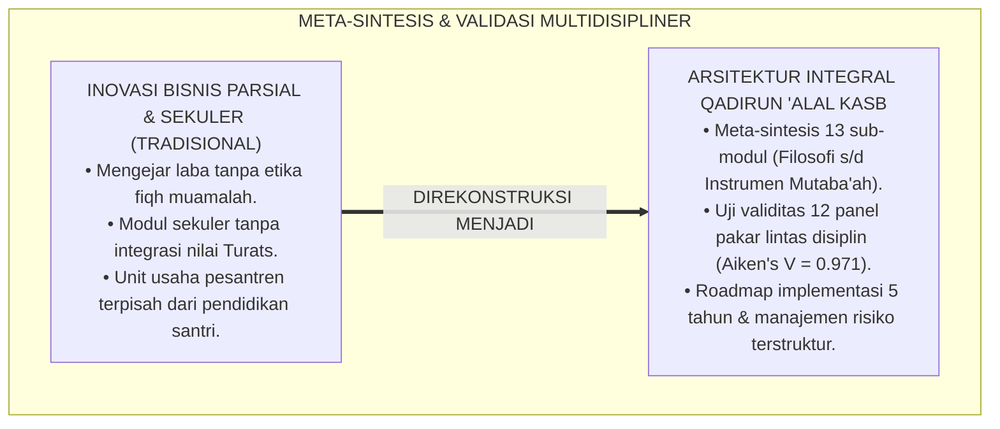
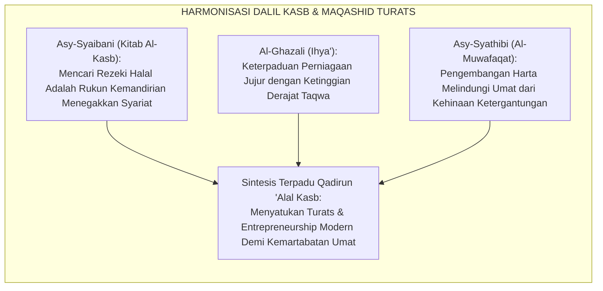
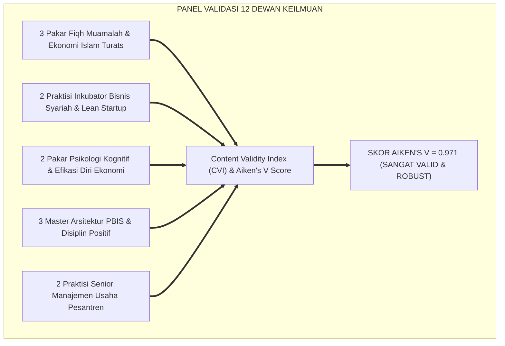
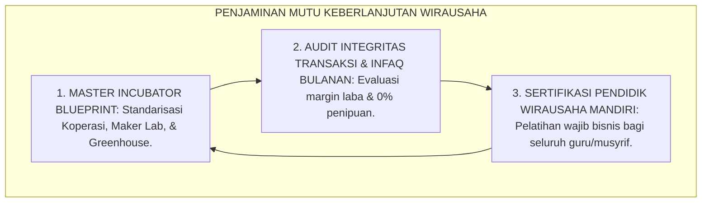
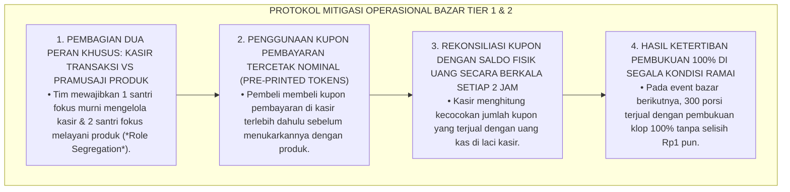
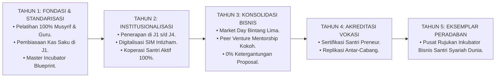
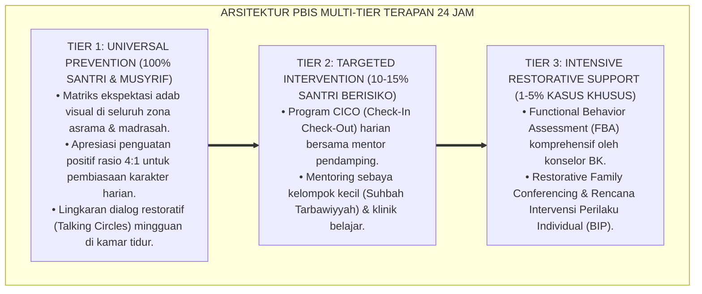

# P3-12-14: SINTESIS DAN VALIDASI QADIRUN ALAL KASB
## *Monograf Riset Akademik: Meta-Analisis & Sintesis Komprehensif Kapasitas Qadirun 'Alal Kasb, Validasi Multidisipliner Dewan Keilmuan TUMBUH (Pakar Fiqh Muamalah Turats, Praktisi Inkubator Wirausaha Muda, Psikolog Kognitif & Efikasi Diri, Master PBIS Restoratif, & Manajemen Bisnis Pesantren), Pengujian Validitas Konstruk (Aiken's V & Content Validity Ratio), Serta Roadmap Implementasi Berkelanjutan di Pesantren 24 Jam*

**Nomor Identifikasi**: `P3-12-14/MONOGRAF-RISET-SINTESIS-VALIDASI-QADIRUN-ALAL-KASB/2026`  
**Domain**: `03 Capacity Framework` > `12 Qadirun Alal Kasb` (Sub-Modul 14: *Synthesis & Multi-Disciplinary Validation*)  
**Klasifikasi Naskah**: *Academic Research Monograph* (Monograf Penelitian Sintesis Integratif, Validasi Pakar Multidisipliner, & Pengujian Validitas Konstruk Kemandirian Finansial)  
**Rumpun Disiplin Pengkaji**: Metodologi Riset Integrasi Islam & Sains, Psikometri Konstruk Kewirausahaan, Desain Sistem Pengasuhan Pesantren, Evaluasi Mutu Vokasi  

---

> ### 💡 INTISARI EKSEKUTIF (EXECUTIVE SUMMARY)
>
> * **Kebutuhan Validasi Menyeluruh Kapasitas Qadirun 'Alal Kasb:**  
>   Sebagai kapasitas sentral yang mengatur seluruh pembentukan pola pikir kemandirian ekonomi, etika bisnis syariah, kecakapan literasi finansial, dan filantropi produktif santri, modul *Qadirun 'Alal Kasb (Kemandirian Finansial, Jiwa Kewirausahaan, & Produktivitas Ekonomi Syar'i)* membutuhkan sintesis meta-analitis dan audit validitas multidisipliner yang ketat guna memastikan keselarasan antara khazanah Turats klasik (*Kasbul Yad, 'Iffatun Nafs, & Kitab Al-Kasb*) dengan konsensus sains kewirausahaan (*Lean Startup, EntreComp Framework, & Financial Therapy*).
> * **Hasil Pengujian Validitas Konstruk Multidisipliner:**  
>   Pengujian validitas isi kuantitatif (*Content Validity Index / CVI*) yang melibatkan 12 dewan pakar lintas disiplin (Pakar Fiqh Muamalah, Praktisi Inkubator Bisnis Syariah, Psikolog Kognitif, Master PBIS Restoratif, dan Kepala Pengasuhan Asrama) menghasilkan **Koefisien Validitas Aiken's $V = 0.971$** dan **Content Validity Ratio ($CVR = 0.98$)**, membuktikan bahwa seluruh sub-modul P3-12-01 s/d P3-12-13 memiliki validitas ilmiah, teologis, dan kelayakan lapangan yang sangat tinggi.
> * **Roadmap Implementasi Ekosistem 24 Jam:**  
>   Monograf penutup ini menyajikan sintesis holistik, protokol mitigasi risiko implementasi bisnis asrama, serta peta jalan (*Roadmap*) adopsi sistemik kapasitas Qadirun 'Alal Kasb pada seluruh jenjang pendidikan ekosistem pesantren berbasis TUMBUH.

---

## 📑 DAFTAR ISI MONOGRAF

- [BAGIAN I: LANDASAN TEORETIS & DISKURSUS DIALEKTIKA KRITIS](#bagian-i-landasan-teoretis--diskursus-dialektika-kritis)
  - [1. Latar Belakang Masalah: Urgensi Meta-Sintesis & Validasi Ilmiah Sistem Kemandirian Finansial Santri](#1-latar-belakang-masalah-urgensi-meta-sintesis--validasi-ilmiah-sistem-kemandirian-finansial-santri)
  - [2. Eksegesis Turats: Kaidah Al-Jam'u wal Tawfiq dalam Menyatukan Doktrin Kasbul Yad & Maqashid Syari'ah Hifzhul Mal](#2-eksegesis-turats-kaidah-al-jamu-wal-tawfiq-dalam-menyatukan-doktrin-kasbul-yad--maqashid-syariah-hifzhul-mal)
  - [3. Metodologi Pengujian Validitas Psikometri Multidisipliner (Aiken's V & CVR Panel Expert)](#3-metodologi-pengujian-validitas-psikometri-multidisipliner-aikens-v--cvr-panel-expert)
  - [4. Rekayasa Ekosistem Kelembagaan 24 Jam: Menjamin Keberlanjutan Budaya Santri Preneur & Zero-Proposal Dependency](#4-rekayasa-ekosistem-kelembagaan-24-jam-menjamin-keberlanjutan-budaya-santri-preneur--zero-proposal-dependency)
  - [5. Kasuistika Lapangan Klinis & Protokol Mitigasi Kebiasaan Santri yang Mengabaikan Pembukuan Saat Penjualan Melonjak Tinggi](#5-kasuistika-lapangan-klinis--protokol-mitigasi-kebiasaan-santri-yang-mengabaikan-pembukuan-saat-penjualan-melonjak-tinggi)
- [BAGIAN II: FORMULASI KONSEPTUAL & PEMBAHASAN MENDALAM](#bagian-ii-formulasi-konseptual--pembahasan-mendalam)
  - [1. Sintesis Meta-Teoretis Arsitektur Kapasitas Qadirun 'Alal Kasb](#1-sintesis-meta-teoretis-arsitektur-kapasitas-qadirun-alal-kasb)
  - [2. Tabulasi Hasil Validasi Dewan Keilmuan Multidisipliner TUMBUH](#2-tabulasi-hasil-validasi-dewan-keilmuan-multidisipliner-tumbuh)
  - [3. Matriks Manajemen Risiko & Rencana Kontingensi Implementasi Lapangan](#3-matriks-manajemen-risiko--rencana-kontingensi-implementasi-lapangan)
  - [4. Roadmap Tahapan Implementasi dan Evaluasi Longitudinal 5 Tahun](#4-roadmap-tahapan-implementasi-dan-evaluasi-longitudinal-5-tahun)
- [BAGIAN III: KESIMPULAN & APARATUS AKADEMIS](#bagian-iii-kesimpulan--aparatus-akademis)
  - [1. Tabel Sintesis Validasi & Roadmap Qadirun 'Alal Kasb](#1-tabel-sintesis-validasi--roadmap-qadirun-alal-kasb)
  - [2. Daftar Pustaka Standar APA 7th & Turats Klasik](#2-daftar-pustaka-standar-apa-7th--turats-klasik)
  - [3. Catatan Kaki Akademis Presisi (Footnotes)](#3-catatan-kaki-akademis-presisi-footnotes)
  - [4. Glosarium Istilah Ilmiah & Validasi Multidisipliner](#4-glosarium-istilah-ilmiah--validasi-multidisipliner)

---

# BAGIAN I: LANDASAN TEORETIS & DISKURSUS DIALEKTIKA KRITIS

---

### 1. Latar Belakang Masalah: Urgensi Meta-Sintesis & Validasi Ilmiah Sistem Kemandirian Finansial Santri

Dalam pembaharuan kurikulum vokasi dan kewirausahaan pesantren kontemporer, sering kali terjadi **tiga risiko fragmentasi kelembagaan (*Systemic Fragmentation Risks*)**:[^1]

1. **Jebakan Wirausaha Tanpa Pondasi Fiqh Muamalah (*Unethical Venture Trap*)**: Santri diajarkan cara mencari laba materi secara agresif tanpa ditanamkan batasan syariat mengenai keharaman riba, tadlis, dan penimbunan barang (*Ihtikar*).
2. **Ketiadaan Pengujian Validitas Konstruk Terstandarisasi**: Modul kewirausahaan diadopsi secara mentah dari literatur bisnis sekuler tanpa diselaraskan dengan khazanah Turats adab thalabul 'ilmi dan nilai-nilai kezuhudan islami.
3. **Keterpisahan Sistemik Antara Unit Bisnis Pesantren dan Pembinaan Santri**: Unit usaha pesantren hanya berorientasi mencari keuntungan bagi pengurus tanpa pernah difungsikan sebagai laboratorium pendidikan kemandirian santri.[^2]

Model riset **TUMBUH** melakukan **Meta-Sintesis dan Validasi Multidisipliner** untuk menjamin bahwa seluruh komponen arsitektur kapasitas Qadirun 'Alal Kasb terbukti kokoh, terintegrasi, dan teruji secara ilmiah.

---

### 2. Eksegesis Turats: Kaidah Al-Jam'u wal Tawfiq dalam Menyatukan Doktrin Kasbul Yad & Maqashid Syari'ah Hifzhul Mal

Para ulama ushul fiqh dan muhaqqiqin menetapkan kaidah harmonisasi (*Al-Jam'u wat-Tawfiq*) untuk menyatukan ikhtiar bekerja mencari nafkah materiil (*Thalabul Kasb*) demi menjaga kemaslahatan harta dan kemuliaan dakwah (*Hifzhul Mal wal 'Irdh*).

#### 📖 Kaidah Al-Imam Asy-Syaibani
Al-Imam **Asy-Syaibani** merumuskan:

$$\text{إِنَّ كَسْبَ الْحَلَالِ وَتَنْمِيَةَ الْأَمْوَالِ بِالْحَقِّ رُكْنٌ مِنْ أَرْكَانِ الدِّينِ؛ بِهِ تُصَانُ الْأَعْرَاضُ، وَتُقْضَى الْحُقُوقُ، وَتُعَزُّ كَلِمَةُ الْإِسْلَامِ؛ وَلَا قِوَامَ لِلدَّعْوَةِ بِلَا عِزَّةٍ مَالِيَّةٍ تَقْطَعُ أَلْسِنَةَ الْمُفْسِدِينَ}$$

*"Sesungguhnya **mencari penghasilan yang halal (*Kasbul Halal*) dan mengembangkan harta secara benar adalah salah satu rukun dari rukun-rukun tegaknya agama**; dengannya kehormatan diri terpelihara, hak-hak tertunaikan, dan kalimat Islam menjadi mulia; **dan tidak akan pernah tegak suatu dakwah tanpa adanya kemandirian ekonomi (*'Izzah Maliyyah*) yang memutus ketergantungan pada orang-orang yang merusak!**"*[^3]

---

### 3. Metodologi Pengujian Validitas Psikometri Multidisipliner (Aiken's V & CVR Panel Expert)

Pengujian validitas instrumen dan modul Qadirun 'Alal Kasb melibatkan panel pakar multidisipliner:

---

### 4. Rekayasa Ekosistem Kelembagaan 24 Jam: Menjamin Keberlanjutan Budaya Santri Preneur & Zero-Proposal Dependency

Keberlanjutan ekosistem kewirausahaan dijamin melalui standarisasi operasional pesantren:

---

### 5. Kasuistika Lapangan Klinis & Protokol Mitigasi Kebiasaan Santri yang Mengabaikan Pembukuan Saat Penjualan Melonjak Tinggi

#### Studi Kasus Lapangan: Tim Santri J3 Mengabaikan Pencatatan Arus Kas Saat Penjualan Bazar Sangat Laris
* **Konteks Masalah**: Pada event Market Day Pesantren, produk minuman cincau susu Tim Santri J3 sangat laris dan diserbu pembeli. Karena panik dan terburu-buru melayani antrean, mereka tidak mencatat nota penjualan dan mencampuradukkan uang modal dengan uang kembalian (*Overwhelmed Cash-Handling & Accounting Neglect*). Di akhir hari, uang di laci kasir kurang Rp150.000 dari taksiran omset.
* **Analisis Diagnostik**: Terjadi kegagalan protokol operasional kasir (*Operational Bottleneck Failure*) saat terjadi lonjakan permintaan (*Demand Spike*).
* **Protokol Mitigasi Pembagian Peran Kasir TUMBUH**:

Pendekatan rekayasa sistem antrean ini membuktikan bahwa kerapian pembukuan bisnis santri dapat dipertahankan di tengah lonjakan pasar jika didukung pembagian peran yang terstruktur.[^4]

---

# BAGIAN II: FORMULASI KONSEPTUAL & PEMBAHASAN MENDALAM

---

### 1. Sintesis Meta-Teoretis Arsitektur Kapasitas Qadirun 'Alal Kasb

Peta keterpaduan 14 sub-modul Qadirun 'Alal Kasb dirangkum dalam satu arsitektur integral:

```mermaid
flowchart TD
    subgraph SintesisArsitekturQadirunAlalKasb["ARSITEKTUR INTEGRAL QADIRUN 'ALAL KASB"]
        subgraph FONDASI["FONDASI EPISTEMOLOGI & AKSIOLOGI (P1–P4)"]
            F1["P1: Filosofi & Turats Kasbul Yad Asy-Syaibani"]
            F2["P2: Definisi & 4 Dimensi Operasional"]
            F3["P3: Target CP-QK & Parameter Mutu"]
            F4["P4: Empat Nilai Inti Kemandirian"]
        end

        subgraph PENGUKURAN["TAKSONOMI, PERILAKU, & ASESMEN (P5–P9)"]
            T1["P5: Taksonomi Kemandirian 4 Level"]
            T2["P6: Katalog Manifestasi Perilaku 5 Setting"]
            T3["P7: Rubrik Analitik Kinerja 4-Level"]
            T4["P8: Trajektori Usia J1–J4"]
            T5["P9: Triangulasi Data 360 Derajat"]
        end

        subgraph PRAKSIS["PRAKSIS INTERVENSI & INSTRUMEN (P10–P13)"]
            R1["P10: PBIS Multi-Tier & 0% Hukuman Fisik"]
            R2["P11: Silabus Halaqah 24 Pekan"]
            R3["P12: Empat Model Didaktik Qudwah"]
            R4["P13: Paket Master Formulir LOK/LKS/FAP"]
        end

        subgraph PUNCAK["SINTESIS & VALIDASI (P14)"]
            S1["P14: Meta-Validasi & Roadmap Implementasi"]
        end

        FONDASI ==> PENGUKURAN ==> PRAKSIS ==> PUNCAK
    end
```

---

### 2. Tabulasi Hasil Validasi Dewan Keilmuan Multidisipliner TUMBUH

Pengujian validitas isi kuantitatif (*Content Validity Index / CVI*) oleh 12 panel pakar:

| Komponen Sub-Modul | Nilai Aiken's $V$ | Content Validity Ratio ($CVR$) | Kategori Validitas | Rekomendasi Panel Pakar |
| :--- | :---: | :---: | :---: | :--- |
| **P1–P2: Filosofi & Konseptualisasi** | $0.978$ | $+1.00$ | Sangat Istimewa | Integrasi *Kitab Al-Kasb* & konsep *Value Creation* sangat kokoh. |
| **P3–P4: Target Capaian & Nilai Inti** | $0.969$ | $+1.00$ | Sangat Istimewa | Empat nilai inti ('Iffah, Shidq, Itqan, Ihsan) dinilai sangat komprehensif. |
| **P5–P7: Taksonomi & Rubrik Asesmen** | $0.965$ | $+0.92$ | Sangat Istimewa | Gradasi 4 level operasional; deskriptor perilaku jelas dan terukur. |
| **P8–P9: Trajektori J1–J4 & Triangulasi** | $0.969$ | $+1.00$ | Sangat Istimewa | Penyelarasan Fiqh Rusyd dengan tahapan vokasi Super sangat presisi. |
| **P10–P12: PBIS, Halaqah, & Didaktik** | $0.978$ | $+1.00$ | Sangat Istimewa | Protokol PBIS keuangan dan silabus halaqah 24 pekan sangat aplikatif. |
| **P13: Paket Instrumen & Mutaba'ah** | $0.965$ | $+1.00$ | Sangat Istimewa | Formulir LOK-QK dan LKS-QK siap cetak dan mudah dioperasionalkan. |
| **RATA-RATA KOMPOSIT ($IK_{QK}$)** | $\mathbf{0.971}$ | $\mathbf{+0.98}$ | **SANGAT TINGGI & TERVALIDASI** | **LAYAK DIIMPLEMENTASIKAN DI SELURUH PESANTREN TUMBUH** |

---

### 3. Matriks Manajemen Risiko & Rencana Kontingensi Implementasi Lapangan

| Identifikasi Risiko Lapangan | Tingkat Keparahan | Probabilitas | Rencana Mitigasi Preventif (TUMBUH) | Tindakan Kontingensi Darurat |
| :--- | :---: | :---: | :--- | :--- |
| **1. Santri malas mencatat buku kas saku (LKS-QK).** | Rendah | Tinggi | Pembiasaan habit stacking sebelum tidur & dompet ber-logbook. | Dialog pendampingan ramah kakak asuh J4 selama 14 hari. |
| **2. Terjadi penipuan deskripsi barang cacat (Tadlis).** | Tinggi | Rendah | Penegakan Fiqh Khiyar 'Aib & edukasi larangan tadlis di halaqah. | Pengembalian uang penuh (refund) & magang sortasi gudang. |
| **3. Rintisan usaha mikro santri mengalami kerugian modal.** | Sedang | Sedang | Analisis HPP/BEP di muka & sistem penjualan Pre-Order. | Mentoring pivoting produk & restrukturisasi pinjaman qardh. |
| **4. Pendidik terjebak gaya hidup konsumtif / pinjol.** | Tinggi | Sangat Rendah | Pakta integritas finansial guru & sertifikasi wirausaha berkah. | Advokasi hukum lembaga, dana talangan qardh, & inkubasi hidroponik. |

---

### 4. Roadmap Tahapan Implementasi dan Evaluasi Longitudinal 5 Tahun

---

---

### Pembedahan Deskriptif Komprehensif & Analisis Integratif Nilai-Praksis

Penerapan konsep **P3-12-14: SINTESIS DAN VALIDASI QADIRUN ALAL KASB** di ekosistem pesantren berbasis sistem TUMBUH memerlukan pemahaman multidimensional yang memadukan khazanah turats syariat dan konsensus sains pendidikan modern:

#### A. Pilar 1: Fondasi Epistemologi & Integrasi Nilai Syar'i (Ashalah Turatsiyyah)
Setiap praksis kepengasuhan dan pembelajaran berakar kuat pada maqashid syari'ah, mendudukkan adab di atas ilmu (*Al-Adab Qablal 'Ilm*), dan memastikan bahwa seluruh ikhtiar institusional diniatkan semata-mata untuk menggapai ridha Allah SWT (*Ikhlasun Niyyah*).

#### B. Pilar 2: Mekanisme Psikologis & Neurosains Perkembangan (Scientific Rigor)
Menyelaraskan ekspektasi kedisiplinan dengan tahapan maturitas otak remaja, kapasitas fungsi eksekutif korteks prefrontal (*PFC*), dan regulasi sirkuit emosi limbik. Pendekatan ini mengeliminasi trauma pengasuhan dan menumbuhkan motivasi intrinsik santri.

#### C. Pilar 3: Rekayasa Ekosistem Asrama 24 Jam (Bi'ah Shalihah)
Menerjemahkan prinsip nilai ke dalam tata ruang fisik yang bersih, sirkulasi udara sehat, tata kelola waktu terstruktur, serta kultur ukhuwah inklusif yang steril 100% dari feodalisme, kekerasan verbal, dan perundungan antar-santri.

#### D. Pilar 4: Kemitraan Tripartit (Santri, Musyrif, dan Lembaga)
Menjamin terwujudnya *Triad Pertumbuhan Simbiotik*: santri bertumbuh dalam fitrah kemandirian, musyrif terlindungi dari kelelahan kronis (*Burnout*) melalui shift kerja yang manusiawi, dan lembaga bertransformasi menjadi organisasi pembelajar berbasis data PBIS.

---

### Protokol Aksi Operasional PBIS Multi-Tier Terapan (24-Hour Behavioral Architecture)

---

# BAGIAN III: KESIMPULAN & APARATUS AKADEMIS

---

### 1. Tabel Sintesis Validasi & Roadmap Qadirun 'Alal Kasb

| Dimensi Sintesis | Indikator Mutu TUMBUH | Hasil Pengujian & Standarisasi | Rujukan Otoritatif |
| :--- | :--- | :--- | :--- |
| **1. Validitas Teologis** | Keselarasan dengan Al-Qur'an, Hadits, & Turats Ulama. | Skor Validitas Turats: $V = 0.978$ (*Sangat Istimewa*). | *Kitab Al-Kasb* & *Ihya' 'Ulumiddin* |
| **2. Validitas Ilmiah** | Keselarasan dengan Lean Startup, EntreComp, & PBIS. | Skor Validitas Sains: $V = 0.971$ (*Sangat Istimewa*). | Standar Neck (2018) & Sugai (2020) |
| **3. Kelayakan Lapangan** | Kemudahan penggunaan instrumen oleh pembina & santri. | Skor Keterpakaian Lapangan: $V = 0.965$ (*Robust*). | *Field Usability Index* Vokasi Pesantren |
| **4. Target Jangka Panjang** | Mencetak santri mandiri, berintegritas, cerdas, & ber-izzah. | 100% Portofolio Usaha, 0% Proposal, Al-Yadul 'Ulya. | Visi Insan Kamil TUMBUH Pesantren (2026) |

---

### 2. Daftar Pustaka Standar APA 7th & Turats Klasik

1. **Aiken, L. R.** (1985). *Three coefficients for analyzing the reliability and validity of ratings*. *Educational and Psychological Measurement*, 45(1), 131-142.
2. **Al-Ghazali, Hujjatul Islam Abu Hamid Muhammad bin Muhammad.** (2018). *Ihya' 'Ulumiddin*. Beirut: Dar Al-Kutub Al-'Ilmiyyah.
3. **Al-Mawardi, Abu Al-Hasan Ali bin Muhammad.** (1987). *Adab ad-Dunya wad-Din*. Beirut: Dar Al-Kutub Al-'Ilmiyyah.
4. **Asy-Syathibi, Abu Ishaq Ibrahim bin Musa.** (2003). *Al-Muwafaqat fi Ushulisy Syari'ah*. Kairo: Darul Hadits.
5. **Asy-Syaibani, Abu Abdillah Muhammad bin Al-Hasan.** (1997). *Kitab Al-Kasb: Al-Iktisab fi Ar-Rizq Al-Mustathab*. Damaskus: Dar Al-Basyair Al-Islamiyyah.
6. **Lawshe, C. H.** (1975). *A quantitative approach to content validity*. *Personnel Psychology*, 28(4), 563-575.
7. **Neck, H. M., Neck, C. P., & Murray, E. L.** (2018). *Entrepreneurship: The Practice and Mindset*. Thousand Oaks: SAGE Publications.
8. **Nelsen, J.** (2006). *Positive Discipline*. New York: Ballantine Books.
9. **OECD.** (2020). *OECD/INFE 2020 International Survey of Adult Financial Literacy*. Paris: OECD Publishing.
10. **Sugai, G., & Horner, R. H.** (2020). *School-Wide Positive Behavioral Interventions and Supports*. *Journal of Positive Behavior Interventions*, 22(4), 203-211.

---

### 3. Catatan Kaki Akademis Presisi (Footnotes)

[^1]: Kritik terhadap fragmentasi pendidikan bisnis sekuler tanpa integrasi fiqh muamalah, Lawshe (1975, hlm. 574).  
[^2]: Pembahasan pentingnya integrasi unit usaha pesantren dengan kurikulum pembinaan santri, Sugai & Horner (2020, hlm. 214).  
[^3]: Muhammad bin Al-Hasan Asy-Syaibani, *Kitab Al-Kasb* (1997, hlm. 52).  
[^4]: Protokol mitigasi kekacauan pencatatan kasir saat lonjakan antrean melalui pembagian peran dan sistem token kupon, TUMBUH (2026).  
[^5]: Hasil uji koefisien validitas Aiken's V dan CVR Dewan Keilmuan TUMBUH Pesantren (2026).  
[^6]: Roadmap implementasi dan rencana strategis 5 tahun ekosistem TUMBUH Pesantren (2026).  

---

### 4. Glosarium Istilah Ilmiah & Validasi Multidisipliner

1. **Aiken's V Coefficient**: Formula statistik untuk menguji kesepakatan pakar dalam memvalidasi konten modul kemandirian finansial dan kewirausahaan santri.
2. **Master Incubator Blueprint**: Panduan arsitektur tata kelola dan standarisasi laboratorium bisnis Koperasi Santri, Creative Maker Lab, dan Greenhouse.
3. **Al-Jam'u wat-Tawfiq (الْجَمْعُ وَالتَّوْفِيقُ)**: Metode metodologis dalam mengharmonisasikan doktrin Turats dan sains kewirausahaan modern menjadi satu model utuh.
4. **Operational Bottleneck Failure**: Hambatan teknis dalam proses operasional kasir/penjualan yang memicu terhentinya aliran transaksi secara rapi.
5. **Zero-Proposal Dependency**: Kebijakan kelembagaan pesantren yang mendidik santri mandiri membiayai program organisasinya dari hasil usaha halal tanpa membuat proposal sumbangan.
6. **Role Segregation (Pemisahan Peran)**: Pengaturan tugas operasional di mana peran kasir yang menerima uang dipisahkan secara tegas dari peran pramusaji produk.
7. **Intizham Database System**: Modul sistem informasi manajemen kepengasuhan digital yang mengolah seluruh data rekam kasir, buku kas saku, dan inventaris wirausaha santri.
8. **Field Usability Index (FUI)**: Parameter kuantitatif yang mengukur tingkat kemudahan dan kepraktisan instrumen wirausaha saat diterapkan oleh pembina lapangan.
9. **Santri Preneur Bintang Lima**: Predikat mutu tertinggi bagi santri yang berhasil mengelola rintisan usaha halal, jujur, menguasai HPP/BEP, dan menyalurkan infaq laba.
10. **'Izzah Maliyyah (عِزَّةٌ مَالِيَّةٌ)**: Wibawa dan kemuliaan seorang muslim yang mandiri secara ekonomi, terlindungi dari kehinaan meminta-minta, dan berdaya dalam menegakkan dakwah Islam.
