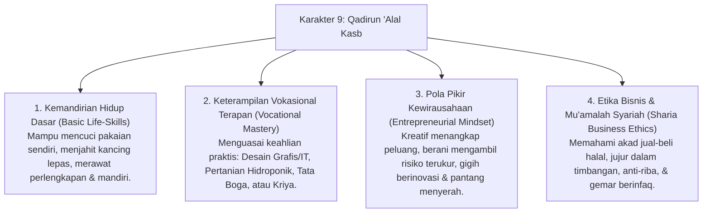

# P3-12-Qadirun-Alal-Kasb-Induk (Karakter 9: Kemandirian Finansial & Jiwa Kewirausahaan)

## Tujuan
Menetapkan kerangka kapasitas menyeluruh untuk **Karakter 9: Qadirun 'Alal Kasb (Kemandirian Finansial & Jiwa Kewirausahaan)** dalam ekosistem pesantren TUMBUH: membentuk santri yang berjiwa mandiri, memiliki etos kerja tinggi, pantang bergantung pada orang lain (*'Iffatun Nafs*), menguasai sekurang-kurangnya 1 keterampilan vokasi/teknologi praktis bernilai tambah, serta memahami etika bisnis syariah (*Fiqh Mu'amalah*).

---

## 1. 4 Dimensi Karakter Qadirun 'Alal Kasb

---

## 2. Matriks Rubrik 4 Level Capaian Qadirun 'Alal Kasb

| Dimensi Perilaku | Level 1: Emerging (T1) | Level 2: Developing (T2) | Level 3: Proficient (T3) | Level 4: Exemplary (T4 - Qudwah) |
| :--- | :--- | :--- | :--- | :--- |
| **Kemandirian Hidup (Life-Skills)** | Menunggu bantuan orang tua/teman untuk mencuci pakaian & membersihkan barang. | Mampu mencuci baju sendiri, namun sesekali masih malas/menumpuk cucian. | Terampil & mandiri mengurus seluruh kebutuhan harian pribadi tanpa bantuan. | Membimbing santri baru menguasai teknik mencuci, menjahit, & merawat barang asrama. |
| **Keterampilan Vokasi Terapan** | Belum memiliki minat/keahlian keterampilan praktis tertentu. | Mengikuti kelas ekstrakurikuler vokasi (IT/Pertanian/Kriya) secara aktif. | Menghasilkan produk/karya nyata yang memiliki nilai fungsi dan nilai estetika. | Menghasilkan produk berkualitas tinggi yang layak dipasarkan & bernilai ekonomis. |
| **Pola Pikir Bisnis & Mu'amalah** | Bergantung sepenuhnya pada kiriman uang saku orang tua tanpa inisiatif berkarya. | Memahami konsep dasar jual beli syariah & mulai belajar mengelola modal kecil. | Mampu menjalankan simulasi bisnis santri / bazar dengan pembukuan untung-rugi rapi. | Memimpin unit usaha santri mandiri & menyalurkan sebagian keuntungan untuk infaq pondok. |

---

## 3. Status Dokumen
* **Status**: 🌟 **A+ (Dokumen Induk Qadirun 'Alal Kasb)**
* **Level**: Project 3 - `03 Capacity Framework / 12 Qadirun Alal Kasb`
* **Langkah Berikutnya**: Melengkapi sub-modul 01 hingga 14.
