# P3-12: DOKUMEN INDUK KAPASITAS 12 — QADIRUN 'ALAL KASB
## *Arsitektur Kemandirian Finansial, Jiwa Kewirausahaan Syar'i, Inkubasi Bisnis Santri 24 Jam, Zero-Proposal Dependency, & Filantropi Peradaban di Ekosistem TUMBUH Pesantren*

**Nomor Identifikasi**: `P3-12/DOKUMEN-INDUK-KAPASITAS-QADIRUN-ALAL-KASB/2026`  
**Domain**: `03 Capacity Framework` > `12 Qadirun Alal Kasb` (Kapasitas Keduabelas)  
**Klasifikasi Naskah**: *Master Navigation & Architecture Document* (Dokumen Induk Peta Jalan Riset & Navigasi 14 Monograf Ilmiah)  
**Rumpun Disiplin Pengkaji**: Manajemen Kewirausahaan Islami, Fiqh Muamalah Finansial, Metodologi Inkubasi Bisnis Remaja, Literasi Finansial OECD, School-Wide PBIS Multi-Tier  

---

> ### 💡 INTISARI EKSEKUTIF (EXECUTIVE SUMMARY)
>
> * **Kedudukan Strategis Kapasitas Qadirun 'Alal Kasb:**  
>   *Qadirun 'Alal Kasb* (Kemandirian Finansial, Jiwa Kewirausahaan, & Produktivitas Ekonomi Syar'i) adalah pilar kedaulatan dakwah dan martabat seorang muslim. Islam memuliakan hamba yang mencari nafkah halal dari keringat tangannya sendiri (*Kasbul Yad*), menjaga kehormatan diri dari meminta-minta (*'Iffatun Nafs 'anis Su'al*), dan memerintahkan setiap mukmin bermental tangan di atas (*Al-Yadul 'Ulya*).
> * **Integrasi Holistik Turats & Sains Kewirausahaan Modern:**  
>   Kapasitas ini memadukan karya-karya fiqh ekonomi klasik (*Kitab Al-Kasb* Imam Muhammad bin Al-Hasan Asy-Syaibani, bab *Adabul Kasb wal Ma'isyah* dalam *Ihya' 'Ulumiddin* Imam Al-Ghazali, dan *Adab ad-Dunya wad-Din* Imam Al-Mawardi) dengan sains kewirausahaan modern (*Lean Startup Eric Ries, EntreComp Framework Uni Eropa, Authentic Problem-Based Learning Howard Barrows, dan Standar Literasi Finansial OECD*).
> * **Struktur Lengkap 14 Berkas Monograf Riset Ilmiah:**  
>   Dokumen induk ini memetakan dan menghubungkan 14 berkas monograf penelitian akademik komprehensif (~360 KB total riset) yang dirancang untuk menjadi pedoman kurikulum madrasah, tata kelola Koperasi Santri, dan pembinaan kemandirian 24 jam.

---

## 📑 PETA NAVIGASI 14 MONOGRAF RISET QADIRUN 'ALAL KASB

Berikut adalah daftar lengkap 14 monograf riset akademik dalam gugus **Kapasitas 12: Qadirun 'Alal Kasb**:

```mermaid
flowchart TD
    subgraph GugusKapasitas12["STRUKTUR 14 MONOGRAF KAPASITAS 12: QADIRUN 'ALAL KASB"]
        subgraph FONDASI["I. FONDASI TEOLOGIS & KONSEPTUAL"]
            M01["[P3-12-01] Filosofi & Landasan Turats Kasbul Yad Asy-Syaibani"]
            M02["[P3-12-02] Definisi & Konstruk 4 Dimensi Kemandirian Finansial"]
            M03["[P3-12-03] Tujuan & Standar Capaian Pembelajaran (CP-QK)"]
            M04["[P3-12-04] Empat Nilai Inti & Prinsip Al-Kasb bil-'Adl"]
        end

        subgraph PENGUKURAN["II. TAKSONOMI, PERILAKU, & ASESMEN"]
            M05["[P3-12-05] Taksonomi Kemandirian Fitrah 4 Level (SKI-SKD)"]
            M06["[P3-12-06] Manifestasi Perilaku Teramati di 5 Setting 24 Jam"]
            M07["[P3-12-07] Rubrik Analitik Kinerja Kemandirian Finansial 4-Level"]
            M08["[P3-12-08] Trajektori Perkembangan Jenjang J1–J4 (Usia 12–18)"]
            M09["[P3-12-09] Pemetaan Asesmen & Triangulasi Data 360 Derajat"]
        end

        subgraph PRAKSIS["III. INTERVENSI, DIDAKTIK, & INSTRUMEN"]
            M10["[P3-12-10] Protokol Intervensi PBIS Multi-Tier & Restorasi Finansial"]
            M11["[P3-12-11] Program Pembinaan & Silabus Halaqah 24 Pekan"]
            M12["[P3-12-12] Empat Model Pedagogi & Didaktik Problem-Based Learning"]
            M13["[P3-12-13] Paket Master Instrumen Lapangan (LOK/LKS/FAP/SPE)"]
            M14["[P3-12-14] Sintesis Meta-Teoretis & Validasi Multidisipliner"]
        end

        FONDASI ==> PENGUKURAN ==> PRAKSIS
    end
```

---

## 📚 DESKRIPSI RINGKAS 14 BERKAS MONOGRAF

1. **[P3-12-01: Filosofi dan Landasan Turats](file:///c:/xampp/htdocs/tumbuh/03%20Capacity%20Framework/12%20Qadirun%20Alal%20Kasb/P3-12-01-Filosofi-dan-Landasan-Turats.md)**  
   *Membahas ontologi kemandirian finansial dalam Islam, doktrin Kasbul Yad & 'Iffatun Nafs, Kitab Al-Kasb Asy-Syaibani, Entrepreneurial Mindset, dan eliminasi fatalisme ekonomi berkedok tawakkul semu.*
2. **[P3-12-02: Definisi dan Konseptualisasi](file:///c:/xampp/htdocs/tumbuh/03%20Capacity%20Framework/12%20Qadirun%20Alal%20Kasb/P3-12-02-Definisi-dan-Konseptualisasi.md)**  
   *Membahas batas definisional Qadirun 'Alal Kasb, 4 dimensi operasional (Kewirausahaan Kreatif, Literasi Finansial, Etika Bisnis Syar'i, Filantropi Produktif), dialektika kemandirian berkah vs kapitalisme sekuler/zuhud pasif.*
3. **[P3-12-03: Tujuan dan Target Capaian](file:///c:/xampp/htdocs/tumbuh/03%20Capacity%20Framework/12%20Qadirun%20Alal%20Kasb/P3-12-03-Tujuan-dan-Target-Capaian.md)**  
   *Membahas Capaian Pembelajaran Qadirun 'Alal Kasb (CP-QK), dekomposisi target Tri-Domain, indikator kuantitatif 100% kepemilikan portofolio usaha riil, dan 0% proposal donasi sosial.*
4. **[P3-12-04: Nilai Inti dan Prinsip Kemandirian](file:///c:/xampp/htdocs/tumbuh/03%20Capacity%20Framework/12%20Qadirun%20Alal%20Kasb/P3-12-04-Nilai-Inti-dan-Prinsip-Kemandirian.md)**  
   *Membahas aksiologi empat nilai inti (Al-'Iffah, Ash-Shidq, Al-Itqan, Al-Ihsan), prinsip Al-Kasb bil-'Adl wal-Barakah, dan keteladanan saudagar salaf (Abu Hanifah & Abdurrahman bin Auf).*
5. **[P3-12-05: Standar Kompetensi dan Taksonomi](file:///c:/xampp/htdocs/tumbuh/03%20Capacity%20Framework/12%20Qadirun%20Alal%20Kasb/P3-12-05-Standar-Kompetensi-dan-Taksonomi.md)**  
   *Membahas Taksonomi Kemandirian Fitrah 4 Level (Al-Iktisab, Al-Injaz, At-Tijarah, Ar-Riyadah), integrasi EntreComp Framework, serta matriks SKI-SKD jenjang J1–J4.*
6. **[P3-12-06: Manifestasi Perilaku Santri](file:///c:/xampp/htdocs/tumbuh/03%20Capacity%20Framework/12%20Qadirun%20Alal%20Kasb/P3-12-06-Manifestasi-Perilaku-Santri.md)**  
   *Membahas katalog indikator perilaku teramati di 5 setting 24 jam (koperasi, maker lab, ruang kelas madrasah, asrama/kamar, dan pasar/bazar), deteksi dini riba kamar, tadlis, dan israf.*
7. **[P3-12-07: Rubrik Indikator Perilaku 4-Level](file:///c:/xampp/htdocs/tumbuh/03%20Capacity%20Framework/12%20Qadirun%20Alal%20Kasb/P3-12-07-Rubrik-Indikator-Perilaku-4-Level.md)**  
   *Membahas rubrik analitik kinerja berbasis kriteria faktual, kalibrasi penilai (Cohen's Kappa $\ge 0.88$), formula skor komposit IK-QK, dan asesmen pertumbuhan ipsatif.*
8. **[P3-12-08: Tahapan Perkembangan Jenjang J1–J4](file:///c:/xampp/htdocs/tumbuh/03%20Capacity%20Framework/12%20Qadirun%20Alal%20Kasb/P3-12-08-Tahapan-Perkembangan-Jenjang-J1-J4.md)**  
   *Membahas trajektori kematangan finansial usia 12–18 tahun, Fiqh Rusyd QS. An-Nisa: 6, Super's Vocational Stages, dan asesmen kelayakan transisi Venture Readiness Check.*
9. **[P3-12-09: Pemetaan Asesmen dan Triangulasi](file:///c:/xampp/htdocs/tumbuh/03%20Capacity%20Framework/12%20Qadirun%20Alal%20Kasb/P3-12-09-Pemetaan-Asesmen-dan-Triangulasi.md)**  
   *Membahas sistem triangulasi 360 derajat (pembina bisnis, guru fiqh, berkas portofolio, santri mandiri, konsumen), matriks MTMM, dan Early Warning System (EWS) krisis finansial.*
10. **[P3-12-10: Protokol Intervensi dan Pembiasaan](file:///c:/xampp/htdocs/tumbuh/03%20Capacity%20Framework/12%20Qadirun%20Alal%20Kasb/P3-12-10-Protokol-Intervensi-dan-Pembiasaan.md)**  
    *Membahas arsitektur intervensi PBIS Multi-Tier (Universal Tier 1, Targeted Tier 2, Intensive Tier 3), SOP konsekuensi logis edukatif 4R kasus muamalah, dan eliminasi hukuman fisik.*
11. **[P3-12-11: Program Pembinaan dan Halaqah](file:///c:/xampp/htdocs/tumbuh/03%20Capacity%20Framework/12%20Qadirun%20Alal%20Kasb/P3-12-11-Program-Pembinaan-dan-Halaqah.md)**  
    *Membahas silabus tematik 24 pekan halaqah kewirausahaan, workshop bisnis aplikatif 60 menit, program mentorship kakak asuh J4–J1, dan budaya Market Day Bintang Lima.*
12. **[P3-12-12: Metode Pedagogi dan Didaktik Kemandirian](file:///c:/xampp/htdocs/tumbuh/03%20Capacity%20Framework/12%20Qadirun%20Alal%20Kasb/P3-12-12-Metode-Pedagogi-dan-Didaktik-Kemandirian.md)**  
    *Membahas empat model didaktik (Living Entrepreneurial Exemplary, Socratic Business Dilemma, Venture Incubator Lab, Micro-Habits), dan sintaks Problem-Based Learning 45 menit.*
13. **[P3-12-13: Instrumen dan Lembar Mutaba'ah](file:///c:/xampp/htdocs/tumbuh/03%20Capacity%20Framework/12%20Qadirun%20Alal%20Kasb/P3-12-13-Instrumen-dan-Lembar-Mutabaah.md)**  
    *Membahas kodifikasi empat paket instrumen siap pakai (Form LOK-QK, LKS-QK, FAP-QK, SPE-QK) dan integrasi sistem basis data digital Intizham-TUMBUH.*
14. **[P3-12-14: Sintesis dan Validasi Qadirun 'Alal Kasb](file:///c:/xampp/htdocs/tumbuh/03%20Capacity%20Framework/12%20Qadirun%20Alal%20Kasb/P3-12-14-Sintesis-dan-Validasi-Qadirun-Alal-Kasb.md)**  
    *Membahas meta-analisis menyeluruh, hasil validasi 12 dewan pakar multidisipliner (Aiken's V = 0.971), matriks mitigasi risiko operasional, dan roadmap 5 tahun.*

---

## 🎯 STANDAR PENJAMINAN MUTU DAN KELULUSAN SANTRI

Pencapaian kapasitas **Qadirun 'Alal Kasb** menjadi prasyarat mutlak kelulusan santri di seluruh pesantren jejaring TUMBUH. Santri yang lulus dinyatakan memiliki:
1. **Kemandirian Finansial & Mentalitas Tangan di Atas (*Al-Yadul 'Ulya Mindset*)**: Mampu mengelola keuangan pribadi secara bijak, mandiri mencari nafkah halal, dan terbebas dari mentalitas meminta donasi proposal.
2. **Kecakapan Eksekusi Kewirausahaan Syar'i (*Ethical Venture Competency*)**: Mampu merancang produk bernilai tambah, menghitung HPP/BEP akurat, mempraktikkan Fiqh Buyu' jujur tanpa tadlis, dan menyalurkan infaq laba.
3. **Kesiapan Rencana Bisnis Masa Depan (*Comprehensive Business Plan*)**: Memiliki draf rencana usaha halal teruji yang siap dieksekusi pasca-kelulusan demi kemakmuran dakwah dan peradaban umat Islam.
