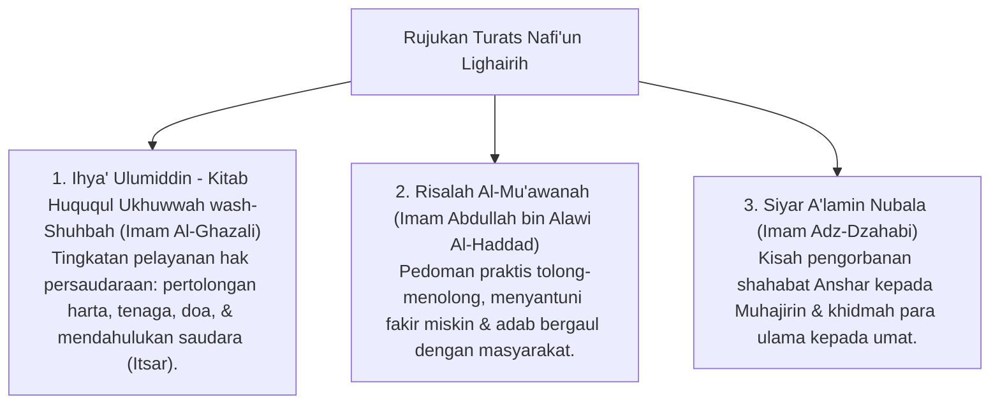

# P3-13-01-Filosofi-dan-Landasan-Turats (Nafi'un Lighairih)

## Tujuan
Membedah landasan teologis hakikat manusia terbaik adalah yang paling bermanfaat bagi sesama (*Khairunnas Anfauhumnlinnas*), konsep *Khidmah*, pengorbanan (*Itsar*), dan rujukan kitab Turats klasik.

---

## 1. Landasan Nash Al-Qur'an & As-Sunnah

### 1. QS. Al-Ma'idah [5]: 2
> وَتَعَاوَنُوا عَلَى الْبِرِّ وَالتَّقْوَىٰ ۖ وَلَا تَعَاوَنُوا عَلَى الْإِثْمِ وَالْعُدْوَانِ
> *"Dan tolong-menolonglah kamu dalam (mengerjakan) kebajikan dan takwa, dan jangan tolong-menolong dalam berbuat dosa dan permusuhan."*

### 2. HR. Ath-Thabrani (Al-Mu'jam Al-Ausath No. 5787 - Hadits Hasan)
> خَيْرُ النَّاسِ أَنْفَعُهُمْ لِلنَّاسِ
> *"Sebaik-baik manusia adalah yang paling bermanfaat bagi manusia lainnya."*

---

## 2. Rujukan Khazanah Turats Klasik

---

## 3. Status Dokumen
* **Status**: 🌟 **A+ (Tervalidasi & Siap Diimplementasikan)**
* **Level**: Project 3 - `03 Capacity Framework / 13 Nafi'un Lighairih / 01 Philosophy`
