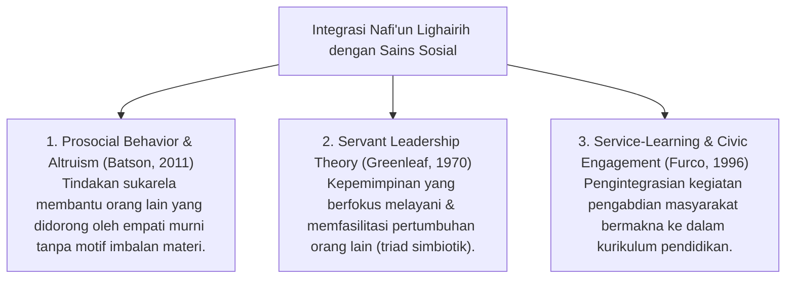

# P3-13-02-Definisi-dan-Konseptualisasi (Nafi'un Lighairih)

## Tujuan
Menetapkan definisi operasional, batasan istilah, dan integrasi sains modern (*Prosocial Behavior, Servant Leadership, & Community Engagement - CASEL SEL*) dari karakter **Nafi'un Lighairih**.

---

## 1. Definisi Operasional Baku

> **Nafi'un Lighairih dalam Ekosistem TUMBUH adalah:**  
> *"Puncak kapasitas karakter dan kepemimpinan pelayanan (*Servant Leadership*) santri yang diwujudkan dalam kesediaan tulus mendedikasikan ilmu, waktu, tenaga, dan hartanya demi kemaslahatan sesama santri, kemakmuran pesantren, serta pemberdayaan masyarakat luas (*Khidmah Ummah*) tanpa pamrih duniawi."*

---

## 2. Integrasi Konsep Sains & CASEL SEL

---

## 3. Status Dokumen
* **Status**: 🌟 **A+ (Tervalidasi & Siap Diimplementasikan)**
* **Level**: Project 3 - `03 Capacity Framework / 13 Nafi'un Lighairih / 02 Definition`
