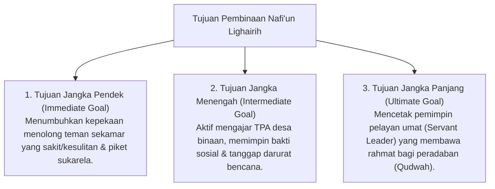

# P3-13-03-Tujuan-dan-Target-Capaian (Nafi'un Lighairih)

## Tujuan
Menetapkan tujuan jangka pendek, menengah, dan panjang pembinaan karakter **Nafi'un Lighairih** pada santri di lingkungan pesantren TUMBUH.

---

## 1. 3 Tingkatan Tujuan Pembinaan Khidmah

---

## 2. Target Capaian Kuantitatif & Kualitatif

1. **Target Kuantitatif**:
   - 100% santri menuntaskan minimal **40 jam kegiatan pengabdian masyarakat (Community Service)** per tahun.
   - Santri mengajar di TPA desa binaan sekurang-kurangnya 1 semester.
2. **Target Kualitatif**:
   - Santri memiliki kepekaan batin yang lembut, tanggap terhadap derita sesama, dan selalu berpikir *"Apa yang bisa saya berikan untuk orang lain?"*.

---

## 3. Status Dokumen
* **Status**: 🌟 **A+ (Tervalidasi & Siap Diimplementasikan)**
* **Level**: Project 3 - `03 Capacity Framework / 13 Nafi'un Lighairih / 03 Purpose`
