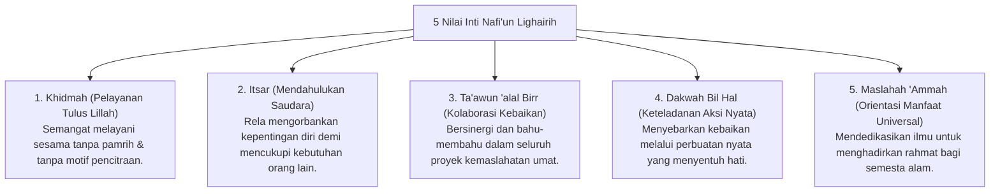

# P3-13-04-Nilai-Inti-dan-Prinsip-Kemanfaatan (Nafi'un Lighairih)

## Tujuan
Merumuskan nilai-nilai inti (*Core Values*) dan prinsip syariat yang menjiwai karakter **Nafi'un Lighairih** dalam kehidupan santri.

---

## 1. 5 Nilai Inti Nafi'un Lighairih

---

## 2. Status Dokumen
* **Status**: 🌟 **A+ (Tervalidasi & Siap Diimplementasikan)**
* **Level**: Project 3 - `03 Capacity Framework / 13 Nafi'un Lighairih / 04 Core Values`
