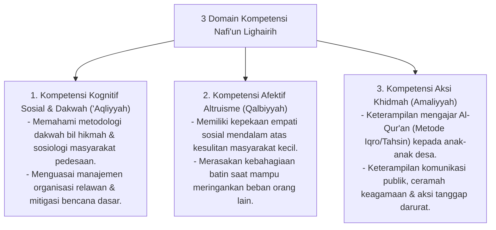

# P3-13-05-Standar-Kompetensi-dan-Taksonomi (Nafi'un Lighairih)

## Tujuan
Menetapkan **Standar Capaian Pembelajaran & Taksonomi Kompetensi** karakter Nafi'un Lighairih untuk seluruh jenjang santri di pesantren TUMBUH.

---

## 1. 3 Domain Kompetensi Nafi'un Lighairih

---

## 2. Matriks Capaian Berjenjang Sesuai Tangga TUMBUH

* **Jenjang T1 (Kelas 7 / 10 Baru)**: Membantu rekan sekamar yang sakit, membersihkan fasilitas bersama, berbagi makanan ringan (*Internal Khidmah*).
* **Jenjang T2 (Kelas 8 / 11)**: Terlibat aktif dalam program kerja bakti desa sekitar pesantren, menjadi relawan kebersihan masjid agung.
* **Jenjang T3 (Kelas 9 / 12)**: Mampu menjadi pengajar TPA desa binaan sepekan 2x, mengorganisir bakti sosial santri per semester.
* **Jenjang T4 (Santri Akhir / Teladan)**: Memimpin ekspedisi Safari Dakwah & Pengabdian Masyarakat (KKN Santri), menjadi penggerak kebaikan umat (*Qudwah Khidmah*).

---

## 3. Status Dokumen
* **Status**: 🌟 **A+ (Tervalidasi & Siap Diimplementasikan)**
* **Level**: Project 3 - `03 Capacity Framework / 13 Nafi'un Lighairih / 05 Competencies`
