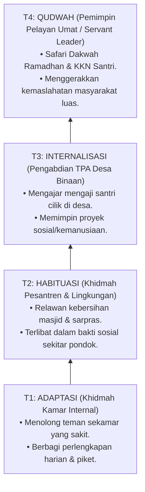

# P3-13-08-Tahapan-Perkembangan-Tangga-T1-T4 (Nafi'un Lighairih)

## Tujuan
Memetakan tahapan perkembangan karakter **Nafi'un Lighairih** melintasi jenjang **Tangga TUMBUH (T1, T2, T3, T4)**.

---

## 1. Roadmap Perkembangan Jiwa Khidmah Santri

---

## 2. Status Dokumen
* **Status**: 🌟 **A+ (Tervalidasi & Siap Diimplementasikan)**
* **Level**: Project 3 - `03 Capacity Framework / 13 Nafi'un Lighairih / 08 Development Levels`
