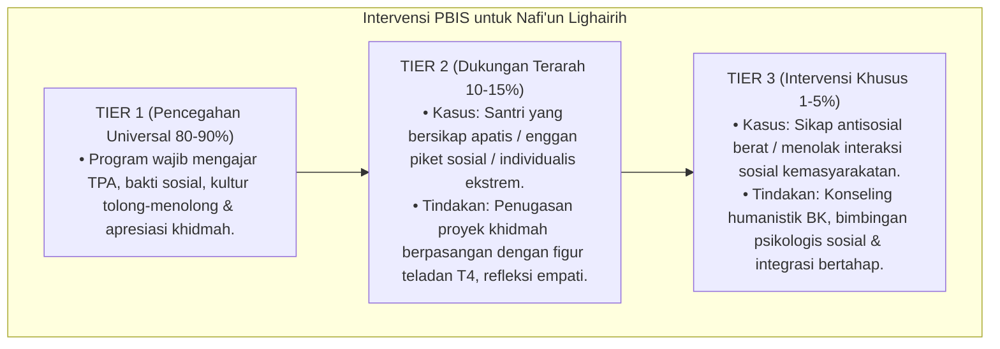

# P3-13-10-Protokol-Intervensi-dan-Pembiasaan (Nafi'un Lighairih)

## Tujuan
Menetapkan protokol pembiasaan khidmah sosial (*Service Habituation SOP*) dan pemetaan intervensi bertingkat (*PBIS Multi-Tier Intervention*) untuk menumbuhkan altruisme dan menghapus sikap apatis santri.

---

## 1. Protokol Pembiasaan Rutin Asrama (Tier 1: Universal 100%)

1. **Jumat Berbagi & Infaq Subuh Sukarela**:
   - Santri mengumpulkan infaq beras/makanan ringan untuk dibagikan kepada kaum dhuafa sekitar.
2. **Piket Khidmah Sahabat Sakit**:
   - Setiap kamar memiliki giliran mengantar makanan dan menemani rekan yang dirawat di poskestren.
3. **Pemberian Apresiasi Pelayan Santri (*Servant of The Month*)**:
   - Penghargaan bulanan untuk santri yang paling suka membantu tanpa pamrih.

---

## 2. Pemetaan Intervensi Khusus PBIS

---

## 3. Status Dokumen
* **Status**: 🌟 **A+ (Tervalidasi & Siap Diimplementasikan)**
* **Level**: Project 3 - `03 Capacity Framework / 13 Nafi'un Lighairih / 10 Intervention Mapping`
