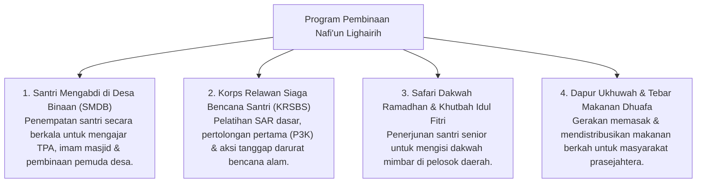

# P3-13-11-Program-Pembinaan-dan-Halaqah (Nafi'un Lighairih)

## Tujuan
Menetapkan daftar program pembinaan terstruktur, aksi sosial keumatan, dan program pengabdian masyarakat santri di pesantren TUMBUH.

---

## 1. 4 Program Unggulan Pembinaan Khidmah

---

## 2. Status Dokumen
* **Status**: 🌟 **A+ (Tervalidasi & Siap Diimplementasikan)**
* **Level**: Project 3 - `03 Capacity Framework / 13 Nafi'un Lighairih / 11 Programs`
