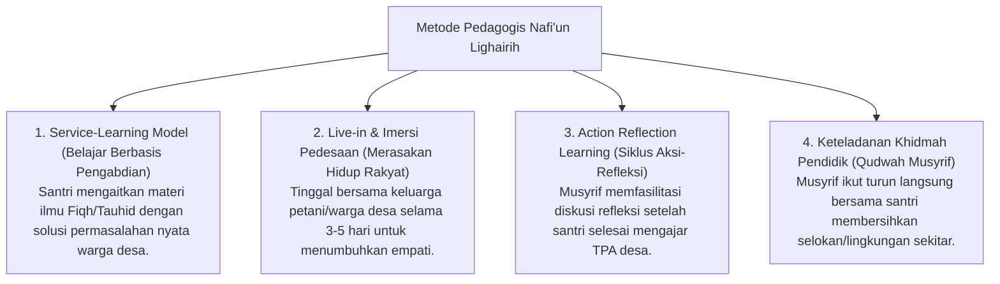

# P3-13-12-Metode-Pedagogi-dan-Didaktik-Kemanfaatan (Nafi'un Lighairih)

## Tujuan
Menetapkan metode pedagogis dan pendekatan didaktik dalam melatihkan jiwa kepemimpinan pelayan (*Servant Leadership*), kepedulian sosial, dan kecakapan dakwah lapangan bagi santri.

---

## 1. 4 Metode Pedagogi Pengajaran Khidmah

---

## 2. Status Dokumen
* **Status**: 🌟 **A+ (Tervalidasi & Siap Diimplementasikan)**
* **Level**: Project 3 - `03 Capacity Framework / 13 Nafi'un Lighairih / 12 Methods`
