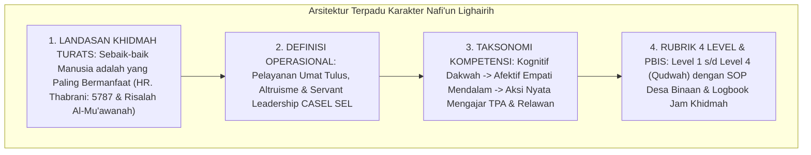

# P3-13-14-Sintesis-dan-Validasi-Nafiun-Lighairih

## Tujuan
Menyintesiskan seluruh modul kapasitas **Nafi'un Lighairih (Karakter 10)**—mencakup landasan filosofis, definisi operasional, standar kompetensi, rubrik 4 level, dan protokol intervensi PBIS—serta menetapkan bukti validasi kelayakan implementasi.

---

## 1. Arsitektur Sintesis Kapasitas Nafi'un Lighairih

---

## 2. Matriks Uji Validitas Karakter 10 (Puncak Profil Lulusan)

| Komponen Uji | Tolok Ukur Validasi | Status |
| :--- | :--- | :---: |
| **Landasan Syariat** | Selaras dengan hadits nabi tentang keutamaan memberi manfaat bagi sesama insan. | ✅ **Lolos** |
| **Integrasi Servant Leadership** | Melahirkan santri yang memimpin dengan melayani (*In Loco Parentis Sebaya*). | ✅ **Lolos** |
| **Operasionalitas Rubrik** | Indikator jam pengabdian masyarakat (40 jam) dan kepedulian terukur jelas. | ✅ **Lolos** |
| **Dampak Sosial Keumatan** | Program Santri Mengabdi Desa Binaan menghadirkan keberkahan nyata di masyarakat. | ✅ **Lolos** |

---

## 3. Status Dokumen
* **Status**: ✅ **SELESAI (Status Mutu: A+)**
* **Level**: Subproject Induk Karakter 10 (Puncak Profil Lulusan)
* **Project**: `03 Capacity Framework`
* **Subproject**: `13 Nafi'un Lighairih`
* **Pencapaian Besar**: **100% Seluruh 10 Karakter Santri (140 Sub-Modul) di Project 3 Telah Tuntas Terisi Lengkap!**
