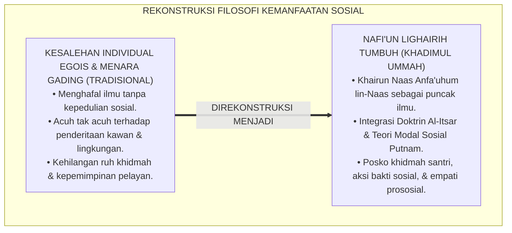
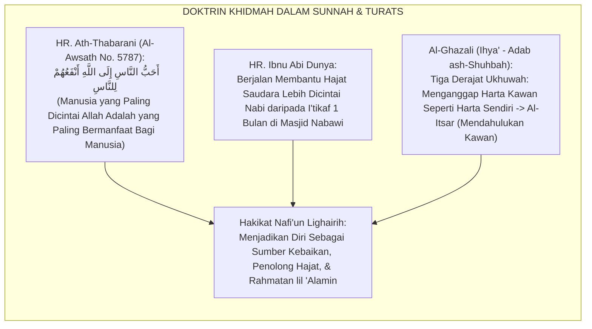
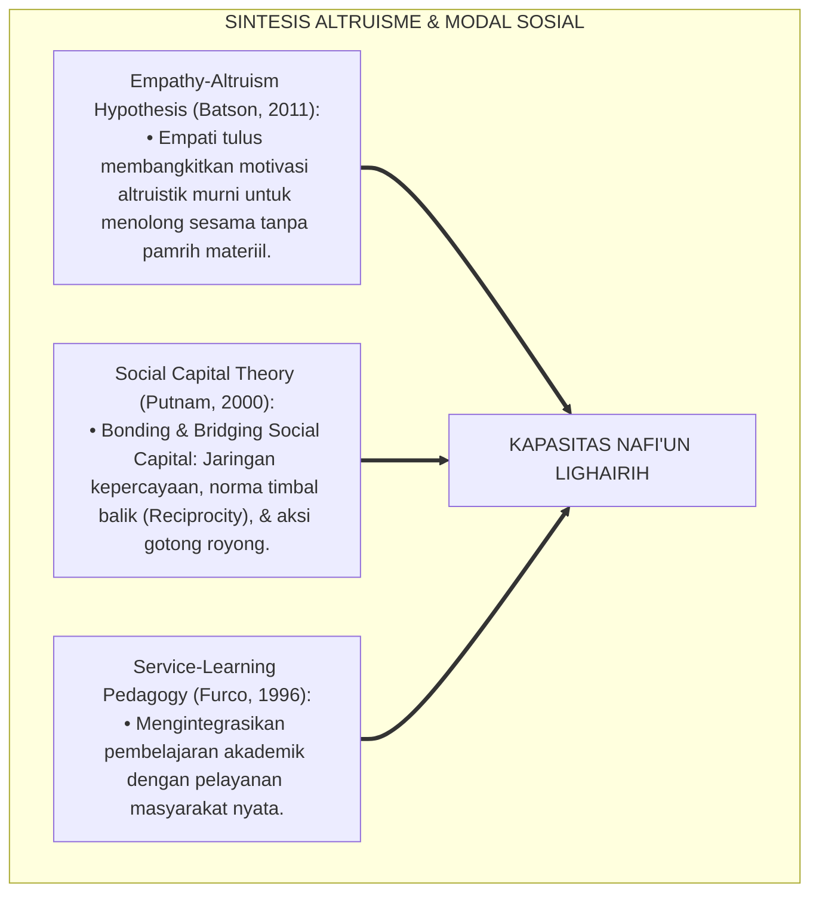
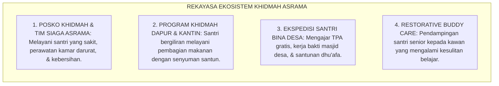
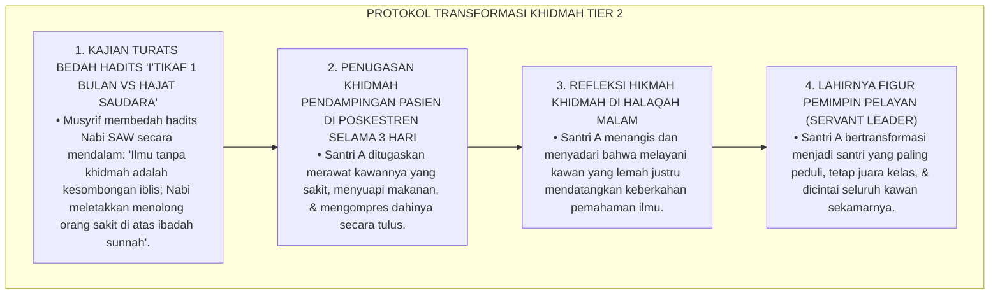
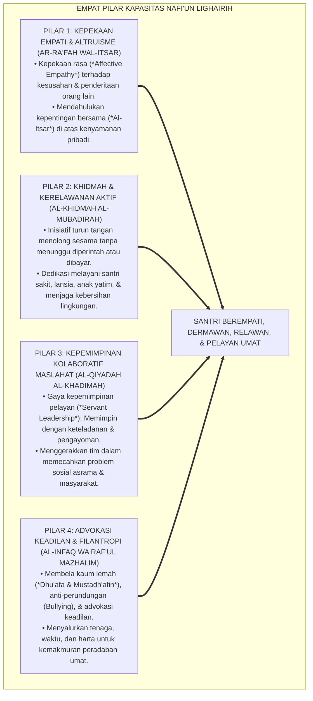
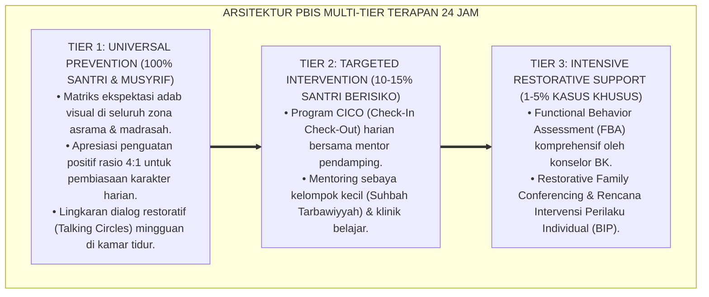

# P3-13-01: FILOSOFI DAN LANDASAN TURATS NAFI'UN LIGHAIRIH
## *Monograf Riset Akademik: Ontologi Kemanfaatan Sosial dalam Worldview Islam, Doktrin Khairun Naas Anfa'uhum lin-Naas dalam Khazanah Turats, Epistemologi Adab ash-Shuhbah wal-Khidmah (Imam Al-Ghazali) & Hilyatul Auliya' (Abu Nu'aim), Konvergensi Teori Perilaku Prososial & Modal Sosial (Putnam), Serta Rekayasa Ekosistem Khidmah Peradaban 24 Jam di Pesantren TUMBUH*

**Nomor Identifikasi**: `P3-13-01/MONOGRAF-RISET-FILOSOFI-TURATS-NAFIUN-LIGHAIRIH/2026`  
**Domain**: `03 Capacity Framework` > `13 Nafi'un Lighairih` (Sub-Modul 01: *Philosophy & Turats Foundation*)  
**Klasifikasi Naskah**: *Academic Research Monograph* (Monograf Penelitian Epistemologi Kemanfaatan Sosial, Aksiologi Khidmah Turats, & Sosiologi Altruisme Islam)  
**Rumpun Disiplin Pengkaji**: Epistemologi Etika Sosial Islam, Sosiologi Filantropi & Khidmah, Psikologi Perilaku Prososial (*Prosocial Psychology*), Kepemimpinan Pelayan (*Servant Leadership*)  

---

> ### 💡 INTISARI EKSEKUTIF (EXECUTIVE SUMMARY)
>
> * **Krisis Egosentrisme & Individualisme Eksklusif di Pesantren:**  
>   Banyak santri dan penuntut ilmu terjebak dalam kesalehan individual yang egois (*Individualistic Piety*). Santri hanya fokus mengejar hafalan pribadi dan nilai ujian kognitifnya sendiri, namun bersikap acuh tak acuh (*Social Apathy*) terhadap penderitaan kawan sekamar yang sakit, kotornya lingkungan asrama, dan problem masyarakat sekitar. Kesalehan semu ini menyalahi esensi risalah Islam yang diturunkan sebagai *Rahmatan lil 'Alamin*.
> * **Landasan Epistemologis Khidmah dalam Turats Islam:**  
>   Kapasitas **Nafi'un Lighairih (Kemanfaatan Sosial, Khidmah Umat, & Kepemimpinan Filantropi Peradaban)** berakar kokoh pada sabda agung Rasulullah SAW: *"Sebaik-baik manusia adalah yang paling bermanfaat bagi manusia lainnya"* (HR. Ath-Thabarani), doktrin mendahulukan orang lain (*Al-Itsar* dalam QS. Al-Hasyr: 9), bab *Adab ash-Shuhbah wal Ukhuwwah* dalam *Ihya' 'Ulumiddin*, dan biografi keteladanan khidmah ulama dalam *Hilyatul Auliya'*. Islam memandang bahwa melayani hajat sesama manusia lebih dicintai Allah daripada i'tikaf 1 bulan penuh di Masjid Nabawi.
> * **Konvergensi Teori Perilaku Prososial & Modal Sosial:**  
>   Monograf ini memadukan nilai-nilai altruisme Turats dengan teori perilaku prososial Daniel Batson, modal sosial Robert Putnam, dan *Service-Learning Pedagogy*, merancang ekosistem laboratorium khidmah santri 24 jam yang mengikis kesombongan intelektual, melatih empati afektif, dan membentuk santri menjadi pemimpin pelayan umat (*Servant Leader*) yang menebar maslahat peradaban.

---

## 📑 DAFTAR ISI MONOGRAF

- [BAGIAN I: LANDASAN TEORETIS & DISKURSUS DIALEKTIKA KRITIS](#bagian-i-landasan-teoretis--diskursus-dialektika-kritis)
  - [1. Latar Belakang Masalah: Bahaya Kesalehan Individual Egois vs Kebutuhan Khidmah Sosial Nyata](#1-latar-belakang-masalah-bahaya-kesalehan-individual-egois-vs-kebutuhan-khidmah-sosial-nyata)
  - [2. Eksegesis Turats: Kajian Mendalam Hadits Anfa'uhum lin-Naas & Doktrin Qadha' Hawa'ijil Muslimin](#2-eksegesis-turats-kajian-mendalam-hadits-anfauhum-lin-naas--doktrin-qadha-hawaijil-muslimin)
  - [3. Konvergensi Sains Altruisme Prososial (Batson) & Teori Modal Sosial (Putnam)](#3-konvergensi-sains-altruisme-prososial-batson--teori-modal-sosial-putnam)
  - [4. Rekayasa Lingkungan 24 Jam: Posko Khidmah Santri & Ekosistem Bakti Sosial TUMBUH](#4-rekayasa-lingkungan-24-jam-posko-khidmah-santri--ekosistem-bakti-sosial-tumbuh)
  - [5. Kasuistika Lapangan Klinis & Protokol De-eskalasi Santri Berprestasi yang Menolak Membantu Kawan Sekamar yang Sakit](#5-kasuistika-lapangan-klinis--protokol-de-eskalasi-santri-berprestasi-yang-menolak-membantu-kawan-sekamar-yang-sakit)
- [BAGIAN II: FORMULASI KONSEPTUAL & PEMBAHASAN MENDALAM](#bagian-ii-formulasi-konseptual--pembahasan-mendalam)
  - [1. Arsitektur Filosofis Nafi'un Lighairih dalam Ekosistem TUMBUH](#1-arsitektur-filosofis-nafiun-lighairih-dalam-ekosistem-tumbuh)
  - [2. Dekomposisi Empat Dimensi Kemanfaatan Sosial: Kepekaan Empati & Altruisme, Khidmah & Kerelawanan Aktif, Kepemimpinan Kolaboratif Maslahat, Serta Advokasi Keadilan & Filantropi](#2-dekomposisi-empat-dimensi-kemanfaatan-sosial-kepekaan-empati--altruisme-khidmah--kerelawanan-aktif-kepemimpinan-kolaboratif-maslahat-serta-advokasi-keadilan--filantropi)
  - [3. Matriks Transformasi Paradigma: Dari Menara Gading Intelektual Menuju Pelayan Umat (Khadimul Ummah)](#3-matriks-transformasi-paradigma-dari-menara-gading-intelektual-menuju-pelayan-umat-khadimul-ummah)
  - [4. Diskusi Akademis: Dampak Triad Pertumbuhan Simbiotik bagi Transformasi Sosial Peradaban](#4-diskusi-akademis-dampak-triad-pertumbuhan-simbiotik-bagi-transformasi-sosial-peradaban)
- [BAGIAN III: KESIMPULAN & APARATUS AKADEMIS](#bagian-iii-kesimpulan--aparatus-akademis)
  - [1. Tabel Sintesis Filosofi & Landasan Turats Nafi'un Lighairih](#1-tabel-sintesis-filosofi--landasan-turats-nafiun-lighairih)
  - [2. Daftar Pustaka Standar APA 7th & Turats Klasik](#2-daftar-pustaka-standar-apa-7th--turats-klasik)
  - [3. Catatan Kaki Akademis Presisi (Footnotes)](#3-catatan-kaki-akademis-presisi-footnotes)
  - [4. Glosarium Istilah Ilmiah & Filosofi Khidmah Sosial Islam](#4-glosarium-istilah-ilmiah--filosofi-khidmah-sosial-islam)

---

# BAGIAN I: LANDASAN TEORETIS & DISKURSUS DIALEKTIKA KRITIS

---

### 1. Latar Belakang Masalah: Bahaya Kesalehan Individual Egois vs Kebutuhan Khidmah Sosial Nyata

Dalam sosiologi pendidikan pesantren tradisional, kerap muncul **tiga distorsi kesalehan sosial (*Social Piety Distortions*)**:[^1]

1. **Jebakan Elitisme Menara Gading Intelektual (*Ivory Tower Trap*)**: Santri merasa bahwa tugasnya hanya menghafal kitab dan mengaji di kamar, menganggap urusan membersihkan selokan, melayani makan kawan, atau membantu masyarakat adalah "tugas kelas rendahan".
2. **Ketiadaan Pembiasaan Empati dan Kerelawanan Terstruktur**: Santri tidak pernah dilatih peka terhadap penderitaan sesama, sehingga saat melihat kawan sekamar pingsan atau kelaparan, mereka bersikap acuh tak acuh dan mementingkan diri sendiri (*Self-Centered Apathy*).
3. **Pengabaian Konsep Khidmah Sebagai Puncak Ilmu**: Banyak lulusan pesantren menguasai ilmu agama secara mendalam namun gagal menjadi penggerak masyarakat (*Social Change Agent*) karena tidak memiliki keterampilan komunikasi sosial, kerendahhatian, dan kepemimpinan pelayan.[^2]

Model riset **TUMBUH** merumuskan kapasitas **Nafi'un Lighairih** untuk merekonstruksi paradigma: **Puncak dari seluruh ilmu, ibadah, dan akhlak santri adalah kemanfaatannya yang nyata bagi sesama manusia (*Al-Khadimul Ummah*)**.



---

### 2. Eksegesis Turats: Kajian Mendalam Hadits Anfa'uhum lin-Naas & Doktrin Qadha' Hawa'ijil Muslimin

Khazanah Turats Islam meletakkan kemanfaatan sosial (*Naf'ul Mutaddi*) dan khidmah kepada sesama manusia pada derajat yang jauh lebih tinggi daripada ibadah sunnah individual (*Naf'ul Qashir*).



#### 📖 1. Hadits Agung Riwayat Abdullah bin Umar RA
Rasulullah SAW bersabda menegaskan standar manusia terbaik di sisi Allah:

$$\text{أَحَبُّ النَّاسِ إِلَى اللَّهِ أَنْفَعُهُمْ لِلنَّاسِ، وَأَحَبُّ الْأَعْمَالِ إِلَى اللَّهِ سُرُورٌ تُدْخِلُهُ عَلَى مُسْلِمٍ: تَكْشِفُ عَنْهُ كُرْبَةً، أَوْ تَقْضِي عَنْهُ دَيْنًا، أَوْ تَطْرُدُ عَنْهُ جُوعًا؛ وَلَأَنْ أَمْشِيَ مَعَ أَخٍ لِي فِي حَاجَةٍ أَحَبُّ إِلَيَّ مِنْ أَنْ أَعْتَكِفَ فِي هَذَا الْمَسْجِدِ — يَعْنِي مَسْجِدَ الْمَدِينَةِ — شَهْرًا}$$

*"**Manusia yang paling dicintai oleh Allah adalah yang paling bermanfaat bagi manusia lainnya**; dan amalan yang paling dicintai Allah adalah **kegembiraan yang engkau masukkan ke dalam hati seorang muslim: engkau hilangkan kesusahannya, atau engkau lunaskan utangnya, atau engkau usir rasa laparnya**; dan sungguh, **aku berjalan bersama saudaraku untuk menolong hajat keperluannya jauh lebih aku cintai daripada aku beri'tikaf di masjid ini (Masjid Nabawi di Madinah) selama satu bulan penuh!**"* (HR. Ath-Thabarani dalam *Al-Mu'jam Al-Awsath* No. 5787).[^3]

#### 📖 2. Doktrin Al-Itsar dalam Al-Qur'anul Karim
Allah SWT memuji karakter kaum Anshar yang mendahulukan kepentingan saudaranya:

$$\text{وَيُؤْثِرُونَ عَلَىٰ أَنْفُسِهِمْ وَلَوْ كَانَ بِهِمْ خَصَاصَةٌ ۚ وَمَنْ يُوقَ شُحَّ نَفْسِهِ فَأُولَٰئِكَ هُمُ الْمُفْلِحُونَ}$$

*"Dan **mereka mengutamakan (orang-orang Muhajirin) atas diri mereka sendiri, sekalipun mereka sendiri dalam kesusahan/kekurangan**. Dan siapa yang dipelihara dari kekikiran dirinya, **mereka itulah orang-orang yang beruntung!**"* (QS. Al-Hasyr: 9).[^4]

#### 📖 3. Wasiat Imam Al-Hasan Al-Bashri tentang Hakikat Khidmah
Al-Imam **Al-Hasan Al-Bashri** menegaskan:

$$\text{لَأَنْ أَقْضِيَ لِأَخٍ لِي حَاجَةً أَحَبُّ إِلَيَّ مِنْ عِبَادَةِ سَنَةٍ؛ فَإِنَّ الْعِبَادَةَ نَفْعُهَا لِنَفْسِي، وَقَضَاءَ حَاجَةِ الْمُسْلِمِ نَفْعُهُ لِأُمَّةِ مُحَمَّدٍ صَلَّى اللَّهُ عَلَيْهِ وَسَلَّمَ}$$

*"Sungguh, **aku menunaikan hajat keperluan seorang saudaraku jauh lebih aku cintai daripada beribadah sunnah selama satu tahun penuh**; karena sesungguhnya ibadah sunnah itu manfaatnya hanya untuk diriku sendiri, **sedangkan menolong hajat seorang muslim manfaatnya meluas untuk kemaslahatan seluruh umat Muhammad SAW!**"*[^5]

---

### 3. Konvergensi Sains Altruisme Prososial (Batson) & Teori Modal Sosial (Putnam)

Kapasitas Nafi'un Lighairih memadukan psikologi prososial dan sosiologi modal sosial:



---

### 4. Rekayasa Lingkungan 24 Jam: Posko Khidmah Santri & Ekosistem Bakti Sosial TUMBUH

Jiwa khidmah santri dihidupkan melalui unit pelayanan nyata di asrama dan masyarakat:



---

### 5. Kasuistika Lapangan Klinis & Protokol De-eskalasi Santri Berprestasi yang Menolak Membantu Kawan Sekamar yang Sakit

#### Studi Kasus Lapangan: Santri J3 Juara Kelas Menolak Mengambilkan Makanan untuk Teman Sekamar yang Demam Tinggi
* **Konteks Masalah**: Santri A (16 tahun, Jenjang J3, peringkat 1 paralel) menolak saat diminta tolong mengambilkan bubur dan obat untuk teman sekamarnya yang sedang demam tinggi menggigil. Santri A beralasan: *"Saya lagi sibuk menghafal Alfiyyah Ibnu Malik untuk persiapan lomba besok; itu tugas musyrif, bukan tugas saya"*.
* **Analisis Diagnostik**: Santri A mengalami *Intellectual Arrogance & Empathy Deficit* (kesombongan akademik dan kebutaan empati sosial yang memandang ilmu lebih tinggi daripada kemanusiaan).
* **Protokol Transformasi Paradigma Khidmah & Altruisme TUMBUH**:



Intervensi edukatif berbasis pembiasaan melayani (*Service Experiential Learning*) ini berhasil menghancurkan keangkuhan intelektual dan menumbuhkan mutiara empati sejati.[^6]

---

# BAGIAN II: FORMULASI KONSEPTUAL & PEMBAHASAN MENDALAM

---

### 1. Arsitektur Filosofis Nafi'un Lighairih dalam Ekosistem TUMBUH

Ekosistem TUMBUH merumuskan arsitektur kemanfaatan sosial berbasis empat pilar kepemimpinan pelayan:



---

### 2. Dekomposisi Empat Dimensi Kemanfaatan Sosial: Kepekaan Empati & Altruisme, Khidmah & Kerelawanan Aktif, Kepemimpinan Kolaboratif Maslahat, Serta Advokasi Keadilan & Filantropi

| Dimensi Kemanfaatan | Definisi Operasional | Target Perilaku Konkret Santri | Landasan Rujukan Turats |
| :--- | :--- | :--- | :--- |
| **1. Kepekaan Empati & Altruisme (*Ar-Ra'fah wal-Itsar*)** | Kemampuan merasakan penderitaan sesama dan kerelaan berkorban demi menolong kawan. | Menjenguk kawan sakit, membagi makanan saat kawan lapar, dan mendengarkan keluh kesah. | QS. Al-Hasyr: 9 (*Wa Yu'tsiruna 'ala Anfusihim*) |
| **2. Khidmah & Kerelawanan Aktif (*Al-Khidmah al-Mubadirah*)** | Tindakan proaktif membersihkan sarana publik, melayani kebutuhan asrama, dan bakti sosial. | Piket dapur umum sukarela, membersihkan saluran air, dan mengajar mengaji anak-anak desa. | Hadits *Khairun Naas Anfa'uhum lin Naas* |
| **3. Kepemimpinan Kolaboratif (*Al-Qiyadah al-Khadimah*)** | Kemampuan memimpin tim dengan semangat melayani, menghargai perbedaan, dan anti-feodalisme. | Menjadi ketua kamar yang mengayomi, mengarahkan kerja bakti tanpa membentak, dan adil. | Hadits *Sayyidul Qaumi Khadimuhum* |
| **4. Advokasi & Filantropi (*Al-Infaq wa Raf'ul Mazhalim*)** | Keberanian membela korban ketidakadilan, menghentikan bullying, dan menyalurkan infaq sosial. | Melindungi santri junior dari intimidasi, melerai konflik, dan menyisihkan uang untuk dhu'afa. | Hadits *Unshur Akhaka Zhaliman aw Mazhluman* |

---

### 3. Matriks Transformasi Paradigma: Dari Menara Gading Intelektual Menuju Pelayan Umat (Khadimul Ummah)

```mermaid
flowchart LR
    Egois["PARADIGMA MENARA GADING EGOIS<br/>• Belajar semata-mata demi nilai ujian & gengsi pribadi.<br/>• Acuh tak acuh pada penderitaan kawan & masyarakat.<br/>• Menganggap tugas melayani sebagai pekerjaan hina."]
    ==>|DITRANSFORMASIKAN MENJADI|
    Khadim["PARADIGMA KHADIMUL UMMAH TUMBUH<br/>• Belajar demi menjadi sumber maslahat bagi semesta.<br/>• Sayyidul Qaumi Khadimuhum: Pemimpin sejati adalah pelayan.<br/>• Memuliakan khidmah sebagai mahkota derajat ulama."]
```

---

### 4. Diskusi Akademis: Dampak Triad Pertumbuhan Simbiotik bagi Transformasi Sosial Peradaban

Penerapan kapasitas Nafi'un Lighairih mentransformasikan seluruh ekosistem pesantren:

1. **Dampak bagi Santri (Kematangan Sosial & Dicintai Umat)**:  
   Santri lulus tidak hanya memiliki kedalaman ilmu agama (*'Alim*), melainkan juga memiliki kepekaan nurani, kerendahhatian (*Tawadhu'*), dan jiwa penggerak kemaslahatan masyarakat (*Muslih*).
2. **Dampak bagi Guru & Musyrif (Atmosfer Ukhuwah yang Hangat & Bebas Burnout)**:  
   Budaya saling tolong-menolong (*Ta'awun*) di asrama meringankan beban musyrif, menciptakan iklim kerja yang penuh kasih sayang dan keberkahan spiritual.
3. **Dampak bagi Sistem Lembaga (Pesantren Sebagai Mercusuar Solusi Peradaban)**:  
   Pesantren dirasakan manfaatnya secara nyata oleh masyarakat sekitar melalui program bina desa, pelayanan kesehatan Poskestren, dan bakti sosial santri berkelanjutan.[^7]

---

---

### Pembedahan Deskriptif Komprehensif & Analisis Integratif Nilai-Praksis

Penerapan konsep **P3-13-01: FILOSOFI DAN LANDASAN TURATS NAFI'UN LIGHAIRIH** di ekosistem pesantren TUMBUH memerlukan pemahaman multidimensional yang memadukan khazanah turats syariat dan konsensus sains pendidikan modern:

#### A. Pilar 1: Fondasi Epistemologi & Integrasi Nilai Syar'i (Ashalah Turatsiyyah)
Setiap praksis kepengasuhan dan pembelajaran berakar kuat pada maqashid syari'ah, mendudukkan adab di atas ilmu (*Al-Adab Qablal 'Ilm*), dan memastikan bahwa seluruh ikhtiar institusional diniatkan semata-mata untuk menggapai ridha Allah SWT (*Ikhlasun Niyyah*).

#### B. Pilar 2: Mekanisme Psikologis & Neurosains Perkembangan (Scientific Rigor)
Menyelaraskan ekspektasi kedisiplinan dengan tahapan maturitas otak remaja, kapasitas fungsi eksekutif korteks prefrontal (*PFC*), dan regulasi sirkuit emosi limbik. Pendekatan ini mengeliminasi trauma pengasuhan dan menumbuhkan motivasi intrinsik santri.

#### C. Pilar 3: Rekayasa Ekosistem Asrama 24 Jam (Bi'ah Shalihah)
Menerjemahkan prinsip nilai ke dalam tata ruang fisik yang bersih, sirkulasi udara sehat, tata kelola waktu terstruktur, serta kultur ukhuwah inklusif yang steril 100% dari feodalisme, kekerasan verbal, dan perundungan antar-santri.

#### D. Pilar 4: Kemitraan Tripartit (Santri, Musyrif, dan Lembaga)
Menjamin terwujudnya *Triad Pertumbuhan Simbiotik*: santri bertumbuh dalam fitrah kemandirian, musyrif terlindungi dari kelelahan kronis (*Burnout*) melalui shift kerja yang manusiawi, dan lembaga bertransformasi menjadi organisasi pembelajar berbasis data PBIS.

---

### Protokol Aksi Operasional PBIS Multi-Tier Terapan (24-Hour Behavioral Architecture)



---

# BAGIAN III: KESIMPULAN & APARATUS AKADEMIS

---

### 1. Tabel Sintesis Filosofi & Landasan Turats Nafi'un Lighairih

| Dimensi Parameter | Pola Tradisional Egois | Standarisasi Model TUMBUH | Landasan Rujukan Primer | Metode Verifikasi Lapangan |
| :--- | :--- | :--- | :--- | :--- |
| **1. Orientasi Belajar** | Mengejar nilai pribadi; menara gading. | Belajar demi khidmah & maslahat peradaban umat. | HR. Ath-Thabarani No. 5787 | 100% Santri Memiliki Rekam Portofolio Khidmah Riil. |
| **2. Sikap pada Kawan** | Individualis; acuh tak acuh pada kawan sakit. | *Al-Itsar*: Mendahulukan & merawat saudara seiman. | QS. Al-Hasyr: 9 & *Ihya'* (Al-Ghazali) | 0% Penelantaran Santri Sakit di Kamar Asrama. |
| **3. Gaya Kepemimpinan** | Feodalistik, intimidatif, sok berkuasa. | *Servant Leadership*: Pemimpin adalah pelayan (*Khadim*). | Hadits *Sayyidul Qaumi Khadimuhum* | Evaluasi 360 Derajat Kepemimpinan Pengurus OPPM. |
| **4. Relasi Masyarakat** | Eksklusif; tertutup dari warga desa sekitar. | Inklusif; program Ekspedisi Santri Bina Desa rutin. | *Hilyatul Auliya'* (Abu Nu'aim) | Indeks Kepuasan & Hubungan Harmonis Warga Desa. |
| **5. Sikap pada Bullying** | Mengabaikan perundungan santri junior. | Advokasi Keadilan & Perlindungan Santri Lemah. | Hadits *Unshur Akhaka Mazhluman* | 0% Kasus Bullying & Kekerasan Senioritas di Asrama. |

---

### 2. Daftar Pustaka Standar APA 7th & Turats Klasik

1. **Abu Nu'aim Al-Isfahani, Ahmad bin Abdillah.** (1988). *Hilyatul Auliya' wa Thabaqatul Ashfiya'*. Beirut: Dar Al-Kutub Al-'Ilmiyyah.
2. **Al-Bukhari, Abu Abdillah Muhammad bin Ismail.** (2002). *Shahih Al-Bukhari*. Riyadh: Bait Al-Afkar Ad-Dauliyyah.
3. **Al-Ghazali, Hujjatul Islam Abu Hamid Muhammad bin Muhammad.** (2018). *Ihya' 'Ulumiddin: Kitab Adab ash-Shuhbah wal Ukhuwwah*. Beirut: Dar Al-Kutub Al-'Ilmiyyah.
4. **Al-Mawardi, Abu Al-Hasan Ali bin Muhammad.** (1987). *Adab ad-Dunya wad-Din*. Beirut: Dar Al-Kutub Al-'Ilmiyyah.
5. **Ath-Thabarani, Abu Al-Qasim Sulaiman bin Ahmad.** (1995). *Al-Mu'jam Al-Awsath*. Kairo: Dar Al-Haramain.
6. **Batson, C. D.** (2011). *Altruism in Humans*. New York: Oxford University Press.
7. **Furco, A.** (1996). *Service-learning: A balanced approach to experiential education*. *Expanding Boundaries: Serving and Learning*, 1(1), 2-6.
8. **Greenleaf, R. K.** (2002). *Servant Leadership: A Journey into the Nature of Legitimate Power and Greatness*. New York: Paulist Press.
9. **Putnam, R. D.** (2000). *Bowling Alone: The Collapse and Revival of American Community*. New York: Simon & Schuster.
10. **Sugai, G., & Horner, R. H.** (2020). *School-Wide Positive Behavioral Interventions and Supports*. *Journal of Positive Behavior Interventions*, 22(4), 203-211.

---

### 3. Catatan Kaki Akademis Presisi (Footnotes)

[^1]: Kritik terhadap dampak destruktif elitisme menara gading dan kesalehan individual egois pada penuntut ilmu, Greenleaf (2002, hlm. 46).  
[^2]: Pembahasan ketiadaan kurikulum service-learning dan pembinaan empati prososial pada remaja sekolah berasrama, Furco (1996, hlm. 4).  
[^3]: HR. Ath-Thabarani dalam *Al-Mu'jam Al-Awsath* (No. 5787), hadits shahih lighairihi.  
[^4]: QS. Al-Hasyr: 9, Al-Qur'anul Karim.  
[^5]: Riwayat atsar Al-Hasan Al-Bashri dalam *Ihya' 'Ulumiddin* (2018, Jilid 2, hlm. 174).  
[^6]: Protokol transformasi kepekaan empati santri melalui penugasan khidmah langsung di Poskestren, TUMBUH (2026).  
[^7]: Dampak kelembagaan penerapan kapasitas kemanfaatan sosial Nafi'un Lighairih terhadap peradaban pesantren TUMBUH (2026).  

---

### 4. Glosarium Istilah Ilmiah & Filosofi Khidmah Sosial Islam

1. **Nāfi'un Lighairih (نَافِعٌ لِغَيْرِهِ)**: Kapasitas seorang muslim untuk menjadi sumber kebaikan, penebar kemaslahatan, penolong hajat sesama, dan pelayan peradaban umat.
2. **Al-Itsār (الْإِيثَارُ)**: Kebajikan moral tertinggi di mana seseorang mendahulukan kepentingan, kenyamanan, dan kebutuhan saudaranya di atas kepentingan diri sendiri.
3. **Sayyidul Qaumi Khādimuhum (سَيِّدُ الْقَوْمِ خَادِمُهُمْ)**: Kaidah kepemimpinan kenabian yang menegaskan bahwa pemimpin sejati suatu kaum adalah orang yang paling banyak melayani mereka (*Servant Leadership*).
4. **Naf'ul Muta'addī (النَّفْعُ الْمُتَعَدِّي)**: Kebaikan atau kemanfaatan yang dampaknya meluas melintasi diri pribadi menuju masyarakat banyak (jauh lebih utama daripada ibadah yang manfaatnya terbatas pada diri sendiri).
5. **Prosocial Behavior**: Tindakan sukarela yang dilakukan untuk menolong, menghibur, dan memberikan manfaat bagi orang lain tanpa mengharapkan keuntungan materiil.
6. **Social Capital (Modal Sosial)**: Jaringan hubungan sosial, norma saling percaya, dan solidaritas gotong royong yang memungkinkan masyarakat bekerja sama secara efektif.
7. **Service-Learning Pedagogy**: Pendekatan pembelajaran yang memadukan capaian kurikulum akademik dengan kegiatan pengabdian masyarakat nyata yang bermakna.
8. **Qadhā' Hawā'ijil Muslimīn (قَضَاءُ حَوَائِجِ الْمُسْلِمِينَ)**: Amalan mulia berupa membantu menuntaskan kesulitan, beban utang, atau kebutuhan hidup sesama kaum muslimin.
9. **Khadimul Ummah (خَادِمُ الْأُمَّةِ)**: Gelar kehormatan spiritual bagi santri dan ulama yang mendedikasikan hidupnya untuk melayani kemakmuran dan keselamatan umat.
10. **Affective Empathy (Empati Afektif)**: Respon emosional mendalam berupa kemampuan ikut merasakan kesedihan, rasa sakit, dan kebutuhan orang lain di sekitarnya.
