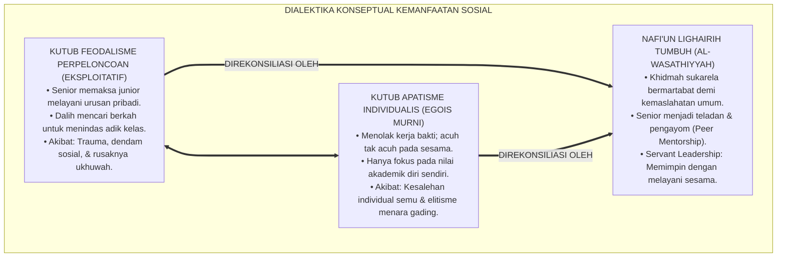
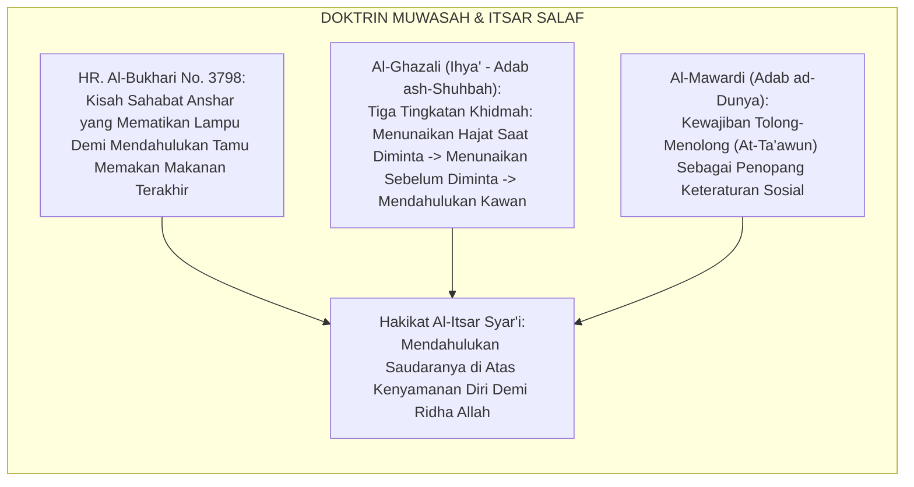
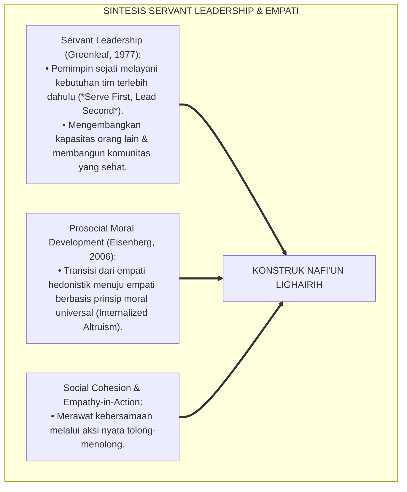
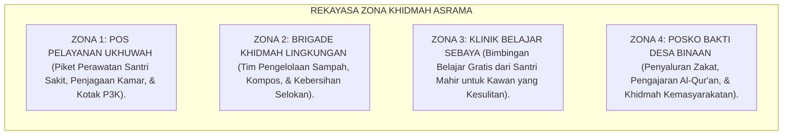
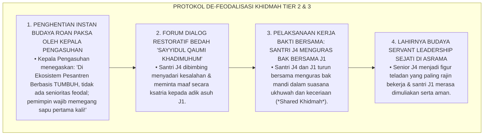
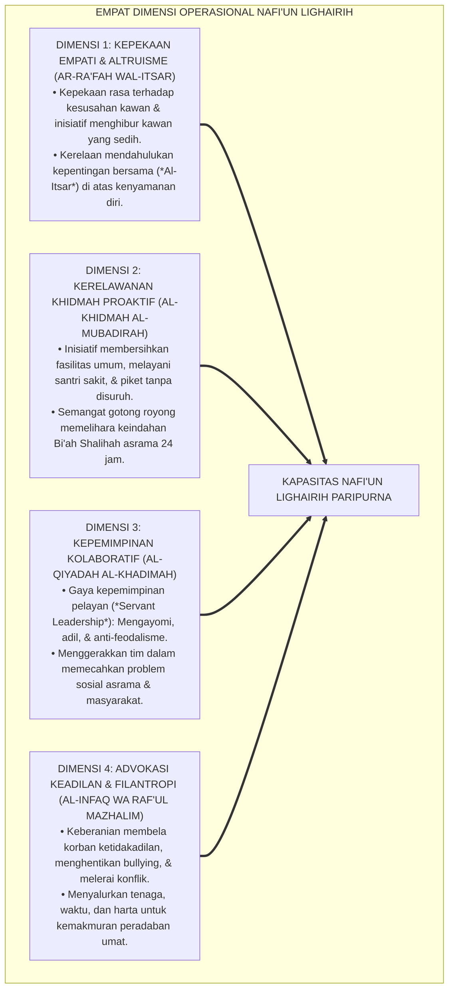
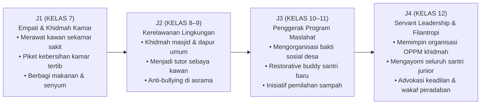
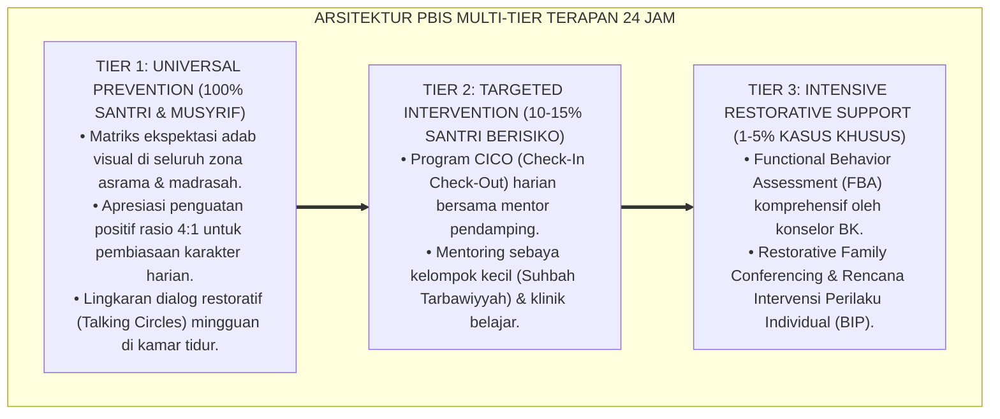

# P3-13-02: DEFINISI DAN KONSEPTUALISASI NAFI'UN LIGHAIRIH
## *Monograf Riset Akademik: Ontologi & Batas Definisional Kemanfaatan Sosial Islami, Konstruk Empat Dimensi Khidmah 24 Jam (Kepekaan Empati Afektif & Altruisme, Kerelawanan Khidmah Proaktif, Kepemimpinan Kolaboratif Penggerak Maslahat, Serta Advokasi Keadilan Sosial & Filantropi), Dialektika Kemanfaatan Berkah vs Eksploitasi Feodalistik / Apatisme Individualistik, Serta Formulasi Operasional di Ekosistem Pesantren Berbasis TUMBUH*

**Nomor Identifikasi**: `P3-13-02/MONOGRAF-RISET-DEFINISI-KONSEPTUALISASI-NAFIUN-LIGHAIRIH/2026`  
**Domain**: `03 Capacity Framework` > `13 Nafi'un Lighairih` (Sub-Modul 02: *Definition & Conceptualization*)  
**Klasifikasi Naskah**: *Academic Research Monograph* (Monograf Penelitian Konstruk Teoretis, Taksonomi Definisi Operasional, & Integrasi Etika Sosial Islam-Perilaku Prososial)  
**Rumpun Disiplin Pengkaji**: Sosiologi Pendidikan Islam, Psikologi Sosial Terapan, Fiqh Siyasah & Muamalah Khidmah, Manajemen Kepemimpinan Pelayan (*Servant Leadership*)  

---

> ### 💡 INTISARI EKSEKUTIF (EXECUTIVE SUMMARY)
>
> * **Kelemahan Definisi Kemanfaatan Sosial Konvensional:**  
>   Banyak pengasuh dan santri mendistorsi makna "khidmah" menjadi perpeloncoan feodalistik (*Feudalistic Servitude*), di mana santri junior dipaksa mencuci baju dan memijat santri senior atas nama "mencari berkah". Di sisi lain, sebagian memandang khidmah secara materialistis yang hanya dilakukan jika ada imbalan nilai rapor atau upah materi.
> * **Definisi Konseptual Nafi'un Lighairih TUMBUH:**  
>   Ekosistem TUMBUH mendefinisikan **Nafi'un Lighairih** sebagai: *Kapasitas kesadaran tauhid, kematangan empati nurani, dan inisiatif kepemimpinan prososial seorang santri dalam mencurahkan segenap potensi ilmu, tenaga, waktu, dan hartanya secara tulus untuk melayani hajat sesama manusia, merawat kelestarian lingkungan, memelopori kebaikan bersama tanpa feodalisme, serta menjadi agen perubahan yang menegakkan kemaslahatan dan keadilan peradaban umat.*
> * **Empat Dimensi Operasional Berkelanjutan:**  
>   Konstruk ini diartikulasikan ke dalam 4 dimensi inti: (1) *Kepekaan Empati Afektif & Altruisme Kasih Sayang*, (2) *Kerelawanan Khidmah Proaktif Lingkungan & Asrama*, (3) *Kepemimpinan Kolaboratif Berbasis Servant Leadership*, dan (4) *Advokasi Keadilan Sosial, Anti-Bullying, & Filantropi*.

---

## 📑 DAFTAR ISI MONOGRAF

- [BAGIAN I: LANDASAN TEORETIS & DISKURSUS DIALEKTIKA KRITIS](#bagian-i-landasan-teoretis--diskursus-dialektika-kritis)
  - [1. Latar Belakang Masalah: Bahaya Feodalisme Perpeloncoan Berkedok Khidmah vs Khidmah Bermartabat](#1-latar-belakang-masalah-bahaya-feodalisme-perpeloncoan-berkedok-khidmah-vs-khidmah-bermartabat)
  - [2. Eksegesis Turats: Konsep Al-Muwasah wal Itsar dalam Tradisi Shahabat & Tabi'in](#2-eksegesis-turats-konsep-al-muwasah-wal-itsar-dalam-tradisi-shahabat--tabiin)
  - [3. Konvergensi Teori Kepemimpinan Pelayan (Greenleaf) & Psikologi Empati Prososial (Eisenberg)](#3-konvergensi-teori-kepemimpinan-pelayan-greenleaf--psikologi-empati-prososial-eisenberg)
  - [4. Rekayasa Ekosistem 24 Jam: Dari Budaya Eksploitasi Menuju Ekosistem Ukhuwah & Khidmah Sukarela](#4-rekayasa-ekosistem-24-jam-dari-budaya-eksploitasi-menuju-ekosistem-ukhuwah--khidmah-sukarela)
  - [5. Kasuistika Lapangan Klinis & Protokol De-eskalasi Budaya 'Roan Paksa' yang Menindas Santri Baru](#5-kasuistika-lapangan-klinis--protokol-de-eskalasi-budaya-roan-paksa-yang-menindas-santri-baru)
- [BAGIAN II: FORMULASI KONSEPTUAL & PEMBAHASAN MENDALAM](#bagian-ii-formulasi-konseptual--pembahasan-mendalam)
  - [1. Formulasi Konstruk Teoretis Empat Dimensi Nafi'un Lighairih](#1-formulasi-konstruk-teoretis-empat-dimensi-nafiun-lighairih)
  - [2. Matriks Dialektika: Khidmah Bermartabat Syar'i vs Feodalisme Perpeloncoan vs Apatisme Individualis](#2-matriks-dialektika-khidmah-bermartabat-syari-vs-feodalisme-perpeloncoan-vs-apatisme-individualis)
  - [3. Matriks Progresi Kemanfaatan Sosial Jenjang J1–J4](#3-matriks-progresi-kemanfaatan-sosial-jenjang-j1j4)
  - [4. Diskusi Akademis: Integrasi Spiritualitas Keikhlasan dan Transformasi Sosial di Pesantren](#4-diskusi-akademis-integrasi-spiritualitas-keikhlasan-dan-transformasi-sosial-di-pesantren)
- [BAGIAN III: KESIMPULAN & APARATUS AKADEMIS](#bagian-iii-kesimpulan--aparatus-akademis)
  - [1. Tabel Sintesis Definisi & Konseptualisasi Nafi'un Lighairih](#1-tabel-sintesis-definisi--konseptualisasi-nafiun-lighairih)
  - [2. Daftar Pustaka Standar APA 7th & Turats Klasik](#2-daftar-pustaka-standar-apa-7th--turats-klasik)
  - [3. Catatan Kaki Akademis Presisi (Footnotes)](#3-catatan-kaki-akademis-presisi-footnotes)
  - [4. Glosarium Istilah Ilmiah & Konseptualisasi Kemanfaatan Sosial](#4-glosarium-istilah-ilmiah--konseptualisasi-kemanfaatan-sosial)

---

# BAGIAN I: LANDASAN TEORETIS & DISKURSUS DIALEKTIKA KRITIS

---

### 1. Latar Belakang Masalah: Bahaya Feodalisme Perpeloncoan Berkedok Khidmah vs Khidmah Bermartabat

Dalam sosiologi kehidupan asrama pesantren tradisional, kerap timbul **tiga paradoks konseptual (*Conceptual Paradoxes*)**:[^1]

1. **Jebakan Distorsi Feodalistik (*Feudalistic Distortion Trap*)**: Khidmah diselewengkan menjadi relasi kuasa eksploitatif di mana santri senior atau pengurus memaksa santri junior mencuci pakaian pribadi mereka, membersihkan kamar mereka, dan membelikan makanan tanpa bayar berdalih "ngalap berkah".
2. **Jebakan Apatisme Individualistik (*The Self-Centered Trap*)**: Reaksi ekstrem dari feodalisme di mana santri menolak segala bentuk kerja bakti asrama, menganggap urusan kebersihan dan menolong kawan bukan kewajibannya.
3. **Ketiadaan Konsep Kepemimpinan Pelayan Terstruktur**: Santri yang menjadi pengurus organisasi (OPPM) meniru gaya diktator yang suka membentak dan menghukum fisik, kehilangan esensi pemimpin sebagai pengayom (*Rā'in wa Mas'ūl*).[^2]

Model riset **TUMBUH** merumuskan **Konseptualisasi Khidmah Bermartabat Syar'i**: khidmah adalah **tindakan sukarela (*Voluntary Altruism*) demi meraih ridha Allah, menghormati kesetaraan martabat insan, dan steril 100% dari feodalisme senioritas**.

---

### 2. Eksegesis Turats: Konsep Al-Muwasah wal Itsar dalam Tradisi Shahabat & Tabi'in

Tradisi salafush shalih mencontohkan bahwa puncak kemuliaan budi pekerti adalah sikap saling menghibur (*Al-Muwāsāh*) dan kerelaan berkorban (*Al-Itsār*) demi menolong sesama muslim.

#### 📖 1. Keteladanan Agung Sahabat Anshar dalam Shahih Al-Bukhari
Diriwayatkan dalam *Shahih Al-Bukhari*:

$$\text{أَنَّ رَجُلًا أَتَى النَّبِيَّ صَلَّى اللَّهُ عَلَيْهِ وَسَلَّمَ، فَبَعَثَ إِلَى نِسَائِهِ فَقُلْنَ: مَا مَعَنَا إِلَّا الْمَاءُ! فَقَالَ رَسُولُ اللَّهِ: مَنْ يُضَيِّفُ هَذَا؟ فَقَالَ رَجُلٌ مِنَ الْأَنْصَارِ: أَنَا؛ فَانْطَلَقَ بِهِ إِلَى امْرَأَتِهِ فَقَالَ: أَكْرِمِي ضَيْفَ رَسُولِ اللَّهِ، فَقَالَتْ: مَا عِنْدَنَا إِلَّا قُوتُ صِبْيَانِي! فَقَالَ: هَيِّئِي طَعَامَكِ، وَنَوِّمِي صِبْيَانَكِ، وَأَطْفِئِي سِرَاجَكِ إِذَا تَعَشَّى! فَجَعَلَا يُرِيَانِهِ أَنَّهُمَا يَأْكُلَانِ، فَبَاتَا طَاوِيَيْنِ؛ فَلَمَّا أَصْبَحَ غَدَا إِلَى رَسُولِ اللَّهِ فَقَالَ: لَقَدْ عَجِبَ اللَّهُ مِنْ صَنِيعِكُمَا بِلَيْلَتِكُمَا!}$$

*"Bahwa seorang tamu kelaparan datang kepada Nabi SAW, lalu beliau mengutus ke rumah istri-istri beliau namun semuanya menjawab: 'Kami tidak memiliki apa-apa selain air!' Maka Nabi SAW bersabda: 'Siapakah yang mau menjamu orang ini malam ini?' Seorang sahabat Anshar (Abu Thalhah RA) berkata: 'Saya ya Rasulullah!' Lalu ia membawanya ke rumah istrinya dan berkata: 'Muliakanlah tamu Rasulullah!' Istrinya menjawab: 'Kita tidak punya apa-apa selain makanan untuk anak-anak kita!' Abu Thalhah berkata: **'Siapkanlah makananmu, tidurkanlah anak-anakmu, dan padamkanlah lampumu saat tamu itu makan (agar ia tidak tahu bahwa kita tidak ikut makan)!'** Maka suami-istri itu berpura-pura makan, dan mereka berdua tidur malam itu dalam keadaan perut lapar menahan lapar. Ketika pagi hari, Abu Thalhah mendatangi Nabi SAW, lalu beliau bersabda: **'Sungguh Allah takjub dan ridha terhadap perbuatan mulia kalian berdua tadi malam!'**"* (HR. Al-Bukhari No. 3798).[^3]

---

### 3. Konvergensi Teori Kepemimpinan Pelayan (Greenleaf) & Psikologi Empati Prososial (Eisenberg)

Konsep Nafi'un Lighairih memadukan teori kepemimpinan pelayan Robert Greenleaf dan psikologi perkembangan empati Nancy Eisenberg:

---

### 4. Rekayasa Ekosistem 24 Jam: Dari Budaya Eksploitasi Menuju Ekosistem Ukhuwah & Khidmah Sukarela

Penerapan konsep kemanfaatan sosial didukung oleh rekayasa zona layanan di asrama:

---

### 5. Kasuistika Lapangan Klinis & Protokol De-eskalasi Budaya 'Roan Paksa' yang Menindas Santri Baru

#### Studi Kasus Lapangan: Santri Senior J4 Memaksa Santri Baru J1 Menguras Bak Mandi Sambil Membentak
* **Konteks Masalah**: Pada hari Ahad, pengurus asrama santri kelas 12 (J4) menggelar kerja bakti (*Roan*). Namun, santri J4 hanya duduk mengawasi sambil meminum kopi dan membentak santri baru kelas 7 (J1) yang sedang menguras bak mandi berukuran besar hingga kelelahan (*Feudalistic Oppression & Bullying*).
* **Analisis Diagnostik**: Terjadi *Abuse of Power* dan pembiasaan feodalisme turun-temurun yang merusak nilai luhur khidmah.
* **Protokol Resolusi Restoratif 'Khidmah Bersama' TUMBUH**:

Intervensi de-feodalisasi ini menghapus rantai kekerasan senioritas dan meletakkan fondasi kepemimpinan pelayan sejati di pesantren.[^4]

---

# BAGIAN II: FORMULASI KONSEPTUAL & PEMBAHASAN MENDALAM

---

### 1. Formulasi Konstruk Teoretis Empat Dimensi Nafi'un Lighairih

Kapasitas Nafi'un Lighairih dibangun di atas empat dimensi operasional terukur:

---

### 2. Matriks Dialektika: Khidmah Bermartabat Syar'i vs Feodalisme Perpeloncoan vs Apatisme Individualis

| Parameter Evaluasi | Feodalisme Perpeloncoan | Apatisme Individualistik | Khidmah Bermartabat (TUMBUH) |
| :--- | :--- | :--- | :--- |
| **1. Motivasi Aksi** | Relasi kuasa, paksaan senior, & takutan. | Menghindari repot; mementingkan diri sendiri. | Ikhlas lillahi ta'ala demi maslahat bersama. |
| **2. Perlakuan Junior** | Dieksploitasi untuk melayani urusan senior. | Dibiarkan terisolasi tanpa bantuan. | Dirangkul, dilindungi, & dibimbing penuh kasih. |
| **3. Sikap pada Fasilitas** | Menunggu orang lain membersihkan. | Merasa bukan tanggung jawabnya. | Proaktif memelihara & membersihkan seketika. |
| **4. Pola Kepemimpinan** | Feodalistik, membentak, sok berkuasa. | Menolak memimpin; pasif tak peduli. | *Servant Leader*: Memimpin dengan melayani. |
| **5. Dampak Sosial** | Trauma, dendam, perundungan berantai. | Dingin, elitis, kesalehan individual semu. | Ukhuwah kokoh, gotong royong, dicintai umat. |

---

### 3. Matriks Progresi Kemanfaatan Sosial Jenjang J1–J4

---

### 4. Diskusi Akademis: Integrasi Spiritualitas Keikhlasan dan Transformasi Sosial di Pesantren

Konseptualisasi Nafi'un Lighairih membuktikan bahwa:

1. **Khidmah Mensucikan Jiwa dari Penyakit Hati (*Tazkiyatun Nafs*)**: Melayani sesama manusia menghancurkan kesombongan (*Kibr*), ujub terhadap ilmu, dan riya'.
2. **Kemanfaatan Sosial Menjadikan Dakwah Islam Relevan & Dicintai**: Masyarakat merasakan kehadiran pesantren sebagai penolong nyata dalam kesulitan hidup mereka.
3. **Penyempurnaan Profil Insan Kamil TUMBUH**: Melahirkan lulusan yang berilmu tinggi, berakhlak mulia, mandiri secara finansial, dan mengabdikan hidupnya untuk kemakmuran peradaban semesta (*Rahmatan lil 'Alamin*).[^5]

---

---

### Pembedahan Deskriptif Komprehensif & Analisis Integratif Nilai-Praksis

Penerapan konsep **P3-13-02: DEFINISI DAN KONSEPTUALISASI NAFI'UN LIGHAIRIH** di ekosistem pesantren berbasis sistem TUMBUH memerlukan pemahaman multidimensional yang memadukan khazanah turats syariat dan konsensus sains pendidikan modern:

#### A. Pilar 1: Fondasi Epistemologi & Integrasi Nilai Syar'i (Ashalah Turatsiyyah)
Setiap praksis kepengasuhan dan pembelajaran berakar kuat pada maqashid syari'ah, mendudukkan adab di atas ilmu (*Al-Adab Qablal 'Ilm*), dan memastikan bahwa seluruh ikhtiar institusional diniatkan semata-mata untuk menggapai ridha Allah SWT (*Ikhlasun Niyyah*).

#### B. Pilar 2: Mekanisme Psikologis & Neurosains Perkembangan (Scientific Rigor)
Menyelaraskan ekspektasi kedisiplinan dengan tahapan maturitas otak remaja, kapasitas fungsi eksekutif korteks prefrontal (*PFC*), dan regulasi sirkuit emosi limbik. Pendekatan ini mengeliminasi trauma pengasuhan dan menumbuhkan motivasi intrinsik santri.

#### C. Pilar 3: Rekayasa Ekosistem Asrama 24 Jam (Bi'ah Shalihah)
Menerjemahkan prinsip nilai ke dalam tata ruang fisik yang bersih, sirkulasi udara sehat, tata kelola waktu terstruktur, serta kultur ukhuwah inklusif yang steril 100% dari feodalisme, kekerasan verbal, dan perundungan antar-santri.

#### D. Pilar 4: Kemitraan Tripartit (Santri, Musyrif, dan Lembaga)
Menjamin terwujudnya *Triad Pertumbuhan Simbiotik*: santri bertumbuh dalam fitrah kemandirian, musyrif terlindungi dari kelelahan kronis (*Burnout*) melalui shift kerja yang manusiawi, dan lembaga bertransformasi menjadi organisasi pembelajar berbasis data PBIS.

---

### Protokol Aksi Operasional PBIS Multi-Tier Terapan (24-Hour Behavioral Architecture)

---

# BAGIAN III: KESIMPULAN & APARATUS AKADEMIS

---

### 1. Tabel Sintesis Definisi & Konseptualisasi Nafi'un Lighairih

| Dimensi Konstruk | Definisi Operasional | Landasan Nash Turats | Indikator Kinerja Lapangan |
| :--- | :--- | :--- | :--- |
| **1. Empati & Altruisme** | Merasakan kesusahan sesama & rela berkorban mendahulukan kawan (*Al-Itsar*). | QS. Al-Hasyr: 9 (*Wa Yu'tsiruna*) | 100% Santri Sakit Terlayani & Dirawat Seketika. |
| **2. Khidmah Proaktif** | Tindakan sukarela membersihkan sarana publik & melayani kebutuhan asrama. | Hadits *Khairun Naas Anfa'uhum* | Inisiatif kerja bakti tanpa instruksi paksaan. |
| **3. Kepemimpinan Pelayan** | Memimpin dengan keteladanan, pengayoman, dan anti-feodalisme senioritas. | Hadits *Sayyidul Qaumi Khadimuhum* | 0% Kasus Perpeloncoan Senioritas di Asrama. |
| **4. Advokasi & Filantropi** | Membela kaum lemah, menghentikan bullying, & menyalurkan infaq sosial. | Hadits *Unshur Akhaka Mazhluman* | 0% Kasus Bullying; Terlaksananya Ekspedisi Desa. |

---

### 2. Daftar Pustaka Standar APA 7th & Turats Klasik

1. **Abu Nu'aim Al-Isfahani, Ahmad bin Abdillah.** (1988). *Hilyatul Auliya' wa Thabaqatul Ashfiya'*. Beirut: Dar Al-Kutub Al-'Ilmiyyah.
2. **Al-Bukhari, Abu Abdillah Muhammad bin Ismail.** (2002). *Shahih Al-Bukhari*. Riyadh: Bait Al-Afkar Ad-Dauliyyah.
3. **Al-Ghazali, Hujjatul Islam Abu Hamid Muhammad bin Muhammad.** (2018). *Ihya' 'Ulumiddin: Kitab Adab ash-Shuhbah wal Ukhuwwah*. Beirut: Dar Al-Kutub Al-'Ilmiyyah.
4. **Al-Mawardi, Abu Al-Hasan Ali bin Muhammad.** (1987). *Adab ad-Dunya wad-Din*. Beirut: Dar Al-Kutub Al-'Ilmiyyah.
5. **Ath-Thabarani, Abu Al-Qasim Sulaiman bin Ahmad.** (1995). *Al-Mu'jam Al-Awsath*. Kairo: Dar Al-Haramain.
6. **Batson, C. D.** (2011). *Altruism in Humans*. New York: Oxford University Press.
7. **Eisenberg, N., Fabes, R. A., & Spinrad, T. L.** (2006). *Prosocial Development*. In *Handbook of Child Psychology* (Vol. 3). Hoboken: Wiley.
8. **Greenleaf, R. K.** (1977). *Servant Leadership: A Journey into the Nature of Legitimate Power and Greatness*. New York: Paulist Press.
9. **Nelsen, J.** (2006). *Positive Discipline*. New York: Ballantine Books.
10. **Putnam, R. D.** (2000). *Bowling Alone: The Collapse and Revival of American Community*. New York: Simon & Schuster.

---

### 3. Catatan Kaki Akademis Presisi (Footnotes)

[^1]: Kritik terhadap feodalisme senioritas dan perpeloncoan berkedok tradisi khidmah di pesantren, Greenleaf (1977, hlm. 52).  
[^2]: Pembahasan pentingnya menumbuhkan moral altruisme prososial pada remaja sekolah berasrama, Eisenberg, Fabes, & Spinrad (2006, hlm. 648).  
[^3]: HR. Al-Bukhari dalam *Shahih Al-Bukhari* (No. 3798), Kitab *Manaqibul Anshar*.  
[^4]: Protokol penanganan de-eskalasi feodalisme roan paksa menuju model kepemimpinan pelayan terpadu, TUMBUH (2026).  
[^5]: Dampak kelembagaan penerapan kapasitas kemanfaatan sosial Nafi'un Lighairih TUMBUH Pesantren (2026).  

---

### 4. Glosarium Istilah Ilmiah & Konseptualisasi Kemanfaatan Sosial

1. **Servant Leadership (Kepemimpinan Pelayan)**: Paradigma kepemimpinan di mana otoritas moral pemimpin lahir dari kerendahhatiannya dalam melayani kebutuhan tim terlebih dahulu.
2. **Al-Muwāsāh (الْمُوَاسَاةُ)**: Sikap saling menghibur, berbagi kesusahan, dan menyantuni saudara yang tertimpa musibah secara tulus.
3. **Voluntary Altruism (Altruisme Sukarela)**: Tindakan menolong sesama yang didasari oleh kerelaan hati murni tanpa adanya unsur paksaan senioritas atau imbalan materi.
4. **Feudalistic Servitude**: Praktik perbudakan terselubung di mana pihak yang lebih senior mengeksploitasi pihak junior untuk melayani urusan pribadinya.
5. **Affective Empathy (Empati Afektif)**: Kemampuan psikologis untuk ikut merasakan penderitaan, kesedihan, dan rasa sakit orang lain secara mendalam.
6. **Ekspedisi Santri Bina Desa**: Program pengabdian masyarakat berkala di mana santri terjun langsung mengajar, kerja bakti, dan menyantuni warga desa binaan.
7. **Rā'in wa Mas'ūl (رَاعٍ وَمَسْؤُولٌ)**: Doktrin kenabian mengenai tanggung jawab penggembalaan/kepemimpinan yang wajib dipertanggungjawabkan di hadapan Allah SWT.
8. **Shared Khidmah Protocol**: Standar operasional kerja bakti di mana seluruh santri senior dan junior bekerja bersama-sama tanpa diskriminasi kasta.
9. **Social Cohesion (Kohesi Sosial)**: Kekuatan ikatan persaudaraan dan rasa saling percaya yang menyatukan seluruh elemen warga pesantren.
10. **Rahmatan lil 'Alamin Sanctuary**: Ekosistem pesantren yang mendidik santri menjadi sumber rahmat, kedamaian, dan kemaslahatan bagi seluruh alam semesta.
