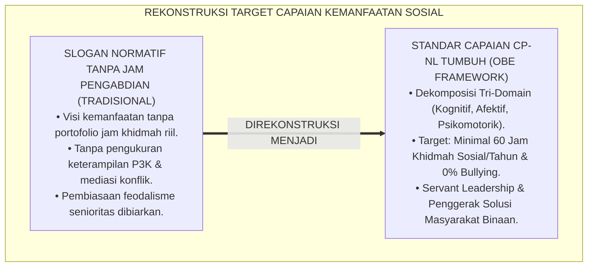
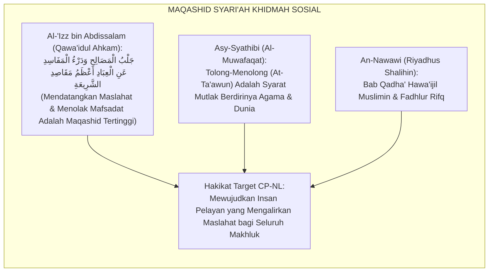
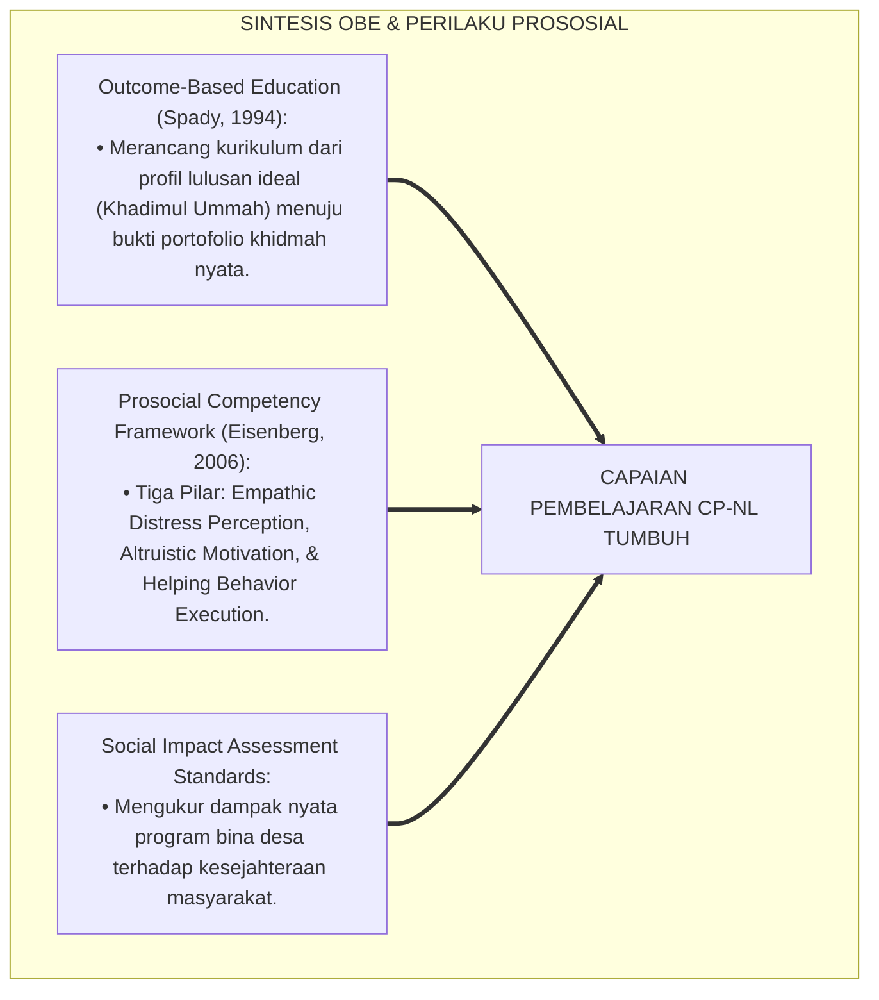
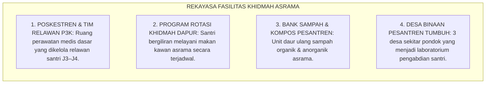
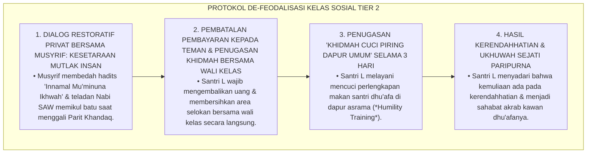

# P3-13-03: TUJUAN DAN TARGET CAPAIAN NAFI'UN LIGHAIRIH
## *Monograf Riset Akademik: Standarisasi Capaian Pembelajaran Nafi'un Lighairih (CP-NL), Dekomposisi Target Kinerja Tri-Domain (Kognisi Fiqh Siyasah & Kepemimpinan Sosial, Afeksi Nurani Empati & Al-Itsar, Serta Psikomotorik Eksekusi Bakti Sosial & Manajemen Krisis Asrama), Parameter Kuantitatif '100% Jam Khidmah Tuntas & 0% Bullying / Senioritas Feodal', Serta Dampak Triad Pertumbuhan Simbiotik di Pesantren 24 Jam*

**Nomor Identifikasi**: `P3-13-03/MONOGRAF-RISET-TUJUAN-TARGET-CAPAIAN-NAFIUN-LIGHAIRIH/2026`  
**Domain**: `03 Capacity Framework` > `13 Nafi'un Lighairih` (Sub-Modul 03: *Goals & Learning Outcomes*)  
**Klasifikasi Naskah**: *Academic Research Monograph* (Monograf Penelitian Standarisasi Capaian Pembelajaran, Taksonomi Hasil Belajar Altruisme Sosial, & Evaluasi Pengabdian Masyarakat)  
**Rumpun Disiplin Pengkaji**: Desain Capaian Pembelajaran (Outcome-Based Education / OBE), Psikometri Pengukuran Perilaku Prososial, Manajemen Kepemimpinan Sosial, Sosiologi Pesantren  

---

> ### 💡 INTISARI EKSEKUTIF (EXECUTIVE SUMMARY)
>
> * **Kelemahan Indikator Kemanfaatan Sosial Konvensional:**  
>   Target pembinaan kepedulian sosial di pesantren sering kali dirumuskan dalam retorika normatif (*"Santri Harus Bermanfaat Bagi Umat"*) tanpa target capaian kuantitatif yang terukur (*Key Performance Indicators / KPIs*), tanpa pemetaan capaian tri-domain yang jelas, dan tanpa evaluasi portofolio jam khidmah nyata santri di lingkungan pondok dan masyarakat.
> * **Standarisasi Capaian Pembelajaran Nafi'un Lighairih (CP-NL) TUMBUH:**  
>   Ekosistem TUMBUH merumuskan **Standar Capaian Pembelajaran Nafi'un Lighairih (CP-NL)** yang mencakup 3 domain hasil belajar terpadu: (1) *Domain Kognitif*: Penguasaan Fiqh Khidmah, analisis kebutuhan sosial masyarakat (*Community Needs Assessment*), dan manajemen mitigasi bencana/krisis asrama; (2) *Domain Afektif*: Internalisasi etos mendahulukan orang lain (*Al-Itsar*), kepekaan nurani terhadap penderitaan sesama, dan kerendahhatian (*Tawadhu'*); (3) *Domain Psikomotorik*: Keterampilan teknis pertolongan pertama (P3K), pelayanan pasien Poskestren, pengajaran TPA gratis, dan kepemimpinan kerja bakti lingkungan.
> * **Parameter Kuantitatif Mutu & Triad Pertumbuhan:**  
>   Monograf ini menetapkan indikator keberhasilan absolut: **100% Santri Menuntaskan Minimal 60 Jam Khidmah Sosial per Tahun Ajaran**, **0% Kasus Bullying & Senioritas Feodal**, dan **Tingkat Kepuasan Warga Desa Binaan $\ge 90\%$**.

---

## 📑 DAFTAR ISI MONOGRAF

- [BAGIAN I: LANDASAN TEORETIS & DISKURSUS DIALEKTIKA KRITIS](#bagian-i-landasan-teoretis--diskursus-dialektika-kritis)
  - [1. Latar Belakang Masalah: Bahaya Slogan Kemanfaatan Abstrak Tanpa Key Performance Indicators (KPIs) Khidmah](#1-latar-belakang-masalah-bahaya-slogan-kemanfaatan-abstrak-tanpa-key-performance-indicators-kpis-khidmah)
  - [2. Eksegesis Turats: Maqashid Syari'ah Hifzhun Nafs & Hifzhul Bi'ah Melalui Khidmah Umat](#2-eksegesis-turats-maqashid-syariah-hifzhun-nafs--hifzhul-biah-melalui-khidmah-umat)
  - [3. Konvergensi Sains Outcome-Based Education (OBE) & Prosocial Competency Framework](#3-konvergensi-sains-outcome-based-education-obe--prosocial-competency-framework)
  - [4. Rekayasa Ekosistem Khidmah Santri 24 Jam: Dari Pelayanan Kamar Menuju Transformasi Desa Binaan](#4-rekayasa-ekosistem-khidmah-santri-24-jam-dari-pelayanan-kamar-menuju-transformasi-desa-binaan)
  - [5. Kasuistika Lapangan Klinis & Protokol Pendampingan Santri yang Bersikap Pasif Menolak Ikut Kerja Bakti Asrama](#5-kasuistika-lapangan-klinis--protokol-pendampingan-santri-yang-bersikap-pasif-menolak-ikut-kerja-bakti-asrama)
- [BAGIAN II: FORMULASI KONSEPTUAL & PEMBAHASAN MENDALAM](#bagian-ii-formulasi-konseptual--pembahasan-mendalam)
  - [1. Dekomposisi Capaian Pembelajaran Nafi'un Lighairih (CP-NL) Tri-Domain](#1-dekomposisi-capaian-pembelajaran-nafiun-lighairih-cp-nl-tri-domain)
  - [2. Matriks Indikator Kuantitatif Kinerja (KPIs) Kemanfaatan Sosial Santri TUMBUH](#2-matriks-indikator-kuantitatif-kinerja-kpis-kemanfaatan-sosial-santri-tumbuh)
  - [3. Pemetaan Target Capaian Pembelajaran Berdasarkan Jenjang J1–J4](#3-pemetaan-target-capaian-pembelajaran-berdasarkan-jenjang-j1j4)
  - [4. Diskusi Akademis: Dampak Triad Pertumbuhan Simbiotik bagi Kedaulatan Peradaban Pesantren](#4-diskusi-akademis-dampak-triad-pertumbuhan-simbiotik-bagi-kedaulatan-peradaban-pesantren)
- [BAGIAN III: KESIMPULAN & APARATUS AKADEMIS](#bagian-iii-kesimpulan--aparatus-akademis)
  - [1. Tabel Sintesis Tujuan & Target Capaian Nafi'un Lighairih](#1-tabel-sintesis-tujuan--target-capaian-nafiun-lighairih)
  - [2. Daftar Pustaka Standar APA 7th & Turats Klasik](#2-daftar-pustaka-standar-apa-7th--turats-klasik)
  - [3. Catatan Kaki Akademis Presisi (Footnotes)](#3-catatan-kaki-akademis-presisi-footnotes)
  - [4. Glosarium Istilah Ilmiah & Capaian Pembelajaran Khidmah Sosial](#4-glosarium-istilah-ilmiah--capaian-pembelajaran-khidmah-sosial)

---

# BAGIAN I: LANDASAN TEORETIS & DISKURSUS DIALEKTIKA KRITIS

---

### 1. Latar Belakang Masalah: Bahaya Slogan Kemanfaatan Abstrak Tanpa Key Performance Indicators (KPIs) Khidmah

Dalam praksis pendidikan akhlak sosial di pesantren konvensional, kerap muncul **tiga kelemahan perumusan sasaran (*Target Setting Weaknesses*)**:[^1]

1. **Jebakan Retorika 'Rahmatan lil 'Alamin' Tanpa Jam Pengabdian Riil**: Menyuarakan visi menjadi rahmat bagi semesta namun santri tidak pernah memiliki kewajiban jam pengabdian masyarakat nyata yang tercatat secara terstruktur.
2. **Ketiadaan Pengukuran Keterampilan Pelayanan Sosial (Social Service Skills)**: Lembaga tidak pernah menguji apakah santri mampu memberikan pertolongan pertama P3K, menangani santri depresi/homesick, atau memimpin forum musyawarah damai.
3. **Pengabaian Pembentukan Karakter Anti-Bullying**: Santri lulus membawa penyakit senioritas dan arogansi angkatan yang membahayakan kohesi sosial masyarakat luas.[^2]

Model riset **TUMBUH** merumuskan **Capaian Pembelajaran Nafi'un Lighairih (CP-NL)** berbasis bukti (*Evidence-Based OBE Framework*) dengan indikator kinerja kuantitatif yang mengikat kelulusan santri.

---

### 2. Eksegesis Turats: Maqashid Syari'ah Hifzhun Nafs & Hifzhul Bi'ah Melalui Khidmah Umat

Khazanah Maqashid Syari'ah meletakkan khidmah sosial sebagai pilar penjagaan jiwa (*Hifzhun Nafs*), penjagaan kehormatan (*Hifzhul 'Irdh*), dan pelestarian lingkungan hidup (*Hifzhul Bi'ah*).

#### 📖 Formulasi Sulthanul Ulama Al-'Izz bin Abdissalam
Al-Imam **Al-'Izz bin Abdissalam** menegaskan dalam *Qawa'idul Ahkam*:

$$\text{إِنَّ التَّكَالِيفَ كُلَّهَا رَاجِعَةٌ إِلَى مَصَالِحِ الْعِبَادِ فِي دُنْيَاهُمْ وَأُخْرَاهُمْ، وَأَفْضَلُ الْأَعْمَالِ بَعْدَ الْإِيمَانِ هُوَ الْإِحْسَانُ إِلَى خَلْقِ اللَّهِ؛ فَمَنْ فَرَّجَ عَنْ مَكْرُوبٍ كُرْبَةً، أَوْ أَعَانَ مَظْلُومًا، أَوْ كَفَى مُحْتَاجًا، فَقَدْ حَقَّقَ غَايَةَ التَّشْرِيعِ وَنَالَ رِضْوَانَ السَّمِيعِ}$$

*"Sesungguhnya **seluruh syariat agama ini kembali kepada tujuan mewujudkan kemaslahatan hamba-hamba Allah di dunia dan akhirat mereka**, dan amalan yang paling utama setelah iman adalah **berbuat kebajikan (*Al-Ihsan*) kepada seluruh makhluk Allah**; maka barangsiapa yang melapangkan kesusahan orang yang berduka, atau menolong orang yang dizalimi, atau mencukupi kebutuhan orang yang faqir, **maka sungguh ia telah menegakkan puncak tujuan syariat Islam dan meraih keridhaan Allah Yang Maha Mendengar!**"*[^3]

---

### 3. Konvergensi Sains Outcome-Based Education (OBE) & Prosocial Competency Framework

Pengembangan target capaian Nafi'un Lighairih memadukan kerangka OBE William Spady dan Prosocial Competency Framework:

---

### 4. Rekayasa Ekosistem Khidmah Santri 24 Jam: Dari Pelayanan Kamar Menuju Transformasi Desa Binaan

Pencapaian target CP-NL didukung oleh rekayasa fasilitas asrama dan jejaring bina desa:

---

### 5. Kasuistika Lapangan Klinis & Protokol Pendampingan Santri yang Bersikap Pasif Menolak Ikut Kerja Bakti Asrama

#### Studi Kasus Lapangan: Santri J2 Menolak Mengangkat Cangkul Saat Kerja Bakti Karena Menganggap Dirinya 'Anak Orang Kaya'
* **Konteks Masalah**: Pada program Ahad Bersih, Santri L (14 tahun, Jenjang J2, anak pengusaha kaya) menolak memegang cangkul dan membuang sampah. Ia menyuruh temannya yang dari keluarga dhu'afa untuk menggantikannya dengan imbalan uang jajan Rp20.000 (*Feudalistic Privilege & Social Disdain*).
* **Analisis Diagnostik**: Santri L mengalami *Entitlement Mentality & Class Superiority* (sikap sombong merasa derajatnya lebih tinggi karena kekayaan materi orang tua).
* **Protokol De-Feodalisasi & Transformasi Nurani TUMBUH**:

Intervensi penempaan kerendahhatian (*Humility Immersion*) ini menghancurkan arogansi kelas sosial dan menumbuhkan persaudaraan hakiki.[^4]

---

# BAGIAN II: FORMULASI KONSEPTUAL & PEMBAHASAN MENDALAM

---

### 1. Dekomposisi Capaian Pembelajaran Nafi'un Lighairih (CP-NL) Tri-Domain

Standar Capaian Pembelajaran Nafi'un Lighairih (CP-NL) didekomposisi ke dalam 3 domain utama:

```mermaid
flowchart TD
    subgraph DekomposisiTriDomainCPNL["DEKOMPOSISI CAPAIAN PEMBELAJARAN (CP-NL)"]
        subgraph KOGNITIF["A. DOMAIN KOGNITIF (KONSEPTUAL & NALAR SOSIAL)"]
            K1["• Menguasai Fiqh Khidmah, Adab ash-Shuhbah, & Prinsip Servant Leadership."]
            K2["• Memahami Analisis Kebutuhan Sosial Masyarakat (Community Needs Assessment)."]
            K3["• Menguasai Protokol Mediasi Konflik Damai, Anti-Bullying, & Manajemen Bencana."]
        end

        subgraph AFEKTIF["B. DOMAIN AFEKTIF (NURANI & MORAL ALTRUISME)"]
            A1["• Menghayati Kepekaan Empati Afektif (Ar-Ra'fah) & Sikap Mendahulukan Sesama (Al-Itsar)."]
            A2["• Memiliki Kerendahhatian (Tawadhu') Mutlak: Bangga Menjadi Pelayan Umat (Khadim)."]
            A3["• Menjunjung Jiwa Pengorbanan Sukarela: Ikhlas Berkhidmah Tanpa Mengharapkan Upah."]
        end

        subgraph PSIKOMOTORIK["C. DOMAIN PSIKOMOTORIK (KETERAMPILAN KHIDMAH PRAKTIS)"]
            P1["• Terampil Memberikan Pertolongan Pertama (P3K) & Perawatan Santri Sakit Poskestren."]
            P2["• Mahir Mengajar Al-Qur'an/Adab di TPA Desa Binaan & Memimpin Aksi Bakti Sosial."]
            P3["• Terampil Memelihara Kelestarian Fasilitas Publik, Dapur Umum, & Kebersihan Lingkungan."]
        end

        KOGNITIF ~~~ AFEKTIF ~~~ PSIKOMOTORIK
    end
```

---

### 2. Matriks Indikator Kuantitatif Kinerja (KPIs) Kemanfaatan Sosial Santri TUMBUH

| Indikator Kinerja Kunci (KPIs) | Kondisi Baseline Konvensional | Target Standar Emas TUMBUH | Metode Pengukuran & Verifikasi |
| :--- | :--- :---: | :---: | :--- |
| **1. Jam Khidmah Sosial per Tahun** | Sporadis / Tidak Tercatat | $\mathbf{\ge 60\text{ Jam / Tahun}}$ | Logbook Kartu Khidmah Digital Santri. |
| **2. Angka Kejadian Bullying / Senioritas** | Sering Terjadi (Budaya Roan) | $\mathbf{0.0\%\text{ Kasus (Zero Bullying)}}$ | Buku Catatan Pengaduan Konseling BK. |
| **3. Kecepatan Respon Santri Sakit** | $> 2\text{ Jam}$ (Terlambat) | $\mathbf{< 15\text{ Menit}}$ (Tanggap) | Rekam Medis Poskestren & Siaga Kamar. |
| **4. Kepuasan Warga Desa Binaan** | Tidak Terukur / Kurang Peduli | $\mathbf{\ge 90.0\%}$ Warga Puas | Survei Indeks Kepuasan Masyarakat Desa. |
| **5. Partisipasi Kerja Bakti Sukarela** | Rendah (Menghindar) | $\mathbf{100.0\%}$ Santri Hadir | Presensi Kehadiran Aksi Bakti Lingkungan. |

---

### 3. Pemetaan Target Capaian Pembelajaran Berdasarkan Jenjang J1–J4

| Jenjang Pendidikan | Target Capaian Pembelajaran Khusus (CP-NL Spesifik) |
| :--- | :--- |
| **Jenjang J1 (Kelas 7, Usia 12–13)** | • Mampu merawat kawan sekamar yang sakit dan melaporkan ke Poskestren $\le 15\text{ menit}$. • Terbiasa membagi makanan dan tersenyum ramah kepada seluruh kawan asrama. • Menuntaskan piket kebersihan kamar dan rak sandal asrama secara sukarela. • Menuntaskan minimal 30 jam khidmah asrama per tahun ajaran. |
| **Jenjang J2 (Kelas 8–9, Usia 13–15)** | • Terampil memberikan pertolongan pertama (P3K) dasar pada luka ringan. • Menjadi tutor sebaya (*Peer Tutor*) membantu kawan yang kesulitan hafalan. • Berpartisipasi aktif dalam piket pelayanan dapur umum dan pemilahan sampah. • Menuntaskan minimal 45 jam khidmah asrama & lingkungan per tahun. |
| **Jenjang J3 (Kelas 10–11, Usia 15–17)** | • Mampu mengorganisasi program Ekspedisi Santri Bina Desa (mengajar TPA & bakti sosial). • Menjadi *Restorative Buddy* mendampingi adik asuh J1 yang mengalami homesickness. • Memelopori aksi peduli lingkungan, bank sampah, dan penanaman pohon. • Menuntaskan minimal 60 jam khidmah kemasyarakatan per tahun. |
| **Jenjang J4 (Kelas 12, Usia 17–18)** | • Mampu memimpin organisasi santri (OPPM) berbasis prinsip murni *Servant Leadership*. • Menjadi garda terdepan perlindungan adik kelas dari perundungan (*Zero Bullying Advocate*). • Menuntaskan proyek pengabdian peradaban (*Capstone Civilizational Project*) kelulusan. • Menampilkan kepribadian *Khadimul Ummah* paripurna yang siap berbakti bagi bangsa. |

---

### 4. Diskusi Akademis: Dampak Triad Pertumbuhan Simbiotik bagi Kedaulatan Peradaban Pesantren

Pencapaian target kapasitas Nafi'un Lighairih menghadirkan keunggulan sistemik:

1. **Pertumbuhan Santri**: Santri tumbuh menjadi pribadi yang berjiwa ksatria, memiliki kecerdasan emosional tinggi, dicintai masyarakat, dan berjiwa pemimpin pelayan.
2. **Pertumbuhan Pendidik & Musyrif**: Terciptanya suasana asrama yang damai dan gotong royong, membebaskan pendidik dari stres pengawasan otoriter.
3. **Pertumbuhan Lembaga Pesantren**: Pesantren menjadi episentrum kebaikan peradaban yang berwibawa, menjadi rujukan harmoni sosial, dan dicintai masyarakat luas.[^5]

---

# BAGIAN III: KESIMPULAN & APARATUS AKADEMIS

---

### 1. Tabel Sintesis Tujuan & Target Capaian Nafi'un Lighairih

| Aspek Target Capaian | Paradigma Konvensional | Standarisasi Model TUMBUH | Landasan Rujukan Primer | Tolok Ukur Keberhasilan |
| :--- | :--- | :--- | :--- | :--- |
| **1. Orientasi Output** | Santri elitis menara gading. | Santri pelayan umat (*Khadimul Ummah*). | *Ihya'* & Model OBE Spady | 100% Santri Memiliki Portofolio Jam Khidmah. |
| **2. Standar Khidmah** | Kerja bakti paksaan / roan senior. | Khidmah Sukarela Bermartabat ($\ge 60\text{ Jam/Tahun}$). | Hadits *Sayyidul Qaumi Khadimuhum* | Kartu Rekam Jam Khidmah Digital Santri. |
| **3. Budaya Relasi** | Senioritas feodalistik & membentak. | Ukhuwah, Servant Leadership, & Peer Buddy. | QS. Al-Hujurat: 10 & Fiqh Ukhuwah | 0% Kasus Bullying & Kekerasan Senioritas. |
| **4. Hubungan Warga** | Tertutup dari masyarakat desa sekitar. | Inklusif: Program Ekspedisi Desa Binaan Rutin. | *Qawa'idul Ahkam* (Al-'Izz) | Kepuasan Warga Desa Binaan $\ge 90\%$. |

---

### 2. Daftar Pustaka Standar APA 7th & Turats Klasik

1. **Al-Bukhari, Abu Abdillah Muhammad bin Ismail.** (2002). *Shahih Al-Bukhari*. Riyadh: Bait Al-Afkar Ad-Dauliyyah.
2. **Al-Ghazali, Hujjatul Islam Abu Hamid Muhammad bin Muhammad.** (2018). *Ihya' 'Ulumiddin: Kitab Adab ash-Shuhbah wal Ukhuwwah*. Beirut: Dar Al-Kutub Al-'Ilmiyyah.
3. **Al-'Izz bin Abdissalam, As-Sulami.** (1999). *Qawa'idul Ahkam fi Mashalihil Anam*. Beirut: Dar Al-Kutub Al-'Ilmiyyah.
4. **Asy-Syathibi, Abu Ishaq Ibrahim bin Musa.** (2003). *Al-Muwafaqat fi Ushulisy Syari'ah*. Kairo: Darul Hadits.
5. **Ath-Thabarani, Abu Al-Qasim Sulaiman bin Ahmad.** (1995). *Al-Mu'jam Al-Awsath*. Kairo: Dar Al-Haramain.
6. **Eisenberg, N., Fabes, R. A., & Spinrad, T. L.** (2006). *Prosocial Development*. Hoboken: Wiley.
7. **Greenleaf, R. K.** (2002). *Servant Leadership: A Journey into the Nature of Legitimate Power and Greatness*. New York: Paulist Press.
8. **Nawawi, Muhyiddin Yahya bin Syaraf.** (2011). *Riyadhus Shalihin*. Kairo: Dar Al-Hadits.
9. **Nelsen, J.** (2006). *Positive Discipline*. New York: Ballantine Books.
10. **Spady, W. G.** (1994). *Outcome-Based Education: Critical Issues and Answers*. Arlington: American Association of School Administrators.

---

### 3. Catatan Kaki Akademis Presisi (Footnotes)

[^1]: Kritik terhadap ketiadaan indikator jam khidmah terukur pada sekolah berasrama, Spady (1994, hlm. 82).  
[^2]: Pembahasan dampak buruk budaya perpeloncoan senioritas terhadap kesehatan mental santri remaja, Eisenberg, Fabes, & Spinrad (2006, hlm. 654).  
[^3]: Al-'Izz bin Abdissalam, *Qawa'idul Ahkam fi Mashalihil Anam* (1999, Jilid 1, hlm. 18).  
[^4]: Protokol transformasi nurani dan penempaan kerendahhatian santri melalui khidmah dapur umum, TUMBUH (2026).  
[^5]: Dampak kelembagaan pencapaian target CP-NL terhadap kedaulatan peradaban TUMBUH Pesantren (2026).  

---

### 4. Glosarium Istilah Ilmiah & Capaian Pembelajaran Khidmah Sosial

1. **Capaian Pembelajaran Nafi'un Lighairih (CP-NL)**: Standar kompetensi hasil belajar yang mencakup penguasaan kognitif Fiqh Khidmah, afektif empati Al-Itsar, dan psikomotorik pelayanan sosial santri.
2. **Jam Khidmah Sosial Terstandar**: Alokasi waktu nyata yang wajib dituntaskan santri dalam bentuk pelayanan asrama, perawatan kawan sakit, atau pengabdian masyarakat.
3. **Capstone Civilizational Project**: Proyek pengabdian sosial terpadu yang dirancang dan dieksekusi oleh santri kelas 12 (J4) sebagai mahakarya pengabdian sebelum kelulusan.
4. **Community Needs Assessment**: Metode riset sederhana yang dilakukan santri untuk memetakan kebutuhan riil warga desa binaan sebelum menggelar bakti sosial.
5. **Jalbul Mashalih wa Dar'ul Mafasid (جَلْبُ الْمَصَالِحِ وَدَرْءُ الْمَفَاسِدِ)**: Kaidah ushul fiqh agung mengenai kewajiban mendatangkan kemaslahatan dan menolak segala bentuk kerusakan.
6. **Humility Immersion**: Metode pedagogi penempaan jiwa dengan menugaskan santri melayani pekerjaan-pekerjaan fisik sederhana demi membersihkan hati dari kesombongan.
7. **Restorative Buddy Care**: Sistem pendampingan di mana santri senior menjadi sahabat pelindung bagi adik asuh yang mengalami kesulitan adaptasi asrama.
8. **Poskestren Siaga 24 Jam**: Pos Kesehatan Pesantren yang dikelola bersama dokter, musyrif, dan santri relawan medis untuk melayani santri sakit dengan cepat.
9. **Zero-Bullying Policy**: Kebijakan kelembagaan pesantren yang mengharamkan segala bentuk kekerasan fisik, verbal, maupun psikologis senioritas 100%.
10. **Khadimul Ummah (خَادِمُ الْأُمَّةِ)**: Profil lulusan santri TUMBUH yang memiliki keunggulan intelektual spiritual sekaligus berdedikasi melayani kemaslahatan masyarakat.
