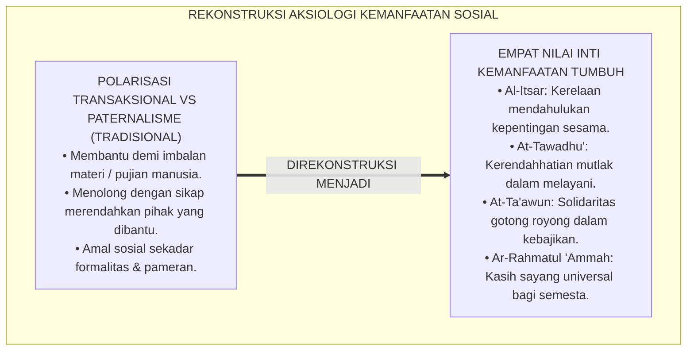
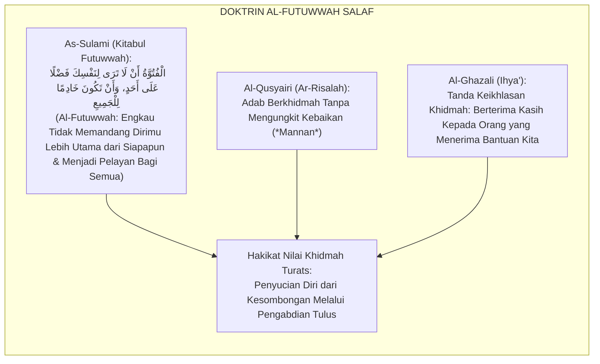
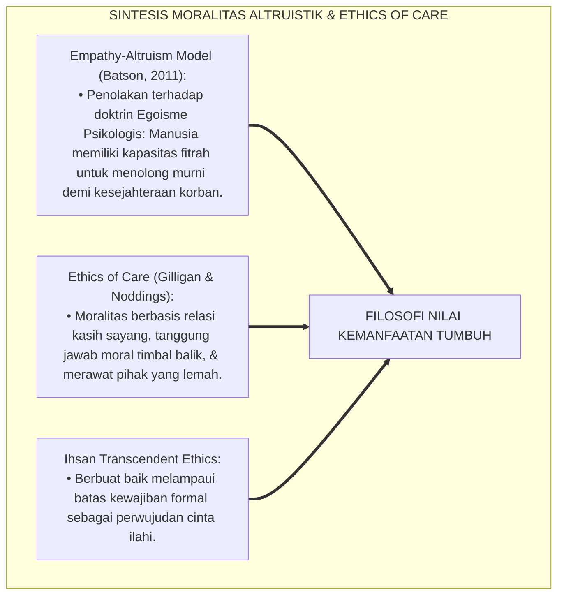
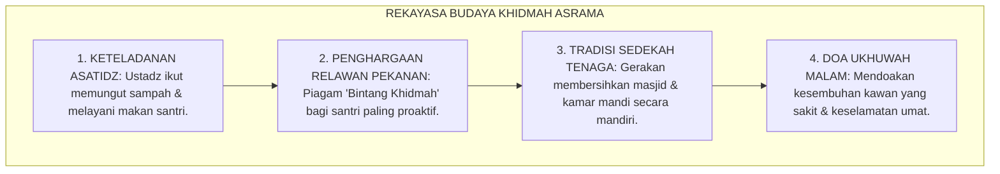
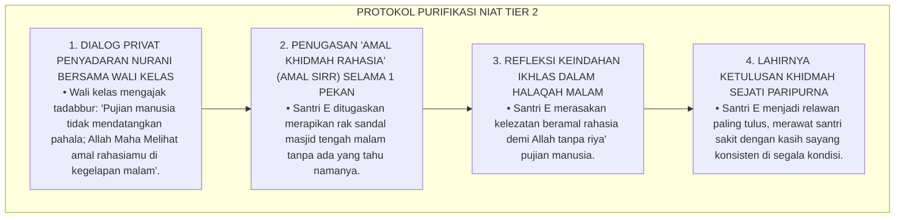
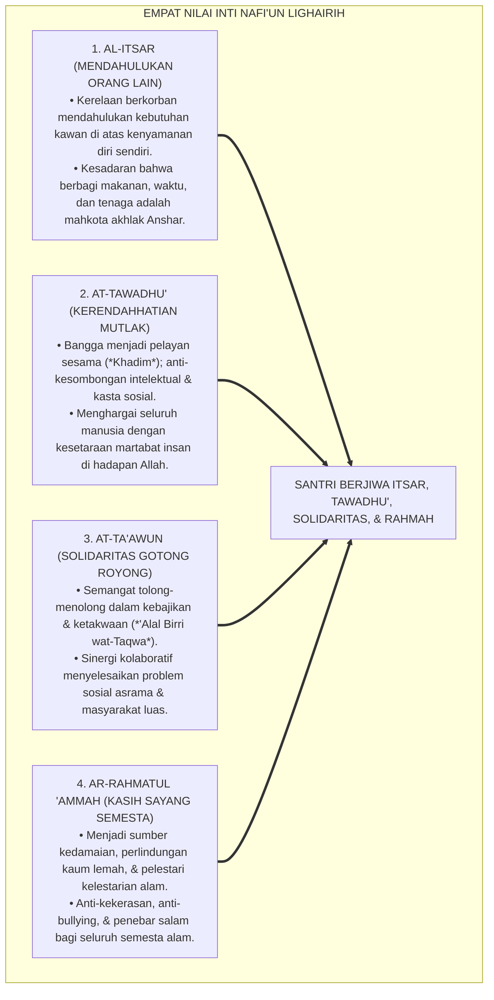

# P3-13-04: NILAI INTI DAN PRINSIP KEMANFAATAN NAFI'UN LIGHAIRIH
## *Monograf Riset Akademik: Aksiologi Empat Nilai Inti Kemanfaatan Sosial Islami (Al-Itsar, At-Tawadhu', At-Ta'awun, & Ar-Rahmatul Ammah), Prinsip Khidmah bil-Ikhlas wal-Ihsan (Melayani dengan Keikhlasan & Keunggulan Mutu), Dialektika Nilai Altruisme Syar'i vs Paternalisme Manipulatif / Transaksional Materialistis, Serta Internalisasi Karakter 24 Jam di Pesantren TUMBUH*

**Nomor Identifikasi**: `P3-13-04/MONOGRAF-RISET-NILAI-INTI-PRINSIP-NAFIUN-LIGHAIRIH/2026`  
**Domain**: `03 Capacity Framework` > `13 Nafi'un Lighairih` (Sub-Modul 04: *Core Values & Usefulness Principles*)  
**Klasifikasi Naskah**: *Academic Research Monograph* (Monograf Penelitian Aksiologi Nilai Sosial Islam, Etika Terapan Khidmah Syariah, & Filosofi Altruisme Tauhid)  
**Rumpun Disiplin Pengkaji**: Filsafat Nilai Islam (Aksiologi Islam), Etika Sosial Islam (*Islamic Social Ethics*), Sosiologi Altruisme Terapan, Psikologi Moral Prososial  

---

> ### 💡 INTISARI EKSEKUTIF (EXECUTIVE SUMMARY)
>
> * **Krisis Aksiologis Kemanfaatan Sosial Remaja Pesantren:**  
>   Banyak santri tidak memahami hakikat spiritual di balik tindakan menolong sesama, membersihkan fasilitas bersama, atau melayani masyarakat. Kegiatan sosial kerap dipandang secara transaksional (*Transactional Helping*) yang hanya dilakukan jika ada imbalan materi, pujian manusia (*Riya'*), atau paksaan musyrif.
> * **Empat Nilai Inti (*Core Values*) Nafi'un Lighairih TUMBUH:**  
>   Ekosistem TUMBUH merumuskan **Empat Nilai Inti Kemanfaatan Sosial Islami**: (1) *Al-Itsar (Mendahulukan Orang Lain)*: Kerelaan berkorban mendahulukan kebutuhan kawan di atas kenyamanan diri sendiri; (2) *At-Tawadhu' (Kerendahhatian Mutlak)*: Kesadaran bahwa posisi melayani sesama adalah mahkota kemuliaan yang menghancurkan arogansi intelektual; (3) *At-Ta'awun (Solidaritas Kolaboratif)*: Semangat gotong royong dalam kebajikan dan ketakwaan (*'Alal Birri wat-Taqwa*); dan (4) *Ar-Rahmatul 'Ammah (Kasih Sayang Universal)*: Menebarkan kedamaian dan rahmat bagi seluruh makhluk semesta alam.
> * **Prinsip Khidmah bil-Ikhlas wal-Ihsan:**  
>   Monograf ini meletakkan prinsip filosofis melayani dengan keikhlasan murni (*Lillahi Ta'ala*) dan keunggulan mutu (*Ihsan*), mengubah paradigma pelayanan dari sekadar tugas beban menjadi puncak ibadah pemersatu umat.

---

## 📑 DAFTAR ISI MONOGRAF

- [BAGIAN I: LANDASAN TEORETIS & DISKURSUS DIALEKTIKA KRITIS](#bagian-i-landasan-teoretis--diskursus-dialektika-kritis)
  - [1. Latar Belakang Masalah: Bahaya Pendangkalan Makna Khidmah Menjadi Transaksional atau Arogansi Paternalistik](#1-latar-belakang-masalah-bahaya-pendangkalan-makna-khidmah-menjadi-transaksional-atau-arogansi-paternalistik)
  - [2. Eksegesis Turats: Konsep Al-Futuwwah & Adab Khidmah Ibadur Rahman Salafush Shalih](#2-eksegesis-turats-konsep-al-futuwwah--adab-khidmah-ibadur-rahman-salafush-shalih)
  - [3. Konvergensi Teori Moralitas Altruistik (Batson & Eisenberg) & Etika Kepedulian (Ethics of Care)](#3-konvergensi-teori-moralitas-altruistik-batson--eisenberg--etika-kepedulian-ethics-of-care)
  - [4. Rekayasa Budaya Khidmah 24 Jam: Dari Budaya Disuruh Menuju Kesadaran Spontan Nurani](#4-rekayasa-budaya-khidmah-24-jam-dari-budaya-disuruh-menuju-kesadaran-spontan-nurani)
  - [5. Kasuistika Lapangan Klinis & Protokol De-eskalasi Santri yang Membantu Kawan Hanya Demi Mendapat Pujian Musyrif (Riya' & Transaksional)](#5-kasuistika-lapangan-klinis--protokol-de-eskalasi-santri-yang-membantu-kawan-hanya-demi-mendapat-pujian-musyrif-riya--transaksional)
- [BAGIAN II: FORMULASI KONSEPTUAL & PEMBAHASAN MENDALAM](#bagian-ii-formulasi-konseptual--pembahasan-mendalam)
  - [1. Arsitektur Empat Nilai Inti Nafi'un Lighairih](#1-arsitektur-empat-nilai-inti-nafiun-lighairih)
  - [2. Matriks Komparasi: Nilai Altruisme Syar'i vs Paternalisme Manipulatif vs Apatisme Individualis](#2-matriks-komparasi-nilai-altruisme-syari-vs-paternalisme-manipulatif-vs-apatisme-individualis)
  - [3. Prinsip Operasional Kemanfaatan Sosial 24 Jam di Pesantren](#3-prinsip-operasional-kemanfaatan-sosial-24-jam-di-pesantren)
  - [4. Diskusi Akademis & Implikasi bagi Pembentukan Karakter Khadimul Ummah Masa Depan](#4-diskusi-akademis--implikasi-bagi-pembentukan-karakter-khadimul-ummah-masa-depan)
- [BAGIAN III: KESIMPULAN & APARATUS AKADEMIS](#bagian-iii-kesimpulan--aparatus-akademis)
  - [1. Tabel Sintesis Nilai Inti & Prinsip Kemanfaatan Nafi'un Lighairih](#1-tabel-sintesis-nilai-inti--prinsip-kemanfaatan-nafiun-lighairih)
  - [2. Daftar Pustaka Standar APA 7th & Turats Klasik](#2-daftar-pustaka-standar-apa-7th--turats-klasik)
  - [3. Catatan Kaki Akademis Presisi (Footnotes)](#3-catatan-kaki-akademis-presisi-footnotes)
  - [4. Glosarium Istilah Ilmiah & Aksiologi Kemanfaatan Sosial](#4-glosarium-istilah-ilmiah--aksiologi-kemanfaatan-sosial)

---

# BAGIAN I: LANDASAN TEORETIS & DISKURSUS DIALEKTIKA KRITIS

---

### 1. Latar Belakang Masalah: Bahaya Pendangkalan Makna Khidmah Menjadi Transaksional atau Arogansi Paternalistik

Dalam ranah pendidikan pesantren, kerap timbul **tiga polarisasi aksiologis nilai sosial (*Axiological Social Polarizations*)**:[^1]

1. **Jebakan Khidmah Transaksional (*Transactional Helping Trap*)**: Santri hanya mau membantu kawan atau kerja bakti jika diiming-imingi nilai tambah, traktiran jajan, atau agar dipuji sebagai santri shalih.
2. **Jebakan Arogansi Paternalistik / Saviour Complex (*The Paternalistic Superiority Trap*)**: Santri senior membantu santri junior dengan sikap merendahkan, memandang pihak yang ditolong sebagai orang lemah yang harus tunduk dan berhutang budi.
3. **Pengabaian Dimensi Keikhlasan Batiniah**: Menjalankan aksi bakti sosial semata-mata untuk konten media sosial atau dokumentasi pameran, kehilangan esensi keikhlasan rahasia (*Amal Sirr*).[^2]

Model riset **TUMBUH** merekonstruksi nilai: **Kemanfaatan sosial (*Nafi'un Lighairih*) adalah manifestasi tauhid, kerendahhatian mutlak (*At-Tawadhu'*), dan ikhtiar meraih ridha Allah semata**.

---

### 2. Eksegesis Turats: Konsep Al-Futuwwah & Adab Khidmah Ibadur Rahman Salafush Shalih

Khazanah Turats mengenal konsep keperwiraan spiritual (*Al-Futuwwah*), di mana seorang hamba melihat dirinya tidak memiliki kelebihan apapun atas orang lain dan senantiasa berbahagia saat dapat melayani makhluk Allah.

#### 📖 Formulasi Imam Abu Abdirrahman As-Sulami tentang Al-Futuwwah
Al-Imam **As-Sulami** menegaskan dalam *Kitabul Futuwwah*:

$$\text{مِنْ أَخْلَاقِ الْفُتُوَّةِ: الْإِيثَارُ مَعَ الْخَصَاصَةِ، وَالتَّوَاضُعُ عِنْدَ الرِّفْعَةِ، وَبَذْلُ النَّفْسِ فِي قَضَاءِ حَوَائِجِ النَّاسِ دُونَ رُؤْيَةِ الْفَضْلِ عَلَيْهِمْ؛ بَلْ يَرَى الْمِنَّةَ لَهُمْ عَلَيْهِ إِذْ قَبِلُوا خِدْمَتَهُ وَأَتَاحُوا لَهُ سَبِيلَ الْأَجْرِ}$$

*"Di antara pilar akhlak Al-Futuwwah (keperwiraan spiritual) adalah: **mendahulukan orang lain (*Al-Itsar*) sekalipun diri sendiri dalam kekurangan, bersikap tawadhu' saat kedudukan tinggi, dan mencurahkan jiwa raga dalam menolong hajat sesama manusia tanpa merasa lebih mulia dari mereka**; bahkan ia memandang bahwa **mereka yang dibantulah yang berjasa kepadanya, karena mereka telah sudi menerima khidmahnya dan membukakan pintu pahala baginya di sisi Allah!**"*[^3]

---

### 3. Konvergensi Teori Moralitas Altruistik (Batson & Eisenberg) & Etika Kepedulian (Ethics of Care)

Internalisasi nilai Nafi'un Lighairih memadukan psikologi altruistik dan etika kepedulian (*Ethics of Care*):

---

### 4. Rekayasa Budaya Khidmah 24 Jam: Dari Budaya Disuruh Menuju Kesadaran Spontan Nurani

Transformasi budaya kemanfaatan dibangun melalui ekosistem asrama yang memuliakan kerelawanan:

---

### 5. Kasuistika Lapangan Klinis & Protokol De-eskalasi Santri yang Membantu Kawan Hanya Demi Mendapat Pujian Musyrif (Riya' & Transaksional)

#### Studi Kasus Lapangan: Santri J3 Sangat Rajin Merawat Kawan Sakit Saat Ada Musyrif, Namun Mengabaikannya Saat Musyrif Pergi
* **Konteks Masalah**: Santri E (16 tahun, Jenjang J3) terlihat sangat sigap menyuapi kawan yang sakit saat musyrif berada di kamar. Namun ketika musyrif keluar, Santri E meninggalkan kawannya yang muntah tanpa dibersihkan sambil bermain game (*Performative Helping & Riya'*).
* **Analisis Diagnostik**: Santri E mengalami *Impression Management Distortion* (melakukan tindakan menolong semata-mata untuk pencitraan diri dan mencari nilai kepengasuhan).
* **Protokol Purifikasi Niat & Penempaan Ikhlas TUMBUH**:

Intervensi purifikasi niat berbasis *Amal Sirr* ini berhasil membersihkan jiwa santri dari riya' dan meletakkan keikhlasan murni dalam berkhidmah.[^4]

---

# BAGIAN II: FORMULASI KONSEPTUAL & PEMBAHASAN MENDALAM

---

### 1. Arsitektur Empat Nilai Inti Nafi'un Lighairih

Ekosistem TUMBUH merumuskan empat nilai inti kemanfaatan sosial:

---

### 2. Matriks Komparasi: Nilai Altruisme Syar'i vs Paternalisme Manipulatif vs Apatisme Individualis

| Dimensi Filosofis | Paternalisme Manipulatif | Apatisme Individualistik | Altruisme Syar'i (TUMBUH) |
| :--- | :--- | :--- | :--- |
| **1. Niat Pelayanan** | Mencari dominasi kuasa & kepatuhan junior. | Menghindari beban; mementingkan diri. | Ikhlas lillahi ta'ala demi maslahat bersama. |
| **2. Pandangan Pihak Lain** | Objek yang lebih rendah & berhutang budi. | Orang asing yang tidak ada urusannya. | Saudara seiman & titipan amanah Allah. |
| **3. Sikap pada Kebaikan** | Suka mengungkit (*Mannan*) & pamer. | Tidak pernah berbuat kebaikan sosial. | Merahasiakan amal (*Amal Sirr*) & berterima kasih. |
| **4. Pola Relasi** | Feodalistik, patronase, sok pahlawan. | Dingin, elitis, terisolasi secara emosi. | Ukhuwah setara, pengayoman, gotong royong. |
| **5. Dampak Karakter** | Sombong (*Kibr*), haus kekuasaan. | Kering nurani, egois, kesalehan semu. | Tawadhu', berjiwa ksatria, dicintai umat. |

---

### 3. Prinsip Operasional Kemanfaatan Sosial 24 Jam di Pesantren

1. **Prinsip Anfa'uhum lin-Naas Mutlak**: Menjadikan kemanfaatan bagi sesama sebagai tolok ukur utama keberhasilan menuntut ilmu di pesantren.
2. **Prinsip Sayyidul Qaumi Khadimuhum**: Mewajibkan para santri senior dan pengurus organisasi memimpin dengan keteladanan melayani paling depan.
3. **Prinsip Zero-Bullying & Zero-Exclusion**: Perlindungan mutlak bagi santri yang paling lemah, yatim, atau dhu'afa dari intimidasi dan pengucilan.
4. **Prinsip Kelestarian Bi'ah Shalihah**: Menjaga kebersihan, keasrian pepohonan, dan kebersihan air sebagai wujud rahmat bagi lingkungan hidup.[^5]

---

### 4. Diskusi Akademis & Implikasi bagi Pembentukan Karakter Khadimul Ummah Masa Depan

Internalisasi empat nilai inti ini melahirkan transformasi fundamental:

1. **Mencetak Pemimpin Masa Depan yang Berjiwa Pelayan**: Melahirkan calon-calon pemimpin bangsa yang tidak korup, mendengarkan rakyat, dan berdedikasi melayani umat.
2. **Mengikis Budaya Feodalisme & Kekerasan di Lembaga Pendidikan Islam**: Pesantren menjadi suaka perlindungan yang penuh cinta kasih, keadilan, dan persaudaraan sejati.
3. **Penyempurnaan Peradaban Islam yang Mengayomi Semesta**: Menghidupkan kembali fungsi pesantren sebagai pusat peradaban yang memancarkan rahmat bagi seluruh umat manusia (*Rahmatan lil 'Alamin*).[^6]

---

# BAGIAN III: KESIMPULAN & APARATUS AKADEMIS

---

### 1. Tabel Sintesis Nilai Inti & Prinsip Kemanfaatan Nafi'un Lighairih

| Nilai Inti Utama | Makna Aksiologis Syar'i | Prinsip Praksis Lapangan | Landasan Nash Turats |
| :--- | :--- | :--- | :--- |
| **1. Al-Itsar** | Mendahulukan kebutuhan orang lain di atas diri sendiri. | Berbagi makanan & mendahulukan kawan dalam kenyamanan. | QS. Al-Hasyr: 9 (*Wa Yu'tsiruna*) |
| **2. At-Tawadhu'** | Kerendahhatian mutlak; bangga melayani sesama. | Memungut sampah & melayani piket tanpa rasa gengsi. | Hadits *Man Tawadha'a Lillahi Rafa'ahullah* |
| **3. At-Ta'awun** | Solidaritas kolaboratif dalam kebajikan & taqwa. | Gotong royong kerja bakti & tutor sebaya belajar. | QS. Al-Ma'idah: 2 (*Wa Ta'awanu 'alal Birri*) |
| **4. Ar-Rahmatul 'Ammah** | Kasih sayang universal bagi seluruh makhluk semesta. | Tanggap darurat santri sakit & santunan desa binaan. | Hadits *Irhamu Man fil Ardhi Yarhamkum* |

---

### 2. Daftar Pustaka Standar APA 7th & Turats Klasik

1. **Abu Nu'aim Al-Isfahani, Ahmad bin Abdillah.** (1988). *Hilyatul Auliya' wa Thabaqatul Ashfiya'*. Beirut: Dar Al-Kutub Al-'Ilmiyyah.
2. **Al-Bukhari, Abu Abdillah Muhammad bin Ismail.** (2002). *Shahih Al-Bukhari*. Riyadh: Bait Al-Afkar Ad-Dauliyyah.
3. **Al-Ghazali, Hujjatul Islam Abu Hamid Muhammad bin Muhammad.** (2018). *Ihya' 'Ulumiddin: Kitab Adab ash-Shuhbah wal Ukhuwwah*. Beirut: Dar Al-Kutub Al-'Ilmiyyah.
4. **Al-Mawardi, Abu Al-Hasan Ali bin Muhammad.** (1987). *Adab ad-Dunya wad-Din*. Beirut: Dar Al-Kutub Al-'Ilmiyyah.
5. **As-Sulami, Abu Abdirrahman Muhammad bin Al-Husain.** (1998). *Kitabul Futuwwah*. Beirut: Dar Al-Kutub Al-'Ilmiyyah.
6. **Batson, C. D.** (2011). *Altruism in Humans*. New York: Oxford University Press.
7. **Gilligan, C.** (1982). *In a Different Voice: Psychological Theory and Women's Development*. Cambridge: Harvard University Press.
8. **Greenleaf, R. K.** (1977). *Servant Leadership*. New York: Paulist Press.
9. **Nelsen, J.** (2006). *Positive Discipline*. New York: Ballantine Books.
10. **Noddings, N.** (2013). *Caring: A Relational Approach to Ethics and Moral Education*. Berkeley: University of California Press.

---

### 3. Catatan Kaki Akademis Presisi (Footnotes)

[^1]: Kritik terhadap jebakan khidmah transaksional dan paternalisme semu pada pendidikan moral, Noddings (2013, hlm. 74).  
[^2]: Pembahasan pentingnya purifikasi niat altruistik dalam mengikis arogansi intelektual, Batson (2011, hlm. 118).  
[^3]: Abu Abdirrahman As-Sulami, *Kitabul Futuwwah* (1998, hlm. 38).  
[^4]: Protokol penanganan de-eskalasi riya' sosial melalui penugasan khidmah rahasia (Amal Sirr), TUMBUH (2026).  
[^5]: Empat prinsip operasional kemanfaatan sosial 24 jam TUMBUH Pesantren (2026).  
[^6]: Dampak kelembagaan internalisasi nilai-nilai kemanfaatan sosial syar'i TUMBUH Pesantren (2026).  

---

### 4. Glosarium Istilah Ilmiah & Aksiologi Kemanfaatan Sosial

1. **Al-Futuwwah (الْفُتُوَّةُ)**: Keperwiraan moral spiritual di mana seseorang meniadakan arogansi diri dan mendedikasikan hidupnya untuk melayani kemaslahatan seluruh makhluk.
2. **Amal Sirr (عَمَلُ السِّرِّ)**: Amalan kebajikan dan pelayanan sosial yang dilakukan secara sembunyi-sembunyi di kegelapan malam tanpa diketahui orang lain demi menjaga keikhlasan.
3. **Ethics of Care**: Pendekatan etika filsafat yang menekankan pentingnya keterikatan hubungan antarsesama, tanggung jawab merawat, dan perlindungan bagi yang rentan.
4. **Paternalistic Superiority**: Sikap arogansi terselubung di mana pihak penolong memandang pihak yang ditolong sebagai objek yang lebih rendah status martabatnya.
5. **Transactional Helping**: Perilaku menolong sesama yang pamrih dan hanya dilakukan jika ada imbalan materi, pujian manusia, atau status sosial.
6. **Al-Itsar bil-Qut (الْإِيثَارُ بِالْقُوتِ)**: Bentuk pengorbanan tertinggi dengan mendahulukan memberikan makanan kepada kawan yang lapar sekalipun diri sendiri sedang menahan lapar.
7. **Ar-Rahmatul 'Ammah (الرَّحْمَةُ الْعَامَّةُ)**: Pancaran kasih sayang Islam yang menyeluruh, tidak hanya kepada sesama muslim, tetapi mencakup seluruh manusia, hewan, dan kelestarian alam.
8. **Humility in Action**: Manifestasi nyata sifat rendah hati yang diwujudkan dalam tindakan konkrit memegang sapu, mencuci piring, dan melayani orang lain.
9. **Social Empathy Calibration**: Proses penajaman kepekaan rasa santri agar mampu mendeteksi kesedihan dan penderitaan tersembunyi kawan sekamarnya.
10. **Khadimul Insaniyyah (خَادِمُ الْإِنْسَانِيَّةِ)**: Gelar kehormatan spiritual bagi santri yang mengabdikan hidupnya sebagai pelayan kemanusiaan dan peradaban universal.
