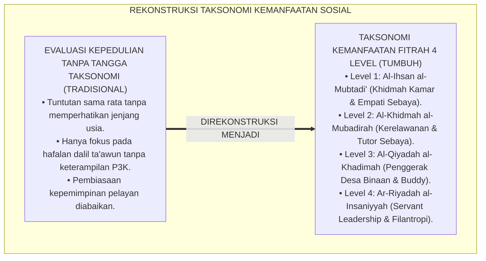
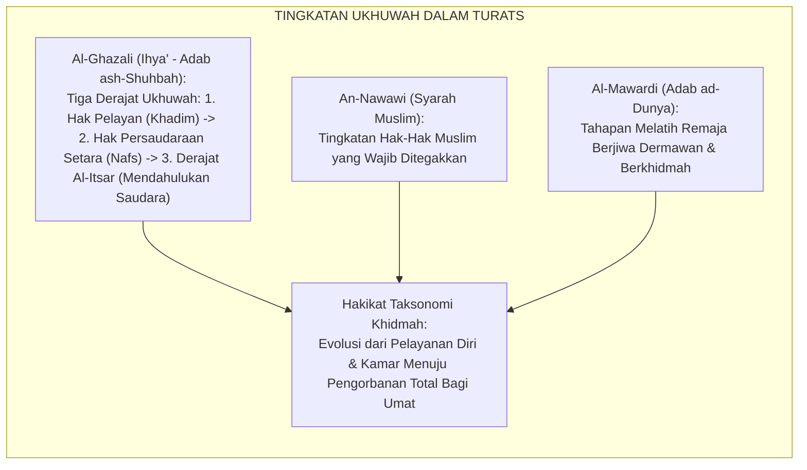
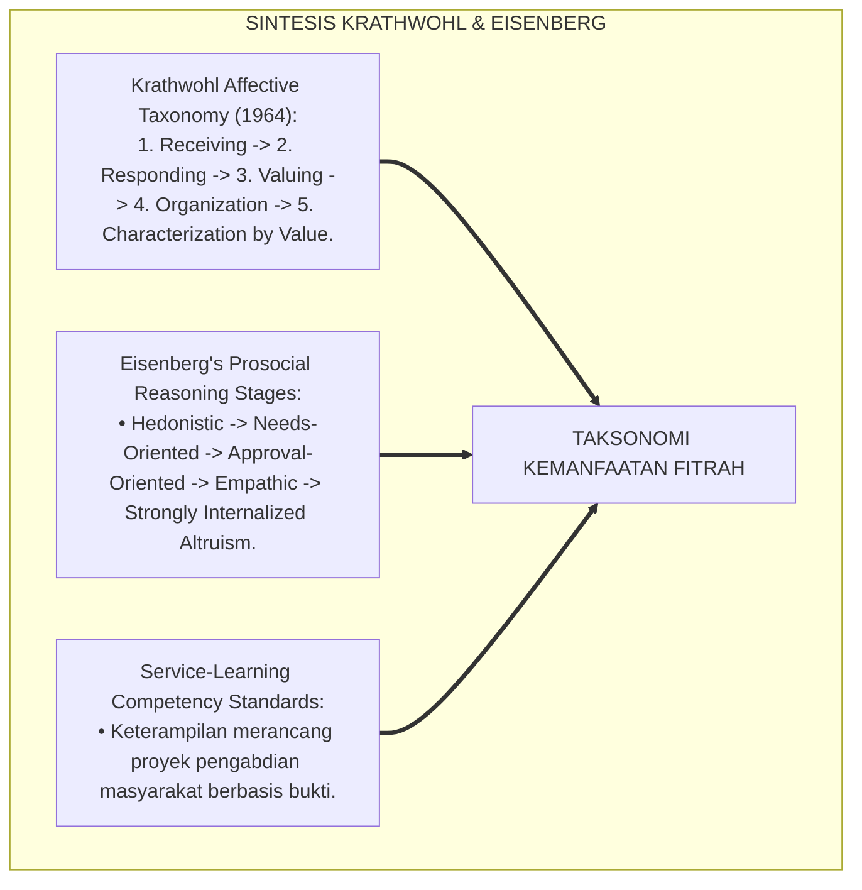
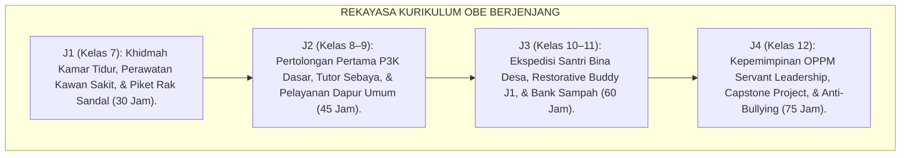
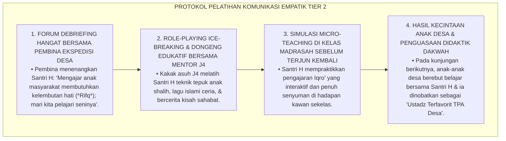
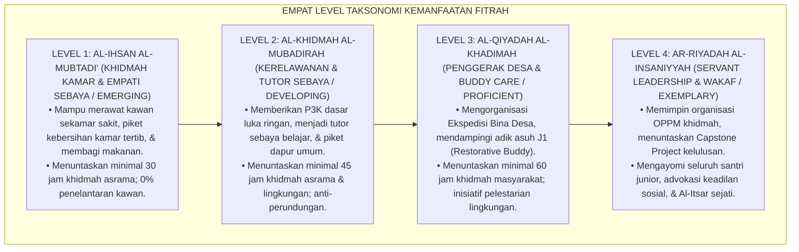
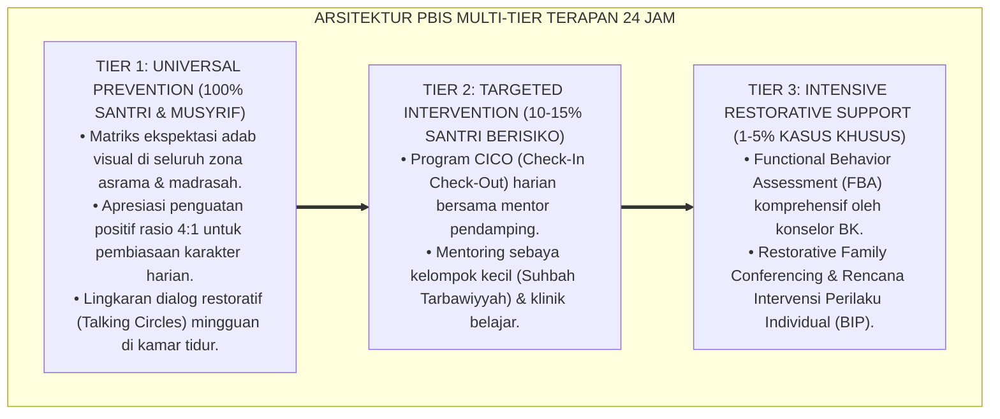

# P3-13-05: STANDAR KOMPETENSI DAN TAKSONOMI NAFI'UN LIGHAIRIH
## *Monograf Riset Akademik: Taksonomi Kemanfaatan Sosial Fitrah 4 Level (Al-Ihsan al-Mubtadi' / Khidmah Kamar & Empati Sebaya, Al-Khidmah al-Mubadirah / Kerelawanan Lingkungan & Tutor Sebaya, Al-Qiyadah al-Khadimah / Penggerak Ekspedisi Bina Desa & Restorative Buddy, Serta Ar-Riyadah al-Insaniyyah / Kepemimpinan Servant Leadership & Transformasi Peradaban), Integrasi Taksonomi Afektif Krathwohl & OBE, Serta Matriks Standar Kompetensi Inti & Dasar (SKI-SKD) Jenjang J1–J4 di Ekosistem Pesantren Berbasis TUMBUH*

**Nomor Identifikasi**: `P3-13-05/MONOGRAF-RISET-STANDAR-KOMPETENSI-TAKSONOMI-NAFIUN-LIGHAIRIH/2026`  
**Domain**: `03 Capacity Framework` > `13 Nafi'un Lighairih` (Sub-Modul 05: *Competency Standards & Taxonomy*)  
**Klasifikasi Naskah**: *Academic Research Monograph* (Monograf Penelitian Desain Taksonomi Kepedulian Sosial Islam, Standarisasi Kompetensi OBE, & Psikomotorik Khidmah Berjenjang)  
**Rumpun Disiplin Pengkaji**: Desain Taksonomi Pembelajaran, Standarisasi Kompetensi Kurikulum OBE, Psikologi Perkembangan Moral Afektif, Manajemen Kepemimpinan Sosial  

---

> ### 💡 INTISARI EKSEKUTIF (EXECUTIVE SUMMARY)
>
> * **Ketiadaan Taksonomi Kemanfaatan Sosial Berjenjang di Pesantren:**  
>   Banyak lembaga pendidikan Islam tidak memiliki tangga taksonomi baku untuk mengukur perkembangan kematangan kepedulian sosial santri. Perilaku khidmah hanya dinilai secara acak, tanpa membedakan antara santri baru yang baru belajar peka merawat kawan sekamar yang sakit (*Emerging*) dengan santri senior yang sudah mampu memimpin ekspedisi bakti sosial desa binaan dan merancang proyek pengabdian masyarakat (*Exemplary*).
> * **Arsitektur Taksonomi Kemanfaatan Sosial Fitrah 4 Level TUMBUH:**  
>   Ekosistem TUMBUH merumuskan **Taksonomi Kemanfaatan Sosial Fitrah 4 Level**: (1) *Level 1: Al-Ihsan al-Mubtadi' (Khidmah Kamar & Empati Sebaya / Emerging)*: Mampu merawat kawan sakit, piket kamar tertib, dan berbagi makanan; (2) *Level 2: Al-Khidmah al-Mubadirah (Kerelawanan Lingkungan & Tutor Sebaya / Developing)*: Mampu memberikan P3K dasar, menjadi tutor sebaya belajar, dan piket dapur umum sukarela; (3) *Level 3: Al-Qiyadah al-Khadimah (Penggerak Bina Desa & Restorative Buddy / Proficient)*: Mengorganisasi program Ekspedisi Santri Bina Desa, mendampingi adik asuh J1 (*Buddy Care*), dan inisiatif peduli lingkungan; dan (4) *Level 4: Ar-Riyadah al-Insaniyyah (Servant Leadership & Filantropi / Exemplary)*: Memimpin organisasi santri (OPPM) dengan prinsip kepemimpinan pelayan, advokasi anti-bullying, dan proyek pengabdian peradaban kelulusan.
> * **Matriks SKI-SKD Jenjang J1–J4 Terpadu:**  
>   Monograf ini memetakan Standar Kompetensi Inti (SKI) dan Standar Kompetensi Dasar (SKD) yang terintegrasi secara longitudinal sepanjang 6 tahun masa pendidikan santri (Kelas 7–12).

---

## 📑 DAFTAR ISI MONOGRAF

- [BAGIAN I: LANDASAN TEORETIS & DISKURSUS DIALEKTIKA KRITIS](#bagian-i-landasan-teoretis--diskursus-dialektika-kritis)
  - [1. Latar Belakang Masalah: Bahaya Evaluasi Kepedulian Sosial Tanpa Tangga Taksonomi Afektif-Psikomotorik](#1-latar-belakang-masalah-bahaya-evaluasi-kepedulian-sosial-tanpa-tangga-taksonomi-afektif-psikomotorik)
  - [2. Eksegesis Turats: Konsep Maratibul Khidmah & Tingkatan Derajat Ukhuwah dalam Fiqh Salaf](#2-eksegesis-turats-konsep-maratibul-khidmah--tingkatan-derajat-ukhuwah-dalam-fiqh-salaf)
  - [3. Konvergensi Sains Taksonomi Afektif Krathwohl & Prosocial Moral Reasoning (Eisenberg)](#3-konvergensi-sains-taksonomi-afektif-krathwohl--prosocial-moral-reasoning-eisenberg)
  - [4. Analisis Rekayasa Kurikulum OBE 24 Jam: Dari Merawat Kawan Kamar Menuju Pengabdian Peradaban](#4-analisis-rekayasa-kurikulum-obe-24-jam-dari-merawat-kawan-kamar-menuju-pengabdian-peradaban)
  - [5. Kasuistika Lapangan Klinis & Protokol Pendampingan Santri J3 yang Canggung Berkomunikasi Saat Mengajar TPA Desa Binaan](#5-kasuistika-lapangan-klinis--protokol-pendampingan-santri-j3-yang-canggung-berkomunikasi-saat-mengajar-tpa-desa-binaan)
- [BAGIAN II: FORMULASI KONSEPTUAL & PEMBAHASAN MENDALAM](#bagian-ii-formulasi-konseptual--pembahasan-mendalam)
  - [1. Arsitektur Taksonomi Kemanfaatan Sosial Fitrah Empat Level TUMBUH](#1-arsitektur-taksonomi-kemanfaatan-sosial-fitrah-empat-level-tumbuh)
  - [2. Matriks Rinci Standar Kompetensi Inti (SKI) dan Standar Kompetensi Dasar (SKD) Jenjang J1–J4](#2-matriks-rinci-standar-kompetensi-inti-ski-dan-standar-kompetensi-dasar-skd-jenjang-j1j4)
  - [3. Kriteria Verifikasi Kinerja dan Portofolio Jam Khidmah Sosial Santri](#3-kriteria-verifikasi-kinerja-dan-portofolio-jam-khidmah-sosial-santri)
  - [4. Diskusi Akademis & Implikasi bagi Tata Kelola Pendidikan Kepemimpinan Pesantren Abad 21](#4-diskusi-akademis--implikasi-bagi-tata-kelola-pendidikan-kepemimpinan-pesantren-abad-21)
- [BAGIAN III: KESIMPULAN & APARATUS AKADEMIS](#bagian-iii-kesimpulan--aparatus-akademis)
  - [1. Tabel Sintesis Standar Kompetensi & Taksonomi Nafi'un Lighairih](#1-tabel-sintesis-standar-kompetensi--taksonomi-nafiun-lighairih)
  - [2. Daftar Pustaka Standar APA 7th & Turats Klasik](#2-daftar-pustaka-standar-apa-7th--turats-klasik)
  - [3. Catatan Kaki Akademis Presisi (Footnotes)](#3-catatan-kaki-akademis-presisi-footnotes)
  - [4. Glosarium Istilah Ilmiah & Taksonomi Khidmah Sosial](#4-glosarium-istilah-ilmiah--taksonomi-khidmah-sosial)

---

# BAGIAN I: LANDASAN TEORETIS & DISKURSUS DIALEKTIKA KRITIS

---

### 1. Latar Belakang Masalah: Bahaya Evaluasi Kepedulian Sosial Tanpa Tangga Taksonomi Afektif-Psikomotorik

Dalam praksis pendidikan karakter sosial di madrasah dan asrama pesantren, kerap timbul **tiga kelemahan pedagogis kurikulum (*Curricular Pedagogical Weaknesses*)**:[^1]

1. **Jebakan Penilaian Tanpa Gradasi Kematangan (*Gradationless Evaluation Trap*)**: Santri kelas 7 dan santri kelas 12 dituntut memiliki beban kepemimpinan masyarakat yang sama tanpa mempertimbangkan kapasitas perkembangan sosialnya.
2. **Ketiadaan Tangga Kompetensi Afektif-Psikomotorik Khidmah**: Lembaga tidak membedakan antara kompetensi empati dasar (membantu kawan sekamar) dengan kompetensi kepemimpinan kolaboratif tingkat lanjut (menggerakkan advokasi sosial masyarakat).
3. **Pengabaian Keterampilan Eksekusi Pelayanan Riil**: Santri hanya diajarkan dalil ayat tentang tolong-menolong (*Ta'awun*), namun tidak pernah dilatih keterampilan teknis evakuasi bencana, perawatan luka P3K, atau teknik mediasi perselisihan kawan.[^2]

Model riset **TUMBUH** merancang **Taksonomi Kemanfaatan Sosial Fitrah 4 Level** yang menyelaraskan perkembangan kognitif, afektif, dan psikomotorik pelayanan santri secara terpadu.

---

### 2. Eksegesis Turats: Konsep Maratibul Khidmah & Tingkatan Derajat Ukhuwah dalam Fiqh Salaf

Khazanah Turats membedakan tahapan kematangan ukhuwah dan khidmah (*Maratibul Khidmah wal Ukhuwwah*) dari derajat pemenuhan hak minimal sesama muslim hingga derajat tertinggi *Al-Itsar*.

#### 📖 Formulasi Imam Al-Ghazali tentang Tiga Derajat Ukhuwah
Imam **Al-Ghazali** menjelaskan dalam *Ihya' 'Ulumiddin*:

$$\text{دَرَجَاتُ الْأُخُوَّةِ وَالْخِدْمَةِ ثَلَاثٌ: أَدْنَاهَا: أَنْ تُنْزِلَ أَخَاكَ مَنْزِلَةَ مَمْلُوكِكَ فَتَقُومَ بِحَاجَتِهِ مِنْ فَضْلِ مَالِكَ؛ وَأَوْسَطُهَا: أَنْ تُنْزِلَهُ مَنْزِلَةَ نَفْسِكَ فَتُشَارِكَهُ فِي مَالِكَ وَرَاحَتِكَ؛ وَأَعْلَاهَا — وَهِيَ دَرَجَةُ الصِّدِّيقِينَ — أَنْ تُؤْثِرَهُ عَلَى نَفْسِكَ وَتُقَدِّمَ حَاجَتَهُ عَلَى حَاجَتِكَ مَعَ خَصَاصَتِكَ}$$

*"**Tingkatan persaudaraan dan pelayanan (*Darajātul Ukhuwwah wal Khidmah*) ada tiga tingkatan**: (1) **Tingkat Terendah**: Engkau menempatkan saudaramu seperti kedudukan pelayanmu, di mana engkau menolong hajatnya dari kelebihan hartamu saat ia meminta; (2) **Tingkat Menengah**: Engkau menempatkan saudaramu sederajat dengan dirimu sendiri, di mana engkau membagi hartamu dan kenyamananmu bersamanya secara setara; dan (3) **Tingkat Tertinggi (Derajat Kaum Shiddiqin)**: **Engkau mendahulukan saudaramu di atas dirimu sendiri (*Al-Itsar*) dan mengutamakan hajat keperluannya di atas kebutuhanmu sendiri sekalipun engkau sedang dalam kesusahan!**"*[^3]

---

### 3. Konvergensi Sains Taksonomi Afektif Krathwohl & Prosocial Moral Reasoning (Eisenberg)

Taksonomi Nafi'un Lighairih memadukan Taksonomi Domain Afektif David Krathwohl dan tahapan penalaran prososial Nancy Eisenberg:

---

### 4. Analisis Rekayasa Kurikulum OBE 24 Jam: Dari Merawat Kawan Kamar Menuju Pengabdian Peradaban

Kurikulum kemanfaatan sosial diorganisasikan secara berjenjang selaras dengan fase kematangan santri:

---

### 5. Kasuistika Lapangan Klinis & Protokol Pendampingan Santri J3 yang Canggung Berkomunikasi Saat Mengajar TPA Desa Binaan

#### Studi Kasus Lapangan: Santri J3 Gugup dan Membentak Anak-Anak Desa Saat Mengajar Iqro' di Masjid Desa
* **Konteks Masalah**: Tim Santri J3 ditugaskan mengajar TPA gratis di Desa Binaan. Santri H (16 tahun) merasa sangat gugup menghadapi anak-anak desa yang aktif berlarian. Karena tidak sabar dan kehilangan kendali emosi, Santri H membentak seorang anak kecil hingga menangis dan orang tuanya tersinggung (*Pedagogical Social Anxiety & Communication Breakdown*).
* **Analisis Diagnostik**: Santri H mengalami *Social Communication Deficit* (belum menguasai metodologi komunikasi ramah anak dan didaktik pengajaran masyarakat).
* **Protokol Remediasi Pelatihan Komunikasi Empatik & Micro-Teaching TUMBUH**:

Pendekatan edukatif berbasis *Micro-Teaching* dan simulasi ramah anak ini mengubah kecanggungan sosial menjadi keterampilan dakwah yang sangat memikat.[^4]

---

# BAGIAN II: FORMULASI KONSEPTUAL & PEMBAHASAN MENDALAM

---

### 1. Arsitektur Taksonomi Kemanfaatan Sosial Fitrah Empat Level TUMBUH

Ekosistem TUMBUH menetapkan empat level kematangan kemanfaatan sosial:

---

### 2. Matriks Rinci Standar Kompetensi Inti (SKI) dan Standar Kompetensi Dasar (SKD) Jenjang J1–J4

#### Matriks SKI-SKD Kapasitas Nafi'un Lighairih:

| Jenjang & Level Taksonomi | Standar Kompetensi Inti (SKI) | Standar Kompetensi Dasar (SKD) |
| :--- | :--- | :--- |
| **Jenjang J1 (Kelas 7) *Level 1: Al-Ihsan al-Mubtadi'*** | Mampu menampilkan kepekaan empati dasar pada kawan sekamar, menjalankan piket kebersihan kamar, dan membantu kawan yang sakit dengan bimbingan musyrif. | **1.1** Menjaga dan merawat kawan sekamar yang sakit serta melaporkan ke Poskestren $\le 15\text{ menit}$. **1.2** Melaksanakan piket kebersihan kamar tidur dan slot rak sandal pribadi secara sukarela. **1.3** Membiasakan berbagi makanan, perlengkapan mandi, dan senyuman ramah kepada kawan. **1.4** Menuntaskan minimal 30 jam khidmah asrama terverifikasi dalam setahun. |
| **Jenjang J2 (Kelas 8–9) *Level 2: Al-Khidmah al-Mubadirah*** | Mampu menunjukkan inisiatif kerelawanan dalam pemeliharaan fasilitas umum asrama, terampil memberikan P3K dasar, dan membantu kawan dalam belajar. | **2.1** Menguasai keterampilan pertolongan pertama (P3K) dasar pada luka ringan dan mimisan. **2.2** Menjadi tutor sebaya (*Peer Tutor*) membantu kawan yang kesulitan hafalan Al-Qur'an/kitab. **2.3** Berpartisipasi aktif dalam piket pelayanan dapur umum dan gerakan pemilahan sampah. **2.4** Menuntaskan minimal 45 jam khidmah asrama dan lingkungan per tahun ajaran. |
| **Jenjang J3 (Kelas 10–11) *Level 3: Al-Qiyadah al-Khadimah*** | Mampu mengorganisasi program pelayanan sosial kemasyarakatan, mendampingi adik kelas junior, dan menggerakkan inisiatif pelestarian lingkungan asrama. | **3.1** Mengorganisasi dan mengajar pada program Ekspedisi Santri Bina Desa (TPA & bakti warga). **3.2** Menjadi *Restorative Buddy* mendampingi adik asuh jenjang J1 yang mengalami homesickness. **3.3** Memelopori program pengelolaan bank sampah, komposting, dan penanaman pohon asrama. **3.4** Menuntaskan minimal 60 jam khidmah kemasyarakatan per tahun ajaran. |
| **Jenjang J4 (Kelas 12) *Level 4: Ar-Riyadah al-Insaniyyah*** | Mampu memimpin organisasi santri berbasis prinsip murni *Servant Leadership*, melindungi adik kelas dari bullying, dan menuntaskan proyek pengabdian peradaban. | **4.1** Memimpin organisasi santri (OPPM) dengan keteladanan melayani paling depan tanpa kekerasan. **4.2** Menjadi garda terdepan penegakan Zero-Bullying Policy dan perlindungan santri lemah. **4.3** Merancang dan menuntaskan karya proyek pengabdian peradaban (*Capstone Civilizational Project*). **4.4** Menampilkan kepribadian *Khadimul Ummah* sejati yang siap mengabdikan ilmu bagi bangsa. |

---

### 3. Kriteria Verifikasi Kinerja dan Portofolio Jam Khidmah Sosial Santri

Sebagai bukti ketercapaian kompetensi:
1. **Buku Kartu Jam Khidmah Digital (SIM-Pesantren Log)**: Rekam jejak seluruh aktivitas pelayanan sosial santri yang divalidasi dengan paraf pembina/tokoh masyarakat.
2. **Portofolio Capstone Civilizational Project**: Berkas laporan perancangan, dokumentasi foto/video, dan testimoni penerima manfaat pengabdian masyarakat.
3. **Sertifikat Kelulusan Khadimul Ummah**: Diberikan kepada santri yang tuntas menempuh $\ge 210\text{ Jam Khidmah}$ akumulatif selama 6 tahun pendidikan.[^5]

---

### 4. Diskusi Akademis & Implikasi bagi Tata Kelola Pendidikan Kepemimpinan Pesantren Abad 21

Penerapan taksonomi kemanfaatan sosial fitrah melahirkan lompatan mutu pendidikan:

1. **Transformasi Pesantren Menjadi Kawah Candradimuka Pemimpin Pelayan**: Pesantren tidak mencetak birokrat yang feodal, melainkan mencetak pemimpin bangsa yang tulus melayani rakyat.
2. **Pengokohan Integrasi Pesantren dengan Masyarakat Luar**: Hubungan pesantren dan desa sekitar terjalin sangat harmonis, saling mendukung, dan terbebas dari gesekan sosial.
3. **Penyempurnaan Standar Akreditasi Kepengasuhan Berkelanjutan**: Pesantren membuktikan bahwa capaian afektif kepedulian sosial dapat distandarisasi secara kuantitatif dan kualitatif berbasis OBE.[^6]

---

---

### Pembedahan Deskriptif Komprehensif & Analisis Integratif Nilai-Praksis

Penerapan konsep **P3-13-05: STANDAR KOMPETENSI DAN TAKSONOMI NAFI'UN LIGHAIRIH** di ekosistem pesantren berbasis sistem TUMBUH memerlukan pemahaman multidimensional yang memadukan khazanah turats syariat dan konsensus sains pendidikan modern:

#### A. Pilar 1: Fondasi Epistemologi & Integrasi Nilai Syar'i (Ashalah Turatsiyyah)
Setiap praksis kepengasuhan dan pembelajaran berakar kuat pada maqashid syari'ah, mendudukkan adab di atas ilmu (*Al-Adab Qablal 'Ilm*), dan memastikan bahwa seluruh ikhtiar institusional diniatkan semata-mata untuk menggapai ridha Allah SWT (*Ikhlasun Niyyah*).

#### B. Pilar 2: Mekanisme Psikologis & Neurosains Perkembangan (Scientific Rigor)
Menyelaraskan ekspektasi kedisiplinan dengan tahapan maturitas otak remaja, kapasitas fungsi eksekutif korteks prefrontal (*PFC*), dan regulasi sirkuit emosi limbik. Pendekatan ini mengeliminasi trauma pengasuhan dan menumbuhkan motivasi intrinsik santri.

#### C. Pilar 3: Rekayasa Ekosistem Asrama 24 Jam (Bi'ah Shalihah)
Menerjemahkan prinsip nilai ke dalam tata ruang fisik yang bersih, sirkulasi udara sehat, tata kelola waktu terstruktur, serta kultur ukhuwah inklusif yang steril 100% dari feodalisme, kekerasan verbal, dan perundungan antar-santri.

#### D. Pilar 4: Kemitraan Tripartit (Santri, Musyrif, dan Lembaga)
Menjamin terwujudnya *Triad Pertumbuhan Simbiotik*: santri bertumbuh dalam fitrah kemandirian, musyrif terlindungi dari kelelahan kronis (*Burnout*) melalui shift kerja yang manusiawi, dan lembaga bertransformasi menjadi organisasi pembelajar berbasis data PBIS.

---

### Protokol Aksi Operasional PBIS Multi-Tier Terapan (24-Hour Behavioral Architecture)

---

# BAGIAN III: KESIMPULAN & APARATUS AKADEMIS

---

### 1. Tabel Sintesis Standar Kompetensi & Taksonomi Nafi'un Lighairih

| Tingkat Taksonomi | Karakteristik Kematangan | Target Utama Jenjang | Standar Krathwohl (1964) | Output Perilaku Teramati |
| :--- | :--- | :--- | :--- | :--- |
| **Level 1: Al-Ihsan** | Khidmah kamar & empati sebaya. | Jenjang J1 (Kelas 7) | *Receiving & Responding* | Rawat kawan sakit, piket kamar, 30 jam khidmah. |
| **Level 2: Al-Khidmah** | Kerelawanan lingkungan & P3K. | Jenjang J2 (Kelas 8–9) | *Valuing (Altruism)* | P3K luka, tutor sebaya, piket dapur, 45 jam khidmah. |
| **Level 3: Al-Qiyadah** | Penggerak desa & buddy care. | Jenjang J3 (Kelas 10–11) | *Organization of Values* | Ekspedisi desa, restorative buddy J1, 60 jam khidmah. |
| **Level 4: Ar-Riyadah** | Servant leadership & filantropi. | Jenjang J4 (Kelas 12) | *Characterization (Khadim)* | Memimpin OPPM khidmah, Capstone Project, Zero Bullying. |

---

### 2. Daftar Pustaka Standar APA 7th & Turats Klasik

1. **Al-Bukhari, Abu Abdillah Muhammad bin Ismail.** (2002). *Shahih Al-Bukhari*. Riyadh: Bait Al-Afkar Ad-Dauliyyah.
2. **Al-Ghazali, Hujjatul Islam Abu Hamid Muhammad bin Muhammad.** (2018). *Ihya' 'Ulumiddin: Kitab Adab ash-Shuhbah wal Ukhuwwah*. Beirut: Dar Al-Kutub Al-'Ilmiyyah.
3. **Al-'Izz bin Abdissalam, As-Sulami.** (1999). *Qawa'idul Ahkam fi Mashalihil Anam*. Beirut: Dar Al-Kutub Al-'Ilmiyyah.
4. **Eisenberg, N., Fabes, R. A., & Spinrad, T. L.** (2006). *Prosocial Development*. In *Handbook of Child Psychology* (Vol. 3). Hoboken: Wiley.
5. **Greenleaf, R. K.** (2002). *Servant Leadership: A Journey into the Nature of Legitimate Power and Greatness*. New York: Paulist Press.
6. **Krathwohl, D. R., Bloom, B. S., & Masia, B. B.** (1964). *Taxonomy of Educational Objectives: The Classification of Educational Goals. Handbook II: Affective Domain*. New York: David McKay Company.
7. **Nawawi, Muhyiddin Yahya bin Syaraf.** (2011). *Riyadhus Shalihin*. Kairo: Dar Al-Hadits.
8. **Nelsen, J.** (2006). *Positive Discipline*. New York: Ballantine Books.
9. **Putnam, R. D.** (2000). *Bowling Alone*. New York: Simon & Schuster.
10. **Spady, W. G.** (1994). *Outcome-Based Education: Critical Issues and Answers*. Arlington: American Association of School Administrators.

---

### 3. Catatan Kaki Akademis Presisi (Footnotes)

[^1]: Kritik terhadap ketiadaan tangga taksonomi bertingkat dalam kurikulum kepedulian sosial sekolah berasrama, Krathwohl, Bloom, & Masia (1964, hlm. 48).  
[^2]: Pembahasan pentingnya taksonomi kompetensi prososial terstandarisasi, Eisenberg, Fabes, & Spinrad (2006, hlm. 658).  
[^3]: Al-Ghazali, *Ihya' 'Ulumiddin* (2018, Jilid 2, hlm. 168).  
[^4]: Protokol pelatihan komunikasi empatik dan micro-teaching dakwah desa binaan, TUMBUH (2026).  
[^5]: Kriteria verifikasi portofolio jam khidmah sosial dan sertifikasi kelulusan Khadimul Ummah TUMBUH (2026).  
[^6]: Dampak kelembagaan penerapan taksonomi kemanfaatan sosial OBE terhadap akreditasi pesantren (2026).  

---

### 4. Glosarium Istilah Ilmiah & Taksonomi Khidmah Sosial

1. **Taksonomi Kemanfaatan Sosial Fitrah**: Tangga evolusi kematangan santri dalam melayani sesama, dari empati kamar tidur (Level 1) hingga kepemimpinan peradaban pelayan umat (Level 4).
2. **Al-Ihsan al-Mubtadi' (الْإِحْسَانُ الْمُبْتَدِئُ)**: Tingkat kematangan awal di mana santri mampu merawat kawan sekamar yang sakit, menjaga piket kamar, dan berbagi makanan.
3. **Al-Khidmah al-Mubadirah (الْخِدْمَةُ الْمُبَادِرَةُ)**: Tingkat kematangan terampil di mana santri mampu memberikan P3K dasar, menjadi tutor sebaya, dan piket dapur umum.
4. **Al-Qiyadah al-Khadimah (الْقِيَادَةُ الْخَادِمَةُ)**: Tingkat kematangan mandiri di mana santri mengorganisasi ekspedisi desa binaan dan menjadi pendamping adik asuh J1.
5. **Ar-Riyadah al-Insaniyyah (الرِّيَادَةُ الْإِنْسَانِيَّةُ)**: Tingkat kematangan tertinggi di mana santri memimpin organisasi OPPM khidmah, advokasi keadilan sosial, dan Capstone Project.
6. **Krathwohl Affective Taxonomy**: Kerangka taksonomi ranah afektif yang mengukur proses internalisasi nilai moral dari penerimaan (*Receiving*) hingga karakterisasi (*Characterization*).
7. **Prosocial Moral Reasoning**: Kemampuan nalar seseorang dalam mengambil keputusan moral untuk menolong sesama di tengah situasi dilema sosial.
8. **Kartu Jam Khidmah Digital**: Buku kendali elektronik dalam sistem SIM-Pesantren untuk mencatat akumulasi jam pengabdian sosial nyata santri.
9. **Peer Tutoring (Tutor Sebaya)**: Metode pembelajaran kolaboratif di mana santri yang mahir membimbing kawan sebayanya yang mengalami kesulitan belajar hafalan.
10. **Servant Leader OPPM**: Pengurus organisasi santri yang menjalankan roda kepemimpinan dengan prinsip melayani, mengayomi, dan bebas dari senioritas feodal.
