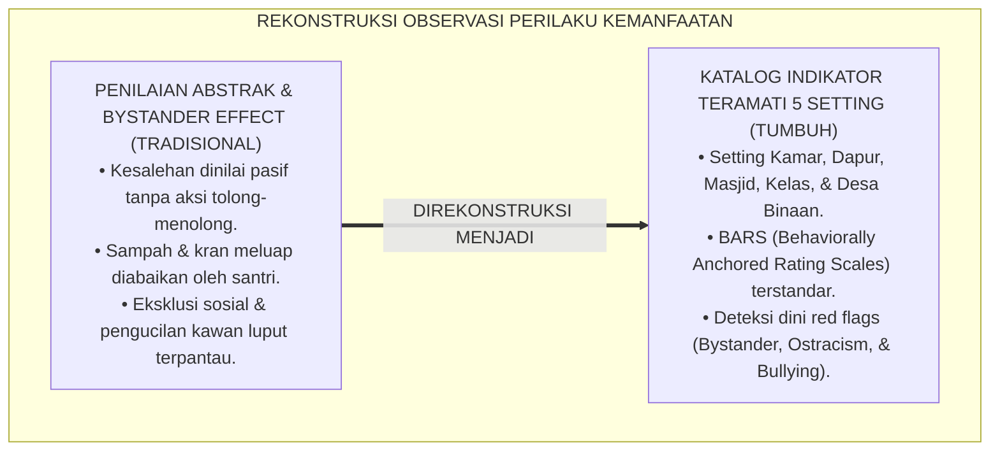
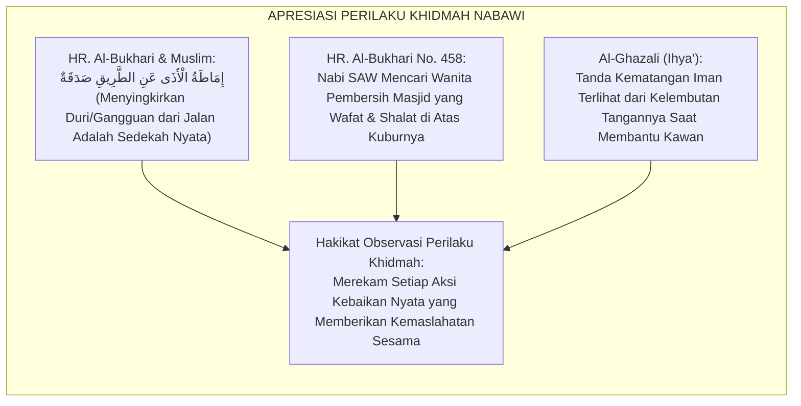
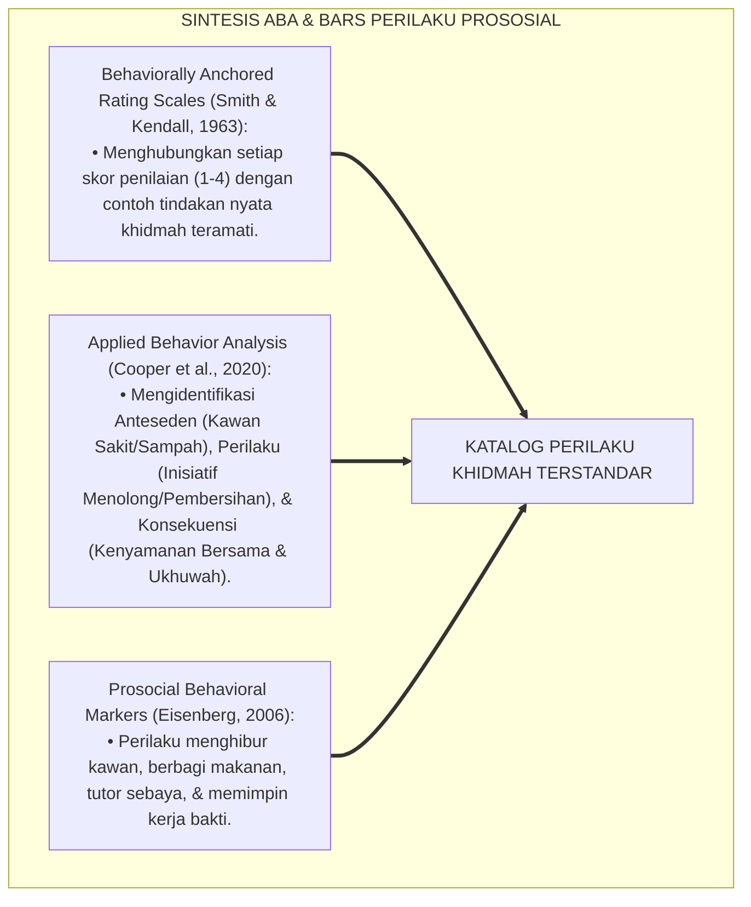
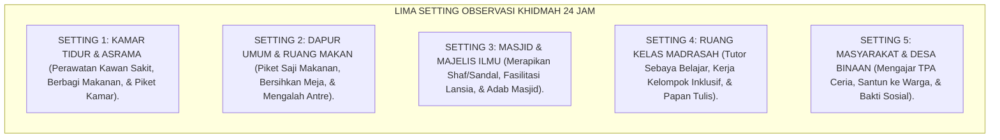
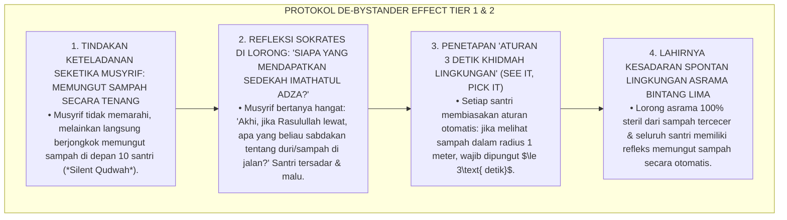

# P3-13-06: MANIFESTASI PERILAKU SANTRI NAFI'UN LIGHAIRIH
## *Monograf Riset Akademik: Katalog Indikator Perilaku Teramati (Observable Behavioral Markers) Kemanfaatan Sosial Santri di Lima Setting Ekosistem 24 Jam (Kamar Tidur/Asrama, Dapur Umum & Ruang Makan, Masjid & Majelis Ilmu, Ruang Kelas Madrasah, Serta Masyarakat/Desa Binaan), Deteksi Dini Pola Sikap Egois (Social Apathy, Feudal Seniority, & Bystander Effect), Serta Protokol Penguatan Perilaku Prososial di Pesantren TUMBUH*

**Nomor Identifikasi**: `P3-13-06/MONOGRAF-RISET-MANIFESTASI-PERILAKU-NAFIUN-LIGHAIRIH/2026`  
**Domain**: `03 Capacity Framework` > `13 Nafi'un Lighairih` (Sub-Modul 06: *Observable Behavioral Markers*)  
**Klasifikasi Naskah**: *Academic Research Monograph* (Monograf Penelitian Perilaku Prososial Terapan, Taksonomi Indikator Teramati, & Asesmen Kinerja Pelayanan 24 Jam)  
**Rumpun Disiplin Pengkaji**: Psikologi Perilaku Prososial, Sosiologi Mikro Kehidupan Asrama, Metodologi Observasi Klinis, Manajemen Perilaku Kepemimpinan  

---

> ### 💡 INTISARI EKSEKUTIF (EXECUTIVE SUMMARY)
>
> * **Kelemahan Observasi Perilaku Kepedulian di Asrama:**  
>   Banyak musyrif menilai kepedulian sosial santri hanya berdasarkan penilaian subjektif tanpa memiliki katalog perilaku teramati (*Observable Behavioral Anchors*). Akibatnya, santri yang bersikap acuh tak acuh saat kawan sekamarnya sakit, santri yang melakukan tindakan perundungan verbal terselubung, atau fenomena efek penonton (*Bystander Effect*) saat melihat sampah tercecer luput dari pencatatan dan pembinaan.
> * **Katalog Indikator Perilaku Teramati di Lima Setting 24 Jam TUMBUH:**  
>   Ekosistem TUMBUH merumuskan katalog komprehensif perilaku kemanfaatan sosial vs egosentrisme pasif di 5 setting kehidupan santri: (1) *Kamar Tidur & Asrama (Merawat kawan sakit $\le 15\text{ menit}$, berbagi makanan, piket kamar sukarela)*; (2) *Dapur Umum & Ruang Makan (Piket saji makanan ramah, membersihkan meja makan, mengalah dalam antrean)*; (3) *Masjid & Majelis Ilmu (Merapikan shaf & rak sandal, menghidupkan majelis tadarus, memfasilitasi lansia)*; (4) *Ruang Kelas Madrasah (Tutor sebaya belajar, kerja kelompok inklusif, menghapus papan tulis sukarela)*; dan (5) *Masyarakat & Desa Binaan (Mengajar TPA ceria, santun kepada warga desa, bakti sosial lingkungan)*.
> * **Protokol Deteksi Dini & Penguatan Perilaku 4:1:**  
>   Monograf ini menetapkan indikator bendera merah (*Red Flag Behavioral Markers*) untuk mendeteksi penindasan senioritas (*Seniority Oppression*), pengucilan sosial (*Social Ostracism*), dan apatisme lingkungan sebelum berkembang menjadi krisis moral di pesantren.

---

## 📑 DAFTAR ISI MONOGRAF

- [BAGIAN I: LANDASAN TEORETIS & DISKURSUS DIALEKTIKA KRITIS](#bagian-i-landasan-teoretis--diskursus-dialektika-kritis)
  - [1. Latar Belakang Masalah: Bahaya Penilaian Kepedulian Abstrak Tanpa Katalog Perilaku Baku](#1-latar-belakang-masalah-bahaya-penilaian-kepedulian-abstrak-tanpa-katalog-perilaku-baku)
  - [2. Eksegesis Turats: Kaidah Al-Birr wal Ihsan & Pengamatan Perilaku Shahabat oleh Rasulullah SAW](#2-eksegesis-turats-kaidah-al-birr-wal-ihsan--pengamatan-perilaku-shahabat-oleh-rasulullah-saw)
  - [3. Konvergensi Applied Behavior Analysis (ABA) & Behavioral Anchored Rating Scales (BARS) Prososial](#3-konvergensi-applied-behavior-analysis-aba--behavioral-anchored-rating-scales-bars-prososial)
  - [4. Rekayasa Ekologi Asrama 24 Jam: Pemetaan 5 Setting Kehidupan & Isyarat Kemanfaatan Sosial](#4-rekayasa-ekologi-asrama-24-jam-pemetaan-5-setting-kehidupan--isyarat-kemanfaatan-sosial)
  - [5. Kasuistika Lapangan Klinis & Protokol Intervensi Santri yang Mengabaikan Sampah Berserakan Karena Merasa 'Bukan Tugas Saya' (Bystander Effect)](#5-kasuistika-lapangan-klinis--protokol-intervensi-santri-yang-mengabaikan-sampah-berserakan-karena-merasa-bukan-tugas-saya-bystander-effect)
- [BAGIAN II: FORMULASI KONSEPTUAL & PEMBAHASAN MENDALAM](#bagian-ii-formulasi-konseptual--pembahasan-mendalam)
  - [1. Katalog Komprehensif Perilaku Teramati di Lima Setting Kehidupan 24 Jam](#1-katalog-komprehensif-perilaku-teramati-di-lima-setting-kehidupan-24-jam)
  - [2. Matriks Komparasi: Indikator Perilaku Kemanfaatan Positif vs Pola Egosentrisme Negatif](#2-matriks-komparasi-indikator-perilaku-kemanfaatan-positif-vs-pola-egosentrisme-negatif)
  - [3. Indikator Bendera Merah (Red Flags) Apatisme Sosial & Protokol Penguatan Rasio 4:1](#3-indikator-bendera-merah-red-flags-apatisme-sosial--protokol-penguatan-rasio-41)
  - [4. Diskusi Akademis & Implikasi bagi Penjaminan Mutu Iklim Ukhuwah Pesantren](#4-diskusi-akademis--implikasi-bagi-penjaminan-mutu-iklim-ukhuwah-pesantren)
- [BAGIAN III: KESIMPULAN & APARATUS AKADEMIS](#bagian-iii-kesimpulan--aparatus-akademis)
  - [1. Tabel Sintesis Katalog Manifestasi Perilaku Nafi'un Lighairih](#1-tabel-sintesis-katalog-manifestasi-perilaku-nafiun-lighairih)
  - [2. Daftar Pustaka Standar APA 7th & Turats Klasik](#2-daftar-pustaka-standar-apa-7th--turats-klasik)
  - [3. Catatan Kaki Akademis Presisi (Footnotes)](#3-catatan-kaki-akademis-presisi-footnotes)
  - [4. Glosarium Istilah Ilmiah & Perilaku Prososial Asrama](#4-glosarium-istilah-ilmiah--perilaku-prososial-asrama)

---

# BAGIAN I: LANDASAN TEORETIS & DISKURSUS DIALEKTIKA KRITIS

---

### 1. Latar Belakang Masalah: Bahaya Penilaian Kepedulian Abstrak Tanpa Katalog Perilaku Baku

Dalam evaluasi kepengasuhan santri di asrama tradisional, kerap timbul **tiga kelemahan pemantauan perilaku sosial (*Social Behavioral Blindspots*)**:[^1]

1. **Jebakan Penilaian Kesalehan Semu (*Superficial Piety Trap*)**: Santri dinilai shalih hanya karena duduk tenang berdzikir di pojok masjid, padahal ia membiarkan kawannya mengangkat ember air berat sendirian tanpa tergerak membantunya.
2. **Normalisasi Fenomena Efek Penonton (*The Bystander Effect Normalization*)**: Saat melihat kran air meluap atau sampah berserakan di lorong asrama, puluhan santri hanya melintas tanpa ada satu pun yang berinisiatif mematikan kran atau memungut sampah.
3. **Pengabaian Perilaku Eksklusi & Perundungan Halus (*Relational Aggression*)**: Santri yang membentuk geng eksklusif dan mengucilkan kawan sekamar yang miskin atau pendiam tidak terdeteksi oleh musyrif.[^2]

Model riset **TUMBUH** merumuskan **Katalog Manifestasi Perilaku Teramati (Behavioral Anchors)** di 5 setting kehidupan santri untuk memastikan objektivitas evaluasi dan pembiasaan karakter khidmah nyata.

---

### 2. Eksegesis Turats: Kaidah Al-Birr wal Ihsan & Pengamatan Perilaku Shahabat oleh Rasulullah SAW

Rasulullah SAW senantiasa mengamati dan mengapresiasi manifestasi perilaku kepedulian nyata para sahabat dalam melayani sesama dan membersihkan masjid.

#### 📖 Kisah Pemuliaan Nabi SAW Terhadap Pelaku Khidmah Masjid
Diriwayatkan dalam *Shahih Al-Bukhari*:

$$\text{أَنَّ امْرَأَةً سَوْدَاءَ كَانَتْ تَقُمُّ الْمَسْجِدَ، فَفَقَدَهَا رَسُولُ اللَّهِ صَلَّى اللَّهُ عَلَيْهِ وَسَلَّمَ، فَسَأَلَ عَنْهَا فَقَالُوا: مَاتَتْ! قَالَ: أَفَلَا كُنْتُمْ آذَنْتُمُونِي؟ فَكَأَنَّهُمْ صَغَّرُوا أَمْرَهَا! فَقَالَ: دُلُّونِي عَلَى قَبْرِهَا، فَدَلُّوهُ، فَصَلَّى عَلَيْهَا ثُمَّ قَالَ: إِنَّ هَذِهِ الْقُبُورَ مَمْلُوءَةٌ ظُلْمَةً عَلَى أَهْلِهَا، وَإِنَّ اللَّهَ يُنَوِّرُهَا لَهُمْ بِصَلَاتِي عَلَيْهِمْ}$$

*"Bahwa seorang wanita berkulit hitam biasa **menyapu dan membersihkan Masjid Nabawi**, lalu Rasulullah SAW merasa kehilangan dirinya dan menanyakan kabarnya. Para sahabat menjawab: 'Ia telah wafat!' Nabi SAW bersabda: **'Mengapa kalian tidak memberitahukan kepadaku?' — seakan-akan para sahabat memandang remeh kedudukan wanita pembersih masjid itu!** Maka Nabi SAW bersabda: **'Tunjukkanlah kepadaku kuburnya!'** Lalu mereka menunjukkannya, dan beliau pun menshalatkan jenazahnya di kuburnya, kemudian bersabda: 'Sesungguhnya kuburan-kuburan ini dipenuhi kegelapan bagi penghuninya, dan sesungguhnya Allah meneranginya bagi mereka berkat shalatku atas mereka!'* (HR. Al-Bukhari No. 458).[^3]

---

### 3. Konvergensi Applied Behavior Analysis (ABA) & Behavioral Anchored Rating Scales (BARS) Prososial

Katalog perilaku Nafi'un Lighairih dibangun di atas prinsip BARS dan analisis perilaku terapan:

---

### 4. Rekayasa Ekologi Asrama 24 Jam: Pemetaan 5 Setting Kehidupan & Isyarat Kemanfaatan Sosial

Perilaku kemanfaatan sosial diamati secara sistematis pada 5 zona kehidupan santri:

---

### 5. Kasuistika Lapangan Klinis & Protokol Intervensi Santri yang Mengabaikan Sampah Berserakan Karena Merasa 'Bukan Tugas Saya' (Bystander Effect)

#### Studi Kasus Lapangan: 10 Santri Melompati Tumpukan Kertas Sampah di Lorong Asrama Tanpa Memungutnya
* **Konteks Masalah**: Di lorong asrama utama, sebuah kardus berisi kertas bekas tercecer dan tertiup angin. Sepuluh santri yang melintas hanya melompati sampah tersebut sambil bercanda tanpa ada satu pun yang memungutnya (*Diffusion of Responsibility & Bystander Apathy*).
* **Analisis Diagnostik**: Santri mengalami difusi tanggung jawab sosial (menganggap membersihkan sampah adalah tugas petugas kebersihan atau santri piket).
* **Protokol De-Bystander & Pembiasaan Refleks Khidmah TUMBUH**:

Intervensi keteladanan visual (*Silent Role-Modeling*) dan aturan 3 detik ini berhasil mengubah sikap pasif menjadi refleks kepedulian lingkungan yang sangat hidup.[^4]

---

# BAGIAN II: FORMULASI KONSEPTUAL & PEMBAHASAN MENDALAM

---

### 1. Katalog Komprehensif Perilaku Teramati di Lima Setting Kehidupan 24 Jam

#### Katalog Perilaku Positif (*Target Positive Markers*) di 5 Setting:

1. **Setting 1: Kamar Tidur & Asrama**
   - Merawat kawan sekamar yang sakit (mengambilkan makanan, mengompres dahi, dan melapor ke Poskestren $\le 15\text{ menit}$).
   - Membagi makanan ringan/camilan secara merata kepada seluruh penghuni kamar tanpa pilih kasih.
   - Melaksanakan piket menyapu dan mengepel lantai kamar tidur tanpa perlu diingatkan musyrif.
   - Menghibur kawan yang sedang sedih atau rindu rumah (*Homesickness*) dengan mendengarkan keluh kesahnya.

2. **Setting 2: Dapur Umum & Ruang Makan**
   - Mengambil giliran piket membagikan porsi makanan kepada kawan dengan senyuman santun dan porsi adil.
   - Mengelap meja makan hingga bersih dan merapikan bangku setelah selesai makan.
   - Mendahulukan santri yang sakit, lansia, atau guru dalam antrean makan secara sukarela (*Al-Itsar*).

3. **Setting 3: Masjid & Majelis Ilmu**
   - Merapikan deretan sandal/sepatu yang berantakan di teras masjid sebelum masuk menunaikan shalat.
   - Membantu merapatkan dan meluruskan shaf shalat berjamaah secara santun tanpa saling mendorong.
   - Menyiapkan mikrofon, membuka jendela masjid, dan menyalakan kipas angin demi kenyamanan jamaah.

4. **Setting 4: Ruang Kelas Madrasah**
   - Secara sukarela menjadi tutor sebaya (*Peer Tutor*) bagi kawan yang kesulitan memahami materi nahwu/matematika.
   - Menyeka papan tulis hingga bersih di akhir jam pelajaran tanpa disuruh guru (*Clean Desk Transition*).
   - Menerima kawan dari latar belakang ekonomi dhu'afa dalam kelompok belajar tanpa diskriminasi.

5. **Setting 5: Masyarakat & Desa Binaan**
   - Mengajar mengaji anak-anak TPA desa dengan penuh kesabaran, keceriaan, dan metode mendongeng islami.
   - Bersikap santun dan menyapa warga desa (*Salam, Senyum, Sapa*) saat berpapasan di jalan desa.
   - Terjun langsung memegang cangkul membersihkan selokan dan jalan desa pada program bakti sosial.[^5]

---

### 2. Matriks Komparasi: Indikator Perilaku Kemanfaatan Positif vs Pola Egosentrisme Negatif

| Setting Kehidupan 24 Jam | Perilaku Kemanfaatan Positif (Model TUMBUH) | Pola Egosentrisme Negatif (Pola Lama) |
| :--- | :--- | :--- |
| **1. Kamar Tidur & Asrama** | Merawat kawan sakit sigap, bagi makanan, piket tertib. | Mengabaikan kawan sakit muntah, makan sembunyi-sembunyi, malas piket. |
| **2. Dapur Umum & Makan** | Pelayanan saji ramah, lap meja bersih, mengalah antre. | Menyerobot antrean makan, tinggalkan meja kotor, berebut porsi. |
| **3. Masjid & Majelis** | Rapikan rak sandal teras, luruskan shaf, siapkan sarana. | Melempar sandal sembarangan, acuh shaf renggang, rebutan tempat. |
| **4. Ruang Kelas** | Tutor sebaya tulus, hapus papan tulis, kelompok inklusif. | Pelit berbagi ilmu, tinggalkan kelas kotor, bentuk geng eksklusif. |
| **5. Masyarakat & Desa** | Mengajar TPA ceria, santun ke warga, kerja bakti desa. | Membentak anak TPA, sombong pada warga desa, bolos bakti sosial. |

---

### 3. Indikator Bendera Merah (Red Flags) Apatisme Sosial & Protokol Penguatan Rasio 4:1

#### 🚩 Tiga Indikator Bendera Merah (Red Flags Alert):
1. **Red Flag 1 (Indikasi Penindasan Senioritas / Feodalisme)**: Ditemukan santri senior menyuruh santri junior mencuci pakaian pribadi atau memijat badannya dengan ancaman.
2. **Red Flag 2 (Indikasi Pengucilan Sosial / Relational Bullying)**: Ditemukan santri yang sengaja dijauhi, diejek status ekonominya, atau tidak diajak bicara oleh kawan sekamar.
3. **Red Flag 3 (Indikasi Penelantaran Kawan Sakit Akut)**: Santri membiarkan kawan sekamarnya terbaring sakit demam tanpa melapor ke Poskestren $\ge 2\text{ jam}$.

#### 🎯 Protokol Penguatan Perilaku Positif Rasio 4:1:
Musyrif dan dewan guru wajib memberikan minimal **4 kali penguatan/apresiasi verbal spesifik** untuk setiap 1 koreksi perilaku pasif (misal: *"Masya Allah Akhi Salman, kesigapanmu menyuapi bubur kepada kawanmu yang sakit tadi adalah teladan akhlak shahabat Anshar!"*).[^6]

---

### 4. Diskusi Akademis & Implikasi bagi Penjaminan Mutu Iklim Ukhuwah Pesantren

Penerapan katalog perilaku teramati ini melahirkan ekosistem pengasuhan yang mulia:

1. **Objektivitas Mutlak Evaluasi Karakter Sosial**: Menghilangkan penilaian berbasis kesan subjektif dan memberikan tolok ukur kinerja pelayanan yang terukur bagi santri.
2. **Terciptanya Lingkungan Asrama yang Hangat & Penuh Cinta Kasih**: Menghapus total budaya senioritas feodal, bullying, dan pengucilan kawan.
3. **Penyempurnaan Karakter Ksatria Khadimul Ummah Santri**: Santri terbiasa hidup peduli, peka terhadap penderitaan sesama, dan berjiwa pemimpin pelayan seumur hidup.[^7]

---

# BAGIAN III: KESIMPULAN & APARATUS AKADEMIS

---

### 1. Tabel Sintesis Katalog Manifestasi Perilaku Nafi'un Lighairih

| Setting Observasi | Indikator Perilaku Target | Standar Baku Mutu | Alat Verifikasi Lapangan |
| :--- | :--- | :--- | :--- |
| **1. Kamar Asrama** | Tanggap rawat kawan sakit & bagi makanan. | Respon santri sakit $\le 15\text{ menit}$; 0 penelantaran. | Buku Kontrol Perawatan Kamar & Poskestren. |
| **2. Dapur Umum** | Piket saji ramah & lap meja makan bersih. | 100% meja makan bersih & bangku tertata rapi. | Lembar Piket Dapur Asrama. |
| **3. Masjid Pesantren** | Rapikan rak sandal & luruskan shaf shalat. | Teras masjid 100% rapi dari sandal tercecer. | Lembar Kontrol Kebersihan Masjid. |
| **4. Ruang Kelas** | Tutor sebaya belajar & papan tulis bersih. | Nilai tutor sebaya aktif; kelas siap pakai. | Portofolio Tutor Sebaya Madrasah. |
| **5. Desa Binaan** | Mengajar TPA ceria & bakti sosial desa. | Presensi mengajar TPA $\ge 90\%$; kepuasan warga. | Logbook Ekspedisi Bina Desa Santri. |

---

### 2. Daftar Pustaka Standar APA 7th & Turats Klasik

1. **Al-Bukhari, Abu Abdillah Muhammad bin Ismail.** (2002). *Shahih Al-Bukhari*. Riyadh: Bait Al-Afkar Ad-Dauliyyah.
2. **Al-Ghazali, Hujjatul Islam Abu Hamid Muhammad bin Muhammad.** (2018). *Ihya' 'Ulumiddin: Kitab Adab ash-Shuhbah wal Ukhuwwah*. Beirut: Dar Al-Kutub Al-'Ilmiyyah.
3. **Cooper, J. O., Heron, T. E., & Heward, W. L.** (2020). *Applied Behavior Analysis*. Boston: Pearson.
4. **Darley, J. M., & Latané, B.** (1968). *Bystander intervention in emergencies: Diffusion of responsibility*. *Journal of Personality and Social Psychology*, 8(4), 377-383.
5. **Eisenberg, N., Fabes, R. A., & Spinrad, T. L.** (2006). *Prosocial Development*. Hoboken: Wiley.
6. **Greenleaf, R. K.** (2002). *Servant Leadership*. New York: Paulist Press.
7. **Muslim bin Al-Hajjaj An-Naisaburi.** (2006). *Shahih Muslim*. Riyadh: Dar Thayyibah.
8. **Nelsen, J.** (2006). *Positive Discipline*. New York: Ballantine Books.
9. **Smith, P. C., & Kendall, L. M.** (1963). *Retranslation of expectations: An approach to the construction of unambiguous anchors for rating scales*. *Journal of Applied Psychology*, 47(2), 149-155.
10. **Sugai, G., & Horner, R. H.** (2020). *School-Wide Positive Behavioral Interventions and Supports*. *Journal of Positive Behavior Interventions*, 22(4), 203-211.

---

### 3. Catatan Kaki Akademis Presisi (Footnotes)

[^1]: Kritik terhadap pengabaian perilaku prososial nyata pada sekolah berasrama, Smith & Kendall (1963, hlm. 156).  
[^2]: Pembahasan fenomena Bystander Effect dan difusi tanggung jawab sosial di lingkungan remaja, Darley & Latané (1968, hlm. 380).  
[^3]: HR. Al-Bukhari dalam *Shahih Al-Bukhari* (No. 458), Kitab *Ash-Shalat*.  
[^4]: Protokol penanganan de-bystander effect melalui keteladanan senyap dan aturan 3 detik khidmah lingkungan, TUMBUH (2026).  
[^5]: Spesifikasi katalog indikator perilaku teramati di 5 setting kehidupan santri TUMBUH (2026).  
[^6]: Penerapan prinsip rasio penguatan positif 4:1 dalam pembinaan kemanfaatan sosial santri, Sugai & Horner (2020, hlm. 212).  
[^7]: Dampak kelembagaan penerapan katalog manifestasi perilaku khidmah terstandar TUMBUH Pesantren (2026).  

---

### 4. Glosarium Istilah Ilmiah & Perilaku Prososial Asrama

1. **Observable Prosocial Behavioral Markers**: Indikator tindakan nyata teramati yang dijadikan tolok ukur objektif dalam menilai kepedulian sosial dan kemanfaatan santri.
2. **Behaviorally Anchored Rating Scales (BARS)**: Skala penilaian psikometri yang mendeskripsikan setiap level nilai kompetensi sosial menggunakan contoh tindakan konkret di lapangan.
3. **Bystander Effect (Efek Penonton)**: Fenomena psikologi sosial di mana seseorang enggan menolong atau memungut sampah karena menganggap orang lain yang akan melakukannya.
4. **Diffusion of Responsibility**: Terbaginya rasa tanggung jawab moral di antara banyak orang di suatu tempat sehingga tidak ada satu pun yang mengambil tindakan nyata.
5. **Relational Ostracism**: Tindakan pengucilan sosial halus di mana seseorang sengaja tidak diajak bicara atau dijauhi dari pergaulan kamar asrama.
6. **Imathatul Adza (إِمَاطَةُ الْأَذَى)**: Doktrin Islam mengenai kemuliaan menyingkirkan segala bentuk kotoran, sampah, atau bahaya dari sarana publik sebagai cabang keimanan.
7. **Silent Qudwah (Keteladanan Senyap)**: Metode pendisiplinan di mana musyrif langsung memberikan contoh tindakan nyata (memungut sampah/membersihkan lantai) tanpa perlu membentak santri.
8. **Aturan 3 Detik Khidmah (See It, Pick It)**: Kebiasaan otomatis santri untuk memungut sampah yang terlihat di dekatnya dalam waktu maksimal 3 detik.
9. **Peer Tutoring Khidmah**: Aktivitas mengajar kawan sebaya yang mengalami kesulitan belajar sebagai wujud sedekah ilmu dan waktu.
10. **Bi'ah Shalihah Sanctuary**: Lingkungan asrama yang steril dari kekerasan senioritas, penuh dengan budaya gotong royong, dan memancarkan rahmat persaudaraan sejati.
