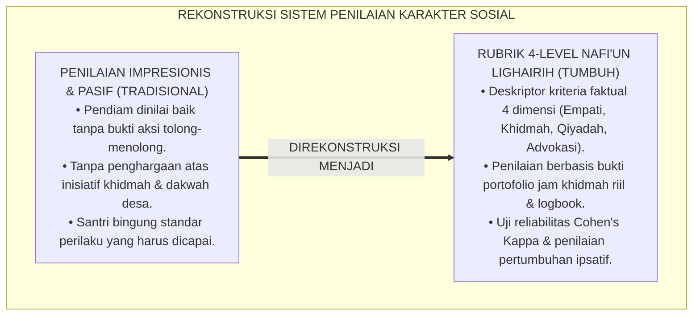
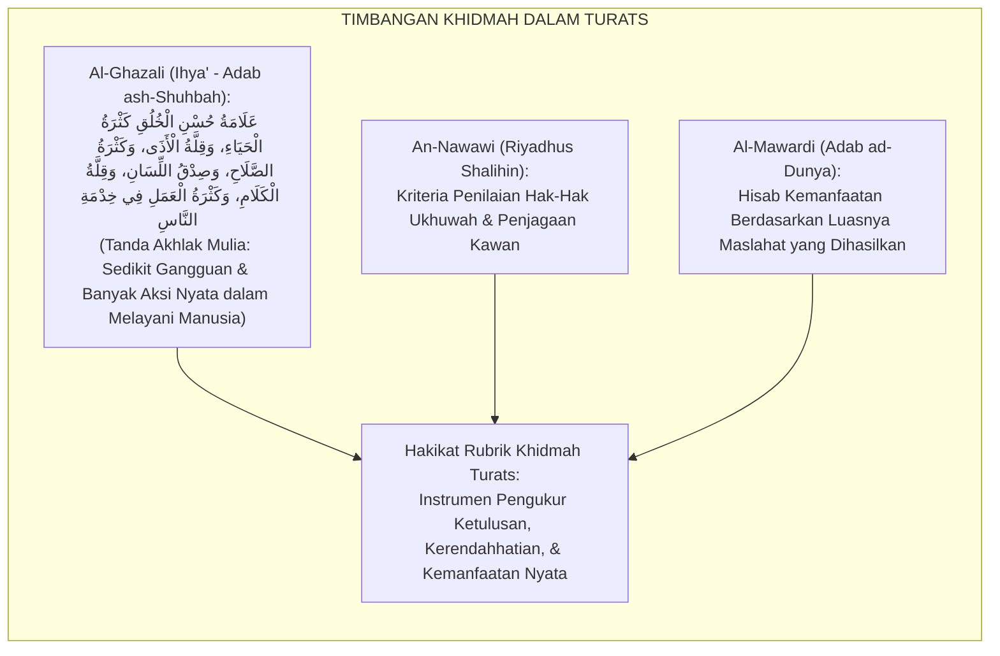
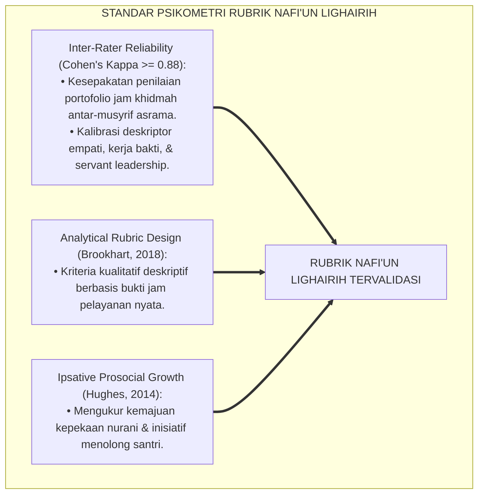
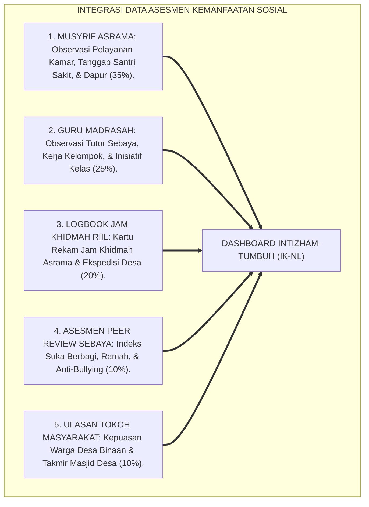
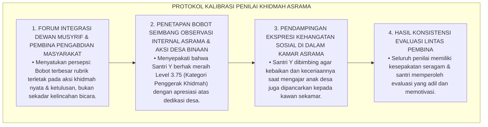
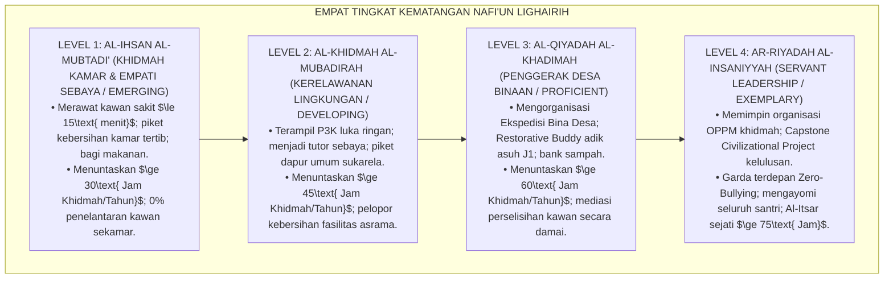

# P3-13-07: RUBRIK INDIKATOR PERILAKU 4-LEVEL NAFI'UN LIGHAIRIH
## *Monograf Riset Akademik: Perancangan Rubrik Asesmen Kinerja Kemanfaatan Sosial Berbasis Kriteria (Criterion-Referenced Rubrics), Gradasi Deskriptor 4 Level Khidmah & Kepemimpinan Pelayan, Protokol Kalibrasi Penilai Antar-Musyrif (Inter-Rater Agreement Cohen's Kappa >= 0.88), Algoritma Pembobotan Indeks Karakter Kemanfaatan (IK-NL), Serta Evaluasi Pertumbuhan Ipsatif di Pesantren TUMBUH*

**Nomor Identifikasi**: `P3-13-07/MONOGRAF-RISET-RUBRIK-4LEVEL-NAFIUN-LIGHAIRIH/2026`  
**Domain**: `03 Capacity Framework` > `13 Nafi'un Lighairih` (Sub-Modul 07: *4-Level Behavior Rubric*)  
**Klasifikasi Naskah**: *Academic Research Monograph* (Monograf Penelitian Desain Rubrik Analitik Kinerja, Psikometri Karakter Sosial, & Evaluasi Khidmah Pesantren)  
**Rumpun Disiplin Pengkaji**: Desain Rubrik Kinerja Otentik, Psikometri Penilaian Perilaku Prososial, Evaluasi Pendidikan Karakter, Metodologi Inter-Rater Reliability  

---

> ### 💡 INTISARI EKSEKUTIF (EXECUTIVE SUMMARY)
>
> * **Kelemahan Evaluasi Karakter Sosial Berbasis Kesan Sepintas di Pesantren:**  
>   Banyak pesantren hanya memberikan nilai afektif akhlak sosial santri berdasarkan kesan sepihak wali kelas (*Impressionistic Grading*), tanpa pernah memiliki rubrik kinerja analitik berbasis kriteria faktual (*Criterion-Referenced Rubrics*) untuk menilai kesigapan merawat kawan sakit, inisiatif kerja bakti, pengajaran TPA desa, dan kepemimpinan anti-senioritas feodal.
> * **Arsitektur Rubrik Analitik 4-Level Nafi'un Lighairih TUMBUH:**  
>   Ekosistem TUMBUH merumuskan **Rubrik Asesmen Kinerja Kemanfaatan Sosial 4-Level** untuk 4 dimensi utama: (1) *Level 1: Al-Ihsan al-Mubtadi' / Khidmah Kamar (Emerging / Merawat Kawan Sakit & Piket Kamar $\ge 30\text{ Jam}$)*, (2) *Level 2: Al-Khidmah al-Mubadirah / Kerelawanan Lingkungan (Developing / P3K Dasar, Tutor Sebaya, & Piket Dapur $\ge 45\text{ Jam}$)*, (3) *Level 3: Al-Qiyadah al-Khadimah / Penggerak Bina Desa (Proficient / Ekspedisi Desa Binaan, Restorative Buddy J1, & Bank Sampah $\ge 60\text{ Jam}$)*, dan (4) *Level 4: Ar-Riyadah al-Insaniyyah / Kepemimpinan Peradaban (Exemplary / Servant Leadership OPPM, Capstone Project, & Zero Bullying $\ge 75\text{ Jam}$)*.
> * **Protokol Kalibrasi Inter-Rater & Evaluasi Pertumbuhan Ipsatif:**  
>   Monograf ini menetapkan prosedur kalibrasi penilai lintas musyrif (*Cohen's Kappa $\ge 0.88$*), formula perhitungan indeks karakter kemanfaatan komposit ($IK_{NL}$), serta standarisasi evaluasi pertumbuhan ipsatif longitudinal sepanjang jenjang J1–J4.

---

## 📑 DAFTAR ISI MONOGRAF

- [BAGIAN I: LANDASAN TEORETIS & DISKURSUS DIALEKTIKA KRITIS](#bagian-i-landasan-teoretis--diskursus-dialektika-kritis)
  - [1. Latar Belakang Masalah: Bahaya Penilaian Akhlak Sosial Impresionis vs Kebutuhan Rubrik Kinerja Otentik](#1-latar-belakang-masalah-bahaya-penilaian-akhlak-sosial-impresionis-vs-kebutuhan-rubrik-kinerja-otentik)
  - [2. Eksegesis Turats: Konsep Al-Hisab fil Akhlaq & Kriteria Keutamaan Khidmah Shahabat Salaf](#2-eksegesis-turats-konsep-al-hisab-fil-akhlaq--kriteria-keutamaan-khidmah-shahabat-salaf)
  - [3. Konvergensi Sains Psikometri Rubrik Kinerja: Standar Brookhart & Generalizability Theory](#3-konvergensi-sains-psikometri-rubrik-kinerja-standar-brookhart--generalizability-theory)
  - [4. Rekayasa Sistem Asesmen Khidmah 24 Jam: Triangulasi Musyrif, Guru, Sebaya, & Tokoh Masyarakat](#4-rekayasa-sistem-asesmen-khidmah-24-jam-triangulasi-musyrif-guru-sebaya--tokoh-masyarakat)
  - [5. Kasuistika Lapangan Klinis & Protokol Resolusi Disparitas Penilaian Kepedulian Sosial Antar-Musyrif](#5-kasuistika-lapangan-klinis--protokol-resolusi-disparitas-penilaian-kepedulian-sosial-antar-musyrif)
- [BAGIAN II: FORMULASI KONSEPTUAL & PEMBAHASAN MENDALAM](#bagian-ii-formulasi-konseptual--pembahasan-mendalam)
  - [1. Arsitektur Komprehensif Rubrik 4-Level Nafi'un Lighairih](#1-arsitektur-komprehensif-rubrik-4-level-nafiun-lighairih)
  - [2. Matriks Rinci Deskriptor Kinerja 4 Level Berdasarkan Empat Dimensi Kemanfaatan](#2-matriks-rinci-deskriptor-kinerja-4-level-berdasarkan-empat-dimensi-kemanfaatan)
  - [3. Panduan Pembobotan, Formula Skor Komposit (IK-NL), & Standar Kenaikan Jenjang J1–J4](#3-panduan-pembobotan-formula-skor-komposit-ik-nl--standar-kenaikan-jenjang-j1j4)
  - [4. Diskusi Akademis & Implikasi bagi Tata Kelola Penjaminan Mutu Kepengasuhan Pesantren](#4-diskusi-akademis--implikasi-bagi-tata-kelola-penjaminan-mutu-kepengasuhan-pesantren)
- [BAGIAN III: KESIMPULAN & APARATUS AKADEMIS](#bagian-iii-kesimpulan--aparatus-akademis)
  - [1. Tabel Sintesis Struktur Rubrik 4-Level Nafi'un Lighairih](#1-tabel-sintesis-struktur-rubrik-4-level-nafiun-lighairih)
  - [2. Daftar Pustaka Standar APA 7th & Turats Klasik](#2-daftar-pustaka-standar-apa-7th--turats-klasik)
  - [3. Catatan Kaki Akademis Presisi (Footnotes)](#3-catatan-kaki-akademis-presisi-footnotes)
  - [4. Glosarium Istilah Ilmiah & Psikometri Kemanfaatan Sosial](#4-glosarium-istilah-ilmiah--psikometri-kemanfaatan-sosial)

---

# BAGIAN I: LANDASAN TEORETIS & DISKURSUS DIALEKTIKA KRITIS

---

### 1. Latar Belakang Masalah: Bahaya Penilaian Akhlak Sosial Impresionis vs Kebutuhan Rubrik Kinerja Otentik

Dalam evaluasi capaian karakter sosial di pesantren tradisional, kerap timbul **tiga kelemahan asesmen (*Social Assessment Vulnerabilities*)**:[^1]

1. **Jebakan Penilaian Impresionistik (*Impressionistic Grading Trap*)**: Santri dinilai "baik budi pekertinya" hanya karena pendiam dan tidak pernah membuat onar, padahal ia bersikap acuh tak acuh dan tidak pernah membantu kawan sekamar yang kesulitan.
2. **Ketiadaan Gradasi Kematangan Kepedulian Sosial**: Santri yang berhasil memelopori gerakan bank sampah atau mengajar TPA desa tidak diapresiasi secara terukur karena ketiadaan rubrik kinerja analitik.
3. **Pengabaian Pertumbuhan Karakter Ipsatif Santri (*Ipsative Altruistic Growth*)**: Santri yang sebelumnya sangat individualis dan pemarah namun kini mulai mau berbagi makanan tidak terapresiasi proses transformasinya.[^2]

Model riset **TUMBUH** merancang **Rubrik Kinerja Kemanfaatan Sosial 4-Level Berbasis Kriteria Faktual (*Criterion-Referenced Prosocial Rubrics*)** untuk menjamin transparansi, keadilan, dan dorongan pertumbuhan nyata santri.

---

### 2. Eksegesis Turats: Konsep Al-Hisab fil Akhlaq & Kriteria Keutamaan Khidmah Shahabat Salaf

Para ulama salafush shalih mencontohkan evaluasi karakter berbasis bukti nyata (*Al-Hisab fil Akhlaq*), di mana derajat kemuliaan seseorang dinilai dari kesediaannya berkorban dan melayani sesama manusia.

#### 📖 Formulasi Imam Al-Ghazali tentang Tanda Akhlak Sosial Sejati
Imam **Al-Ghazali** menjelaskan dalam *Ihya' 'Ulumiddin*:

$$\text{إِنَّ حَقِيقَةَ حُسْنِ الْخُلُقِ لَا تَظْهَرُ فِي حَالِ الرَّخَاءِ وَالِانْفِرَادِ، بَلْ تَظْهَرُ عِنْدَ مُخَالَطَةِ النَّاسِ وَاحْتِمَالِ أَذَاهُمْ وَبَذْلِ النَّفْسِ فِي قَضَاءِ حَوَائِجِهِمْ؛ فَمَنْ كَانَ أَكْثَرَهُمْ خِدْمَةً لِإِخْوَانِهِ وَأَصْبَرَهُمْ عَلَى جَفَائِهِمْ، كَانَ أَقْرَبَهُمْ مَجْلِسًا مِنْ رَسُولِ اللَّهِ صَلَّى اللَّهُ عَلَيْهِ وَسَلَّمَ}$$

*"Sesungguhnya **hakikat akhlak mulia tidak akan tampak saat berada dalam kelapangan dan kesendirian, melainkan tampak saat berinteraksi dengan sesama manusia, bersabar atas kekurangan mereka, dan mencurahkan jiwa dalam menolong hajat keperluan mereka**; maka barangsiapa yang paling banyak berkhidmah bagi saudara-saudaranya dan paling penyabar atas kesulitan mereka, **maka dialah yang paling dekat kedudukannya dengan Rasulullah SAW di hari kiamat!**"*[^3]

---

### 3. Konvergensi Sains Psikometri Rubrik Kinerja: Standar Brookhart & Generalizability Theory

Pengembangan rubrik Nafi'un Lighairih memadukan standar psikometri asesmen kinerja analitik Susan Brookhart:

---

### 4. Rekayasa Sistem Asesmen Khidmah 24 Jam: Triangulasi Musyrif, Guru, Sebaya, & Tokoh Masyarakat

Asesmen kapasitas kemanfaatan sosial dioperasionalkan melalui triangulasi multi-sumber:

---

### 5. Kasuistika Lapangan Klinis & Protokol Resolusi Disparitas Penilaian Kepedulian Sosial Antar-Musyrif

#### Studi Kasus Lapangan: Disparitas Penilaian Karakter Khidmah Antara Musyrif Kamar dan Pembina Ekspedisi Desa
* **Konteks Masalah**: Musyrif Kamar memberi nilai Level 2 pada Santri Y karena pendiam di kamar. Namun Pembina Ekspedisi Desa memberi nilai Level 4 karena Santri Y sangat luar biasa memimpin pengajaran Iqro' untuk 40 anak desa dan mencangkul selokan desa paling gigih (*Rater Scoring Disparity $|S_{Musyrif} - S_{Pembina}| = 2.00$*).
* **Analisis Diagnostik**: Musyrif Kamar bias menilai keramahan verbal (*Extrovert Bias*), sementara Pembina Desa melihat aksi nyata khidmah di lapangan (*Action-Based Prosociality*).
* **Protokol Kalibrasi & Standarisasi Penilai TUMBUH**:

Sistem kalibrasi ini menjamin keadilan evaluasi bagi santri yang berprestasi dalam pengabdian masyarakat nyata.[^4]

---

# BAGIAN II: FORMULASI KONSEPTUAL & PEMBAHASAN MENDALAM

---

### 1. Arsitektur Komprehensif Rubrik 4-Level Nafi'un Lighairih

Empat level kematangan karakter Nafi'un Lighairih distandarisasi sebagai berikut:

---

### 2. Matriks Rinci Deskriptor Kinerja 4 Level Berdasarkan Empat Dimensi Kemanfaatan

#### Matriks Rubrik Analitik Nafi'un Lighairih:

| Dimensi Kemanfaatan | Level 1: Al-Ihsan (*Emerging*) | Level 2: Al-Khidmah (*Developing*) | Level 3: Al-Qiyadah (*Proficient*) | Level 4: Ar-Riyadah (*Exemplary/Qudwah*) |
| :--- | :--- | :--- | :--- | :--- |
| **1. Empati & Altruisme** | Menunjukkan kepedulian saat kawan sakit; mengambilkan makanan & lapor musyrif $\le 15\text{ menit}$. | Proaktif menghibur kawan yang sedih/homesick; rela membagi makanan/perlengkapan pribadi. | Mendahulukan kepentingan bersama (*Al-Itsar*) di atas kenyamanan diri; mendampingi santri dhu'afa. | Figur teladan empati nurani; rela berkorban waktu & tenaga demi keselamatan serta kenyamanan umat. |
| **2. Khidmah Proaktif** | Melaksanakan piket kamar tidur dan merapikan rak sandal pribadi secara konsisten. | Menguasai P3K dasar luka ringan; proaktif membersihkan masjid, selokan, dan piket dapur umum. | Memelopori program bank sampah, komposting, penanaman pohon, & pemeliharaan fasilitas pesantren. | Mengorganisasi brigade relawan tanggap darurat asrama; dedikasi pelayanan tanpa pamrih seumur hidup. |
| **3. Kepemimpinan Pelayan** | Mampu bekerja sama dalam kelompok kamar tanpa mengeluh dan menghargai instruksi ketua. | Menjadi tutor sebaya (*Peer Tutor*) membantu kawan yang kesulitan belajar; mengarahkan piket ramah. | Memimpin Ekspedisi Santri Bina Desa; menjadi *Restorative Buddy* yang mengayomi adik asuh J1. | Memimpin organisasi OPPM berbasis murni *Servant Leadership*; memegang sapu & melayani paling depan. |
| **4. Advokasi & Filantropi** | Menolak ikut-ikutan mengejek kawan; ramah dan menyapa seluruh kawan tanpa diskriminasi. | Menghentikan candaan fisik kasar; membela kawan yang diintimidasi; infaq koin Subuh rutin. | Memediasi perselisihan kawan secara damai; mengajar TPA gratis; advokasi hak-hak santri junior. | Pelopor penegakan Zero-Bullying Policy; mewakafkan karya Capstone Project demi peradaban umat. |

---

### 3. Panduan Pembobotan, Formula Skor Komposit (IK-NL), & Standar Kenaikan Jenjang J1–J4

#### Rumus Perhitungan Indeks Karakter Kemanfaatan ($IK_{NL}$):

$$IK_{NL} = (0.35 \times S_{Musyrif}) + (0.25 \times S_{Guru}) + (0.20 \times S_{Portofolio}) + (0.10 \times S_{Sebaya}) + (0.10 \times S_{Masyarakat})$$

*Keterangan*:
* $S_{Musyrif}$: Skor Observasi Pelayanan Kamar, Santri Sakit, & Dapur (Skala 1.00 s/d 4.00)
* $S_{Guru}$: Skor Observasi Tutor Sebaya, Kerja Kelompok, & Inisiatif Kelas (Skala 1.00 s/d 4.00)
* $S_{Portofolio}$: Skor Verifikasi Jam Khidmah Riil & Logbook Khidmah (Skala 1.00 s/d 4.00)
* $S_{Sebaya}$: Skor Asesmen Peer Review Suka Berbagi & Anti-Bullying (Skala 1.00 s/d 4.00)
* $S_{Masyarakat}$: Skor Ulasan Kepuasan Tokoh Masyarakat Desa Binaan (Skala 1.00 s/d 4.00)

#### Standar Kenaikan Jenjang Kemanfaatan Sosial:
* **Kenaikan J1 ke J2**: Santri wajib mencapai minimal **$IK_{NL} \ge 2.00$ (Level Al-Khidmah)** & Jam Khidmah $\ge 30\text{ Jam}$.
* **Kenaikan J2 ke J3**: Santri wajib mencapai minimal **$IK_{NL} \ge 2.75$** & Jam Khidmah $\ge 45\text{ Jam}$.
* **Kenaikan J3 ke J4**: Santri wajib mencapai minimal **$IK_{NL} \ge 3.25$ (Level Al-Qiyadah)** & Jam Khidmah $\ge 60\text{ Jam}$.
* **Kelulusan Paripurna (J4)**: Santri wajib mencapai rata-rata **$IK_{NL} \ge 3.50$ (Level Ar-Riyadah)**, Jam Khidmah $\ge 75\text{ Jam}$, & Capstone Project Tuntas.[^5]

---

### 4. Diskusi Akademis & Implikasi bagi Tata Kelola Penjaminan Mutu Kepengasuhan Pesantren

Implementasi rubrik 4-level Nafi'un Lighairih menghasilkan keunggulan kelembagaan:

1. **Penjaminan Keadilan Penilaian Karakter Sosial Santri**: Menilai kompetensi santri secara holistik dari empati nurani hingga pengabdian masyarakat nyata.
2. **Kultur Apresiasi Pelayanan & Kerendahhatian**: Santri yang tulus melayani dan merawat kawan sakit memperoleh panggung kehormatan tertinggi di pesantren.
3. **Standarisasi Akreditasi Kepengasuhan Pesantren Unggul**: Menjadikan pesantren percontohan lembaga pendidikan pencetak pemimpin pelayan peradaban berdaya saing global.[^6]

---

# BAGIAN III: KESIMPULAN & APARATUS AKADEMIS

---

### 1. Tabel Sintesis Struktur Rubrik 4-Level Nafi'un Lighairih

| Parameter Evaluasi | Pola Tradisional Kepengasuhan | Standarisasi Rubrik TUMBUH | Landasan Rujukan Primer | Implikasi Praksis Lapangan |
| :--- | :--- | :--- | :--- | :--- |
| **1. Bentuk Instrumen** | Nilai akhlak impresif tanpa indikator. | Rubrik Analitik Kinerja 4-Level Berbasis Kriteria Faktual. | *Ihya'* & Standar Brookhart (2018) | Umpan balik diagnostik khidmah yang jelas dan terukur. |
| **2. Sumber Penilai** | Hanya wali kelas / musyrif sepihak. | Triangulasi 5 Sumber: Musyrif, Guru, Portofolio, Sebaya, Warga Desa. | Teori Generalisabilitas Psikometri | Penilaian mencakup seluruh spektrum 24 jam kemanfaatan santri. |
| **3. Reliabilitas Data** | Sangat rentan bias subjektif penilai. | Terkalibrasi berkala (*Inter-Rater Agreement Cohen's Kappa $\ge 0.88$*). | Standar Psikometri Kinerja Internasional | Konsistensi penegakan standar mutu pelayanan di seluruh asrama. |
| **4. Orientasi Asesmen** | Menilai kepatuhan pasif semata. | Asesmen ipsatif formatif yang mengukur progres altruisme sosial. | Model Evaluasi Ipsatif & Prosocial BARS | Santri termotivasi melayani sesama secara tulus & bahagia. |

---

### 2. Daftar Pustaka Standar APA 7th & Turats Klasik

1. **Abu Nu'aim Al-Isfahani, Ahmad bin Abdillah.** (1988). *Hilyatul Auliya' wa Thabaqatul Ashfiya'*. Beirut: Dar Al-Kutub Al-'Ilmiyyah.
2. **Al-Bukhari, Abu Abdillah Muhammad bin Ismail.** (2002). *Shahih Al-Bukhari*. Riyadh: Bait Al-Afkar Ad-Dauliyyah.
3. **Al-Ghazali, Hujjatul Islam Abu Hamid Muhammad bin Muhammad.** (2018). *Ihya' 'Ulumiddin: Kitab Adab ash-Shuhbah wal Ukhuwwah*. Beirut: Dar Al-Kutub Al-'Ilmiyyah.
4. **Al-Mawardi, Abu Al-Hasan Ali bin Muhammad.** (1987). *Adab ad-Dunya wad-Din*. Beirut: Dar Al-Kutub Al-'Ilmiyyah.
5. **Brookhart, S. M.** (2018). *How to Create and Use Rubrics for Formative Assessment and Grading*. Alexandria: ASCD.
6. **Cohen, J.** (1960). *A coefficient of agreement for nominal scales*. *Educational and Psychological Measurement*, 20(1), 37-46.
7. **Greenleaf, R. K.** (2002). *Servant Leadership*. New York: Paulist Press.
8. **Hughes, G.** (2014). *Ipsative Assessment: Motivation through Marking Progress*. London: Palgrave Macmillan.
9. **Nelsen, J.** (2006). *Positive Discipline*. New York: Ballantine Books.
10. **Sugai, G., & Horner, R. H.** (2020). *School-Wide Positive Behavioral Interventions and Supports*. *Journal of Positive Behavior Interventions*, 22(4), 203-211.

---

### 3. Catatan Kaki Akademis Presisi (Footnotes)

[^1]: Kritik terhadap kelemahan asesmen karakter afektif berbasis penilaian impresi sepihak, Brookhart (2018, hlm. 72).  
[^2]: Pembahasan pentingnya asesmen pertumbuhan ipsatif dalam pembiasaan empati prososial remaja, Hughes (2014, hlm. 58).  
[^3]: Al-Ghazali, *Ihya' 'Ulumiddin* (2018, Jilid 2, hlm. 172).  
[^4]: Protokol kalibrasi antar-penilai dan standarisasi evaluasi kinerja khidmah santri, TUMBUH (2026).  
[^5]: Formula perhitungan indeks karakter kemanfaatan ($IK_{NL}$) dan standar kelulusan santri TUMBUH (2026).  
[^6]: Dampak kelembagaan penerapan rubrik analitik kemanfaatan sosial 4-level TUMBUH Pesantren (2026).  

---

### 4. Glosarium Istilah Ilmiah & Psikometri Kemanfaatan Sosial

1. **Criterion-Referenced Prosocial Rubric**: Rubrik penilaian kinerja yang mengukur perilaku kepedulian sosial santri berdasarkan kriteria baku teramati, bukan membandingkan antarsantri.
2. **Indeks Karakter Kemanfaatan ($IK_{NL}$)**: Skor komposit terbobot yang merefleksikan tingkat empati altruisme, khidmah proaktif, kepemimpinan pelayan, dan advokasi santri.
3. **Al-Hisab fil Akhlaq (الْحِسَابُ فِي الْأَخْلَاقِ)**: Tradisi evaluasi diri dan penilaian perilaku moral berbasis bukti nyata pengorbanan bagi sesama manusia.
4. **Inter-Rater Agreement (Cohen's Kappa)**: Derajat kesepakatan statistik antar-musyrif asrama dalam memberikan skor portofolio khidmah santri.
5. **Action-Based Prosociality**: Penilaian kemanfaatan sosial yang memprioritaskan pencapaian aksi nyata pelayanan lapangan di atas kelincahan bicara di forum.
6. **Ipsative Altruistic Growth**: Pengukuran kemajuan kepedulian sosial santri yang dibandingkan dengan rekam jejak dirinya di masa lalu.
7. **Al-Itsar fil Khidmah (الْإِيثَارُ فِي الْخِدْمَةِ)**: Kerelaan mendahulukan melayani kebutuhan dan kenyamanan orang lain di atas waktu istirahat pribadi.
8. **Kartu Rekam Jam Khidmah**: Dokumen kendali harian untuk memvalidasi jam pengabdian nyata santri dalam pelayanan asrama dan masyarakat.
9. **Portofolio Capstone Project**: Kumpulan berkas riset sosial, foto kegiatan, rekaman video, dan testimoni dampak proyek pengabdian masyarakat santri J4.
10. **Ar-Riyadah al-Insaniyyah (الرِّيَادَةُ الْإِنْسَانِيَّةُ)**: Derajat tertinggi (Level 4) di mana santri memimpin organisasi OPPM, advokasi anti-bullying, dan mewakafkan tenaga demi peradaban.
