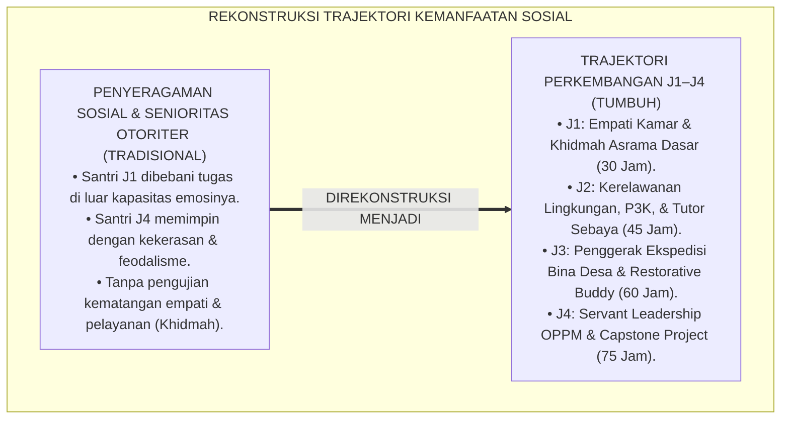
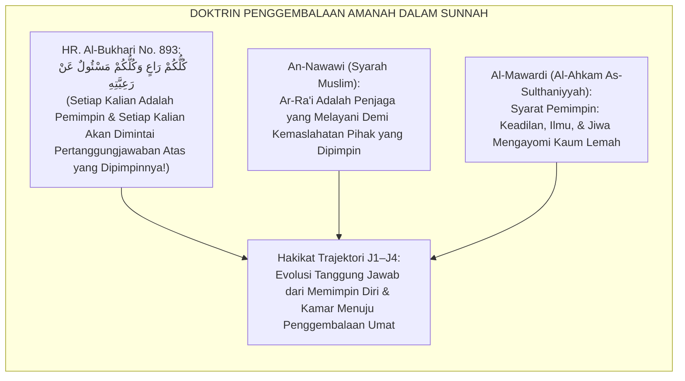
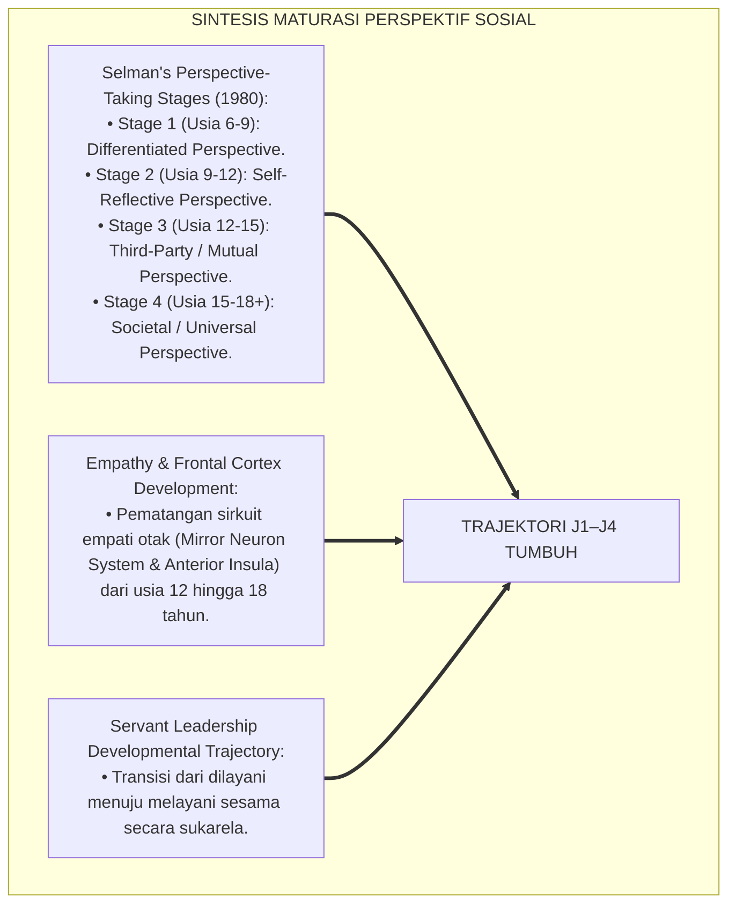
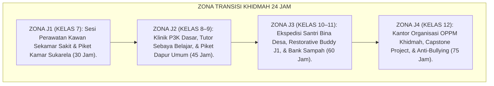
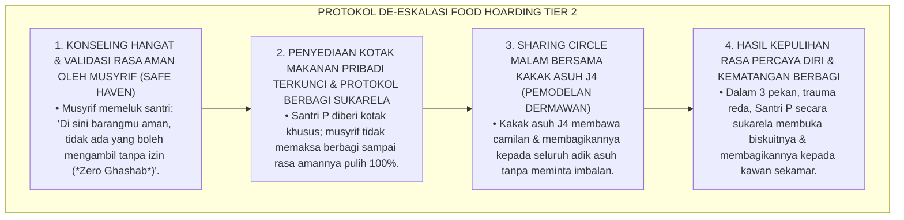
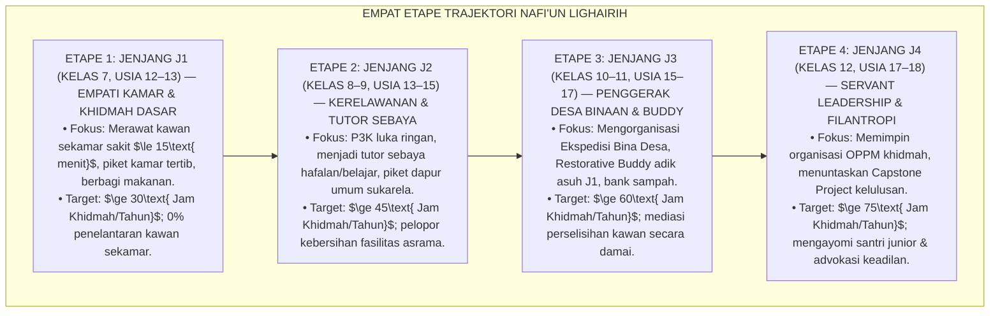
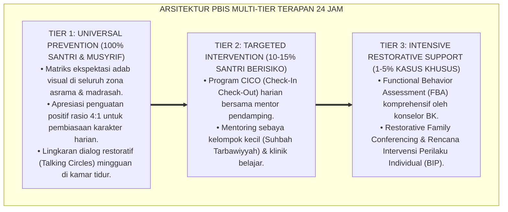

# P3-13-08: TAHAPAN PERKEMBANGAN JENJANG J1–J4 NAFI'UN LIGHAIRIH
## *Monograf Riset Akademik: Trajektori Perkembangan Kematangan Kepedulian Sosial & Jiwa Kepemimpinan Pelayan Usia 12–18 Tahun, Integrasi Fiqh Al-Wilayah wal Mas'uliyyah (Tanggung Jawab Kepemimpinan Hadits Kullukum Ra'in) dengan Teori Perkembangan Moral Prososial (Eisenberg & Selman's Perspective-Taking), Serta Desain Protokol Transisi Kenaikan Jenjang (Khidmah Readiness Check) di Ekosistem Pesantren Berbasis TUMBUH*

**Nomor Identifikasi**: `P3-13-08/MONOGRAF-RISET-TAHAPAN-PERKEMBANGAN-J1-J4-NAFIUN-LIGHAIRIH/2026`  
**Domain**: `03 Capacity Framework` > `13 Nafi'un Lighairih` (Sub-Modul 08: *Developmental Trajectory J1–J4*)  
**Klasifikasi Naskah**: *Academic Research Monograph* (Monograf Penelitian Psikologi Perkembangan Moral Prososial, Fiqh Mas'uliyyah Transisi Usia, & Trajektori Kepemimpinan Pelayan)  
**Rumpun Disiplin Pengkaji**: Psikologi Perkembangan Moral Remaja (*Adolescent Moral Development*), Fiqh Siyasah & Kepemimpinan Ukhuwah, Teori Pengambilan Perspektif Sosial (Selman), Manajemen Transisi Pengasuhan  

---

> ### 💡 INTISARI EKSEKUTIF (EXECUTIVE SUMMARY)
>
> * **Kelesuan Penahapan Pendidikan Kepedulian Sosial di Pesantren:**  
>   Banyak kurikulum kepengasuhan memperlakukan tanggung jawab sosial santri secara seragam dan tanpa penahapan usia yang tepat. Santri usia 12 tahun (baru lulus SD) langsung dibebani tugas organisasi publik yang rumit, atau sebaliknya santri usia 18 tahun (menjelang lulus aliyah) tidak diberi wewenang memimpin program pengabdian masyarakat secara mandiri, melahirkan kepemimpinan yang rapuh dan krisis empati.
> * **Integrasi Fiqh Al-Wilayah & Teori Perspective-Taking Robert Selman:**  
>   Ekosistem TUMBUH menyelaraskan doktrin kenabian mengenai tanggung jawab penggembalaan (*Kullukum Rā'in wa Mas'ūl*) dengan tahapan perkembangan pengambilan perspektif sosial Robert Selman dan maturasi korteks prefrontal remaja. Kepedulian sosial berkembang secara bertahap dari empati egosentris (*Egocentric Perspective*) menuju empati sosial mendalam (*Mutual & Societal Perspective-Taking*).
> * **Empat Etape Trajektori Kemanfaatan Jenjang J1–J4 & Khidmah Readiness Check:**  
>   Monograf ini merumuskan 4 fase perkembangan terstruktur: (1) *Jenjang J1 (Kelas 7, Usia 12–13): Etape Empati Kamar & Khidmah Asrama Dasar*, (2) *Jenjang J2 (Kelas 8–9, Usia 13–15): Etape Kerelawanan Lingkungan, P3K, & Tutor Sebaya*, (3) *Jenjang J3 (Kelas 10–11, Usia 15–17): Etape Penggerak Ekspedisi Bina Desa & Restorative Buddy*, dan (4) *Jenjang J4 (Kelas 12, Usia 17–18): Etape Servant Leadership OPPM, Capstone Civilizational Project, & Advokasi Keadilan*.

---

## 📑 DAFTAR ISI MONOGRAF

- [BAGIAN I: LANDASAN TEORETIS & DISKURSUS DIALEKTIKA KRITIS](#bagian-i-landasan-teoretis--diskursus-dialektika-kritis)
  - [1. Latar Belakang Masalah: Bahaya Penyeragaman Tanggung Jawab Sosial Tanpa Memperhatikan Maturasi Kognisi Sosial Remaja](#1-latar-belakang-masalah-bahaya-penyeragaman-tanggung-jawab-sosial-tanpa-memperhatikan-maturasi-kognisi-sosial-remaja)
  - [2. Eksegesis Turats: Doktrin Kullukum Ra'in & Penahapan Beban Amanah Menurut Usia Salaf](#2-eksegesis-turats-doktrin-kullukum-rain--penahapan-beban-amanah-menurut-usia-salaf)
  - [3. Konvergensi Sains Perkembangan Sosial: Selman's Stages of Social Perspective-Taking & Neuroplastisitas Empati](#3-konvergensi-sains-perkembangan-sosial-selmans-stages-of-social-perspective-taking--neuroplastisitas-empati)
  - [4. Rekayasa Zona Transisi 24 Jam: Ekosistem Penempaan Kepemimpinan Pelayan Sesuai Usia Santri](#4-rekayasa-zona-transisi-24-jam-ekosistem-penempaan-kepemimpinan-pelayan-sesuai-usia-santri)
  - [5. Kasuistika Lapangan Klinis & Protokol Pendampingan Santri J1 yang Mengalami Kesulitan Berbagi Makanan Karena Trauma Kehilangan Barang](#5-kasuistika-lapangan-klinis--protokol-pendampingan-santri-j1-yang-mengalami-kesulitan-berbagi-makanan-karena-trauma-kehilangan-barang)
- [BAGIAN II: FORMULASI KONSEPTUAL & PEMBAHASAN MENDALAM](#bagian-ii-formulasi-konseptual--pembahasan-mendalam)
  - [1. Peta Jalan Empat Etape Perkembangan Kemanfaatan Sosial Jenjang J1–J4](#1-peta-jalan-empat-etape-perkembangan-kemanfaatan-sosial-jenjang-j1j4)
  - [2. Matriks Rinci Capaian Perkembangan, Tugas Khidmah, & Indikator Kematangan per Jenjang](#2-matriks-rinci-capaian-perkembangan-tugas-khidmah--indikator-kematangan-per-jenjang)
  - [3. Protokol Asesmen Transisi Kenaikan Jenjang (Khidmah Readiness Check / KRC)](#3-protokol-asesmen-transisi-kenaikan-jenjang-khidmah-readiness-check--krc)
  - [4. Diskusi Akademis & Implikasi bagi Tata Kelola Kaderisasi Kepemimpinan Pesantren](#4-diskusi-akademis--implikasi-bagi-tata-kelola-kaderisasi-kepemimpinan-pesantren)
- [BAGIAN III: KESIMPULAN & APARATUS AKADEMIS](#bagian-iii-kesimpulan--aparatus-akademis)
  - [1. Tabel Sintesis Tahapan Perkembangan Kemanfaatan Sosial J1–J4](#1-tabel-sintesis-tahapan-perkembangan-kemanfaatan-sosial-j1j4)
  - [2. Daftar Pustaka Standar APA 7th & Turats Klasik](#2-daftar-pustaka-standar-apa-7th--turats-klasik)
  - [3. Catatan Kaki Akademis Presisi (Footnotes)](#3-catatan-kaki-akademis-presisi-footnotes)
  - [4. Glosarium Istilah Ilmiah & Perkembangan Sosial Remaja](#4-glosarium-istilah-ilmiah--perkembangan-sosial-remaja)

---

# BAGIAN I: LANDASAN TEORETIS & DISKURSUS DIALEKTIKA KRITIS

---

### 1. Latar Belakang Masalah: Bahaya Penyeragaman Tanggung Jawab Sosial Tanpa Memperhatikan Maturasi Kognisi Sosial Remaja

Dalam praksis pembinaan santri di pesantren konvensional, kerap terjadi **tiga distorsi penahapan perkembangan sosial (*Social Developmental Distortions*)**:[^1]

1. **Jebakan Beban Kepemimpinan Prematur (*Premature Leadership Overload*)**: Santri baru kelas 7 (J1) yang masih berjuang mengatasi homesickness dan regulasi diri dipaksa menjadi penanggung jawab kebersihan asrama umum, memicu stres berat dan kepanikan sosial.
2. **Jebakan Feodalisme Kekuasaan Remaja Akhir (*Late Adolescent Authoritarianism*)**: Santri kelas 12 (J4) yang diberi wewenang memimpin organisasi santri (OPPM) tidak dibekali tahapan kematangan servant leadership, sehingga melampiaskan kekuasaan dengan membentak dan menghukum fisik adik kelas.
3. **Ketiadaan Evaluasi Kematangan Empati & Pelayanan**: Kenaikan jenjang hanya didasarkan pada nilai ujian tulis tanpa pernah menguji apakah santri sudah mampu berempati dan melayani sesama secara tulus (*Social Readiness*).[^2]

Model riset **TUMBUH** merumuskan **Trajektori Perkembangan Jenjang J1–J4** yang menyelaraskan tahapan maturasi kognisi sosial remaja dengan doktrin penggembalaan amanah Islam.

---

### 2. Eksegesis Turats: Doktrin Kullukum Ra'in & Penahapan Beban Amanah Menurut Usia Salaf

Rasulullah SAW meletakkan doktrin penggembalaan amanah (*Ar-Ri'ayah wal Mas'uliyyah*) yang disesuaikan secara proporsional dengan lingkup dan fase kedewasaan seseorang.

#### 📖 Hadits Agung Riwayat Abdullah bin Umar RA
Rasulullah SAW bersabda:

$$\text{كُلُّكُمْ رَاعٍ وَكُلُّكُمْ مَسْئُولٌ عَنْ رَعِيَّتِهِ؛ فَالْإِمَامُ رَاعٍ وَمَسْئُولٌ عَنْ رَعِيَّتِهِ، وَالرَّجُلُ رَاعٍ فِي أَهْلِهِ وَمَسْئُولٌ عَنْ رَعِيَّتِهِ، وَالْمَرْأَةُ رَاعِيَةٌ فِي بَيْتِ زَوْجِهَا وَمَسْئُولَةٌ عَنْ رَعِيَّتِهَا، وَالْخَادِمُ رَاعٍ فِي مَالِ سَيِّدِهِ وَمَسْئُولٌ عَنْ رَعِيَّتِهِ؛ أَلَا فَكُلُّكُمْ رَاعٍ وَكُلُّكُمْ مَسْئُولٌ عَنْ رَعِيَّتِهِ}$$

*"**Setiap kalian adalah penggembala (pemimpin/penjaga amanah), dan setiap kalian akan dimintai pertanggungjawaban atas apa yang digembalakannya**; seorang imam adalah pemimpin dan bertanggung jawab atas rakyatnya; seorang laki-laki adalah pemimpin di keluarganya dan bertanggung jawab atas mereka; seorang wanita adalah pemimpin di rumah suaminya dan bertanggung jawab atas rumahnya; dan seorang pelayan adalah penjaga harta tuannya dan bertanggung jawab atasnya; **ketahuilah bahwa setiap kalian adalah pemimpin dan setiap kalian akan dimintai pertanggungjawaban atas amanah kepemimpinannya!**"* (HR. Al-Bukhari No. 893).[^3]

---

### 3. Konvergensi Sains Perkembangan Sosial: Selman's Stages of Social Perspective-Taking & Neuroplastisitas Empati

Trajektori kemanfaatan santri memadukan tahapan pengambilan perspektif sosial Robert Selman dan perkembangan empati neurobiologis:

---

### 4. Rekayasa Zona Transisi 24 Jam: Ekosistem Penempaan Kepemimpinan Pelayan Sesuai Usia Santri

Lingkungan asrama diorganisasikan mendukung tangga perkembangan kemanfaatan sosial:

---

### 5. Kasuistika Lapangan Klinis & Protokol Pendampingan Santri J1 yang Mengalami Kesulitan Berbagi Makanan Karena Trauma Kehilangan Barang

#### Studi Kasus Lapangan: Santri J1 Menyembunyikan Makanan di Kolong Ranjang Karena Takut Diambil Teman
* **Konteks Masalah**: Santri P (12 tahun, Jenjang J1) menyembunyikan biskuit dan makanan kiriman orang tua di dalam lipatan selimut bawah kasur hingga bersemut. Saat diajak berbagi makanan oleh kawan sekamarnya, ia marah dan memeluk makanannya erat-erat (*Food Hoarding & Protective Anxiety*).
* **Analisis Diagnostik**: Santri P mengalami trauma masa kecil akibat barang-barangnya sering direbut tanpa izin di lingkungan sebelumnya (*Deprivation Trauma*), memicu kecemasan bertahan hidup (*Survival Hoarding*).
* **Protokol De-eskalasi & Penanaman Kepercayaan Ukhuwah TUMBUH**:

Intervensi penuh kasih berbasis pemulihan rasa aman (*Psychological Safety First*) ini berhasil menyembuhkan trauma kikir dan menumbuhkan mutiara kedermawanan pada santri baru.[^4]

---

# BAGIAN II: FORMULASI KONSEPTUAL & PEMBAHASAN MENDALAM

---

### 1. Peta Jalan Empat Etape Perkembangan Kemanfaatan Sosial Jenjang J1–J4

Ekosistem TUMBUH menetapkan empat etape perkembangan kemanfaatan sosial:

---

### 2. Matriks Rinci Capaian Perkembangan, Tugas Khidmah, & Indikator Kematangan per Jenjang

| Jenjang & Usia | Karakteristik Kognitif-Sosial | Tugas Khidmah Utama Santri | Indikator Kematangan Terverifikasi |
| :--- | :--- | :--- | :--- |
| **Jenjang J1 (Kelas 7) Usia 12–13 Tahun** | Masa adaptasi; empati berkembang di lingkungan terdekat (*Mutual Perspective* kamar). | Merawat kawan sakit $\le 15\text{ menit}$; piket kamar; berbagi makanan. | $\ge 30\text{ Jam Khidmah}$; 0 penelantaran kawan; kamar rapi & bersih. |
| **Jenjang J2 (Kelas 8–9) Usia 13–15 Tahun** | Mulai peka lingkungan umum; tertarik aktivitas kerelawanan dan tolong-menolong sebaya. | Praktik P3K dasar luka ringan; tutor sebaya; piket dapur umum. | $\ge 45\text{ Jam Khidmah}$; sertifikasi P3K dasar; nilai tutor aktif. |
| **Jenjang J3 (Kelas 10–11) Usia 15–17 Tahun** | Perspektif sosial kemasyarakatan matang (*Societal Perspective*); siap mengabdi ke warga. | Mengajar TPA Desa Binaan; Restorative Buddy adik J1; kelola sampah. | $\ge 60\text{ Jam Khidmah}$; presensi TPA desa $\ge 90\%$; buddy care tuntas. |
| **Jenjang J4 (Kelas 12) Usia 17–18 Tahun** | Identitas kepemimpinan pelayan mengkristal (*Servant Leader*); siap mengabdi bagi bangsa. | Memimpin OPPM khidmah; Capstone Civilizational Project; Zero Bullying. | $\ge 75\text{ Jam Khidmah}$; Capstone Project teruji; teladan Al-Itsar. |

---

### 3. Protokol Asesmen Transisi Kenaikan Jenjang (Khidmah Readiness Check / KRC)

Sebelum naik ke jenjang berikutnya, setiap santri wajib menempuh asesmen kelayakan kemanfaatan sosial (*Khidmah Readiness Check / KRC*):

1. **KRC-1 (Transisi J1 ke J2)**: Verifikasi $\ge 30\text{ Jam Khidmah}$ asrama, buku kontrol piket kamar, dan bebas dari catatan pengucilan teman.
2. **KRC-2 (Transisi J2 ke J3)**: Uji praktik P3K dasar, verifikasi $\ge 45\text{ Jam Khidmah}$, dan laporan rekam tutor sebaya madrasah.
3. **KRC-3 (Transisi J3 ke J4)**: Verifikasi $\ge 60\text{ Jam Khidmah}$, evaluasi mengajar TPA Desa Binaan, dan laporan pendampingan adik asuh J1.
4. **KRC-Final (Kelulusan J4)**: Sidang terbuka draf karya proyek pengabdian peradaban (*Capstone Defense*) di hadapan dewan penguji dan tokoh masyarakat.[^5]

---

### 4. Diskusi Akademis & Implikasi bagi Tata Kelola Kaderisasi Kepemimpinan Pesantren

Penerapan trajektori perkembangan jenjang J1–J4 menghadirkan lompatan kematangan lulusan:

1. **Penahapan Pengabdian yang Sesuai Maturasi Jiwa Remaja**: Membina kepedulian sosial santri secara berjenjang dari lingkup kamar tidur menuju transformasi masyarakat desa.
2. **Terciptanya Rantai Kepemimpinan Pelayan yang Berkelanjutan (*Regenerative Servant Leadership*)**: Menghapus total budaya perpeloncoan senioritas dan melahirkan senior yang menjadi pelindung bagi juniornya.
3. **Pengokohan Martabat Pesantren Sebagai Pusat Peradaban Islam**: Pesantren melahirkan kader-kader da'i dan pemimpin bangsa yang berilmu mendalam sekaligus berdedikasi melayani rakyat.[^6]

---

---

### Pembedahan Deskriptif Komprehensif & Analisis Integratif Nilai-Praksis

Penerapan konsep **P3-13-08: TAHAPAN PERKEMBANGAN JENJANG J1–J4 NAFI'UN LIGHAIRIH** di ekosistem pesantren berbasis sistem TUMBUH memerlukan pemahaman multidimensional yang memadukan khazanah turats syariat dan konsensus sains pendidikan modern:

#### A. Pilar 1: Fondasi Epistemologi & Integrasi Nilai Syar'i (Ashalah Turatsiyyah)
Setiap praksis kepengasuhan dan pembelajaran berakar kuat pada maqashid syari'ah, mendudukkan adab di atas ilmu (*Al-Adab Qablal 'Ilm*), dan memastikan bahwa seluruh ikhtiar institusional diniatkan semata-mata untuk menggapai ridha Allah SWT (*Ikhlasun Niyyah*).

#### B. Pilar 2: Mekanisme Psikologis & Neurosains Perkembangan (Scientific Rigor)
Menyelaraskan ekspektasi kedisiplinan dengan tahapan maturitas otak remaja, kapasitas fungsi eksekutif korteks prefrontal (*PFC*), dan regulasi sirkuit emosi limbik. Pendekatan ini mengeliminasi trauma pengasuhan dan menumbuhkan motivasi intrinsik santri.

#### C. Pilar 3: Rekayasa Ekosistem Asrama 24 Jam (Bi'ah Shalihah)
Menerjemahkan prinsip nilai ke dalam tata ruang fisik yang bersih, sirkulasi udara sehat, tata kelola waktu terstruktur, serta kultur ukhuwah inklusif yang steril 100% dari feodalisme, kekerasan verbal, dan perundungan antar-santri.

#### D. Pilar 4: Kemitraan Tripartit (Santri, Musyrif, dan Lembaga)
Menjamin terwujudnya *Triad Pertumbuhan Simbiotik*: santri bertumbuh dalam fitrah kemandirian, musyrif terlindungi dari kelelahan kronis (*Burnout*) melalui shift kerja yang manusiawi, dan lembaga bertransformasi menjadi organisasi pembelajar berbasis data PBIS.

---

### Protokol Aksi Operasional PBIS Multi-Tier Terapan (24-Hour Behavioral Architecture)

---

# BAGIAN III: KESIMPULAN & APARATUS AKADEMIS

---

### 1. Tabel Sintesis Tahapan Perkembangan Kemanfaatan Sosial J1–J4

| Jenjang Pendidikan | Tahap Selman (1980) | Target Kemanfaatan Sosial | Tolok Ukur Keberhasilan (KRC) | Landasan Turats |
| :--- | :--- | :--- | :--- | :--- |
| **Jenjang J1 (Kelas 7)** | *Self-Reflective (Kamar)* | Khidmah kamar tidur, rawat kawan sakit, piket. | $\ge 30\text{ Jam Khidmah}$ & Bebas Pengucilan. | Hadits *Kullukum Ra'in* |
| **Jenjang J2 (Kelas 8–9)** | *Mutual Perspective* | P3K dasar, tutor sebaya, piket dapur umum. | $\ge 45\text{ Jam Khidmah}$ & Sertifikasi P3K. | *Adab ash-Shuhbah* (Al-Ghazali) |
| **Jenjang J3 (Kelas 10–11)** | *Societal Perspective* | Ekspedisi Desa Binaan & Restorative Buddy J1. | $\ge 60\text{ Jam Khidmah}$ & Mengajar TPA Desa. | *Hilyatul Auliya'* (Abu Nu'aim) |
| **Jenjang J4 (Kelas 12)** | *Universal Servant Leader* | Memimpin OPPM khidmah & Capstone Project. | $\ge 75\text{ Jam Khidmah}$ & Capstone Teruji. | QS. Al-Hasyr: 9 (*Al-Itsar*) |

---

### 2. Daftar Pustaka Standar APA 7th & Turats Klasik

1. **Abu Nu'aim Al-Isfahani, Ahmad bin Abdillah.** (1988). *Hilyatul Auliya' wa Thabaqatul Ashfiya'*. Beirut: Dar Al-Kutub Al-'Ilmiyyah.
2. **Al-Bukhari, Abu Abdillah Muhammad bin Ismail.** (2002). *Shahih Al-Bukhari*. Riyadh: Bait Al-Afkar Ad-Dauliyyah.
3. **Al-Ghazali, Hujjatul Islam Abu Hamid Muhammad bin Muhammad.** (2018). *Ihya' 'Ulumiddin: Kitab Adab ash-Shuhbah wal Ukhuwwah*. Beirut: Dar Al-Kutub Al-'Ilmiyyah.
4. **Al-Mawardi, Abu Al-Hasan Ali bin Muhammad.** (2006). *Al-Ahkam As-Sulthaniyyah*. Beirut: Dar Al-Kutub Al-'Ilmiyyah.
5. **Eisenberg, N., Fabes, R. A., & Spinrad, T. L.** (2006). *Prosocial Development*. Hoboken: Wiley.
6. **Greenleaf, R. K.** (2002). *Servant Leadership: A Journey into the Nature of Legitimate Power and Greatness*. New York: Paulist Press.
7. **Nelsen, J.** (2006). *Positive Discipline*. New York: Ballantine Books.
8. **Putnam, R. D.** (2000). *Bowling Alone*. New York: Simon & Schuster.
9. **Selman, R. L.** (1980). *The Growth of Interpersonal Understanding: Developmental and Clinical Analyses*. New York: Academic Press.
10. **Spady, W. G.** (1994). *Outcome-Based Education: Critical Issues and Answers*. Arlington: American Association of School Administrators.

---

### 3. Catatan Kaki Akademis Presisi (Footnotes)

[^1]: Kritik terhadap kegagalan penahapan kurikulum pengabdian sosial berbasis perkembangan kognitif remaja, Selman (1980, hlm. 94).  
[^2]: Pembahasan maturasi perspektif sosial dan kepemimpinan pelayan pada remaja santri, Eisenberg, Fabes, & Spinrad (2006, hlm. 662).  
[^3]: HR. Al-Bukhari dalam *Shahih Al-Bukhari* (No. 893), Kitab *Al-Jumu'ah*.  
[^4]: Protokol penanganan food hoarding dan pemulihan trauma rasa aman santri baru jenjang J1, TUMBUH (2026).  
[^5]: Spesifikasi empat etape asesmen transisi kelayakan khidmah (Khidmah Readiness Check) TUMBUH (2026).  
[^6]: Dampak kelembagaan penerapan trajektori perkembangan kemanfaatan sosial J1–J4 TUMBUH Pesantren (2026).  

---

### 4. Glosarium Istilah Ilmiah & Perkembangan Sosial Remaja

1. **Ar-Ri'āyah wal Mas'ūliyyah (الرِّعَايَةُ وَالْمَسْؤُولِيَّةُ)**: Doktrin Islam mengenai amanah kepemimpinan dan pelayanan yang wajib dipertanggungjawabkan di hadapan Allah SWT.
2. **Khidmah Readiness Check (KRC)**: Asesmen komprehensif berbasis bukti portofolio jam khidmah untuk menentukan kelayakan santri naik ke jenjang pelayanan berikutnya.
3. **Selman's Social Perspective-Taking**: Teori psikologi perkembangan yang memetakan evolusi kemampuan seseorang dalam memahami sudut pandang dan perasaan orang lain.
4. **Food Hoarding**: Perilaku menimbun makanan secara sembunyi-sembunyi yang dipicu oleh rasa cemas atau trauma masa lalu kehilangan barang.
5. **Capstone Civilizational Project**: Mahakarya pengabdian sosial terpadu yang dirancang dan dieksekusi santri kelas 12 (J4) untuk menyelesaikan masalah masyarakat desa binaan.
6. **Regenerative Servant Leadership**: Pola kaderisasi kepemimpinan di mana generasi senior secara konsisten melayani, mengayomi, dan membimbing generasi junior.
7. **Mutual Perspective-Taking**: Tingkat kematangan kognisi sosial di mana remaja mampu melihat hubungan persaudaraan dari sudut pandang saling membutuhkan dan tolong-menolong.
8. **Restorative Buddy Care**: Sistem pendampingan kakak asuh J3–J4 kepada adik asuh J1 untuk memastikan santri baru beradaptasi dengan bahagia dan aman.
9. **Psychological Safety in Dormitory**: Suasana psikologis asrama yang aman, ramah, dan bebas dari ancaman kekerasan atau perundungan.
10. **Khadimul Ummah (خَادِمُ الْأُمَّةِ)**: Derajat kepribadian tertinggi seorang santri yang mengabdikan ilmu dan hidupnya demi kemakmuran dan keselamatan peradaban umat.
