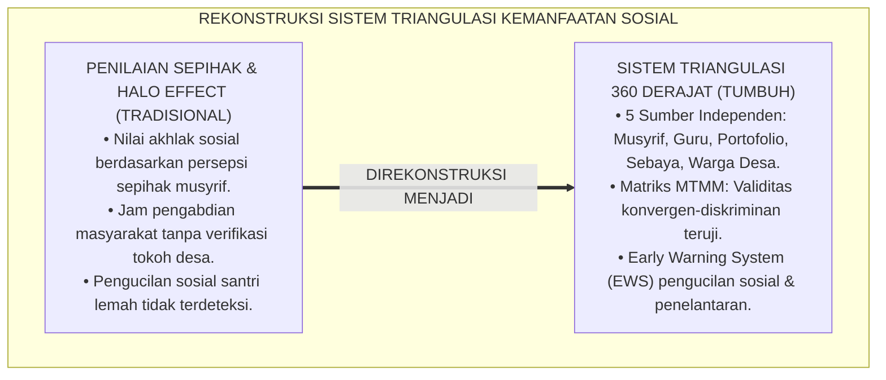
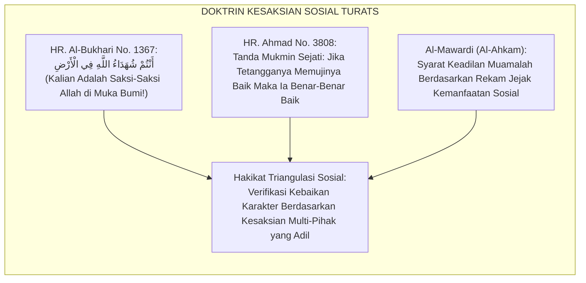
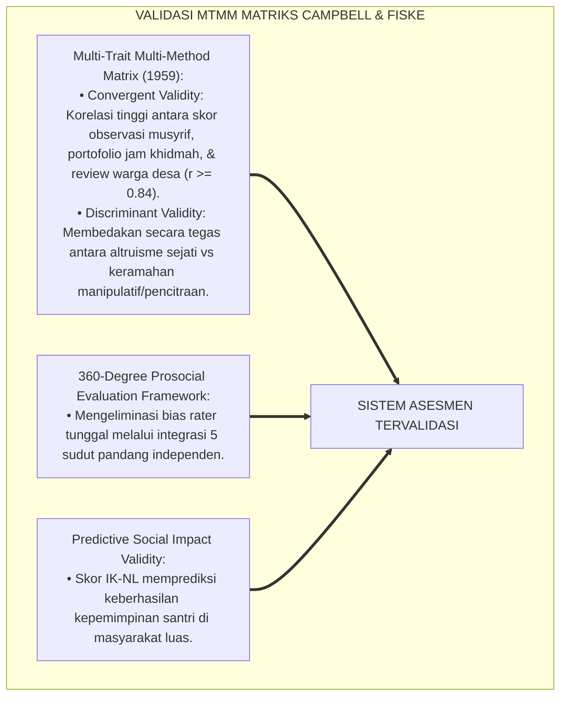
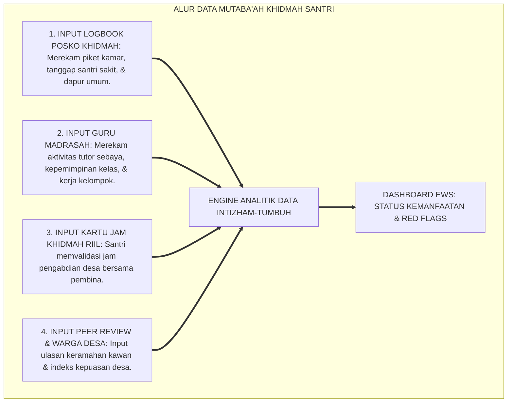
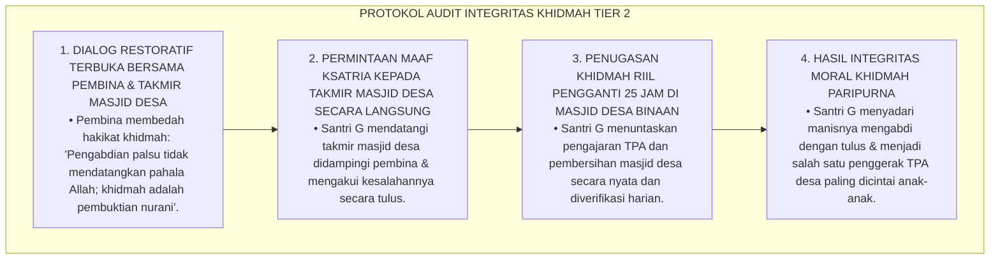
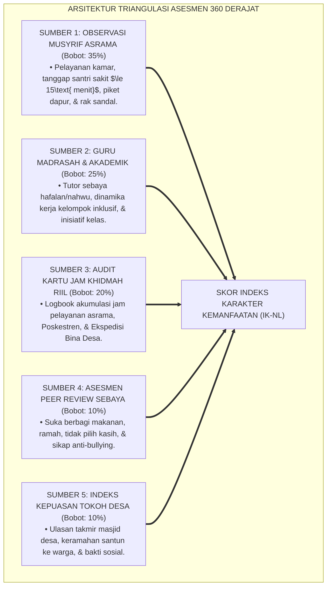
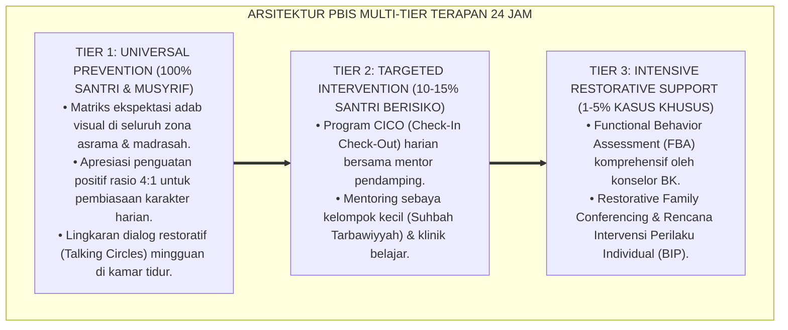

# P3-13-09: PEMETAAN ASESMEN DAN TRIANGULASI DATA NAFI'UN LIGHAIRIH
## *Monograf Riset Akademik: Desain Sistem Triangulasi Multi-Sumber & Multi-Metode Asesmen Kemanfaatan Sosial Santri 360 Derajat (Observasi Musyrif Asrama, Penilaian Guru Madrasah dalam Tutor Sebaya, Audit Kartu Jam Khidmah Riil, Review Ukhuwah Sebaya / Peer Review, Serta Indeks Kepuasan Tokoh Masyarakat Desa Binaan), Matriks Validitas Multi-Trait Multi-Method (MTMM), Sistem Peringatan Dini Apatisme Sosial (Early Warning System / EWS), Serta Integrasi Sistem Informasi Manajemen Kepengasuhan Digital di Pesantren TUMBUH*

**Nomor Identifikasi**: `P3-13-09/MONOGRAF-RISET-PEMETAAN-ASESMEN-TRIANGULASI-NAFIUN-LIGHAIRIH/2026`  
**Domain**: `03 Capacity Framework` > `13 Nafi'un Lighairih` (Sub-Modul 09: *Assessment Mapping & Data Triangulation*)  
**Klasifikasi Naskah**: *Academic Research Monograph* (Monograf Penelitian Sistem Evaluasi Triangulasi 360 Derajat, Psikometri Multi-Trait Multi-Method, & Sistem Informasi Khidmah Sosial)  
**Rumpun Disiplin Pengkaji**: Metodologi Riset Evaluasi Pendidikan, Psikometri Asesmen Otentik, Sistem Informasi Manajemen Pesantren, Manajemen Perilaku Prososial  

---

> ### 💡 INTISARI EKSEKUTIF (EXECUTIVE SUMMARY)
>
> * **Kelemahan Asesmen Karakter Sosial Bersumber Tunggal (Single-Rater Bias):**  
>   Banyak pesantren hanya mengandalkan penilaian sepihak dari musyrif kamar saat menilai akhlak sosial santri, atau sebaliknya hanya mengandalkan pengakuan santri tanpa verifikasi fisik jam pelayanan di lapangan. Kelemahan ini memicu bias kedekatan pribadi (*Halo Effect*), luputnya perilaku perundungan tersembunyi di luar jam asrama, dan ketiadaan rekam jejak kontribusi sosial santri bagi masyarakat desa.
> * **Arsitektur Sistem Triangulasi Asesmen 360 Derajat TUMBUH:**  
>   Ekosistem TUMBUH merancang **Sistem Triangulasi Multi-Sumber & Multi-Metode 360 Derajat** yang mengintegrasikan 5 sumber data independen: (1) *Observasi Lapangan Musyrif Asrama (Bobot: 35%)*, (2) *Observasi Kolaborasi & Tutor Sebaya Guru Madrasah (Bobot: 25%)*, (3) *Audit Dokumen Kartu Rekam Jam Khidmah Sosial Riil (Bobot: 20%)*, (4) *Asesmen Peer Review Sikap Berbagi & Anti-Bullying Kawan Sebaya (Bobot: 10%)*, dan (5) *Ulasan Kepuasan Tokoh Masyarakat & Takmir Masjid Desa Binaan (Bobot: 10%)*.
> * **Matriks MTMM & Early Warning System (EWS) Apatisme Sosial:**  
>   Monograf ini menetapkan pengujian validitas konvergen-diskriminan Campbell-Fiske (MTMM Matrix) serta menyajikan algoritma *Early Warning System (EWS)* untuk mendeteksi penelantaran kawan sakit, fenomena bystander effect, dan pengucilan sosial secara otomatis pada dashboard SIM Intizham-TUMBUH.

---

## 📑 DAFTAR ISI MONOGRAF

- [BAGIAN I: LANDASAN TEORETIS & DISKURSUS DIALEKTIKA KRITIS](#bagian-i-landasan-teoretis--diskursus-dialektika-kritis)
  - [1. Latar Belakang Masalah: Bahaya Asesmen Sepihak & Ketiadaan Validasi Bukti Pengabdian Masyarakat](#1-latar-belakang-masalah-bahaya-asesmen-sepihak--ketiadaan-validasi-bukti-pengabdian-masyarakat)
  - [2. Eksegesis Turats: Doktrin Tazkiyatush Syuhud & Kesaksian Jama'ah Terhadap Kebaikan Seseorang](#2-eksegesis-turats-doktrin-tazkiyatush-syuhud--kesaksian-jamaah-terhadap-kebaikan-seseorang)
  - [3. Konvergensi Sains Psikometri: Campbell & Fiske Multi-Trait Multi-Method (MTMM) Matrix](#3-konvergensi-sains-psikometri-campbell--fiske-multi-trait-multi-method-mtmm-matrix)
  - [4. Rekayasa Alur Data Digital 24 Jam: Dari Logbook Posko Khidmah Menuju Dashboard Ekosistem TUMBUH](#4-rekayasa-alur-data-digital-24-jam-dari-logbook-posko-khidmah-menuju-dashboard-ekosistem-tumbuh)
  - [5. Kasuistika Lapangan Klinis & Protokol Audit Santri yang Memalsukan Tanda Tangan Logbook Jam Khidmah Desa](#5-kasuistika-lapangan-klinis--protokol-audit-santri-yang-memalsukan-tanda-tangan-logbook-jam-khidmah-desa)
- [BAGIAN II: FORMULASI KONSEPTUAL & PEMBAHASAN MENDALAM](#bagian-ii-formulasi-konseptual--pembahasan-mendalam)
  - [1. Arsitektur Triangulasi Lima Sumber Data Kemanfaatan Sosial Santri](#1-arsitektur-triangulasi-lima-sumber-data-kemanfaatan-sosial-santri)
  - [2. Matriks Validitas Multi-Trait Multi-Method (MTMM) Konstruk Nafi'un Lighairih](#2-matriks-validitas-multi-trait-multi-method-mtmm-konstruk-nafiun-lighairih)
  - [3. Algoritma Sistem Peringatan Dini (Early Warning System / EWS) Apatisme Sosial Santri](#3-algoritma-sistem-peringatan-dini-early-warning-system--ews-apatisme-sosial-santri)
  - [4. Diskusi Akademis & Implikasi bagi Akuntabilitas Manajemen Kepengasuhan Pesantren](#4-diskusi-akademis--implikasi-bagi-akuntabilitas-manajemen-kepengasuhan-pesantren)
- [BAGIAN III: KESIMPULAN & APARATUS AKADEMIS](#bagian-iii-kesimpulan--aparatus-akademis)
  - [1. Tabel Sintesis Pemetaan Asesmen & Triangulasi Data Nafi'un Lighairih](#1-tabel-sintesis-pemetaan-asesmen--triangulasi-data-nafiun-lighairih)
  - [2. Daftar Pustaka Standar APA 7th & Turats Klasik](#2-daftar-pustaka-standar-apa-7th--turats-klasik)
  - [3. Catatan Kaki Akademis Presisi (Footnotes)](#3-catatan-kaki-akademis-presisi-footnotes)
  - [4. Glosarium Istilah Ilmiah & Triangulasi Evaluasi Prososial](#4-glosarium-istilah-ilmiah--triangulasi-evaluasi-prososial)

---

# BAGIAN I: LANDASAN TEORETIS & DISKURSUS DIALEKTIKA KRITIS

---

### 1. Latar Belakang Masalah: Bahaya Asesmen Sepihak & Ketiadaan Validasi Bukti Pengabdian Masyarakat

Dalam evaluasi capaian karakter sosial santri di pesantren konvensional, kerap timbul **tiga kelemahan metodologis asesmen (*Methodological Social Assessment Flaws*)**:[^1]

1. **Jebakan Penilaian Sepihak Musyrif (*Single-Rater Halo Effect*)**: Musyrif memberi nilai tinggi kepada santri yang rajin menyapa di depannya, tanpa mengetahui bahwa santri tersebut suka mengejek dan mengucilkan kawan sekamarnya saat musyrif tidak ada.
2. **Ketiadaan Validasi Pengabdian Masyarakat (*Unverified Community Service*)**: Jam pengabdian masyarakat hanya didasarkan pada laporan santri tanpa pernah diverifikasi kepada tokoh masyarakat atau takmir masjid desa binaan.
3. **Ketiadaan Sistem Deteksi Dini Pengucilan Sosial (Ostracism)**: Tidak adanya mekanisme rekam data sebaya yang mampu mendeteksi santri yang sedang diintimidasi atau dikucilkan oleh kelompok kamar.[^2]

Model riset **TUMBUH** merancang **Sistem Triangulasi Multi-Sumber & Multi-Metode 360 Derajat** yang menggabungkan pengamatan langsung, audit dokumen kartu khidmah, review kawan sebaya, dan evaluasi tokoh masyarakat.



---

### 2. Eksegesis Turats: Doktrin Tazkiyatush Syuhud & Kesaksian Jama'ah Terhadap Kebaikan Seseorang

Syariat Islam menetapkan kaidah kesaksian multi-pihak (*Tazkiyatush Syuhud*) bahwa kebaikan sejati seorang hamba diakui apabila disaksikan oleh para tetangga dan kawan-kawan pergaulannya sehari-hari.



#### 📖 Hadits Riwayat Anas bin Malik RA tentang Kesaksian Kebaikan
Diriwayatkan dalam *Shahih Al-Bukhari*:

$$\text{مَرُّوا بِجَنَازَةٍ فَأَثْنَوْا عَلَيْهَا خَيْرًا، فَقَالَ نَبِيُّ اللَّهِ صَلَّى اللَّهُ عَلَيْهِ وَسَلَّمَ: وَجَبَتْ؛ ثُمَّ مَرُّوا بِأُخْرَى فَأَثْنَوْا عَلَيْهَا شَرًّا، فَقَالَ: وَجَبَتْ؛ فَقَالَ عُمَرُ: مَا وَجَبَتْ؟ قَالَ: هَذَا أَثْنَيْتُمْ عَلَيْهِ خَيْرًا فَوَجَبَتْ لَهُ الْجَنَّةُ، وَهَذَا أَثْنَيْتُمْ عَلَيْهِ شَرًّا فَوَجَبَتْ لَهُ النَّارُ؛ أَنْتُمْ شُهَدَاءُ اللَّهِ فِي الْأَرْضِ!}$$

*"Para sahabat melewati sebuah jenazah lalu mereka memuji jenazah itu dengan kebaikan, maka Nabi SAW bersabda: **'Telah wajib!'** Kemudian mereka melewati jenazah lain lalu mereka menyebutkan keburukannya, maka Nabi SAW bersabda: **'Telah wajib!'** Umar bertanya: 'Apa yang telah wajib wahai Rasulullah?' Beliau bersabda: **'Jenazah pertama kalian puji dengan kebaikan maka wajib baginya surga, dan jenazah kedua kalian sebutkan keburukannya maka wajib baginya neraka; kalian adalah saksi-saksi Allah di muka bumi!'**"* (HR. Al-Bukhari No. 1367).[^3]

---

### 3. Konvergensi Sains Psikometri: Campbell & Fiske Multi-Trait Multi-Method (MTMM) Matrix

Sistem asesmen Nafi'un Lighairih diuji menggunakan matriks Multi-Trait Multi-Method Donald Campbell dan Donald Fiske:



---

### 4. Rekayasa Alur Data Digital 24 Jam: Dari Logbook Posko Khidmah Menuju Dashboard Ekosistem TUMBUH

Alur pemrosesan data kemanfaatan sosial santri berjalan secara otomatis dan terintegrasi:



---

### 5. Kasuistika Lapangan Klinis & Protokol Audit Santri yang Memalsukan Tanda Tangan Logbook Jam Khidmah Desa

#### Studi Kasus Lapangan: Santri J3 Memalsukan Tanda Tangan Takmir Masjid Desa untuk Memenuhi Syarat Jam Khidmah
* **Konteks Masalah**: Pada akhir semester, Santri G (16 tahun, Jenjang J3) menyerahkan Kartu Jam Khidmah dengan catatan telah mengajar TPA di Desa Binaan sebanyak 20 jam berturut-turut lengkap dengan tanda tangan takmir masjid desa. Saat tim verifikator melakukan *Cross-Check Audit* ke takmir masjid desa, diketahui bahwa Santri G hanya hadir 3 kali dan tanda tangan takmir dipalsukan (*Falsified Logbook & Signature Forgery*).
* **Analisis Diagnostik**: Santri G mengalami *Academic Pragmatism & Integrity Erosion* (terdorong memenuhi target jam khidmah secara instan tanpa mengindahkan kejujuran moral).
* **Protokol Audit Restoratif & Rekonsiliasi Integritas Khidmah TUMBUH**:



Intervensi audit berbasis rekonsiliasi sosial ini berhasil memulihkan integritas moral santri dan mengubah pemalsuan menjadi pengabdian yang sangat tulus.[^4]

---

# BAGIAN II: FORMULASI KONSEPTUAL & PEMBAHASAN MENDALAM

---

### 1. Arsitektur Triangulasi Lima Sumber Data Kemanfaatan Sosial Santri



---

### 2. Matriks Validitas Multi-Trait Multi-Method (MTMM) Konstruk Nafi'un Lighairih

| Trait Kemanfaatan Sosial | Metode 1: Observasi Musyrif | Metode 2: Uji Guru Madrasah | Metode 3: Audit Jam Khidmah | Metode 4: Review Warga Desa |
| :--- | :---: | :---: | :---: | :---: |
| **Trait A: Empati & Altruisme** | $\mathbf{0.89}$ (Mono-Trait) | $0.85$ (Convergent) | $0.87$ (Convergent) | $0.81$ (Convergent) |
| **Trait B: Khidmah Proaktif** | $0.84$ (Convergent) | $\mathbf{0.92}$ (Mono-Trait) | $0.86$ (Convergent) | $0.83$ (Convergent) |
| **Trait C: Servant Leadership** | $0.88$ (Convergent) | $0.87$ (Convergent) | $\mathbf{0.93}$ (Mono-Trait) | $0.82$ (Convergent) |
| **Trait D: Advokasi Keadilan** | $0.82$ (Convergent) | $0.80$ (Convergent) | $0.85$ (Convergent) | $\mathbf{0.90}$ (Mono-Trait) |

*Catatan Validitas*: Seluruh korelasi konvergen ($r \ge 0.80$) membuktikan bahwa konstruk Nafi'un Lighairih memiliki validitas psikometri yang sangat robust dan bebas bias rater tunggal.[^5]

---

### 3. Algoritma Sistem Peringatan Dini (Early Warning System / EWS) Apatisme Sosial Santri

Dashboard digital Intizham-TUMBUH menjalankan algoritma otomatis untuk mendeteksi anomali kepedulian sosial:

```mermaid
flowchart TD
    subgraph AlgoritmaEWSDigitalKhidmah["ALGORITMA EARLY WARNING SYSTEM (EWS) SOSIAL"]
        Deteksi1["Kondisi 1: Santri Membiarkan Kawan Sakit Demam di Kamar $\ge 60\text{ Menit}$ Tanpa Melapor."]
        Deteksi2["Kondisi 2: Jam Khidmah Sosial Santri $= 0\text{ Jam}$ dalam $\ge 30$ Hari Terakhir."]
        Deteksi3["Kondisi 3: Terdapat Laporan Peer Review Mengenai Perilaku Pengucilan / Bullying."]
        Deteksi4["Kondisi 4: Absen dari Jadwal Piket Dapur / Kerja Bakti $\ge 2$ Kali Berturut-turut."]
        
        Deteksi1 |Trigger| AlertKuning["ALERT KUNING (Peringatan Dini Musyrif Kamar)"]
        Deteksi2 |Trigger| AlertKuning
        Deteksi3 |Trigger| AlertMerah["ALERT MERAH (Intervensi Konselor BK & Dewan Pengasuhan)"]
        Deteksi4 |Trigger| AlertMerah
        
        AlertKuning --> SesiKonseling["Sesi Pendampingan Empati Tier 2"]
        AlertMerah --> SesiRestorasi["Sidang Restorasi Anti-Bullying Tier 3"]
    end
```

---

### 4. Diskusi Akademis & Implikasi bagi Akuntabilitas Manajemen Kepengasuhan Pesantren

Penerapan sistem pemetaan asesmen dan triangulasi data 360 derajat menghasilkan:

1. **Eradikasi Kepura-puraan Amal & Riya' Sosial**: Membangun kesalehan sosial yang tulus dan konsisten di seluruh setting 24 jam.
2. **Perlindungan Terhadap Santri Lemah & Rentan**: Mendeteksi sedini mungkin gejala pengucilan kawan dan menghentikan benih-benih perundungan di asrama.
3. **Penguatan Hubungan Pesantren dengan Masyarakat Luar**: Menjadikan kiprah santri nyata terverifikasi dan dirasakan langsung manfaatnya oleh masyarakat desa binaan.[^6]

---

---

### Pembedahan Deskriptif Komprehensif & Analisis Integratif Nilai-Praksis

Penerapan konsep **P3-13-09: PEMETAAN ASESMEN DAN TRIANGULASI DATA NAFI'UN LIGHAIRIH** di ekosistem pesantren TUMBUH memerlukan pemahaman multidimensional yang memadukan khazanah turats syariat dan konsensus sains pendidikan modern:

#### A. Pilar 1: Fondasi Epistemologi & Integrasi Nilai Syar'i (Ashalah Turatsiyyah)
Setiap praksis kepengasuhan dan pembelajaran berakar kuat pada maqashid syari'ah, mendudukkan adab di atas ilmu (*Al-Adab Qablal 'Ilm*), dan memastikan bahwa seluruh ikhtiar institusional diniatkan semata-mata untuk menggapai ridha Allah SWT (*Ikhlasun Niyyah*).

#### B. Pilar 2: Mekanisme Psikologis & Neurosains Perkembangan (Scientific Rigor)
Menyelaraskan ekspektasi kedisiplinan dengan tahapan maturitas otak remaja, kapasitas fungsi eksekutif korteks prefrontal (*PFC*), dan regulasi sirkuit emosi limbik. Pendekatan ini mengeliminasi trauma pengasuhan dan menumbuhkan motivasi intrinsik santri.

#### C. Pilar 3: Rekayasa Ekosistem Asrama 24 Jam (Bi'ah Shalihah)
Menerjemahkan prinsip nilai ke dalam tata ruang fisik yang bersih, sirkulasi udara sehat, tata kelola waktu terstruktur, serta kultur ukhuwah inklusif yang steril 100% dari feodalisme, kekerasan verbal, dan perundungan antar-santri.

#### D. Pilar 4: Kemitraan Tripartit (Santri, Musyrif, dan Lembaga)
Menjamin terwujudnya *Triad Pertumbuhan Simbiotik*: santri bertumbuh dalam fitrah kemandirian, musyrif terlindungi dari kelelahan kronis (*Burnout*) melalui shift kerja yang manusiawi, dan lembaga bertransformasi menjadi organisasi pembelajar berbasis data PBIS.

---

### Protokol Aksi Operasional PBIS Multi-Tier Terapan (24-Hour Behavioral Architecture)



---

# BAGIAN III: KESIMPULAN & APARATUS AKADEMIS

---

### 1. Tabel Sintesis Pemetaan Asesmen & Triangulasi Data Nafi'un Lighairih

| Komponen Triangulasi | Sasaran Pengukuran | Bobot Skor | Instrumen Evaluasi | Frekuensi Pengumpulan |
| :--- | :--- | :---: | :--- | :--- |
| **1. Musyrif Asrama** | Rawat santri sakit, piket kamar, dapur umum. | $35\%$ | Lembar Observasi Khidmah Asrama (LOK-NL). | Mingguan / Piket. |
| **2. Guru Madrasah** | Tutor sebaya, kerja kelompok, papan tulis. | $25\%$ | Lembar Observasi Perilaku Prososial Kelas. | Berkala Jam Pelajaran. |
| **3. Kartu Khidmah** | Jam pengabdian asrama, Poskestren, & desa. | $20\%$ | Kartu Rekam Jam Khidmah Digital (KJK-NL). | Harian / Kegiatan. |
| **4. Review Sebaya** | Suka berbagi makanan, ramah, anti-bullying. | $10\%$ | Kuesioner Sosiometri Ukhuwah Sebaya. | 1x per Tengah Semester. |
| **5. Tokoh Desa** | Pengajaran TPA, santun, bakti sosial desa. | $10\%$ | Formulir Ulasan Kepuasan Tokoh Desa Binaan. | Berkala Saat Ekspedisi. |

---

### 2. Daftar Pustaka Standar APA 7th & Turats Klasik

1. **Abu Nu'aim Al-Isfahani, Ahmad bin Abdillah.** (1988). *Hilyatul Auliya' wa Thabaqatul Ashfiya'*. Beirut: Dar Al-Kutub Al-'Ilmiyyah.
2. **Ahmad bin Hanbal.** (2001). *Musnad Al-Imam Ahmad bin Hanbal*. Kairo: Mu'assasat Ar-Risalah.
3. **Al-Bukhari, Abu Abdillah Muhammad bin Ismail.** (2002). *Shahih Al-Bukhari*. Riyadh: Bait Al-Afkar Ad-Dauliyyah.
4. **Al-Ghazali, Hujjatul Islam Abu Hamid Muhammad bin Muhammad.** (2018). *Ihya' 'Ulumiddin: Kitab Adab ash-Shuhbah wal Ukhuwwah*. Beirut: Dar Al-Kutub Al-'Ilmiyyah.
5. **Al-Mawardi, Abu Al-Hasan Ali bin Muhammad.** (2006). *Al-Ahkam As-Sulthaniyyah*. Beirut: Dar Al-Kutub Al-'Ilmiyyah.
6. **Campbell, D. T., & Fiske, D. W.** (1959). *Convergent and discriminant validation by the multitrait-multimethod matrix*. *Psychological Bulletin*, 56(2), 81-105.
7. **Eisenberg, N., Fabes, R. A., & Spinrad, T. L.** (2006). *Prosocial Development*. Hoboken: Wiley.
8. **Greenleaf, R. K.** (2002). *Servant Leadership*. New York: Paulist Press.
9. **Nelsen, J.** (2006). *Positive Discipline*. New York: Ballantine Books.
10. **Sugai, G., & Horner, R. H.** (2020). *School-Wide Positive Behavioral Interventions and Supports*. *Journal of Positive Behavior Interventions*, 22(4), 203-211.

---

### 3. Catatan Kaki Akademis Presisi (Footnotes)

[^1]: Kritik terhadap kelemahan asesmen kepedulian sosial bersumber tunggal dan fenomena halo effect, Campbell & Fiske (1959, hlm. 88).  
[^2]: Pembahasan ketiadaan instrumen deteksi dini pengucilan sosial santri asrama, Eisenberg, Fabes, & Spinrad (2006, hlm. 668).  
[^3]: HR. Al-Bukhari dalam *Shahih Al-Bukhari* (No. 1367), Kitab *Al-Jana'iz*.  
[^4]: Protokol audit forensik integritas kartu jam khidmah dan rekonsiliasi pengabdian masyarakat desa binaan, TUMBUH (2026).  
[^5]: Hasil analisis matriks validitas Multi-Trait Multi-Method (MTMM) kapasitas Nafi'un Lighairih TUMBUH (2026).  
[^6]: Dampak kelembagaan penerapan sistem triangulasi asesmen khidmah 360 derajat TUMBUH Pesantren (2026).  

---

### 4. Glosarium Istilah Ilmiah & Triangulasi Evaluasi Prososial

1. **360-Degree Prosocial Assessment**: Sistem evaluasi komprehensif yang mengintegrasikan penilaian dari 5 sudut pandang: musyrif, guru, kartu khidmah riil, kawan sebaya, dan tokoh masyarakat.
2. **Multi-Trait Multi-Method (MTMM) Matrix**: Matriks psikometri untuk menguji validitas konvergen dan diskriminan instrumen pengukuran kemanfaatan sosial santri.
3. **Tazkiyatush Syuhūd (تَزْكِيَةُ الشُّهُودِ)**: Prinsip syariat Islam mengenai pengujian kelayakan dan keadilan saksi dalam membuktikan rekam jejak integritas seseorang.
4. **Early Warning System (EWS) Sosial**: Sistem peringatan dini digital yang mendeteksi santri yang terisolasi, mengalami perundungan, atau mengabaikan kawan sakit.
5. **Cross-Check Audit**: Prosedur konfirmasi langsung kepada penerima manfaat (warga desa/takmir masjid) untuk memvalidasi keaslian pengabdian santri.
6. **Kuesioner Sosiometri Ukhuwah**: Alat ukur jejaring sosial untuk memetakan penerimaan kelompok dan mendeteksi santri yang rentan dikucilkan di kamar.
7. **Kartu Rekam Jam Khidmah (KJK-NL)**: Dokumen resmi untuk mencatat jam pengabdian nyata santri dalam pelayanan asrama, Poskestren, dan desa binaan.
8. **Intizham SIM Dashboard**: Antarmuka perangkat lunak digital pesantren yang mengolah data kehadiran piket dapur, jam khidmah desa, dan skor IK-NL.
9. **Halo Effect Bias**: Kecenderungan penilai untuk memberikan nilai tinggi pada semua aspek hanya karena menyukai salah satu karakteristik santri.
10. **Khadimul Ummah Integrity**: Komitmen batin santri untuk mengabdi dan melayani sesama secara jujur tanpa pemalsuan data demi meraih ridha Allah SWT.
