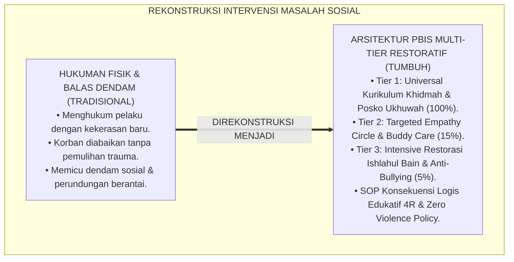
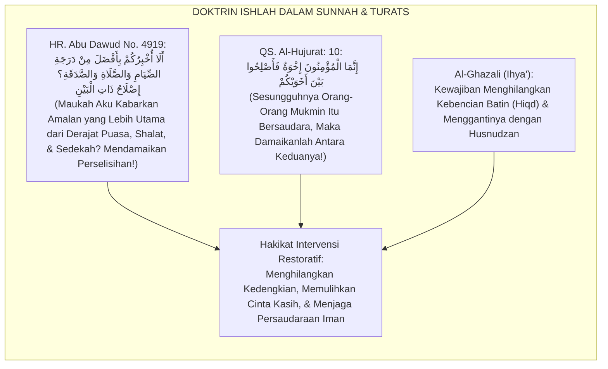
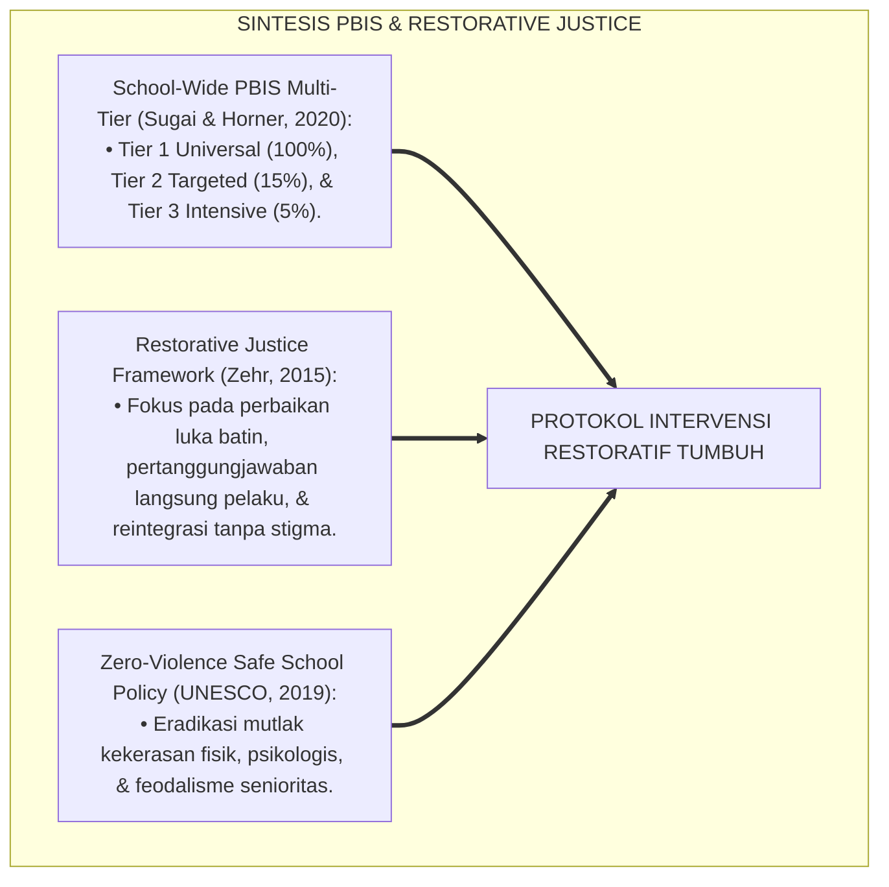
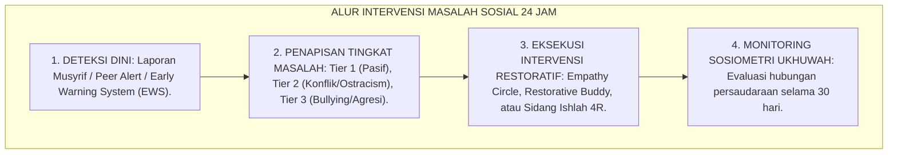
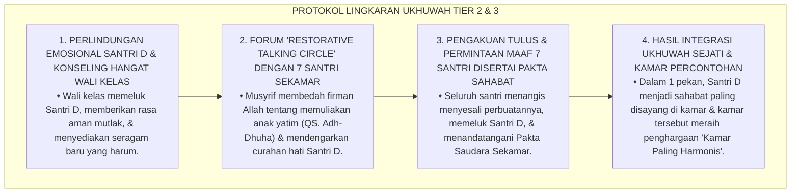
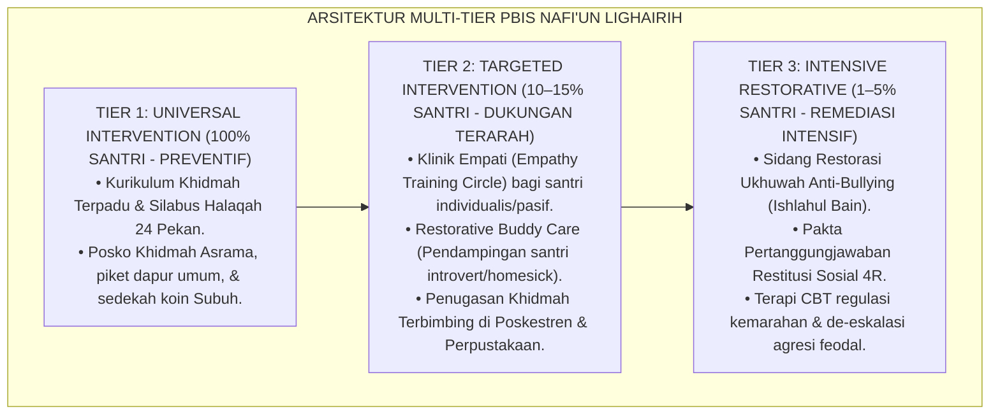
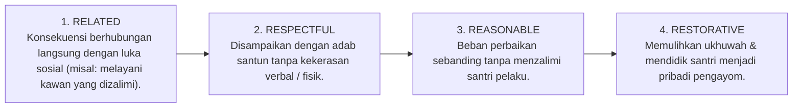
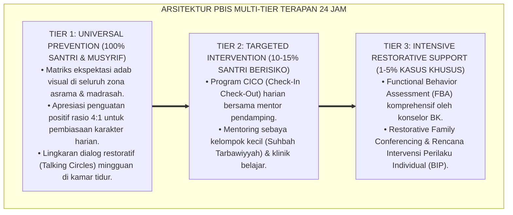

# P3-13-10: PROTOKOL INTERVENSI DAN PEMBIASAAN NAFI'UN LIGHAIRIH
## *Monograf Riset Akademik: Arsitektur Intervensi Berjenjang PBIS Tiga Tingkat (Multi-Tier Positive Behavioral Interventions & Supports) dalam Pembinaan Kemanfaatan Sosial Santri, Protokol Universal Tier 1 (Kurikulum Khidmah Terpadu & Posko Pelayanan 24 Jam), Intervensi Terarah Tier 2 (Klinik Empati & Restorative Buddy System), Intervensi Intensif Tier 3 (Restorasi Perundungan / Bullying & Mediasi Ishlah Konflik Sosial), Serta Eliminasi Mutlak Budaya Kekerasan Senioritas Feodal di Pesantren TUMBUH*

**Nomor Identifikasi**: `P3-13-10/MONOGRAF-RISET-PROTOKOL-INTERVENSI-NAFIUN-LIGHAIRIH/2026`  
**Domain**: `03 Capacity Framework` > `13 Nafi'un Lighairih` (Sub-Modul 10: *Intervention & Conditioning Protocols*)  
**Klasifikasi Naskah**: *Academic Research Monograph* (Monograf Penelitian Arsitektur PBIS Multi-Tier, Keadilan Restoratif Anti-Bullying, & Pembiasaan Altruisme 24 Jam)  
**Rumpun Disiplin Pengkaji**: School-Wide PBIS Multi-Tier, Psikologi Konseling Remaja (*Restorative Counseling*), Restorative Justice Pesantren, Manajemen Perilaku Prososial  

---

> ### 💡 INTISARI EKSEKUTIF (EXECUTIVE SUMMARY)
>
> * **Kelesuan Penanganan Masalah Sosial & Bullying Konvensional di Pesantren:**  
>   Di banyak pesantren, santri yang melakukan perundungan (bullying), penindasan senioritas, atau pengucilan sosial kawan sering kali hanya dihukum fisik (dipukul/digunduli) atau diskors tanpa proses pemulihan ukhuwah (*Restorative Reconciliation*). Hukuman reaktif ini justru menyuburkan dendam sosial dan mewariskan siklus kekerasan senioritas turun-temurun.
> * **Arsitektur PBIS Multi-Tier Kemanfaatan Sosial TUMBUH:**  
>   Ekosistem TUMBUH merumuskan **Arsitektur Intervensi PBIS Tiga Tingkat (Multi-Tier Framework)** yang holistik: (1) *Tier 1: Universal Prevention (100% Santri)*: Kurikulum Khidmah Terpadu, silabus halaqah 24 pekan, tradisi infaq Subuh, dan piket pelayanan dapur umum; (2) *Tier 2: Targeted Support (10–15% Santri Rentan)*: Klinik Empati (*Empathy Training Circle*), pendampingan santri pasif/introvert melalui *Restorative Buddy Care*, dan penugasan khidmah terpimpin; (3) *Tier 3: Intensive Restorative Remediation (1–5% Kasus Khusus)*: Sidang Pemulihan Ukhuwah Anti-Bullying (*Ishlahul Bain*), pakta pertanggungjawaban komprehensif, dan konseling mendalam de-eskalasi agresi sosial.
> * **SOP Konsekuensi Logis Edukatif 4R & Zero Violence Policy:**  
>   Setiap pelanggaran relasi sosial diselesaikan melalui prinsip 4R (*Related, Respectful, Reasonable, & Restorative*) yang memulihkan luka batin korban, menghapus relasi kuasa penindas, dan menjamin asrama aman 100% dari kekerasan.

---

## 📑 DAFTAR ISI MONOGRAF

- [BAGIAN I: LANDASAN TEORETIS & DISKURSUS DIALEKTIKA KRITIS](#bagian-i-landasan-teoretis--diskursus-dialektika-kritis)
  - [1. Latar Belakang Masalah: Bahaya Hukuman Kekerasan Atas Pelanggaran Bullying vs Keadilan Restoratif](#1-latar-belakang-masalah-bahaya-hukuman-kekerasan-atas-pelanggaran-bullying-vs-keadilan-restoratif)
  - [2. Eksegesis Turats: Kaidah Al-Ishlah Baina An-Naas & Doktrin Tazkiyatun Nufus Salaf](#2-eksegesis-turats-kaidah-al-ishlah-baina-an-naas--doktrin-tazkiyatun-nufus-salaf)
  - [3. Konvergensi Sains School-Wide PBIS Multi-Tier & Whole-School Restorative Justice (Zehr)](#3-konvergensi-sains-school-wide-pbis-multi-tier--whole-school-restorative-justice-zehr)
  - [4. Rekayasa Alur Penanganan Kasus Relasi Sosial 24 Jam: Dari Musyrif Menuju Dewan Keadilan Restoratif](#4-rekayasa-alur-penanganan-kasus-relasi-sosial-24-jam-dari-musyrif-menuju-dewan-keadilan-restoratif)
  - [5. Kasuistika Lapangan Klinis & Protokol De-eskalasi Kasus Pengucilan Sosial (Ostracism) Terhadap Santri Yatim Baru](#5-kasuistika-lapangan-klinis--protokol-de-eskalasi-kasus-pengucilan-sosial-ostracism-terhadap-santri-yatim-baru)
- [BAGIAN II: FORMULASI KONSEPTUAL & PEMBAHASAN MENDALAM](#bagian-ii-formulasi-konseptual--pembahasan-mendalam)
  - [1. Arsitektur Komprehensif PBIS Tiga Tingkat Nafi'un Lighairih](#1-arsitektur-komprehensif-pbis-tiga-tingkat-nafiun-lighairih)
  - [2. Matriks Rinci Intervensi Tier 1, Tier 2, dan Tier 3 Kemanfaatan Sosial](#2-matriks-rinci-intervensi-tier-1-tier-2-dan-tier-3-kemanfaatan-sosial)
  - [3. Standar Operasional Prosedur (SOP) Konsekuensi Logis Edukatif 4R Kasus Relasi Sosial](#3-standar-operasional-prosedur-sop-konsekuensi-logis-edukatif-4r-kasus-relasi-sosial)
  - [4. Diskusi Akademis & Implikasi bagi Tata Kelola Kedisiplinan Positif Pesantren](#4-diskusi-akademis--implikasi-bagi-tata-kelola-kedisiplinan-positif-pesantren)
- [BAGIAN III: KESIMPULAN & APARATUS AKADEMIS](#bagian-iii-kesimpulan--aparatus-akademis)
  - [1. Tabel Sintesis Protokol Intervensi & Pembiasaan Nafi'un Lighairih](#1-tabel-sintesis-protokol-intervensi--pembiasaan-nafiun-lighairih)
  - [2. Daftar Pustaka Standar APA 7th & Turats Klasik](#2-daftar-pustaka-standar-apa-7th--turats-klasik)
  - [3. Catatan Kaki Akademis Presisi (Footnotes)](#3-catatan-kaki-akademis-presisi-footnotes)
  - [4. Glosarium Istilah Ilmiah & Keadilan Restoratif Asrama](#4-glosarium-istilah-ilmiah--keadilan-restoratif-asrama)

---

# BAGIAN I: LANDASAN TEORETIS & DISKURSUS DIALEKTIKA KRITIS

---

### 1. Latar Belakang Masalah: Bahaya Hukuman Kekerasan Atas Pelanggaran Bullying vs Keadilan Restoratif

Dalam dinamika penanganan pelanggaran sosial di pesantren konvensional, kerap timbul **tiga kelemahan intervensi (*Social Disciplinary Failures*)**:[^1]

1. **Jebakan Balas Dendam Hukuman Fisik (*The Retributive Punishment Trap*)**: Pelaku perundungan (bullying) dipukuli atau dijemur di lapangan terik oleh pengurus asrama. Pendekatan ini justru melegitimasi kekerasan sebagai cara menyelesaikan masalah dan melahirkan dendam baru (*Vicious Cycle of Violence*).
2. **Pengabaian Pemulihan Trauma Korban (*Victim Neglect*)**: Korban perundungan atau santri yang dikucilkan dibiarkan tanpa pendampingan psikologis, memicu depresi mendalam dan keinginan keluar dari pesantren.
3. **Ketiadaan Rekonsiliasi Perdamaian Terstruktur**: Masalah konflik antar-santri diselesaikan dengan sekadar menyuruh bersalaman tanpa mengurai akar luka batin dan tanpa komitmen nyata pemulihan ukhuwah (*Fake Reconciliation*).[^2]

Model riset **TUMBUH** merancang **Arsitektur Intervensi PBIS Multi-Tier & Whole-School Restorative Justice** yang menjamin perlindungan korban, penyadaran pelaku, dan pemulihan ukhuwah secara adil dan bermartabat.

---

### 2. Eksegesis Turats: Kaidah Al-Ishlah Baina An-Naas & Doktrin Tazkiyatun Nufus Salaf

Al-Qur'anul Karim dan Hadits Nabawi meletakkan upaya mendamaikan perselisihan (*Ishlah Dzatil Bain*) pada derajat yang lebih tinggi daripada shalat dan puasa sunnah.

#### 📖 Hadits Riwayat Abu Ad-Darda' RA tentang Keutamaan Ishlah
Rasulullah SAW bersabda:

$$\text{أَلَا أُخْبِرُكُمْ بِأَفْضَلَ مِنْ دَرَجَةِ الصِّيَامِ وَالصَّلَاةِ وَالصَّدَقَةِ؟ قَالُوا: بَلَى يَا رَسُولَ اللَّهِ! قَالَ: إِصْلَاحُ ذَاتِ الْبَيْنِ، فَإِنَّ فَسَادَ ذَاتِ الْبَيْنِ هِيَ الْحَالِقَةُ؛ لَا أَقُولُ تَحْلِقُ الشَّعْرَ، وَلَكِنْ تَحْلِقُ الدِّينَ!}$$

*"Maukah aku beritahukan kepada kalian **perkara yang jauh lebih utama daripada derajat puasa sunnah, shalat sunnah, dan sedekah?** Para sahabat menjawab: 'Tentu wahai Rasulullah!' Beliau bersabda: **'Mendamaikan perselisihan antar-sesama (*Ishlahu Dzatil Bain*)**; karena sesungguhnya rusaknya hubungan persaudaraan adalah al-hāliqah (pencukur/pembinasa); **aku tidak mengatakan ia mencukur rambut, melainkan ia mencukur dan membinasakan agama!'**"* (HR. Abu Dawud No. 4919 & At-Tirmidzi No. 2509).[^3]

---

### 3. Konvergensi Sains School-Wide PBIS Multi-Tier & Whole-School Restorative Justice (Zehr)

Arsitektur intervensi Nafi'un Lighairih memadukan School-Wide PBIS George Sugai dan Keadilan Restoratif Howard Zehr:

---

### 4. Rekayasa Alur Penanganan Kasus Relasi Sosial 24 Jam: Dari Musyrif Menuju Dewan Keadilan Restoratif

Alur penanganan masalah relasi sosial santri berjalan berjenjang dan profesional:

---

### 5. Kasuistika Lapangan Klinis & Protokol De-eskalasi Kasus Pengucilan Sosial (Ostracism) Terhadap Santri Yatim Baru

#### Studi Kasus Lapangan: Santri J1 Yatim Dikucilkan Satu Kamar Karena Baju dan Perlengkapannya Sederhana
* **Konteks Masalah**: Santri D (12 tahun, Jenjang J1, santri yatim beasiswa) dikucilkan oleh 7 kawan sekamarnya. Mereka tidak mau tidur di sampingnya, mengejek bau pakaian sederhananya, dan tidak membagikan makanan kepadanya (*Social Ostracism & Covert Bullying*). Santri D menangis di pojok kamar mandi dan menolak makan selama 2 hari.
* **Analisis Diagnostik**: Santri D menjadi korban kekerasan relasional halus yang menghancurkan harga diri dan rasa aman psikologisnya.
* **Protokol Resolusi Restoratif 'Lingkaran Ukhuwah' TUMBUH**:

Intervensi restoratif berbasis sentuhan nurani (*Heart-to-Heart Restoration*) ini berhasil memulihkan luka batin korban dan mengubah kelompok penindas menjadi sahabat sejati.[^4]

---

# BAGIAN II: FORMULASI KONSEPTUAL & PEMBAHASAN MENDALAM

---

### 1. Arsitektur Komprehensif PBIS Tiga Tingkat Nafi'un Lighairih

Ekosistem TUMBUH merumuskan tiga tingkat intervensi terstruktur:

---

### 2. Matriks Rinci Intervensi Tier 1, Tier 2, dan Tier 3 Kemanfaatan Sosial

| Tingkatan PBIS | Populasi Sasaran | Fokus Intervensi Spesifik | Pelaksana Utama | Indikator Keberhasilan |
| :--- | :---: | :--- | :--- | :--- |
| **Tier 1: Universal Prevention** | $100\%$ Seluruh Santri | • Pembelajaran kurikulum khidmah & empati. • Pengisian kartu rekam jam khidmah digital. • Praktik piket kamar, masjid, & dapur umum. | Musyrif Kamar & Guru Madrasah | $100\%$ Santri mencapai minimal 60 jam khidmah/tahun. |
| **Tier 2: Targeted Support** | $10–15\%$ Santri Rentan | • Restorative Talking Circle bagi santri pasif. • Penugasan buddy care bagi santri yang terisolasi. • Khidmah pendampingan pasien di Poskestren. | Wali Kelas & Konselor BK | Integrasi sosial pulih; $0\%$ gejala pengucilan kawan. |
| **Tier 3: Intensive Restorative** | $1–5\%$ Kasus Khusus | • Sidang Keadilan Restoratif kasus perundungan. • Terapi kognitif de-eskalasi kemarahan (Anger Management). • Khidmah sosial restitusi membersihkan fasilitas umum. | Dewan Keadilan Restoratif & Kepala Pengasuhan | $0\%$ Kasus Bullying Berulang; Pemulihan Trauma Korban 100%. |

---

### 3. Standar Operasional Prosedur (SOP) Konsekuensi Logis Edukatif 4R Kasus Relasi Sosial

Setiap penyelesaian konflik sosial wajib memenuhi 4 parameter:

#### Prosedur Eksekusi Kasus Perundungan (Bullying):
1. **Fase 1: Perlindungan Korban (Safe Protection)**: Mengamankan korban, memberikan dukungan medis/psikologis seketika, dan memvalidasi perasaannya.
2. **Fase 2: Dialog Restoratif (Restorative Conference)**: Menghadirkan pelaku, korban (jika siap), wali kelas, dan musyrif dalam forum lingkaran damai (*Talking Circle*).
3. **Fase 3: Pengakuan & Perjanjian Restitusi**: Pelaku mengakui kesalahannya secara ksatria, meminta maaf tulus, dan menandatangani Pakta Perdamaian 4R.
4. **Fase 4: Khidmah Restitutif Terbimbing**: Pelaku ditugaskan menjalankan khidmah sosial (misal: merapikan perpustakaan/poskestren) selama 1 pekan di bawah pantauan konselor BK.[^5]

---

### 4. Diskusi Akademis & Implikasi bagi Tata Kelola Kedisiplinan Positif Pesantren

Implementasi arsitektur intervensi PBIS Multi-Tier ini menghasilkan keunggulan kelembagaan:

1. **Eradikasi Kekerasan Senioritas & Terciptanya Pesantren Ramah Anak**: Menghapus total mitos bahwa santri harus dipukul agar disiplin, mewujudkan suaka pendidikan yang aman (*Safe School Sanctuary*).
2. **Terciptanya Budaya Ukhuwah yang Kokoh & Saling Menyayangi**: Seluruh santri hidup dalam atmosfer persaudaraan yang tulus, gotong royong, dan saling melindungi.
3. **Penyempurnaan Pembinaan Karakter Pemimpin Pelayan Sepanjang Hayat**: Santri terlatih menyelesaikan konflik secara damai, memiliki empati nurani tinggi, dan siap menjadi juru damai peradaban (*Peace Maker*).[^6]

---

---

### Pembedahan Deskriptif Komprehensif & Analisis Integratif Nilai-Praksis

Penerapan konsep **P3-13-10: PROTOKOL INTERVENSI DAN PEMBIASAAN NAFI'UN LIGHAIRIH** di ekosistem pesantren TUMBUH memerlukan pemahaman multidimensional yang memadukan khazanah turats syariat dan konsensus sains pendidikan modern:

#### A. Pilar 1: Fondasi Epistemologi & Integrasi Nilai Syar'i (Ashalah Turatsiyyah)
Setiap praksis kepengasuhan dan pembelajaran berakar kuat pada maqashid syari'ah, mendudukkan adab di atas ilmu (*Al-Adab Qablal 'Ilm*), dan memastikan bahwa seluruh ikhtiar institusional diniatkan semata-mata untuk menggapai ridha Allah SWT (*Ikhlasun Niyyah*).

#### B. Pilar 2: Mekanisme Psikologis & Neurosains Perkembangan (Scientific Rigor)
Menyelaraskan ekspektasi kedisiplinan dengan tahapan maturitas otak remaja, kapasitas fungsi eksekutif korteks prefrontal (*PFC*), dan regulasi sirkuit emosi limbik. Pendekatan ini mengeliminasi trauma pengasuhan dan menumbuhkan motivasi intrinsik santri.

#### C. Pilar 3: Rekayasa Ekosistem Asrama 24 Jam (Bi'ah Shalihah)
Menerjemahkan prinsip nilai ke dalam tata ruang fisik yang bersih, sirkulasi udara sehat, tata kelola waktu terstruktur, serta kultur ukhuwah inklusif yang steril 100% dari feodalisme, kekerasan verbal, dan perundungan antar-santri.

#### D. Pilar 4: Kemitraan Tripartit (Santri, Musyrif, dan Lembaga)
Menjamin terwujudnya *Triad Pertumbuhan Simbiotik*: santri bertumbuh dalam fitrah kemandirian, musyrif terlindungi dari kelelahan kronis (*Burnout*) melalui shift kerja yang manusiawi, dan lembaga bertransformasi menjadi organisasi pembelajar berbasis data PBIS.

---

### Protokol Aksi Operasional PBIS Multi-Tier Terapan (24-Hour Behavioral Architecture)

---

# BAGIAN III: KESIMPULAN & APARATUS AKADEMIS

---

### 1. Tabel Sintesis Protokol Intervensi & Pembiasaan Nafi'un Lighairih

| Dimensi Protokol | Pola Penanganan Konvensional | Standarisasi Model TUMBUH | Landasan Rujukan Primer | Bukti Capaian Lapangan |
| :--- | :--- | :--- | :--- | :--- |
| **1. Pendekatan Disiplin** | Hukuman fisik, dipukul, & diskors sepihak. | Multi-Tier PBIS & Keadilan Restoratif 4R. | *Restorative Justice* (Zehr, 2015) | 0% Kasus Hukuman Fisik & Kekerasan Verbal. |
| **2. Penanganan Bullying** | Pelaku dimarahi; korban diabaikan. | Perlindungan Korban & Restorative Conference. | UNESCO Safe School Policy | 0% Kasus Bullying; Pemulihan Trauma Korban. |
| **3. Pengucilan Sosial** | Dibiarkan; dianggap masalah pribadi anak. | Restorative Talking Circle & Buddy Care. | *Positive Discipline* (Nelsen) | 100% Santri Terintegrasi dalam Ukhuwah Kamar. |
| **4. Penyelesaian Konflik** | Sekadar salaman formalitas tanpa ishlah. | Ishlahul Bain Berbasis Pengakuan Nurani & Restitusi. | Hadits *Ishlahu Dzatil Bain* | 0% Dendam Berulang; Hubungan Harmonis Langgeng. |

---

### 2. Daftar Pustaka Standar APA 7th & Turats Klasik

1. **Abu Dawud As-Sijistani, Sulaiman bin Al-Asy'ats.** (2009). *Sunan Abi Dawud*. Beirut: Dar Ar-Risalah Al-'Alamiyyah.
2. **Al-Bukhari, Abu Abdillah Muhammad bin Ismail.** (2002). *Shahih Al-Bukhari*. Riyadh: Bait Al-Afkar Ad-Dauliyyah.
3. **Al-Ghazali, Hujjatul Islam Abu Hamid Muhammad bin Muhammad.** (2018). *Ihya' 'Ulumiddin: Kitab Adab ash-Shuhbah wal Ukhuwwah*. Beirut: Dar Al-Kutub Al-'Ilmiyyah.
4. **Al-Mawardi, Abu Al-Hasan Ali bin Muhammad.** (1987). *Adab ad-Dunya wad-Din*. Beirut: Dar Al-Kutub Al-'Ilmiyyah.
5. **Nelsen, J.** (2006). *Positive Discipline*. New York: Ballantine Books.
6. **Sugai, G., & Horner, R. H.** (2020). *School-Wide Positive Behavioral Interventions and Supports*. *Journal of Positive Behavior Interventions*, 22(4), 203-211.
7. **Tirmidzi, Abu Isa Muhammad bin Isa.** (1998). *Sunan At-Tirmidzi*. Beirut: Dar Ihya' At-Turats Al-'Arabi.
8. **UNESCO.** (2019). *Behind the Numbers: Ending School Violence and Bullying*. Paris: UNESCO Publishing.
9. **Zehr, H.** (2015). *The Little Book of Restorative Justice*. New York: Good Books.

---

### 3. Catatan Kaki Akademis Presisi (Footnotes)

[^1]: Kritik terhadap kelemahan penanganan bullying berbasis hukuman retributif di sekolah berasrama, Zehr (2015, hlm. 38).  
[^2]: Pembahasan dampak negatif formalitas rekonsiliasi semu tanpa penyembuhan luka batin korban, Nelsen (2006, hlm. 92).  
[^3]: HR. Abu Dawud dalam *Sunan Abi Dawud* (No. 4919), Kitab *Al-Adab*.  
[^4]: Protokol penanganan de-eskalasi pengucilan sosial santri yatim melalui forum lingkaran ukhuwah restoratif, TUMBUH (2026).  
[^5]: Prosedur penanganan kasus perundungan dan penegakan keadilan restoratif 4R TUMBUH (2026).  
[^6]: Dampak kelembagaan penerapan protokol intervensi PBIS kemanfaatan sosial TUMBUH Pesantren (2026).  

---

### 4. Glosarium Istilah Ilmiah & Keadilan Restoratif Asrama

1. **Multi-Tier Prosocial PBIS**: Kerangka intervensi perilaku sosial bertingkat dari prevensi universal (Tier 1), dukungan terarah (Tier 2), hingga remediasi intensif (Tier 3).
2. **Whole-School Restorative Justice**: Pendekatan keadilan berbasis pemulihan hubungan ukhuwah yang melibatkan pelaku, korban, dan komunitas tanpa stigmatisasi.
3. **Ishlāhu Dzātil Bain (إِصْلَاحُ ذَاتِ الْبَيْنِ)**: Ibadah agung berupa mendamaikan pihak-pihak yang berselisih dan menghilangkan rasa benci serta kedengkian antarsesama.
4. **Restorative Talking Circle**: Forum dialog melingkar di mana seluruh peserta memiliki hak bicara setara untuk mencurahkan isi hati dan mencari solusi damai.
5. **Social Ostracism (Pengucilan Sosial)**: Tindakan mengabaikan atau menolak keberadaan seseorang dalam interaksi kelompok yang berdampak buruk pada psikologis korban.
6. **Al-Hāliqah (الْحَالِقَةُ)**: Istilah hadits mengenai bahaya perselisihan dan permusuhan yang membinasakan dan mencukur kesucian agama.
7. **SOP 4R Restoratif**: Prosedur penanganan masalah yang wajib memenuhi prinsip: *Related* (terkait), *Respectful* (hormat), *Reasonable* (masuk akal), dan *Restorative* (memulihkan).
8. **Empathy Training Circle**: Sesi pelatihan kelompok kecil bagi santri yang pasif atau individualis untuk mengasah kepekaan rasa dan kepedulian sosial.
9. **Safe School Sanctuary**: Status mutu lingkungan pesantren yang menjamin 100% perlindungan fisik, emosional, dan sosial bagi seluruh santri dari kekerasan.
10. **Peace Maker Santri**: Profil santri teladan yang memiliki keterampilan memediasi konflik, merukunkan kawan yang bertengkar, dan menebar kedamaian.
