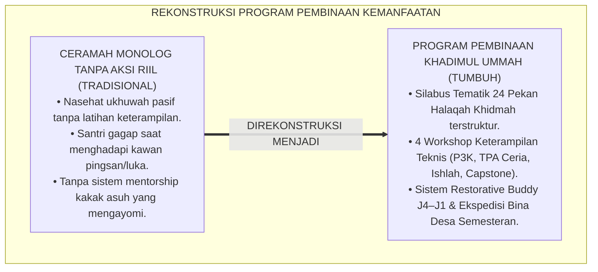
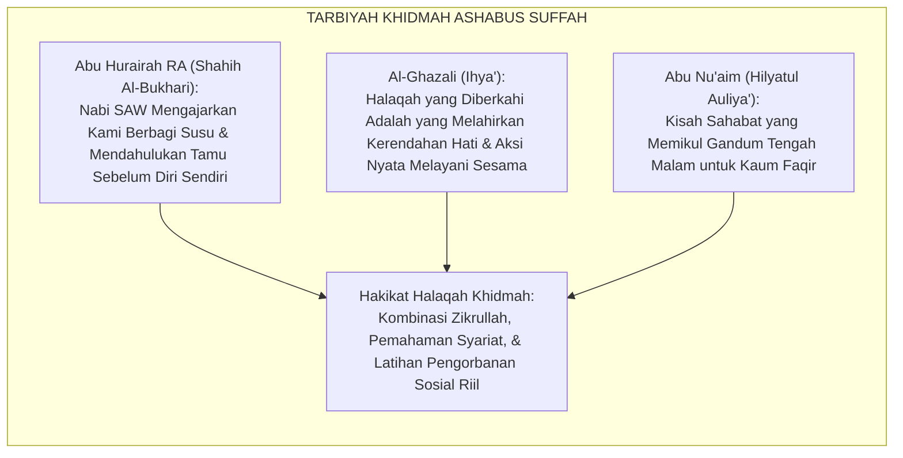
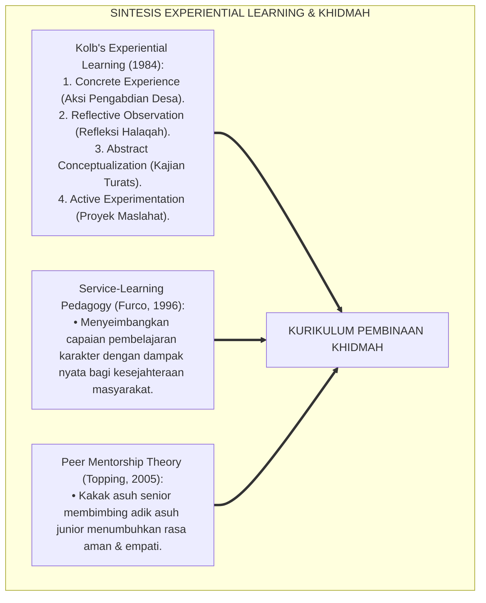
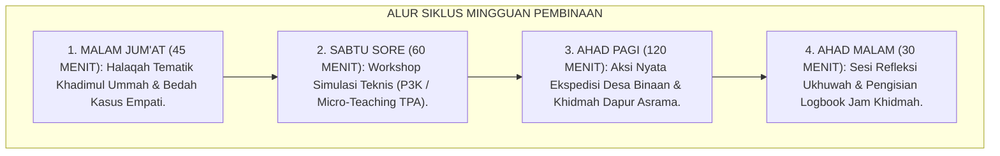
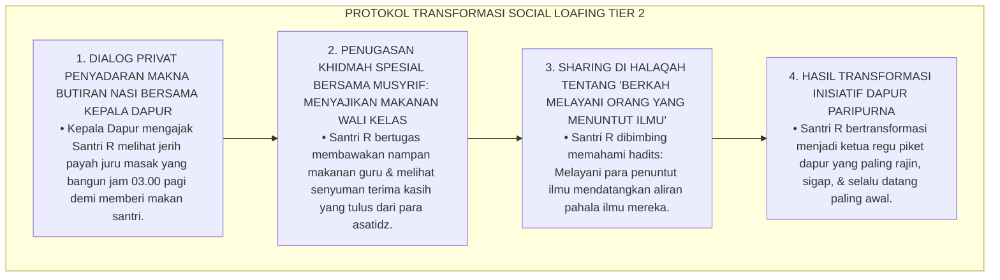
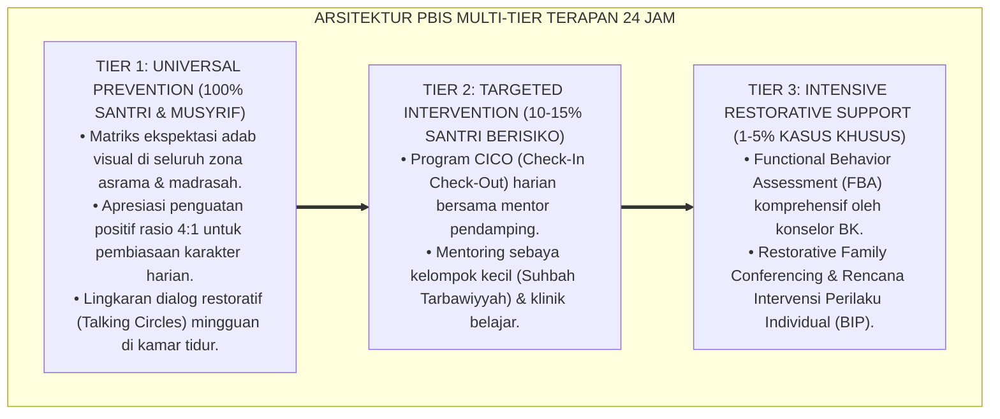

# P3-13-11: PROGRAM PEMBINAAN DAN HALAQAH NAFI'UN LIGHAIRIH
## *Monograf Riset Akademik: Desain Kurikulum Pembinaan & Silabus Halaqah Tematik 24 Pekan Kemanfaatan Sosial (Halaqah Khadimul Ummah), Modul Pelatihan Aplikatif Khidmah (Workshop Pertolongan Pertama P3K, Manajemen Poskestren, Pedagogi Mengajar TPA Ceria, & Mediasi Ishlah Damai), Sistem Mentorship Kakak Asuh Restorative Buddy J4–J1, Serta Program Ekspedisi Santri Bina Desa Berkelanjutan di Pesantren TUMBUH*

**Nomor Identifikasi**: `P3-13-11/MONOGRAF-RISET-PROGRAM-PEMBINAAN-HALAQAH-NAFIUN-LIGHAIRIH/2026`  
**Domain**: `03 Capacity Framework` > `13 Nafi'un Lighairih` (Sub-Modul 11: *Guidance Programs & Halaqah Syllabus*)  
**Klasifikasi Naskah**: *Academic Research Monograph* (Monograf Penelitian Kurikulum Halaqah Karakter Sosial, Desain Pelatihan Pengabdian Masyarakat, & Manajemen Mentorship Asrama)  
**Rumpun Disiplin Pengkaji**: Desain Kurikulum Halaqah Pesantren, Metodologi Pelatihan Pengabdian Masyarakat, Manajemen Pendampingan Sebaya (*Peer Mentorship*), Sosiologi Dakwah Terapan  

---

> ### 💡 INTISARI EKSEKUTIF (EXECUTIVE SUMMARY)
>
> * **Kelemahan Silabus Pembinaan Kepedulian Sosial Konvensional:**  
>   Banyak pengajian atau halaqah malam di pesantren hanya berisi ceramah monolog satu arah tentang fadhilah tolong-menolong tanpa pernah dibekali dengan silabus terstruktur, tanpa simulasi keterampilan teknis pelayanan sosial (seperti praktik pertolongan pertama pada santri pingsan atau teknik mengajar anak kecil), dan tanpa program aksi pengabdian nyata ke masyarakat sekitar.
> * **Silabus Tematik 24 Pekan Halaqah Khadimul Ummah TUMBUH:**  
>   Ekosistem TUMBUH merancang **Silabus Tematik 24 Pekan Halaqah Khadimul Ummah** yang dibagi ke dalam 4 kuadran progresif: (1) *Kuadran I (Pekan 1–6): Purifikasi Niat, Ruh Al-Itsar, & Adab ash-Shuhbah Salaf*, (2) *Kuadran II (Pekan 7–12): Keterampilan Teknis Khidmah Asrama (P3K Gawat Darurat, Tanggap Poskestren, & Pemeliharaan Bi'ah)*, (3) *Kuadran III (Pekan 13–18): Pedagogi Dakwah Masyarakat & Didaktik Mengajar TPA Desa Binaan*, dan (4) *Kuadran IV (Pekan 19–24): Servant Leadership, Mediasi Ishlah Damai, & Perancangan Capstone Civilizational Project*.
> * **Sistem Mentorship Restorative Buddy & Ekspedisi Bina Desa:**  
>   Monograf ini mengkodifikasi tata kelola sistem pendampingan kakak asuh J4–J1 (*Restorative Buddy System*) dan agenda semesteran *Ekspedisi Santri Bina Desa* yang menjamin setiap santri memiliki jam terbang pengabdian sosial nyata.

---

## 📑 DAFTAR ISI MONOGRAF

- [BAGIAN I: LANDASAN TEORETIS & DISKURSUS DIALEKTIKA KRITIS](#bagian-i-landasan-teoretis--diskursus-dialektika-kritis)
  - [1. Latar Belakang Masalah: Bahaya Pembinaan Khidmah Monolog Tanpa Keterampilan Teknis & Aksi Riil](#1-latar-belakang-masalah-bahaya-pembinaan-khidmah-monolog-tanpa-keterampilan-teknis--aksi-riil)
  - [2. Eksegesis Turats: Metode Halaqah Ta'lim & Khidmah Ashabus Suffah di Bawah Asuhan Rasulullah SAW](#2-eksegesis-turats-metode-halaqah-talim--khidmah-ashabus-suffah-di-bawah-asuhan-rasulullah-saw)
  - [3. Konvergensi Sains Service-Learning Pedagogy & Experiential Learning Theory (Kolb)](#3-konvergensi-sains-service-learning-pedagogy--experiential-learning-theory-kolb)
  - [4. Rekayasa Alur Program 24 Jam: Dari Diskusi Halaqah Menuju Aksi Lapangan Nyata](#4-rekayasa-alur-program-24-jam-dari-diskusi-halaqah-menuju-aksi-lapangan-nyata)
  - [5. Kasuistika Lapangan Klinis & Protokol Pendampingan Santri J2 yang Malas Menghadiri Program Kerja Bakti Dapur Asrama](#5-kasuistika-lapangan-klinis--protokol-pendampingan-santri-j2-yang-malas-menghadiri-program-kerja-bakti-dapur-asrama)
- [BAGIAN II: FORMULASI KONSEPTUAL & PEMBAHASAN MENDALAM](#bagian-ii-formulasi-konseptual--pembahasan-mendalam)
  - [1. Silabus Komprehensif 24 Pekan Halaqah Khadimul Ummah TUMBUH](#1-silabus-komprehensif-24-pekan-halaqah-khadimul-ummah-tumbuh)
  - [2. Desain Empat Modul Pelatihan Aplikatif Khidmah (P3K Medis, TPA Ceria, Ishlah Damai, & Capstone Project)](#2-desain-empat-modul-pelatihan-aplikatif-khidmah-p3k-medis-tpa-ceria-ishlah-damai--capstone-project)
  - [3. Tata Kelola Sistem Mentorship Restorative Buddy J4–J1 & Ekspedisi Bina Desa Semesteran](#3-tata-kelola-sistem-mentorship-restorative-buddy-j4j1--ekspedisi-bina-desa-semesteran)
  - [4. Diskusi Akademis & Implikasi bagi Penjaminan Mutu Pembinaan Karakter Sosial Pesantren](#4-diskusi-akademis--implikasi-bagi-penjaminan-mutu-pembinaan-karakter-sosial-pesantren)
- [BAGIAN III: KESIMPULAN & APARATUS AKADEMIS](#bagian-iii-kesimpulan--aparatus-akademis)
  - [1. Tabel Sintesis Program Pembinaan & Halaqah Nafi'un Lighairih](#1-tabel-sintesis-program-pembinaan--halaqah-nafiun-lighairih)
  - [2. Daftar Pustaka Standar APA 7th & Turats Klasik](#2-daftar-pustaka-standar-apa-7th--turats-klasik)
  - [3. Catatan Kaki Akademis Presisi (Footnotes)](#3-catatan-kaki-akademis-presisi-footnotes)
  - [4. Glosarium Istilah Ilmiah & Program Pembinaan Khidmah Sosial](#4-glosarium-istilah-ilmiah--program-pembinaan-khidmah-sosial)

---

# BAGIAN I: LANDASAN TEORETIS & DISKURSUS DIALEKTIKA KRITIS

---

### 1. Latar Belakang Masalah: Bahaya Pembinaan Khidmah Monolog Tanpa Keterampilan Teknis & Aksi Riil

Dalam praksis pembinaan kepedulian sosial santri di pesantren tradisional, kerap timbul **tiga kelemahan desain program (*Programmatic Design Weaknesses*)**:[^1]

1. **Jebakan Ceramah Monolog Pasif (*Passive Lecture Trap*)**: Halaqah mingguan hanya diisi nasehat umum tentang ukhuwah tanpa melibatkan santri dalam studi kasus dilema sosial, bermain peran (*Role-Playing*), atau simulasi tindakan menolong.
2. **Ketiadaan Pelatihan Keterampilan Khidmah Fungsional**: Santri tidak pernah diajarkan keterampilan praktis bagaimana membalut luka kawan yang berdarah, bagaimana menenangkan santri baru yang histeris rindu rumah, atau bagaimana mengajar Al-Qur'an secara menyenangkan bagi anak-anak desa.
3. **Ketiadaan Program Mentorship Sebaya Terstruktur**: Santri baru dibiarkan beradaptasi sendirian tanpa pendampingan kakak kelas, membuka celah terjadinya pengucilan sosial dan kecemasan asrama.[^2]

Model riset **TUMBUH** merancang **Program Pembinaan Terpadu & Silabus Halaqah 24 Pekan** yang memadukan kedalaman kajian Turats, penguasaan keterampilan teknis pelayanan, dan aksi pengabdian masyarakat nyata.

---

### 2. Eksegesis Turats: Metode Halaqah Ta'lim & Khidmah Ashabus Suffah di Bawah Asuhan Rasulullah SAW

Rasulullah SAW mendidik para sahabat Ahlus Suffah di Masjid Nabawi tidak hanya dengan hafalan wahyu, melainkan membimbing mereka terjun langsung membantu masyarakat, mengumpulkan kayu bakar untuk janda dhu'afa, dan merawat para musafir.

#### 📖 Formulasi Imam Abu Nu'aim Al-Isfahani tentang Tarbiyah Khidmah
Al-Imam **Abu Nu'aim Al-Isfahani** menegaskan dalam *Hilyatul Auliya'*:

$$\text{كَانَ عُلَمَاءُ السَّلَفِ إِذَا جَلَسُوا فِي حِلَقِ الْعِلْمِ لَمْ يَقْتَصِرُوا عَلَى سَرْدِ الْمَسَائِلِ، بَلْ كَانُوا يَتَفَقَّدُونَ حَوَائِجَ بَعْضِهِمْ، وَيَخْرُجُونَ مَعًا لِعِيَادَةِ الْمَرِيضِ وَخِدْمَةِ الْعَاجِزِ؛ فَكَانَ الْعِلْمُ عِنْدَهُمْ شَجَرَةً ثَمَرَتُهَا الْخِدْمَةُ وَالرَّحْمَةُ بِالْخَلْقِ}$$

*"Para ulama salaf terdahulu **ketika duduk dalam halaqah-halaqah ilmu tidak hanya mencukupkan diri dengan menguraikan masalah-masalah fiqh**, melainkan mereka senantiasa memeriksa hajat keperluan kawan-kawan mereka, **dan mereka keluar bersama-sama setelah halaqah untuk menjenguk orang sakit dan melayani orang yang lemah**; maka ilmu di mata mereka adalah sebatang pohon yang **buah puncaknya adalah khidmah dan kasih sayang kepada seluruh makhluk!**"*[^3]

---

### 3. Konvergensi Sains Service-Learning Pedagogy & Experiential Learning Theory (Kolb)

Kurikulum pembinaan Nafi'un Lighairih memadukan Siklus Belajar Pengalaman David Kolb dan Service-Learning Pedagogy:

---

### 4. Rekayasa Alur Program 24 Jam: Dari Diskusi Halaqah Menuju Aksi Lapangan Nyata

Program pembinaan dirancang mengalir mulus antara penguatan teori dan eksekusi praksis:

---

### 5. Kasuistika Lapangan Klinis & Protokol Pendampingan Santri J2 yang Malas Menghadiri Program Kerja Bakti Dapur Asrama

#### Studi Kasus Lapangan: Santri J2 Sering Menghilang Saat Jadwal Piket Dapur Umum Asrama
* **Konteks Masalah**: Santri R (14 tahun, Jenjang J2) sudah 3 kali sengaja bersembunyi di kamar mandi saat jadwal regunya bertugas piket dapur umum menyiapkan makan malam 300 santri (*Social Loafing & Duty Evasion*).
* **Analisis Diagnostik**: Santri R mengalami *Social Loafing Mentality* (menganggap orang lain yang akan menyelesaikan tugas dan merasa jijik memegang peralatan dapur).
* **Protokol Transformasi Nurani & Pemodelan Qudwah Bersama Musyrif**:

Intervensi penyadaran makna (*Meaningful Service Engagement*) ini mengubah rasa jijik dan kemalasan menjadi kebanggaan melayani para penuntut ilmu.[^4]

---

# BAGIAN II: FORMULASI KONSEPTUAL & PEMBAHASAN MENDALAM

---

### 1. Silabus Komprehensif 24 Pekan Halaqah Khadimul Ummah TUMBUH

Silabus halaqah berdurasi 24 pekan (2 semester) diorganisasikan ke dalam 4 kuadran progresif:

```mermaid
flowchart TD
    subgraph Silabus24PekanHalaqahKhidmah["SILABUS 24 PEKAN HALAQAH KHADIMUL UMMAH"]
        subgraph K1["KUADRAN I: FONDASI EMPATI & RUH AL-ITSAR (PEKAN 1–6)"]
            W01["Pekan 1: Hadits Khairun Naas Anfa'uhum lin Naas & Visi Khadimul Ummah"]
            W02["Pekan 2: Adab ash-Shuhbah Imam Al-Ghazali & Menjaga Perasaan Kawan"]
            W03["Pekan 3: Keagungan Doktrin Al-Itsar (Mendahulukan Saudara Seiman)"]
            W04["Pekan 4: Tazkiyatun Nafs: Mengikis Sombong & Riya' dalam Beramal"]
            W05["Pekan 5: Adab Menjenguk & Merawat Kawan Sekamar yang Sakit"]
            W06["Pekan 6: Indahnya Berbagi Rezeki: Praktik Infaq Subuh & Berbagi Makanan"]
        end

        subgraph K2["KUADRAN II: KETERAMPILAN TEKNIS KHIDMAH ASRAMA (PEKAN 7–12)"]
            W07["Pekan 7: Workshop Pertolongan Pertama (P3K): Penanganan Luka & Pingsan"]
            W08["Pekan 8: Manajemen Siaga Poskestren & Protokol Sanitasi Asrama"]
            W09["Pekan 9: Fiqh Imathatul Adza: Menjaga Fasilitas Publik & Rak Sandal"]
            W10["Pekan 10: Adab Melayani di Dapur Umum & Menghargai Makanan"]
            W11["Pekan 11: Teknik Menjadi Tutor Sebaya (Peer Tutor) Nahwu & Hafalan"]
            W12["Pekan 12: Evaluasi Tengah Tahun: Audit Portofolio Jam Khidmah Asrama"]
        end

        subgraph K3["KUADRAN III: DAKWAH MASYARAKAT & EKSPEDISI DESA (PEKAN 13–18)"]
            W13["Pekan 13: Fiqh Dakwah Kemasyarakatan & Memahami Karakter Warga Desa"]
            W14["Pekan 14: Workshop Didaktik Mengajar TPA Ceria: Dongeng & Lagu Islami"]
            W15["Pekan 15: Perencanaan Ekspedisi Santri Bina Desa: Pemetaan Kebutuhan"]
            W16["Pekan 16: Pelaksanaan Ekspedisi Santri Bina Desa: Mengajar & Bakti Sosial"]
            W17["Pekan 17: Fiqh Hifzhul Bi'ah: Bank Sampah, Daur Ulang, & Tanam Pohon"]
            W18["Pekan 18: Refleksi Pengabdian Masyarakat & Menulis Catatan Hikmah Desa"]
        end

        subgraph K4["KUADRAN IV: SERVANT LEADERSHIP & PROYEK PERADABAN (PEKAN 19–24)"]
            W19["Pekan 19: Doktrin Sayyidul Qaumi Khadimuhum: Memimpin Tanpa Kekerasan"]
            W20["Pekan 20: Garda Terdepan Anti-Bullying: Menjaga Santri Lemah & Yatim"]
            W21["Pekan 21: Mediasi Ishlah Damai: Seni Merukunkan Kawan yang Berselisih"]
            W22["Pekan 22: Perancangan Capstone Civilizational Project Kelulusan (J4)"]
            W23["Pekan 23: Sidang Terbuka Paparan Proyek Pengabdian Peradaban"]
            W24["Pekan 24: Ikrar & Wisuda Kelulusan Khadimul Ummah Paripurna"]
        end

        K1 --> K2 --> K3 --> K4
    end
```

---

### 2. Desain Empat Modul Pelatihan Aplikatif Khidmah (P3K Medis, TPA Ceria, Ishlah Damai, & Capstone Project)

1. **Modul Pelatihan A: P3K & Gawat Darurat Asrama (Durasi: 90 Menit)**:
   - Pelatihan praktik membalut luka robek, menangani mimisan, evakuasi santri pingsan saat upacara, dan resusitasi dasar bersama dokter Poskestren.
2. **Modul Pelatihan B: Didaktik Mengajar TPA Desa Ceria (Durasi: 90 Menit)**:
   - Pelatihan teknik mendongeng kisah Nabi dan sahabat, ice-breaking interaktif ramah anak, dan metodologi pengajaran makhorijul huruf menyenangkan.
3. **Modul Pelatihan C: Mediasi Konflik Damai & Restorasi Ukhuwah (Durasi: 90 Menit)**:
   - Simulasi forum *Restorative Talking Circle*, teknik mendengar aktif (*Active Listening*), dan perumusan pakta perdamaian 4R tanpa kekerasan.
4. **Modul Pelatihan D: Manajemen Capstone Civilizational Project (Durasi: 120 Menit)**:
   - Panduan menyusun proposal pengabdian desa, analisis pemangku kepentingan (*Stakeholder Mapping*), dan pelaporan dampak sosial terukur.[^5]

---

### 3. Tata Kelola Sistem Mentorship Restorative Buddy J4–J1 & Ekspedisi Bina Desa Semesteran

#### 1. Sistem Mentorship Restorative Buddy J4–J1:
Setiap santri kelas 12 (J4) diamanahi menjadi kakak asuh bagi 2 orang santri baru kelas 7 (J1):
- **Tugas Utama Kakak Asuh**: Menemani saat santri baru menangis rindu rumah (*Homesick Support*), mengajarkan cara mencuci baju mandiri, dan memastikan adik asuhnya tidak mengalami perundungan.
- **SOP Anti-Senioritas**: Dilarang keras menyuruh adik asuh mencuci pakaian atau membelikan makanan untuk kakak asuh (*Zero Exploitation*).

#### 2. Agenda Ekspedisi Santri Bina Desa Semesteran:
- Dilaksanakan setiap akhir semester selama 3 hari di 3 desa binaan sekitar pesantren.
- Santri terjun menginap di rumah warga desa, mengajar TPA, kerja bakti membersihkan masjid desa, dan membagikan sembako berkah.[^6]

---

### 4. Diskusi Akademis & Implikasi bagi Penjaminan Mutu Pembinaan Karakter Sosial Pesantren

Penerapan kurikulum pembinaan dan halaqah tematik ini melahirkan dampak unggul:

1. **Transformasi Santri Menjadi Agen Perubahan Sosial Sejati**: Membekali santri dengan ilmu, keterampilan teknis pelayanan, dan kematangan nurani dalam mengabdi.
2. **Pengokohan Integrasi Sosial Antara Pesantren dan Masyarakat**: Pesantren dirasakan sebagai tetangga terbaik yang selalu hadir memberi solusi bagi masyarakat sekitar.
3. **Penyempurnaan Ekosistem Bi'ah Shalihah Bebas Kekerasan**: Hubungan antar-angkatan santri terjalin dalam bingkai kasih sayang, pengayoman, dan ukhuwah islamiyyah hakiki.[^7]

---

---

### Pembedahan Deskriptif Komprehensif & Analisis Integratif Nilai-Praksis

Penerapan konsep **P3-13-11: PROGRAM PEMBINAAN DAN HALAQAH NAFI'UN LIGHAIRIH** di ekosistem pesantren TUMBUH memerlukan pemahaman multidimensional yang memadukan khazanah turats syariat dan konsensus sains pendidikan modern:

#### A. Pilar 1: Fondasi Epistemologi & Integrasi Nilai Syar'i (Ashalah Turatsiyyah)
Setiap praksis kepengasuhan dan pembelajaran berakar kuat pada maqashid syari'ah, mendudukkan adab di atas ilmu (*Al-Adab Qablal 'Ilm*), dan memastikan bahwa seluruh ikhtiar institusional diniatkan semata-mata untuk menggapai ridha Allah SWT (*Ikhlasun Niyyah*).

#### B. Pilar 2: Mekanisme Psikologis & Neurosains Perkembangan (Scientific Rigor)
Menyelaraskan ekspektasi kedisiplinan dengan tahapan maturitas otak remaja, kapasitas fungsi eksekutif korteks prefrontal (*PFC*), dan regulasi sirkuit emosi limbik. Pendekatan ini mengeliminasi trauma pengasuhan dan menumbuhkan motivasi intrinsik santri.

#### C. Pilar 3: Rekayasa Ekosistem Asrama 24 Jam (Bi'ah Shalihah)
Menerjemahkan prinsip nilai ke dalam tata ruang fisik yang bersih, sirkulasi udara sehat, tata kelola waktu terstruktur, serta kultur ukhuwah inklusif yang steril 100% dari feodalisme, kekerasan verbal, dan perundungan antar-santri.

#### D. Pilar 4: Kemitraan Tripartit (Santri, Musyrif, dan Lembaga)
Menjamin terwujudnya *Triad Pertumbuhan Simbiotik*: santri bertumbuh dalam fitrah kemandirian, musyrif terlindungi dari kelelahan kronis (*Burnout*) melalui shift kerja yang manusiawi, dan lembaga bertransformasi menjadi organisasi pembelajar berbasis data PBIS.

---

### Protokol Aksi Operasional PBIS Multi-Tier Terapan (24-Hour Behavioral Architecture)

---

# BAGIAN III: KESIMPULAN & APARATUS AKADEMIS

---

### 1. Tabel Sintesis Program Pembinaan & Halaqah Nafi'un Lighairih

| Komponen Pembinaan | Target Peserta | Frekuensi / Durasi | Output Utama Terverifikasi | Landasan Nash Turats |
| :--- | :--- | :--- | :--- | :--- |
| **1. Halaqah Khadimul Ummah** | Seluruh Santri J1–J4 | Mingguan (45 Menit) | Tuntas 24 Pekan Silabus Tematik. | *Ihya'* (Al-Ghazali) |
| **2. Workshop Keterampilan** | Santri J2–J3 | Bulanan (90 Menit) | Sertifikasi Praktik P3K & Micro-Teaching. | *Kitabul Futuwwah* (As-Sulami) |
| **3. Restorative Buddy** | Kakak J4 & Adik J1 | Harian di Asrama | 0% Kasus Bullying; Adaptasi Santri Cepat. | Hadits *Kullukum Ra'in* |
| **4. Ekspedisi Bina Desa** | Santri J3–J4 | 1x per Semester (3 Hari) | 100% Mengajar TPA; Kepuasan Warga $\ge 90\%$. | *Qawa'idul Ahkam* (Al-'Izz) |

---

### 2. Daftar Pustaka Standar APA 7th & Turats Klasik

1. **Abu Nu'aim Al-Isfahani, Ahmad bin Abdillah.** (1988). *Hilyatul Auliya' wa Thabaqatul Ashfiya'*. Beirut: Dar Al-Kutub Al-'Ilmiyyah.
2. **Al-Bukhari, Abu Abdillah Muhammad bin Ismail.** (2002). *Shahih Al-Bukhari*. Riyadh: Bait Al-Afkar Ad-Dauliyyah.
3. **Al-Ghazali, Hujjatul Islam Abu Hamid Muhammad bin Muhammad.** (2018). *Ihya' 'Ulumiddin: Kitab Adab ash-Shuhbah wal Ukhuwwah*. Beirut: Dar Al-Kutub Al-'Ilmiyyah.
4. **Al-'Izz bin Abdissalam, As-Sulami.** (1999). *Qawa'idul Ahkam fi Mashalihil Anam*. Beirut: Dar Al-Kutub Al-'Ilmiyyah.
5. **As-Sulami, Abu Abdirrahman Muhammad bin Al-Husain.** (1998). *Kitabul Futuwwah*. Beirut: Dar Al-Kutub Al-'Ilmiyyah.
6. **Furco, A.** (1996). *Service-learning: A balanced approach to experiential education*. *Expanding Boundaries: Serving and Learning*, 1(1), 2-6.
7. **Greenleaf, R. K.** (2002). *Servant Leadership*. New York: Paulist Press.
8. **Kolb, D. A.** (1984). *Experiential Learning: Experience as the Source of Learning and Development*. Englewood Cliffs: Prentice-Hall.
9. **Nelsen, J.** (2006). *Positive Discipline*. New York: Ballantine Books.
10. **Topping, K. J.** (2005). *Trends in peer learning*. *Educational Psychology*, 25(6), 631-645.

---

### 3. Catatan Kaki Akademis Presisi (Footnotes)

[^1]: Kritik terhadap kelemahan pembinaan kepedulian sosial monolog tanpa penguasaan keterampilan pelayanan riil, Furco (1996, hlm. 5).  
[^2]: Pembahasan pentingnya sistem mentorship sebaya dalam menekan kecemasan asrama santri baru, Topping (2005, hlm. 638).  
[^3]: Abu Nu'aim Al-Isfahani, *Hilyatul Auliya' wa Thabaqatul Ashfiya'* (1988, Jilid 1, hlm. 342).  
[^4]: Protokol penanganan de-eskalasi social loafing piket dapur melalui penyadaran makna khidmah penuntut ilmu, TUMBUH (2026).  
[^5]: Spesifikasi empat modul pelatihan aplikatif kemanfaatan sosial santri TUMBUH (2026).  
[^6]: Tata kelola sistem mentorship Restorative Buddy J4–J1 dan Ekspedisi Santri Bina Desa TUMBUH (2026).  
[^7]: Dampak kelembagaan penerapan kurikulum pembinaan khidmah terpadu TUMBUH Pesantren (2026).  

---

### 4. Glosarium Istilah Ilmiah & Program Pembinaan Khidmah Sosial

1. **Halaqah Khādimul Ummah**: Majelis pembinaan mingguan terstruktur untuk mengkaji nilai-nilai Turats, melatih empati nurani, dan membedah studi kasus pelayanan sosial.
2. **Service-Learning Pedagogy**: Metode pendidikan yang memadukan teori kurikulum akademik dengan kegiatan pelayanan sosial nyata yang berdampak bagi masyarakat.
3. **Kolb's Experiential Learning Cycle**: Siklus empat tahap pembelajaran berbasis pengalaman: pengalaman konkret, observasi reflektif, konseptualisasi abstrak, dan eksperimentasi aktif.
4. **Social Loafing**: Kecenderungan seseorang untuk mengurangi usahanya saat bekerja dalam kelompok karena menganggap orang lain yang akan menanggung bebannya.
5. **Restorative Buddy System**: Sistem pendampingan kakak asuh J4 kepada adik asuh J1 untuk memberikan bimbingan, rasa aman, dan perlindungan dari bullying.
6. **Ekspedisi Santri Bina Desa**: Program pengabdian masyarakat semesteran di mana santri terjun langsung mengajar TPA, bakti sosial, dan membersihkan masjid desa.
7. **P3K Gawat Darurat Asrama**: Keterampilan medis pertolongan pertama dasar yang wajib dikuasai santri untuk menangani luka, pingsan, dan demam kawan sekamar.
8. **Didaktik TPA Ceria**: Metodologi pengajaran Al-Qur'an dan akhlak bagi anak-anak usia dini menggunakan dongeng islami dan permainan edukatif yang menyenangkan.
9. **Capstone Civilizational Project**: Mahakarya proyek pengabdian sosial terpadu yang dirancang santri kelas 12 (J4) sebagai syarat kelulusan santri TUMBUH.
10. **Ahlus Suffah Mentorship**: Keteladanan pendidikan Rasulullah SAW dalam mendidik para sahabat berilmu tinggi sekaligus memiliki jiwa pengabdian dan pengorbanan sosial yang luar biasa.
