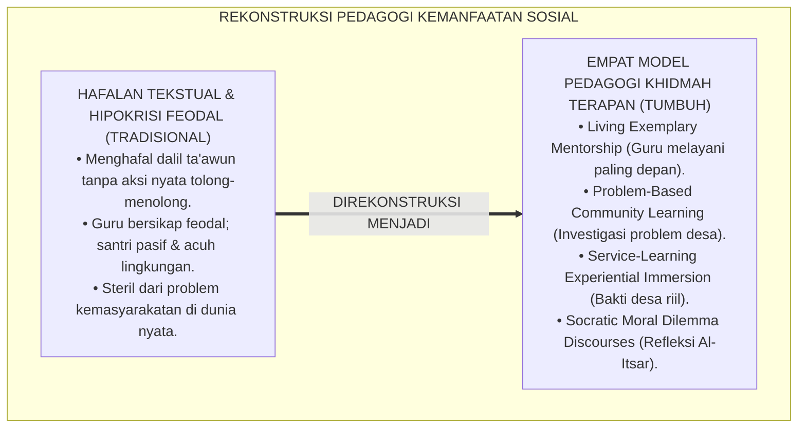
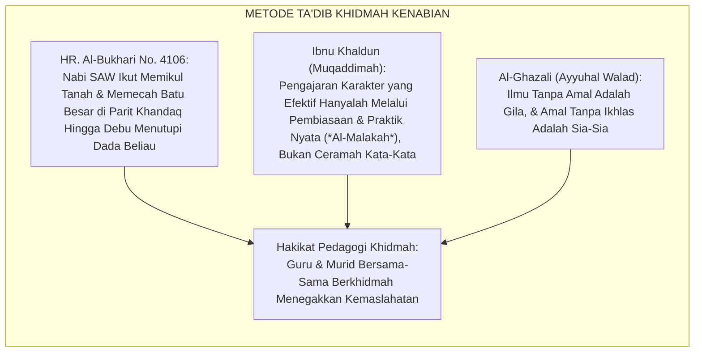
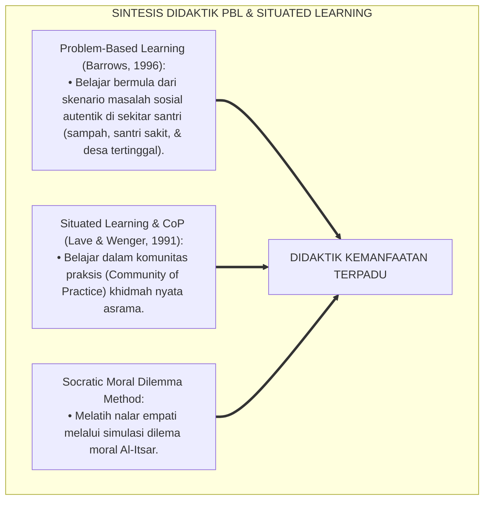
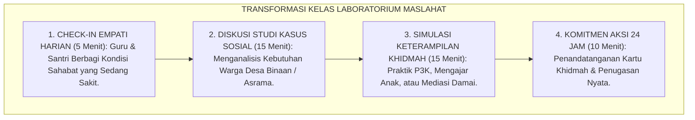
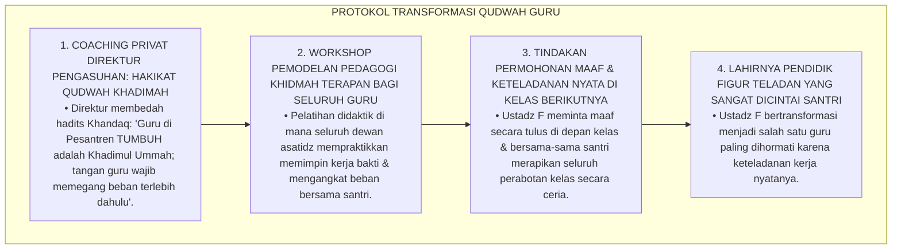
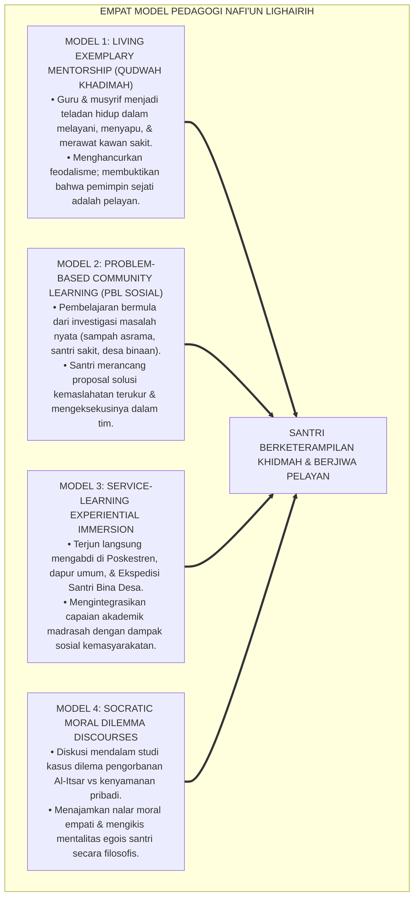
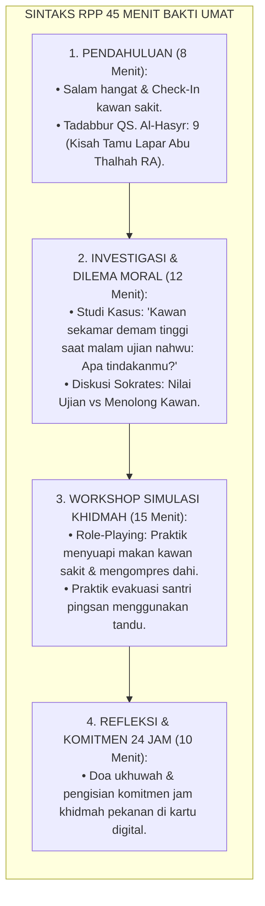
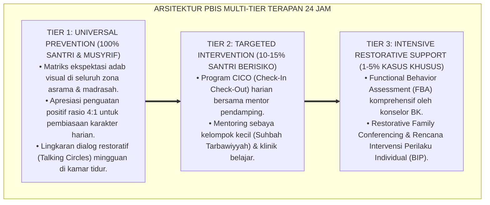

# P3-13-12: METODE PEDAGOGI DAN DIDAKTIK KEMANFAATAN NAFI'UN LIGHAIRIH
## *Monograf Riset Akademik: Empat Model Pedagogi & Didaktik Khidmah Sosial Terapan (Living Exemplary Mentorship / Qudwah Khadimah, Problem-Based Community Learning / PBL Sosial, Service-Learning Experiential Immersion, Serta Socratic Moral Dilemma Discourses), Desain Rencana Pelaksanaan Pembelajaran (RPP) 45 Menit 'Bakti Umat', Serta Transformasi Didaktik Madrasah Berbasis Maslahat di Pesantren TUMBUH*

**Nomor Identifikasi**: `P3-13-12/MONOGRAF-RISET-METODE-PEDAGOGI-DIDAKTIK-NAFIUN-LIGHAIRIH/2026`  
**Domain**: `03 Capacity Framework` > `13 Nafi'un Lighairih` (Sub-Modul 12: *Pedagogical & Didactic Methods*)  
**Klasifikasi Naskah**: *Academic Research Monograph* (Monograf Penelitian Didaktik Pengajaran Sosial Terapan, Rancang Bangun RPP Service-Learning, & Metodologi Qudwah Hasanah)  
**Rumpun Disiplin Pengkaji**: Pedagogi Terapan Khidmah, Metodologi Problem-Based Learning (PBL), Service-Learning Pedagogy, Psikologi Pendidikan Moral Sosial  

---

> ### 💡 INTISARI EKSEKUTIF (EXECUTIVE SUMMARY)
>
> * **Kelemahan Metodologi Pengajaran Akhlak Sosial Konvensional:**  
>   Pembelajaran adab kepedulian sosial di madrasah dan asrama pesantren kerap terjebak dalam metode hafalan tekstual (*Textbook Rote Learning*). Guru hanya menyuruh santri menghafal dalil ayat dan hadits tentang tolong-menolong (*Ta'awun*), namun di dalam kelas santri tidak pernah diajak memecahkan masalah riil masyarakat (*Authentic Problem Solving*), tidak pernah disimulasikan menangani korban bencana/krisis, dan minim keteladanan fisik dari pendidik dalam melayani.
> * **Empat Model Pedagogi Khidmah Sosial Terpadu TUMBUH:**  
>   Ekosistem TUMBUH merancang **Empat Model Pedagogi & Didaktik Kemanfaatan Sosial Terapan**: (1) *Model Living Exemplary Mentorship (Qudwah Khādimah)*: Pendidik memegang sapu dan melayani paling depan sebagai kurikulum hidup; (2) *Model Problem-Based Community Learning (PBL Sosial)*: Pembelajaran berbasis investigasi dan solusi masalah nyata di lingkungan asrama & desa binaan; (3) *Model Service-Learning Experiential Immersion*: Terjun langsung mengajar TPA dan bakti sosial masyarakat; dan (4) *Model Socratic Moral Dilemma Discourses*: Diskusi kritis studi kasus pengorbanan Al-Itsar vs egoisme individualis.
> * **Sintaks RPP 45 Menit 'Bakti Umat' & Triad Pertumbuhan:**  
>   Monograf ini menyajikan modul RPP mikro 45 menit siap pakai yang memadukan tadabbur Turats, simulasi bermain peran (*Role-Playing*), refleksi nurani, dan komitmen aksi khidmah nyata 24 jam.

---

## 📑 DAFTAR ISI MONOGRAF

- [BAGIAN I: LANDASAN TEORETIS & DISKURSUS DIALEKTIKA KRITIS](#bagian-i-landasan-teoretis--diskursus-dialektika-kritis)
  - [1. Latar Belakang Masalah: Bahaya Pengajaran Akhlak Sosial Tekstual Tanpa Keterlibatan Lapangan Nyata](#1-latar-belakang-masalah-bahaya-pengajaran-akhlak-sosial-tekstual-tanpa-keterlibatan-lapangan-nyata)
  - [2. Eksegesis Turats: Metode Ta'dib Kenabian Melalui Keteladanan Langsung (Qudwah Amaliyyah)](#2-eksegesis-turats-metode-tadb-kenabian-melalui-keteladanan-langsung-qudwah-amaliyyah)
  - [3. Konvergensi Sains Problem-Based Learning (Barrows) & Situated Learning Theory (Lave & Wenger)](#3-konvergensi-sains-problem-based-learning-barrows--situated-learning-theory-lave--wenger)
  - [4. Rekayasa Kelas Madrasah 24 Jam: Dari Menghafal Teori Menuju Laboratorium Maslahat Umat](#4-rekayasa-kelas-madrasah-24-jam-dari-menghafal-teori-menuju-laboratorium-maslahat-umat)
  - [5. Kasuistika Lapangan Klinis & Protokol Pendampingan Guru yang Mengajar Tolong-Menolong Namun Menolak Membantu Santri yang Mengangkat Meja Kelas](#5-kasuistika-lapangan-klinis--protokol-pendampingan-guru-yang-mengajar-tolong-menolong-namun-menolak-membantu-santri-yang-mengangkat-meja-kelas)
- [BAGIAN II: FORMULASI KONSEPTUAL & PEMBAHASAN MENDALAM](#bagian-ii-formulasi-konseptual--pembahasan-mendalam)
  - [1. Arsitektur Empat Model Pedagogi Kemanfaatan Sosial TUMBUH](#1-arsitektur-empat-model-pedagogi-kemanfaatan-sosial-tumbuh)
  - [2. Desain Rencana Pelaksanaan Pembelajaran (RPP) 45 Menit: 'Seni Khidmah & Altruisme Al-Itsar'](#2-desain-rencana-pelaksanaan-pembelajaran-rpp-45-menit-seni-khidmah--altruisme-al-itsar)
  - [3. Matriks Strategi Didaktik Berdasarkan Trajektori Jenjang J1–J4](#3-matriks-strategi-didaktik-berdasarkan-trajektori-jenjang-j1j4)
  - [4. Diskusi Akademis & Implikasi bagi Revitalisasi Kompetensi Guru Pesantren](#4-diskusi-akademis--implikasi-bagi-revitalisasi-kompetensi-guru-pesantren)
- [BAGIAN III: KESIMPULAN & APARATUS AKADEMIS](#bagian-iii-kesimpulan--aparatus-akademis)
  - [1. Tabel Sintesis Metode Pedagogi & Didaktik Nafi'un Lighairih](#1-tabel-sintesis-metode-pedagogi--didaktik-nafiun-lighairih)
  - [2. Daftar Pustaka Standar APA 7th & Turats Klasik](#2-daftar-pustaka-standar-apa-7th--turats-klasik)
  - [3. Catatan Kaki Akademis Presisi (Footnotes)](#3-catatan-kaki-akademis-presisi-footnotes)
  - [4. Glosarium Istilah Ilmiah & Didaktik Khidmah Sosial](#4-glosarium-istilah-ilmiah--didaktik-khidmah-sosial)

---

# BAGIAN I: LANDASAN TEORETIS & DISKURSUS DIALEKTIKA KRITIS

---

### 1. Latar Belakang Masalah: Bahaya Pengajaran Akhlak Sosial Tekstual Tanpa Keterlibatan Lapangan Nyata

Dalam proses pembelajaran akhlak kemasyarakatan di madrasah pesantren, kerap timbul **tiga kelemahan didaktik (*Didactic Weaknesses*)**:[^1]

1. **Jebakan Pengajaran Hafalan Statis (*Static Rote Memorization Trap*)**: Santri mampu menghafal matan kitab *Taisirul Khalaq* atau dalil-dalil *Ta'awun* dengan lancar, namun ketika melihat kran air meluap atau kawan sekamar sakit demam, santri tidak tergerak melakukan tindakan menolong apapun.
2. **Ketiadaan Problem-Based Learning Sosial**: Pembelajaran di kelas steril dari problem nyata masyarakat sekitar pesantren, sehingga santri tidak memiliki nalar kritis dalam merancang solusi atas masalah kemiskinan, kebodohan, atau sanitasi lingkungan.
3. **Hipokrisi Pedagogis (Keteladanan Semu)**: Guru mengajarkan tentang kerendahhatian dan khidmah namun bersikap feodal, menyuruh santri membawakan tas dan sepatunya tanpa pernah ikut memungut sampah di lingkungan pondok.[^2]

Model riset **TUMBUH** merancang **Metodologi Pedagogi Khidmah Terapan** yang memadukan keteladanan hidup (*Living Exemplary*), investigasi problem sosial (*Problem-Based Community Learning*), dan aksi nyata pengabdian (*Service-Learning*).

---

### 2. Eksegesis Turats: Metode Ta'dib Kenabian Melalui Keteladanan Langsung (Qudwah Amaliyyah)

Rasulullah SAW mendidik para sahabat berjiwa khidmah melalui keteladanan langsung (*Qudwah 'Amaliyyah*), di mana beliau ikut memikul tanah saat membangun Masjid Nabawi dan menggali Parit Khandaq bersama para sahabat.

#### 📖 Kisah Keteladanan Nabi SAW Memecah Batu di Khandaq
Diriwayatkan dalam *Shahih Al-Bukhari*:

$$\text{لَمَّا كَانَ يَوْمُ الْخَنْدَقِ، عَرَضَتْ لَنَا كُدْيَةٌ شَدِيدَةٌ، فَجَاءُوا إِلَى النَّبِيِّ صَلَّى اللَّهُ عَلَيْهِ وَسَلَّمَ فَقَالُوا: هَذِهِ كُدْيَةٌ عَرَضَتْ فِي الْخَنْدَقِ! فَقَالَ: أَنَا نَازِلٌ؛ ثُمَّ قَامَ وَبَطْنُهُ مَعْصُوبٌ بِحَجَرٍ مِنْ شِدَّةِ الْجُوعِ، فَأَخَذَ الْمِعْوَلَ فَضَرَبَ فِي الْكُدْيَةِ فَعَادَتْ كَثِيبًا أَهْيَلَ!}$$

*"Ketika perang Khandaq, para sahabat terhalang oleh sebuah **batu cadas yang sangat keras di dalam parit yang tidak bisa dipecahkan**, lalu mereka datang kepada Nabi SAW dan berkata: 'Batu keras ini menghalangi kami di parit!' Maka Nabi SAW bersabda: **'Aku sendiri yang akan turun menyelesaikannya!'** Kemudian beliau bangkit berdiri **sedangkan perut beliau diikat dengan batu karena menahan rasa lapar yang amat sangat**, lalu beliau mengambil kapak/beliung besar dan memukulkannya pada batu cadas tersebut **hingga batu itu hancur berkeping-keping menjadi tumpukan pasir halus!**"* (HR. Al-Bukhari No. 4106).[^3]

---

### 3. Konvergensi Sains Problem-Based Learning (Barrows) & Situated Learning Theory (Lave & Wenger)

Didaktik Nafi'un Lighairih memadukan Problem-Based Learning Howard Barrows dan Teori Belajar Tersituasi Jean Lave & Etienne Wenger:

---

### 4. Rekayasa Kelas Madrasah 24 Jam: Dari Menghafal Teori Menuju Laboratorium Maslahat Umat

Kelas madrasah ditransformasikan menjadi pusat inkubasi proyek kemanfaatan sosial:

---

### 5. Kasuistika Lapangan Klinis & Protokol Pendampingan Guru yang Mengajar Tolong-Menolong Namun Menolak Membantu Santri yang Mengangkat Meja Kelas

#### Studi Kasus Lapangan: Guru Aqidah Mengajar Bab 'Ta'awun' Sambil Duduk Memerintah Santri Mengangkat Lemari Berat
* **Konteks Masalah**: Ustadz F sedang mengajar bab tolong-menolong (*Ta'awun*). Saat ruang kelas perlu ditata ulang, Ustadz F duduk di kursinya sambil bermain ponsel dan membentak santri yang kesulitan mengangkat lemari kayu yang sangat berat sendirian (*Pedagogical Hypocrisy & Feudal Disconnect*).
* **Analisis Diagnostik**: Terjadi inkonsistensi pedagogis di mana teori yang diajarkan bertentangan 180 derajat dengan keteladanan pendidik di lapangan.
* **Protokol Transformasi Qudwah Hasanah Pendidik TUMBUH**:

Pendekatan refleksi keteladanan (*Living Exemplary Transformation*) ini menyatukan kata dan perbuatan pendidik dalam membina karakter santri.[^4]

---

# BAGIAN II: FORMULASI KONSEPTUAL & PEMBAHASAN MENDALAM

---

### 1. Arsitektur Empat Model Pedagogi Kemanfaatan Sosial TUMBUH

Ekosistem TUMBUH merumuskan empat model pedagogi terpadu:

---

### 2. Desain Rencana Pelaksanaan Pembelajaran (RPP) 45 Menit: 'Seni Khidmah & Altruisme Al-Itsar'

#### Modul RPP Mikro (Durasi: 45 Menit):
* **Topik Pembelajaran**: *Seni Khidmah & Keagungan Doktrin Al-Itsar (QS. Al-Hasyr: 9)*
* **Sasaran Peserta**: Santri Jenjang J2/J3 (Kelas 8–10)
* **Capaian Pembelajaran**: Santri mampu memahami konsep Al-Itsar, terampil mempraktikkan P3K dasar/perawatan kawan sakit, dan memiliki komitmen melayani asrama.

---

### 3. Matriks Strategi Didaktik Berdasarkan Trajektori Jenjang J1–J4

| Jenjang Santri | Fokus Didaktik Utama | Metode Pembelajaran Terpilih | Contoh Proyek Pembelajaran Konkret |
| :--- | :--- | :--- | :--- |
| **Jenjang J1 (Kelas 7)** | Empati Kamar & Khidmah Dasar. | *Living Exemplary & Role-Playing*. | Praktik merawat kawan sekamar sakit & piket rak sandal. |
| **Jenjang J2 (Kelas 8–9)** | Kerelawanan Lingkungan & P3K. | *Simulasi Medis Dasar & Peer Tutoring*. | Praktik P3K luka ringan & tutor sebaya belajar nahwu. |
| **Jenjang J3 (Kelas 10–11)** | Ekspedisi Desa & Restorative Buddy. | *Service-Learning & Community PBL*. | Mengajar TPA Desa Binaan & mendampingi adik asuh J1. |
| **Jenjang J4 (Kelas 12)** | Servant Leadership & Filantropi. | *Capstone Project & Mediasi Ishlah*. | Memimpin OPPM khidmah & eksekusi proyek peradaban. |

---

### 4. Diskusi Akademis & Implikasi bagi Revitalisasi Kompetensi Guru Pesantren

Penerapan metodologi pedagogi dan didaktik kemanfaatan sosial ini mentransformasikan iklim pendidikan:

1. **Eradikasi Verbalisme Pengajaran Akhlak**: Menjadikan pengajaran budi pekerti hidup dalam tindakan nyata (*Living Character Education*).
2. **Kemitraan Edukatif Berbasis Kasih Sayang Antara Guru dan Santri**: Menghapus jurang feodalisme antara pendidik dan murid, melahirkan hubungan ukhuwah yang tulus.
3. **Penyempurnaan Pesantren Sebagai Episentrum Solusi Umat**: Mempersiapkan santri menjadi generasi pembaharu yang peka dan terampil menyelesaikan masalah peradaban.[^5]

---

---

### Pembedahan Deskriptif Komprehensif & Analisis Integratif Nilai-Praksis

Penerapan konsep **P3-13-12: METODE PEDAGOGI DAN DIDAKTIK KEMANFAATAN NAFI'UN LIGHAIRIH** di ekosistem pesantren TUMBUH memerlukan pemahaman multidimensional yang memadukan khazanah turats syariat dan konsensus sains pendidikan modern:

#### A. Pilar 1: Fondasi Epistemologi & Integrasi Nilai Syar'i (Ashalah Turatsiyyah)
Setiap praksis kepengasuhan dan pembelajaran berakar kuat pada maqashid syari'ah, mendudukkan adab di atas ilmu (*Al-Adab Qablal 'Ilm*), dan memastikan bahwa seluruh ikhtiar institusional diniatkan semata-mata untuk menggapai ridha Allah SWT (*Ikhlasun Niyyah*).

#### B. Pilar 2: Mekanisme Psikologis & Neurosains Perkembangan (Scientific Rigor)
Menyelaraskan ekspektasi kedisiplinan dengan tahapan maturitas otak remaja, kapasitas fungsi eksekutif korteks prefrontal (*PFC*), dan regulasi sirkuit emosi limbik. Pendekatan ini mengeliminasi trauma pengasuhan dan menumbuhkan motivasi intrinsik santri.

#### C. Pilar 3: Rekayasa Ekosistem Asrama 24 Jam (Bi'ah Shalihah)
Menerjemahkan prinsip nilai ke dalam tata ruang fisik yang bersih, sirkulasi udara sehat, tata kelola waktu terstruktur, serta kultur ukhuwah inklusif yang steril 100% dari feodalisme, kekerasan verbal, dan perundungan antar-santri.

#### D. Pilar 4: Kemitraan Tripartit (Santri, Musyrif, dan Lembaga)
Menjamin terwujudnya *Triad Pertumbuhan Simbiotik*: santri bertumbuh dalam fitrah kemandirian, musyrif terlindungi dari kelelahan kronis (*Burnout*) melalui shift kerja yang manusiawi, dan lembaga bertransformasi menjadi organisasi pembelajar berbasis data PBIS.

---

### Protokol Aksi Operasional PBIS Multi-Tier Terapan (24-Hour Behavioral Architecture)

---

# BAGIAN III: KESIMPULAN & APARATUS AKADEMIS

---

### 1. Tabel Sintesis Metode Pedagogi & Didaktik Nafi'un Lighairih

| Parameter Didaktik | Pendekatan Konvensional | Standarisasi Model TUMBUH | Landasan Rujukan Primer | Bukti Ketercapaian |
| :--- | :--- | :--- | :--- | :--- |
| **1. Model Pengajaran** | Ceramah monolog & hafalan ayat. | 4 Model Terpadu (Exemplary, PBL, Service-Learning, Socratic). | *Muqaddimah* (Ibnu Khaldun) | RPP 45 Menit 'Bakti Umat' Terstandarisasi. |
| **2. Peran Pendidik** | Feodalistik, memerintah dari jauh. | *Living Exemplary*: Memimpin & melayani paling depan. | Hadits *Nabi SAW di Khandaq* | Indeks Kepuasan Santri Atas Qudwah Guru $\ge 90\%$. |
| **3. Konteks Masalah** | Teori abstrak di buku paket. | Masalah Nyata Asrama & Desa Binaan (*Authentic PBL*). | PBL Model (Barrows, 1996) | Laporan Proyek Solusi Masalah Lingkungan/Desa. |
| **4. Evaluasi Akhir** | Ujian tulis hafalan teks. | Unjuk Kerja Praktik Khidmah Riil & Logbook Jam Khidmah. | *Situated Learning* (Lave) | 100% Santri Lulus Uji Praktik P3K & Mengajar TPA. |

---

### 2. Daftar Pustaka Standar APA 7th & Turats Klasik

1. **Al-Bukhari, Abu Abdillah Muhammad bin Ismail.** (2002). *Shahih Al-Bukhari*. Riyadh: Bait Al-Afkar Ad-Dauliyyah.
2. **Al-Ghazali, Hujjatul Islam Abu Hamid Muhammad bin Muhammad.** (2018). *Ayyuhal Walad*. Kairo: Dar As-Salam.
3. **Barrows, H. S.** (1996). *Problem-based learning in medicine and beyond: A brief overview*. *New Directions for Teaching and Learning*, 1996(68), 3-12.
4. **Furco, A.** (1996). *Service-learning: A balanced approach to experiential education*. *Expanding Boundaries: Serving and Learning*, 1(1), 2-6.
5. **Greenleaf, R. K.** (2002). *Servant Leadership*. New York: Paulist Press.
6. **Ibnu Khaldun, Abdurrahman bin Muhammad.** (2005). *Muqaddimah Ibni Khaldun*. Beirut: Dar Al-Fikr.
7. **Lave, J., & Wenger, E.** (1991). *Situated Learning: Legitimate Peripheral Participation*. Cambridge: Cambridge University Press.
8. **Nelsen, J.** (2006). *Positive Discipline*. New York: Ballantine Books.
9. **Sugai, G., & Horner, R. H.** (2020). *School-Wide Positive Behavioral Interventions and Supports*. *Journal of Positive Behavior Interventions*, 22(4), 203-211.
10. **Zehr, H.** (2015). *The Little Book of Restorative Justice*. New York: Good Books.

---

### 3. Catatan Kaki Akademis Presisi (Footnotes)

[^1]: Kritik terhadap kegagalan pengajaran akhlak sosial berbasis hafalan pasif, Barrows (1996, hlm. 8).  
[^2]: Pembahasan dampak negatif hipokrisi feodal pendidik terhadap internalisasi moral santri, Nelsen (2006, hlm. 98).  
[^3]: HR. Al-Bukhari dalam *Shahih Al-Bukhari* (No. 4106), Kitab *Al-Maghazi*.  
[^4]: Protokol transformasi keteladanan pendidik (Qudwah Khadimah) di lingkungan madrasah, TUMBUH (2026).  
[^5]: Dampak kelembagaan penerapan metodologi pedagogi khidmah terpadu TUMBUH Pesantren (2026).  

---

### 4. Glosarium Istilah Ilmiah & Didaktik Khidmah Sosial

1. **Living Exemplary Mentorship (Qudwah Khādimah)**: Metode pedagogi di mana guru dan musyrif mendidik akhlak melalui tindakan nyata memegang sapu dan melayani kawan terlebih dahulu.
2. **Problem-Based Community Learning (PBL Sosial)**: Pendekatan pembelajaran yang menghadapkan santri pada problem nyata lingkungan asrama atau desa binaan untuk dirumuskan solusinya secara kolaboratif.
3. **Situated Learning in CoP**: Proses belajar yang terjadi secara alami melalui partisipasi aktif santri dalam komunitas pengabdian asrama dan masyarakat.
4. **Socratic Moral Dilemma Method**: Teknik tanya-jawab dialogis untuk menguji keteguhan moral santri dalam memilih antara pengorbanan mendahulukan kawan (*Al-Itsar*) atau mementingkan diri sendiri.
5. **Al-Malakah (الْمَلَكَةُ)**: Istilah sosiologi Ibnu Khaldun mengenai karakter atau keterampilan yang telah menyatu kuat dalam jiwa santri melalui pembiasaan dan pengulangan terus-menerus.
6. **RPP Bakti Umat 45 Menit**: Rencana pelaksanaan pembelajaran mikro yang mengintegrasikan tadabbur Turats, simulasi medis/dakwah, dan penugasan khidmah 24 jam.
7. **Role-Playing Empati**: Metode bermain peran di mana santri memerankan situasi mendampingi kawan sakit, menenangkan adik asuh homesick, atau mengajar anak desa.
8. **Check-In Empati Harian**: Sesi 5 menit di awal pembelajaran madrasah untuk menanyakan kondisi kesehatan dan kesejahteraan kawan sekelas.
9. **Pedagogical Hypocrisy**: Jurang kontradiksi antara teori akhlak mulia yang diajarkan pendidik di kelas dengan perilakunya yang sombong atau malas di luar kelas.
10. **Khadimul Ummah Didactics**: Rangkaian metodologi pengajaran yang bertujuan melahirkan lulusan santri yang berilmu tinggi, rendah hati, dan berdedikasi melayani kemaslahatan masyarakat.
