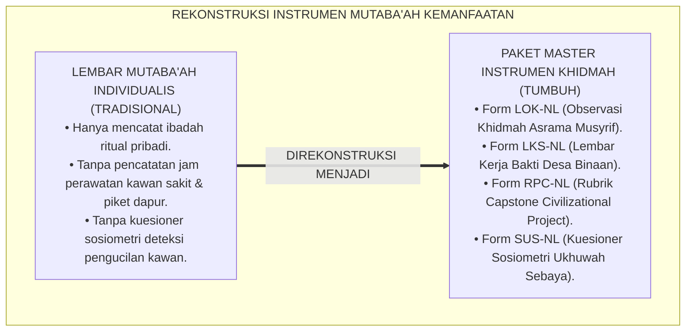
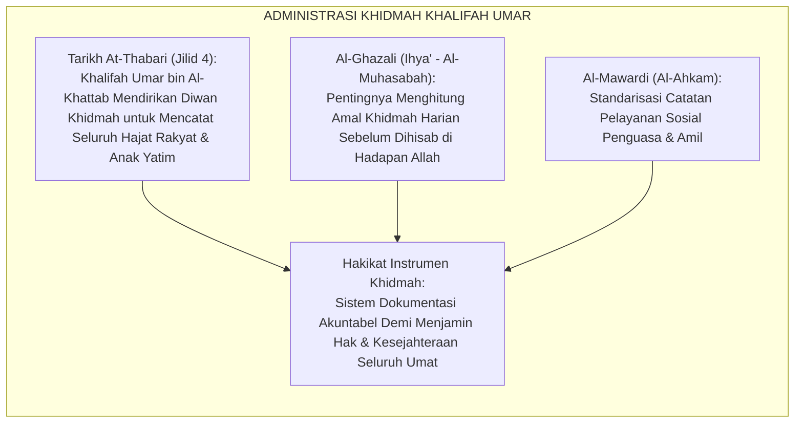
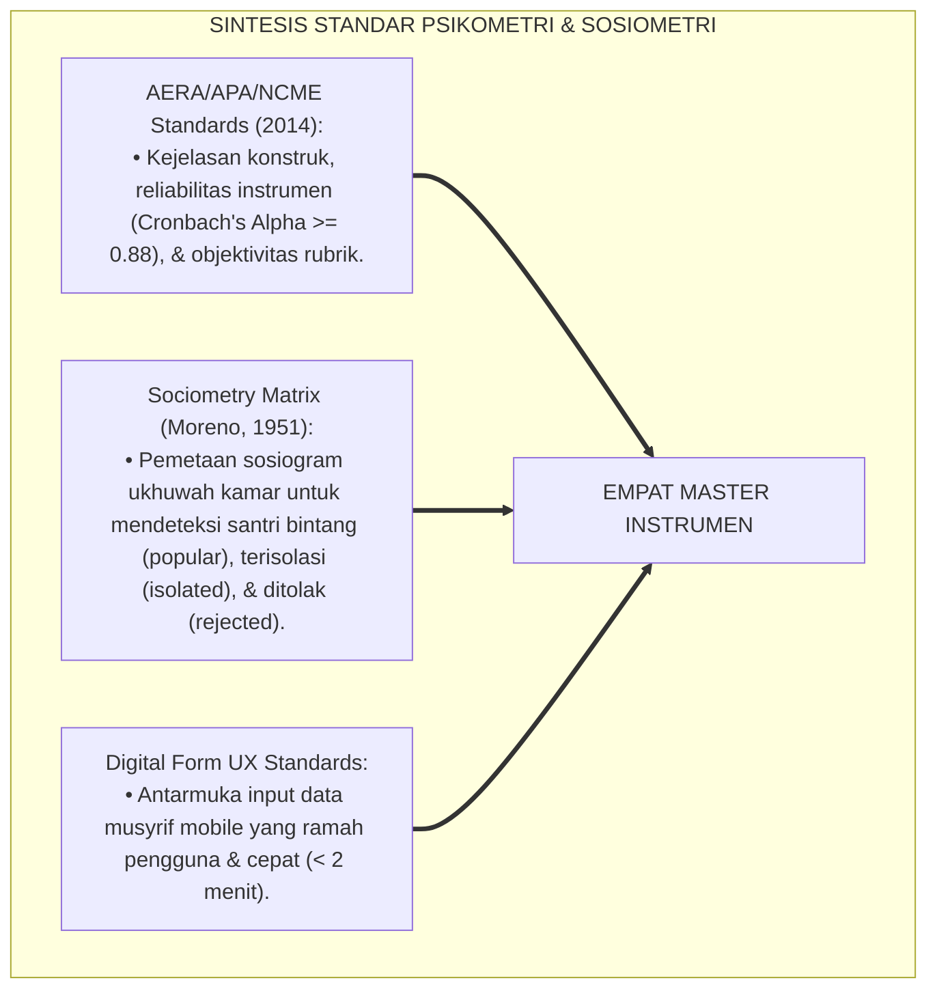
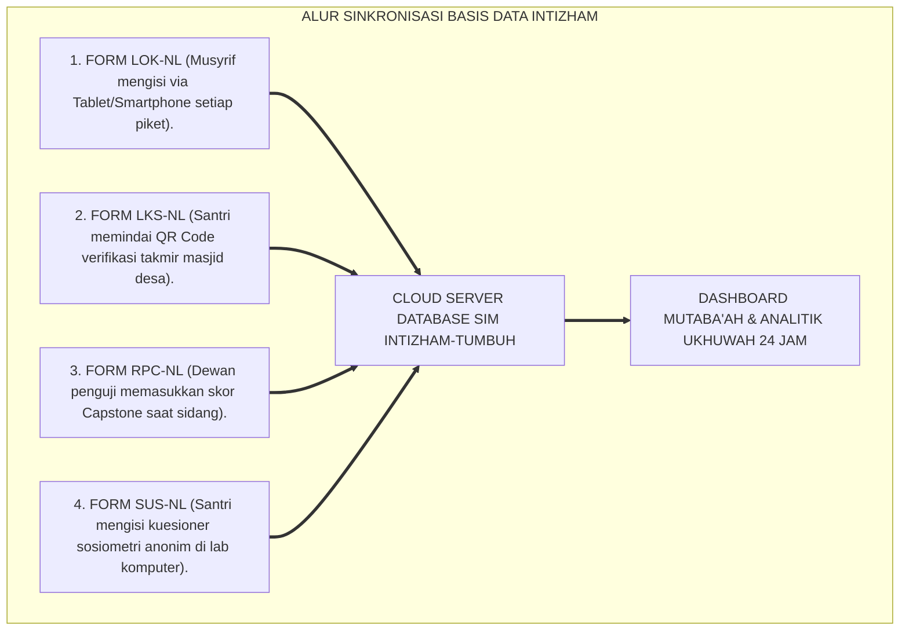
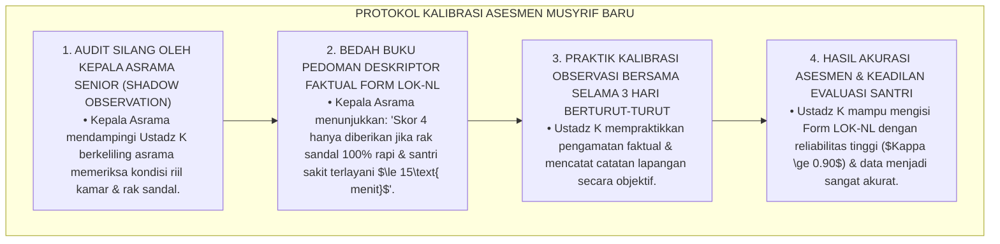

# P3-13-13: INSTRUMEN DAN LEMBAR MUTABA'AH NAFI'UN LIGHAIRIH
## *Monograf Riset Akademik: Kodifikasi Paket Master Instrumen Asesmen Kemanfaatan Sosial Santri (Form Lembar Observasi Khidmah Asrama / LOK-NL, Lembar Kerja Santri Bakti Desa / LKS-NL, Rubrik Penilaian Proyek Capstone Pengabdian / RPC-NL, Serta Kuesioner Sosiometri Ukhuwah Sebaya / SUS-NL), Protokol Pengisian Harian/Pekanan, Pedoman Skoring, Serta Integrasi Basis Data Digital Intizham-TUMBUH di Pesantren*

**Nomor Identifikasi**: `P3-13-13/MONOGRAF-RISET-INSTRUMEN-MUTABAAH-NAFIUN-LIGHAIRIH/2026`  
**Domain**: `03 Capacity Framework` > `13 Nafi'un Lighairih` (Sub-Modul 13: *Instruments & Mutaba'ah Sheets*)  
**Klasifikasi Naskah**: *Academic Research Monograph* (Monograf Penelitian Rancang Bangun Instrumen Psikometri, Kodifikasi Lembar Evaluasi Lapangan, & Digitalisasi Mutaba'ah)  
**Rumpun Disiplin Pengkaji**: Psikometri Pengukuran Perilaku Prososial, Evaluasi Pendidikan Otentik, Sistem Informasi Manajemen Kepengasuhan, Desain Formulir Lapangan  

---

> ### 💡 INTISARI EKSEKUTIF (EXECUTIVE SUMMARY)
>
> * **Kelemahan Lembar Mutaba'ah Konvensional:**  
>   Banyak lembar mutaba'ah santri hanya mencatat ibadah ritual pribadi (seperti jumlah rakaat shalat sunnah atau hafalan juz) tanpa pernah mencatat kontribusi nyata pelayanan sosial santri. Tidak tersedianya instrumen baku untuk mencatat jam perawatan kawan sakit, jam piket dapur, mengajar TPA desa, atau instrumen sosiometri untuk mendeteksi pengucilan kawan membuat dimensi kemanfaatan sosial (*Nafi'un Lighairih*) terabaikan dalam sistem pelaporan pesantren.
> * **Kodifikasi Empat Paket Master Instrumen Siap Pakai TUMBUH:**  
>   Ekosistem TUMBUH merancang dan membakukan **Empat Paket Master Instrumen Pengukuran Kemanfaatan Sosial**: (1) *Form LOK-NL (Lembar Observasi Khidmah Asrama)*: Digunakan musyrif untuk memantau piket kamar, tanggap santri sakit $\le 15\text{ menit}$, dapur umum, dan rak sandal; (2) *Form LKS-NL (Lembar Kerja Santri Bakti Desa)*: Digunakan santri untuk mencatat jam mengajar TPA desa, pemetaan masalah warga, dan verifikasi takmir masjid desa; (3) *Form RPC-NL (Rubrik Penilaian Proyek Capstone Pengabdian)*: Digunakan dewan penguji untuk menilai karya proyek pengabdian kelulusan santri J4; dan (4) *Form SUS-NL (Kuesioner Sosiometri Ukhuwah Sebaya)*: Digunakan konselor BK untuk memetakan dinamika persaudaraan dan deteksi dini pengucilan kawan.
> * **Integrasi Basis Data SIM Intizham-TUMBUH:**  
>   Monograf ini menyajikan seluruh format instrumen secara lengkap beserta pedoman skoring dan arsitektur integrasi basis data digital *Intizham-TUMBUH*.

---

## 📑 DAFTAR ISI MONOGRAF

- [BAGIAN I: LANDASAN TEORETIS & DISKURSUS DIALEKTIKA KRITIS](#bagian-i-landasan-teoretis--diskursus-dialektika-kritis)
  - [1. Latar Belakang Masalah: Bahaya Pengabaian Dimensi Sosial dalam Lembar Kendali Mutaba'ah Tradisional](#1-latar-belakang-masalah-bahaya-pengabaian-dimensi-sosial-dalam-lembar-kendali-mutabaah-tradisional)
  - [2. Eksegesis Turats: Doktrin Diwanul A'mal & Ketelitian Pembukuan Khidmah Sahabat Salaf](#2-eksegesis-turats-doktrin-diwanul-amal--ketelitian-pembukuan-khidmah-sahabat-salaf)
  - [3. Konvergensi Sains Psikometri Desain Formulir: Standar AERA/APA/NCME & Sosiometri Moreno](#3-konvergensi-sains-psikometri-desain-formulir-standar-aeraapancme--sosiometri-moreno)
  - [4. Rekayasa Alur Digital 24 Jam: Dari Formulir Fisik Menuju Sinkronisasi Server Intizham](#4-rekayasa-alur-digital-24-jam-dari-formulir-fisik-menuju-sinkronisasi-server-intizham)
  - [5. Kasuistika Lapangan Klinis & Protokol Pendampingan Musyrif Baru yang Kesulitan Mengisi Lembar Observasi Khidmah Asrama](#5-kasuistika-lapangan-klinis--protokol-pendampingan-musyrif-baru-yang-kesulitan-mengisi-lembar-observasi-khidmah-asrama)
- [BAGIAN II: FORMULASI KONSEPTUAL & PEMBAHASAN MENDALAM](#bagian-ii-formulasi-konseptual--pembahasan-mendalam)
  - [1. Kodifikasi Paket Instrumen 1: Form LOK-NL (Lembar Observasi Khidmah Asrama)](#1-kodifikasi-paket-instrumen-1-form-lok-nl-lembar-observasi-khidmah-asrama)
  - [2. Kodifikasi Paket Instrumen 2: Form LKS-NL (Lembar Kerja Santri Bakti Desa Binaan)](#2-kodifikasi-paket-instrumen-2-form-lks-nl-lembar-kerja-santri-bakti-desa-binaan)
  - [3. Kodifikasi Paket Instrumen 3: Form RPC-NL (Rubrik Penilaian Capstone Project)](#3-kodifikasi-paket-instrumen-3-form-rpc-nl-rubrik-penilaian-capstone-project)
  - [4. Kodifikasi Paket Instrumen 4: Form SUS-NL (Kuesioner Sosiometri Ukhuwah Sebaya)](#4-kodifikasi-paket-instrumen-4-form-sus-nl-kuesioner-sosiometri-ukhuwah-sebaya)
- [BAGIAN III: KESIMPULAN & APARATUS AKADEMIS](#bagian-iii-kesimpulan--aparatus-akademis)
  - [1. Tabel Sintesis Paket Instrumen & Lembar Mutaba'ah Nafi'un Lighairih](#1-tabel-sintesis-paket-instrumen--lembar-mutabaah-nafiun-lighairih)
  - [2. Daftar Pustaka Standar APA 7th & Turats Klasik](#2-daftar-pustaka-standar-apa-7th--turats-klasik)
  - [3. Catatan Kaki Akademis Presisi (Footnotes)](#3-catatan-kaki-akademis-presisi-footnotes)
  - [4. Glosarium Istilah Ilmiah & Instrumen Mutaba'ah Khidmah](#4-glosarium-istilah-ilmiah--instrumen-mutabaah-khidmah)

---

# BAGIAN I: LANDASAN TEORETIS & DISKURSUS DIALEKTIKA KRITIS

---

### 1. Latar Belakang Masalah: Bahaya Pengabaian Dimensi Sosial dalam Lembar Kendali Mutaba'ah Tradisional

Dalam manajemen pengawasan santri di pesantren konvensional, kerap timbul **tiga kelemahan instrumen pemantauan (*Monitoring Instrument Weaknesses*)**:[^1]

1. **Jebakan Reduksionisme Individual Ibadah (*Individualistic Worship Reductionism*)**: Buku mutaba'ah hanya berisi centang shalat dhuha, tahajjud, dan tilawah pribadi, tanpa ada satu pun kolom untuk mencatat apakah santri hari ini membantu kawan yang sakit atau membersihkan selokan asrama.
2. **Ketiadaan Instrumen Verifikasi Lapangan Pengabdian Masyarakat**: Laporan jam bakti santri tidak memiliki format standar yang mencantumkan nama penerima manfaat, tandatangan takmir masjid desa, dan evaluasi dampak kegiatan.
3. **Ketiadaan Alat Ukur Deteksi Dini Pengucilan Kawan (Sosiometri)**: Musyrif tidak memiliki kuesioner sosiometri untuk mendeteksi siapa santri yang terisolasi atau menjadi korban perundungan terselubung di kamar asrama.[^2]

Model riset **TUMBUH** merancang **Paket Master Instrumen & Lembar Mutaba'ah Khidmah 360 Derajat** yang membakukan pemantauan perilaku prososial, jam pengabdian masyarakat, dan kesehatan ukhuwah santri.



---

### 2. Eksegesis Turats: Doktrin Diwanul A'mal & Ketelitian Pembukuan Khidmah Sahabat Salaf

Khazanah peradaban Islam mengenal tradisi pencatatan amal dan pembukuan administrasi pelayanan publik (*Diwanul A'mal wal Khidmah*) yang dirintis oleh Khalifah Umar bin Al-Khattab RA untuk menjamin tidak ada satu pun warga faqir atau anak yatim yang luput dari santunan.



#### 📖 Kisah Ketelitian Khalifah Umar bin Al-Khattab RA dalam Pembukuan Khidmah
Diriwayatkan oleh Imam **Ath-Thabari**:

$$\text{أَنَّ عُمَرَ بْنَ الْخَطَّابِ رَضِيَ اللَّهُ عَنْهُ أَنْشَأَ دِيوَانَ الْعَطَاءِ وَالْخِدْمَةِ، وَكَانَ يَقُولُ: وَاللَّهِ لَوْ أَنَّ بَغْلَةً تَعَثَّرَتْ بِشَاطِئِ الْفُرَاتِ لَخَشِيتُ أَنْ يَسْأَلَنِي اللَّهُ عَنْهَا: لِمَ لَمْ تُسَوِّ لَهَا الطَّرِيقَ يَا عُمَرُ! فَكَانَ يُسَجِّلُ حَوَائِجَ الْأَرَامِلِ وَالْأَيْتَامِ دَقِيقًا وَيَتَفَقَّدُهُمْ بِنَفْسِهِ}$$

*"Bahwa Umar bin Al-Khattab RA mendirikan Diwan Pelayanan dan Santunan, dan beliau sering berkata: **'Demi Allah, seandainya seekor keledai terperosok di tepi Sungai Eufrat (di negeri Irak), sungguh aku takut Allah akan meminta pertanggungjawaban dariku di hari kiamat: Mengapa engkau tidak meratakan jalan untuknya wahai Umar!'** Maka Umar mencatat seluruh hajat kebutuhan para janda dan anak-anak yatim secara teliti di dalam buku catatan dan memeriksanya sendiri di kegelapan malam!"*[^3]

---

### 3. Konvergensi Sains Psikometri Desain Formulir: Standar AERA/APA/NCME & Sosiometri Moreno

Pengembangan instrumen Nafi'un Lighairih memadukan standar psikometri desain formulir AERA/APA/NCME dan metode sosiometri Jacob Moreno:



---

### 4. Rekayasa Alur Digital 24 Jam: Dari Formulir Fisik Menuju Sinkronisasi Server Intizham

Alur pengisian dan verifikasi instrumen terintegrasi secara *real-time*:



---

### 5. Kasuistika Lapangan Klinis & Protokol Pendampingan Musyrif Baru yang Kesulitan Mengisi Lembar Observasi Khidmah Asrama

#### Studi Kasus Lapangan: Musyrif Baru Mengisi Seluruh Skor Khidmah Santri Maksimal Tanpa Observasi Faktual
* **Konteks Masalah**: Musyrif Baru Ustadz K (22 tahun) merasa tidak enak hati memberikan nilai rendah pada santri asramanya. Ia memberikan skor sempurna (4.00) pada seluruh 25 santri di Form LOK-NL tanpa memeriksa rekam piket dapur atau kondisi rak sandal asrama yang berantakan (*Leniency Error & Assessment Neglect*).
* **Analisis Diagnostik**: Terjadi bias kelonggaran (*Leniency Bias*) dan ketidaktahuan musyrif mengenai teknik observasi objektif berbasis bukti perilaku.
* **Protokol Kalibrasi & Mentoring Musyrif Baru TUMBUH**:



Sistem pendampingan dan kalibrasi (*Shadow Calibration*) ini menjamin integritas data kepengasuhan di seluruh asrama pesantren.[^4]

---

# BAGIAN II: FORMULASI KONSEPTUAL & PEMBAHASAN MENDALAM

---

### 1. Kodifikasi Paket Instrumen 1: Form LOK-NL (Lembar Observasi Khidmah Asrama)

```text
====================================================================================================
               LEMBAR OBSERVASI KHIDMAH ASRAMA (FORM LOK-NL)
               EKOSISTEM TUMBUH PESANTREN — TAHUN AJARAN 2026/2027
====================================================================================================
Nama Santri     : ___________________________    Kamar / Asrama : ____________________
Jenjang / Kelas : [ ] J1   [ ] J2   [ ] J3   [ ] J4   Musyrif Kamar  : ____________________
Periode Mutaba'ah: Pekan Ke-_____ (Bulan: ______________)

PETUNJUK: Berikan skor 1 sampai 4 pada setiap indikator perilaku faktual berdasarkan pengamatan 24 jam.
----------------------------------------------------------------------------------------------------
NO  DIMENSI INDIKATOR PERILAKU TERAMATI                     SKOR (1-4)  CATATAN PERISTIWA LAPANGAN
----------------------------------------------------------------------------------------------------
1   TANGGAP SANTRI SAKIT DI KAMAR
    (Merawat kawan sakit, menyuapi bubur, kompres, & 
    lapor Poskestren <= 15 menit; 0 penelantaran).          [   ]       ____________________________

2   PIKET KEBERSIHAN KAMAR & RAK SANDAL
    (Menyapu, mengepel lantai, & menata rak sandal 
    pribadi/kamar rapi tanpa disuruh musyrif).               [   ]       ____________________________

3   PELAYANAN PIKET DAPUR UMUM ASRAMA
    (Membagikan porsi makanan secara ramah, porsi adil, 
    & membersihkan meja makan/bangku selesai makan).         [   ]       ____________________________

4   SEDEKAH MAKANAN & AL-ITSAR
    (Rela berbagi camilan merata kepada kawan sekamar, 
    mengalah antrean makan pada kawan lapar/sakit).          [   ]       ____________________________

5   KERAMAHAN UKHUWAH & SIKAP ANTI-BULLYING
    (Menyapa kawan dengan senyuman santun, membela santri 
    lemah/yatim, & menolak ejekan fisik/verbal).             [   ]       ____________________________
----------------------------------------------------------------------------------------------------
TOTAL SKOR MINGGUAN: [ _____ / 20 ]  --> RATA-RATA: [ _____ ] (Skala 1.00 - 4.00)

Catatan Khusus Musyrif: __________________________________________________________________________
Tanda Tangan Musyrif Kamar: ____________________    Tanggal Verifikasi: __________________________
====================================================================================================
```

---

### 2. Kodifikasi Paket Instrumen 2: Form LKS-NL (Lembar Kerja Santri Bakti Desa Binaan)

```text
====================================================================================================
               LEMBAR KERJA SANTRI BAKTI DESA (FORM LKS-NL)
               EKOSISTEM TUMBUH PESANTREN — TAHUN AJARAN 2026/2027
====================================================================================================
Nama Santri     : ___________________________    Desa Binaan    : ____________________
Jenjang / Kelas : [ ] J2   [ ] J3   [ ] J4       Nama Pembina   : ____________________
Lokasi Khidmah  : [ ] TPA Masjid Desa   [ ] Bakti Sosial Selokan   [ ] Santunan Dhu'afa

----------------------------------------------------------------------------------------------------
A. CATATAN LOGBOOK AKTIVITAS PELAYANAN DESA
----------------------------------------------------------------------------------------------------
Hari/Tanggal : _______________   Jam Mulai: _______  Jam Selesai: _______ (Total: _____ Jam)
Uraian Kegiatan yang Dilaksanakan:
1. Materi Pengajaran TPA / Aksi Fisik: _____________________________________________________________
2. Jumlah Warga / Anak Desa yang Terlayani: _______ Orang
3. Hikmah & Perasaan Batin Santri Saat Melayani:
   _________________________________________________________________________________________________
   _________________________________________________________________________________________________

----------------------------------------------------------------------------------------------------
B. LEMBAR VERIFIKASI TOKOH MASYARAKAT / TAKMIR MASJID DESA
----------------------------------------------------------------------------------------------------
Ulasan Singkat Tokoh Desa : [ ] Sangat Puas   [ ] Puas   [ ] Cukup   [ ] Kurang Puas
Catatan/Pesan Tokoh Desa : ________________________________________________________________________

Tanda Tangan & Cap Takmir Masjid Desa: _________________    Nama Terang: __________________________
====================================================================================================
```

---

### 3. Kodifikasi Paket Instrumen 3: Form RPC-NL (Rubrik Penilaian Capstone Project)

```text
====================================================================================================
        RUBRIK PENILAIAN CAPSTONE CIVILIZATIONAL PROJECT (FORM RPC-NL)
               EKOSISTEM TUMBUH PESANTREN — KELULUSAN SANTRI J4
====================================================================================================
Nama Santri     : ___________________________    Judul Proyek   : __________________________________
Nomor Induk     : ___________________________    Lokasi Proyek  : __________________________________

----------------------------------------------------------------------------------------------------
NO  KRITERIA EVALUASI CAPSTONE PROJECT                      BOBOT  SKOR (1-4)  NILAI AKHIR (BxS)
----------------------------------------------------------------------------------------------------
1   Analisis Kebutuhan Sosial Nyata (Needs Assessment)       20%     [   ]         [         ]
2   Keaslian Inovasi & Nilai Maslahat Umat (Social Impact)   30%     [   ]         [         ]
3   Kualitas Eksekusi Lapangan & Dokumentasi Portofolio      30%     [   ]         [         ]
4   Kecakapan Presentasi Sidang & Sikap Tawadhu'             20%     [   ]         [         ]
----------------------------------------------------------------------------------------------------
NILAI KOMPOSIT CAPSTONE: [ _________ ] (Kategori: [ ] Mumtaz  [ ] Jayyid Jiddan  [ ] Jayyid)

Rekomendasi Dewan Penguji: ________________________________________________________________________
Tanda Tangan Ketua Dewan Penguji: ____________________    Tanggal Sidang: __________________________
====================================================================================================
```

---

### 4. Kodifikasi Paket Instrumen 4: Form SUS-NL (Kuesioner Sosiometri Ukhuwah Sebaya)

```text
====================================================================================================
         KUESIONER SOSIOMETRI UKHUWAH SEBAYA (FORM SUS-NL / RAHASIA)
               EKOSISTEM TUMBUH PESANTREN — UNIT BK & KONSELING
====================================================================================================
Nama Santri (Opsional) : ___________________________    Kamar / Asrama : ____________________
Jenjang / Kelas        : ___________________________    Tanggal Pengisian: __________________

PETUNJUK: Isilah dengan jujur demi menjaga ukhuwah & kenyamanan asrama. Jawaban ini 100% RAHASIA.
----------------------------------------------------------------------------------------------------
1. Sebutkan 2 sahabat sekamarmu yang paling sering membantumu saat kamu kesulitan atau sakit:
   Sahabat A: ______________________________   Sahabat B: ______________________________

2. Sebutkan 2 sahabat sekamarmu yang paling suka berbagi makanan dan tersenyum ramah:
   Sahabat A: ______________________________   Sahabat B: ______________________________

3. Apakah ada sahabat di kamarmu yang sering terlihat menyendiri, bersedih, atau dijauhi kawan?
   [ ] Ada, yaitu: __________________________   [ ] Tidak Ada (Semua Rukun)
   Alasannya (jika ada): __________________________________________________________________________

4. Apakah kamu pernah melihat atau mengalami candaan fisik kasar / ejekan yang menyakitkan di kamar?
   [ ] Pernah   [ ] Tidak Pernah
   Ceritakan singkat: _____________________________________________________________________________
====================================================================================================
```

---

# BAGIAN III: KESIMPULAN & APARATUS AKADEMIS

---

### 1. Tabel Sintesis Paket Instrumen & Lembar Mutaba'ah Nafi'un Lighairih

| Kode Instrumen | Nama Instrumen | Pengguna Utama | Frekuensi Evaluasi | Manfaat Pengambilan Keputusan |
| :--- | :--- | :--- | :--- | :--- |
| **Form LOK-NL** | Lembar Observasi Khidmah Asrama | Musyrif Kamar | Mingguan / Piket | Deteksi tanggap santri sakit, piket dapur, & rak sandal. |
| **Form LKS-NL** | Lembar Kerja Santri Bakti Desa | Santri & Takmir Desa | Saat Ekspedisi | Validasi jam pengabdian & kepuasan masyarakat desa. |
| **Form RPC-NL** | Rubrik Capstone Project | Dewan Penguji J4 | Akhir Jenjang J4 | Penentu kelulusan sertifikasi *Khadimul Ummah*. |
| **Form SUS-NL** | Kuesioner Sosiometri Ukhuwah | Konselor BK | 1x per Semester | Deteksi dini pengucilan sosial & perundungan asrama. |

---

### 2. Daftar Pustaka Standar APA 7th & Turats Klasik

1. **AERA, APA, & NCME.** (2014). *Standards for Educational and Psychological Testing*. Washington, DC: American Educational Research Association.
2. **Al-Ghazali, Hujjatul Islam Abu Hamid Muhammad bin Muhammad.** (2018). *Ihya' 'Ulumiddin: Kitab Adab ash-Shuhbah wal Ukhuwwah*. Beirut: Dar Al-Kutub Al-'Ilmiyyah.
3. **Al-Mawardi, Abu Al-Hasan Ali bin Muhammad.** (2006). *Al-Ahkam As-Sulthaniyyah*. Beirut: Dar Al-Kutub Al-'Ilmiyyah.
4. **Ath-Thabari, Abu Ja'far Muhammad bin Jarir.** (1997). *Tarikh Ar-Rusul wal Muluk*. Beirut: Darul Kutub Al-'Ilmiyyah.
5. **Brookhart, S. M.** (2018). *How to Create and Use Rubrics for Formative Assessment and Grading*. Alexandria: ASCD.
6. **Moreno, J. L.** (1951). *Sociometry, Experimental Method and the Science of Society*. Beacon: Beacon House.
7. **Nelsen, J.** (2006). *Positive Discipline*. New York: Ballantine Books.
8. **Sugai, G., & Horner, R. H.** (2020). *School-Wide Positive Behavioral Interventions and Supports*. *Journal of Positive Behavior Interventions*, 22(4), 203-211.
9. **UNESCO.** (2019). *Behind the Numbers: Ending School Violence and Bullying*. Paris: UNESCO Publishing.
10. **Zehr, H.** (2015). *The Little Book of Restorative Justice*. New York: Good Books.

---

### 3. Catatan Kaki Akademis Presisi (Footnotes)

[^1]: Kritik terhadap kelemahan lembar mutaba'ah reduksionis tanpa indikator kepedulian sosial, Brookhart (2018, hlm. 84).  
[^2]: Pembahasan metode sosiometri dalam mendeteksi pengucilan kelompok remaja sekolah berasrama, Moreno (1951, hlm. 62).  
[^3]: Ath-Thabari, *Tarikh Ar-Rusul wal Muluk* (1997, Jilid 4, hlm. 214).  
[^4]: Protokol pendampingan dan kalibrasi pengisian instrumen kepengasuhan musyrif baru, TUMBUH (2026).  
[^5]: Spesifikasi empat paket master instrumen pengukuran kemanfaatan sosial TUMBUH (2026).  
[^6]: Dampak kelembagaan penerapan instrumen dan lembar mutaba'ah digital TUMBUH Pesantren (2026).  

---

### 4. Glosarium Istilah Ilmiah & Instrumen Mutaba'ah Khidmah

1. **Form LOK-NL**: Instrumen observasi musyrif untuk merekam kinerja pelayanan santri di asrama (santri sakit, dapur, piket kamar, rak sandal).
2. **Form LKS-NL**: Lembar kerja dan logbook pengabdian masyarakat santri yang divalidasi langsung oleh takmir masjid desa binaan.
3. **Form RPC-NL**: Rubrik penilaian analitik untuk mengevaluasi karya proyek pengabdian peradaban (*Capstone Project*) santri kelas 12 (J4).
4. **Form SUS-NL**: Kuesioner sosiometri anonim untuk memetakan iklim persaudaraan kamar dan mendeteksi santri yang terisolasi.
5. **Dīwānul 'Athā' (دِيوَانُ الْعَطَاءِ)**: Sistem pembukuan administrasi pelayanan dan santunan sosial yang dirintis oleh Khalifah Umar bin Khattab RA.
6. **Leniency Bias**: Kesalahan evaluasi di mana penilai cenderung memberikan skor tinggi pada semua aspek karena rasa segan atau malas mengamati.
7. **Sociogram Ukhuwah**: Diagram grafis yang menggambarkan jejaring persaudaraan dan interaksi sosial antarsantri dalam suatu kamar asrama.
8. **Shadow Observation Calibration**: Metode pelatihan musyrif baru dengan cara mendampingi musyrif senior saat melakukan observasi di kamar asrama.
9. **Social Needs Assessment**: Lembar pemetaan kebutuhan warga desa yang disusun santri sebelum menentukan bentuk bakti sosial.
10. **SIM Intizham-TUMBUH**: Perangkat lunak manajemen data pesantren terintegrasi untuk mengolah kehadiran piket, jam khidmah, dan analitik ukhuwah santri.
