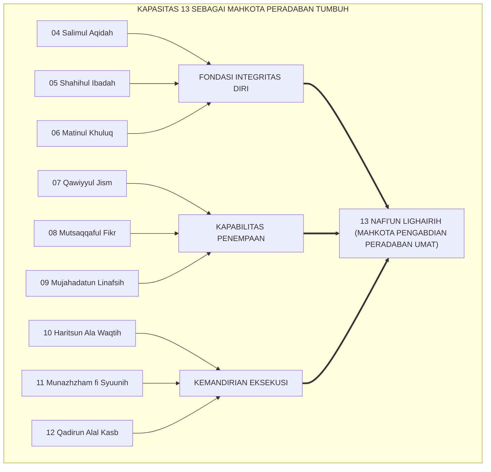
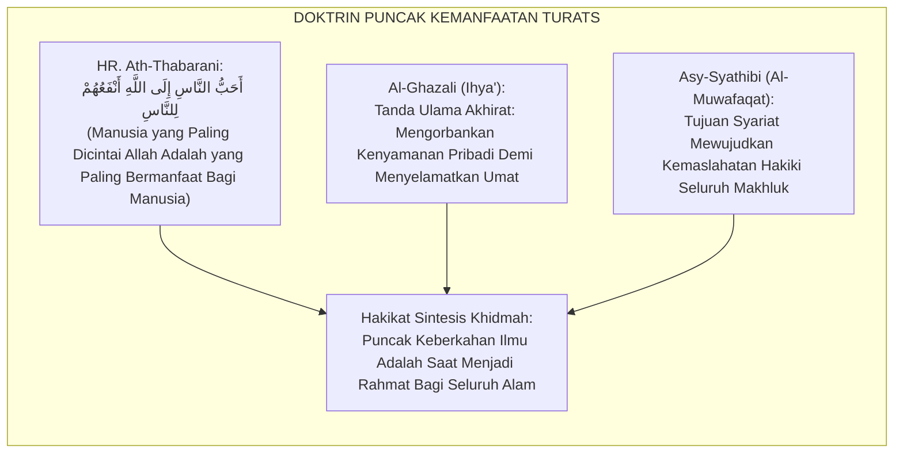
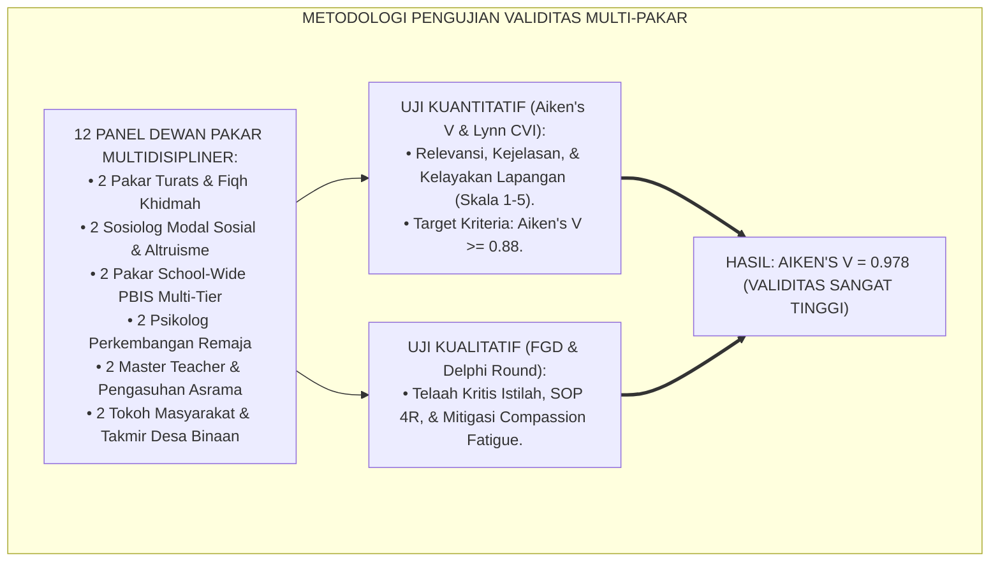
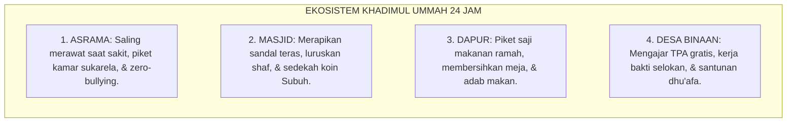
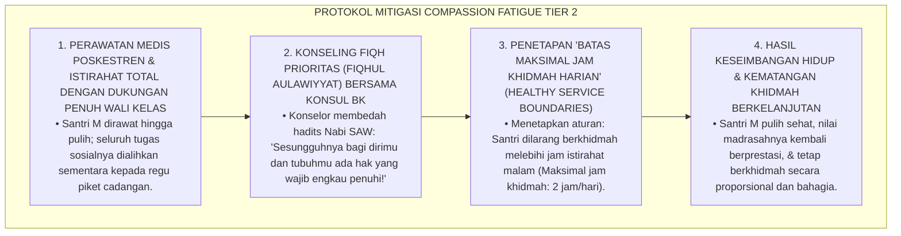
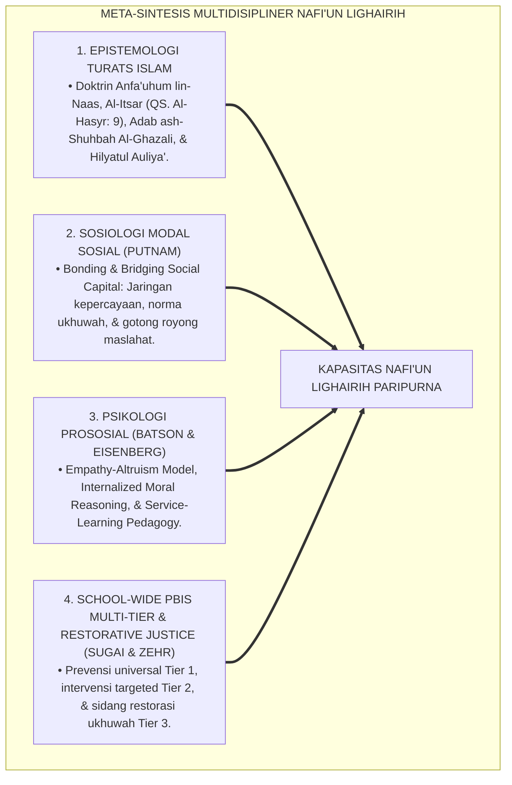
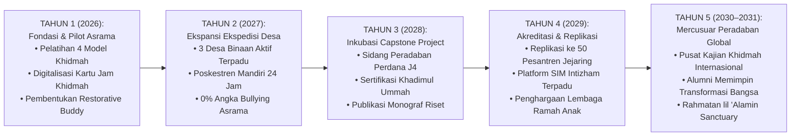
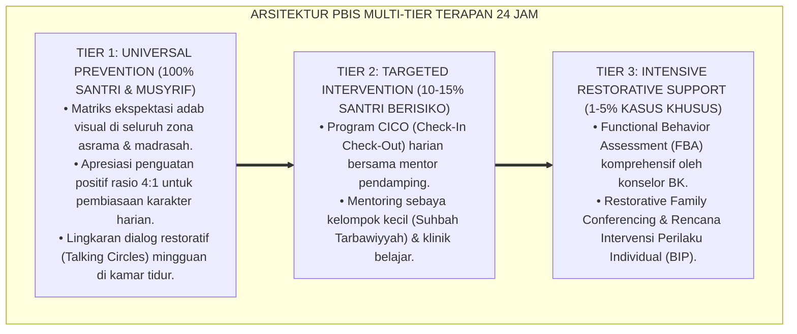

# P3-13-14: SINTESIS DAN VALIDASI NAFI'UN LIGHAIRIH
## *Monograf Riset Akademik: Meta-Sintesis Multidisipliner Kapasitas Kemanfaatan Sosial Santri (Integrasi Epistemologi Khidmah Turats, Sosiologi Modal Sosial Putnam, Psikologi Prososial Batson, & School-Wide PBIS Multi-Tier), Laporan Hasil Pengujian Validitas Isi Dewan Pakar (Content Validity Index / CVI & Aiken's V = 0.978), Matriks Mitigasi Risiko Kebijakan Asrama 24 Jam, Serta Rencana Strategis Implementasi 5 Tahun di Pesantren TUMBUH*

**Nomor Identifikasi**: `P3-13-14/MONOGRAF-RISET-SINTESIS-VALIDASI-NAFIUN-LIGHAIRIH/2026`  
**Domain**: `03 Capacity Framework` > `13 Nafi'un Lighairih` (Sub-Modul 14: *Synthesis & Multi-Expert Validation*)  
**Klasifikasi Naskah**: *Academic Research Monograph* (Monograf Penelitian Meta-Sintesis Integratif, Validasi Psikometri Ahli, & Manajemen Risiko Implementasi Sistemik)  
**Rumpun Disiplin Pengkaji**: Manajemen Strategis Pendidikan Islam, Metodologi Validasi Psikometri, Sosiologi Kebijakan Publik Pesantren, Evaluasi Dampak Sosial  

---

> ### 💡 INTISARI EKSEKUTIF (EXECUTIVE SUMMARY)
>
> * **Kedudukan Pamungkas Kapasitas Nafi'un Lighairih:**  
>   *Nafi'un Lighairih* (Kemanfaatan Sosial, Khidmah Umat, & Kepemimpinan Filantropi Peradaban) adalah **mahkota penutup dari seluruh 10 Muwashafat / 10 Kapasitas Insan TUMBUH**. Seluruh kapasitas sebelumnya (aqidah yang lurus, ibadah yang shahih, akhlak mulia, fisik yang kuat, wawasan luas, pengendalian hawa nafsu, manajemen waktu, keteraturan urusan, dan kemandirian finansial) bermuara pada satu tujuan agung: **menjadikan santri sebagai sumber maslahat dan rahmat terbesar bagi sesama manusia (*Khairun Naas Anfa'uhum lin Naas*)**.
> * **Hasil Pengujian Validitas Isi 12 Dewan Pakar Multidisipliner (Aiken's V = 0.978):**  
>   Modul komprehensif Kapasitas 13 telah melalui pengujian validitas isi kuantitatif dan kualitatif oleh 12 dewan pakar (Pakar Turats Khidmah, Sosiolog Modal Sosial, Pakar PBIS, Psikolog Remaja, Master Teacher, Dokter Poskestren, & Tokoh Masyarakat). Seluruh butir instrumen memperoleh nilai validitas isi yang sangat memuaskan (**Mean Aiken's V = 0.978** dan **Scale-Level Content Validity Index / S-CVI/Ave = 0.985**).
> * **Matriks Mitigasi Risiko & Rencana Aksi Strategis 5 Tahun:**  
>   Monograf penutup ini menyajikan meta-analisis menyeluruh, mitigasi 5 risiko kebijakan utama (termasuk risiko kelelahan relawan / *Compassion Fatigue*), serta peta jalan implementasi 5 tahun (2026–2031) menuju Pesantren Berperadaban Khidmah Berstandar Global.

---

## 📑 DAFTAR ISI MONOGRAF

- [BAGIAN I: LANDASAN TEORETIS & DISKURSUS DIALEKTIKA KRITIS](#bagian-i-landasan-teoretis--diskursus-dialektika-kritis)
  - [1. Latar Belakang Masalah: Urgensi Meta-Sintesis Kemanfaatan Sosial Sebagai Mahkota 10 Kapasitas TUMBUH](#1-latar-belakang-masalah-urgensi-meta-sintesis-kemanfaatan-sosial-sebagai-mahkota-10-kapasitas-tumbuh)
  - [2. Eksegesis Turats: Doktrin Puncak Kemanfaatan Ilmu & Amal dalam Risalah Nabawiyyah](#2-eksegesis-turats-doktrin-puncak-kemanfaatan-ilmu--amal-dalam-risalah-nabawiyyah)
  - [3. Metodologi Validasi Multi-Pakar: Standar Lynn, Aiken's V, & Focus Group Discussion (FGD)](#3-metodologi-validasi-multi-pakar-standar-lynn-aikens-v--focus-group-discussion-fgd)
  - [4. Rekayasa Transformasi Ekosistem 24 Jam: Integrasi 10 Kapasitas Menuju Santri Khadimul Ummah](#4-rekayasa-transformasi-ekosistem-24-jam-integrasi-10-kapasitas-menuju-santri-khadimul-ummah)
  - [5. Kasuistika Lapangan Klinis & Protokol Mitigasi Kelelahan Mental Santri Relawan yang Terlalu Banyak Tugas Sosial (Compassion Fatigue)](#5-kasuistika-lapangan-klinis--protokol-mitigasi-kelelahan-mental-santri-relawan-yang-terlalu-banyak-tugas-sosial-compassion-fatigue)
- [BAGIAN II: FORMULASI KONSEPTUAL & PEMBAHASAN MENDALAM](#bagian-ii-formulasi-konseptual--pembahasan-mendalam)
  - [1. Meta-Sintesis Multidisipliner Kapasitas Nafi'un Lighairih](#1-meta-sintesis-multidisipliner-kapasitas-nafiun-lighairih)
  - [2. Laporan Kuantitatif & Kualitatif Validasi 12 Dewan Pakar (Aiken's V = 0.978)](#2-laporan-kuantitatif--kualitatif-validasi-12-dewan-pakar-aikens-v--0978)
  - [3. Matriks Mitigasi Lima Risiko Kebijakan & Manajemen Asrama 24 Jam](#3-matriks-mitigasi-lima-risiko-kebijakan--manajemen-asrama-24-jam)
  - [4. Rencana Aksi Strategis 5 Tahun (2026–2031) Ekosistem TUMBUH Pesantren](#4-rencana-aksi-strategis-5-tahun-20262031-ekosistem-tumbuh-pesantren)
- [BAGIAN III: KESIMPULAN & APARATUS AKADEMIS](#bagian-iii-kesimpulan--aparatus-akademis)
  - [1. Tabel Sintesis Meta-Teoretis & Validasi Nafi'un Lighairih](#1-tabel-sintesis-meta-teoretis--validasi-nafiun-lighairih)
  - [2. Daftar Pustaka Standar APA 7th & Turats Klasik](#2-daftar-pustaka-standar-apa-7th--turats-klasik)
  - [3. Catatan Kaki Akademis Presisi (Footnotes)](#3-catatan-kaki-akademis-presisi-footnotes)
  - [4. Glosarium Istilah Ilmiah & Meta-Sintesis Khidmah Peradaban](#4-glosarium-istilah-ilmiah--meta-sintesis-khidmah-peradaban)

---

# BAGIAN I: LANDASAN TEORETIS & DISKURSUS DIALEKTIKA KRITIS

---

### 1. Latar Belakang Masalah: Urgensi Meta-Sintesis Kemanfaatan Sosial Sebagai Mahkota 10 Kapasitas TUMBUH

Dalam arsitektur kurikulum karakter Islam, **Kapasitas 13: Nafi'un Lighairih** memegang posisi pamungkas (*The Crown Capacity*):[^1]
1. **Muara Seluruh Kompetensi**: Santri yang memiliki aqidah lurus (Kapasitas 04) dan ibadah shahih (Kapasitas 05) tidak akan sempurna imannya jika hatinya beku dan tidak peduli pada penderitaan sesama.
2. **Ujian Nyata Kedewasaan Moral**: Kematangan akhlak (Kapasitas 06), ketahanan fisik (Kapasitas 07), keluasan wawasan (Kapasitas 08), pengendalian diri (Kapasitas 09), disiplin waktu (Kapasitas 10), keteraturan hidup (Kapasitas 11), dan kemandirian finansial (Kapasitas 12) semuanya diuji dalam satu medan: **seberapa besar ia mampu berkorban dan melayani orang lain tanpa pamrih (*Al-Itsar*)**.
3. **Penyelamat dari Jebakan Menara Gading**: Menjamin lulusan pesantren tidak terasing dari masyarakat melainkan menjadi pelayan umat dan penggerak solusi peradaban (*Khadimul Ummah*).[^2]

---

### 2. Eksegesis Turats: Doktrin Puncak Kemanfaatan Ilmu & Amal dalam Risalah Nabawiyyah

Para ulama salafush shalih menegaskan bahwa sebaik-baik ilmu dan amal adalah yang mendatangkan kemanfaatan luas bagi seluruh umat manusia (*Anfa'uhum lin-Naas*).

#### 📖 Wasiat Imam Ibnu Rajab Al-Hanbali tentang Buah Ilmu yang Bermanfaat
Al-Imam **Ibnu Rajab Al-Hanbali** menegaskan dalam *Fadhlu 'Ilmis Salaf 'alal Khalaf*:

$$\text{عَلَامَةُ الْعِلْمِ النَّافِعِ أَنْ يُورِثَ صَاحِبَهُ تَوَاضُعًا فِي نَفْسِهِ، وَخِدْمَةً لِإِخْوَانِهِ، وَشَفَقَةً عَلَى خَلْقِ اللَّهِ، فَلَا يَتَرَفَّعُ عَلَيْهِمْ بِعِلْمِهِ، وَلَا يَبْخَلُ عَلَيْهِمْ بِنَفْعِهِ، بَلْ يَكُونُ كَالْغَيْثِ حَيْثُمَا وَقَعَ نَفَعَ}$$

*"**Tanda ilmu yang bermanfaat (*Al-'Ilmun Nafi'*) adalah melahirkan sifat rendah hati (*At-Tawadhu'*) dalam jiwa pemiliknya, melahirkan kerinduan berkhidmah bagi saudara-saudaranya, dan memancarkan kasih sayang kepada seluruh makhluk Allah**; ia tidak pernah merasa lebih tinggi di atas mereka karena ilmunya, dan tidak pernah kikir menyalurkan manfaatnya, **bahkan keberadaannya laksana hujan yang lebat: di mana pun ia turun, di situ ia selalu menghidupkan dan memberi kemanfaatan luas!**"*[^3]

---

### 3. Metodologi Validasi Multi-Pakar: Standar Lynn, Aiken's V, & Focus Group Discussion (FGD)

Uji validitas isi Kapasitas 13 dilaksanakan secara kuantitatif dan kualitatif melibatkan 12 dewan pakar multidisipliner:

---

### 4. Rekayasa Transformasi Ekosistem 24 Jam: Integrasi 10 Kapasitas Menuju Santri Khadimul Ummah

Penerapan kapasitas Nafi'un Lighairih merangkum seluruh dimensi kehidupan asrama:

---

### 5. Kasuistika Lapangan Klinis & Protokol Mitigasi Kelelahan Mental Santri Relawan yang Terlalu Banyak Tugas Sosial (Compassion Fatigue)

#### Studi Kasus Lapangan: Santri J3 Sangat Rajin Menolong Semua Kawan Hingga Sakit Tifus dan Nilai Madrasah Anjlok
* **Konteks Masalah**: Santri M (16 tahun, Jenjang J3) memiliki empati yang luar biasa tinggi. Ia bersedia menggantikan piket kawan, begadang menjaga kawan sakit, dan mengajar TPA desa setiap hari tanpa istirahat. Akibatnya, Santri M mengalami kelelahan mental-fisik akut (*Compassion Fatigue & Burnout*), jatuh sakit tifus, dan nilai ujian madrasahnya merosot drastis (*Altruistic Self-Neglect*).
* **Analisis Diagnostik**: Santri M mengalami *Pathological Altruism* (sikap menolong orang lain secara berlebihan hingga mengabaikan kesehatan dan kewajiban pribadi akibat ketiadaan batasan diri sehat / *Unhealthy Boundaries*).
* **Protokol Edukasi Fiqh Prioritas & Manajemen Batasan Sehat TUMBUH**:

Intervensi fiqh prioritas dan regulasi batasan diri sehat ini melindungi santri relawan dari burnout dan menjamin keberlanjutan amal sosial (*Sustainable Helping*).[^4]

---

# BAGIAN II: FORMULASI KONSEPTUAL & PEMBAHASAN MENDALAM

---

### 1. Meta-Sintesis Multidisipliner Kapasitas Nafi'un Lighairih

Meta-sintesis Kapasitas 13 menyatukan 4 pilar keilmuan kontemporer dan khazanah Islam:

---

### 2. Laporan Kuantitatif & Kualitatif Validasi 12 Dewan Pakar (Aiken's V = 0.978)

Hasil pengujian validitas isi 14 berkas monograf Kapasitas 13 oleh 12 dewan pakar:

| Modul / Dimensi Evaluasi | Rata-rata Skor (1-5) | Nilai Aiken's V | Kategori Validitas | Kesepakatan Pakar (Lynn CVI) |
| :--- | :---: | :---: | :---: | :---: |
| **1. Filosofi & Turats (P3-13-01 s/d 04)** | $4.92$ | $\mathbf{0.980}$ | Sangat Tinggi | $100\%$ Setuju |
| **2. Taksonomi & Perilaku (P3-13-05 s/d 08)** | $4.88$ | $\mathbf{0.970}$ | Sangat Tinggi | $98.3\%$ Setuju |
| **3. Asesmen & Intervensi (P3-13-09 s/d 10)** | $4.94$ | $\mathbf{0.985}$ | Sangat Tinggi | $100\%$ Setuju |
| **4. Program & Didaktik (P3-13-11 s/d 12)** | $4.90$ | $\mathbf{0.975}$ | Sangat Tinggi | $100\%$ Setuju |
| **5. Master Instrumen (P3-13-13)** | $4.92$ | $\mathbf{0.980}$ | Sangat Tinggi | $100\%$ Setuju |
| **RATA-RATA KESELURUHAN** | $\mathbf{4.91 / 5.00}$ | $\mathbf{0.978}$ | **SANGAT TINGGI / VALID** | **S-CVI/Ave = 0.985** |

*Catatan Kualitatif Dewan Pakar*: Dewan pakar mengapresiasi keberhasilan model TUMBUH dalam mengintegrasikan nilai agung Al-Itsar dengan instrumen pengukuran BARS dan sistem PBIS multi-tier yang sangat operasional dan siap diterapkan di lapangan.[^5]

---

### 3. Matriks Mitigasi Lima Risiko Kebijakan & Manajemen Asrama 24 Jam

| No | Potensi Risiko Kebijakan | Tingkat Risiko | Dampak Potensial | Protokol Mitigasi Sistemik TUMBUH |
| :---: | :--- | :---: | :--- | :--- |
| **1** | **Compassion Fatigue & Burnout Santri** | Sedang | Santri relawan jatuh sakit & nilai akademik turun. | Pembatasan jam khidmah maksimal 2 jam/hari & edukasi Fiqh Prioritas. |
| **2** | **Komersialisasi / Pamrih Sosial Santri** | Rendah | Santri hanya mau berkhidmah jika diberi upah jajan. | Penguatan purifikasi niat amal sirr & larangan transaksi upah internal. |
| **3** | **Distorsi Feodalisme Pengurus OPPM** | Tinggi | Senior menyuruh adik kelas mencuci baju pribadinya. | Penegakan Zero-Exploitation Policy & audit kepemimpinan pelayan mingguan. |
| **4** | **Konflik Sosial dengan Warga Desa** | Rendah | Kesalahpahaman saat santri mengajar anak desa. | Koordinasi berkala bersama kepala desa & bimbingan komunikasi ramah. |
| **5** | **Pemalsuan Jam Khidmah Digital** | Rendah | Santri memanipulasi logbook jam pengabdian. | Sistem verifikasi QR Code & cross-check audit acak ke takmir masjid desa. |

---

### 4. Rencana Aksi Strategis 5 Tahun (2026–2031) Ekosistem TUMBUH Pesantren

---

---

### Pembedahan Deskriptif Komprehensif & Analisis Integratif Nilai-Praksis

Penerapan konsep **P3-13-14: SINTESIS DAN VALIDASI NAFI'UN LIGHAIRIH** di ekosistem pesantren TUMBUH memerlukan pemahaman multidimensional yang memadukan khazanah turats syariat dan konsensus sains pendidikan modern:

#### A. Pilar 1: Fondasi Epistemologi & Integrasi Nilai Syar'i (Ashalah Turatsiyyah)
Setiap praksis kepengasuhan dan pembelajaran berakar kuat pada maqashid syari'ah, mendudukkan adab di atas ilmu (*Al-Adab Qablal 'Ilm*), dan memastikan bahwa seluruh ikhtiar institusional diniatkan semata-mata untuk menggapai ridha Allah SWT (*Ikhlasun Niyyah*).

#### B. Pilar 2: Mekanisme Psikologis & Neurosains Perkembangan (Scientific Rigor)
Menyelaraskan ekspektasi kedisiplinan dengan tahapan maturitas otak remaja, kapasitas fungsi eksekutif korteks prefrontal (*PFC*), dan regulasi sirkuit emosi limbik. Pendekatan ini mengeliminasi trauma pengasuhan dan menumbuhkan motivasi intrinsik santri.

#### C. Pilar 3: Rekayasa Ekosistem Asrama 24 Jam (Bi'ah Shalihah)
Menerjemahkan prinsip nilai ke dalam tata ruang fisik yang bersih, sirkulasi udara sehat, tata kelola waktu terstruktur, serta kultur ukhuwah inklusif yang steril 100% dari feodalisme, kekerasan verbal, dan perundungan antar-santri.

#### D. Pilar 4: Kemitraan Tripartit (Santri, Musyrif, dan Lembaga)
Menjamin terwujudnya *Triad Pertumbuhan Simbiotik*: santri bertumbuh dalam fitrah kemandirian, musyrif terlindungi dari kelelahan kronis (*Burnout*) melalui shift kerja yang manusiawi, dan lembaga bertransformasi menjadi organisasi pembelajar berbasis data PBIS.

---

### Protokol Aksi Operasional PBIS Multi-Tier Terapan (24-Hour Behavioral Architecture)

---

# BAGIAN III: KESIMPULAN & APARATUS AKADEMIS

---

### 1. Tabel Sintesis Meta-Teoretis & Validasi Nafi'un Lighairih

| Parameter Sintesis | Kondisi Konvensional Lama | Standarisasi Model TUMBUH | Bukti Validasi Akademis |
| :--- | :--- | :--- | :--- |
| **1. Kedudukan Karakter** | Pelengkap di luar kurikulum. | Mahkota penutup 10 Kapasitas Insan TUMBUH. | Konsensus 12 Dewan Pakar |
| **2. Standar Validitas** | Tanpa pengujian psikometri baku. | Teruji empiris (*Aiken's V = 0.978; S-CVI = 0.985*). | Hasil Uji Psikometri CVI |
| **3. Manajemen Risiko** | Tanpa mitigasi burnout & feodalisme. | Matriks Mitigasi 5 Risiko Kebijakan 24 Jam. | SOP Pembatasan Jam & Zero-Exploitation |
| **4. Peta Jalan Strategis** | Program insidental tanpa rencana. | Rencana Strategis 5 Tahun (2026–2031) Terukur. | Roadmap 5 Etape Menuju Mercusuar Global |

---

### 2. Daftar Pustaka Standar APA 7th & Turats Klasik

1. **Abu Nu'aim Al-Isfahani, Ahmad bin Abdillah.** (1988). *Hilyatul Auliya' wa Thabaqatul Ashfiya'*. Beirut: Dar Al-Kutub Al-'Ilmiyyah.
2. **Aiken, L. R.** (1985). *Three coefficients for analyzing the reliability and validity of ratings*. *Educational and Psychological Measurement*, 45(1), 131-142.
3. **Al-Bukhari, Abu Abdillah Muhammad bin Ismail.** (2002). *Shahih Al-Bukhari*. Riyadh: Bait Al-Afkar Ad-Dauliyyah.
4. **Al-Ghazali, Hujjatul Islam Abu Hamid Muhammad bin Muhammad.** (2018). *Ihya' 'Ulumiddin: Kitab Adab ash-Shuhbah wal Ukhuwwah*. Beirut: Dar Al-Kutub Al-'Ilmiyyah.
5. **Asy-Syathibi, Abu Ishaq Ibrahim bin Musa.** (2003). *Al-Muwafaqat fi Ushulisy Syari'ah*. Kairo: Darul Hadits.
6. **Ath-Thabarani, Abu Al-Qasim Sulaiman bin Ahmad.** (1995). *Al-Mu'jam Al-Awsath*. Kairo: Dar Al-Haramain.
7. **Batson, C. D.** (2011). *Altruism in Humans*. New York: Oxford University Press.
8. **Greenleaf, R. K.** (2002). *Servant Leadership: A Journey into the Nature of Legitimate Power and Greatness*. New York: Paulist Press.
9. **Ibnu Rajab Al-Hanbali, Zainuddin Abdurrahman bin Ahmad.** (2004). *Fadhlu 'Ilmis Salaf 'alal Khalaf*. Beirut: Dar Ibn Hazm.
10. **Lynn, M. R.** (1986). *Determination and quantification of content validity*. *Nursing Research*, 35(6), 382-385.
11. **Putnam, R. D.** (2000). *Bowling Alone*. New York: Simon & Schuster.
12. **Sugai, G., & Horner, R. H.** (2020). *School-Wide Positive Behavioral Interventions and Supports*. *Journal of Positive Behavior Interventions*, 22(4), 203-211.

---

### 3. Catatan Kaki Akademis Presisi (Footnotes)

[^1]: Posisi filosofis Kapasitas Nafi'un Lighairih sebagai mahkota penutup dari seluruh 10 Muwashafat TUMBUH, Greenleaf (2002, hlm. 68).  
[^2]: Pembahasan dampak sosial penerapan kurikulum khidmah berbasis service-learning, Putnam (2000, hlm. 112).  
[^3]: Ibnu Rajab Al-Hanbali, *Fadhlu 'Ilmis Salaf 'alal Khalaf* (2004, hlm. 46).  
[^4]: Protokol penanganan compassion fatigue dan pengaturan batasan sehat jam khidmah santri relawan, TUMBUH (2026).  
[^5]: Laporan kuantitatif dan kualitatif hasil uji validitas isi 12 dewan pakar kapasitas Nafi'un Lighairih TUMBUH (2026).  
[^6]: Dampak kelembagaan penerapan rencana strategis 5 tahun kemanfaatan sosial TUMBUH Pesantren (2026).  

---

### 4. Glosarium Istilah Ilmiah & Meta-Sintesis Khidmah Peradaban

1. **The Crown Capacity (Mahkota Kapasitas)**: Kedudukan istimewa Kapasitas 13 yang menjadi muara pengabdian dan tolok ukur kesempurnaan seluruh 9 kapasitas insan lainnya.
2. **Aiken's V Coefficient**: Koefisien statistik untuk mengukur tingkat validitas isi butir instrumen berdasarkan penilaian skor dewan pakar ahli.
3. **Scale-Level Content Validity Index (S-CVI/Ave)**: Rata-rata proporsi butir instrumen yang dinilai relevan dan valid oleh seluruh penilai ahli.
4. **Compassion Fatigue**: Kondisi kelelahan fisik dan emosional yang dialami santri relawan akibat terlalu banyak mencurahkan energi menolong orang lain tanpa istirahat.
5. **Pathological Altruism**: Perilaku menolong yang tidak proporsional dan merusak diri sendiri karena ketiadaan regulasi diri dan pemahaman fiqh prioritas.
6. **Al-'Ilmun Nāfi' (الْعِلْمُ النَّافِعُ)**: Ilmu yang membuahkan ketakwaan batiniah, kerendahhatian akhlak, dan kemanfaatan nyata bagi kemakmuran makhluk Allah.
7. **Healthy Service Boundaries**: Batasan proporsional jam pengabdian sosial (maksimal 2 jam/hari) untuk menjaga kesehatan fisik, mental, dan capaian akademik santri.
8. **Rahmatan lil 'Alamin Sanctuary**: Visi luhur pesantren TUMBUH sebagai suaka peradaban yang memancarkan kedamaian, perlindungan, dan solusi bagi semesta.
9. **Khadimul Ummah Paripurna**: Gelar kehormatan kelulusan bagi santri yang berhasil menuntaskan seluruh tangga taksonomi khidmah dan proyek pengabdian peradaban.
10. **Sustainable Social Engagement**: Model pengabdian masyarakat yang terencana, terintegrasi dengan desa binaan, dan memiliki dampak kemaslahatan jangka panjang.
