# P3-13: DOKUMEN INDUK KAPASITAS 13 — NAFI'UN LIGHAIRIH
## *Arsitektur Kemanfaatan Sosial, Khidmah Umat, Kepemimpinan Filantropi Peradaban, Zero-Bullying & Anti-Senioritas Feodal di Ekosistem TUMBUH Pesantren*

**Nomor Identifikasi**: `P3-13/DOKUMEN-INDUK-KAPASITAS-NAFIUN-LIGHAIRIH/2026`  
**Domain**: `03 Capacity Framework` > `13 Nafi'un Lighairih` (Kapasitas Ketigabelas — Mahkota Penutup 10 Muwashafat)  
**Klasifikasi Naskah**: *Master Navigation & Architecture Document* (Dokumen Induk Peta Jalan Riset & Navigasi 14 Monograf Ilmiah)  
**Rumpun Disiplin Pengkaji**: Sosiologi Pendidikan Islam, Fiqh Siyasah & Khidmah, School-Wide PBIS Multi-Tier, Psikologi Perilaku Prososial, Servant Leadership  

---

> ### 💡 INTISARI EKSEKUTIF (EXECUTIVE SUMMARY)
>
> * **Kedudukan Pamungkas Kapasitas Nafi'un Lighairih:**  
>   *Nafi'un Lighairih* (Kemanfaatan Sosial, Khidmah Umat, & Kepemimpinan Filantropi Peradaban) adalah **mahkota penutup dari seluruh 10 Muwashafat / 10 Kapasitas Insan TUMBUH**. Seluruh kapasitas sebelumnya (aqidah yang lurus, ibadah yang shahih, akhlak mulia, fisik yang kuat, wawasan luas, pengendalian diri, disiplin waktu, keteraturan urusan, dan kemandirian finansial) bermuara pada satu tujuan agung: **menjadikan santri sebagai sumber maslahat dan rahmat terbesar bagi sesama manusia (*Khairun Naas Anfa'uhum lin Naas*)**.
> * **Integrasi Holistik Turats & Sains Sosial Modern:**  
>   Kapasitas ini memadukan khazanah Turats agung (*Hadits Anfa'uhum lin-Naas, QS. Al-Hasyr: 9 tentang Al-Itsar, bab Adab ash-Shuhbah wal Ukhuwwah dalam Ihya' 'Ulumiddin Imam Al-Ghazali, dan Hilyatul Auliya' Abu Nu'aim*) dengan sains sosial modern (*Social Capital Theory Robert Putnam, Prosocial Behavior Daniel Batson, Service-Learning Pedagogy, dan School-Wide PBIS Multi-Tier George Sugai*).
> * **Struktur Lengkap 14 Berkas Monograf Riset Ilmiah:**  
>   Dokumen induk ini memetakan dan menghubungkan 14 berkas monograf penelitian akademik komprehensif (~360 KB total riset) yang dirancang untuk menjadi pedoman operasional pengasuhan asrama, kurikulum madrasah, dan pengabdian masyarakat 24 jam.

---

## 📑 PETA NAVIGASI 14 MONOGRAF RISET NAFI'UN LIGHAIRIH

Berikut adalah daftar lengkap 14 monograf riset akademik dalam gugus **Kapasitas 13: Nafi'un Lighairih**:

```mermaid
flowchart TD
    subgraph GugusKapasitas13["STRUKTUR 14 MONOGRAF KAPASITAS 13: NAFI'UN LIGHAIRIH"]
        subgraph FONDASI["I. FONDASI TEOLOGIS & KONSEPTUAL"]
            M01["[P3-13-01] Filosofi & Landasan Turats Anfa'uhum lin-Naas"]
            M02["[P3-13-02] Definisi & Konstruk 4 Dimensi Khidmah Bermartabat"]
            M03["[P3-13-03] Tujuan & Standar Capaian Pembelajaran (CP-NL)"]
            M04["[P3-13-04] Empat Nilai Inti & Prinsip Khidmah bil-Ikhlas"]
        end

        subgraph PENGUKURAN["II. TAKSONOMI, PERILAKU, & ASESMEN"]
            M05["[P3-13-05] Taksonomi Kemanfaatan Fitrah 4 Level (SKI-SKD)"]
            M06["[P3-13-06] Manifestasi Perilaku Teramati di 5 Setting 24 Jam"]
            M07["[P3-13-07] Rubrik Analitik Kinerja Kemanfaatan 4-Level"]
            M08["[P3-13-08] Trajektori Perkembangan Jenjang J1–J4 (Usia 12–18)"]
            M09["[P3-13-09] Pemetaan Asesmen & Triangulasi Data 360 Derajat"]
        end

        subgraph PRAKSIS["III. INTERVENSI, DIDAKTIK, & INSTRUMEN"]
            M10["[P3-13-10] Protokol Intervensi PBIS Multi-Tier & Restorasi Ukhuwah"]
            M11["[P3-13-11] Program Pembinaan & Silabus Halaqah 24 Pekan"]
            M12["[P3-13-12] Empat Model Pedagogi & Didaktik Problem-Based Learning"]
            M13["[P3-13-13] Paket Master Instrumen Lapangan (LOK/LKS/RPC/SUS)"]
            M14["[P3-13-14] Sintesis Meta-Teoretis & Validasi Multidisipliner"]
        end

        FONDASI ==> PENGUKURAN ==> PRAKSIS
    end
```

---

## 📚 DESKRIPSI RINGKAS 14 BERKAS MONOGRAF

1. **[P3-13-01: Filosofi dan Landasan Turats](file:///c:/xampp/htdocs/tumbuh/03%20Capacity%20Framework/13%20Nafi%27un%20Lighairih/P3-13-01-Filosofi-dan-Landasan-Turats.md)**  
   *Membahas ontologi kemanfaatan sosial dalam Islam, doktrin Khairun Naas Anfa'uhum lin-Naas, Adab ash-Shuhbah Al-Ghazali, Hilyatul Auliya', dan eliminasi kesalehan individual egois.*
2. **[P3-13-02: Definisi dan Konseptualisasi](file:///c:/xampp/htdocs/tumbuh/03%20Capacity%20Framework/13%20Nafi%27un%20Lighairih/P3-13-02-Definisi-dan-Konseptualisasi.md)**  
   *Membahas batas definisional Nafi'un Lighairih, 4 dimensi operasional (Empati, Khidmah, Servant Leadership, Advokasi), dialektika khidmah bermartabat vs feodalisme perpeloncoan/apatisme.*
3. **[P3-13-03: Tujuan dan Target Capaian](file:///c:/xampp/htdocs/tumbuh/03%20Capacity%20Framework/13%20Nafi%27un%20Lighairih/P3-13-03-Tujuan-dan-Target-Capaian.md)**  
   *Membahas Capaian Pembelajaran Nafi'un Lighairih (CP-NL), dekomposisi target Tri-Domain, indikator kuantitatif $\ge 60\text{ Jam Khidmah/Tahun}$, dan $0\%$ bullying senioritas.*
4. **[P3-13-04: Nilai Inti dan Prinsip Kemanfaatan](file:///c:/xampp/htdocs/tumbuh/03%20Capacity%20Framework/13%20Nafi%27un%20Lighairih/P3-13-04-Nilai-Inti-dan-Prinsip-Kemanfaatan.md)**  
   *Membahas aksiologi empat nilai inti (Al-Itsar, At-Tawadhu', At-Ta'awun, Ar-Rahmatul 'Ammah), prinsip Khidmah bil-Ikhlas wal-Ihsan, dan keteladanan Al-Futuwwah salaf.*
5. **[P3-13-05: Standar Kompetensi dan Taksonomi](file:///c:/xampp/htdocs/tumbuh/03%20Capacity%20Framework/13%20Nafi%27un%20Lighairih/P3-13-05-Standar-Kompetensi-dan-Taksonomi.md)**  
   *Membahas Taksonomi Kemanfaatan Fitrah 4 Level (Al-Ihsan, Al-Khidmah, Al-Qiyadah, Ar-Riyadah), integrasi Krathwohl Affective Taxonomy, serta matriks SKI-SKD jenjang J1–J4.*
6. **[P3-13-06: Manifestasi Perilaku Santri](file:///c:/xampp/htdocs/tumbuh/03%20Capacity%20Framework/13%20Nafi%27un%20Lighairih/P3-13-06-Manifestasi-Perilaku-Santri.md)**  
   *Membahas katalog indikator perilaku teramati di 5 setting 24 jam (kamar asrama, dapur umum, masjid, ruang kelas madrasah, dan desa binaan), deteksi dini bystander effect & ostracism.*
7. **[P3-13-07: Rubrik Indikator Perilaku 4-Level](file:///c:/xampp/htdocs/tumbuh/03%20Capacity%20Framework/13%20Nafi%27un%20Lighairih/P3-13-07-Rubrik-Indikator-Perilaku-4-Level.md)**  
   *Membahas rubrik analitik kinerja berbasis kriteria faktual, kalibrasi penilai (Cohen's Kappa $\ge 0.88$), formula skor komposit IK-NL, dan evaluasi pertumbuhan ipsatif.*
8. **[P3-13-08: Tahapan Perkembangan Jenjang J1–J4](file:///c:/xampp/htdocs/tumbuh/03%20Capacity%20Framework/13%20Nafi%27un%20Lighairih/P3-13-08-Tahapan-Perkembangan-Jenjang-J1-J4.md)**  
   *Membahas trajektori kematangan sosial usia 12–18 tahun, Fiqh Ri'ayah Hadits Kullukum Ra'in, Selman's Perspective-Taking Stages, dan Khidmah Readiness Check.*
9. **[P3-13-09: Pemetaan Asesmen dan Triangulasi](file:///c:/xampp/htdocs/tumbuh/03%20Capacity%20Framework/13%20Nafi%27un%20Lighairih/P3-13-09-Pemetaan-Asesmen-dan-Triangulasi.md)**  
   *Membahas sistem triangulasi 360 derajat (musyrif, guru, kartu khidmah riil, kawan sebaya, warga desa), matriks MTMM, dan Early Warning System (EWS) apatisme sosial.*
10. **[P3-13-10: Protokol Intervensi dan Pembiasaan](file:///c:/xampp/htdocs/tumbuh/03%20Capacity%20Framework/13%20Nafi%27un%20Lighairih/P3-13-10-Protokol-Intervensi-dan-Pembiasaan.md)**  
    *Membahas arsitektur intervensi PBIS Multi-Tier (Universal Tier 1, Targeted Tier 2, Intensive Tier 3), SOP konsekuensi logis edukatif 4R kasus relasi sosial, dan Zero Violence Policy.*
11. **[P3-13-11: Program Pembinaan dan Halaqah](file:///c:/xampp/htdocs/tumbuh/03%20Capacity%20Framework/13%20Nafi%27un%20Lighairih/P3-13-11-Program-Pembinaan-dan-Halaqah.md)**  
    *Membahas silabus tematik 24 pekan halaqah khidmah, 4 workshop keterampilan aplikatif (P3K, TPA Ceria, Ishlah, Capstone), sistem Restorative Buddy J4–J1, dan Ekspedisi Desa.*
12. **[P3-13-12: Metode Pedagogi dan Didaktik Kemanfaatan](file:///c:/xampp/htdocs/tumbuh/03%20Capacity%20Framework/13%20Nafi%27un%20Lighairih/P3-13-12-Metode-Pedagogi-dan-Didaktik-Kemanfaatan.md)**  
    *Membahas empat model didaktik (Living Exemplary, PBL Sosial, Service-Learning, Socratic Dilemma), dan sintaks RPP 45 menit 'Bakti Umat' terstandarisasi.*
13. **[P3-13-13: Instrumen dan Lembar Mutaba'ah](file:///c:/xampp/htdocs/tumbuh/03%20Capacity%20Framework/13%20Nafi%27un%20Lighairih/P3-13-13-Instrumen-dan-Lembar-Mutabaah.md)**  
    *Membahas kodifikasi empat paket instrumen siap pakai (Form LOK-NL, LKS-NL, RPC-NL, SUS-NL) dan integrasi sistem basis data digital SIM Intizham-TUMBUH.*
14. **[P3-13-14: Sintesis dan Validasi Nafi'un Lighairih](file:///c:/xampp/htdocs/tumbuh/03%20Capacity%20Framework/13%20Nafi%27un%20Lighairih/P3-13-14-Sintesis-dan-Validasi-Nafiun-Lighairih.md)**  
    *Membahas meta-analisis menyeluruh, hasil validasi 12 dewan pakar multidisipliner (Aiken's V = 0.978), matriks mitigasi risiko operasional, dan roadmap 5 tahun.*

---

## 🎯 STANDAR PENJAMINAN MUTU DAN KELULUSAN SANTRI

Pencapaian kapasitas **Nafi'un Lighairih** adalah mahkota kelulusan santri di seluruh pesantren jejaring TUMBUH. Santri yang lulus dinyatakan memiliki:
1. **Jiwa Pemimpin Pelayan (*Servant Leadership Mindset*)**: Menjadikan posisi kepemimpinan sebagai sarana melayani dan mengayomi, steril 100% dari arogansi dan feodalisme senioritas.
2. **Kecakapan Khidmah Sosial & Respon Kemanusiaan Nyata**: Menguasai keterampilan medis P3K dasar, terampil mengajar Al-Qur'an ramah anak, dan tanggap darurat membantu sesama yang tertimpa musibah.
3. **Komitmen Pengabdian Peradaban (*Capstone Civilizational Legacy*)**: Memiliki rekam portofolio pengabdian masyarakat terverifikasi ($\ge 210\text{ Jam Khidmah}$ akumulatif) yang membawa maslahat nyata bagi kemakmuran dan kedamaian semesta alam (*Rahmatan lil 'Alamin*).
