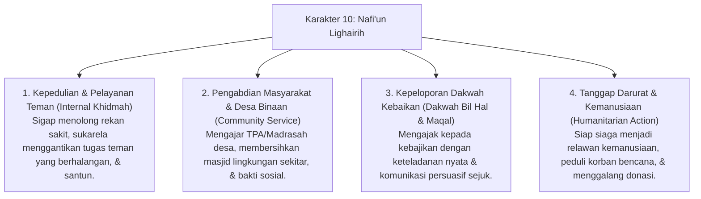

# P3-13-Nafiun-Lighairih-Induk (Karakter 10: Bermanfaat bagi Sesama & Khidmah Keumatan)

## Tujuan
Menetapkan kerangka kapasitas menyeluruh untuk **Karakter 10: Nafi'un Lighairih (Bermanfaat bagi Sesama & Khidmah Keumatan)** sebagai puncak (*Crown of Character*) dari seluruh tangga profil santri lulusan pesantren TUMBUH: mencetak generasi yang memiliki kepekaan sosial tinggi, jiwa pengabdian tulus (*Khidmah*), mendahulukan kepentingan umat (*Itsar*), serta aktif menjadi motor penggerak kebaikan di tengah masyarakat (*Rahmatan lil 'Alamin*).

---

## 1. 4 Dimensi Karakter Nafi'un Lighairih

---

## 2. Matriks Rubrik 4 Level Capaian Nafi'un Lighairih

| Dimensi Perilaku | Level 1: Emerging (T1) | Level 2: Developing (T2) | Level 3: Proficient (T3) | Level 4: Exemplary (T4 - Qudwah) |
| :--- | :--- | :--- | :--- | :--- |
| **Kepedulian Kamar & Teman** | Acuh tak acuh saat melihat rekan sekamarnya sakit atau kesulitan. | Membantu teman jika diminta tolong secara langsung oleh musyrif. | Proaktif mengambilkan makanan untuk rekan yang sakit tanpa disuruh (*Itsar*). | Mengorganisir jadwal piket perawatan rekan sakit di asrama dengan penuh kasih. |
| **Pengabdian Masyarakat Desa** | Mengikuti program bakti sosial sekadar memenuhi kewajiban formal. | Terlibat aktif dalam kegiatan membersihkan masjid desa bersama pondok. | Mampu mengajar anak-anak TPA desa binaan secara mandiri, sabar & kreatif. | Merancang program pemberdayaan masyarakat desa & menjadi figur panutan warga. |
| **Kepemimpinan Dakwah Khidmah** | Pasif dalam forum dakwah, belum berani menyampaikan nasehat kebaikan. | Berani menjadi imam / muadzin di musholla sekitar pondok. | Mampu memberikan ceramah singkat / kultum yang menyejukkan & membangun. | Menjadi dai muda pelopor perubahan, menggerakkan pemuda desa untuk sholat berjamaah (*Qudwah*). |

---

## 3. Status Dokumen
* **Status**: 🌟 **A+ (Dokumen Induk Nafi'un Lighairih)**
* **Level**: Project 3 - `03 Capacity Framework / 13 Nafi'un Lighairih`
* **Langkah Berikutnya**: Melengkapi sub-modul 01 hingga 14.
