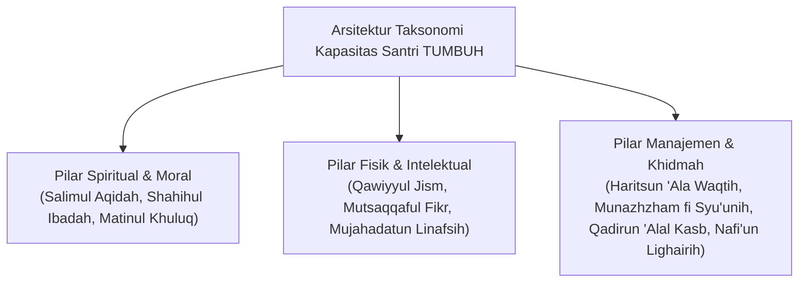
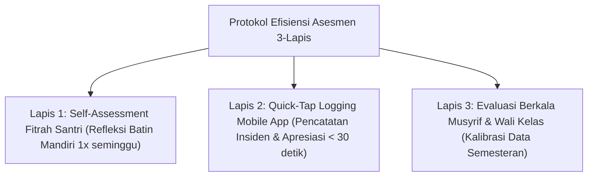

# MONOGRAF RISET AKADEMIK: TAKSONOMI KAPASITAS HOLISTIK DAN 10 MUWASSHAFAT KARAKTER SANTRI
## Analisis Integratif: Taksonomi Karakter Syar'i, CASEL Social-Emotional Learning, dan Pengukuran Perilaku Teramati (Observable Behavioral Descriptors)

**Dewan Riset & Keilmuan Ekosistem TUMBUH**  
*Dipublikasikan sebagai Naskah Monograf Riset Ilmiah (Jurnal Kebijakan & Taksonomi Karakter Pesantren)*  
*Dokumen Rujukan Induk: Domain 03 Capacity Framework & Book Series Volume 01-04*

---

## ABSTRAK

> **Latar Belakang**: Pengukuran capaian pendidikan di lembaga konvensional sering kali terperangkap dalam penyempitan kognitif (*academic over-emphasis*), mengabaikan matra spiritual, emosional, dan sosial. Di sisi lain, pembentukan karakter di pesantren memerlukan standar kompetensi baku yang terukur tanpa kehilangan ruh penyucian jiwa (*Tazkiyatun Nafs*) dan tanpa membebani Musyrif secara administratif.
>
> **Tujuan Penelitian**: Merumuskan taksonomi kapasitas holistik santri yang memetakan **10 Karakter Utama (*Muwashafat*)**, menyintesiskan kompetensi karakter Islami dengan *CASEL Social-Emotional Learning (SEL)*, serta menetapkan indikator perilaku teramati (*Observable Behavioral Descriptors*) yang dapat diukur secara objektif.
>
> **Hasil Riset**: Terbentuk taksonomi 10 Muwashafat Karakter Santri TUMBUH: (1) *Salimul Aqidah*; (2) *Shahihul Ibadah*; (3) *Matinul Khuluq*; (4) *Qawiyyul Jism*; (5) *Mutsaqqaful Fikr*; (6) *Mujahadatun Linafsih*; (7) *Haritsun 'Ala Waqtih*; (8) *Munazhzham fi Syu'unih*; (9) *Qadirun 'Alal Kasb*; dan (10) *Nafi'un Lighairih*. Seluruh karakter dipetakan melintasi 5 Kompetensi CASEL SEL (*Self-Awareness, Self-Management, Social Awareness, Relationship Skills, Responsible Decision-Making*) dan dilengkapi protokol efisiensi observasi *Low-Friction Assessment*.
>
> **Kata Kunci**: *Capacity Framework, 10 Muwashafat, CASEL SEL, Tazkiyatun Nafs, Observable Descriptors, Low-Friction Assessment.*

---

## 1. PENDAHULUAN & DIALEKTIKA TAKSONOMI KARAKTER

Pengembangan kapasitas manusia dalam Islam tidak dipandang secara parsial, melainkan sebagai upaya utuh menumbuhkembangkan seluruh potensi fitrah yang diamanahkan Allah SWT.

---

## 2. KAJIAN INTEGRATIF 10 MUWASSHAFAT & CASEL SEL

| Karakter Muwashafat | Dimensi Pengembangan Utama | Sintesis Kompetensi CASEL SEL | Indikator Perilaku Utama |
| :--- | :--- | :--- | :--- |
| **1. Salimul Aqidah** | Spiritual & Tauhid | Self-Awareness (Spiritual Alignment) | Keyakinan murni, bebas syubhat/khurafat. |
| **2. Shahihul Ibadah** | Fiqih & Sholat | Self-Management (Ibadah Habit) | Khusyu', konsisten sholat berjamaah & sunnah. |
| **3. Matinul Khuluq** | Adab & Pergaulan | Relationship Skills & Social Awareness | Bertutur kata santun, empati, & anti-bullying. |
| **4. Qawiyyul Jism** | Fisik & Kesehatan | Self-Management (Physical Health) | Kebugaran fisik, kebersihan diri, & P3K. |
| **5. Mutsaqqaful Fikr** | Intelektual & Kitab | Responsible Decision-Making | Hafalan mutqin, kritis syar'i, & ilmu Turats. |
| **6. Mujahadatun Linafsih** | Regulasi Diri & Emosi | Self-Management (Emotional Regulation) | Mengontrol amarah ghadhab & tazkiyah. |
| **7. Haritsun 'Ala Waqtih** | Disiplin Waktu | Self-Management (Time Management) | Tepat waktu sholat/kelas & manajemen studi. |
| **8. Munazhzham fi Syu'unih**| Kerapian & Ketertiban | Self-Management (Organizational Skill) | Kerapian kamar, piket, & pengelolaan barang. |
| **9. Qadirun 'Alal Kasb** | Mandiri & Vokasional | Responsible Decision-Making & Autonomy | Literasi keuangan Islami & kemandirian hidup. |
| **10. Nafi'un Lighairih** | Khidmah & Keumatan | Social Awareness & Relationship Skills | Kepedulian sosial, khidmah desa, & Peer Buddy. |

---

## 3. MATRIKS INDIKATOR PERILAKU TERAMATI (OBSERVABLE BEHAVIORAL DESCRIPTORS)

Untuk mengeliminasi penilaian subjektif Musyrif pada karakter batiniah (*Salimul Aqidah* & *Mujahadatun Linafsih*), ditetapkan indikator fisik yang dapat diobservasi secara objektif:

| Karakter Muwashafat | Indikator Teramati Mandiri (Objektif) | Bukti Perilaku Fisik Nyata di Kamar/Kelas |
| :--- | :--- | :--- |
| **1. Salimul Aqidah** | Mengucapkan dzikir kalimat thoyyibah saat mendapat nikmat/ujian & menolak praktik syubhat. | Memimpin doa kamar, tadabbur alam, & konsistensi aqidah tanpa ragu. |
| **2. Shahihul Ibadah** | Sholat berjamaah shaf depan & wudhu sesuai sunnah tanpa tergesa-gesa. | Tiba di masjid sebelum azan selesai & khusyu' zikir sesudah sholat. |
| **3. Matinul Khuluq** | Mengucapkan salam, menggunakan kata "Maaf, Tolong, Terima Kasih", & menengahi pertengkaran. | Tidak menyebut julukan buruk, menjauhi ghibah, & empati kawan sakit. |
| **4. Qawiyyul Jism** | Mengikuti olahraga sunnah, mandi tertib, & memotong kuku/merapikan diri. | Menjaga kebersihan pakaian, nutrisi makan sehat, & P3K kamar. |
| **5. Mutsaqqaful Fikr** | Menghafal Al-Qur'an target mutqin & inisiatif membaca kitab gundul. | Aktif bertanya dalam halaqah & memandu diskusi muzakarah kawan. |
| **6. Mujahadatun Linafsih** | Menahan amarah saat dikritik/kecewa (*Cognitive Reframing*) & wudhu saat marah. | Tidak merusak barang, nada suara tetap rendah saat konflik emosi. |
| **7. Haritsun 'Ala Waqtih** | Bergerak cepat saat bel berbunyi & memiliki jadwal studi mandiri. | Tidak menunda hafalan & mengisi waktu luang dengan membaca. |
| **8. Munazhzham fi Syu'unih**| Merapikan tempat tidur setelah bangun & menyusun buku/pakaian di lemari. | Melaksanakan tugas piket kamar sesuai pembagian tanpa diingatkan. |
| **9. Qadirun 'Alal Kasb** | Mencuci pakaian pribadi, merawat fasilitas kamar, & hemat uang saku. | Mengelola keuangan mandiri & inisiatif proyek wirausaha sederhana. |
| **10. Nafi'un Lighairih** | Membantu kawan piket, mengajari adik kelas (*Peer Buddy*), & donor/khidmah sosial. | Menolong kawan yang kesulitan hafalan & inisiatif kebersihan bersama. |

---

## 4. PROTOKOL EFISIENSI ASESMEN (LOW-FRICTION ASSESSMENT PROTOCOL)

Untuk mencegah kelelahan administratif Musyrif (*Assessment Overload*), pengukuran 10 Muwashafat dilakukan dengan protokol 3-Lapis:

---

## 5. IMPLIKASI KEBIJAKAN KURIKULUM & ASESMEN
- **Integrasi Kurikulum Adab**: 10 Muwashafat dijadikan peta kompetensi acuan bagi Wali Kelas, Musyrif Asrama, dan Konselor BK.
- **Asesmen Portofolio Ipsatif**: Capaian karakter diukur melalui grafik pertumbuhan ipsatif mandiri santri dari caturwulan ke caturwulan.

---

## 6. DAFTAR PUSTAKA
* CASEL. (2020). *CASEL's SEL Framework*. Collaborative for Academic, Social, and Emotional Learning.
* Horner, R. H., & Sugai, G. (2015). School-wide PBIS. *Behavior Analysis in Practice*, 8(1), 80–85.
* Raghib al-Isfahani. (2009). *Adz-Dzari'ah ila Makarim asy-Syari'ah*. Dar as-Salam.
