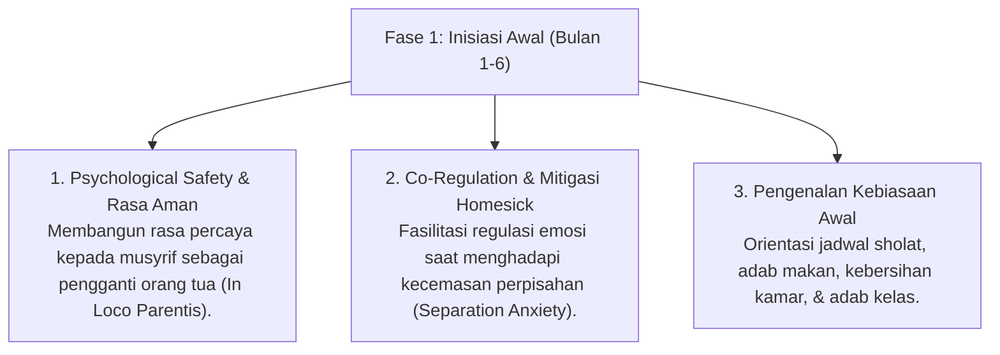

# P4-01-01: Fase Orientasi dan Inisiasi Awal Santri Baru (Bulan 1–6)

## Status Dokumen
* **Status**: 🌟 **A+ (Tervalidasi & Siap Diimplementasikan)**
* **Sub-Domain**: `04 Progression Framework / 01 Development Stages`
* **Penanggung Jawab Keilmuan**: Dewan Keilmuan TUMBUH (*Pakar Pengasuhan Asrama & Pakar Bimbingan Konseling*)

---

## 1. Konseptualisasi Fase Orientasi & Inisiasi

Fase Orientasi dan Inisiasi Awal merupakan 6 bulan pertama santri menjejakkan kaki di lingkungan pesantren. Fase ini ditandai oleh perubahan drastis ekosistem dari lingkungan keluarga menuju *Bi'ah Shalihah* komunal asrama.

---

## 2. Karakteristik Biososial-Spiritual Santri Fase 1

- **Kognitif & Neurosains**: Prefrontal Cortex (PFC) masih dalam tahap perkembangan awal remaja. Kontrol inhibisi emosi masih lemah, sehingga santri mudah mengalami kewalahan emosional (*emotional overwhelm*) saat menghadapi aturan baru.
- **Dimensi Spiritualitas (*Nafs*)**: Berada pada tahap *Nafs Ammarah bissu'* awal di mana dorongan ego dan kebiasaan lama rumah masih dominan. Proses pembinaan berfokus pada *Takhalli* (membersihkan kebiasaan buruk) secara lembut (*Kind & Firm*).
- **Relasi Sosial**: Masih cenderung *Ego-centric*, fokus pada pemenuhan kebutuhan keamanan diri dan kepemilikan pribadi.

---

## 3. Protokol Penanganan Homesickness Berbasis Empati

Dilarang keras melabeli santri yang menangis atau mengalami *homesickness* dengan sebutan "cengeng", "manja", atau "tidak niat sekolah". Penanganan wajib mengikuti **Protokol 4-Langkah Co-Regulation**:

1. **Validasi Perasaan (*Validation*)**: Musyrif mendengarkan dan mengabsahkan emosi santri tanpa menghakimi ("Ustadz paham, merindukan rumah itu hal yang sangat wajar").
2. **Penetapan Ruang Aman (*Safe Space*)**: Menyediakan sudut konseling kamar yang tenang untuk santri menenangkan diri.
3. **Pengalihan Terstruktur (*Structured Engagement*)**: Mengajak santri terlibat dalam aktivitas kelompok kecil yang menyenangkan bersama teman kamar.
4. **Komunikasi Terjadwal Ortus (*Family Bridge*)**: Memfasilitasi komunikasi terstruktur dengan orang tua sesuai SOP pengasuhan.

---

## 4. Peran Musyrif & Scaffolding Ratio (80%)

Pada Fase 1, Musyrif bertindak sebagai **Instruktur & Pendamping Intensif Harian** dengan tingkat *Scaffolding* 80%:
- Mengarahkan langkah demi langkah cara merapikan tempat tidur, mencuci pakaian, dan menyusun kitab.
- Membangunkan santri dengan kelembutan (*Fiqhu al-Inhadh*) tanpa teriakan atau hukuman fisik.
- Memberikan penguatan positif (*Positive Reinforcement*) untuk setiap kemajuan kecil yang ditunjukkan santri.
