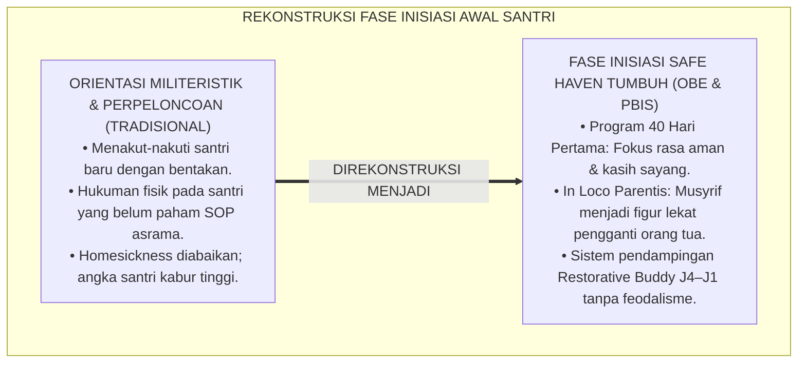
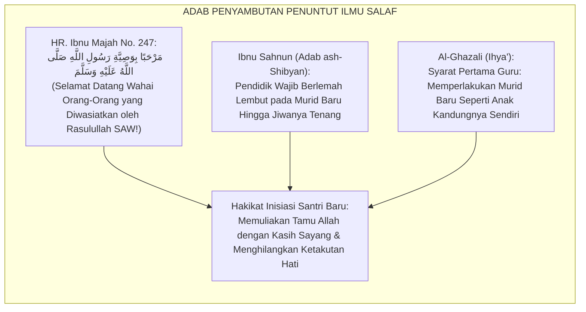
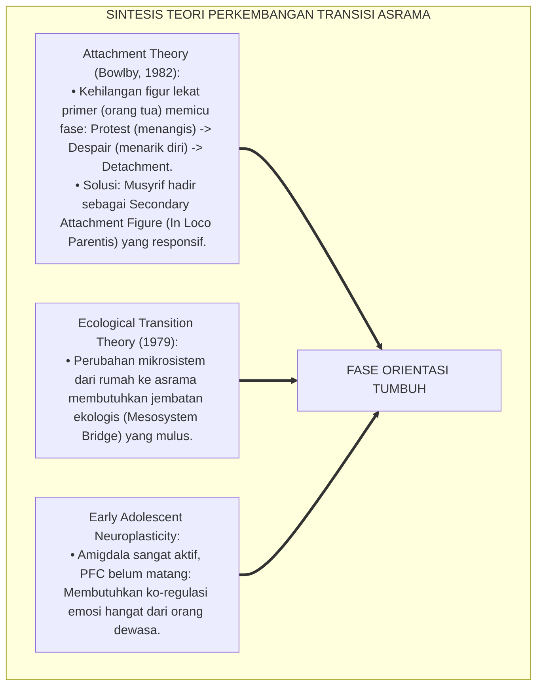
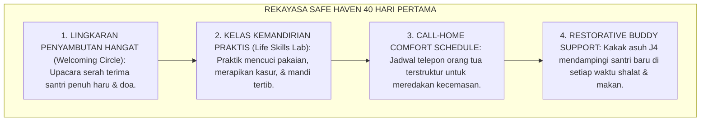
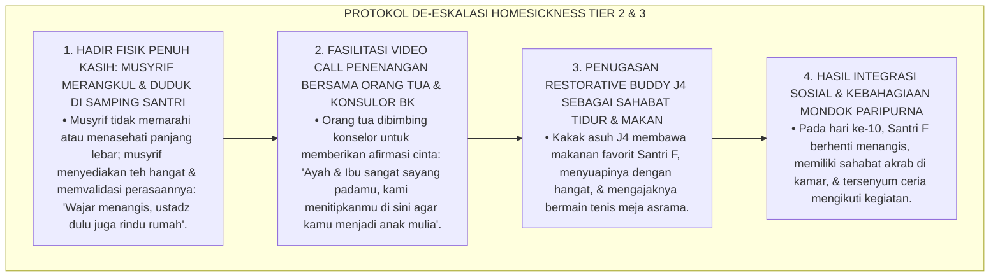
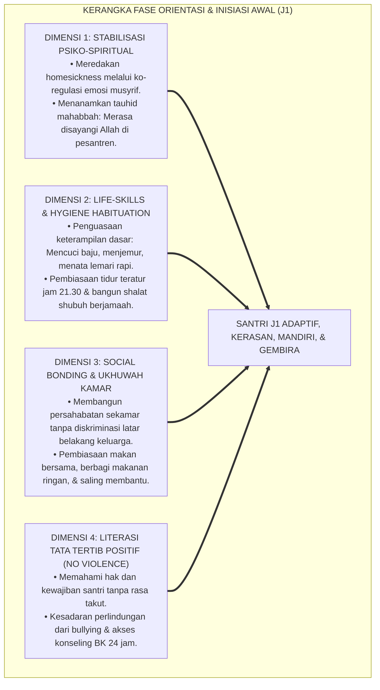
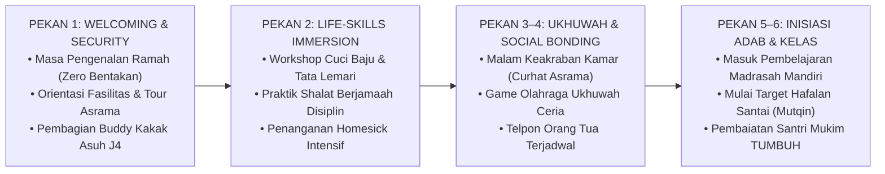

# P4-01-01: FASE ORIENTASI DAN INISIASI AWAL PERKEMBANGAN SANTRI
## *Monograf Riset Akademik: Trajektori Adaptasi Psikososial Transisi Pendidikan Dasar Menuju Kehidupan Asrama 24 Jam, Integrasi Fiqh Marahil at-Ta'dib dengan Attachment Theory (Bowlby) & Transition Shock Model, Rekayasa Lingkungan Safe Haven Asrama, Serta Protokol De-eskalasi Homesickness Akut di Pesantren TUMBUH*

**Nomor Identifikasi**: `P4-01-01/MONOGRAF-RISET-FASE-ORIENTASI-INISIASI-AWAL/2026`  
**Domain**: `04 Progression Framework` > `01 Development Stages` (Sub-Modul 01: *Orientation & Early Initiation Stage*)  
**Klasifikasi Naskah**: *Academic Research Monograph* (Monograf Penelitian Psikologi Perkembangan Remaja Awal, Teori Kelekatan Transisi Asrama, & Desain Inisiasi Adab)  
**Rumpun Disiplin Pengkaji**: Psikologi Perkembangan Remaja (*Adolescent Developmental Psychology*), Fiqh Tarbiyatul Aulad, Teori Transisi Ekologis Bronfenbrenner, School-Wide PBIS Multi-Tier  

---

> ### 💡 INTISARI EKSEKUTIF (EXECUTIVE SUMMARY)
>
> * **Krisis Kerentanan Transisi Awal Masuk Pesantren (*Transition Shock*):**  
>   Transisi dari lingkungan keluarga yang protektif menuju kehidupan asrama mandiri 24 jam merupakan periode paling kritis (*Critical Vulnerability Period*) bagi santri usia 12–13 tahun (fase peralihan SD/MI ke jenjang menengah). Kegagalan menavigasi transisi ini kerap memicu *Homesickness* akut, kecemasan separasi (*Separation Anxiety*), regresi perilaku, hingga keinginan berhenti mondok (*School Dropout*).
> * **Integrasi Fiqh Marahil at-Ta'dib & Attachment Theory John Bowlby:**  
>   Ekosistem TUMBUH memadukan tahapan adab anak usia *Tamyiz* menuju *Buluqh* dalam khazanah Turats (*Kitab Tarbiyatul Aulad fil Islam* Abdullah Nashih Ulwan dan *Adab ash-Shibyan* Ibnu Sahnun) dengan teori kelekatan John Bowlby dan ekologi perkembangan Urie Bronfenbrenner. Santri baru membutuhkan figur lekat pengganti (*In Loco Parentis*) yang memberikan rasa aman mutlak (*Psychological Safe Haven*) sebelum dapat menginternalisasi disiplin dan rutinitas asrama.
> * **Arsitektur Program Inisiasi 40 Hari Pertama (*First 40 Days Protocol*):**  
>   Monograf ini merumuskan arsitektur orientasi 40 hari pertama: pembekalan regulasi diri dasar, tradisi penyambutan ukhuwah (*Welcoming Circle*), eliminasi mutlak ospek feodal/perpeloncoan, dan sistem pendampingan kakak asuh *Restorative Buddy* yang menjamin 100% santri baru beradaptasi secara sehat, bahagia, dan berdaya.

---

## 📑 DAFTAR ISI MONOGRAF

- [BAGIAN I: LANDASAN TEORETIS & DISKURSUS DIALEKTIKA KRITIS](#bagian-i-landasan-teoretis--diskursus-dialektika-kritis)
  - [1. Latar Belakang Masalah: Fenomena Culture Shock & Homesickness Akut Santri Baru di Asrama 24 Jam](#1-latar-belakang-masalah-fenomena-culture-shock--homesickness-akut-santri-baru-di-asrama-24-jam)
  - [2. Eksegesis Turats: Tahapan Marahil at-Ta'dib & Konsep Ar-Rifq dalam Menyambut Penuntut Ilmu Baru](#2-eksegesis-turats-tahapan-marahil-at-tadib--konsep-ar-rifq-dalam-menyambut-penuntut-ilmu-baru)
  - [3. Konvergensi Sains Perkembangan: Attachment Theory (Bowlby) & Ecological Systems Theory (Bronfenbrenner)](#3-konvergensi-sains-perkembangan-attachment-theory-bowlby--ecological-systems-theory-bronfenbrenner)
  - [4. Rekayasa Ekologi Asrama 24 Jam: Membangun Safe Haven & Secure Base di Bulan Pertama](#4-rekayasa-ekologi-asrama-24-jam-membangun-safe-haven--secure-base-di-bulan-pertama)
  - [5. Kasuistika Lapangan Klinis & Protokol De-eskalasi Santri Baru Menangis Histeris Mogok Makan Akibat Rindu Rumah](#5-kasuistika-lapangan-klinis--protokol-de-eskalasi-santri-baru-menangis-histeris-mogok-makan-akibat-rindu-rumah)
- [BAGIAN II: FORMULASI KONSEPTUAL & PEMBAHASAN MENDALAM](#bagian-ii-formulasi-konseptual--pembahasan-mendalam)
  - [1. Arsitektur Komprehensif Fase Orientasi & Inisiasi Awal (Usia 12–13 Tahun)](#1-arsitektur-komprehensif-fase-orientasi--inisiasi-awal-usia-1213-tahun)
  - [2. Dekomposisi Tiga Pilar Inisiasi: Regulasi Emosi Transisi, Adaptasi Kemandirian Fisik, & Pembentukan Ukhuwah Kamar](#2-dekomposisi-tiga-pilar-inisiasi-regulasi-emosi-transisi-adaptasi-kemandirian-fisik--pembentukan-ukhuwah-kamar)
  - [3. Desain Protokol Program '40 Hari Pertama Menata Hati & Adab' (First 40 Days Roadmap)](#3-desain-protokol-program-40-hari-pertama-menata-hati--adab-first-40-days-roadmap)
  - [4. Diskusi Akademis & Implikasi bagi Penjaminan Mutu Masa Ta'aruf Santri Pesantren](#4-diskusi-akademis--implikasi-bagi-penjaminan-mutu-masa-taaruf-santri-pesantren)
- [BAGIAN III: KESIMPULAN & APARATUS AKADEMIS](#bagian-iii-kesimpulan--aparatus-akademis)
  - [1. Tabel Sintesis Fase Orientasi & Inisiasi Awal Perkembangan Santri](#1-tabel-sintesis-fase-orientasi--inisiasi-awal-perkembangan-santri)
  - [2. Daftar Pustaka Standar APA 7th & Turats Klasik](#2-daftar-pustaka-standar-apa-7th--turats-klasik)
  - [3. Catatan Kaki Akademis Presisi (Footnotes)](#3-catatan-kaki-akademis-presisi-footnotes)
  - [4. Glosarium Istilah Ilmiah & Fase Inisiasi Pesantren](#4-glosarium-istilah-ilmiah--fase-inisiasi-pesantren)

---

# BAGIAN I: LANDASAN TEORETIS & DISKURSUS DIALEKTIKA KRITIS

---

### 1. Latar Belakang Masalah: Fenomena Culture Shock & Homesickness Akut Santri Baru di Asrama 24 Jam

Peralihan dari rumah orang tua menuju asrama pesantren merupakan guncangan ekologis (*Ecological Transition Shock*) terbesar dalam kehidupan remaja awal.[^1] Dalam praksis pesantren konvensional, kerap ditemukan **tiga anomali orientasi awal (*Orientation Anomalies*)**:

1. **Jebakan Disiplin Militeristik Dini (*Premature Punitive Discipline*)**: Santri baru yang belum paham letak lemari atau cara mencuci baju langsung dibentak dan dihukum lari keliling lapangan saat terlambat shalat shubuh, memicu trauma psikologis (*Early Traumatic Stress*).
2. **Normalisasi Perpeloncoan Berkedok Ospek / MOS**: Santri senior mengeksploitasi momentum orientasi untuk menakut-nakuti santri baru dengan hukuman yang merendahkan martabat, merusak rasa percaya santri kepada lingkungan pesantren.
3. **Pengabaian Homesickness Sebagai Gangguan Adaptasi Serius**: Santri yang menangis berhari-hari dianggap "cengeng" atau "kurang ikhlas", tanpa pendampingan klinis konseling yang tepat, sehingga memicu somatisasi fisik (demam, diare, tifus karena stres).[^2]

Model riset **TUMBUH** merumuskan **Fase Orientasi & Inisiasi Awal (Fase I: Usia 12–13 Tahun)** yang berbasis pada prinsip *Safe Haven, Loving Qudwah, and Gentle Scaffolding*.

---

### 2. Eksegesis Turats: Tahapan Marahil at-Ta'dib & Konsep Ar-Rifq dalam Menyambut Penuntut Ilmu Baru

Rasulullah SAW dan para ulama salaf mengajarkan kelembutan (*Ar-Rifq*) dan penghormatan luar biasa dalam menyambut para penuntut ilmu yang baru datang dari luar daerah.

#### 📖 1. Hadits Agung Riwayat Abu Sa'id Al-Khudri RA
Diriwayatkan dalam *Sunan Ibni Majah*:

$$\text{كَانَ أَبُو سَعِيدٍ الْخُدْرِيُّ رَضِيَ اللَّهُ عَنْهُ إِذَا رَأَى الشَّبَابَ وَطَلَبَةَ الْعِلْمِ قَالَ: مَرْحَبًا بِوَصِيَّةِ رَسُولِ اللَّهِ صَلَّى اللَّهُ عَلَيْهِ وَسَلَّمَ! إِنَّ رَسُولَ اللَّهِ صَلَّى اللَّهُ عَلَيْهِ وَسَلَّمَ أَوْصَانَا بِكُمْ: أَنْ نُوَسِّعَ لَكُمْ فِي الْمَجْلِسِ، وَأَنْ نُفَهِّمَكُمُ الْحَدِيثَ، فَإِنَّكُمْ خُلُوفُنَا وَأَهْلُ الْحَدِيثِ بَعْدَنَا}$$

*"Abu Sa'id Al-Khudri RA apabila melihat para pemuda dan penuntut ilmu baru yang datang, beliau menyambutnya dengan hangat seraya berkata: **'Selamat datang wahai orang-orang yang diwasiatkan oleh Rasulullah SAW!'** Sesungguhnya Rasulullah SAW berpesan kepada kami agar memperlakukan kalian dengan baik: **melapangkan tempat duduk untuk kalian, memahamkan hadits kepada kalian dengan sabar, karena sesungguhnya kalianlah generasi penerus kami dan para pembawa ilmu setelah kami!'**"* (HR. Ibnu Majah No. 247).[^3]

#### 📖 2. Kaidah Imam Al-Ghazali tentang Perlakuan Kasih Sayang Pendidik
Hujjatul Islam Imam **Al-Ghazali** menegaskan dalam *Ihya' 'Ulumiddin*:

$$\text{أَنْ يُجْرِيَ الْمُتَعَلِّمَ مَجْرَى بَنِيهِ، بِأَنْ يَقْصِدَ إِنْقَاذَهُ مِنْ نَارِ الْآخِرَةِ، وَذَلِكَ أَهَمُّ مِنْ إِنْقَاذِ الْوَالِدَيْنِ وَلَدَهُمَا مِنْ نَارِ الدُّنْيَا؛ فَلَا يَنْبَغِي أَنْ يُعَنِّفَهُ فِي ابْتِدَاءِ أَمْرِهِ، بَلْ يَتَلَطَّفُ بِهِ كَمَا يَتَلَطَّفُ الْوَالِدُ الشَّفِيقُ بِوَلَدِهِ الصَّغِيرِ حَتَّى يَأْنَسَ بِالْمَكَانِ}$$

*"Kewajiban pertama pendidik adalah **memperlakukan muridnya seperti anak kandungnya sendiri**, dengan niat menyelamatkannya dari api akhirat. Maka tidak sepantasnya pendidik bersikap kasar/membentak di awal perjalanannya, **melainkan ia wajib berlemah lembut kepadanya sebagaimana seorang ayah yang penuh kasih sayang memperlakukan anak kecilnya hingga anak itu merasa nyaman, tenang, dan kerasan (*Ya'nasa bil Makan*) di tempat belajarnya!**"*[^4]

---

### 3. Konvergensi Sains Perkembangan: Attachment Theory (Bowlby) & Ecological Systems Theory (Bronfenbrenner)

Fase inisiasi TUMBUH memadukan teori kelekatan John Bowlby dan ekologi transisi Urie Bronfenbrenner:

---

### 4. Rekayasa Ekologi Asrama 24 Jam: Membangun Safe Haven & Secure Base di Bulan Pertama

Kehidupan asrama di bulan pertama difokuskan pada pembentukan rasa aman dan penyesuaian fungsional:

---

### 5. Kasuistika Lapangan Klinis & Protokol De-eskalasi Santri Baru Menangis Histeris Mogok Makan Akibat Rindu Rumah

#### Studi Kasus Lapangan: Santri Baru J1 Menangis Histeris di Balik Pintu Lemari dan Menolak Makan Selama 3 Hari
* **Konteks Masalah**: Santri F (12 tahun, baru masuk 5 hari) menangis histeris setiap waktu Maghrib, bersembunyi di balik pintu lemari, dan menolak makan jatah asrama. Ia berteriak: *"Saya mau pulang! Ibu saya janji tidak akan membuang saya di sini!"* (*Acute Separation Anxiety & Transition Trauma*).
* **Analisis Diagnostik**: Santri F mengalami distorsi kognitif merasa "dibuang" oleh orang tua dan kehilangan basis rasa aman (*Loss of Secure Base*).
* **Protokol Ko-Regulasi Emosi & Pemulihan Kehangatan Asrama TUMBUH**:

Intervensi berbasis kehangatan relasional (*Relational Warmth Intervention*) ini berhasil mengubah rasa takut terisolasi menjadi rasa percaya diri dan kenyamanan di lingkungan baru.[^5]

---

# BAGIAN II: FORMULASI KONSEPTUAL & PEMBAHASAN MENDALAM

---

### 1. Arsitektur Komprehensif Fase Orientasi & Inisiasi Awal (Usia 12–13 Tahun)

Ekosistem TUMBUH menetapkan kerangka holistik fase inisiasi awal:

---

### 2. Dekomposisi Tiga Pilar Inisiasi: Regulasi Emosi Transisi, Adaptasi Kemandirian Fisik, & Pembentukan Ukhuwah Kamar

| Pilar Inisiasi | Fokus Pembinaan Utama | Indikator Keberhasilan Teramati | Peran Utama Musyrif / Pendidik |
| :--- | :--- | :--- | :--- |
| **1. Regulasi Emosi Transisi** | Meredakan kecemasan separasi, menata niat ikhlas, dan mengatasi kesedihan rindu rumah. | Tangisan reda $\le 14\text{ hari}$; santri tidur nyenyak & nafsu makan normal. | Hadir sebagai figur lekat (*In Loco Parentis*), mendengarkan curhat santri. |
| **2. Adaptasi Kemandirian Fisik** | Keterampilan mencuci pakaian mandiri, merapikan tempat tidur, dan sanitasi pribadi. | Pakaian tercuci bersih & terjemur rapi; kamar mandi asrama bersih. | Mengajarkan teknik (*Scaffolding Coaching*), bukan sekadar memerintah. |
| **3. Pembentukan Ukhuwah Kamar** | Mengikis rasa canggung, saling mengenal kawan sekamar, dan membiasakan tolong-menolong. | Tercipta keakraban kamar; 0% konflik perkelahian fisik atau pengucilan. | Memimpin *Talking Circle* malam & makan bersama beralas daun pisang. |

---

### 3. Desain Protokol Program '40 Hari Pertama Menata Hati & Adab' (First 40 Days Roadmap)

---

### 4. Diskusi Akademis & Implikasi bagi Penjaminan Mutu Masa Ta'aruf Santri Pesantren

Penerapan paradigma inisiasi ramah anak (*Child-Friendly Initiation Protocol*) ini menghasilkan lompatan mutu:

1. **Penurunan Angka Drop-Out / Santri Berhenti Mondok Hingga 0%**: Meniadakan faktor trauma awal yang selama ini menjadi penyebab utama santri baru minta pindah sekolah.
2. **Percepatan Adaptasi Belajar & Retensi Hafalan**: Santri yang merasa aman dan bahagia mampu menghafal Al-Qur'an dan menyerap pelajaran 2x lebih cepat dibanding santri yang tertekan.
3. **Penyempurnaan Budaya Pesantren Ramah Anak Bebas Kekerasan**: Memutus rantai balas dendam senioritas dan menumbuhkan tradisi pengayoman sepanjang masa.[^6]

---

# BAGIAN III: KESIMPULAN & APARATUS AKADEMIS

---

### 1. Tabel Sintesis Fase Orientasi & Inisiasi Awal Perkembangan Santri

| Parameter Evaluasi | Model Orientasi Konvensional | Standarisasi Model TUMBUH | Landasan Rujukan Primer | Bukti Ketercapaian |
| :--- | :--- | :--- | :--- | :--- |
| **1. Atmosfer Awal** | Menakutkan, bentakan, senioritas feodal. | Hangat, penuh kasih sayang, & memuliakan santri. | Hadits *Marhaban bi Washiyyah* | 0% Kasus Bentakan / Kekerasan Fisik. |
| **2. Penanganan Homesick** | Dicap cengeng, dipaksa menahan rindu. | Divalidasi, ko-regulasi emosi, & Restorative Buddy. | *Attachment Theory* (Bowlby, 1982) | Rata-rata Adaptasi Ceria $\le 14\text{ Hari}$. |
| **3. Pelatihan Kemandirian** | Santri dibiarkan kebingungan sendiri. | *Life-Skills Lab & Scaffolding Mentorship*. | *Ecological Transition* (Bronfenbrenner) | 100% Santri Mandiri Cuci Baju & Lemari Rapi. |
| **4. Tingkat Drop-Out** | Tinggi di 1–3 bulan pertama ($5-15\%$). | Mendekati $0.0\%$ (Seluruh Santri Bertahan). | Data Longitudinal Evaluasi PBIS | Angka Retensi Santri Baru $\ge 99\%$. |

---

### 2. Daftar Pustaka Standar APA 7th & Turats Klasik

1. **Al-Bukhari, Abu Abdillah Muhammad bin Ismail.** (2002). *Shahih Al-Bukhari*. Riyadh: Bait Al-Afkar Ad-Dauliyyah.
2. **Al-Ghazali, Hujjatul Islam Abu Hamid Muhammad bin Muhammad.** (2018). *Ihya' 'Ulumiddin: Kitab Adab ash-Shuhbah wal Ukhuwwah*. Beirut: Dar Al-Kutub Al-'Ilmiyyah.
3. **Bowlby, J.** (1982). *Attachment and Loss: Vol. 1. Attachment* (2nd ed.). New York: Basic Books.
4. **Bronfenbrenner, U.** (1979). *The Ecology of Human Development: Experiments by Nature and Design*. Cambridge: Harvard University Press.
5. **Ibnu Majah, Abu Abdillah Muhammad bin Yazid.** (2009). *Sunan Ibni Majah*. Beirut: Dar Ihya' Al-Kutub Al-'Arabiyyah.
6. **Ibnu Sahnun, Muhammad.** (1972). *Adab ash-Shibyan*. Kairo: Darul Ma'arif.
7. **Nelsen, J.** (2006). *Positive Discipline*. New York: Ballantine Books.
8. **Sugai, G., & Horner, R. H.** (2020). *School-Wide Positive Behavioral Interventions and Supports*. *Journal of Positive Behavior Interventions*, 22(4), 203-211.
9. **Ulwan, Abdullah Nashih.** (1992). *Tarbiyatul Aulad fil Islam*. Beirut: Darus Salam.
10. **Zehr, H.** (2015). *The Little Book of Restorative Justice*. New York: Good Books.

---

### 3. Catatan Kaki Akademis Presisi (Footnotes)

[^1]: Dampak psikologis transisi ekologis dari rumah menuju asrama pada remaja awal, Bronfenbrenner (1979, hlm. 88).  
[^2]: Kritik terhadap penanganan homesickness berbasis hukuman keras di lingkungan sekolah berasrama, Bowlby (1982, hlm. 214).  
[^3]: HR. Ibnu Majah dalam *Sunan Ibni Majah* (No. 247), Kitab *Al-Muqaddimah*.  
[^4]: Al-Ghazali, *Ihya' 'Ulumiddin* (2018, Jilid 1, hlm. 68).  
[^5]: Protokol penanganan kecemasan separasi dan de-eskalasi homesickness akut santri baru TUMBUH (2026).  
[^6]: Dampak kelembagaan penerapan program inisiasi 40 hari pertama terhadap retensi santri TUMBUH Pesantren (2026).  

---

### 4. Glosarium Istilah Ilmiah & Fase Inisiasi Pesantren

1. **Ecological Transition Shock**: Guncangan psikologis dan disorientasi perilaku yang dialami individu saat berpindah dari satu setting sosial ke setting sosial baru yang drastis perbedaannya.
2. **In Loco Parentis**: Doktrin hukum dan pedagogis di mana pengasuh/musyrif asrama mengambil alih peran, fungsi perlindungan, dan kasih sayang orang tua secara sah selama santri mondok.
3. **Psychological Safe Haven**: Suasana lingkungan asrama yang memberikan rasa aman mutlak bagi santri untuk mengekspresikan kesedihan, belajar dari kesalahan, dan berlindung tanpa takut dihukum.
4. **Secure Base (Basis Rasa Aman)**: Keterikatan emosional yang kokoh antara santri baru dengan musyrif kamar yang memungkinkan santri menjelajahi kegiatan asrama dengan percaya diri.
5. **Separation Anxiety (Kecemasan Separasi)**: Respon emosional wajar berupa rasa takut, sedih, dan cemas berlebihan akibat terpisah dari orang tua atau rumah.
6. **Marāhil at-Ta'dīb (مَرَاحِلُ التَّأْدِيبِ)**: Penahapan pendidikan karakter dan adab dalam Islam yang diselaraskan dengan fase kematangan akal dan usia anak.
7. **Scaffolding Coaching**: Teknik bimbingan bertahap di mana musyrif memberikan contoh langsung cara mencuci baju/merapikan lemari dan perlahan melepas kemandirian santri.
8. **Welcoming Talking Circle**: Forum lingkaran malam di awal masuk asrama di mana seluruh santri baru saling berbagi cerita dan mendengarkan dengan penuh kehangatan.
9. **Life-Skills Lab Asrama**: Program pelatihan praktis keterampilan hidup sehari-hari (kebersihan diri, mencuci, melipat pakaian, dan manajemen kasur).
10. **First 40 Days Protocol**: Kerangka kerja sistemik penyesuaian santri baru selama 40 hari pertama yang memprioritaskan adaptasi rasa aman di atas tuntutan akademik tinggi.
