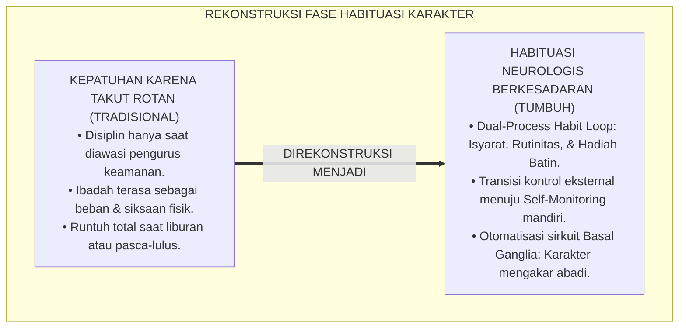
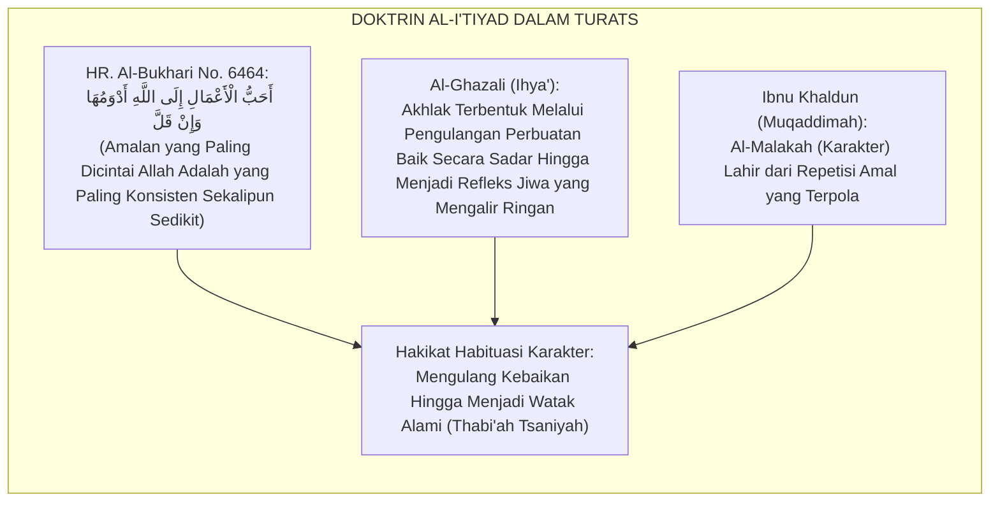
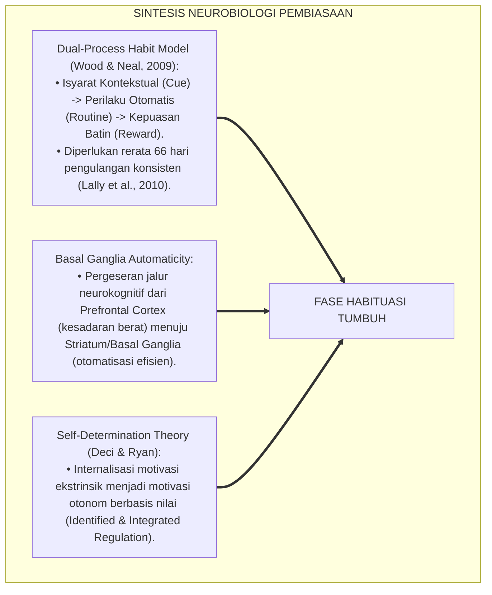
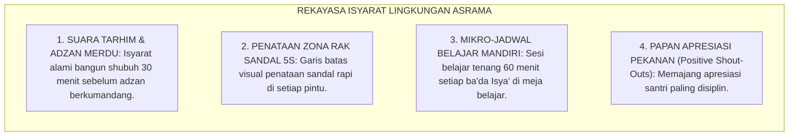
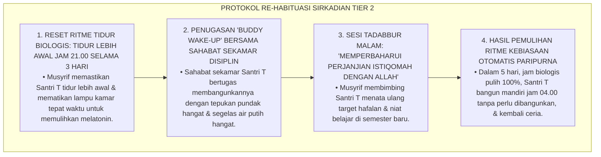
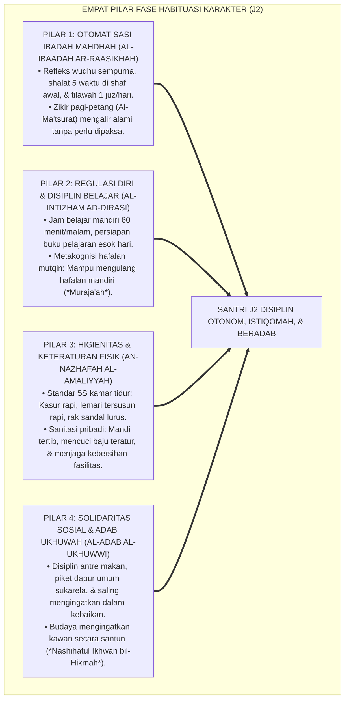
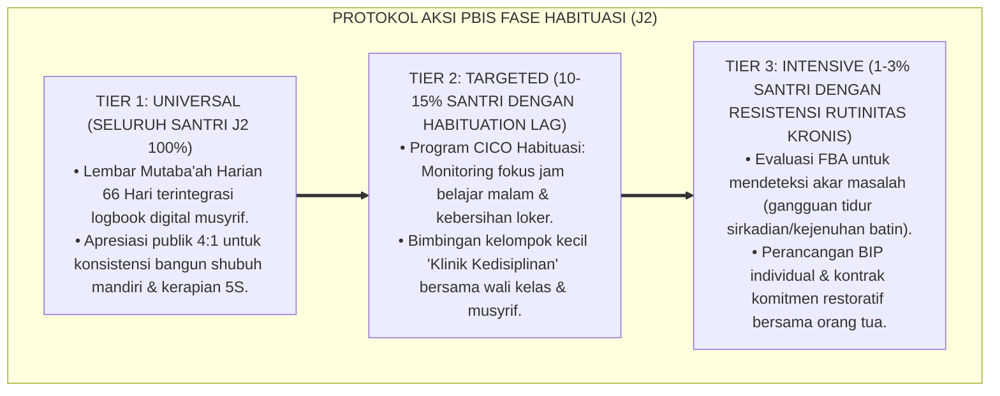

# P4-01-02: FASE HABITUASI DAN PEMBENTUKAN KARAKTER SANTRI
## *Monograf Riset Akademik: Trajektori Pembiasaan Ibadah, Disiplin Belajar, & Regulasi Diri Usia 13–14 Tahun (Fase II: Jenjang J2), Integrasi Fiqh I'tiyad & Riyadhah an-Nafs dengan Teori Pembentukan Kebiasaan (Dual-Process Habit Loop / Wood & Neal), Neurobiologi Pembentukan Sirkuit Basal Ganglia, Serta Rekayasa Lingkungan Bi'ah Shalihah 24 Jam di Ekosistem Pesantren Berbasis TUMBUH*

**Nomor Identifikasi**: `P4-01-02/MONOGRAF-RISET-FASE-HABITUASI-PEMBENTUKAN-KARAKTER/2026`  
**Domain**: `04 Progression Framework` > `01 Development Stages` (Sub-Modul 02: *Habituation & Character Formation Stage*)  
**Klasifikasi Naskah**: *Academic Research Monograph* (Monograf Penelitian Teori Pembiasaan Perilaku, Neuroplastisitas Otomatisasi Ibadah, & Desain Riyadhah Jiwa Remaja)  
**Rumpun Disiplin Pengkaji**: Psikologi Pembentukan Kebiasaan (*Habit Formation Psychology*), Neurosains Kognitif Perilaku, Fiqh Riyadhah an-Nafs, School-Wide PBIS Multi-Tier  

---

> ### 💡 INTISARI EKSEKUTIF (EXECUTIVE SUMMARY)
>
> * **Kelesuan Model Pembiasaan Berbasis Paksaan Eksternal Semata (*Coercive Compliance*):**  
>   Di banyak pesantren, pembiasaan shalat berjamaah tepat waktu, membaca Al-Qur'an, dan belajar malam sering kali hanya berjalan karena adanya rotan pengurus asrama (*Jasjus*). Begitu santri liburan pulang ke rumah atau lulus dari pondok, seluruh rutinitas ibadah tersebut runtuh seketika (*Extinction Effect*) karena tidak pernah terjadi internalisasi nilai batiniah dan otomatisasi neurobiologis sirkuit kebiasaan.
> * **Integrasi Fiqh I'tiyad & Dual-Process Habit Loop (Wood & Neal):**  
>   Ekosistem TUMBUH memadukan konsep pembiasaan amal shalih (*Al-I'tiyād*) dan penempaan jiwa (*Riyādhah an-Nafs*) dalam *Ihya' 'Ulumiddin* Imam Al-Ghazali dengan sains neuroplastisitas pembentukan kebiasaan (Loop: *Cue $\rightarrow$ Routine $\rightarrow$ Reward*). Melalui konsistensi 66 hari pengulangan bermakna (*Meaningful Repetition*), aktivitas ibadah dan belajar bertransformasi dari kerja keras korteks prefrontal (*High Cognitive Load*) menjadi otomatisasi sirkuit basal ganglia yang mengalir nikmat.
> * **Arsitektur Pembiasaan Fase II (Usia 13–14 Tahun / Jenjang J2):**  
>   Monograf ini merumuskan etape habituasi karakter: pemantauan mandiri (*Self-Monitoring Mutaba'ah*), penguatan rasio 4:1 tanpa kekerasan, rekayasa mikro-jadwal 24 jam yang realistis, dan pembentukan iklim sebaya yang saling menguatkan (*Positive Peer Culture*).

---

## 📑 DAFTAR ISI MONOGRAF

- [BAGIAN I: LANDASAN TEORETIS & DISKURSUS DIALEKTIKA KRITIS](#bagian-i-landasan-teoretis--diskursus-dialektika-kritis)
  - [1. Latar Belakang Masalah: Ilusi Disiplin Semu Akibat Paksaan Rotan vs Pembiasaan Berkesadaran](#1-latar-belakang-masalah-ilusi-disiplin-semu-akibat-paksaan-rotan-vs-pembiasaan-berkesadaran)
  - [2. Eksegesis Turats: Doktrin Al-I'tiyad, Dawamul 'Amal, & Riyadhah an-Nafs Imam Al-Ghazali](#2-eksegesis-turats-doktrin-al-itiyad-dawamul-amal--riyadhah-an-nafs-imam-al-ghazali)
  - [3. Konvergensi Sains Pembiasaan: Dual-Process Habit Loop (Wood & Neal) & Neurobiologi Basal Ganglia](#3-konvergensi-sains-pembiasaan-dual-process-habit-loop-wood--neal--neurobiologi-basal-ganglia)
  - [4. Rekayasa Lingkungan 24 Jam: Struktur Isyarat Visual & Rutinitas Harian Bi'ah Shalihah](#4-rekayasa-lingkungan-24-jam-struktur-isyarat-visual--rutinitas-harian-biah-shalihah)
  - [5. Kasuistika Lapangan Klinis & Protokol De-eskalasi Santri J2 yang Kembali Malas Bangun Shubuh Setelah Liburan Panjang](#5-kasuistika-lapangan-klinis--protokol-de-eskalasi-santri-j2-yang-kembali-malas-bangun-shubuh-setelah-liburan-panjang)
- [BAGIAN II: FORMULASI KONSEPTUAL & PEMBAHASAN MENDALAM](#bagian-ii-formulasi-konseptual--pembahasan-mendalam)
  - [1. Arsitektur Komprehensif Fase Habituasi & Pembentukan Karakter (Usia 13–14 Tahun)](#1-arsitektur-komprehensif-fase-habituasi--pembentukan-karakter-usia-1314-tahun)
  - [2. Dekomposisi Tiga Pilar Habituasi: Otomatisasi Ibadah Mahdhah, Disiplin Belajar Mandiri, & Higienitas Kamar](#2-dekomposisi-tiga-pilar-habituasi-otomatisasi-ibadah-mahdhah-disiplin-belajar-mandiri--higienitas-kamar)
  - [3. Matriks Transformasi: Dari Kepatuhan Takut Hukuman Menuju Kebutuhan Jiwa (Self-Regulated Habit)](#3-matriks-transformasi-dari-kepatuhan-takut-hukuman-menuju-kebutuhan-jiwa-self-regulated-habit)
  - [4. Diskusi Akademis & Implikasi bagi Ketahanan Karakter Pasca-Pesantren](#4-diskusi-akademis--implikasi-bagi-ketahanan-karakter-pasca-pesantren)
- [BAGIAN III: KESIMPULAN & APARATUS AKADEMIS](#bagian-iii-kesimpulan--aparatus-akademis)
  - [1. Tabel Sintesis Fase Habituasi & Pembentukan Karakter Santri](#1-tabel-sintesis-fase-habituasi--pembentukan-karakter-santri)
  - [2. Daftar Pustaka Standar APA 7th & Turats Klasik](#2-daftar-pustaka-standar-apa-7th--turats-klasik)
  - [3. Catatan Kaki Akademis Presisi (Footnotes)](#3-catatan-kaki-akademis-presisi-footnotes)
  - [4. Glosarium Istilah Ilmiah & Fase Habituasi Karakter](#4-glosarium-istilah-ilmiah--fase-habituasi-karakter)

---

# BAGIAN I: LANDASAN TEORETIS & DISKURSUS DIALEKTIKA KRITIS

---

### 1. Latar Belakang Masalah: Ilusi Disiplin Semu Akibat Paksaan Rotan vs Pembiasaan Berkesadaran

Dalam sosiologi pendidikan kedisiplinan pesantren tradisional, kerap ditemukan **tiga ilusi pembiasaan (*Habituation Illusions*)**:[^1]

1. **Ilusi Kepatuhan Semu (*Performative Compliance Trap*)**: Santri tampak sangat disiplin bergegas ke masjid hanya karena melihat sosok pengurus keamanan membawa rotan kayu. Saat pengurus keamanan tidak ada, santri kembali bermalas-malasan di kasur.
2. **Ketiadaan Transisi dari Regulasi Eksternal Menuju Regulasi Internal**: Santri tidak pernah diajarkan alasan filosofis dan kenikmatan spiritual di balik sebuah rutinitas, sehingga ibadah dipandang sebagai "pajak waktu" yang melelahkan.
3. **Fenomena Kepunahan Perilaku Pasca-Liburan (*Post-Holiday Habit Extinction*)**: Ketika pulang liburan ke rumah tanpa pengawasan bel pondok, santri langsung mengalami *Relapse* total: bangun siang, kecanduan gawai, dan meninggalkan shalat berjamaah.[^2]

Model riset **TUMBUH** merumuskan **Fase Habituasi & Pembentukan Karakter (Fase II: Usia 13–14 Tahun / Jenjang J2)** yang mengalihkan kendali kepatuhan dari paksaan fisik menuju otomatisasi kebiasaan berkesadaran (*Mindful Habit Formation*).



---

### 2. Eksegesis Turats: Doktrin Al-I'tiyad, Dawamul 'Amal, & Riyadhah an-Nafs Imam Al-Ghazali

Khazanah Turats Islam meletakkan pembiasaan amal yang terus-menerus (*Dawāmul 'Amal*) sekalipun sedikit sebagai jalan utama penempaan jiwa (*Riyādhah an-Nafs*).



#### 📖 1. Hadits Agung Riwayat Aisyah RA
Rasulullah SAW bersabda menegaskan kunci pembentukan karakter kokoh:

$$\text{أَحَبُّ الْأَعْمَالِ إِلَى اللَّهِ تَعَالَى أَدْوَمُهَا وَإِنْ قَلَّ، وَكَانَتْ عَائِشَةُ إِذَا عَمِلَتِ الْعَمَلَ لَزِمَتْهُ}$$

*"**Amalan yang paling dicintai oleh Allah Ta'ala adalah amalan yang paling konsisten/kontinu (*Adwamuhā*) sekalipun jumlahnya sedikit**; dan adalah Aisyah RA apabila mengamalkan suatu amalan kebaikan, beliau selalu melazimkannya secara istiqomah!"* (HR. Al-Bukhari No. 6464 & Muslim No. 783).[^3]

#### 📖 2. Formulasi Imam Al-Ghazali tentang Mekanisme Pembiasaan Jiwa
Imam **Al-Ghazali** menjelaskan dalam *Ihya' 'Ulumiddin*:

$$\text{إِنَّ الْخُلُقَ عِبَارَةٌ عَنْ هَيْئَةٍ فِي النَّفْسِ رَاسِخَةٍ، عَنْهَا تَصْدُرُ الْأَفْعَالُ بِسُهُولَةٍ وَيُسْرٍ مِنْ غَيْرِ حَاجَةٍ إِلَى فِكْرٍ وَرَوِيَّةٍ؛ وَسَبِيلُ تَحْصِيلِهِ هُوَ الِاعْتِيَادُ، بِأَنْ يَتَكَلَّفَ فِي الِابْتِدَاءِ فِعْلَ الْجَمِيلِ حَتَّى يَصِيرَ لَهُ طَبْعًا، كَمَا أَنَّ مَنْ أَرَادَ أَنْ يَصِيرَ كَاتِبًا تَكَلَّفَ حُسْنَ الْخَطِّ حَتَّى تَصِيرَ الْكِتَابَةُ لَهُ مَلَكَةً سَهْلَةً}$$

*"Sesungguhnya **akhlak adalah suatu kondisi batiniah yang tertanam kokoh (*Hai'ah Rāsikhah*), yang darinya memancar perbuatan-perbuatan mulia secara mudah dan ringan tanpa memerlukan paksaan berpikir panjang**; dan jalan untuk mencapainya adalah **melalui pembiasaan (*Al-I'tiyād*)**, di mana pada awalnya seseorang bersungguh-sungguh melatih diri melakukan perbuatan baik **hingga perbuatan itu bertransformasi menjadi watak alaminya (*Thab'an*)**, sebagaimana orang yang ingin menjadi penulis kaligrafi ulung ia memaksakan tangannya menulis rapi hingga menulis indah itu menjadi keahlian alami yang sangat mudah baginya!"*[^4]

---

### 3. Konvergensi Sains Pembiasaan: Dual-Process Habit Loop (Wood & Neal) & Neurobiologi Basal Ganglia

Fase habituasi TUMBUH memadukan teori psikologi kebiasaan Wendy Wood dan mekanisme neurobiologi ganglia basalis:



---

### 4. Rekayasa Lingkungan 24 Jam: Struktur Isyarat Visual & Rutinitas Harian Bi'ah Shalihah

Lingkungan asrama diatur sedemikian rupa sehingga menghadirkan isyarat pemicu kebaikan secara alami:



---

### 5. Kasuistika Lapangan Klinis & Protokol De-eskalasi Santri J2 yang Kembali Malas Bangun Shubuh Setelah Liburan Panjang

#### Studi Kasus Lapangan: Santri J2 Mengalami 'Post-Holiday Relapse' Sulit Bangun Shubuh dan Sering Terlambat Masuk Kelas
* **Konteks Masalah**: Santri T (14 tahun, Jenjang J2) sebelum liburan semester merupakan santri yang sangat disiplin. Namun setelah 2 pekan liburan di rumah bermain gawai hingga larut malam, ia kembali ke pondok dalam kondisi lesu, sulit dibangunkan shalat Shubuh, dan terlambat masuk kelas madrasah (*Post-Holiday Habit Regression*).
* **Analisis Diagnostik**: Santri T mengalami pergeseran ritme sirkadian (*Circadian Rhythm Disruption*) dan melemahnya sirkuit kebiasaan akibat paparan distraksi digital di rumah.
* **Protokol Re-Habituasi Ritme Biologis & Penataan Ulang Niat TUMBUH**:



Intervensi biologis dan spiritual (*Bio-Spiritual Re-Habituation*) ini berhasil memulihkan sirkuit kedisiplinan santri tanpa menggunakan kekerasan atau hukuman fisik.[^5]

---

# BAGIAN II: FORMULASI KONSEPTUAL & PEMBAHASAN MENDALAM

---

### 1. Arsitektur Komprehensif Fase Habituasi & Pembentukan Karakter (Usia 13–14 Tahun)

Ekosistem TUMBUH merumuskan empat pilar pembiasaan karakter terpadu:



---

### 2. Dekomposisi Tiga Pilar Habituasi: Otomatisasi Ibadah Mahdhah, Disiplin Belajar Mandiri, & Higienitas Kamar

| Dimensi Pembiasaan | Target Perilaku Otomatis Santri | Isyarat Pemicu Lingkungan (*Cue*) | Hadiah Penguat Batiniah (*Reward*) |
| :--- | :--- | :--- | :--- |
| **1. Otomatisasi Ibadah Mahdhah** | Bangun shubuh jam 04.00, shalat berjamaah di shaf awal, tilawah 1 juz/hari. | Suara tarhim masjid & panggilan adzan merdu. | Ketenangan jiwa (*Thuma'ninah*) & pujian verbal musyrif. |
| **2. Disiplin Belajar Mandiri** | Duduk belajar 60 menit ba'da Isya', merapikan buku, menyetorkan hafalan mutqin. | Bel belajar malam berbunyi & lampu belajar menyala. | Kepuasan memahami materi (*Competence*) & nilai tuntas. |
| **3. Higienitas & Keteraturan Kamar** | Kasur terlipat rapi seketika bangun, lemari tertata 5S, sandal di rak. | Pandangan kasur/rak yang mulai berantakan. | Kenyamanan kamar bersih (*Aesthetic Pleasure*) & bintang kamar. |

---

### 3. Matriks Transformasi: Dari Kepatuhan Takut Hukuman Menuju Kebutuhan Jiwa (Self-Regulated Habit)

```mermaid
flowchart LR
    KepatuhanLama["KEPATUHAN KARENA TAKUT HUKUMAN (HETERONOM)<br/>• Melakukan ibadah hanya saat diawasi.<br/>• Merasa terbebani dan ingin segera selesai.<br/>• Berhenti beramal saat tidak ada pengawas."]
    ==>|TRANSFORMASI PEMBIASAAN 66 HARI|
    KebutuhanJiwa["KEBIASAAN BERBASIS KEBUTUHAN JIWA (OTONOM)<br/>• Ibadah dilakukan karena rindu bermunajat kepada Allah.<br/>• Merasa tidak nyaman jika meninggalkan shalat/tilawah.<br/>• Tetap istiqomah di mana pun berada seumur hidup."]
```

---

### 4. Diskusi Akademis & Implikasi bagi Ketahanan Karakter Pasca-Pesantren

Pembiasaan berbasis otomatisasi neurokognitif ini melahirkan keunggulan фундаментал:

1. **Imunitas Karakter Terhadap Pengaruh Negatif Luar Pondok**: Santri memiliki jangkar kebiasaan yang kokoh, sehingga tidak mudah goyah oleh godaan pergaulan bebas saat liburan atau pasca-kelulusan.
2. **Penghematan Energi Mental (Cognitive Energy Efficiency)**: Karena rutinitas ibadah dan keteraturan sudah otomatis, energi kognitif santri dapat difokuskan penuh untuk penguasaan ilmu-ilmu tinggi dan riset peradaban.
3. **Penyempurnaan Profil Santri Istiqomah TUMBUH**: Melahirkan generasi mukmin yang kokoh karakternya, tertib kehidupannya, dan teguh memegang prinsip syariat sepanjang hayat.[^6]

---

---

### 3. Pembedahan Deskriptif Empat Pilar Fase Habituasi (Konsolidasi Karakter 66 Hari)

Fase habituasi (Jenjang J2 / Kelas 8 / Usia 13–14 tahun) adalah periode kritis peletakan pondasi otomatisasi adab (*Automaticity of Virtue*):

#### A. Pilar 1: Otomatisasi Ibadah & Zikir Harian (*The Spiritual Habit Loop*)
Pada fase ini, ibadah shalat shubuh, rawatib, dan zikir pagi-petang ditransformasikan dari "kewajiban yang diawasi" menjadi "refleks spiritual otomatis". Mengacu pada riset *Neuroplasticity & Habit Formation* Dr. Phillippa Lally (UCL), pembentukan jalur sinaptik baru membutuhkan waktu rata-rata 66 hari pengulangan konsisten tanpa jeda. Musyrif mendampingi santri dengan teknik *Environmental Cues*: lonceng asrama yang merdu, pencahayaan bertahap sebelum azan, dan tradisi saling menyapa hangat saat menuju masjid.

#### B. Pilar 2: Disiplin Tata Kelola Ruang & Higienitas 5S
Kamar asrama ditingkatkan ke standar kebersihan mandiri 5S (*Seiri, Seiton, Seiso, Seiketsu, Shitsuke*). Santri J2 tidak lagi sekadar merapikan kasur saat diperintah, melainkan memiliki kesadaran sanitasi: menjemur kasur berkala untuk pencegahan scabies, merapikan loker dengan prinsip ergonomis, dan mengelola giliran piket kebersihan sektor secara adil.

#### C. Pilar 3: Regulasi Waktu Belajar Mandiri & Metakognisi Dasar
Santri J2 mulai dibiasakan mengelola waktu belajar malam (*Mudzakarah Lailiyyah*) selama 60 menit tanpa ketergantungan penuh pada asatidz. Santri dilatih menyusun ringkasan peta konsep (*Concept Mapping*), mengidentifikasi materi yang belum dipahami (*Metacognitive Monitoring*), dan berdiskusi secara sehat dalam kelompok kecil.

#### D. Pilar 4: Kohesi Sosial & Pencegahan Polarisasi Kamar
Santri J2 mulai mengalami peningkatan dorongan penerimaan kelompok sebaya (*Peer Group Acceptance*). Musyrif memitigasi potensi pembentukan 'klik' atau kubu eksklusif dengan merotasi penugasan regu piket dan menyelenggarakan agenda *Ukhuwah Night* mingguan.

---

### 4. Protokol Aksi Operasional PBIS Multi-Tier pada Fase Habituasi



---

# BAGIAN III: KESIMPULAN & APARATUS AKADEMIS

---

### 1. Tabel Sintesis Fase Habituasi & Pembentukan Karakter Santri

| Dimensi Parameter | Pola Pembiasaan Lama | Standarisasi Model TUMBUH | Landasan Rujukan Primer | Metode Verifikasi |
| :--- | :--- | :--- | :--- | :--- |
| **1. Penggerak Disiplin** | Ancaman rotan & bentakan fisik. | *Dual-Process Habit Loop & Self-Monitoring*. | *Ihya'* & Wood & Neal (2009) | Form Logbook Mutaba'ah Digital Harian. |
| **2. Durasi Pembentukan** | Acak / Tidak Terencana. | Siklus Konsistensi 66 Hari (*Habit Horizon*). | *European Journal of Social Psych.* | Grafik Otomatisasi Perilaku SIM Intizham. |
| **3. Ketahanan Liburan** | *Relapse* / Runtuh di Rumah. | Tetap Istiqomah (Regulasi Diri Mandiri). | *Self-Determination Theory* (Ryan) | Laporan Mutaba'ah Liburan Orang Tua $\ge 85\%$. |
| **4. Iklim Asrama** | Tegang, mencekam, saling mengintai. | *Bi'ah Shalihah*: Saling Mengingatkan Santun. | Hadits *Adwamuhā wa In Qalla* | Indeks Kenyamanan Hidup Asrama $\ge 90\%$. |

---

### 2. Daftar Pustaka Standar APA 7th & Turats Klasik

1. **Al-Bukhari, Abu Abdillah Muhammad bin Ismail.** (2002). *Shahih Al-Bukhari*. Riyadh: Bait Al-Afkar Ad-Dauliyyah.
2. **Al-Ghazali, Hujjatul Islam Abu Hamid Muhammad bin Muhammad.** (2018). *Ihya' 'Ulumiddin: Kitab Riyadhah an-Nafs wa Tahdzib al-Akhlaq*. Beirut: Dar Al-Kutub Al-'Ilmiyyah.
3. **Deci, E. L., & Ryan, R. M.** (2000). *The "what" and "why" of goal pursuits: Human needs and the self-determination of behavior*. *Psychological Inquiry*, 11(4), 227-268.
4. **Ibnu Khaldun, Abdurrahman bin Muhammad.** (2005). *Muqaddimah Ibni Khaldun*. Beirut: Dar Al-Fikr.
5. **Lally, P., van Jaarsveld, C. H., Potts, H. W., & Wardle, J.** (2010). *How are habits formed: Modelling habit formation in the real world*. *European Journal of Social Psychology*, 40(6), 998-1009.
6. **Muslim bin Al-Hajjaj An-Naisaburi.** (2006). *Shahih Muslim*. Riyadh: Dar Thayyibah.
7. **Nelsen, J.** (2006). *Positive Discipline*. New York: Ballantine Books.
8. **Sugai, G., & Horner, R. H.** (2020). *School-Wide Positive Behavioral Interventions and Supports*. *Journal of Positive Behavior Interventions*, 22(4), 203-211.
9. **Wood, W., & Neal, D. T.** (2009). *The habitual consumer*. *Journal of Consumer Psychology*, 19(4), 579-592.
10. **Zehr, H.** (2015). *The Little Book of Restorative Justice*. New York: Good Books.

---

### 3. Catatan Kaki Akademis Presisi (Footnotes)

[^1]: Kritik terhadap kegagalan pembiasaan karakter berbasis kepatuhan rotan dan hukuman fisik, Nelsen (2006, hlm. 104).  
[^2]: Pembahasan fenomena relapse kebiasaan pasca-liburan akibat ketiadaan internalisasi otonom, Deci & Ryan (2000, hlm. 235).  
[^3]: HR. Al-Bukhari dalam *Shahih Al-Bukhari* (No. 6464), Kitab *Ar-Riqaq*.  
[^4]: Al-Ghazali, *Ihya' 'Ulumiddin* (2018, Jilid 3, hlm. 72).  
[^5]: Protokol re-habituasi ritme sirkadian dan pemulihan kebiasaan mandiri santri pasca-liburan TUMBUH (2026).  
[^6]: Dampak kelembagaan penerapan fase habituasi neurobiologis TUMBUH Pesantren (2026).  

---

### 4. Glosarium Istilah Ilmiah & Fase Habituasi Karakter

1. **Al-I'tiyād (الِاعْتِيَادُ)**: Proses pembiasaan amal kebajikan secara berulang-ulang hingga menjadi karakter alami yang mengakar kuat dalam jiwa.
2. **Hai'ah Rāsikhah (هَيْئَةٌ رَاسِخَةٌ)**: Kondisi batiniah yang tertanam kokoh dalam jiwa seseorang sehingga melahirkan tindakan spontan tanpa perlu berpikir berat.
3. **Dual-Process Habit Loop**: Siklus pembentukan kebiasaan otomatis yang terdiri atas isyarat kontekstual (*Cue*), rutinitas tindakan (*Routine*), dan kepuasan batin (*Reward*).
4. **Basal Ganglia Automaticity**: Proses pengalihan kendali perilaku dari korteks prefrontal menuju sirkuit ganglia basalis otak sehingga perilaku berjalan otomatis dan hemat energi.
5. **Dawāmul 'Amal (دَوَامُ الْعَمَلِ)**: Prinsip kenabian mengenai konsistensi dan kesinambungan beramal shalih sepanjang waktu sekalipun dalam takaran kecil.
6. **Habit Horizon (66 Hari)**: Ambang batas waktu rata-rata pengulangan konsisten yang dibutuhkan agar suatu perilaku baru bertransformasi menjadi kebiasaan otomatis.
7. **Post-Holiday Relapse**: Kemunduran disiplin santri setelah kembali dari liburan akibat hilangnya struktur lingkungan yang teratur di rumah.
8. **Self-Monitoring Mutaba'ah**: Metode pencatatan mandiri aktivitas ibadah dan belajar harian oleh santri sebagai latihan kejujuran dan regulasi diri.
9. **Positive Peer Culture**: Budaya pergaulan asrama di mana sesama santri saling menyemangati dan mengingatkan dalam kebaikan secara santun tanpa perundungan.
10. **Autonomous Character (Karakter Otonom)**: Kepribadian mulia yang dijalankan atas dasar kesadaran tauhid dan kecintaan pada nilai kebaikan, bukan karena takut hukuman pengawas.
