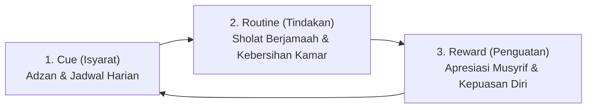

# P4-01-02: Fase Habituasi dan Pembentukan Karakter Santri (Tahun 1–2)

## Status Dokumen
* **Status**: 🌟 **A+ (Tervalidasi & Siap Diimplementasikan)**
* **Sub-Domain**: `04 Progression Framework / 01 Development Stages`
* **Penanggung Jawab Keilmuan**: Dewan Keilmuan TUMBUH (*Pakar Pedagogi Master Guru & Pakar Neurosains Perkembangan*)

---

## 1. Konseptualisasi Fase Habituasi

Fase Habituasi berlangsung pada pertengahan Tahun ke-1 hingga Tahun ke-2. Pada fase ini, santri telah berhasil melampaui kecemasan transisi awal dan mulai menginternalisasi rutinitas harian pesantren menjadi kebiasaan otomatis (*Automaticity & Habit Loop*).

---

## 2. Target Karakter & Pembiasaan Rutin (Habit Formation)

1. **Kedisiplinan Waktu (*Haritsun 'Ala Waqtih*)**: Bangun sebelum Subuh, hadir di masjid sebelum adzan selesai, dan tepat waktu masuk kelas diniyyah.
2. **Keteraturan Diri (*Munazhzham fi Syu'unih*)**: Kamar tidur rapi, jadwal piket terlaksana mandiri, dan lemari tertata rapi tanpa perlu diperiksa berulang kali.
3. **Pembentukan Rutinitas Belajar & Hafalan**: Konsistensi jam muraja'ah mandiri dan persiapan materi pelajaran sebelum kelas dimulai.

---

## 3. Dinamika Perkembangan Psikologis & Peer Group Dynamics

- **Pencarian Penerimaan Sebaya (*Peer Acceptance*)**: Santri mulai sangat dipengaruhi oleh dinamika kelompok teman kamar dan angkatan (*Group Identity*).
- **Mitigasi Klaster Negatif**: Musyrif membentuk norma kelompok positif melalui *Peer Support Groups* dan menyusun piket kamar yang heterogen untuk mencegah pembentukan klik (*geng*) yang memicu eksklusi sosial.

---

## 4. Peran Musyrif & Scaffolding Ratio (50%)

Pada Fase 2, peran Musyrif bergeser menjadi **Pengawas Rutinitas & Coach Penguatan Positif** dengan tingkat *Scaffolding* 50%:
- Mengurangi instruksi verbal langsung, digantikan dengan *Visual Schedules* dan *Checklist Mutabaah Mandiri*.
- Menerapkan penguatan positif PBIS (pujian kualitatif spesifik dan apresiasi portofolio adab harian).
- Memberikan konsekuensi logis restoratif (*Firm & Kind*) apabila terjadi pelanggaran rutinitas tanpa intimidasi.
