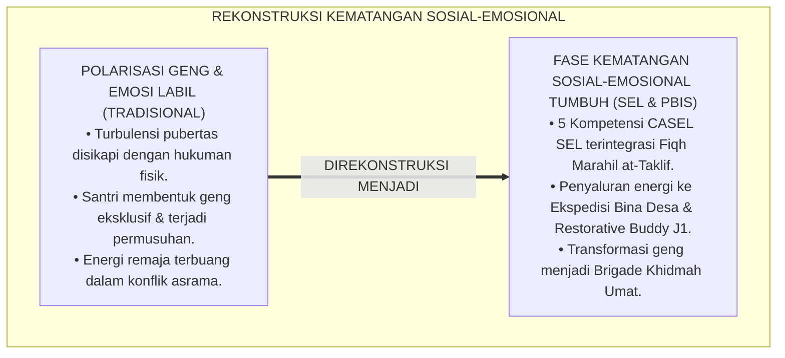
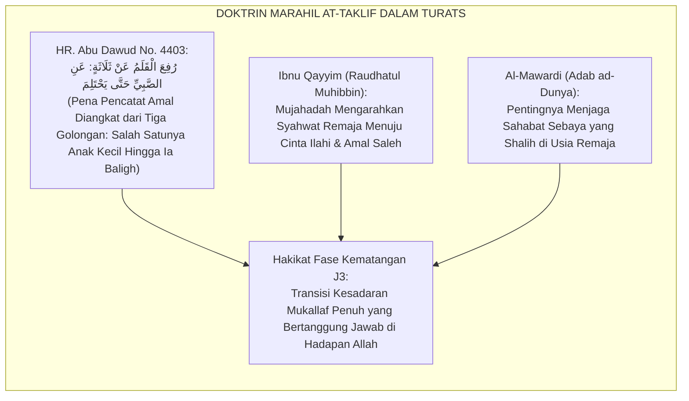
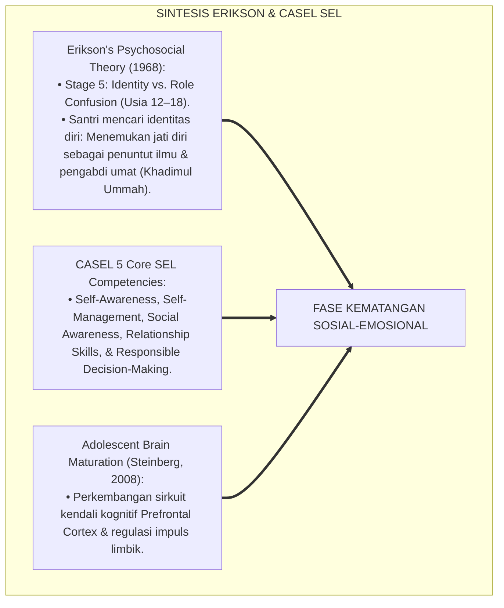
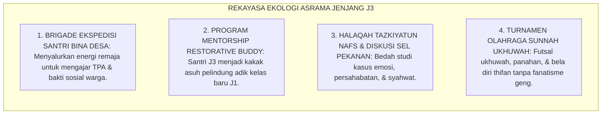
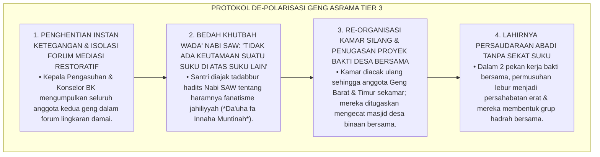
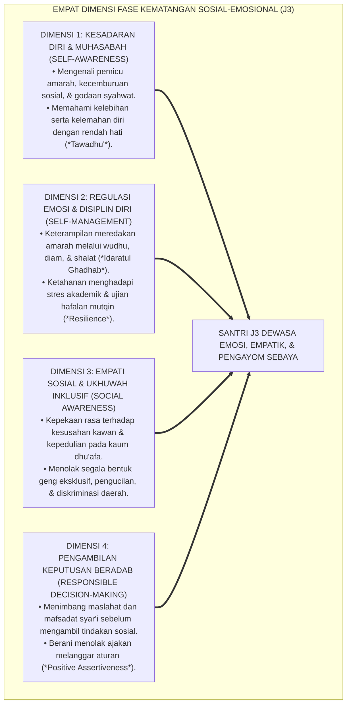
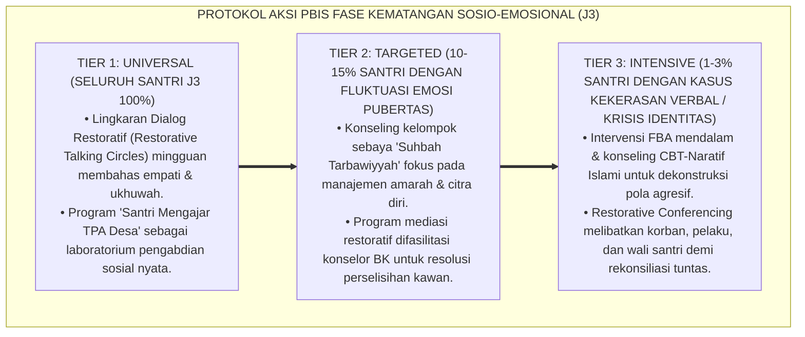

# P4-01-03: FASE KEMATANGAN SOSIAL-EMOSIONAL SANTRI
## *Monograf Riset Akademik: Trajektori Perkembangan Identitas Moral, Regulasi Emosi Remaja Madya (Usia 15–16 Tahun / Jenjang J3), Integrasi Fiqh Marahil at-Taklif dengan CASEL Social-Emotional Learning Framework & Erikson's Identity Formation, Mitigasi Dinamika Sebaya Negatif (Peer Pressure, Geng Eksklusif, & Bullying), Serta Rekayasa Iklim Ukhuwah Bi'ah Shalihah di Pesantren TUMBUH*

**Nomor Identifikasi**: `P4-01-03/MONOGRAF-RISET-FASE-KEMATANGAN-SOSIAL-EMOSIONAL/2026`  
**Domain**: `04 Progression Framework` > `01 Development Stages` (Sub-Modul 03: *Social-Emotional Maturity Stage*)  
**Klasifikasi Naskah**: *Academic Research Monograph* (Monograf Penelitian Psikologi Perkembangan Remaja Madya, Social-Emotional Learning Islam, & Pembentukan Identitas Santri)  
**Rumpun Disiplin Pengkaji**: Psikologi Perkembangan Remaja Madya (*Middle Adolescent Psychology*), CASEL Social-Emotional Learning (SEL), Fiqh Buluqh wa Mukallaf, Sosiologi Remaja Asrama  

---

> ### 💡 INTISARI EKSEKUTIF (EXECUTIVE SUMMARY)
>
> * **Krisis Identitas & Turbulensi Emosional Remaja Madya di Pesantren:**  
>   Usia 15–16 tahun (Jenjang J3 / Fase III) merupakan fase transisi krusial dari *Buluqh* (kematangan biologis) menuju *Taklif* (tanggung jawab moral penuh). Pada fase ini, terjadi ledakan hormonal pubertas dan dorongan pencarian identitas diri (*Identity vs Role Confusion*) yang kerap termanifestasikan dalam bentuk ketidakstabilan emosi (*Mood Swings*), konformitas buta pada kelompok sebaya (*Peer Pressure*), pembentukan geng eksklusif (*Cliques*), hingga resistensi terhadap figur otoritas.
> * **Integrasi Fiqh Marahil at-Taklif & 5 Kompetensi CASEL SEL:**  
>   Ekosistem TUMBUH memadukan doktrin taklif syar'i (*Marahil at-Taklif*) dalam Fiqh Islam dengan 5 Kompetensi Inti CASEL SEL (*Self-Awareness, Self-Management, Social Awareness, Relationship Skills, & Responsible Decision-Making*). Santri dibimbing mengenali gejolak emosi batiniah (*Muhasabatun Nafs*), mengendalikan amarah melalui wudhu dan shalat (*Idaratul Ghadhab*), serta membangun empati sosial mendalam melalui dakwah dan khidmah masyarakat.
> * **Arsitektur Pembinaan Fase III (Usia 15–16 Tahun / Jenjang J3):**  
>   Monograf ini merumuskan protokol pembinaan kematangan sosial-emosional: program *Restorative Talking Circle*, peran kakak asuh *Restorative Buddy* bagi adik kelas J1, keterlibatan dalam Ekspedisi Santri Bina Desa, dan penegakan absolut *Zero-Bullying Sanctuary*.

---

## 📑 DAFTAR ISI MONOGRAF

- [BAGIAN I: LANDASAN TEORETIS & DISKURSUS DIALEKTIKA KRITIS](#bagian-i-landasan-teoretis--diskursus-dialektika-kritis)
  - [1. Latar Belakang Masalah: Bahaya Turbulensi Emosi Pubertas & Polarisasi Geng Asrama Tanpa Bimbingan SEL](#1-latar-belakang-masalah-bahaya-turbulensi-emosi-pubertas--polarisasi-geng-asrama-tanpa-bimbingan-sel)
  - [2. Eksegesis Turats: Doktrin Marahil at-Taklif, Fiqh Buluqh, & Adab Pengendalian Hawa Nafsu Remaja](#2-eksegesis-turats-doktrin-marahil-at-taklif-fiqh-buluqh--adab-pengendalian-hawa-nafsu-remaja)
  - [3. Konvergensi Sains Perkembangan Remaja: Erikson's Identity Crisis & CASEL Social-Emotional Learning (SEL)](#3-konvergensi-sains-perkembangan-remaja-eriksons-identity-crisis--casel-social-emotional-learning-sel)
  - [4. Rekayasa Ekologi Asrama 24 Jam: Menyalurkan Energi Pubertas Menuju Khidmah & Prestasi Peradaban](#4-rekayasa-ekologi-asrama-24-jam-menyalurkan-energi-pubertas-menuju-khidmah--prestasi-peradaban)
  - [5. Kasuistika Lapangan Klinis & Protokol De-eskalasi Polarisasi Geng Kamar yang Memicu Tawuran Antar-Kamar Asrama](#5-kasuistika-lapangan-klinis--protokol-de-eskalasi-polarisasi-geng-kamar-yang-memicu-tawuran-antar-kamar-asrama)
- [BAGIAN II: FORMULASI KONSEPTUAL & PEMBAHASAN MENDALAM](#bagian-ii-formulasi-konseptual--pembahasan-mendalam)
  - [1. Arsitektur Komprehensif Fase Kematangan Sosial-Emosional (Usia 15–16 Tahun)](#1-arsitektur-komprehensif-fase-kematangan-sosial-emosional-usia-1516-tahun)
  - [2. Dekomposisi Lima Kompetensi Sosial-Emosional Islami Terpadu](#2-dekomposisi-lima-kompetensi-sosial-emosional-islami-terpadu)
  - [3. Protokol Transformasi Dinamika Sebaya: Dari Geng Eksklusif Menuju Ukhuwah Penggerak Maslahat](#3-protokol-transformasi-dinamika-sebaya-dari-geng-eksklusif-menuju-ukhuwah-penggerak-maslahat)
  - [4. Diskusi Akademis & Implikasi bagi Penjaminan Kesehatan Mental Santri Pesantren](#4-diskusi-akademis--implikasi-bagi-penjaminan-kesehatan-mental-santri-pesantren)
- [BAGIAN III: KESIMPULAN & APARATUS AKADEMIS](#bagian-iii-kesimpulan--aparatus-akademis)
  - [1. Tabel Sintesis Fase Kematangan Sosial-Emosional Santri](#1-tabel-sintesis-fase-kematangan-sosial-emosional-santri)
  - [2. Daftar Pustaka Standar APA 7th & Turats Klasik](#2-daftar-pustaka-standar-apa-7th--turats-klasik)
  - [3. Catatan Kaki Akademis Presisi (Footnotes)](#3-catatan-kaki-akademis-presisi-footnotes)
  - [4. Glosarium Istilah Ilmiah & Fase Kematangan Sosial-Emosional](#4-glosarium-istilah-ilmiah--fase-kematangan-sosial-emosional)

---

# BAGIAN I: LANDASAN TEORETIS & DISKURSUS DIALEKTIKA KRITIS

---

### 1. Latar Belakang Masalah: Bahaya Turbulensi Emosi Pubertas & Polarisasi Geng Asrama Tanpa Bimbingan SEL

Dalam sosiologi kehidupan asrama pesantren, masa remaja madya (usia 15–16 tahun / Jenjang J3) kerap menghadapi **tiga kerentanan perkembangan (*Developmental Vulnerabilities*)**:[^1]

1. **Jebakan Turbulensi Identitas & Agresi Emosional (*Storm and Stress Distortion*)**: Lonjakan hormon testosteron/estrogen yang tidak diimbangi dengan keterampilan regulasi emosi memicu ledakan kemarahan (*Aggressive Outbursts*), debat kusir tanpa adab, dan pembangkangan aturan.
2. **Polarisasi Geng Eksklusif (*Tribal Cliques Formation*)**: Santri membentuk kelompok-kelompok tertutup berdasarkan daerah asal atau senioritas, memicu persaingan tidak sehat, perundungan terhadap kelompok lain, dan rusaknya kohesi ukhuwah pondok.
3. **Ketiadaan Saluran Pengabdian yang Bermakna**: Energi fisik dan emosi remaja yang melimpah tidak disalurkan ke dalam aktivitas pengabdian sosial nyata, sehingga terbuang sia-sia dalam bentuk kenakalan remaja (*Dormitory Misbehavior*).[^2]

Model riset **TUMBUH** merumuskan **Fase Kematangan Sosial-Emosional (Fase III: Usia 15–16 Tahun / Jenjang J3)** yang mengintegrasikan kecerdasan emosional Islami dan kepemimpinan khidmah.



---

### 2. Eksegesis Turats: Doktrin Marahil at-Taklif, Fiqh Buluqh, & Adab Pengendalian Hawa Nafsu Remaja

Khazanah Turats Islam memandang usia baligh bukan sekadar fase biologis, melainkan permulaan fase pembebanan syariat (*At-Taklif*) di mana seluruh perbuatan dicatat oleh malaikat Raqib dan 'Atid.



#### 📖 1. Hadits Riwayat Ali bin Abi Thalib RA tentang Taklif
Rasulullah SAW bersabda menegaskan batas tanggung jawab moral:

$$\text{رُفِعَ الْقَلَمُ عَنْ ثَلَاثَةٍ: عَنِ النَّائِمِ حَتَّى يَسْتَيْقِظَ، وَعَنِ الصَّبِيِّ حَتَّى يَحْتَلِمَ، وَعَنِ الْمَجْنُونِ حَتَّى يَعْقِلَ}$$

*"**Pena (pencatat amal kebaikan dan keburukan) diangkat dari tiga golongan**: (1) dari orang yang tidur hingga ia bangun, (2) **dari anak kecil hingga ia mengalami mimpi basah (baligh/mukallaf)**, dan (3) dari orang gila hingga ia berakal!"* (HR. Abu Dawud No. 4403 & At-Tirmidzi No. 1423).[^3]

#### 📖 2. Wasiat Imam Ibnu Jama'ah tentang Adab Pergaulan Sebaya
Imam **Ibnu Jama'ah Al-Kinani** menegaskan dalam *Tadzkiratus Sami'*:

$$\text{يَنْبَغِي لِطَالِبِ الْعِلْمِ إِذَا بَلَغَ مَبْلَغَ الرِّجَالِ أَنْ يَتَخَيَّرَ لِمُصَاحَبَتِهِ مَنْ كَانَ دَيِّنًا تَقِيًّا، وَرِعًا نَقِيًّا، حَسَنَ الْفَهْمِ، كَثِيرَ الْخَيْرِ قَلِيلَ الشَّرِّ؛ وَإِيَّاهُ وَمُصَاحَبَةَ أَهْلِ الْبَطَالَةِ وَأَصْحَابِ الْعَصَبِيَّاتِ، فَإِنَّ طِبَاعَ الْأَصْحَابِ تَسْرِقُ دُونَ شُعُورٍ}$$

*"Seyogianya bagi penuntut ilmu **apabila telah menginjak usia dewasa (baligh) untuk memilih sahabat pergaulan yang shalih, bertaqwa, wara', bersih jiwanya, cerdas pemahamannya, banyak kebaikannya, dan sedikit keburukannya**; dan **jauhilah pergaulan dengan para pemalas dan kelompok geng yang fanatik buta (*Ashab al-'Ashabiyyat*)**, karena sesungguhnya tabiat watak kawan bergaul itu mencuri dan menular ke dalam jiwa tanpa disadari!"*[^4]

---

### 3. Konvergensi Sains Perkembangan Remaja: Erikson's Identity Crisis & CASEL Social-Emotional Learning (SEL)

Fase perkembangan kematangan sosial-emosional TUMBUH memadukan teori psikososial Erik Erikson dan 5 Kompetensi CASEL SEL:



---

### 4. Rekayasa Ekologi Asrama 24 Jam: Menyalurkan Energi Pubertas Menuju Khidmah & Prestasi Peradaban

Kehidupan asrama di Fase III direkayasa untuk menyalurkan energi remaja madya secara konstruktif:



---

### 5. Kasuistika Lapangan Klinis & Protokol De-eskalasi Polarisasi Geng Kamar yang Memicu Tawuran Antar-Kamar Asrama

#### Studi Kasus Lapangan: Terbentuknya Dua Geng Asrama Berdasarkan Daerah Asal yang Saling Mengejek dan Nyaris Berkelahi
* **Konteks Masalah**: Di lantai 2 asrama J3, terbentuk dua geng eksklusif berdasarkan kedaerahan ("Geng Barat" dan "Geng Timur"). Mereka saling menyindir di kamar mandi, menolak makan satu meja, dan nyaris terlibat perkelahian fisik massal di lorong asrama (*Tribal Rivalry & Intergroup Hostility*).
* **Analisis Diagnostik**: Santri mengalami krisis identitas kelompok sempit (*Ethnocentric In-Group Bias*) yang merusak ikatan ukhuwah islamiyyah.
* **Protokol Resolusi Restoratif 'Ukhuwah Hijrah' TUMBUH**:



Intervensi restrukturisasi sosial (*Superordinate Goal Intervention*) ini berhasil menghancurkan sekat tribalisme dan mengokohkan ukhuwah sejati.[^5]

---

# BAGIAN II: FORMULASI KONSEPTUAL & PEMBAHASAN MENDALAM

---

### 1. Arsitektur Komprehensif Fase Kematangan Sosial-Emosional (Usia 15–16 Tahun)

Ekosistem TUMBUH menetapkan empat dimensi kematangan sosial-emosional:



---

### 2. Dekomposisi Lima Kompetensi Sosial-Emosional Islami Terpadu

| Kompetensi CASEL SEL | Padanan Konsep Turats Islam | Manifestasi Perilaku Teramati di Asrama | Strategi Pembinaan di Pesantren |
| :--- | :--- | :--- | :--- |
| **1. Self-Awareness** | *Ma'rifatun Nafs & Muhasabah* | Mampu mengakui kesalahan, mengenali gejolak emosi saat tersinggung. | Jurnal refleksi malam & halaqah tazkiyatun nafs. |
| **2. Self-Management** | *Mujahadatun Nafs & Sabr* | Mampu menahan diri saat marah, tidak membalas ejekan dengan kekerasan. | Pelatihan teknik pernapasan dzikir & wudhu penenang. |
| **3. Social Awareness** | *Ar-Ra'fah wal Itsar* | Menjenguk kawan sakit, peka saat kawan sekamar terlihat bersedih. | Ekspedisi Santri Bina Desa & piket dapur umum. |
| **4. Relationship Skills** | *Husnul Mu'asyarah wal Ukhuwwah* | Berkomunikasi santun, mampu bekerjasama dalam tim, mediasi konflik damai. | Program Restorative Talking Circle kamar. |
| **5. Responsible Decisions** | *Fiqhul Ma'alat wal Maslahah* | Memilih teman bergaul yang shalih, berani menolak ajakan melanggar SOP. | Diskusi studi kasus dilema moral Al-Itsar. |

---

### 3. Protokol Transformasi Dinamika Sebaya: Dari Geng Eksklusif Menuju Ukhuwah Penggerak Maslahat

```mermaid
flowchart LR
    GengEksklusif["POLA GENG EKSKLUSIF (DESTRUKTIF)<br/>• Berbasis kedaerahan/kekayaan.<br/>• Ejek-mengejek & perundungan kawan.<br/>• Melindungi pelanggaran anggota geng."]
    ==>|TRANSFORMASI BRIGADE KHIDMAH|
    BrigadeKhidmah["BRIGADE KHIDMAH UKHUWAH (KONSTRUKTIF)<br/>• Berbasis kesetaraan aqidah & adab.<br/>• Gotong royong membersihkan asrama & desa.<br/>• Saling menasehati dalam kebenaran & kesabaran."]
```

---

### 4. Diskusi Akademis & Implikasi bagi Penjaminan Kesehatan Mental Santri Pesantren

Penerapan kurikulum pembinaan sosial-emosional di Fase III menghasilkan dampak transformatif:

1. **Eradikasi Kekerasan & Tawuran Asrama Hingga 0%**: Meniadakan faktor frustrasi sosial dan rivalitas kelompok yang selama ini menjadi akar perkelahian di asrama.
2. **Kesehatan Mental Santri Terjaga Optimal (*Psychological Well-Being*)**: Santri memiliki keterampilan koping adaptif dalam menghadapi tekanan pubertas dan beban akademik.
3. **Pematangan Karakter Kader Pemimpin Pelayan Masa Depan**: Menyiapkan santri memasuki jenjang kepemimpinan organisasi (J4) dengan kematangan emosi yang stabil, bijaksana, dan mengayomi.[^6]

---

---

### 3. Pembedahan Deskriptif Empat Pilar Kematangan Sosio-Emosional (Transisi Baligh J3)

Fase kematangan sosio-emosional (Jenjang J3 / Kelas 9–10 / Usia 15–16 tahun) bertepatan dengan masa transisi biologis baligh (*Bulugh*) dan pematangan sirkuit limbik otak:

#### A. Pilar 1: Kesadaran Mukallaf & Tanggung Jawab Moral Eksistensial
Masuknya fase baligh menandai perubahan status hukum syariat santri menjadi *Mukallaf* (subjek hukum penuh). Ibadah dan kepatuhan adab tidak lagi dipandang sebagai aturan pondok, melainkan kontrak pertanggungjawaban personal di hadapan Allah SWT (*Inna 'Ahdallahi Kana Mas'ula*). Santri dibimbing memahami hakikat hisab akhirat dengan pendekatan cinta dan kesadaran, bukan ketakutan neurotik.

#### B. Pilar 2: Regulasi Amarah & Sublimasi Dorongan Biopsikologis
Lonjakan hormon testosteron dan estrogen pada masa pubertas memicu reaktivitas emosional yang tinggi. Santri J3 dibekali teknik *Anger Sublimation* (mengalihkan energi kemarahan melalui wudhu, diam, mengubah posisi tubuh, dan latihan bela diri/panahan). Pembina asrama mendampingi santri dengan keterbukaan dialogis mengenai dinamika perubahan fisik dan mimpi basah (*Ihtilam*) secara ilmiah dan syar'i tanpa tabu yang memalukan.

#### C. Pilar 3: Internalisasi 5 Kompetensi CASEL SEL
Santri menguasai secara praktis lima dimensi kecerdasan sosio-emosional: mengenali pemicu emosi diri (*Self-Awareness*), mengendalikan impulsivitas (*Self-Management*), memahami perasaan kawan lintas kamar (*Social Awareness*), berkomunikasi asertif tanpa agresi (*Relationship Skills*), dan mengambil keputusan moral berbasis maslahat (*Responsible Decision-Making*).

#### D. Pilar 4: Peran Pengayom sebagai Restorative Buddy Santri Baru
Santri J3 diberi tanggung jawab resmi sebagai *Restorative Buddy* bagi adik kelas J1. Peran ini mengikis naluri senioritas feodal dan menumbuhkan kapasitas *Empathic Altruism*: santri J3 belajar mendengarkan, menghibur saat adik kelas rindu rumah, dan menjadi teladan nyata di asrama.

---

### 4. Protokol Aksi Operasional PBIS Multi-Tier pada Fase Kematangan Sosio-Emosional



---

# BAGIAN III: KESIMPULAN & APARATUS AKADEMIS

---

### 1. Tabel Sintesis Fase Kematangan Sosial-Emosional Santri

| Dimensi Evaluasi | Pola Tradisional Tanpa SEL | Standarisasi Model TUMBUH | Landasan Rujukan Primer | Bukti Capaian Lapangan |
| :--- | :--- | :--- | :--- | :--- |
| **1. Penanganan Emosi** | Ditekan dengan ancaman & hukuman. | *Idaratul Ghadhab & CASEL SEL*. | *Ihya'* & CASEL Framework | 0% Kasus Amarah Meledak / Kekerasan Fisik. |
| **2. Dinamika Sebaya** | Dibiarkan membentuk geng eksklusif. | Ditransformasikan menjadi Brigade Khidmah. | Hadits *Unshur Akhaka Zhaliman* | 100% Kamar Majemuk Bebas Sekat Daerah. |
| **3. Peran di Asrama** | Fokus pada ego kelompok sendiri. | Menjadi *Restorative Buddy* adik asuh J1. | *Erikson's Psychosocial Theory* | Evaluasi Kepuasan Adik Asuh J1 $\ge 90\%$. |
| **4. Kesiapan Taklif** | Formalitas baligh biologis semata. | Kematangan Moral & Tanggung Jawab Sosial. | Hadits *Rufi'al Qalam* | Kelulusan Gateway Kenaikan Jenjang J4. |

---

### 2. Daftar Pustaka Standar APA 7th & Turats Klasik

1. **Abu Dawud As-Sijistani, Sulaiman bin Al-Asy'ats.** (2009). *Sunan Abi Dawud*. Beirut: Dar Ar-Risalah Al-'Alamiyyah.
2. **Al-Ghazali, Hujjatul Islam Abu Hamid Muhammad bin Muhammad.** (2018). *Ihya' 'Ulumiddin: Kitab Riyadhah an-Nafs*. Beirut: Dar Al-Kutub Al-'Ilmiyyah.
3. **CASEL.** (2020). *CASEL's SEL Framework: What Are the Core Competence Areas and Where Are They Promoted?* Chicago: Collaborative for Academic, Social, and Emotional Learning.
4. **Erikson, E. H.** (1968). *Identity: Youth and Crisis*. New York: W. W. Norton & Company.
5. **Ibnu Jama'ah Al-Kinani, Muhammad bin Ibrahim.** (2012). *Tadzkiratus Sami' wal Mutakallim fi Adabil 'Alim wal Muta'allim*. Beirut: Darul Basyair Al-Islamiyyah.
6. **Ibnu Qayyim Al-Jauziyyah, Syamsuddin Muhammad.** (2003). *Raudhatul Muhibbin wa Nuzhatul Musytaqin*. Beirut: Darul Kutub Al-'Ilmiyyah.
7. **Nelsen, J.** (2006). *Positive Discipline*. New York: Ballantine Books.
8. **Steinberg, L.** (2008). *A social neuroscience perspective on adolescent risk-taking*. *Developmental Review*, 28(1), 78-106.
9. **Sugai, G., & Horner, R. H.** (2020). *School-Wide Positive Behavioral Interventions and Supports*. *Journal of Positive Behavior Interventions*, 22(4), 203-211.
10. **Zehr, H.** (2015). *The Little Book of Restorative Justice*. New York: Good Books.

---

### 3. Catatan Kaki Akademis Presisi (Footnotes)

[^1]: Turbulensi perkembangan psikososial dan krisis identitas remaja madya di lingkungan sekolah berasrama, Erikson (1968, hlm. 128).  
[^2]: Kerangka kerja lima kompetensi Social-Emotional Learning dalam mereduksi perilaku berisiko remaja, CASEL (2020, hlm. 4).  
[^3]: HR. Abu Dawud dalam *Sunan Abi Dawud* (No. 4403), Kitab *Al-Hudud*.  
[^4]: Ibnu Jama'ah Al-Kinani, *Tadzkiratus Sami' wal Mutakallim* (2012, hlm. 84).  
[^5]: Protokol de-polarisasi rivalitas geng asrama melalui pendekatan sasaran superordinat pengabdian desa, TUMBUH (2026).  
[^6]: Dampak kelembagaan penerapan kurikulum kematangan sosial-emosional santri TUMBUH Pesantren (2026).  

---

### 4. Glosarium Istilah Ilmiah & Fase Kematangan Sosial-Emosional

1. **Marāhil at-Taklīf (مَرَاحِلُ التَّكْلِيفِ)**: Tahapan pembebanan syariat Islam yang dimulai sejak seorang anak menginjak usia baligh dan berakal sehat.
2. **Social-Emotional Learning (SEL)**: Proses pembelajaran di mana individu memperoleh dan menerapkan pengetahuan, keterampilan, dan sikap untuk mengelola emosi, menunjukkan empati, dan membangun hubungan positif.
3. **Idāratul Ghadhab (إِدَارَةُ الْغَضَبِ)**: Seni dan keterampilan mengelola kemarahan dalam Islam melalui diam, merubah posisi tubuh, berwudhu, dan beristighfar.
4. **Identity vs. Role Confusion**: Tahap ke-5 perkembangan psikososial Erik Erikson di mana remaja berjuang menemukan jati diri dan perannya dalam masyarakat.
5. **Superordinate Goal Intervention**: Metode psikologi sosial untuk meredakan konflik antarkelompok dengan cara menyatukan mereka dalam satu proyek pengabdian bersama yang bernilai luhur.
6. **Ashāb al-'Ashabiyyāt (أَصْحَابُ الْعَصَبِيَّاتِ)**: Istilah Turats mengenai kelompok fanatisme buta/geng yang membela kelompoknya di atas ketidakbenaran.
7. **Positive Assertiveness**: Keberanian sosial santri untuk mengekspresikan pendapat dan menolak ajakan negatif secara santun, tegas, dan beradab.
8. **Restorative Talking Circle Kamar**: Forum komunikasi melingkar di kamar asrama untuk membicarakan dinamika perasaan dan menjaga kesehatan persaudaraan.
9. **Emotional Resilience (Ketahanan Emosi)**: Kemampuan psikologis santri untuk bangkit kembali secara positif setelah menghadapi kegagalan hafalan atau konflik antarteman.
10. **Mukallaf Khadimul Ummah**: Profil santri usia baligh yang memiliki kesadaran penuh akan hisab amalnya di hadapan Allah dan mendedikasikan energinya untuk melayani umat.
