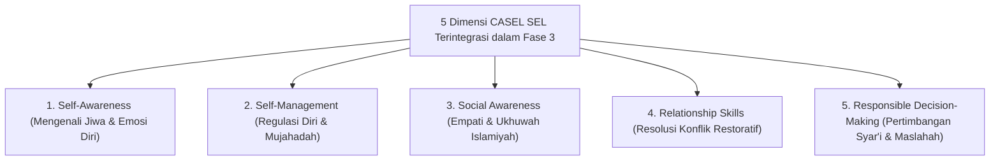

# P4-01-03: Fase Kematangan Sosial-Emosional Santri (Tahun 2–3)

## Status Dokumen
* **Status**: 🌟 **A+ (Tervalidasi & Siap Diimplementasikan)**
* **Sub-Domain**: `04 Progression Framework / 01 Development Stages`
* **Penanggung Jawab Keilmuan**: Dewan Keilmuan TUMBUH (*Pakar Bimbingan Konseling & Pakar Psikologi Sosial Santri*)

---

## 1. Konseptualisasi Kematangan Sosial-Emosional

Fase 3 berlangsung pada Tahun ke-2 hingga Tahun ke-3. Pada fase ini, fokus pembinaan bergeser dari sekadar kedisiplinan fisik luar menuju kedalaman regulasi emosi internal, kesadaran moral (*Moral Reasoning*), dan kematangan relasi sosial sesuai kerangka **CASEL Social-Emotional Learning (SEL)** dan **Tazkiyatun Nafs**.

---

## 2. Internalisasi Nilai & Transisi Motivasi (*Self-Determination Theory*)

- **Pergeseran Motivasi**: Motivasi ibadah dan pembiasaan adab bergeser dari *External Regulation* (takut denda/teguran) menuju *Identified & Integrated Regulation* (kesadaran bahwa adab adalah kebutuhan penyucian jiwa dan bentuk *Mahabbah* kepada Allah SWT).
- **Pengembangan Empati & Resolusi Konflik**: Santri dilatih untuk menyelesaikan perbedaan pendapat dengan dialog empati tanpa kekerasan (*Non-Violent Communication*).

---

## 3. Penanganan Konflik Sebaya Berbasis Restorative Justice

Apabila terjadi perselisihan antar teman di asrama pada Fase 3:
1. **Dilarang Penggunaan Hukuman Fisik / Malu Publik**: Musyrif tidak menjadi penentu hukuman, melainkan memfasilitasi *Restorative Circle*.
2. **Restorative Circle Process**:
   - Meminta pihak yang berselisih menceritakan kronologi dan perasaan masing-masing.
   - Mengidentifikasi dampak emosional (*Who was hurt and how?*).
   - Merumuskan kesepakatan pemulihan ukhuwah (*Repair Plan*) secara bersama-sama.

---

## 4. Peran Musyrif & Scaffolding Ratio (20%)

Pada Fase 3, peran Musyrif bergeser menjadi **Fasilitator Diskusi & Mentor Konseling Emosional** dengan tingkat *Scaffolding* 20%:
- Bertindak sebagai pendengar aktif (*Active Listener*) dalam sesi refleksi malam.
- Membantu santri melakukan *Cognitive Reframing* saat menghadapi tekanan ujian atau kejenuhan hafalan.
- Memberikan ruang otonomi terkontrol bagi santri untuk mengelola kegiatan kelompok secara mandiri.
