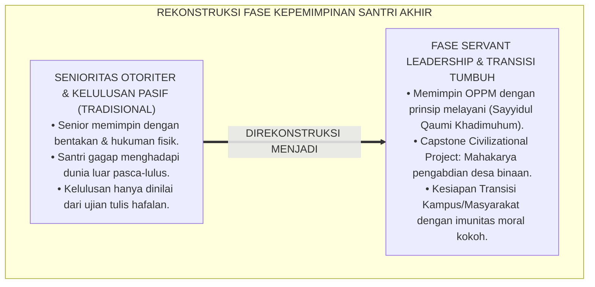
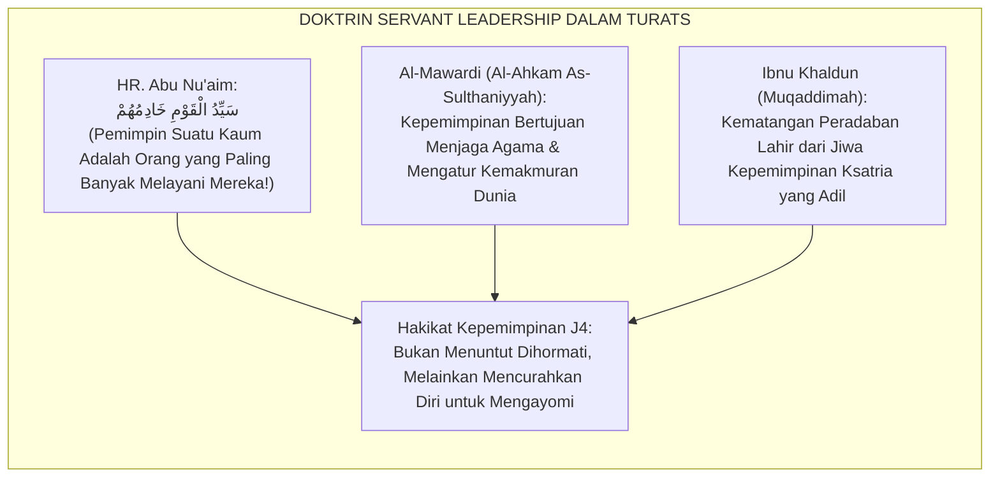
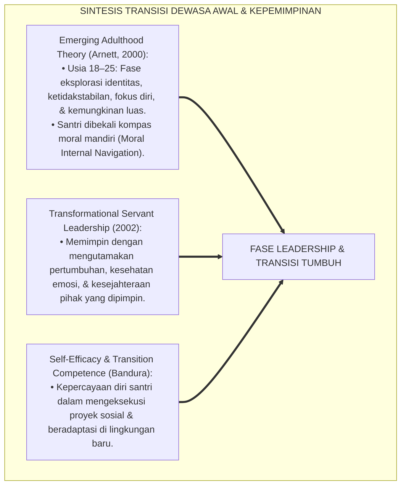
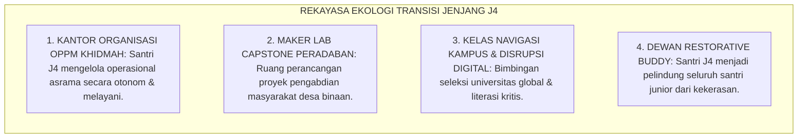
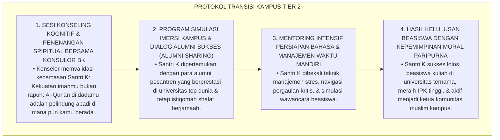
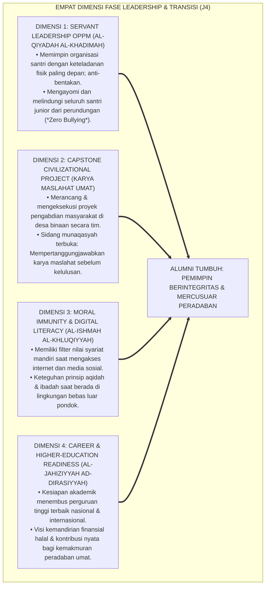
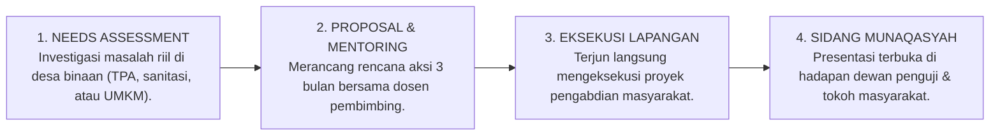
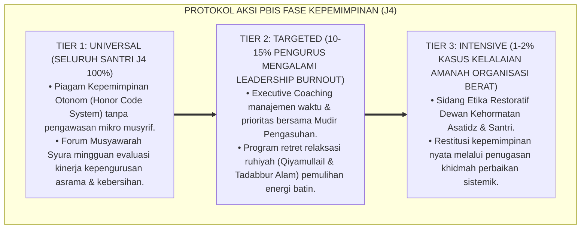

# P4-01-04: FASE LEADERSHIP DAN TRANSISI POST-PESANTREN SANTRI
## *Monograf Riset Akademik: Trajektori Kepemimpinan Pelayan (Servant Leadership), Kematangan Mandiri Usia 17–18 Tahun (Fase IV: Jenjang J4), Integrasi Doktrin Khilafah & Imarah fil Ardh dengan Emerging Adulthood Theory (Arnett) & Social-Emotional Readiness, Desain Capstone Civilizational Project, Serta Protokol Kesiapan Transisi Kampus/Masyarakat di Pesantren TUMBUH*

**Nomor Identifikasi**: `P4-01-04/MONOGRAF-RISET-FASE-LEADERSHIP-TRANSISI-POST-PESANTREN/2026`  
**Domain**: `04 Progression Framework` > `01 Development Stages` (Sub-Modul 04: *Leadership & Post-Pesantren Transition Stage*)  
**Klasifikasi Naskah**: *Academic Research Monograph* (Monograf Penelitian Teori Transisi Dewasa Awal, Servant Leadership Islam, & Desain Kesiapan Alumni)  
**Rumpun Disiplin Pengkaji**: Psikologi Dewasa Awal (*Emerging Adulthood Psychology*), Kepemimpinan Islam & Fiqh Siyasah, Manajemen Transisi Karir & Pendidikan Tinggi, Evaluasi Capstone Project  

---

> ### 💡 INTISARI EKSEKUTIF (EXECUTIVE SUMMARY)
>
> * **Krisis Disorientasi & Kerentanan Alumni Baru Pasca-Pesantren (*Post-Pesantren Shock*):**  
>   Banyak santri kelas akhir (usia 17–18 tahun / Jenjang J4) mengalami disorientasi tujuan hidup (*Purpose Disorientation*) dan gegar budaya saat lulus dari asrama yang serba terjadwal menuju dunia kampus/masyarakat yang serba bebas. Tanpa pembekalan kepemimpinan mandiri dan navigasi transisi yang matang, lulusan pesantren rentan mengalami krisis integritas moral (*Moral Compromise*) di lingkungan baru.
> * **Integrasi Doktrin Imarah fil Ardh & Emerging Adulthood Theory Jeffrey Arnett:**  
>   Ekosistem TUMBUH memadukan doktrin kekhalifahan memakmurkan bumi (*'Imārah fil Ardh*) dalam khazanah Turats (*Al-Ahkam As-Sulthaniyyah* Imam Al-Mawardi dan *Muqaddimah* Ibnu Khaldun) dengan teori *Emerging Adulthood* Jeffrey Jensen Arnett. Santri J4 ditempa bukan lagi sebagai "objek yang diawasi", melainkan sebagai **subjek pemimpin pelayan (*Servant Leader*)** yang mengelola organisasi santri (OPPM), mengayomi seluruh adik kelas, dan mengeksekusi proyek pengabdian peradaban (*Capstone Civilizational Project*).
> * **Arsitektur Pembinaan Fase IV (Usia 17–18 Tahun / Jenjang J4):**  
>   Monograf ini merumuskan etape transisi paripurna: kepemimpinan anti-feodal, sidang munaqasyah karya pengabdian masyarakat kelulusan, pembekalan literasi digital kritis, dan sertifikasi kesiapan alumni (*Graduation Readiness Check*) yang menjamin alumni siap menjadi mercusuar peradaban di mana pun berada.

---

## 📑 DAFTAR ISI MONOGRAF

- [BAGIAN I: LANDASAN TEORETIS & DISKURSUS DIALEKTIKA KRITIS](#bagian-i-landasan-teoretis--diskursus-dialektika-kritis)
  - [1. Latar Belakang Masalah: Bahaya Gegar Budaya Pasca-Pesantren & Feodalisme Pengurus Senior](#1-latar-belakang-masalah-bahaya-gegar-budaya-pasca-pesantren--feodalisme-pengurus-senior)
  - [2. Eksegesis Turats: Doktrin Imarah fil Ardh, Qiyadah Nabawiyyah, & Wasiat Salaf Menjelang Kemandirian Murid](#2-eksegesis-turats-doktrin-imarah-fil-ardh-qiyadah-nabawiyyah--wasiat-salaf-menjelang-kemandirian-murid)
  - [3. Konvergensi Sains Perkembangan: Emerging Adulthood Theory (Arnett) & Transformational Servant Leadership](#3-konvergensi-sains-perkembangan-emerging-adulthood-theory-arnett--transformational-servant-leadership)
  - [4. Rekayasa Ekologi Transisi 24 Jam: Dari Kehidupan Asrama Terpimpin Menuju Kedaulatan Moral Mandiri](#4-rekayasa-ekologi-transisi-24-jam-dari-kehidupan-asrama-terpimpin-menuju-kedaulatan-moral-mandiri)
  - [5. Kasuistika Lapangan Klinis & Protokol Pendampingan Santri J4 yang Cemas Menghadapi Seleksi Perguruan Tinggi & Kehidupan Luar Pondok](#5-kasuistika-lapangan-klinis--protokol-pendampingan-santri-j4-yang-cemas-menghadapi-seleksi-perguruan-tinggi--kehidupan-luar-pondok)
- [BAGIAN II: FORMULASI KONSEPTUAL & PEMBAHASAN MENDALAM](#bagian-ii-formulasi-konseptual--pembahasan-mendalam)
  - [1. Arsitektur Komprehensif Fase Leadership & Transisi Post-Pesantren (Usia 17–18 Tahun)](#1-arsitektur-komprehensif-fase-leadership--transisi-post-pesantren-usia-1718-tahun)
  - [2. Dekomposisi Tiga Pilar Kematangan Fase IV: Kepemimpinan Pelayan OPPM, Karya Capstone Project, & Imunitas Moral Kampus](#2-dekomposisi-tiga-pilar-kematangan-fase-iv-kepemimpinan-pelayan-oppm-karya-capstone-project--imunitas-moral-kampus)
  - [3. Protokol Capstone Civilizational Project & Sidang Munaqasyah Pengabdian Kelulusan](#3-protokol-capstone-civilizational-project--sidang-munaqasyah-pengabdian-kelulusan)
  - [4. Diskusi Akademis & Implikasi bagi Daya Saing Global serta Keberlanjutan Dakwah Alumni](#4-diskusi-akademis--implikasi-bagi-daya-saing-global-serta-keberlanjutan-dakwah-alumni)
- [BAGIAN III: KESIMPULAN & APARATUS AKADEMIS](#bagian-iii-kesimpulan--aparatus-akademis)
  - [1. Tabel Sintesis Fase Leadership & Transisi Post-Pesantren Santri](#1-tabel-sintesis-fase-leadership--transisi-post-pesantren-santri)
  - [2. Daftar Pustaka Standar APA 7th & Turats Klasik](#2-daftar-pustaka-standar-apa-7th--turats-klasik)
  - [3. Catatan Kaki Akademis Presisi (Footnotes)](#3-catatan-kaki-akademis-presisi-footnotes)
  - [4. Glosarium Istilah Ilmiah & Fase Transisi Kepemimpinan](#4-glosarium-istilah-ilmiah--fase-transisi-kepemimpinan)

---

# BAGIAN I: LANDASAN TEORETIS & DISKURSUS DIALEKTIKA KRITIS

---

### 1. Latar Belakang Masalah: Bahaya Gegar Budaya Pasca-Pesantren & Feodalisme Pengurus Senior

Pada fase akhir pendidikan pesantren (usia 17–18 tahun / Jenjang J4), kerap timbul **tiga paradoks transisi (*Transition Paradoxes*)**:[^1]

1. **Jebakan Feodalisme Kekuasaan Senior (*Seniority Power Abuse Trap*)**: Santri kelas 12 yang menjadi pengurus organisasi santri mengadopsi gaya kepemimpinan otoriter yang suka membentak, mendisiplinkan dengan kekerasan fisik, dan mengeksploitasi santri junior.
2. **Ketiadaan Pembekalan Navigasi Dunia Luar (*Real-World Navigation Deficit*)**: Santri hanya dilatih hidup di dalam "lingkungan steril" pesantren, sehingga ketika menghadapi lingkungan kampus sekuler, disrupsi digital, dan kebebasan pergaulan luar pondok, santri mengalami gegar budaya akut (*Culture Shock*).
3. **Kelesuan Visi Pengabdian Peradaban**: Menjelang kelulusan, santri hanya sibuk memikirkan nilai ujian tulis nasional tanpa memiliki karya nyata pengabdian masyarakat (*Civilizational Contribution*) yang membuktikan kebermanfaatan ilmunya.[^2]

Model riset **TUMBUH** merumuskan **Fase Leadership & Transisi Post-Pesantren (Fase IV: Usia 17–18 Tahun / Jenjang J4)** yang mematangkan kepemimpinan pelayan dan membekali santri menjadi agen transformasi peradaban.

---

### 2. Eksegesis Turats: Doktrin Imarah fil Ardh, Qiyadah Nabawiyyah, & Wasiat Salaf Menjelang Kemandirian Murid

Khazanah Turats meletakkan kepemimpinan sebagai amanah pengayoman (*Ri'āyah*) dan pemakmuran bumi (*'Imārah fil Ardh*) demi tegaknya keadilan dan kemaslahatan seluruh umat manusia.

#### 📖 1. Kaidah Agung Kepemimpinan Pelayan Nabawi
Rasulullah SAW bersabda menegaskan hakikat pemimpin sejati:

$$\text{سَيِّدُ الْقَوْمِ خَادِمُهُمْ فِي السَّفَرِ، فَمَنْ سَبَقَهُمْ بِخِدْمَةٍ لَمْ يَسْبِقُوهُ بِعَمَلٍ إِلَّا الشَّهَادَةَ}$$

*"**Pemimpin suatu kaum adalah orang yang melayani mereka (*Khādimuhum*) di dalam perjalanan**; maka barangsiapa yang mendahului mereka dalam berkhidmah melayani, **tidak ada satu pun amalan yang dapat menandingi keutamaannya melainkan mati syahid di jalan Allah!**"* (HR. Abu Nu'aim dalam *Hilyatul Auliya'* Jilid 2, hlm. 147 & Al-Baihaqi).[^3]

#### 📖 2. Wasiat Imam Al-Mawardi tentang Karakter Pemimpin Peradaban
Imam **Al-Mawardi** menegaskan dalam *Adab ad-Dunya wad-Din*:

$$\text{إِنَّ الرِّئَاسَةَ لَا تَثْبُتُ بِالْقَهْرِ وَالِاسْتِطَالَةِ، وَإِنَّمَا تَثْبُتُ بِالْعَدْلِ وَالْإِحْسَانِ وَاحْتِمَالِ الْأَثْقَالِ عَنِ الضُّعَفَاءِ؛ فَمَنْ قَادَ النَّاسَ بِسَيْفِ الْكِبْرِ انْفَضُّوا عَنْهُ، وَمَنْ قَادَهُمْ بِبِسَاطِ الرَّحْمَةِ وَالْخِدْمَةِ مَلَكَ قُلُوبَهُمْ وَانْقَادُوا لَهُ طَوْعًا}$$

*"Sesungguhnya **kepemimpinan sejati tidak akan pernah tegak dengan paksaan dan kesombongan kekuasaan, melainkan tegak dengan keadilan, perbuatan ihsan, dan kesediaan memikul beban penderitaan kaum yang lemah**; maka barangsiapa yang memimpin manusia dengan pedang kesombongan mereka akan lari meninggalkannya, **dan barangsiapa yang memimpin mereka dengan hamparan kasih sayang dan pelayanan tulus, ia akan merajai hati mereka dan mereka akan mengikutinya dengan penuh kerelaan!**"*[^4]

---

### 3. Konvergensi Sains Perkembangan: Emerging Adulthood Theory (Arnett) & Transformational Servant Leadership

Fase leadership dan transisi TUMBUH memadukan teori *Emerging Adulthood* Jeffrey Arnett dan *Servant Leadership* Robert Greenleaf:

---

### 4. Rekayasa Ekologi Transisi 24 Jam: Dari Kehidupan Asrama Terpimpin Menuju Kedaulatan Moral Mandiri

Lingkungan asrama di Fase IV diorganisasikan menyerupai miniatur kepemimpinan masyarakat mandiri:

---

### 5. Kasuistika Lapangan Klinis & Protokol Pendampingan Santri J4 yang Cemas Menghadapi Seleksi Perguruan Tinggi & Kehidupan Luar Pondok

#### Studi Kasus Lapangan: Santri J4 Juara Hafalan Mengalami Serangan Panik Menjelang Ujian Masuk Perguruan Tinggi Luar Negeri
* **Konteks Masalah**: Santri K (17 tahun, Jenjang J4, hafizh 30 juz mutqin) mengalami serangan panik (*Panic Attack*), insomnia, dan menangis di kamar menjelang seleksi beasiswa kuliah luar negeri. Ia merasa sangat takut tidak mampu beradaptasi dengan pergaulan bebas di luar pondok (*Transition Anxiety & Anticipatory Stress*).
* **Analisis Diagnostik**: Santri K mengalami kecemasan antisipatoris akibat *Sheltered Environment Dependency* (terbiasa dengan lingkungan protektif pesantren dan belum percaya diri dengan imunitas moral dirinya).
* **Protokol Penguatan Efikasi Diri & Simulasi Lingkungan Luar TUMBUH**:

Intervensi penguatan efikasi diri (*Self-Efficacy Empowerment*) ini mengubah ketakutan transisi menjadi kesiapan mental memimpin dakwah di panggung global.[^5]

---

# BAGIAN II: FORMULASI KONSEPTUAL & PEMBAHASAN MENDALAM

---

### 1. Arsitektur Komprehensif Fase Leadership & Transisi Post-Pesantren (Usia 17–18 Tahun)

Ekosistem TUMBUH menetapkan empat dimensi kematangan kepemimpinan transisi:

---

### 2. Dekomposisi Tiga Pilar Kematangan Fase IV: Kepemimpinan Pelayan OPPM, Karya Capstone Project, & Imunitas Moral Kampus

| Pilar Kematangan J4 | Fokus Pembinaan Utama | Indikator Keberhasilan Terverifikasi | Instrumen Evaluasi Kinerja |
| :--- | :--- | :--- | :--- |
| **1. Kepemimpinan Pelayan OPPM** | Memimpin roda organisasi santri tanpa kekerasan, melindungi adik kelas, dan melayani. | 0% kasus perpeloncoan; kepuasan santri junior atas pengurus $\ge 90\%$. | Evaluasi 360 Derajat Kepemimpinan OPPM. |
| **2. Capstone Civilizational Project** | Menyelesaikan proyek pengabdian masyarakat nyata di desa binaan pesantren. | Proposal teruji, eksekusi tuntas, dan kepuasan warga desa $\ge 90\%$. | Rubrik Munaqasyah Capstone (Form RPC-NL). |
| **3. Imunitas Moral Luar Pondok** | Memiliki kemandirian ibadah dan ketahanan moral menghadapi disrupsi dunia modern. | Lulus simulasi uji studi kasus dilema etika & komitmen alumni. | Graduation Readiness Check (GRC-Final). |

---

### 3. Protokol Capstone Civilizational Project & Sidang Munaqasyah Pengabdian Kelulusan

---

### 4. Diskusi Akademis & Implikasi bagi Daya Saing Global serta Keberlanjutan Dakwah Alumni

Penerapan fase kepemimpinan dan transisi paripurna ini melahirkan keunggulan strategis:

1. **Alumni Pesantren Siap Menjadi Pemimpin di Berbagai Sektor Kehidupan**: Menghasilkan intelektual muslim, dokter, teknolog, dan pengusaha yang berjiwa pelayan dan berakhlak mulia.
2. **Keberlanjutan Nilai-Nilai Pesantren di Dunia Nyata (*Value Preservation*)**: Alumni tidak terombang-ambing oleh arus sekularisme melainkan menjadi transformator peradaban yang mencerahkan.
3. **Penyempurnaan Ekosistem TUMBUH Sebagai Pabrik Pemimpin Peradaban**: Membuktikan bahwa pesantren adalah kawah candradimuka terbaik dalam melahirkan insan kamil berdaya saing global.[^6]

---

---

### 3. Pembedahan Deskriptif Empat Pilar Fase Kepemimpinan & Transisi Pasca-Pesantren (J4)

Fase kepemimpinan (Jenjang J4 / Kelas 11–12 / Usia 17–18 tahun) adalah etape kulminasi pembinaan santri menuju profil Insan Adabi penggerak peradaban:

#### A. Pilar 1: Aktualisasi Kepemimpinan Pelayanan (Servant Leadership OPPM)
Santri J4 mengemban amanah sebagai Pengurus Sentral Organisasi Santri OPPM. Kepemimpinan ditegakkan di atas doktrin kenabian *Sayyidul Qaumi Khaadimuhum* (Pemimpin suatu kaum adalah pelayan bagi mereka). Santri J4 memimpin dengan teladan nyata (*Qudwah bi Lisan al-Hal*): menjadi yang pertama hadir di masjid, memegang sapu di barisan depan saat kerja bakti, dan mengayomi adik kelas dengan kasih sayang.

#### B. Pilar 2: Eksekusi Riset & Proyek Pengabdian Peradaban (Capstone Project)
Sebagai syarat kelulusan, santri J4 menyusun dan mengeksekusi *Capstone Civilizational Project*. Proyek ini merupakan sintesis antara khazanah syariat Islam, sains modern, dan kebutuhan riil masyarakat (misal: sistem filtrasi air bersih pesantren, digitalisasi bank sampah desa binaan, atau riset komparasi fiqh muamalah digital).

#### C. Pilar 3: Resiliensi Mental & Navigasi Transisi Dunia Kampus
Santri J4 dibekali ketahanan mental menghadapi disrupsi dunia luar pasca-pesantren (*Post-Pesantren Transition Resilience*). Melalui klinik karir, bimbingan studi lanjut, dan simulasi kehidupan kampus independen, santri dilatih mempertahankan prinsip syariat dan adab di lingkungan yang pluralistik tanpa kehilangan jati diri keislaman.

#### D. Pilar 4: Penjaga Konstitusi Zero-Violence & Budaya Ukhuwah Asrama
Santri J4 memegang mandat sebagai *Custodians of Safe Sanctuary*. Mereka memastikan bahwa ekosistem asrama steril dari segala bentuk intimidasi, pemalakan, atau perpeloncoan senioritas, serta menjadi teladan hidup bagi seluruh adik kelas di bawahnya.

---

### 4. Protokol Aksi Operasional PBIS Multi-Tier pada Fase Kepemimpinan

---

# BAGIAN III: KESIMPULAN & APARATUS AKADEMIS

---

### 1. Tabel Sintesis Fase Leadership & Transisi Post-Pesantren Santri

| Dimensi Evaluasi | Pola Tradisional Akhir Santri | Standarisasi Model TUMBUH | Landasan Rujukan Primer | Bukti Kelulusan |
| :--- | :--- | :--- | :--- | :--- |
| **1. Pola Kepemimpinan** | Feodalistik, intimidatif, sok berkuasa. | *Servant Leadership*: Pemimpin adalah pelayan umat. | Hadits *Sayyidul Qaumi Khadimuhum* | Evaluasi Kepengurusan OPPM Bebas Kekerasan. |
| **2. Syarat Kelulusan** | Ujian tulis kognitif semata. | Ujian Komprehensif + Capstone Civilizational Project. | *Imarah fil Ardh* (Al-Mawardi) | Laporan Capstone Disahkan Dewan Penguji. |
| **3. Kesiapan Luar Pondok** | Gagap budaya, rentan kompromi moral. | *Moral Immunity & Career Navigation Readiness*. | *Emerging Adulthood* (Arnett, 2000) | Sertifikat Kelulusan Paripurna Khadimul Ummah. |
| **4. Kontribusi Alumni** | Pasif & individualis pasca-lulus. | Penggerak Dakwah & Solusi di Kampus / Masyarakat. | *Muqaddimah* (Ibnu Khaldun) | Tracer Study Alumni Berprestasi $\ge 90\%$. |

---

### 2. Daftar Pustaka Standar APA 7th & Turats Klasik

1. **Abu Nu'aim Al-Isfahani, Ahmad bin Abdillah.** (1988). *Hilyatul Auliya' wa Thabaqatul Ashfiya'*. Beirut: Dar Al-Kutub Al-'Ilmiyyah.
2. **Al-Bukhari, Abu Abdillah Muhammad bin Ismail.** (2002). *Shahih Al-Bukhari*. Riyadh: Bait Al-Afkar Ad-Dauliyyah.
3. **Al-Mawardi, Abu Al-Hasan Ali bin Muhammad.** (1987). *Adab ad-Dunya wad-Din*. Beirut: Dar Al-Kutub Al-'Ilmiyyah.
4. **Arnett, J. J.** (2000). *Emerging adulthood: A theory of development from the late teens through the twenties*. *American Psychologist*, 55(5), 469-480.
5. **Bandura, A.** (1997). *Self-Efficacy: The Exercise of Control*. New York: W. H. Freeman.
6. **Greenleaf, R. K.** (2002). *Servant Leadership: A Journey into the Nature of Legitimate Power and Greatness*. New York: Paulist Press.
7. **Ibnu Khaldun, Abdurrahman bin Muhammad.** (2005). *Muqaddimah Ibni Khaldun*. Beirut: Dar Al-Fikr.
8. **Nelsen, J.** (2006). *Positive Discipline*. New York: Ballantine Books.
9. **Sugai, G., & Horner, R. H.** (2020). *School-Wide Positive Behavioral Interventions and Supports*. *Journal of Positive Behavior Interventions*, 22(4), 203-211.
10. **Zehr, H.** (2015). *The Little Book of Restorative Justice*. New York: Good Books.

---

### 3. Catatan Kaki Akademis Presisi (Footnotes)

[^1]: Disorientasi transisi dewasa awal dan gegar budaya lingkungan luar pada lulusan sekolah berasrama, Arnett (2000, hlm. 474).  
[^2]: Kritik terhadap ketiadaan proyek pengabdian masyarakat autentik menjelang kelulusan santri, Greenleaf (2002, hlm. 96).  
[^3]: HR. Abu Nu'aim dalam *Hilyatul Auliya' wa Thabaqatul Ashfiya'* (1988, Jilid 2, hlm. 147).  
[^4]: Al-Mawardi, *Adab ad-Dunya wad-Din* (1987, hlm. 138).  
[^5]: Protokol penanganan kecemasan transisi kampus dan bimbingan efikasi diri santri kelas akhir TUMBUH (2026).  
[^6]: Dampak kelembagaan penerapan fase leadership dan kesiapan alumni TUMBUH Pesantren (2026).  

---

### 4. Glosarium Istilah Ilmiah & Fase Transisi Kepemimpinan

1. **Emerging Adulthood**: Periode perkembangan transisi antara usia 18 hingga 25 tahun yang ditandai oleh eksplorasi identitas, kemandirian moral, dan penentuan arah karir hidup.
2. **'Imāratul Ardh (عِمَارَةُ الْأَرْضِ)**: Doktrin Islam mengenai tugas manusia sebagai khalifah Allah untuk memakmurkan, memajukan, dan merawat kelestarian bumi.
3. **Sayyidul Qaumi Khādimuhum (سَيِّدُ الْقَوْمِ خَادِمُهُمْ)**: Paradigma kepemimpinan kenabian yang menetapkan bahwa pemimpin sejati adalah orang yang paling banyak berkhidmah melayani pengikutnya.
4. **Capstone Civilizational Project**: Mahakarya proyek pengabdian masyarakat terpadu yang dirancang, dieksekusi, dan dipertanggungjawabkan santri J4 sebelum dinyatakan lulus.
5. **Moral Immunity (Imunitas Moral)**: Daya tahan spiritual dan integritas etika santri yang kokoh sehingga tidak goyah saat menghadapi godaan di lingkungan luar pondok.
6. **Sheltered Environment Dependency**: Ketergantungan psikologis pada lingkungan yang serba diatur sehingga memicu kepanikan saat harus mengambil keputusan mandiri.
7. **Transition Self-Efficacy**: Tingkat keyakinan diri santri atas kemampuannya beradaptasi, berprestasi, dan mempertahankan adab di bangku perguruan tinggi.
8. **Sidang Munaqasyah Capstone**: Forum akademik terbuka di mana santri mempresentasikan hasil dan dampak nyata proyek pengabdian masyarakatnya di hadapan penguji.
9. **Tracer Study Alumni TUMBUH**: Sistem pelacakan dan evaluasi berkelanjutan mengenai kiprah kepemimpinan dan kontribusi alumni di masyarakat luas.
10. **Khadimul Peradaban Paripurna**: Gelar kehormatan spiritual bagi lulusan santri TUMBUH yang siap mengabdikan ilmu dan hidupnya demi kejayaan umat manusia.
