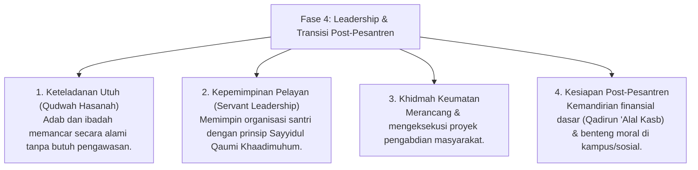

# P4-01-04: Fase Leadership dan Transisi Post-Pesantren (Tahun 3+)

## Status Dokumen
* **Status**: 🌟 **A+ (Tervalidasi & Siap Diimplementasikan)**
* **Sub-Domain**: `04 Progression Framework / 01 Development Stages`
* **Penanggung Jawab Keilmuan**: Dewan Keilmuan TUMBUH (*Pakar Tata Kelola Qudwah & Pakar Desain Kurikulum Adab*)

---

## 1. Konseptualisasi Fase Leadership & Post-Pesantren

Fase 4 merupakan puncak perjalanan perkembangan santri di pesantren (Tahun ke-3 hingga Kelulusan). Pada fase ini, santri dipersiapkan menjadi pemimpin teladan (*Qudwah Hasanah*), mentor bagi adik kelas, serta memiliki kesiapan penuh (*Readiness*) untuk memasuki kehidupan perguruan tinggi dan kemasyarakatan.

---

## 2. Eliminasi Feodalisme & Re-Strukturisasi Senioritas

Pesantren ekosistem **TUMBUH** secara tegas melarang budaya feodalisme senioritas, seperti:
- Pengorganisasian yang memanfaatkan junior untuk melayani kebutuhan pribadi senior.
- Penggunaan bahasa verbal kasar atau bentuk disiplin di luar batas wewenang PBIS.
- Penyiksaan fisik atau mental dalam kepanitiaan.

**Model Kepemimpinan Alternatif**: Senior T4 bertindak sebagai *Peer Mentor*, pelindung, dan pengayom adik kelas dengan kasih sayang dan kelembutan (*Ar-Rahmah*).

---

## 3. Matriks Kesiapan Post-Pesantren (Post-Pesantren Readiness)

| Dimensi Kesiapan | Indikator Capaian Utama | Strategi Pembekalan Fase 4 |
| :--- | :--- | :--- |
| **Kemandirian Moral & Aqidah** | Tetap konsisten menjaga ibadah wajib & sunnah di lingkungan luar pesantren yang heterogen. | Simulasi studi kasus dilema etika & benteng fikrah (*Tahshin Al-Fikr*). |
| **Kemandirian Finansial (*Kasb*)** | Menguasai literasi keuangan pribadi, perencanaan anggaran, & dasar wirausaha. | Proyek praktis *Qadirun 'Alal Kasb* & Magang Khidmah. |
| **Khidmah Keumatan** | Mampu memfasilitasi kegiatan keislaman masyarakat (mengajar TPA, menjadi khatib, dll). | Proyek Pengabdian Masyarakat (*Community Outreach Project*). |

---

## 4. Peran Musyrif & Scaffolding Decay (Bimbingan Kolaboratif 0–10%)

Pada Fase 4, peranan Musyrif bertransformasi penuh menjadi **Partner Kolaboratif & Penasihat Strategis**:
- Musyrif tidak lagi memberikan instruksi harian, melainkan menjadi rekan diskusi akademis dan organisasi.
- Mengadakan sesi *Mentoring One-on-One* berkala untuk mendukung perencanaan studi lanjut dan karier santri.
- Memberikan kepercayaan penuh kepada pengurus T4 dalam mengelola agenda besar santri dengan supervisi umum.
