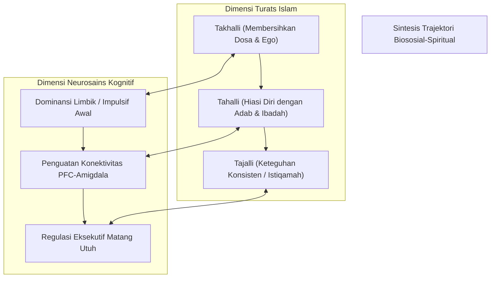

# P4-01-05: Sintesis Trajektori Biososial-Spiritual Santri TUMBUH

## Status Dokumen
* **Status**: 🌟 **A+ (Tervalidasi & Siap Diimplementasikan)**
* **Sub-Domain**: `04 Progression Framework / 01 Development Stages`
* **Penanggung Jawab Keilmuan**: Dewan Keilmuan TUMBUH (*Pakar Epistemologi Turats & Pakar Neurosains Perkembangan*)

---

## 1. Integrasi Turats & Neurosains Kognitif Remaja

Dokumen ini merangkum sintesis teoritis yang mempertemukan **Hukum Tazkiyatun Nafs** dari Turats Klasik (*Takhalli, Tahalli, Tajalli*) dengan konsensus **Neurosains Perkembangan Remaja** (*Maturasi Prefrontal Cortex & Dual-Systems Model*).

---

## 2. Matriks Integrasi Tahapan Perkembangan Makro

| Tahap Makro | Fase Tazkiyatun Nafs | Neurosains Kognitif | Tingkat Jenjang Kemandirian TUMBUH (J1–J4) | Peran Lingkungan (*Bi'ah*) |
| :--- | :--- | :--- | :--- | :--- |
| **Fase 1 (Orientasi)** | *Takhalli Awal*: Lepas dari kebiasaan rumah buruk. | Limbik sangat reaktif; PFC butuh *External Co-Regulation*. | **Jenjang J1** (Adaptasi) | Lingkungan aman emosi (*Psychological Safety*). |
| **Fase 2 (Habituasi)** | *Takhalli ke Tahalli*: Pembiasaan ibadah rutin. | *Myelination* sirkuit kebiasaan (*Habit Loop* di Basal Ganglia). | **Jenjang J2** (Habituasi) | Lingkungan kaya penguatan positif (*PBIS Matrix*). |
| **Fase 3 (Internalisasi)** | *Tahalli Matang*: Adab didasari *Mahabbah*. | Maturasi PFC; regulasi emosi mandiri (*Inhibitory Control*). | **Jenjang J3** (Internalisasi) | Lingkungan fasilitatif & dialogis. |
| **Fase 4 (Leadership)** | *Tajalli*: Konsistensi kebaikan (*Istiqamah*). | Integrasi sistem jaringan otak utuh (*Default Mode Network & Executive Network*). | **Jenjang J4** (Qudwah) | Lingkungan kepemimpinan & khidmah mandiri. |

---

## 3. Implikasi Praktis bagi Manajemen Pengasuhan Pesantren

1. **Anti-Pelabelan Permanen**: Karena otak remaja memiliki plastisitas tinggi (*Neuroplasticity*), pelanggaran santri di Fase 1 dan 2 tidak boleh dipandang sebagai karakter permanen, melainkan proses belajar regulasi diri yang sedang berkembang.
2. **Desain Lingkungan Berjenjang**: Lingkungan fisik dan aturan asrama dirancang untuk melonggarkan pengawasan secara gradual (*Scaffolding Decay*) seiring peningkatan usia dan tangga santri.
3. **Triad Pertumbuhan Simbiotik**: Perkembangan santri terjadi optimal ketika musyrif juga terus tumbuh dalam kompetensi pedagogi konseling dan lembaga menjamin SOP kerja yang manusiawi.
