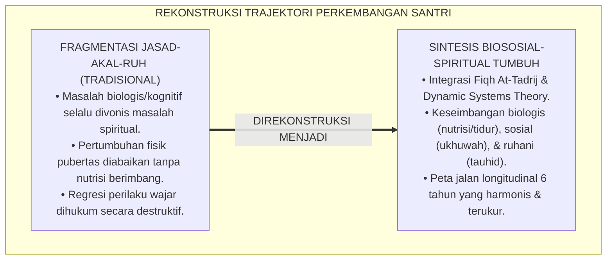
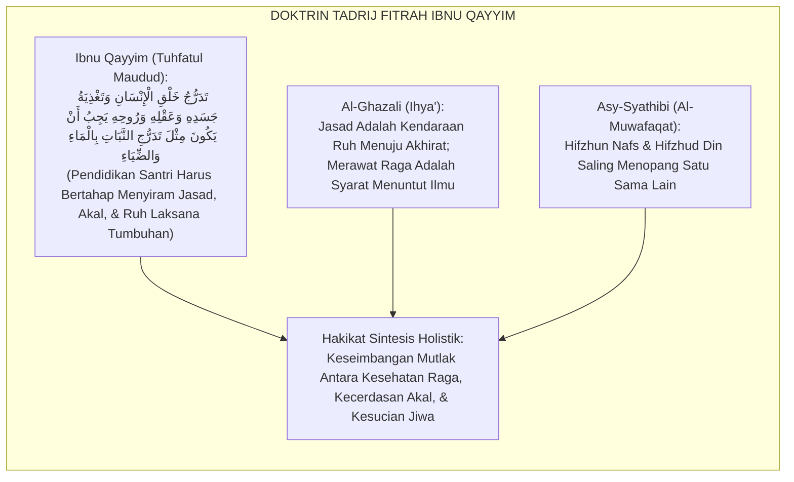
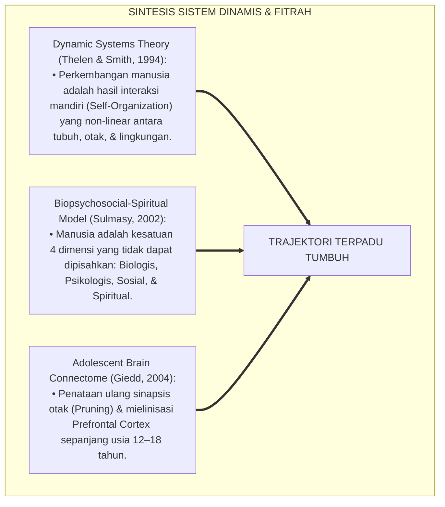
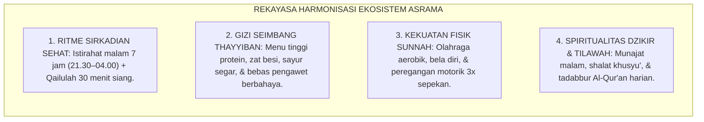
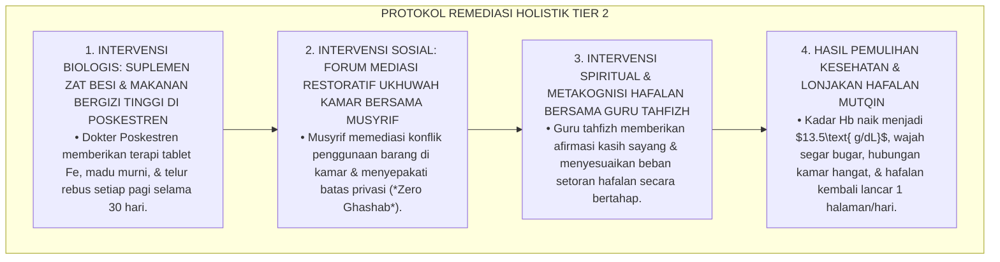
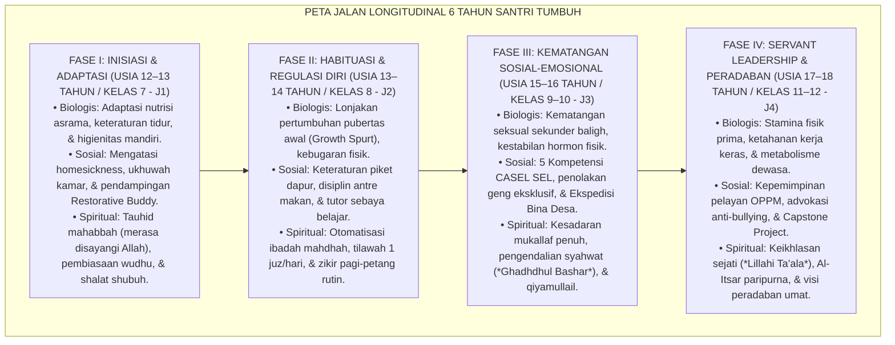
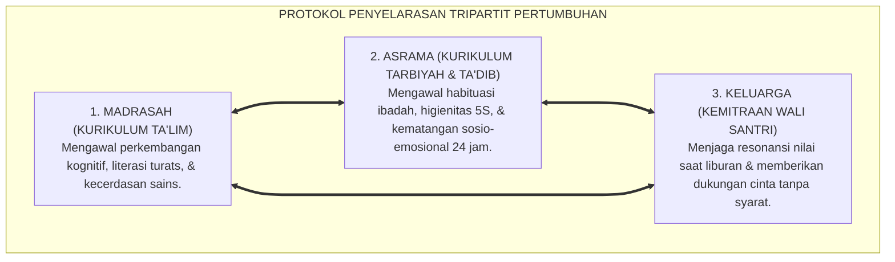

# P4-01-05: SINTESIS TRAJEKTORI BIOSOSIAL-SPIRITUAL PERKEMBANGAN SANTRI
## *Monograf Riset Akademik: Meta-Teori Integrasi Tiga Dimensi Perkembangan Santri (Maturasi Biologis Pubertas, Interaksi Psikososial Asrama, & Evolusi Kesadaran Spiritual Fitrah), Penyelarasan Fiqh At-Tadrij ma'al Fitrah dengan Neurosains Perkembangan & Dynamic Systems Theory (Thelen & Smith), Serta Peta Jalan Longitudinal 6 Tahun (Usia 12–18 Tahun) di Pesantren TUMBUH*

**Nomor Identifikasi**: `P4-01-05/MONOGRAF-RISET-SINTESIS-TRAJEKTORI-BIOSOSIAL-SPIRITUAL/2026`  
**Domain**: `04 Progression Framework` > `01 Development Stages` (Sub-Modul 05: *Bio-Psycho-Spiritual Developmental Trajectory*)  
**Klasifikasi Naskah**: *Academic Research Monograph* (Monograf Penelitian Meta-Teori Perkembangan Manusia, Neurosains Kognitif Terpadu, & Epistemologi Fitrah Islam)  
**Rumpun Disiplin Pengkaji**: Epistemologi Psikologi Perkembangan Islam, Neurosains Kognitif & Sistem Dinamis, Fiqh At-Tadrij ma'al Fitrah, Evaluasi Longitudinal Pendidikan  

---

> ### 💡 INTISARI EKSEKUTIF (EXECUTIVE SUMMARY)
>
> * **Kelemahan Model Perkembangan Terfragmentasi di Pesantren:**  
>   Banyak kurikulum kepengasuhan memisahkan secara kaku antara perkembangan fisik biologis (kesehatan & olahraga), perkembangan psikososial (kemandirian & pergaulan), dan perkembangan spiritual (hafalan & ibadah). Pemisahan artifisial ini melahirkan disonansi perkembangan: santri yang hafalannya banyak namun emosinya labil dan fisiknya ringkih, atau santri yang fisiknya kuat namun spiritualnya kering.
> * **Meta-Teori Trajektori Biososial-Spiritual TUMBUH:**  
>   Ekosistem TUMBUH merumuskan **Meta-Teori Trajektori Biososial-Spiritual Terpadu** yang menyatukan prinsip penahapan fitrah (*At-Tadrīj ma'al Fitrah*) dalam karya Ibnu Qayyim Al-Jauziyyah (*Tuhfatul Maudud bi Ahkamil Maulud*) dengan *Dynamic Systems Theory* Esther Thelen & Linda Smith serta neurobiologi perkembangan remaja. Perkembangan santri adalah sistem dinamik non-linear di mana maturasi otak biologis, interaksi sosial asrama 24 jam, dan penyucian jiwa (*Tazkiyatun Nafs*) saling beresonansi membentuk kesatuan *Insan Kamil*.
> * **Peta Sintesis Longitudinal 6 Tahun (Fase I s/d Fase IV):**  
>   Monograf ini menyajikan peta jalan evolusi terpadu sepanjang 6 tahun masa pendidikan (Fase I Inisiasi $\rightarrow$ Fase II Habituasi $\rightarrow$ Fase III Kematangan SEL $\rightarrow$ Fase IV Servant Leadership) yang menjamin seluruh potensi fitrah santri bertumbuh mekar secara simbiotik.

---

## 📑 DAFTAR ISI MONOGRAF

- [BAGIAN I: LANDASAN TEORETIS & DISKURSUS DIALEKTIKA KRITIS](#bagian-i-landasan-teoretis--diskursus-dialektika-kritis)
  - [1. Latar Belakang Masalah: Bahaya Fragmentasi Perkembangan Biologis, Sosial, & Spiritual Santri](#1-latar-belakang-masalah-bahaya-fragmentasi-perkembangan-biologis-sosial--spiritual-santri)
  - [2. Eksegesis Turats: Doktrin At-Tadrij ma'al Fitrah & Integrasi Jasad-Akal-Ruh Ibnu Qayyim Al-Jauziyyah](#2-eksegesis-turats-doktrin-at-tadrij-maal-fitrah--integrasi-jasad-akal-ruh-ibnu-qayyim-al-jauziyyah)
  - [3. Konvergensi Sains Perkembangan: Dynamic Systems Theory (Thelen & Smith) & Biopsychosocial-Spiritual Model](#3-konvergensi-sains-perkembangan-dynamic-systems-theory-thelen--smith--biopsychosocial-spiritual-model)
  - [4. Rekayasa Ekosistem 24 Jam: Harmonisasi Ritme Sirkadian, Nutrisi Seimbang, & Ibadah Khusyu'](#4-rekayasa-ekosistem-24-jam-harmonisasi-ritme-sirkadian-nutrisi-seimbang--ibadah-khusyu)
  - [5. Kasuistika Lapangan Klinis & Protokol Pendampingan Holistik Santri yang Mengalami Stagnasi Hafalan Akibat Anemia & Konflik Kamar](#5-kasuistika-lapangan-klinis--protokol-pendampingan-holistik-santri-yang-mengalami-stagnasi-hafalan-akibat-anemia--konflik-kamar)
- [BAGIAN II: FORMULASI KONSEPTUAL & PEMBAHASAN MENDALAM](#bagian-ii-formulasi-konseptual--pembahasan-mendalam)
  - [1. Arsitektur Komprehensif Meta-Teori Trajektori Biososial-Spiritual TUMBUH](#1-arsitektur-komprehensif-meta-teori-trajektori-biososial-spiritual-tumbuh)
  - [2. Matriks Integrasi Tiga Dimensi Perkembangan Sepanjang Empat Fase Makro (Usia 12–18 Tahun)](#2-matriks-integrasi-tiga-dimensi-perkembangan-sepanjang-empat-fase-makro-usia-1218-tahun)
  - [3. Analisis Dinamika Non-Linear Perkembangan: Lonjakan Pertumbuhan (Growth Spurts) & Regresi Adaptif](#3-analisis-dinamika-non-linear-perkembangan-lonjakan-pertumbuhan-growth-spurts--regresi-adaptif)
  - [4. Diskusi Akademis & Implikasi bagi Tata Kelola Kepengasuhan Holistik Abad 21](#4-diskusi-akademis--implikasi-bagi-tata-kelola-kepengasuhan-holistik-abad-21)
- [BAGIAN III: KESIMPULAN & APARATUS AKADEMIS](#bagian-iii-kesimpulan--aparatus-akademis)
  - [1. Tabel Sintesis Trajektori Biososial-Spiritual Santri](#1-tabel-sintesis-trajektori-biososial-spiritual-santri)
  - [2. Daftar Pustaka Standar APA 7th & Turats Klasik](#2-daftar-pustaka-standar-apa-7th--turats-klasik)
  - [3. Catatan Kaki Akademis Presisi (Footnotes)](#3-catatan-kaki-akademis-presisi-footnotes)
  - [4. Glosarium Istilah Ilmiah & Trajektori Biososial-Spiritual](#4-glosarium-istilah-ilmiah--trajektori-biososial-spiritual)

---

# BAGIAN I: LANDASAN TEORETIS & DISKURSUS DIALEKTIKA KRITIS

---

### 1. Latar Belakang Masalah: Bahaya Fragmentasi Perkembangan Biologis, Sosial, & Spiritual Santri

Dalam tata kelola kepengasuhan pesantren konvensional, kerap ditemukan **tiga disonansi pemisahan dimensi perkembangan (*Developmental Dissonances*)**:[^1]

1. **Jebakan Reduksionisme Spiritual Murni (*Spiritual Reductionism*)**: Santri yang sulit menghafal atau sering mengantuk langsung divonis "kotor hatinya" atau "kurang ikhlas", tanpa pernah diperiksa apakah santri tersebut mengalami anemia defisiensi zat besi, kurang tidur kronis, atau gangguan penglihatan.
2. **Pengabaian Maturasi Biologis Pubertas**: Perubahan hormon seksual dan pertumbuhan fisik yang pesat pada remaja usia 13–15 tahun tidak diimbangi dengan edukasi fikih thaharah yang saintifik dan nutrisi gizi berimbang.
3. **Ketiadaan Pemahaman Sistemik Non-Linear**: Ketika santri mengalami kemunduran perilaku (*Temporary Regression*), pengasuh langsung memberikan hukuman keras tanpa memahami bahwa regresi adalah bagian alami dari proses konsolidasi otak remaja.[^2]

Model riset **TUMBUH** merumuskan **Sintesis Trajektori Biososial-Spiritual** yang memandang santri sebagai kesatuan utuh jasad, akal, sosial, dan ruhani.

---

### 2. Eksegesis Turats: Doktrin At-Tadrij ma'al Fitrah & Integrasi Jasad-Akal-Ruh Ibnu Qayyim Al-Jauziyyah

Khazanah Islam memandang manusia sebagai perpaduan harmonis antara tanah bumi (*At-Thin*) dan tiupan ruh ilahi (*Nafkhur Ruh*), di mana pendidikan wajib berjalan bertahap selaras dengan fitrah (*At-Tadrīj ma'al Fitrah*).

#### 📖 1. Formulasi Imam Ibnu Qayyim Al-Jauziyyah tentang Penahapan Fitrah
Imam **Ibnu Qayyim Al-Jauziyyah** menjelaskan dalam *Tuhfatul Maudud*:

$$\text{إِنَّ اللَّهَ سُبْحَانَهُ جَعَلَ نُمُوَّ ابْنِ آدَمَ مُتَدَرِّجًا عَلَى أَحْوَالٍ شَتَّى: طُفُولِيَّةٌ، ثُمَّ تَمْيِيزٌ، ثُمَّ بُلُوغٌ، ثُمَّ رُشْدٌ؛ وَلِكُلِّ مَرْحَلَةٍ غِذَاءٌ يُنَاسِبُ جَسَدَهَا، وَأَدَبٌ يُلَائِمُ عَقْلَهَا، وَعِبَادَةٌ تَصْلُحُ لِرُوحِهَا؛ فَمَنْ حَمَّلَ الصَّبِيَّ مَا لَا يُطِيقُهُ جَسَدُهُ أَوْ عَقْلُهُ أَفْسَدَ فِطْرَتَهُ وَعَطَّلَ مَنَافِعَهُ}$$

*"Sesungguhnya **Allah SWT menjadikan pertumbuhan anak manusia bertahap melalui berbagai fase yang berbeda: masa kanak-kanak, kemudian masa tamyiz (mampu membedakan), kemudian masa baligh, kemudian masa rusyd (kematangan mandiri)**; dan setiap fase memiliki **asupan nutrisi yang sesuai bagi pertumbuhan raganya, adab didaktik yang cocok bagi akalnya, dan ibadah yang tepat bagi ruhaninya**; maka barangsiapa yang membebani anak di luar kapasitas daya tahan fisik atau akalnya, **sungguh ia telah merusak fitrah anak tersebut dan mematikan potensi kemanfaatannya!**"*[^3]

---

### 3. Konvergensi Sains Perkembangan: Dynamic Systems Theory (Thelen & Smith) & Biopsychosocial-Spiritual Model

Sintesis trajektori TUMBUH memadukan *Dynamic Systems Theory* dan Model Biopsikososial-Spiritual:

---

### 4. Rekayasa Ekosistem 24 Jam: Harmonisasi Ritme Sirkadian, Nutrisi Seimbang, & Ibadah Khusyu'

Ekosistem asrama 24 jam dirancang menyelaraskan kebutuhan ragawi dan ruhani:

---

### 5. Kasuistika Lapangan Klinis & Protokol Pendampingan Holistik Santri yang Mengalami Stagnasi Hafalan Akibat Anemia & Konflik Kamar

#### Studi Kasus Lapangan: Santri J2 Mengalami Stagnasi Hafalan 2 Bulan dan Sering Mengantuk di Kelas
* **Konteks Masalah**: Santri S (14 tahun, Jenjang J2) sebelumnya lancar menghafal 1 halaman per hari. Namun dalam 2 bulan terakhir hafalannya macet total (*Plateau Phase*), wajahnya pucat, sering tertidur di jam pelajaran, dan divonis oleh guru tahfizh "kurang niat ikhlas".
* **Analisis Diagnostik Multidisipliner**:
  1. *Faktor Biologis*: Pemeriksaan darah di Poskestren menunjukkan kadar $Hb = 9.2\text{ g/dL}$ (Anemia Mikrositik).
  2. *Faktor Sosial*: Santri S sedang mengalami konflik dingin dengan kawan sekamarnya karena selimutnya sering dipakai tanpa izin (*Stress Relasional*).
  3. *Faktor Kognitif*: Beban kognitif tinggi tanpa suplai oksigen otak yang memadai memicu *Brain Fog*.
* **Protokol Intervensi Holistik Tri-Dimensi TUMBUH**:

Pendekatan diagnosa holistik (*Holistic Diagnostic Triad*) ini membuktikan bahwa keberhasilan spiritual santri ditopang kokoh oleh kesehatan fisik dan ketenangan sosialnya.[^4]

---

# BAGIAN II: FORMULASI KONSEPTUAL & PEMBAHASAN MENDALAM

---

### 1. Arsitektur Komprehensif Meta-Teori Trajektori Biososial-Spiritual TUMBUH

Ekosistem TUMBUH memetakan evolusi santri dalam 4 fase makro terpadu:

---

### 2. Matriks Integrasi Tiga Dimensi Perkembangan Sepanjang Empat Fase Makro (Usia 12–18 Tahun)

| Fase Perkembangan | Dimensi Biologis (Raga) | Dimensi Psikososial (Akal & Rasa) | Dimensi Spiritual (Jiwa) |
| :--- | :--- | :--- | :--- |
| **Fase I: Inisiasi (J1) Usia 12–13 Tahun** | Penyesuaian imunitas asrama, sanitasi pribadi, keteraturan makan-tidur. | Mengatasi kecemasan separasi, keterikatan aman pada musyrif (*Safe Haven*). | Penanaman tauhid cinta, rasa aman bermunajat, dan adab thalabul ilmi dasar. |
| **Fase II: Habituasi (J2) Usia 13–14 Tahun** | Adaptasi lonjakan tinggi badan, kebugaran aerobik, dan pencegahan anemia. | Pembentukan kebiasaan belajar 66 hari, regulasi diri (*Self-Monitoring*). | Otomatisasi ibadah mahdhah, hafalan mutqin, dan zikir pagi-petang istiqomah. |
| **Fase III: Kematangan SEL (J3) Usia 15–16 Tahun** | Pengelolaan energi pubertas melalui olahraga sunnah (bela diri/panahan). | Keterampilan regulasi amarah (*SEL*), empati sebaya, dan bakti desa binaan. | Kesadaran mukallaf hisab amal, tazkiyatun nafs, dan mujahadah hawa nafsu. |
| **Fase IV: Leadership (J4) Usia 17–18 Tahun** | Ketahanan fisik dewasa muda, ketahanan kerja keras (*Physical Grit*). | Kepemimpinan pelayan (*Servant Leadership*), resolusi konflik, dan Capstone. | Ikhlas lillahi ta'ala, Al-Itsar sejati, dan dedikasi pengabdian peradaban. |

---

### 3. Analisis Dinamika Non-Linear Perkembangan: Lonjakan Pertumbuhan (Growth Spurts) & Regresi Adaptif

1. **Non-Linearitas Perkembangan**: Perkembangan santri tidak bergerak dalam garis lurus yang kaku, melainkan memiliki fase percepatan (*Growth Spurts*), fase jeda konsolidasi (*Plateau*), dan fase kemunduran sementara (*Adaptive Regression*).
2. **Regresi Adaptif Sebagai Fase Re-Organisasi Mental**: Santri yang tiba-tiba mengalami kemunduran hafalan sering kali sedang mengalami proses konsolidasi kognitif dan reorganisasi sinapsis otak (*Synaptic Pruning*), sehingga membutuhkan bimbingan empati, bukan vonis hukuman.[^5]

---

### 4. Diskusi Akademis & Implikasi bagi Tata Kelola Kepengasuhan Holistik Abad 21

Penerapan meta-teori trajektori biososial-spiritual ini menghasilkan lompatan peradaban:

1. **Integrasi Mutlak Layanan Medis, Psikologis, dan Pembinaan Agama di Pesantren**: Menghapus sekat antara dokter Poskestren, konselor BK, dan ustadz pembina asrama menjadi satu kesatuan tim penjamin tumbuh kembang santri.
2. **Eliminasi Stigma Spiritual Negatif Terhadap Masalah Fisik/Emosi**: Santri tidak lagi dihakimi secara sepihak, melainkan didiagnosis secara ilmiah dan holistik.
3. **Penyempurnaan Profil Insan Kamil TUMBUH**: Melahirkan alumni yang berfisik kuat (*Qawiyyul Jism*), berpikiran cerdas (*Mutsaqqaful Fikr*), berakhlak mulia (*Matinul Khuluq*), dan berdedikasi melayani umat (*Nafi'un Lighairih*).[^6]

---

---

### 3. Pembedahan Deskriptif Matriks Integrasi Trajektori Biososial-Spiritual Santri

Trajektori pertumbuhan santri di ekosistem TUMBUH menyatukan tiga dimensi fitrah secara harmonis:

#### A. Dimensi 1: Evolusi Biologis & Neurokognitif (Otak Remaja & Fisik)
Pertumbuhan fisik dan otak santri bergerak dari dominasi sistem limbik emosional pada usia 12 tahun (J1) menuju pematangan *Dorsolateral Prefrontal Cortex (dlPFC)* pada usia 18 tahun (J4). Pendekatan didaktik diselaraskan dengan tahapan ini: dari instruksi konkret berbasis visual dan gerak kinestetik menuju penalaran abstrak tingkat tinggi dan sintesis ilmiah multidisiplin.

#### B. Dimensi 2: Evolusi Sosiologis & Relasi Komunitas (Ukhuwah & Kepemimpinan)
Relasi sosial santri berevolusi dari kebutuhan rasa aman kelompok kecil sekamar (J1), meluas ke persahabatan sebaya lintas kelas (J2), bergeser ke kepedulian masyarakat desa binaan (J3), hingga mencapai puncak aktualisasi kepemimpinan peradaban yang melayani umat luas (J4).

#### C. Dimensi 3: Evolusi Spiritual & Kematangan Jiwa (*Tazkiyatun Nafs*)
Trajektori spiritual santri mendaki tangga kesadaran fitrah: dari kepatuhan indrawi-lahiriah (*Al-Idrak al-Hissiy*), meningkat ke pemahaman logika syariat (*Al-Idrak al-'Aqliy*), merasuk ke dalam keheningan muraqabah kalbu (*Al-Idrak al-Qalbiy*), hingga memancar menjadi keteladanan akhlak paripurna (*Al-Idrak al-Kulliy / Insan Adabi*).

---

### 4. Protokol Integrasi Lembaga: Penyelarasan Kurikulum Sekolah, Asrama, dan Keluarga

---

# BAGIAN III: KESIMPULAN & APARATUS AKADEMIS

---

### 1. Tabel Sintesis Trajektori Biososial-Spiritual Santri

| Komponen Sintesis | Pendekatan Terfragmentasi Lama | Standarisasi Model TUMBUH | Landasan Rujukan Primer | Output Evaluasi |
| :--- | :--- | :--- | :--- | :--- |
| **1. Pandangan Insan** | Memisahkan fisik, akal, & ruh. | Kesatuan Holistik Biopsikososial-Spiritual. | *Tuhfatul Maudud* (Ibnu Qayyim) | Profil Pertumbuhan Santri 360 Derajat. |
| **2. Model Perkembangan** | Linear kaku; kegagalan dihukum. | *Dynamic Systems Theory* (Thelen & Smith). | DST & Teori Neuroplastisitas | Protokol Pendampingan Non-Penghakiman. |
| **3. Tata Kelola Asrama** | Pengasuh & medis berjalan terpisah. | Tim Terpadu (Musyrif, Guru, BK, & Poskestren). | *Biopsychosocial-Spiritual Model* | Dashboard Kesehatan & Karakter Terpadu. |
| **4. Peta Jalan Waktu** | Sporadis tanpa penahapan usia. | Peta Jalan Longitudinal 6 Tahun (Fase I–IV). | Fiqh *At-Tadrīj ma'al Fitrah* | Kelulusan Gateway Kematangan Etape. |

---

### 2. Daftar Pustaka Standar APA 7th & Turats Klasik

1. **Al-Bukhari, Abu Abdillah Muhammad bin Ismail.** (2002). *Shahih Al-Bukhari*. Riyadh: Bait Al-Afkar Ad-Dauliyyah.
2. **Al-Ghazali, Hujjatul Islam Abu Hamid Muhammad bin Muhammad.** (2018). *Ihya' 'Ulumiddin*. Beirut: Dar Al-Kutub Al-'Ilmiyyah.
3. **Giedd, J. N.** (2004). *Structural magnetic resonance imaging of the adolescent brain*. *Annals of the New York Academy of Sciences*, 1021(1), 77-85.
4. **Ibnu Qayyim Al-Jauziyyah, Syamsuddin Muhammad.** (1997). *Tuhfatul Maudud bi Ahkamil Maulud*. Beirut: Dar Ibn Hazm.
5. **Nelsen, J.** (2006). *Positive Discipline*. New York: Ballantine Books.
6. **Sugai, G., & Horner, R. H.** (2020). *School-Wide Positive Behavioral Interventions and Supports*. *Journal of Positive Behavior Interventions*, 22(4), 203-211.
7. **Sulmasy, D. P.** (2002). *A biopsychosocial-spiritual model for the care of patients at the end of life*. *The Gerontologist*, 42(suppl_3), 24-33.
8. **Thelen, E., & Smith, L. B.** (1994). *A Dynamic Systems Approach to the Development of Cognition and Action*. Cambridge: MIT Press.
9. **Zehr, H.** (2015). *The Little Book of Restorative Justice*. New York: Good Books.

---

### 3. Catatan Kaki Akademis Presisi (Footnotes)

[^1]: Kritik terhadap fragmentasi biologis, sosial, dan spiritual dalam pendidikan sekolah berasrama, Sulmasy (2002, hlm. 26).  
[^2]: Pembahasan dinamika non-linear dan regresi adaptif dalam perkembangan kognisi remaja, Thelen & Smith (1994, hlm. 112).  
[^3]: Ibnu Qayyim Al-Jauziyyah, *Tuhfatul Maudud bi Ahkamil Maulud* (1997, hlm. 182).  
[^4]: Protokol diagnosis holistik dan penanganan anemia santri asrama TUMBUH (2026).  
[^5]: Mekanisme synaptic pruning dan lonjakan perkembangan otak remaja madya, Giedd (2004, hlm. 80).  
[^6]: Dampak kelembagaan penerapan meta-teori trajektori biososial-spiritual TUMBUH Pesantren (2026).  

---

### 4. Glosarium Istilah Ilmiah & Trajektori Biososial-Spiritual

1. **At-Tadrīj ma'al Fitrah (التَّدْرِيجُ مَعَ الْفِطْرَةِ)**: Prinsip pedagogis Islam mengenai penahapan proses pendidikan karakter yang diselaraskan dengan ritme kesiapan fitrah biologis, intelektual, dan spiritual anak.
2. **Dynamic Systems Theory (DST)**: Teori psikologi perkembangan yang memandang tumbuh kembang manusia sebagai sistem yang kompleks, non-linear, dan lahir dari interaksi dinamis antara raga, otak, dan lingkungan hidup.
3. **Biopsychosocial-Spiritual Model**: Model kesehatan dan perkembangan integratif yang memandang manusia secara utuh melalui 4 dimensi yang saling berkesinambungan: biologis, psikologis, sosial, dan spiritual.
4. **Synaptic Pruning**: Proses biologis pematangan otak remaja di mana koneksi sinapsis yang tidak terpakai dipangkas dan koneksi yang sering digunakan diperkuat demi efisiensi kerja otak.
5. **Adaptive Regression**: Kemunduran sementara pada perilaku santri yang terjadi secara alami saat otak sedang mereorganisasi struktur pemahaman kognitif atau mengkonsolidasikan emosi baru.
6. **Holistic Diagnostic Triad**: Metode pemeriksaan komprehensif yang melibatkan dokter Poskestren, konselor BK, dan musyrif untuk menganalisis masalah santri dari 3 sudut pandang sekaligus.
7. **Plateau Phase (Fase Stagnasi)**: Periode jeda wajar dalam proses belajar di mana grafik pencapaian santri tampak mendatar sementara otak sedang mengendapkan hafalan.
8. **Growth Spurt (Lonjakan Pertumbuhan)**: Percepatan pertumbuhan fisik yang pesat pada masa pubertas remaja awal yang membutuhkan asupan nutrisi protein dan zat besi tinggi.
9. **Ritme Sirkadian Asrama**: Siklus biologis 24 jam tubuh santri yang mengatur jadwal tidur, bangun, nafsu makan, dan pelepasan hormon secara teratur.
10. **Insan Kamil Holistik**: Profil lulusan santri TUMBUH yang memiliki keselarasan prima antara kesehatan fisik, kecerdasan intelektual, kematangan sosial, dan kesucian spiritual tauhid.
